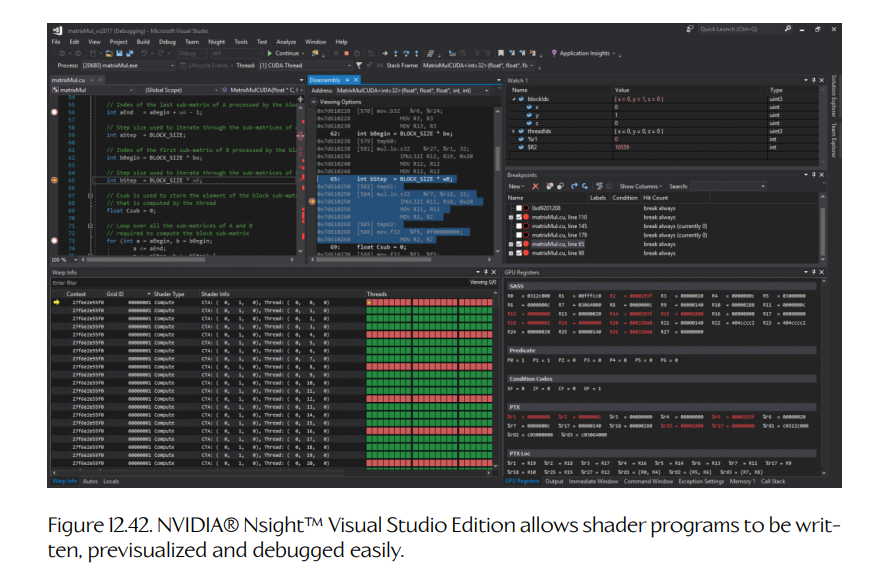
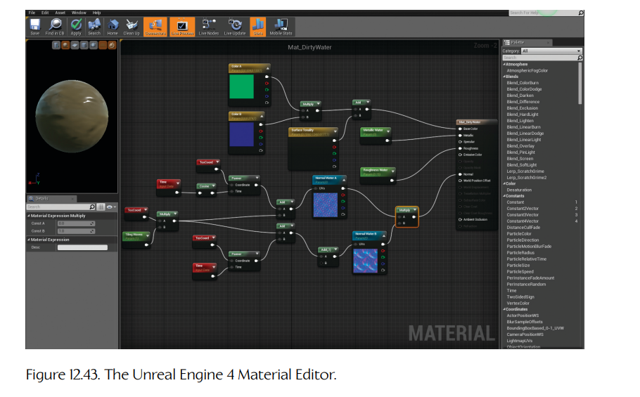
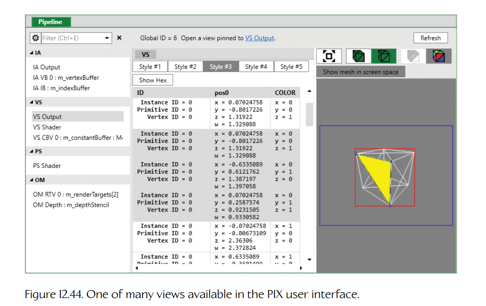

## 12.9 开发与调试工具

3D 渲染引擎是一个复杂的庞然大物，它由同时运行在 CPU 和 GPU 上的软件组成。但运行时渲染引擎只是整个 3D 渲染问题的一部分。我们还需要大量离线工具来帮助创作内容、优化性能并诊断问题。在本节中，我们会简要了解一些最常用的 3D 渲染工具。

### 12.9.1 数字内容创作工具

在**工具阶段**（tools stage），网格通常由 3D 建模师在 Maya、3ds Max、Lightwave、Softimage/XSI、SketchUp、ZBrush 等**数字内容创作**（digital content creation，DCC）应用程序中创作。模型可以使用任何方便的曲面描述方式来定义——NURBS、四边形、三角形等。然而，在运行时管线的光栅化阶段之前，它们最终总会被细分为三角形。这种细分可能作为**资产调制阶段**（asset conditioning stage）的一部分离线完成（见 Section 12.9.3），也可能借助自定义的外壳着色器、域着色器和/或几何着色器，在 GPU 上由曲面细分引擎实时完成（见 Section 11.4.6.1）。

网格的顶点也可以进行**蒙皮**（skinning）。这涉及将每个顶点与关节化骨架结构中的一个或多个关节关联起来，并为每个关节相对于该顶点的影响程度指定权重。蒙皮信息和骨架会被动画系统使用，用来驱动模型的运动——更多细节见 Chapter 13。

材质也由美术人员在工具阶段定义。这包括为每个材质选择着色器、选择该着色器所需的纹理，并指定每个着色器的配置参数和选项。纹理会被映射到曲面上，其他顶点属性也会被定义；这些工作通常通过在 DCC 应用程序中使用某种直观工具来“绘制”完成。

**Figure 12.42.** NVIDIA® Nsight™ Visual Studio Edition 允许用户方便地编写、预览和调试着色器程序。

### 12.9.2 材质编辑器

材质通常使用商业材质编辑器或自研材质编辑器来创作。材质编辑器有时会作为插件直接集成到 DCC 应用程序中，也可能是一个独立程序。有些材质编辑器会与游戏实时联动，使材质创作者可以看到材质在真实游戏中的外观。另一些编辑器则提供离线 3D 可视化视图。某些编辑器甚至允许美术人员或着色器工程师编写并调试着色器程序。这类工具允许用户用鼠标把各种节点连接起来，从而快速原型化视觉效果。这些工具通常会提供所生成材质的 WYSIWYG（所见即所得）显示。NVIDIA 的 Fx Composer 就是这样一种工具。遗憾的是，NVIDIA 已经不再更新 Fx Composer，而且它只支持到 DirectX 10 的着色器模型。不过，NVIDIA 提供了一个新的 Visual Studio 插件，名为 NVIDIA® Nsight™ Visual Studio Edition。如 Figure 12.42 所示，Nsight 提供了强大的着色器创作与调试设施。Unreal Engine 也提供了一个图形化着色器编辑器，称为 Material Editor；它如 Figure 12.43 所示。

材质可以随各个网格一起存储和管理。然而，这可能导致数据和工作量的重复。在许多游戏中，可以用相对较少数量的材质来定义游戏中的大量对象。例如，我们可以定义一些标准的、可复用的材质，如木材、岩石、金属、塑料、布料、皮肤等。没有必要在每个网格内部都重复这些材质。相反，许多游戏团队会建立一个材质库供选择，而各个网格则以一种松耦合的方式引用这些材质。

**Figure 12.43.** Unreal Engine 4 材质编辑器。

### 12.9.3 资产调制管线

**资产调制阶段**（asset conditioning stage）本身也是一条管线，有时称为**资产调制管线**（asset conditioning pipeline，ACP）或**工具管线**（tools pipeline）。正如 Section 7.2.1.4 中所见，它的工作是导出、处理并链接多种类型的资产，使其形成一个协调一致的整体。例如，一个 3D 模型由几何体（顶点缓冲区和索引缓冲区）、材质、纹理以及可选的骨架组成。ACP 确保 3D 模型引用的所有独立资产都可用，并且已经准备好由引擎加载。

几何数据和材质数据从 DCC 应用程序中提取出来，通常会存储为一种平台无关的中间格式。随后，这些数据会被进一步处理为一种或多种平台专用格式，具体取决于引擎支持多少目标平台。理想情况下，这一阶段生成的平台专用资产应该能够以很少甚至无需运行时后处理的方式加载到内存中并直接使用。例如，面向 Xbox Series X 或 PS5 的网格数据可能会输出为 GPU 可直接消费的索引缓冲区和顶点缓冲区；而在 PS3 时代，几何体可能会被生成为压缩数据流，并准备好通过 DMA 传输到 SPU 上进行解压。ACP 在构建资产时通常还会考虑材质/着色器的需求。例如，某个特定着色器可能需要切线向量、副切线向量以及顶点法线；ACP 可以自动生成这些向量。

在 Section 11.5.3 中我们学到，**场景图**（scene graph）数据结构可以帮助渲染引擎在给定摄像机位置和朝向时，非常快速地判断哪些对象应该被渲染。这些数据结构通常会在资产调制阶段生成。例如，静态关卡几何体可能会被处理，以构建 BSP 树、四叉树、八叉树、包围球层次结构，或用于实时光线追踪的 TLAS/BLAS 加速结构。

昂贵的光照计算通常会作为资产调制阶段的一部分离线完成。这称为**静态光照**（static lighting）；它可能包括计算网格顶点处的光照颜色（这称为“烘焙”的顶点光照）、构建用于编码逐像素光照信息的纹理贴图（称为**光照贴图**，light maps）、计算**预计算辐射亮度传输**（precomputed radiance transfer，PRT）系数（通常用球谐函数表示），等等。

### 12.9.4 GPU 捕获、检查与回放（Razor GPU、PIX）

编写和调试 3D 渲染引擎可能是一项令人望而生畏的任务。一个典型场景由数百万个三角形、数十万个网格实例和数百个着色器组成。当某些地方出错时，要在所有这些数据中筛查并确定问题来源，可能会非常困难。

如果有优秀的工具辅助，调试 GPU 的任务会容易得多。幸运的是，在 Windows、Xbox 和 PlayStation 平台上都有这样的工具可用。对于 Windows 和 Xbox，一个名为 PIX 的强大工具是常用选择。在 PlayStation 上，也有一个类似强大的工具 Razor GPU 可供图形开发人员使用。这些工具允许我们在渲染过程中**捕获**（capture）某个已渲染帧的全部细节。一旦完成捕获，PIX 和 Razor GPU 都允许用户“深入钻取”用于渲染该帧的命令列表、资源、纹理贴图、渲染目标以及着色器程序。你可以在命令列表中选择单个命令，查看渲染场景在命令流中执行到该点时的进展，查看当时使用了哪些纹理、缓冲区和其他资源，并检查着色器源代码。你也可以使用 PIX 和 Razor GPU 进行性能捕获，并仔细分析渲染引擎和着色器的效率。

PIX 用户界面如 Figure 12.44 所示。关于 PIX 的更多信息，见 [297]。Razor GPU 的文档作为 PlayStation SDK 的一部分提供，但遗憾的是，如果没有 PlayStation 开发者许可证，无法在线获取。

**Figure 12.44.** PIX 用户界面中可用的众多视图之一。
