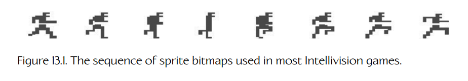
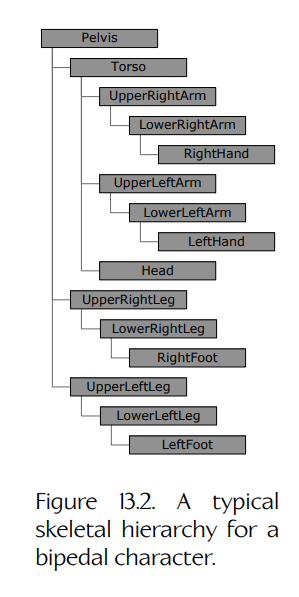
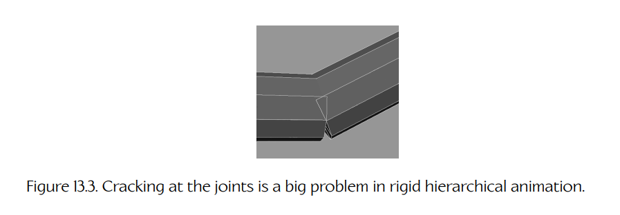
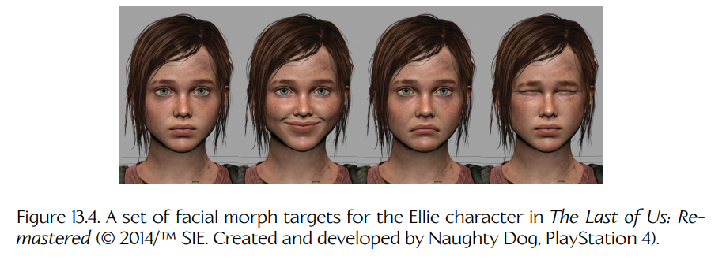
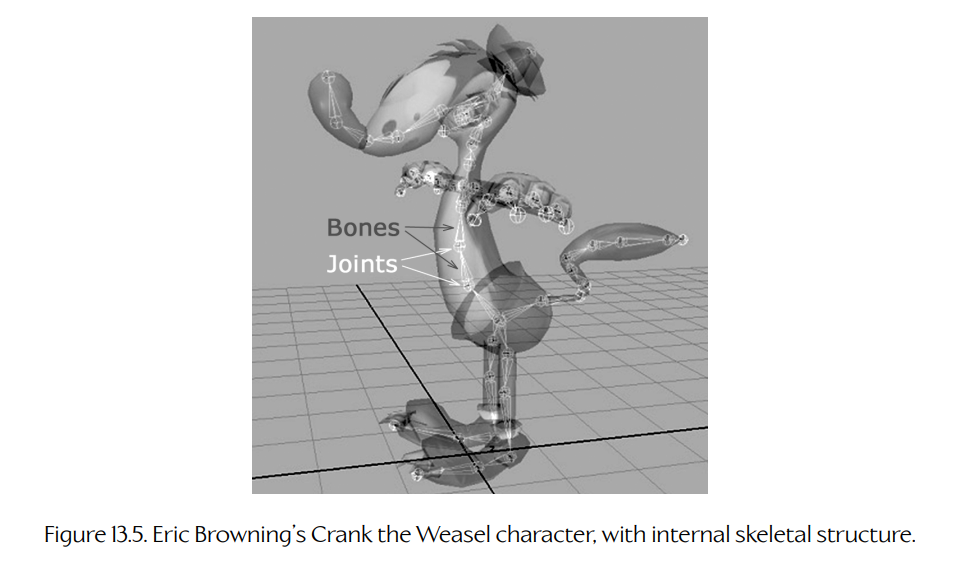

## 13.1 角色动画的类型

自《大金刚》（Donkey Kong）以来，角色动画技术已经走过了很长一段路。最初，游戏使用非常简单的技术来制造逼真运动的错觉。随着游戏硬件性能的提升，更高级的技术开始能够实时运行。如今，游戏设计师可以使用大量强大的动画方法。在本节中，我们将简要回顾角色动画的发展过程，并概述现代游戏引擎中最常用的三种技术。

### 13.1.1 赛璐珞动画

所有游戏动画技术的前身被称为**传统动画**（traditional animation），或**手绘动画**（hand-drawn animation）。这是最早期动画片中使用的技术。运动的错觉是通过快速连续显示一系列称为**帧**（frames）的静态图片来产生的。实时 3D 渲染可以被看作传统动画的一种电子形式，因为它会一次又一次地向观看者呈现一系列静态的全屏图像，从而产生运动的错觉。

**赛璐珞动画**（cel animation）是传统动画的一种特定类型。**赛璐珞片**（cel）是一张透明塑料薄片，图像可以被绘制或描画在其上。一系列赛璐珞片构成的动画序列可以叠放在固定的背景绘画或背景图之上，从而产生运动错觉，而不必一遍又一遍地重绘静态背景。

赛璐珞动画的电子等价形式是一种称为**精灵动画**（sprite animation）的技术。**精灵**（sprite）是一张小型位图，它可以叠加在全屏背景图像之上而不破坏背景，通常借助专用图形硬件进行绘制。因此，精灵之于 2D 游戏动画，就如同赛璐珞片之于传统动画。这项技术是 2D 游戏时代的核心方法。Figure 13.1 展示了一组著名的精灵位图序列，几乎所有 Mattel Intellivision 游戏都会使用它来产生类人角色奔跑的错觉。这组帧被设计成即使无限重复播放也能平滑运动——这称为**循环动画**（looping animation）。按照现代说法，这个具体动画会被称为**奔跑循环**（run cycle），因为它使角色看起来正在奔跑。角色通常拥有若干循环动画周期，包括各种待机循环、行走循环和奔跑循环。

**Figure 13.1.** 大多数 Intellivision 游戏中使用的精灵位图序列。

### 13.1.2 刚性层级动画

早期 3D 游戏，如《毁灭战士》（Doom），仍然使用类似精灵的动画系统：其中的怪物不过是面向摄像机的四边形，每个四边形显示一系列纹理位图（称为**动画纹理**，animated texture），以产生运动错觉。直到今天，这项技术仍然被用于低分辨率对象和/或远处对象，例如体育场中的人群，或远处背景中正在战斗的一大群士兵。但对于高质量的前景角色来说，3D 图形带来了对改进角色动画方法的需求。

最早的 3D 角色动画方法是一种称为**刚性层级动画**（rigid hierarchical animation）的技术。在这种方法中，角色被建模为一组刚性部件。一个典型的类人角色可以被分解为骨盆、躯干、上臂、前臂、大腿、小腿、手、脚和头部。这些刚性部件以层级方式彼此约束，类似于哺乳动物的骨骼在关节处相互连接的方式。这使角色能够自然运动。例如，当上臂移动时，前臂和手会自动跟随。典型层级结构会以骨盆为根节点，躯干和大腿作为其直接子节点，依此类推，如 Figure 13.2 所示。

刚性层级技术的主要问题在于，由于关节处会出现“裂缝”（cracking），角色身体的表现通常并不令人满意。Figure 13.3 展示了这一点。刚性层级动画非常适合机器人和确实由刚性部件构成的机械装置，但当它被用于“有血有肉”的角色时，经不起仔细观察。

**Figure 13.2.** 双足角色的典型骨骼层级结构。

**Figure 13.3.** 关节处出现裂缝是刚性层级动画中的一个严重问题。

### 13.1.3 逐顶点动画与变形目标

刚性层级动画往往显得不自然，因为它是刚性的。我们真正想要的是一种能够移动单个顶点的方法，使三角形可以发生拉伸，从而产生更自然的运动。

实现这一点的一种方法是采用一种暴力式技术，称为**逐顶点动画**（per-vertex animation）。在这种方法中，网格的顶点由美术师制作动画，并导出运动数据，告诉游戏引擎在运行时如何移动每个顶点。这项技术可以产生任何可以想象的网格变形效果（唯一限制是表面的细分程度）。然而，它是一种数据密集型技术，因为必须为网格中的每个顶点存储随时间变化的运动信息。正因为如此，它很少应用于实时游戏。

**Figure 13.4.** 《The Last of Us: Remastered》中 Ellie 角色的一组面部变形目标（© 2014/TM SIE。由 Naughty Dog 创建并开发，PlayStation 4）。

这项技术的一种变体称为**变形目标动画**（morph target animation），它被用于一些实时游戏中。在这种方法中，网格顶点由动画师移动，以创建一组相对较小的固定极端姿态。动画是在运行时通过在两个或更多这些固定姿态之间进行**混合**（blending）而产生的。每个顶点的位置通过在该顶点于各个极端姿态中的位置之间进行简单线性插值（lerp）来计算。

变形目标技术常用于面部动画，因为人脸是极其复杂的解剖结构，大约由 50 块肌肉驱动。变形目标动画让动画师能够完全控制面部网格的每一个顶点，使他们能够生成细微或夸张的运动，并很好地近似面部肌肉系统。Figure 13.4 展示了一组面部变形目标。

随着计算能力持续提升，一些工作室开始使用包含数百个关节的关节式面部绑定（jointed facial rigs），作为变形目标的替代方案。另一些工作室则将这两种技术结合起来：使用关节式绑定实现面部的主要姿态，然后通过变形目标进行小幅调整。

### 13.1.4 蒙皮动画

随着游戏硬件能力进一步提升，一种称为**蒙皮动画**（skinned animation）的动画技术被开发出来。这项技术具有逐顶点动画和变形目标动画的许多优点——允许动画网格中的三角形发生变形。同时，它又具备刚性层级动画在性能和内存使用方面更高效的特性。它能够对皮肤和衣物的运动产生相当真实的近似效果。

蒙皮动画最早被《超级马力欧 64》（Super Mario 64）等游戏使用，如今它仍然是最流行的技术，在游戏行业和故事片电影行业中都被广泛采用。许多著名的现代游戏和电影角色，包括《侏罗纪公园》（Jurassic Park）中的恐龙、Solid Snake（《合金装备 4》，Metal Gear Solid 4）、Gollum（《指环王》，Lord of the Rings）、Nathan Drake（《神秘海域》，Uncharted）、Buzz Lightyear（《玩具总动员》，Toy Story）、Marcus Fenix（《战争机器》，Gears of War）以及 Joel（《The Last of Us》），都全部或部分使用蒙皮动画技术进行动画制作。本章剩余部分将主要用于研究蒙皮/骨骼动画。

**Figure 13.5.** Eric Browning 的角色 Crank the Weasel，以及其内部骨骼结构。

在蒙皮动画中，会像刚性层级动画一样，用刚性“骨骼”（bones）构建一个**骨架**（skeleton）。不过，与其将这些刚性部件渲染到屏幕上，不如让它们保持隐藏。一个称为**蒙皮**（skin）的平滑连续三角形网格会绑定到骨架的关节上；它的顶点会跟随关节的运动。蒙皮网格中的每个顶点可以被赋予多个关节的权重，因此当关节移动时，蒙皮可以以自然方式拉伸。

在 Figure 13.5 中，我们看到的是 Crank the Weasel，这是 Eric Browning 于 2001 年为 Midway Home Entertainment 设计的一个游戏角色。Crank 的外层皮肤由三角形网格组成，就像其他任何 3D 模型一样。然而，在他的内部，我们可以看到让其皮肤运动的刚性骨骼和关节。

### 13.1.5 作为数据压缩技术的动画方法

可以设想的最灵活动画系统，会让动画师能够控制对象表面上几乎每一个无限小的点。当然，像这样制作动画会导致动画中包含潜在无限数量的数据！对三角形网格的顶点进行动画化，是对这一理想情况的简化——实际上，我们通过将自己限制为只移动顶点，来**压缩**描述动画所需的信息量。（对于由高阶曲面片构成的模型来说，对一组控制点进行动画化，类似于对顶点进行动画化。）变形目标可以被看作额外一层压缩，它通过向系统施加额外约束来实现——顶点被限制为只能沿着固定数量的预定义顶点位置之间的线性路径运动。骨骼动画则是另一种通过施加约束来压缩顶点动画数据的方法。在这种情况下，大量顶点的运动被约束为跟随数量相对较少的骨骼关节的运动。

在考虑各种动画技术之间的权衡时，将它们视为压缩方法会很有帮助，在许多方面类似于视频压缩技术。一般来说，我们应该选择这样一种动画方法：它能提供最佳压缩效果，同时不会产生不可接受的视觉伪影。当单个关节的运动被放大为许多顶点的运动时，骨骼动画能够提供最佳压缩效果。角色的四肢在很大程度上像刚体一样运动，因此可以用骨架非常高效地移动。然而，面部运动往往复杂得多，单个顶点的运动更加独立。若要使用骨骼方法令人信服地制作面部动画，所需关节数量会接近网格中的顶点数量，从而削弱它作为压缩技术的有效性。这就是为什么在面部动画中，变形目标技术通常比骨骼方法更受青睐的原因之一。（另一个常见原因是，变形目标往往是动画师更自然的工作方式。）
