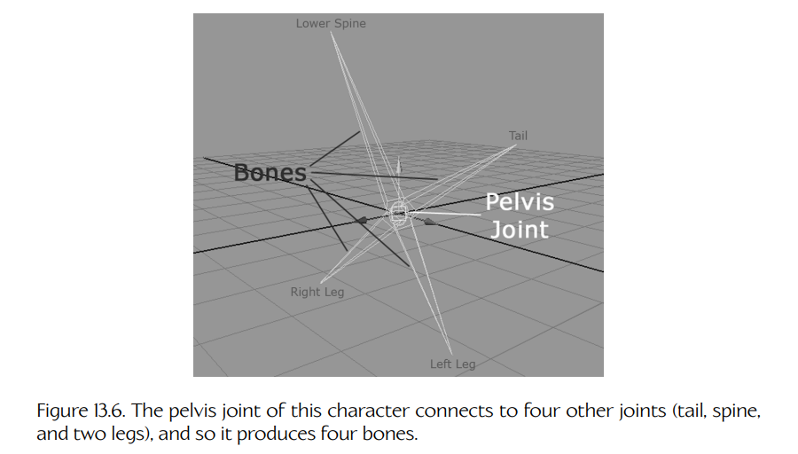
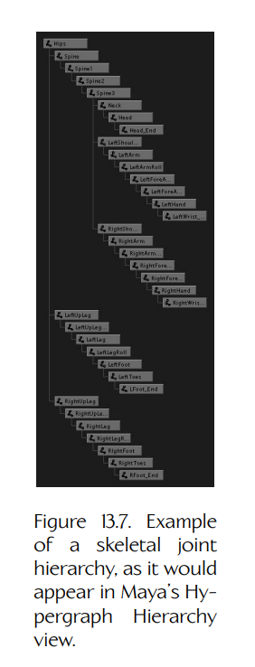

## 13.2 骨架

**骨架**（skeleton）由一组称为**关节**（joints）的刚性部件按照层级结构组成。在游戏行业中，我们常常把“关节”（joint）和“骨骼”（bone）这两个术语互换使用，但“骨骼”这个说法其实并不准确。严格来说，关节才是动画师直接操控的对象，而骨骼只是关节之间的空白空间。举例来说，考虑 Crank the Weasel 角色模型中的骨盆关节。它本身只是一个关节，但由于它连接到另外四个关节（尾巴、脊柱，以及左右髋关节），所以这个关节看起来像是伸出了四根骨骼。Figure 13.6 更详细地展示了这一点。游戏引擎其实完全不关心骨骼——只有关节才重要。因此，每当你在行业中听到“骨骼”这个术语时，请记住，99% 的情况下，我们实际上谈论的是关节。

**Figure 13.6.** 该角色的骨盆关节连接到另外四个关节（尾巴、脊柱和两条腿），因此产生了四根骨骼。

### 13.2.1 骨骼层级结构

如前所述，骨架中的关节构成一个层级结构或树结构。其中一个关节被选为**根节点**（root），其他所有关节都是它的子节点、孙节点，依此类推。用于蒙皮动画的典型关节层级结构看起来几乎与典型刚性层级结构完全相同。例如，一个类人角色的关节层级结构可能类似于 Figure 13.7 所示。

**Figure 13.7.** 一个骨骼关节层级结构示例，它在 Maya 的 Hypergraph Hierarchy 视图中大致会呈现为这种形式。

我们通常会为每个关节分配一个从 0 到 $N - 1$ 的索引。由于每个关节有且只有一个父关节，因此只要为每个关节存储其父关节的索引，就可以完整描述骨架的层级结构。根关节没有父节点，因此它的父索引通常会被设置为某个无效值，例如 $-1$。

### 13.2.2 在内存中表示骨架

骨架通常由一个较小的顶层数据结构表示，该结构包含一个数组，数组中存放各个关节的数据结构。关节通常会按照这样一种顺序排列：子关节在数组中总是出现在其父关节之后。这意味着 0 号关节总是骨架的根节点。

**关节索引**（joint indices）通常用于在动画数据结构中引用关节。例如，子关节通常通过指定其父关节的索引来引用父关节。同样，在蒙皮三角形网格中，顶点会通过索引引用它所绑定到的一个或多个关节。这比按名称引用关节要高效得多，一方面体现在所需存储量上（只要我们愿意接受每个骨架最多 65,536 个关节，关节索引就可以只占 16 位），另一方面体现在查找被引用关节所需的时间上（我们可以使用关节索引直接跳转到数组中所需的关节）。

每个关节数据结构通常包含以下信息：

- 关节的**名称**（name），可以是字符串，也可以是经过哈希的 32 位字符串 ID。
- 该关节的父关节在骨架中的**索引**（index）。
- 该关节的**逆绑定姿态变换**（inverse bind pose transform）。关节的**绑定姿态**（bind pose）指的是该关节在绑定到蒙皮网格顶点时的位置、朝向和缩放。我们通常会存储该变换的逆变换，原因将在后续小节中更深入地讨论。

一个典型的骨架数据结构可能如下所示：

~~~cpp
struct Joint
{
    Matrix4x3   m_invBindPose; // 逆绑定姿态
                              // 变换
    const char* m_name;        // 人类可读的关节
                              // 名称
    U16         m_iParent;     // 父节点索引，若为根节点
                              // 则为 0xFFFFu
};

struct Skeleton
{
    U32     m_jointCount;  // 关节数量
    Joint*  m_aJoint;      // 关节数组
};
~~~