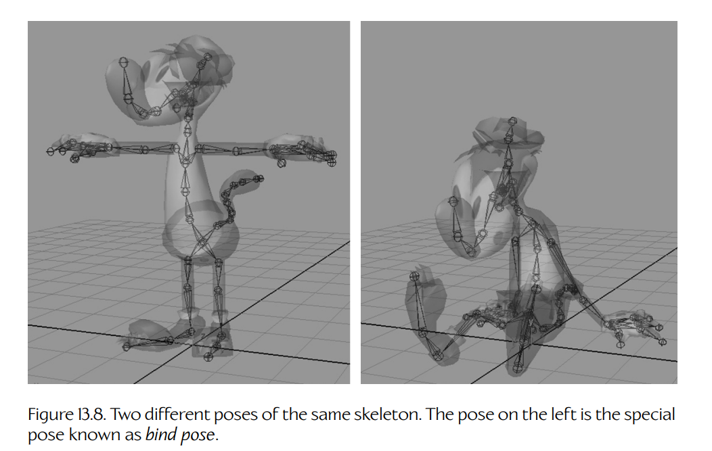
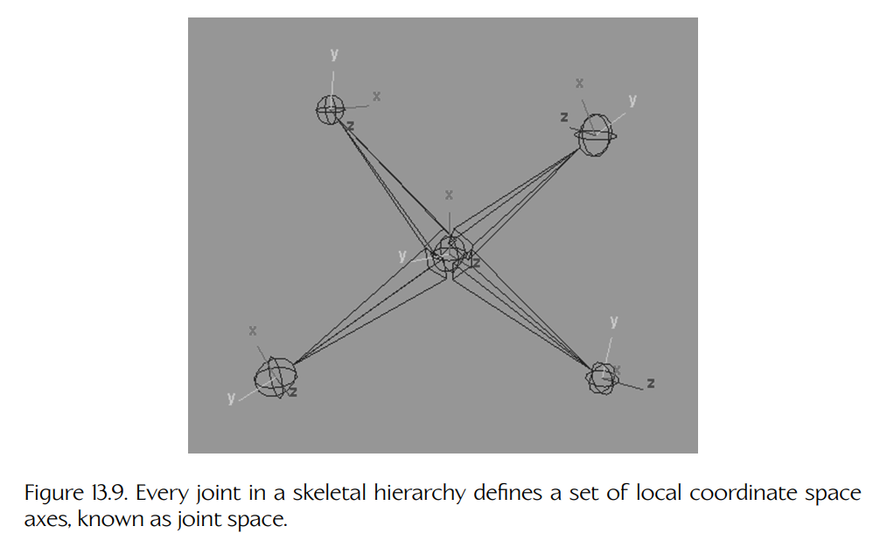
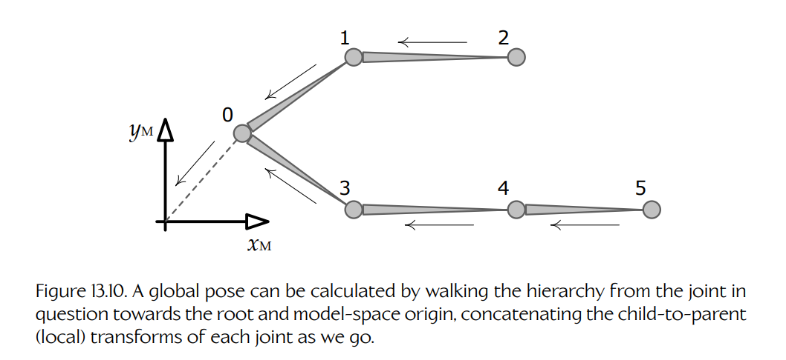

## 13.3 姿态

无论使用哪种技术来生成动画——基于赛璐珞、刚性层级，还是蒙皮/骨骼动画——每一种动画都会随时间展开。角色之所以具有运动的错觉，是因为角色身体被排列成一系列离散、静止的**姿态**（poses），然后快速连续地显示这些姿态，通常速率为每秒 30 或 60 个姿态。（实际上，正如我们将在 [Section 13.4.1.1](04-clips.md#13411-姿态插值与连续时间) 中看到的那样，我们通常会在相邻姿态之间进行**插值**，而不是逐字逐样地显示某一个单独姿态。）在骨骼动画中，骨架的姿态会直接控制网格的顶点，而摆姿态是动画师为角色注入生命的主要工具。因此很明显，在我们能够让骨架产生动画之前，必须先理解如何为它**摆姿态**（pose）。

骨架的姿态通过以任意方式旋转、平移，并可能缩放其关节来形成。关节的**姿态**（pose）被定义为该关节相对于某个参考坐标系的位置、朝向和缩放。关节姿态通常用一个 $4 \times 4$ 或 $4 \times 3$ 矩阵表示，也可以用一个 SRT 数据结构表示（scale、quaternion rotation 和 vector translation，即缩放、四元数旋转和向量平移）。骨架的姿态就是其所有关节姿态的集合，通常表示为一个简单的矩阵数组或 SRT 数组。

### 13.3.1 绑定姿态

Figure 13.8 展示了同一个骨架的两种不同姿态。左侧姿态是一种特殊姿态，称为**绑定姿态**（bind pose），有时也称为**参考姿态**（reference pose）或**静止姿态**（rest pose）。这是 3D 网格在绑定到骨架之前的姿态（因此得名）。换句话说，如果该网格作为普通的、未蒙皮的三角形网格渲染，并且完全没有骨架，那么它就会呈现这种姿态。绑定姿态也称为 **T 姿态**（T-pose），因为角色通常双脚微微分开站立，双臂伸展开来，形成字母 T 的形状。之所以选择这种特定站姿，是因为它能让四肢远离身体和彼此，从而使将顶点绑定到关节的过程更加容易。

**Figure 13.8.** 同一个骨架的两种不同姿态。左侧姿态是一种称为绑定姿态的特殊姿态。

### 13.3.2 局部姿态

关节的姿态最常被指定为相对于其**父关节**（parent joint）的姿态。相对于父节点的姿态允许关节自然运动。例如，如果我们旋转肩关节，但保持肘部、手腕和手指相对于父节点的姿态不变，那么整条手臂会以我们预期的方式围绕肩部刚性旋转。我们有时使用**局部姿态**（local pose）这个术语来描述相对于父节点的姿态。由于后面讨论动画混合时会看到的原因，局部姿态几乎总是以 SRT 格式存储。

从图形化角度看，许多 3D 创作软件包，如 Maya，会把关节表示为小球体。然而，一个关节不仅具有平移，还具有旋转和缩放，所以这种可视化方式可能有些误导。事实上，一个关节实际上定义了一个坐标空间，其原理上与我们之前遇到过的其他空间没有区别（例如模型空间、世界空间或视图空间）。因此，最好将关节想象为一组笛卡尔坐标轴，这些坐标轴定义了一个称为**关节空间**（joint space）的坐标空间。Maya 允许用户显示关节的局部坐标轴，如 Figure 13.9 所示。

**Figure 13.9.** 骨骼层级结构中的每个关节都会定义一组局部坐标空间坐标轴，称为关节空间。

从数学上说，关节姿态不过是一个**仿射变换**（affine transformation）。关节 $j$ 的姿态可以写作 $4 \times 4$ 仿射变换矩阵 $\mathbf{P}_j$，它由一个平移向量 $\mathbf{T}_j$、一个 $3 \times 3$ 对角缩放矩阵 $\mathbf{S}_j$，以及一个 $3 \times 3$ 旋转矩阵 $\mathbf{R}_j$ 组成。整个骨架的姿态 $\mathbf{P}^{\text{skel}}$ 可以写作所有姿态 $\mathbf{P}_j$ 的集合，其中 $j$ 的范围为 0 到 $N - 1$：

$$
\mathbf{P}_j =
\begin{bmatrix}
\mathbf{S}_j \mathbf{R}_j & \mathbf{0} \\
\mathbf{T}_j & 1
\end{bmatrix},
$$

$$
\mathbf{P}^{\text{skel}} = \{ \mathbf{P}_j \}_{j=0}^{N-1}.
$$

#### 13.3.2.1 关节缩放

一些游戏引擎假设关节永远不会被缩放，在这种情况下，$\mathbf{S}_j$ 会被直接省略，并假定为单位矩阵。另一些引擎则假设：如果存在缩放，那么缩放一定是**均匀缩放**（uniform），即三个维度上的缩放相同。在这种情况下，缩放可以用单个标量值 $s_j$ 表示。一些引擎甚至允许**非均匀缩放**（nonuniform scale），此时缩放可以用三元素向量 $\mathbf{s}_j = [s_{xj}\ s_{yj}\ s_{zj}]$ 紧凑表示。向量 $\mathbf{s}_j$ 的元素对应 $3 \times 3$ 缩放矩阵 $\mathbf{S}_j$ 的三个对角元素，因此它严格来说并不是真正意义上的向量。游戏引擎几乎从不允许切变，因此 $\mathbf{S}_j$ 几乎不会用完整的 $3 \times 3$ 缩放/切变矩阵表示，尽管理论上当然可以这样做。

在姿态或动画中省略缩放，或对缩放加以限制，有许多好处。显然，使用较低维度的缩放表示可以节省内存。（均匀缩放要求每个关节、每个动画帧只保存一个浮点标量；非均匀缩放要求三个浮点数；完整的 $3 \times 3$ 缩放-切变矩阵则需要九个浮点数。）将引擎限制为仅支持均匀缩放，还有一个额外好处：它可以确保关节的包围球永远不会像非均匀缩放时那样变换成椭球体。这极大简化了那些按关节执行视锥体测试和碰撞测试的引擎中的数学计算。

#### 13.3.2.2 在内存中表示关节姿态

如上所述，关节姿态通常以 SRT 格式存储。在 C++ 中，这样的数据结构可能如下所示，其中 `Q` 放在最前面，以确保正确对齐和最优结构体打包。（你能看出为什么吗？）

~~~cpp
struct JointPose
{
    Quaternion  m_rot;   // R
    Vector3     m_trans; // T
    F32         m_scale; // S（仅均匀缩放）
};
~~~

如果允许非均匀缩放，我们可能会改用如下方式定义关节姿态：

~~~cpp
struct JointPose
{
    Quaternion  m_rot;   // R
    Vector4     m_trans; // T
    Vector4     m_scale; // S
};
~~~

整个骨架的局部姿态可以表示如下，其中我们默认数组 `m_aLocalPose` 会根据骨架中的关节数量动态分配，刚好包含对应数量的 `JointPose` 实例。

~~~cpp
struct SkeletonPose
{
    Skeleton*   m_pSkeleton;  // 骨架 + 关节数量
    JointPose*  m_aLocalPose; // 局部关节姿态
};
~~~

#### 13.3.2.3 作为基变换的关节姿态

需要记住一点：**局部关节姿态**是相对于该关节的直接父关节指定的。任何仿射变换都可以被看作把点和向量从一个坐标空间变换到另一个坐标空间。因此，当关节姿态变换 $\mathbf{P}_j$ 作用于一个以关节 $j$ 的坐标系统表达的点或向量时，结果就是同一个点或向量在其父关节空间中的表达。

与前几章一样，我们将采用使用下标表示变换方向的约定。由于关节姿态会把点和向量从**子关节空间**（C）带到其**父关节空间**（P），所以可以写作 $(\mathbf{P}_{C \to P})_j$。另一种写法是引入函数 $p(j)$，它返回关节 $j$ 的父节点索引，并将关节 $j$ 的局部姿态写作 $\mathbf{P}_{j \to p(j)}$。

有时我们需要沿相反方向变换点和向量——也就是从父空间变换到子关节空间。这个变换就是局部关节姿态的逆变换。数学上：

$$
\mathbf{P}_{p(j) \to j} = \left( \mathbf{P}_{j \to p(j)} \right)^{-1}.
$$

### 13.3.3 全局姿态

有时，将关节姿态表达在模型空间或世界空间中会更方便。这称为**全局姿态**（global pose）。一些引擎用矩阵形式表示全局姿态，而另一些引擎则使用 SRT 格式。

从数学上说，关节的模型空间姿态（$j \to M$）可以通过沿骨骼层级结构从当前关节一直走到根节点，并在这个过程中不断乘以局部姿态（$j \to p(j)$）来求得。考虑 Figure 13.10 中所示的层级结构。根关节的父空间被定义为模型空间，因此 $p(0) \equiv M$。于是关节 $J_2$ 的模型空间姿态可以写作：

$$
\mathbf{P}_{2 \to M} = \mathbf{P}_{2 \to 1}\mathbf{P}_{1 \to 0}\mathbf{P}_{0 \to M}.
$$

同样，关节 $J_5$ 的模型空间姿态就是：

$$
\mathbf{P}_{5 \to M} = \mathbf{P}_{5 \to 4}\mathbf{P}_{4 \to 3}\mathbf{P}_{3 \to 0}\mathbf{P}_{0 \to M}.
$$

**Figure 13.10.** 全局姿态可以通过沿层级结构从当前关节走向根节点和模型空间原点来计算，并在过程中依次连接每个关节的子到父（局部）变换。

一般而言，任意关节 $j$ 的全局姿态（关节到模型变换）可以写作：

$$
\mathbf{P}_{j \to M} =
\prod_{i=j}^{0} \mathbf{P}_{i \to p(i)},
\tag{13.1}
$$

其中需要理解的是，在乘积的每次迭代之后，$i$ 都会变为 $p(i)$（即关节 $i$ 的父节点），并且 $p(0) \equiv M$。

#### 13.3.3.1 在内存中表示全局姿态

我们可以扩展 `SkeletonPose` 数据结构，使其包含全局姿态，如下所示。这里同样会根据骨架中的关节数量动态分配 `m_aGlobalPose` 数组：

~~~cpp
struct SkeletonPose
{
    Skeleton*   m_pSkeleton;   // 骨架 + 关节数量
    JointPose*  m_aLocalPose;  // 局部关节姿态
    Matrix44*   m_aGlobalPose; // 全局关节姿态
};
~~~
