## 13.4 片段

在电影中，每个场景的方方面面都会在制作动画之前被仔细规划好。这包括场景中每个角色和道具的运动，甚至包括摄像机的运动。这意味着整个场景可以作为一个很长的、连续的帧序列来制作动画。而且，当角色不在摄像机画面内时，根本不需要为它们制作动画。

游戏动画则不同。游戏是一种交互式体验，因此无法预先预测角色将如何移动和行动。玩家完全控制自己的角色，并且通常也部分控制摄像机。即使是由计算机驱动的非玩家角色，其决策也会受到人类玩家不可预测行为的强烈影响。因此，游戏动画几乎从不被制作成很长的连续帧序列。相反，游戏角色的运动必须被拆分成大量细粒度的动作。我们称这些单独的动作为**动画片段**（animation clips），有时也简称为**动画**（animations）。

每个片段都会让角色执行一个定义明确的单一动作。有些片段被设计为循环播放，例如行走循环或奔跑循环。另一些片段则被设计为只播放一次，例如投掷物体，或者绊倒并摔在地上。有些片段会影响角色的整个身体，例如角色跳到空中。另一些片段只影响身体的一部分，例如角色挥动右臂。任意一个游戏角色的动作通常都会被拆分成成千上万个片段。

这条规则唯一的例外，是游戏角色参与游戏中的非交互部分时，这类内容称为**游戏内过场动画**（in-game cinematic, IGC）、**非交互序列**（noninteractive sequence, NIS）或**全动态影像**（full-motion video, FMV）。非交互序列通常用于传达那些不太适合通过交互式玩法表达的故事元素，它们的制作方式与计算机生成电影非常相似（尽管它们通常会使用游戏内资产，如角色网格、骨架和纹理）。术语 IGC 和 NIS 通常指由游戏引擎本身实时渲染的非交互序列。术语 FMV 则用于指那些已经预渲染为 MP4、WMV 或其他类型视频文件，并在运行时由引擎的全屏视频播放器播放的序列。

这种动画风格的一种变体是一种半交互式序列，称为**即时反应事件**（quick time event, QTE）。在 QTE 中，玩家必须在一个原本非交互的序列中，在正确时机按下按钮，才能看到成功动画并继续推进；否则会播放失败动画，玩家必须重试，并可能因此失去一条生命或承受其他后果。

### 13.4.1 局部时间线

我们可以认为每个动画片段都有一条**局部时间线**（local timeline），通常用独立变量 $t$ 表示。在片段开始时，$t = 0$；在片段结束时，$t = T$，其中 $T$ 是该片段的持续时间。变量 $t$ 的每一个唯一取值都称为一个**时间索引**（time index）。Figure 13.11 展示了一个例子。

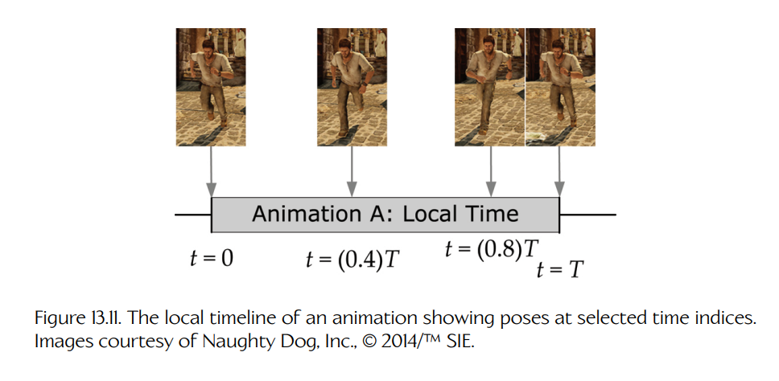

**Figure 13.11.** 一个动画的局部时间线，展示了若干选定时间索引处的姿态。图片由 Naughty Dog, Inc. 提供，© 2014/TM SIE。

#### 13.4.1.1 姿态插值与连续时间

需要注意的是，帧显示给观看者的速率，并不一定等同于动画师创建姿态的速率。在电影动画和游戏动画中，动画师几乎从不会每隔 1/30 或 1/60 秒就为角色摆一次姿态。相反，动画师会在片段内的特定时间生成重要姿态，这些姿态称为**关键姿态**（key poses）或**关键帧**（key frames），而计算机则通过线性插值或基于曲线的插值来计算这些姿态之间的中间姿态。Figure 13.12 展示了这一点。

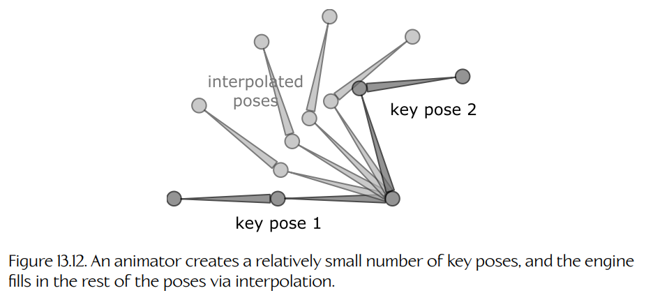

**Figure 13.12.** 动画师创建相对较少的关键姿态，而引擎通过插值填充其余姿态。

由于动画引擎能够对姿态进行**插值**（我们将在本章后面深入讨论），所以实际上我们可以在片段中的**任意时刻**采样角色姿态，而不仅限于整数帧索引。换句话说，动画片段的时间线是**连续的**。在计算机动画中，时间变量 $t$ 是一个实数（浮点数），而不是整数。

电影动画并没有充分利用动画时间线的连续特性，因为它的帧率被固定在每秒 24、30 或 60 帧。在电影中，观众看到的是角色在第 1、2、3 帧等等处的姿态——例如，永远没有必要去寻找角色在第 3.7 帧处的姿态。因此，在电影动画中，动画师并不会太关注角色在整数帧索引之间看起来是什么样子。

相比之下，实时游戏的帧率总会有轻微变化，具体取决于当前 CPU 和 GPU 承受的负载。此外，游戏动画有时会被**时间缩放**（time-scaled），以使角色看起来比原始动画更快或更慢地运动。因此，在实时游戏中，动画片段几乎从不会在整数帧编号上采样。理论上，当时间缩放为 1.0 时，一个片段应该在第 1、2、3 帧等等处被采样。但在实践中，玩家实际看到的可能是第 1.1、1.9、3.2 帧等等。如果时间缩放为 0.5，那么玩家实际看到的可能是第 1.1、1.4、1.9、2.6、3.2 帧等等。甚至可以使用负的时间缩放来反向播放动画。因此，在游戏动画中，时间既是**连续的**，也是**可缩放的**。

#### 13.4.1.2 时间单位

由于动画的时间线是连续的，因此最好用秒作为时间单位。时间也可以用**帧**（frames）作为单位来度量，前提是我们预先定义好一帧的持续时间。对于游戏动画，典型的帧持续时间是 1/30 秒或 1/60 秒。然而，需要注意的是，不要错误地把时间变量 $t$ 定义成一个用于计数完整帧数的整数。无论选择哪种时间单位，$t$ 都应该是一个实数（浮点数）、定点数，或者是一个度量非常小的子帧时间间隔的整数。目标是让时间度量具有足够的分辨率，以便能够执行诸如在帧之间“补间”（tweening），或缩放动画播放速度之类的操作。

#### 13.4.1.3 帧与采样

遗憾的是，术语 **frame** 在游戏行业中有不止一种常见含义。这可能导致很多混淆。有时，一个 frame 被理解为一段持续 1/30 或 1/60 秒的**时间区间**。但在其他语境中，术语 frame 则用于表示**时间中的单个点**（例如，我们可能会说角色“在第 42 帧”的姿态）。

我个人更倾向于使用术语 **sample** 来指代时间中的单个点，而保留 **frame** 一词来描述持续 1/30 或 1/60 秒的时间区间。因此，例如，一个以每秒 30 帧速率创建的 1 秒动画，会包含 31 个**采样**（samples），并且持续 30 个**帧**（frames），如 Figure 13.13 所示。术语“sample”来自信号处理领域。一个连续时间信号（即函数 $f(t)$）可以通过在等间隔时间点对该信号进行采样，转换为一组离散数据点。关于采样的更多信息，见 [Section 15.3.2.1](../15-audio/03-the-technology-of-sound.md#15321-sampling)。

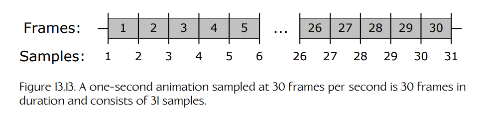

**Figure 13.13.** 一个以每秒 30 帧采样的 1 秒动画，持续 30 帧，并包含 31 个采样。

#### 13.4.1.4 帧、采样与循环片段

当一个片段被设计为反复播放时，我们称它是**循环的**（looped）。如果想象将两个 1 秒（30 帧/31 采样）的片段副本首尾相接地排列，那么第一个片段的第 31 个采样会在时间上与第二个片段的第 1 个采样完全重合，如 Figure 13.14 所示。为了让片段正确循环，我们可以看出，角色在片段结束时的姿态必须与片段开始时的姿态完全匹配。这反过来意味着，循环片段的最后一个采样（在我们的例子中为第 31 个采样）是冗余的。因此，许多游戏引擎会省略循环片段的最后一个采样。

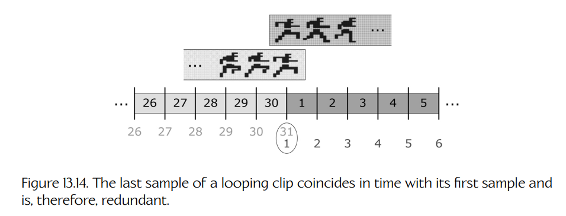

**Figure 13.14.** 循环片段的最后一个采样在时间上与其第一个采样重合，因此是冗余的。

这引出了以下关于任意动画片段中采样数和帧数的规则：

- 如果片段是**非循环的**（non-looping），那么一个 $N$ 帧动画会有 $N + 1$ 个唯一采样。
- 如果片段是**循环的**（looping），那么最后一个采样是冗余的，因此一个 $N$ 帧动画会有 $N$ 个唯一采样。

#### 13.4.1.5 归一化时间（相位）

有时，使用一个**归一化时间单位**（normalized time unit）$u$ 会很方便，使得无论动画持续时间 $T$ 是多少，在动画开始时都有 $u = 0$，在动画结束时都有 $u = 1$。我们有时也将归一化时间称为动画片段的**相位**（phase），因为当动画循环时，$u$ 的作用类似于正弦波的相位。Figure 13.15 展示了这一点。

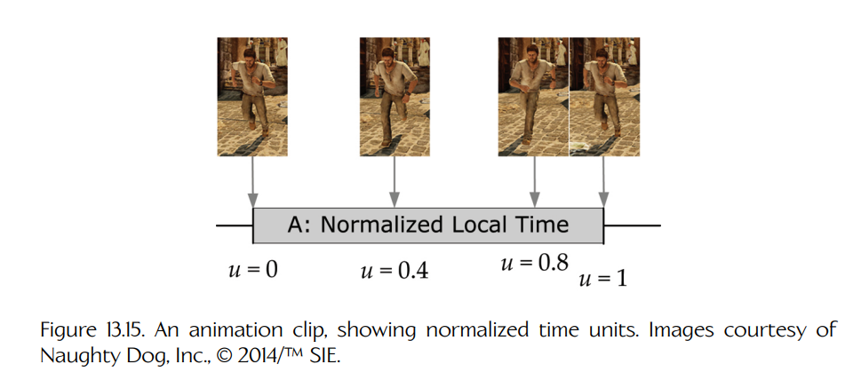

**Figure 13.15.** 一个动画片段，展示了归一化时间单位。图片由 Naughty Dog, Inc. 提供，© 2014/TM SIE。

当需要同步两个或更多动画片段，而这些片段不一定具有相同的绝对持续时间时，归一化时间非常有用。例如，我们可能希望从一个 2 秒（60 帧）的奔跑循环平滑交叉淡入到一个 3 秒（90 帧）的行走循环。为了让交叉淡入看起来效果良好，我们希望确保两个动画始终保持同步，使双脚在两个片段中都能正确对齐。我们可以通过简单地将行走片段的归一化起始时间 $u_{\text{walk}}$ 设置为与奔跑片段的归一化时间索引 $u_{\text{run}}$ 匹配来实现这一点。然后，我们让两个片段以相同的归一化速率推进，使它们保持同步。相比使用绝对时间索引 $t_{\text{walk}}$ 和 $t_{\text{run}}$ 来做同步，这要容易得多，也不容易出错。

### 13.4.2 全局时间线

正如每个动画片段都有一条局部时间线（其时钟在片段开始时从 0 开始）一样，游戏中的每个角色也都有一条**全局时间线**（global timeline）（其时钟在角色第一次生成到游戏世界中时开始，或者也可能在关卡开始或整个游戏开始时开始）。在本书中，我们将使用时间变量 $\tau$ 来度量全局时间，以免与局部时间变量 $t$ 混淆。

我们可以把**播放动画**理解为：简单地将该片段的局部时间线映射到角色的全局时间线上。例如，Figure 13.16 展示了从全局时间 $\tau_{\text{start}} = 102$ 秒开始播放动画片段 A。

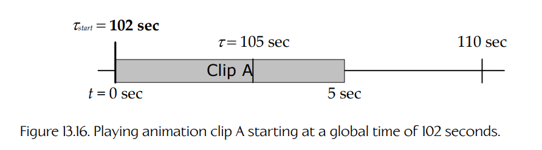

**Figure 13.16.** 从全局时间 102 秒开始播放动画片段 A。

如上所述，播放循环动画就像把无限多个片段副本首尾相接地铺放到全局时间线上。我们也可以想象让动画循环有限次数，这对应于铺放有限数量的片段副本。Figure 13.17 展示了这种情况。

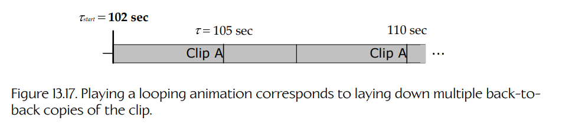

**Figure 13.17.** 播放循环动画对应于将多个片段副本首尾相接地铺放在时间线上。

对片段进行**时间缩放**会让它看起来比原始动画播放得更快或更慢。为了实现这一点，我们只需在把片段铺放到全局时间线时，对该片段的图像进行缩放。时间缩放最自然的表达方式是**播放速率**（playback rate），我们将其记为 $R$。例如，如果一个动画要以两倍速度播放（$R = 2$），那么在将该片段的局部时间线映射到全局时间线时，我们会把局部时间线缩放到正常长度的一半（$1/R = 0.5$）。Figure 13.18 展示了这一点。

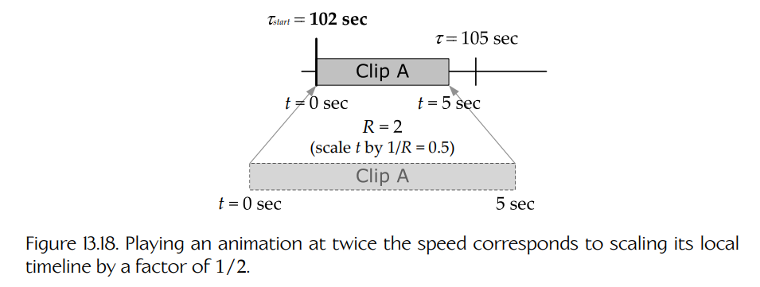

**Figure 13.18.** 以两倍速度播放动画，对应于将其局部时间线按 $1/2$ 的比例缩放。

反向播放片段对应于使用 $-1$ 的时间缩放，如 Figure 13.19 所示。

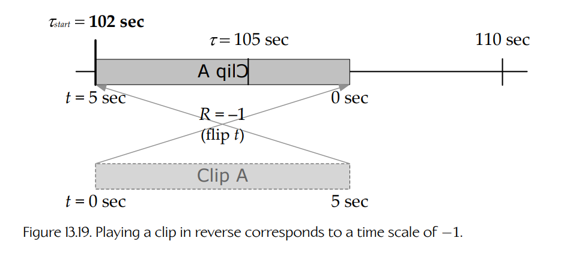

**Figure 13.19.** 反向播放片段对应于时间缩放为 $-1$。

为了将一个动画片段映射到全局时间线，我们需要关于该片段的以下信息：

- 它的全局起始时间 $\tau_{\text{start}}$；
- 它的播放速率 $R$；
- 它的持续时间 $T$；
- 它应该循环的次数，记作 $N$。

给定这些信息，我们可以使用以下两个关系式，从任意全局时间 $\tau$ 映射到对应的局部时间 $t$，反之亦然：

$$
t = (\tau - \tau_{\text{start}})R,
\tag{13.2}
$$

$$
\tau = \tau_{\text{start}} + \frac{1}{R}t.
$$

如果动画不循环（$N = 1$），那么在使用 $t$ 从片段中采样姿态之前，应该将 $t$ 钳制到有效范围 $[0, T]$ 中：

$$
t = \operatorname{clamp}\left[(\tau - \tau_{\text{start}})R\right]_0^T.
$$

如果动画永远循环（$N = \infty$），那么我们会通过将结果除以持续时间 $T$ 后取**余数**（remainder），把 $t$ 带回有效范围。这可以通过**模运算符**（mod，或 C/C++ 中的 `%`）完成，如下所示：

$$
t = \left((\tau - \tau_{\text{start}})R\right) \bmod T.
$$

如果片段循环有限次数（$1 < N < \infty$），那么必须先将 $t$ 钳制到范围 $[0, NT]$，然后再对这个结果按 $T$ 取模，以便将 $t$ 带入采样片段的有效范围：

$$
t =
\left(
\operatorname{clamp}\left[(\tau - \tau_{\text{start}})R\right]_0^{NT}
\right)
\bmod T.
$$

大多数游戏引擎会直接使用局部动画时间线，而不会直接使用全局时间线。不过，直接以全局时间的方式工作也有一些非常有用的好处。首先，它会让动画同步变得非常简单。

### 13.4.3 局部时钟与全局时钟的比较

动画系统必须跟踪当前正在播放的每个动画的时间索引。为此，我们有两种选择：

- **局部时钟**（local clock）。在这种方法中，每个片段都有自己的局部时钟，通常表示为以秒或帧为单位存储的浮点时间索引，也可以表示为归一化时间单位（在这种情况下，它通常称为动画的相位）。当片段开始播放时，局部时间索引 $t$ 通常取为 0。为了让动画随时间向前推进，我们分别推进每个片段的局部时钟。如果某个片段具有非单位播放速率 $R$，那么它的局部时钟推进量必须按 $R$ 缩放。
- **全局时钟**（global clock）。在这种方法中，角色拥有一个全局时钟，通常以秒为单位，而每个片段只记录它开始播放时的全局时间 $\tau_{\text{start}}$。片段的局部时钟则根据这些信息，使用 Equation (13.2) 计算得出。

局部时钟方法的优点是简单，在设计动画系统时它也是最显而易见的选择。然而，全局时钟方法具有一些明显优势，尤其是在同步动画时，无论是在单个角色内部，还是在场景中的多个角色之间。

#### 13.4.3.1 使用局部时钟同步动画

在局部时钟方法中，我们说过，片段局部时间线的原点（$t = 0$）通常被定义为与片段开始播放的时刻重合。因此，要同步两个或更多片段，它们必须在游戏时间中完全相同的时刻开始播放。这听起来很简单，但当用于播放动画的命令来自不同的引擎子系统时，它可能会变得相当棘手。

例如，假设我们想要同步玩家角色的出拳动画与非玩家角色对应的受击反应动画。问题在于，玩家的出拳是由玩家子系统在检测到手柄按钮被按下时发起的。与此同时，非玩家角色（NPC）的受击反应动画由人工智能（AI）系统播放。如果在游戏循环中 AI 代码先于玩家代码运行，那么玩家出拳的开始与 NPC 反应的开始之间会有一帧延迟。而如果玩家代码先于 AI 代码运行，那么当 NPC 试图攻击玩家时，又会出现相反的问题。如果使用消息传递（事件）系统在两个子系统之间通信，则还可能产生额外延迟（更多细节见 [Section 17.8](../17-runtime-gameplay-systems/08-events-and-message-passing.md)）。Figure 13.20 展示了这个问题。

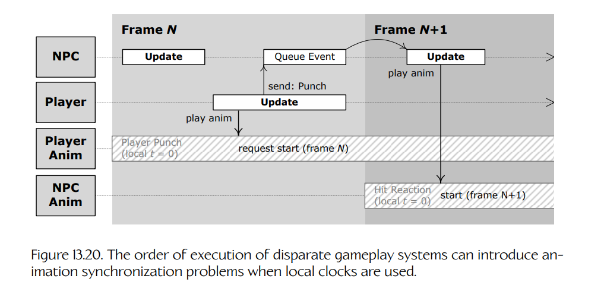

**Figure 13.20.** 当使用局部时钟时，不同玩法系统的执行顺序可能会引入动画同步问题。

~~~cpp
void GameLoop()
{
    while (!quit)
    {
        // 初步更新……

        UpdateAllNpcs(); // 对上一帧的出拳事件
                         // 做出反应

        // 更多更新……

        UpdatePlayer(); // 出拳按钮被按下——开始出拳
                        // 动画，并向 NPC 发送事件，
                        // 要求其做出反应

        // 还有更多更新……
    }
}
~~~

#### 13.4.3.2 使用全局时钟同步动画

全局时钟方法有助于缓解许多这类同步问题，因为从定义上说，时间线的原点（$\tau = 0$）对于所有片段都是共同的。如果两个或更多动画的全局起始时间在数值上相等，那么这些片段将完全同步地开始。如果它们的播放速率也相等，那么它们会保持同步而不会漂移。播放每个动画的代码在什么时候执行就不再重要了。即使播放受击反应的 AI 代码最终比玩家出拳代码晚运行一帧，也仍然可以非常容易地让两个片段保持同步：只需记录出拳动画的全局起始时间，并将反应动画的全局起始时间设置为与之匹配即可。Figure 13.21 展示了这一点。

当然，我们确实需要确保两个角色的全局时钟一致，但这很容易做到。我们可以调整全局起始时间，以考虑角色时钟之间的任何差异；也可以简单地让游戏中的所有角色共享一个主时钟。

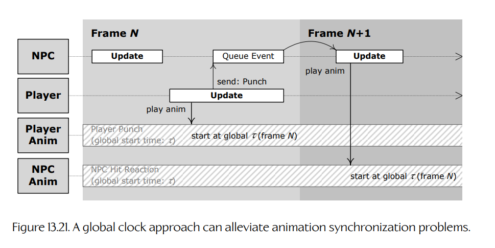

**Figure 13.21.** 全局时钟方法可以缓解动画同步问题。

### 13.4.4 一个简单的动画数据格式

通常，动画数据会从 Maya 场景文件中提取出来，方法是以每秒 30 或 60 个采样的速率离散采样骨架姿态。一个采样包含骨架中每个关节的完整姿态。姿态通常以 SRT 格式存储：对于每个关节 $j$，缩放分量要么是单个浮点标量 $S_j$，要么是三元素向量 $\mathbf{S}_j = [S_{xj}\ S_{yj}\ S_{zj}]$。旋转分量当然是四元素四元数 $\mathbf{Q}_j = [Q_{xj}\ Q_{yj}\ Q_{zj}\ Q_{wj}]$。平移分量则是三元素向量 $\mathbf{T}_j = [T_{xj}\ T_{yj}\ T_{zj}]$。我们有时会说，一个动画由每个关节最多 10 个**通道**（channels）组成，这是指 $\mathbf{S}_j$、$\mathbf{Q}_j$ 和 $\mathbf{T}_j$ 的 10 个分量。Figure 13.22 展示了这一点。

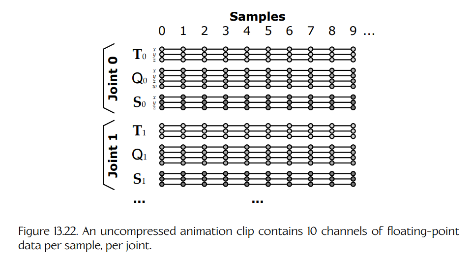

**Figure 13.22.** 未压缩的动画片段中，每个采样、每个关节包含 10 个浮点数据通道。

在 C++ 中，动画片段可以用许多不同方式表示。下面是一种可能的方式：

~~~cpp
struct JointPose { ... }; // SRT，如上文所定义

struct AnimationSample
{
    JointPose*         m_aJointPose; // 关节姿态数组
};

struct AnimationClip
{
    Skeleton*          m_pSkeleton;
    F32                m_framesPerSecond;
    U32                m_frameCount;
    AnimationSample*   m_aSamples; // 采样数组
    bool               m_isLooping;
};
~~~

一个动画片段是针对特定骨架创作的，通常不能用于任何其他骨架。因此，我们的示例 `AnimationClip` 数据结构包含一个指向其骨架的引用 `m_pSkeleton`。（在真实引擎中，这可能是一个唯一骨架 ID，而不是 `Skeleton*` 指针。在这种情况下，引擎大概会提供一种方式，用于根据唯一 ID 快速、方便地查找骨架。）

每个采样中 `m_aJointPose` 数组里的 `JointPose` 数量，假定与骨架中的关节数量一致。`m_aSamples` 数组中的采样数量由帧数以及该片段是否打算循环决定。对于非循环动画，采样数量为 `m_frameCount + 1`。然而，如果动画是循环的，那么最后一个采样与第一个采样相同，通常会被省略。在这种情况下，采样数量等于 `m_frameCount`。

需要意识到的是，在真实游戏引擎中，动画数据实际上并不会以这种简单格式存储。正如我们将在 [Section 13.8](./08-compression-techniques.md) 中看到的那样，数据通常会通过各种方式进行**压缩**以节省内存。

### 13.4.5 连续通道函数

动画片段中的采样实际上只是对随时间变化的连续函数的定义。你可以把它们看作每个关节 10 个标量值时间函数，或者看作每个关节两个向量值函数和一个四元数值函数。理论上，**通道函数**（channel functions）在整个片段的局部时间线上都是平滑且连续的，如 Figure 13.23 所示（显式创作的不连续情况除外，例如摄像机切换）。然而在实践中，许多游戏引擎会在采样之间进行**线性插值**，在这种情况下，实际使用的函数是底层连续函数的**分段线性近似**（piecewise linear approximations）。Figure 13.24 描绘了这种情况。

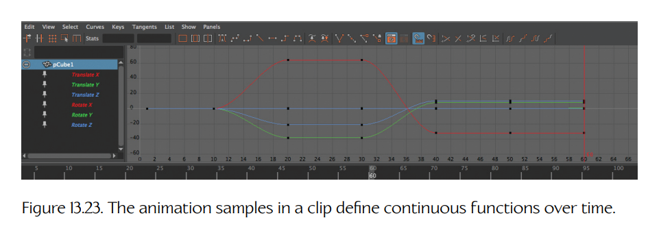

**Figure 13.23.** 片段中的动画采样定义了随时间变化的连续函数。

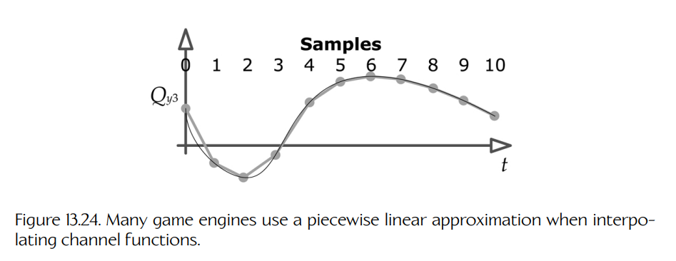

**Figure 13.24.** 许多游戏引擎在插值通道函数时使用分段线性近似。

### 13.4.6 元通道

许多游戏允许为动画定义额外的“**元通道**”（metachannels）数据。这些通道可以编码与骨架摆姿态没有直接关系、但需要与动画保持同步的游戏特定信息。

一种非常常见的做法是定义一个特殊通道，其中在不同时间索引处包含**事件触发器**（event triggers），如 Figure 13.25 所示。每当动画的局部时间索引经过其中一个触发器时，就会向游戏引擎发送一个事件，引擎可以按需做出响应。（我们将在 Chapter 17 中详细讨论事件。）事件触发器的一种常见用途，是标记动画期间某些声音或粒子效果应该在哪些时刻播放。例如，当左脚或右脚接触地面时，可以触发脚步声和一团“尘土”粒子效果。

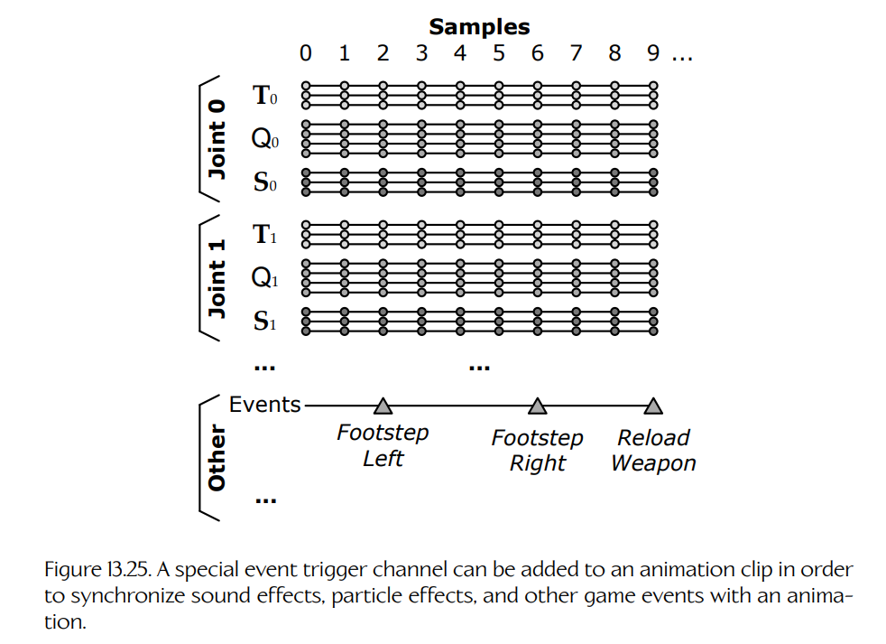

**Figure 13.25.** 可以向动画片段添加一个特殊的事件触发通道，以便将音效、粒子效果和其他游戏事件与动画同步。

另一种常见做法，是允许一些特殊关节与骨架本身的关节一起被动画化，这类特殊关节在 Maya 中称为**定位器**（locators）。由于关节或定位器本质上只是一个仿射变换，这些特殊关节可用于编码游戏中几乎任何对象的位置和朝向。

动画定位器的一个典型应用，是指定游戏摄像机在动画期间应该如何定位和定向。在 Maya 中，一个定位器会被约束到摄像机上，然后摄像机会与场景中角色的关节一起被动画化。摄像机的定位器会被导出，并在游戏中用于在动画期间移动游戏摄像机。摄像机的视场（焦距）以及可能的其他摄像机属性，也可以通过将相关数据放入一个或多个额外的**浮点通道**（floating-point channels）中来制作动画。

非关节动画通道的其他例子包括：

- 纹理坐标滚动；
- 纹理动画（纹理坐标滚动的一种特殊情况，其中帧在线性方向排列在纹理内部，而纹理在每次迭代中滚动一个完整帧）；
- 动画化材质参数（颜色、镜面反射率、透明度等）；
- 动画化光照参数（半径、锥角、强度、颜色等）；
- 任何其他需要随时间变化，并且以某种方式与动画同步的参数。

### 13.4.7 网格、骨架与片段之间的关系

Figure 13.26 中的 UML 图展示了动画片段数据如何与游戏引擎中的骨架、姿态、网格以及其他数据接口连接。请特别注意这些类之间关系的**基数**（cardinality）和**方向**（direction）。基数显示在类之间关系箭头的头部或尾部附近——数字 1 表示该类的一个实例，而星号表示多个实例。对于任意一种角色类型，都会有一个骨架、一个或多个网格，以及一个或多个动画片段。骨架是中心性的统一元素——蒙皮会附着到骨架上，但与动画片段没有任何关系。同样，片段会针对某个特定骨架，但它们并不“知道”蒙皮网格。Figure 13.27 展示了这些关系。

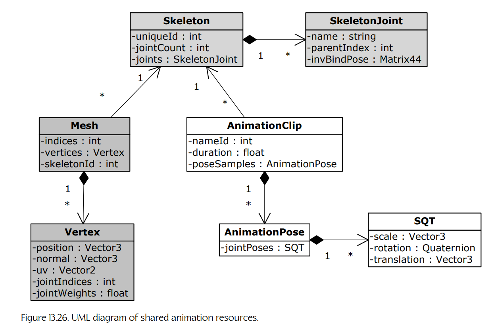

**Figure 13.26.** 共享动画资源的 UML 图。

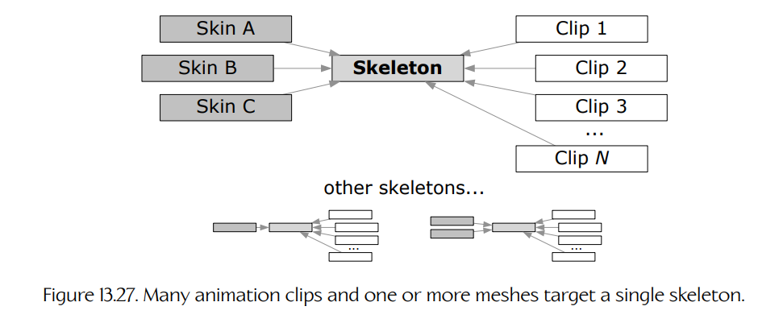

**Figure 13.27.** 多个动画片段以及一个或多个网格会以同一个骨架为目标。

游戏设计师通常会尽量减少游戏中唯一骨架的数量，因为每个新骨架通常都需要一整套新的动画片段。为了制造出许多不同类型角色的错觉，在可能的情况下，通常最好创建多个蒙皮到同一个骨架上的网格，这样所有角色就都可以共享同一套动画。

#### 13.4.7.1 动画重定向

我们在上文说过，一个动画通常只与单个骨架兼容。这个限制可以通过**动画重定向**（animation retargeting）技术克服。

重定向意味着使用为一个骨架创作的动画来驱动另一个不同的骨架。如果两个骨架在形态上完全相同，那么重定向可能简化为关节索引重映射这样一个简单问题。但当两个骨架并不完全匹配时，重定向问题就会变得更加复杂。在 Naughty Dog，动画师会定义一种特殊姿态，称为**重定向姿态**（retarget pose）。该姿态捕捉源骨架和目标骨架绑定姿态之间的关键差异，使运行时重定向系统能够调整源姿态，从而让它们在目标角色上更自然地工作。

还存在其他更高级的技术，可以将为一个骨架创作的动画重定向到另一个骨架上。更多信息可参见 Ludovic Dutreve 等人的 “Feature Points Based Facial Animation Retargeting” [298]，以及 Chris Hecker 等人的 “Real-time Motion Retargeting to Highly Varied User-Created Morphologies” [299]。