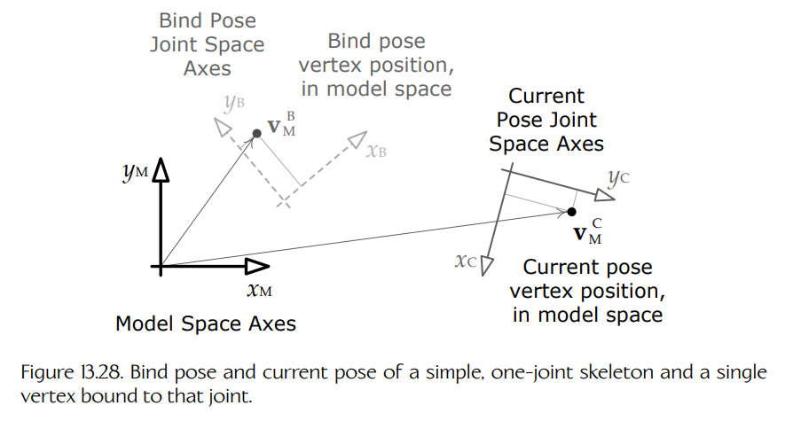
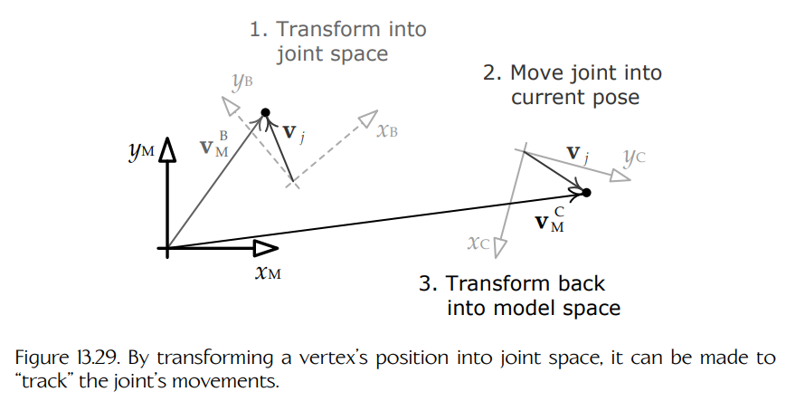

## 13.5 蒙皮与矩阵调色板生成

我们已经看到，如何通过旋转、平移，并可能缩放骨架的关节来为骨架摆姿态。同时我们也知道，任意骨骼姿态都可以在数学上表示为一组局部关节姿态变换（$\mathbf{P}_{j \to p(j)}$）或全局关节姿态变换（$\mathbf{P}_{j \to M}$），每个关节 $j$ 对应一个变换。接下来，我们将研究把 3D 网格的顶点附着到已经摆好姿态的骨架上的过程。这个过程称为**蒙皮**（skinning）。

### 13.5.1 逐顶点蒙皮信息

蒙皮网格通过其顶点附着到骨架上。每个顶点可以绑定到一个或多个关节。如果绑定到单个关节，那么该顶点会精确跟随该关节的运动。如果绑定到两个或更多关节，那么该顶点的位置会变成这样一种**加权平均**（weighted average）：它分别独立绑定到每个关节时本应取得的位置，再按权重求平均。

为了将网格蒙皮到骨架上，3D 美术师必须为每个顶点提供以下额外信息：

- 该顶点绑定到的一个或多个关节的**索引**（index 或 indices）；
- 对于每个关节，一个**权重因子**（weighting factor），用于描述该关节应当对最终顶点位置产生多大影响。

权重因子假定会相加为 1，这与计算任何加权平均值时的惯例一致。

通常，游戏引擎会对单个顶点可绑定的关节数量设置上限。由于若干原因，四个关节的限制很常见。首先，四个 16 位关节索引可以打包到一个 64 位字中，这很方便。此外，虽然在每顶点二关节、三关节，甚至四关节模型之间很容易看出质量差异，但当每个顶点的关节数量增加到四个以上时，大多数人已经看不出质量差异。

由于关节权重必须相加为 1，因此最后一个权重可以省略，而且也经常被省略。（它可以在运行时计算为 $w_3 = 1 - (w_0 + w_1 + w_2)$。）因此，一个典型的蒙皮顶点数据结构可能如下所示：

~~~cpp
struct SkinnedVertex
{
    float  m_position[3];     // (Px, Py, Pz)
    float  m_normal[3];       // (Nx, Ny, Nz)
    float  m_u, m_v;          // 纹理坐标 (u, v)
    U16    m_jointIndex[4];   // 关节索引
    float  m_jointWeight[3];  // 关节权重（省略最后一个
                              // 权重）
};
~~~

### 13.5.2 蒙皮的数学

蒙皮网格的顶点会跟随其绑定到的一个或多个关节运动。为了在数学上实现这一点，我们希望找到一个矩阵，它能够把网格顶点从其原始位置（绑定姿态中）变换到与骨架当前姿态对应的新位置。我们将这样的矩阵称为**蒙皮矩阵**（skinning matrix）。

与所有网格顶点一样，蒙皮顶点的位置是在模型空间中指定的。无论其骨架处于绑定姿态，还是处于任何其他姿态，都是如此。因此，我们要寻找的矩阵会把顶点从模型空间（绑定姿态）变换到模型空间（当前姿态）。不同于目前为止我们见过的其他变换，例如模型到世界变换或世界到视图变换，蒙皮矩阵**不是**一种基变换。它会把顶点变形到新的位置，但在变换前后，顶点都处于模型空间中。

#### 13.5.2.1 简单示例：单关节骨架

让我们推导蒙皮矩阵的基本方程。为了先让问题保持简单，我们将使用一个只包含单个关节的骨架。因此，我们需要处理两个坐标空间：模型空间，我们将用下标 $M$ 表示；以及唯一关节的关节空间，我们将用下标 $J$ 表示。关节的坐标轴一开始处于绑定姿态，我们将用上标 $B$ 表示。在动画中的任意给定时刻，关节坐标轴会移动到模型空间中的新位置和新朝向——我们将用上标 $C$ 表示这一**当前姿态**（current pose）。

现在考虑一个绑定到该关节的单个顶点。在绑定姿态中，它的模型空间位置为 $\mathbf{v}_M^B$。蒙皮过程会计算该顶点在当前姿态中的新模型空间位置 $\mathbf{v}_M^C$。Figure 13.28 展示了这一过程。

**Figure 13.28.** 一个简单单关节骨架的绑定姿态和当前姿态，以及绑定到该关节的单个顶点。

为给定关节寻找蒙皮矩阵的“诀窍”在于认识到：当一个绑定到关节的顶点用**该关节的坐标空间**表达时，它的位置是恒定的。因此，我们取顶点在绑定姿态中的模型空间位置，将其转换到关节空间中，把关节移动到其当前姿态，最后再把顶点转换回模型空间。从模型空间到关节空间再返回模型空间的这一往返过程，其净效果就是把顶点从绑定姿态“变形”（morph）到当前姿态。

**Figure 13.29.** 通过将顶点位置变换到关节空间中，可以让它“跟随”关节的运动。

参考 Figure 13.29 中的示意图，假设顶点 $\mathbf{v}_M^B$ 在模型空间中的坐标为 $(4, 6)$（此时骨架处于绑定姿态）。我们将这个顶点转换为等价的关节空间坐标 $\mathbf{v}_j$，如图所示大约为 $(1, 3)$。由于顶点绑定到该关节，因此无论关节如何移动，它的关节空间坐标始终都是 $(1, 3)$。一旦我们让关节处于所需的当前姿态，就把该顶点的坐标转换回模型空间，并用符号 $\mathbf{v}_M^C$ 表示。在图中，这些坐标大约为 $(18, 2)$。因此，由于关节从图中所示的绑定姿态运动到了当前姿态，蒙皮变换把模型空间中的顶点从 $(4, 6)$ 变形到了 $(18, 2)$。

从数学角度看，我们可以用矩阵 $\mathbf{B}_{j \to M}$ 表示关节 $j$ 在模型空间中的**绑定姿态**。这个矩阵会把坐标以关节 $j$ 空间表示的点或向量，变换为一组等价的模型空间坐标。现在，考虑一个顶点，其坐标是在骨架处于绑定姿态时的模型空间中表达的。为了把这些顶点坐标转换到关节 $j$ 的空间中，我们只需将其乘以**逆绑定姿态矩阵**（inverse bind pose matrix），即 $\mathbf{B}_{M \to j} = \left(\mathbf{B}_{j \to M}\right)^{-1}$：

$$
\mathbf{v}_j
=
\mathbf{v}_M^B \mathbf{B}_{M \to j}
=
\mathbf{v}_M^B \left(\mathbf{B}_{j \to M}\right)^{-1}.
\tag{13.3}
$$

同样，我们可以用矩阵 $\mathbf{C}_{j \to M}$ 表示该关节的**当前姿态**（即任何非绑定姿态）。为了将 $\mathbf{v}_j$ 从关节空间转换回模型空间，我们只需将其乘以当前姿态矩阵，如下所示：

$$
\mathbf{v}_M^C = \mathbf{v}_j \mathbf{C}_{j \to M}.
$$

如果使用 Equation (13.3) 展开 $\mathbf{v}_j$，就可以得到一个方程，它会直接将顶点从绑定姿态中的位置变换到当前姿态中的位置：

$$
\begin{aligned}
\mathbf{v}_M^C
&= \mathbf{v}_j \mathbf{C}_{j \to M} \\
&= \mathbf{v}_M^B \left(\mathbf{B}_{j \to M}\right)^{-1} \mathbf{C}_{j \to M} \\
&= \mathbf{v}_M^B \mathbf{K}_j.
\end{aligned}
\tag{13.4}
$$

组合矩阵 $\mathbf{K}_j = \left(\mathbf{B}_{j \to M}\right)^{-1} \mathbf{C}_{j \to M}$ 称为**蒙皮矩阵**（skinning matrix）。

#### 13.5.2.2 扩展到多关节骨架

在上面的例子中，我们只考虑了单个关节。然而，上面推导出的数学实际上适用于任何可以想象的骨架中的任何关节，因为我们是用全局姿态（即关节空间到模型空间的变换）来表述所有内容的。为了把上述公式扩展到包含多个关节的骨架，我们只需要做两个小调整：

1. 必须确保针对当前关节，正确计算出矩阵 $\mathbf{B}_{j \to M}$ 和 $\mathbf{C}_{j \to M}$，这可以通过 Equation (13.1) 完成。$\mathbf{B}_{j \to M}$ 和 $\mathbf{C}_{j \to M}$ 分别就是该方程中所用矩阵 $\mathbf{P}_{j \to M}$ 的绑定姿态版本和当前姿态版本。

2. 必须计算一个蒙皮矩阵数组 $\mathbf{K}_j$，每个关节 $j$ 对应一个矩阵。这个数组称为**矩阵调色板**（matrix palette）。渲染蒙皮网格时，矩阵调色板会被传递给渲染引擎。对于每个顶点，渲染器会在调色板中查找对应关节的蒙皮矩阵，并使用它将该顶点从绑定姿态变换到当前姿态。

这里需要注意的是，当前姿态矩阵 $\mathbf{C}_{j \to M}$ 会随着角色随时间采取不同姿态而每帧变化。然而，逆绑定姿态矩阵在整个游戏中都是常量，因为骨架的绑定姿态在模型创建时就已经固定。因此，矩阵 $\left(\mathbf{B}_{j \to M}\right)^{-1}$ 通常会随骨架一起缓存，不需要在运行时计算。动画引擎通常会先计算每个关节的局部姿态（$\mathbf{C}_{j \to p(j)}$），然后使用 Equation (13.1) 将它们转换为全局姿态（$\mathbf{C}_{j \to M}$），最后将每个全局姿态乘以对应缓存的逆绑定姿态矩阵 $\left(\mathbf{B}_{j \to M}\right)^{-1}$，从而为每个关节生成一个蒙皮矩阵（$\mathbf{K}_j$）。

#### 13.5.2.3 合并模型到世界变换

每个顶点最终都必须从模型空间变换到世界空间。因此，一些引擎会预先将对象的模型到世界变换乘入蒙皮矩阵调色板中。这是一种有用的优化，因为它可以在渲染蒙皮几何体时为每个顶点节省一次矩阵乘法。（当需要处理数十万个顶点时，这种节省确实会变得相当可观！）

为了将模型到世界变换合并到蒙皮矩阵中，我们只需将它连接到常规蒙皮矩阵方程之后，如下所示：

$$
\left(\mathbf{K}_j\right)_W
=
\left(\mathbf{B}_{j \to M}\right)^{-1}
\mathbf{C}_{j \to M}
\mathbf{M}_{M \to W}.
$$

有些引擎会像这样把模型到世界变换烘焙进蒙皮矩阵中，而另一些引擎则不会。这个选择完全取决于工程团队，并且会受到各种因素驱动。例如，有一种情况我们绝对不希望这样做：当同一个动画同时应用于多个角色时——这种技术称为**动画实例化**（animation instancing），有时用于为大规模角色人群制作动画。在这种情况下，我们需要让模型到世界变换保持独立，这样就可以让人群中的所有角色共享同一套矩阵调色板。

#### 13.5.2.4 将顶点蒙皮到多个关节

当一个顶点被蒙皮到多个关节时，我们会计算其最终位置，方法是假定它分别单独蒙皮到每个关节，先为每个关节计算一个模型空间位置，然后对得到的位置取**加权平均**。权重由角色绑定美术师提供，并且它们必须始终相加为 1。（如果它们没有相加为 1，则工具管线应当对它们重新归一化。）

对于 $N$ 个量 $a_0$ 到 $a_{N-1}$，以及权重 $w_0$ 到 $w_{N-1}$ 且满足 $\sum w_i = 1$ 的加权平均，其通用公式为：

$$
a = \sum_{i=0}^{N-1} w_i a_i.
$$

这同样适用于向量量 $\mathbf{a}_i$。因此，对于一个蒙皮到 $N$ 个关节的顶点，若其关节索引为 $j_0$ 到 $j_{N-1}$，权重为 $w_0$ 到 $w_{N-1}$，我们可以将 Equation (13.4) 扩展如下：

$$
\mathbf{v}_M^C
=
\sum_{i=0}^{N-1}
w_i \mathbf{v}_M^B \mathbf{K}_{j_i},
$$

其中 $\mathbf{K}_{j_i}$ 是关节 $j_i$ 的蒙皮矩阵。
