## 13.6 动画混合

术语**动画混合**（animation blending）指任何允许多个动画片段共同影响角色最终姿态的技术。更准确地说，混合会把两个或更多**输入姿态**（input poses）组合起来，为骨架生成一个**输出姿态**（output pose）。

混合通常会在单个时间点上组合两个或更多姿态，并在同一时间点生成输出。在这种语境下，混合用于将两个或更多动画组合成大量新的动画，而不必手工创建它们。例如，通过将受伤行走动画与未受伤行走动画混合，我们可以在角色行走时生成各种不同程度的受伤表现。再举一个例子，我们可以在角色瞄准左侧的动画和瞄准右侧的动画之间进行混合，使角色能够瞄准两个极端之间的任意角度。混合可以用于在极端面部表情、身体姿态、移动模式等之间插值。对于这种混合，两个动画片段需要进行**相位匹配**（phase-matched）。例如，受伤和未受伤的行走循环都需要从同一只脚踩在地面上的姿态开始，才能在混合时兼容。

混合也可以用于在单个动画片段内部、不同时间点上的两个已知姿态之间寻找中间姿态。当我们想要在动画数据中没有恰好对应采样帧的某个时间点上求得角色姿态时，就会使用这种方式。我们还可以使用时间上的动画混合，通过在短时间内从源动画逐渐混合到目标动画，从而平滑地从一个动画过渡到另一个动画。

### 13.6.1 线性插值混合

给定一个具有 $N$ 个关节的骨架，以及两个骨骼姿态 $\mathbf{P}^{\text{skel}}_A = \{(\mathbf{P}_A)_j\}_{j=0}^{N-1}$ 和 $\mathbf{P}^{\text{skel}}_B = \{(\mathbf{P}_B)_j\}_{j=0}^{N-1}$，我们希望在这两个极端之间找到一个中间姿态 $\mathbf{P}^{\text{skel}}_{\text{lerp}}$。这可以通过对两个源姿态中每个独立关节的局部姿态进行**线性插值**（linear interpolation, lerp）来完成。可写作：

$$
(\mathbf{P}_{\text{lerp}})_j
=
\operatorname{lerp}((\mathbf{P}_A)_j,(\mathbf{P}_B)_j,\beta)
\tag{13.5}
$$

$$
=
(1-\beta)(\mathbf{P}_A)_j+\beta(\mathbf{P}_B)_j.
$$

整个骨架的插值姿态，就是所有关节插值姿态的集合：

$$
\mathbf{P}^{\text{skel}}_{\text{lerp}}
=
\{(\mathbf{P}_{\text{lerp}})_j\}_{j=0}^{N-1}.
\tag{13.6}
$$

在这些方程中，$\beta$ 称为**混合百分比**（blend percentage）或**混合因子**（blend factor）。当 $\beta = 0$ 时，骨架的最终姿态将与 $\mathbf{P}^{\text{skel}}_A$ 完全一致；当 $\beta = 1$ 时，最终姿态将与 $\mathbf{P}^{\text{skel}}_B$ 一致。当 $\beta$ 介于 0 和 1 之间时，最终姿态就是两个极端之间的中间姿态。该效果已在 Figure 13.12 中展示。

这里我们略过了一个小细节：我们是在对**关节姿态**进行线性插值，也就是对 $4 \times 4$ **变换矩阵**进行插值。但是，正如我们在 Chapter 5 中看到的那样，直接对矩阵进行插值并不实际。这也是局部姿态通常用 SRT 格式表达的原因之一——这样一来，我们就可以把 Section 5.2.5 中定义的 lerp 操作分别应用到 SRT 的每个分量上。SRT 中平移分量 $\mathbf{T}$ 的线性插值就是直接的向量 lerp：

$$
(\mathbf{T}_{\text{lerp}})_j
=
\operatorname{lerp}((\mathbf{T}_A)_j,(\mathbf{T}_B)_j,\beta)
\tag{13.7}
$$

$$
=
(1-\beta)(\mathbf{T}_A)_j+\beta(\mathbf{T}_B)_j.
$$

旋转分量的线性插值是四元数 lerp，或 slerp（球面线性插值）：

$$
(\mathbf{Q}_{\text{lerp}})_j
=
\operatorname{normalize}\left(
\operatorname{lerp}((\mathbf{Q}_A)_j,(\mathbf{Q}_B)_j,\beta)
\right)
\tag{13.8}
$$

$$
=
\operatorname{normalize}\left(
(1-\beta)(\mathbf{Q}_A)_j+\beta(\mathbf{Q}_B)_j
\right).
$$

或者：

$$
(\mathbf{Q}_{\text{slerp}})_j
=
\operatorname{slerp}((\mathbf{Q}_A)_j,(\mathbf{Q}_B)_j,\beta)
\tag{13.9}
$$

$$
=
\frac{\sin((1-\beta)\theta)}{\sin(\theta)}(\mathbf{Q}_A)_j
+
\frac{\sin(\beta\theta)}{\sin(\theta)}(\mathbf{Q}_B)_j.
$$

最后，缩放分量的线性插值可以是标量 lerp，也可以是向量 lerp，具体取决于引擎支持的缩放类型（均匀缩放或非均匀缩放）：

$$
(\mathbf{S}_{\text{lerp}})_j
=
\operatorname{lerp}((\mathbf{S}_A)_j,(\mathbf{S}_B)_j,\beta)
\tag{13.10}
$$

$$
=
(1-\beta)(\mathbf{S}_A)_j+\beta(\mathbf{S}_B)_j.
$$

或者：

$$
(\mathbf{S}_{\text{lerp}})_j
=
\operatorname{lerp}((\mathbf{S}_A)_j,(\mathbf{S}_B)_j,\beta)
\tag{13.11}
$$

$$
=
(1-\beta)(\mathbf{S}_A)_j+\beta(\mathbf{S}_B)_j.
$$

当在两个骨骼姿态之间进行线性插值时，最自然的中间姿态通常是：每个关节姿态都在该关节直接父节点的空间中独立于其他关节进行插值。换句话说，姿态混合通常是在**局部姿态**（local poses）上执行的。如果我们直接在模型空间中混合全局姿态，结果往往会在生物力学上显得不合理。

由于姿态混合是在局部姿态上完成的，因此任意一个关节姿态的线性插值都完全独立于骨架中其他关节的插值。这意味着线性姿态插值可以在多处理器架构上完全并行执行。

### 13.6.2 线性插值混合的应用

现在我们理解了 lerp 混合的基础，接下来看看一些典型的游戏应用。

#### 13.6.2.1 时间插值

正如我们在 [Section 13.4.1.1](./04-clips.md#13411-pose-interpolation-and-continuous-time) 中提到的，游戏动画几乎从不会精确采样在整数帧索引处。由于帧率可变，玩家实际看到的可能是第 0.9、1.85 和 3.02 帧，而不是预期中的第 1、2 和 3 帧。此外，一些动画压缩技术只会存储稀疏关键帧，这些关键帧在片段局部时间线上以不均匀间隔分布。无论哪种情况，我们都需要一种机制，在动画片段实际存在的采样姿态之间寻找中间姿态。

Lerp 混合通常用于寻找这些中间姿态。举例来说，假设我们的动画片段包含均匀间隔的姿态采样，时间分别为 $0, \Delta t, 2\Delta t, 3\Delta t$，依此类推。为了在时间 $t = 2.18\Delta t$ 处找到姿态，我们只需在时间 $2\Delta t$ 和 $3\Delta t$ 的姿态之间做线性插值，混合百分比为 $\beta = 0.18$。

一般来说，给定任意两个包围 $t$ 的时间点 $t_1$ 和 $t_2$ 上的姿态采样，我们可以如下求得时间 $t$ 处的姿态：

$$
\mathbf{P}_j(t)
=
\operatorname{lerp}(\mathbf{P}_j(t_1),\mathbf{P}_j(t_2),\beta(t))
\tag{13.12}
$$

$$
=
(1-\beta(t))\mathbf{P}_j(t_1)+\beta(t)\mathbf{P}_j(t_2),
\tag{13.13}
$$

其中混合因子 $\beta(t)$ 可以通过以下比值确定：

$$
\beta(t)=\frac{t-t_1}{t_2-t_1}.
\tag{13.14}
$$

#### 13.6.2.2 运动连续性：交叉淡化

游戏角色的动画是通过拼接大量细粒度动画片段实现的。如果动画师足够优秀，那么角色在每个单独片段内部都会以自然且符合物理直觉的方式运动。然而，从一个片段过渡到下一个片段时，要达到同等质量是出了名地困难。我们在游戏动画中看到的绝大多数“跳变”（pops），都发生在角色从一个片段切换到下一个片段时。

理想情况下，即使在过渡期间，角色身体每个部位的运动也应当是完全平滑的。换句话说，骨架中每个关节运动时描绘出的三维路径不应包含突然的“跳跃”。我们称这为 **C0 连续性**（C0 continuity）；Figure 13.30 展示了这一概念。

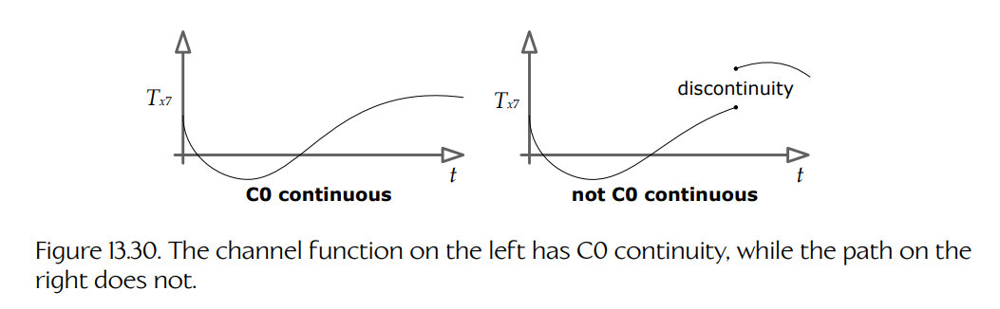

**Figure 13.30.** 左侧通道函数具有 C0 连续性，而右侧路径不具有。

不仅路径本身应当连续，其一阶导数（速度）也应当连续。这称为 **C1 连续性**（C1 continuity，或速度与动量的连续性）。随着连续阶数越来越高，动画角色运动的感知质量和真实感都会提升。例如，我们可能希望达到 **C2 连续性**，即运动路径的二阶导数（加速度曲线）也是连续的。

严格的数学意义上的 C1 或更高阶连续性往往难以实现。不过，基于 lerp 的动画混合可以用于实现一种视觉上较为令人满意的 C0 运动连续性。它通常也能相当不错地近似 C1 连续性。当以这种方式用于片段之间的过渡时，lerp 混合有时称为**交叉淡化**（cross-fading）。Lerp 混合可能会引入不希望出现的伪影，例如令人头疼的“脚底打滑”（sliding feet）问题，因此必须谨慎使用。

为了在两个动画之间进行交叉淡化，我们会让两个片段的时间线以某种合理程度发生重叠，然后将两个片段混合在一起。混合百分比 $\beta$ 在时间 $t_{\text{start}}$ 处从 0 开始，这意味着交叉淡化开始时我们只看到片段 A。随后我们逐渐增大 $\beta$，直到它在时间 $t_{\text{end}}$ 处达到 1。此时只有片段 B 可见，并且可以完全移除片段 A。交叉淡化发生的时间区间（$\Delta t_{\text{blend}} = t_{\text{end}} - t_{\text{start}}$）有时称为**混合时间**（blend time）。

**交叉淡化的类型。**

执行交叉混合过渡有两种常见方式：

- **平滑过渡**（smooth transition）。片段 A 和 B 在 $\beta$ 从 0 增长到 1 的过程中同时播放。为了让这种方式效果良好，两个片段必须是循环动画，并且它们的时间线必须同步，使得一个片段中腿和手臂的位置大致与另一个片段中的位置匹配。（如果没有做到这一点，交叉淡化通常会看起来非常不自然。）Figure 13.31 展示了这项技术。

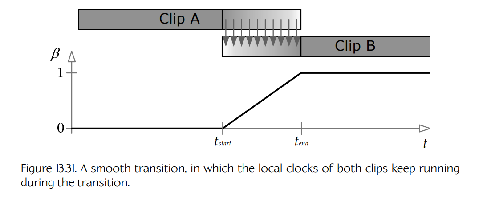

**Figure 13.31.** 平滑过渡，其中两个片段的局部时钟在过渡期间都持续运行。

- **冻结过渡**（frozen transition）。片段 A 的局部时钟会在片段 B 开始播放的时刻停止。因此，来自片段 A 的骨架姿态被冻结，而片段 B 逐渐接管运动。当两个片段彼此无关、无法进行时间同步，而平滑过渡又必须依赖这种同步时，这类过渡混合非常有效。Figure 13.32 展示了这种方法。

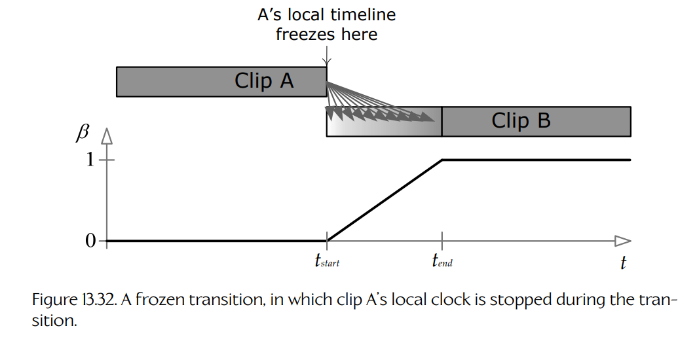

**Figure 13.32.** 冻结过渡，其中片段 A 的局部时钟在过渡期间被停止。

我们还可以控制混合因子 $\beta$ 在过渡期间如何变化。在 Figures 13.31 和 13.32 中，混合因子随时间线性变化。为了实现更加平滑的过渡，可以让 $\beta$ 按照时间的三次函数变化，例如一维 Bézier 曲线。当这样的曲线应用于一个正在被混出的当前播放片段时，它称为**缓出曲线**（ease-out curve）；当它应用于一个正在被混入的新片段时，它称为**缓入曲线**（ease-in curve）。Figure 13.33 展示了这一点。

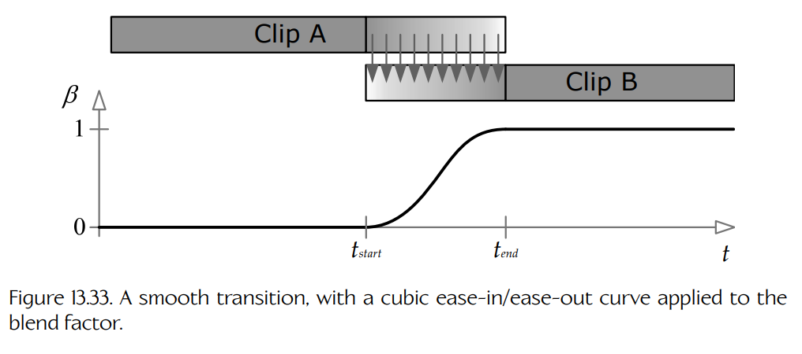

**Figure 13.33.** 平滑过渡，其中对混合因子应用了三次缓入/缓出曲线。

Bézier 缓入/缓出曲线的方程如下。它会返回混合区间内任意时间 $t$ 处的 $\beta$ 值。$\beta_{\text{start}}$ 是混合区间开始时间 $t_{\text{start}}$ 处的混合因子，$\beta_{\text{end}}$ 是结束时间 $t_{\text{end}}$ 处的最终混合因子。参数 $u$ 是 $t_{\text{start}}$ 和 $t_{\text{end}}$ 之间的归一化时间；为方便起见，我们还定义 $v = 1-u$（即**逆归一化时间**，inverse normalized time）。注意，Bézier 切线 $\mathbf{T}_{\text{start}}$ 和 $\mathbf{T}_{\text{end}}$ 被取为分别等于对应的混合因子 $\beta_{\text{start}}$ 和 $\beta_{\text{end}}$，因为这样可以得到对我们目的而言行为良好的曲线：

$$
\text{let } u =
\left(
\frac{t-t_{\text{start}}}{t_{\text{end}}-t_{\text{start}}}
\right)
$$

$$
\text{and } v = 1-u.
$$

$$
\beta(t)
=
(v^3)\beta_{\text{start}}
+
(3v^2u)\mathbf{T}_{\text{start}}
+
(3vu^2)\mathbf{T}_{\text{end}}
+
(u^3)\beta_{\text{end}}
$$

$$
=
(v^3 + 3v^2u)\beta_{\text{start}}
+
(3vu^2 + u^3)\beta_{\text{end}}.
$$

**核心姿态。**

这里也适合提到一点：如果动画师确保某个片段的最后一个姿态与接下来片段的第一个姿态匹配，那么实际上可以**不通过混合**也实现运动连续性。在实践中，动画师通常会决定一组**核心姿态**（core poses）——例如，直立站姿、蹲伏姿态、俯卧姿态等。只要确保角色在每个片段开始时都从这些核心姿态之一出发，并在结束时回到某个核心姿态，那么在拼接动画时，只需保证核心姿态匹配，就可以实现 C0 连续性。C1 或更高阶运动连续性也可以通过确保一个片段末尾的角色运动平滑过渡到下一个片段开头的运动来实现。这可以通过创作一个单独的平滑动画，然后将其拆分成两个或更多片段来完成。

#### 13.6.2.3 方向性移动

基于 lerp 的动画混合常用于角色移动。当真实人类行走或奔跑时，他们可以通过两种基本方式改变运动方向。第一，他们可以转动整个身体来改变方向，在这种情况下，他们始终面向自己的运动方向。我把这种方式称为**枢轴式移动**（pivotal movement），因为人在转向时会围绕自身垂直轴旋转。第二，他们可以保持面朝一个方向，同时向前、向后或侧向行走（在游戏领域中称为**横移**，strafing），从而朝一个独立于朝向方向的方向移动。我把这种方式称为**目标式移动**（targeted movement），因为它常用于让人的眼睛——或武器——在移动时仍然对准目标。这两种移动风格如 Figure 13.34 所示。

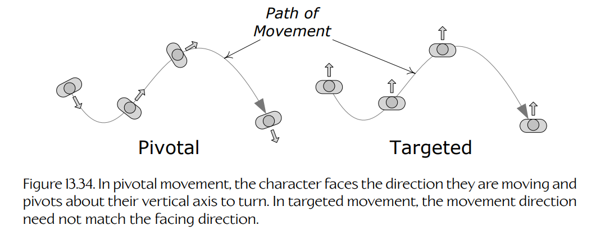

**Figure 13.34.** 在枢轴式移动中，角色面向自己的运动方向，并围绕其垂直轴旋转以转向。在目标式移动中，运动方向不必与朝向方向一致。

**目标式移动。**

为了实现目标式移动，动画师会创作三个单独的循环动画片段——一个向前移动，一个向左横移，一个向右横移。我把它们称为**方向性移动片段**（directional locomotion clips）。这三个方向性片段会沿一个半圆的圆周排列，其中前进位于 0 度，左侧位于 90 度，右侧位于 -90 度。在角色朝向固定为 0 度的情况下，我们在半圆上找到期望移动方向，选择两个相邻的移动动画，并通过基于 lerp 的混合把它们混合在一起。混合百分比 $\beta$ 由期望运动方向与两个相邻片段角度之间的接近程度决定。Figure 13.35 展示了这一点。

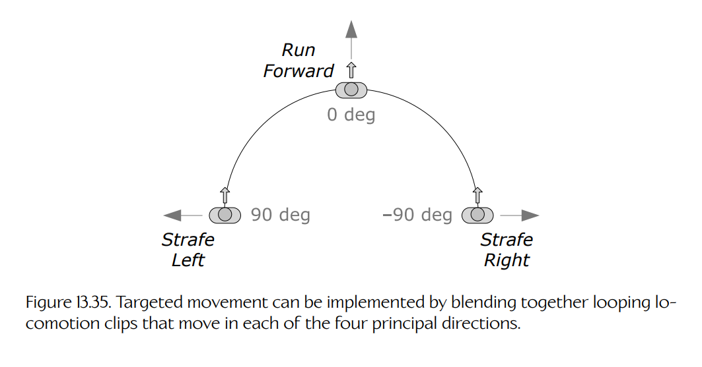

**Figure 13.35.** 目标式移动可以通过混合分别朝各主方向运动的循环移动片段来实现。

需要注意的是，我们没有把向后移动纳入混合，也没有做完整圆形混合。这是因为，一般来说，侧向横移与向后奔跑之间的混合无法做得自然。问题在于，当向左横移时，角色通常会让右脚从左脚前方交叉过去，这样混合到纯向前奔跑动画时看起来才正确。同样，右侧横移通常会创作为左脚从右脚前方交叉。当我们尝试把这样的横移动画直接混合到向后奔跑时，一条腿会开始穿过另一条腿，这看起来极其别扭且不自然。有许多方法可以解决这个问题。一种可行做法是定义两个半球形混合，一个用于向前运动，一个用于向后运动，每个都配有专门制作的横移动画，使其与对应的直线奔跑动画混合时能正常工作。当从一个半球过渡到另一个半球时，可以播放某种显式过渡动画，让角色有机会适当调整步态和腿部交叉方式。

**枢轴式移动。**

为了实现枢轴式移动，我们可以简单地播放向前移动循环，同时围绕角色整体的垂直轴旋转角色，让它转向。如果角色转向时身体不是像螺栓一样保持笔直，枢轴式移动会显得更加自然——真实人类转弯时往往会稍微向转弯方向倾斜。我们可以尝试让角色整体的垂直轴略微倾斜，但这会导致内侧脚陷入地面，而外侧脚离开地面。更自然的结果可以通过制作三个基础向前行走或奔跑动画的变体来实现——一个完全直行，一个进行极端左转，一个进行极端右转。然后我们可以在直行动画和极端左转动画之间进行 lerp 混合，以实现任意期望的倾斜角度。

### 13.6.3 复杂线性插值混合

在真实游戏引擎中，角色会出于各种目的使用大量复杂混合。为了便于使用，可以把某些常用复杂混合类型“预打包”。在以下小节中，我们将研究几种流行的预打包复杂混合类型。

#### 13.6.3.1 广义一维线性插值混合

Lerp 混合可以很容易扩展到两个以上的动画片段，这种技术称为**一维 lerp 混合**（one-dimensional lerp blending）。我们定义一个新的混合参数 $b$，它可以位于任意线性范围内（例如从 -1 到 +1，从 0 到 1，甚至从 27 到 136）。任意数量的片段都可以被放置在该范围内的任意点上，如 Figure 13.36 所示。对于任意给定的 $b$ 值，我们选择紧邻它的两个片段，并使用 Equation (13.5) 将它们混合在一起。如果两个相邻片段位于点 $b_1$ 和 $b_2$，那么混合百分比 $\beta$ 可以使用类似于 Equation (13.14) 的技术确定，如下所示：

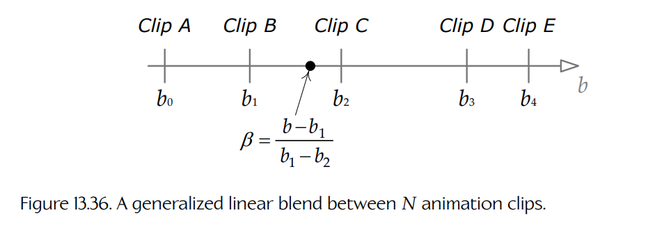

**Figure 13.36.** $N$ 个动画片段之间的广义线性混合。

$$
\beta(t)=\frac{b-b_1}{b_2-b_1}.
\tag{13.15}
$$

目标式移动只是一维 lerp 混合的一个特例。我们只是把放置方向动画片段的圆拉直，并使用运动方向角 $\theta$ 作为参数 $b$（范围为 -90 到 90 度）。任意数量的动画片段都可以放置在该混合范围内的任意角度上。Figure 13.37 展示了这一点。

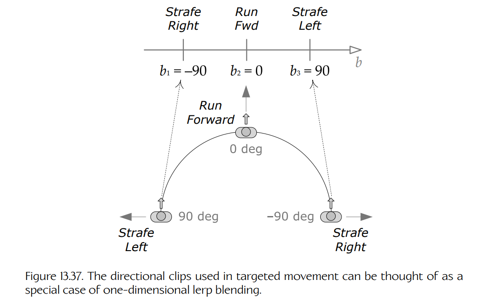

**Figure 13.37.** 目标式移动中使用的方向性片段可以被看作一维 lerp 混合的一个特例。

#### 13.6.3.2 简单双维线性插值混合

有时，我们希望同时平滑改变角色运动的两个方面。例如，我们可能希望角色能够在垂直方向和水平方向上瞄准武器。或者，我们可能希望角色在移动时能够改变步幅长度以及双脚之间的距离。我们可以将一维 lerp 混合扩展到二维，以实现这类效果。

如果我们知道自己的 2D 混合只涉及四个动画片段，并且这些片段位于正方形区域的四个角上，那么我们可以通过执行两个 1D 混合来求得混合姿态。我们的广义混合因子 $\mathbf{b}$ 变成一个二维混合向量 $\mathbf{b} = [b_x\ b_y]$。如果 $\mathbf{b}$ 位于由四个片段围成的正方形区域内，我们可以按以下步骤求得最终姿态：

1. 使用水平混合因子 $b_x$，找到两个中间姿态：一个位于顶部两个动画片段之间，另一个位于底部两个片段之间。这两个姿态可以通过执行两个简单的一维 lerp 混合得到。
2. 使用垂直混合因子 $b_y$，对这两个中间姿态进行 lerp 混合，从而得到最终姿态。

Figure 13.38 展示了这项技术。

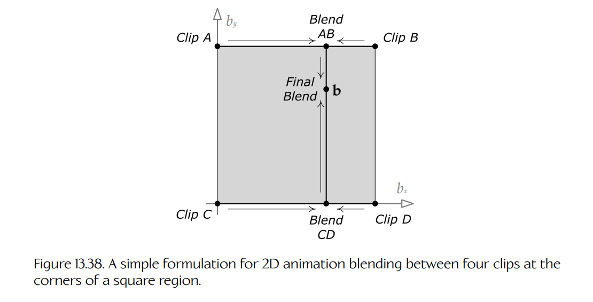

**Figure 13.38.** 在正方形区域四个角上的四个片段之间进行 2D 动画混合的一种简单公式化方式。

#### 13.6.3.3 三角形二维线性插值混合

上一节中研究的简单 2D 混合技术，只适用于我们希望混合的动画片段位于矩形区域四个角上的情况。那么，如果有任意数量的片段放置在 2D 混合空间中的任意位置，我们该如何混合？

设想我们有三个希望混合的动画片段。每个片段由索引 $i$ 表示，对应二维混合空间中的一个特定混合坐标 $\mathbf{b}_i = [b_{xi}\ b_{yi}]$；这三个坐标在混合空间中形成一个三角形。三个片段中的每一个都会定义一组关节姿态 $\{(\mathbf{P}_i)_j\}_{j=0}^{N-1}$，其中 $(\mathbf{P}_i)_j$ 是片段 $i$ 所定义的关节 $j$ 的姿态，而 $N$ 是骨架中的关节数量。我们希望找到与三角形内部任意点 $\mathbf{b}$ 对应的骨架插值姿态，如 Figure 13.39 所示。

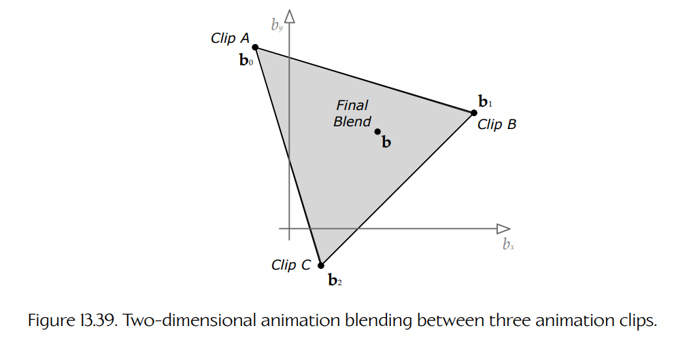

**Figure 13.39.** 三个动画片段之间的二维动画混合。

那么如何计算三个动画片段之间的 lerp 混合呢？幸运的是，答案很简单：lerp 函数实际上可以作用于任意数量的输入，因为它本质上就是一种**加权平均**。与任何加权平均一样，权重必须相加为 1。在双输入 lerp 混合的情况下，我们使用权重 $\beta$ 和 $(1-\beta)$，它们当然相加为 1。对于三输入 lerp，我们只需使用三个权重 $\alpha$、$\beta$ 和 $\gamma = (1-\alpha-\beta)$。然后我们可以如下计算 lerp：

$$
(\mathbf{P}_{\text{lerp}})_j
=
\alpha(\mathbf{P}_0)_j
+
\beta(\mathbf{P}_1)_j
+
\gamma(\mathbf{P}_2)_j.
\tag{13.16}
$$

给定二维混合向量 $\mathbf{b}$，我们可以通过寻找点 $\mathbf{b}$ 相对于三个片段在二维混合空间中形成的三角形的**重心坐标**（barycentric coordinates），得到混合权重 $\alpha$、$\beta$ 和 $\gamma$ [300]。一般来说，三角形内一点 $\mathbf{b}$ 相对于顶点 $\mathbf{b}_1$、$\mathbf{b}_2$ 和 $\mathbf{b}_3$ 的重心坐标是三个标量值 $(\alpha,\beta,\gamma)$，它们满足以下关系：

$$
\mathbf{b}
=
\alpha\mathbf{b}_0
+
\beta\mathbf{b}_1
+
\gamma\mathbf{b}_2,
\tag{13.17}
$$

以及：

$$
\alpha+\beta+\gamma=1.
$$

这正是三片段加权平均所需的权重。Figure 13.40 展示了重心坐标。

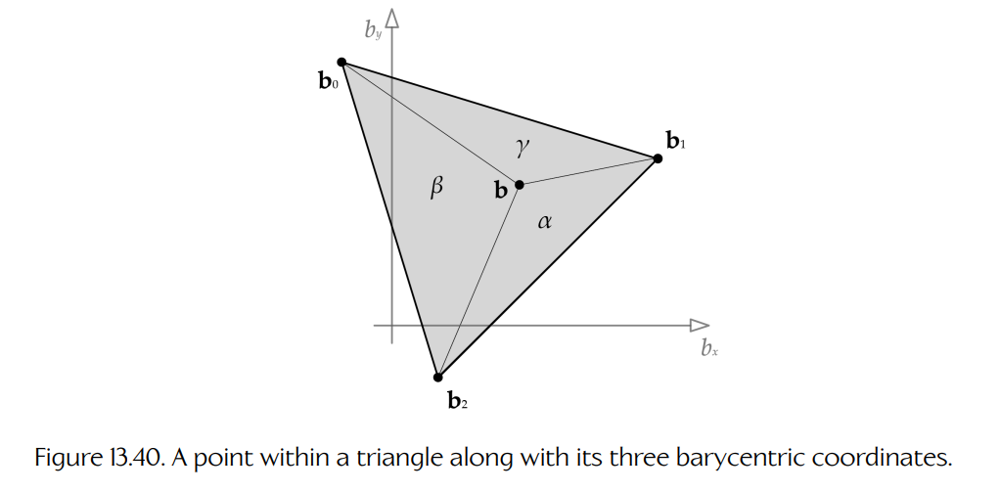

**Figure 13.40.** 三角形内部的一个点及其三个重心坐标。

注意，将重心坐标 $(1,0,0)$ 代入 Equation (13.17) 会得到 $\mathbf{b}_0$，而 $(0,1,0)$ 会得到 $\mathbf{b}_1$，$(0,0,1)$ 会得到 $\mathbf{b}_2$。同样，将这些混合权重代入 Equation (13.16)，对于每个关节 $j$，会分别得到姿态 $(\mathbf{P}_0)_j$、$(\mathbf{P}_1)_j$ 和 $(\mathbf{P}_2)_j$。此外，重心坐标 $(\frac{1}{3},\frac{1}{3},\frac{1}{3})$ 位于三角形的质心，并会在三个姿态之间给出均等混合。这正是我们所期望的。

#### 13.6.3.4 广义二维线性插值混合

重心坐标技术可以扩展到二维混合空间中、位于任意位置的任意数量动画片段。这里不会完整描述这项技术，但其基本思想是使用一种称为 **Delaunay 三角剖分**（Delaunay triangulation）[301] 的技术，根据各个动画片段的位置 $\mathbf{b}_i$ 找到一组三角形。一旦这些三角形被确定下来，我们就可以找到包围期望点 $\mathbf{b}$ 的三角形，然后按上文所述执行三片段 lerp 混合。该技术曾由 EA Sports 位于温哥华的团队在 FIFA 足球中使用，并实现于其专有的 “ANT” 动画框架中。Figure 13.41 展示了这一点。

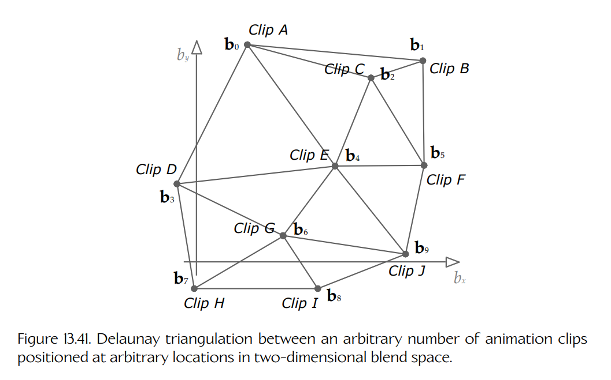

**Figure 13.41.** 在二维混合空间中，对位于任意位置的任意数量动画片段进行 Delaunay 三角剖分。

### 13.6.4 局部骨架混合

人类可以独立控制身体的不同部位。例如，我可以一边走路，一边挥动右臂，并用左臂指向某个东西。在游戏中实现这种运动的一种方法，是使用一种称为**局部骨架混合**（partial-skeleton blending）的技术。

回忆 Equations (13.5) 和 (13.6)：在执行常规 lerp 混合时，所有骨架关节都会使用相同的混合百分比 $\beta$。局部骨架混合对这个思想进行了扩展，允许混合百分比按关节变化。换句话说，对于每个关节 $j$，我们定义一个单独的混合百分比 $\beta_j$。整个骨架所有混合百分比的集合 $\{\beta_j\}_{j=0}^{N-1}$ 有时称为**混合遮罩**（blend mask），因为它可以通过将某些关节的混合百分比设为 0 来“遮蔽掉”这些关节。

举例来说，假设我们希望角色用右臂和右手向某人挥手。同时，我们还希望角色在挥手时能够行走、奔跑或静止站立。为了用局部混合实现这一点，动画师会定义三个全身动画：Walk、Run 和 Stand。动画师还会创建一个单独的挥手动画 Wave。然后创建一个混合遮罩，其中除右肩、右肘、右腕和手指关节之外，其他位置的混合百分比都为 0；这些右臂相关关节上的混合百分比为 1：

$$
\beta_j =
\begin{cases}
1, & \text{when } j \text{ within right arm,} \\
0, & \text{otherwise.}
\end{cases}
$$

当使用该混合遮罩将 Walk、Run 或 Stand 与 Wave 进行 lerp 混合时，结果就是一个看起来在行走、奔跑或站立的同时挥动右臂的角色。

局部混合很有用，但它往往会让角色运动看起来不自然。这主要有两个原因：

- 每关节混合因子的突变会让身体某个部位的运动看起来与身体其他部分脱节。在我们的例子中，混合因子在右肩关节处突然变化。因此，上脊柱、颈部和头部的动画由一个动画驱动，而右肩和手臂关节则完全由另一个不同动画驱动。这个问题可以通过逐渐改变混合因子，而不是突变改变来有所缓解。（在我们的例子中，可以在右肩处选择 0.9 的混合百分比，在上脊柱处选择 0.5，在颈部和中脊柱处选择 0.2。）
- 真实人体各部分的运动从来不是完全独立的。例如，相比静止站立时，一个人在奔跑时挥手应该看起来更加“弹跳”且难以控制。然而在局部混合中，无论身体其他部分在做什么，右臂动画都会完全相同。这个问题很难用局部混合克服。因此，许多游戏开发者转向一种看起来更自然的技术，称为**叠加混合**（additive blending）。

### 13.6.5 叠加混合

叠加混合以一种全新的方式处理动画组合问题。它引入了一种新的动画类型，称为**差异片段**（difference clip）。顾名思义，差异片段表示两个常规动画片段之间的差异。差异片段可以叠加到普通动画片段之上，以在角色姿态和运动中产生有趣变化。本质上，差异片段编码的是：为了将一个姿态变换成另一个姿态，需要对其进行哪些改变。在游戏行业中，差异片段通常称为**叠加动画片段**（additive animation clips）。本书中会继续使用差异片段这个术语，因为它能更准确地描述实际发生的事情。

考虑两个输入片段，称为**源片段**（source clip, S）和**参考片段**（reference clip, R）。从概念上讲，差异片段是 $\mathbf{D} = \mathbf{S} - \mathbf{R}$。如果将差异片段 $\mathbf{D}$ 加回其原始参考片段，我们就会得到源片段（$\mathbf{S} = \mathbf{D} + \mathbf{R}$）。我们也可以通过把一定百分比的 $\mathbf{D}$ 添加到 $\mathbf{R}$ 上，生成介于 $\mathbf{R}$ 和 $\mathbf{S}$ 之间的动画，其方式很像 lerp 混合在两个极端动画之间寻找中间动画。不过，叠加混合技术真正的优点在于：一旦差异片段被创建出来，它就可以被添加到其他无关片段上，而不仅限于原始参考片段。我们把这些动画称为**目标片段**（target clips），并用符号 $\mathbf{T}$ 表示。

举例来说，如果参考片段表现角色正常奔跑，而源片段表现角色疲惫地奔跑，那么差异片段只包含使角色在奔跑时看起来“疲惫”所需的变化。如果现在将这个差异片段应用到一个角色行走片段上，得到的动画就可以让角色在行走时看起来疲惫。通过将单个差异片段添加到各种“常规”动画片段之上，可以创建一大批有趣且非常自然的动画；也可以创建一组差异片段，每个差异片段在添加到同一个目标动画上时会产生不同效果。

#### 13.6.5.1 数学表述

差异动画 $\mathbf{D}$ 被定义为某个源动画 $\mathbf{S}$ 与某个参考动画 $\mathbf{R}$ 之间的差异。因此，从概念上讲，在单个时间点上的差异姿态是 $\mathbf{D} = \mathbf{S} - \mathbf{R}$。当然，我们处理的是关节姿态，而不是标量量，所以不能简单地相减这些姿态。一般来说，关节姿态是一个 $4 \times 4$ 仿射变换矩阵，它把点和向量从子关节局部空间变换到其父关节空间。矩阵意义上的“减法”等价物是乘以逆矩阵。因此，给定骨架中任意关节 $j$ 的源姿态 $\mathbf{S}_j$ 和参考姿态 $\mathbf{R}_j$，我们可以把该关节处的差异姿态 $\mathbf{D}_j$ 定义如下。（在本讨论中，我们会省略 $C \to P$ 或 $j \to p(j)$ 下标，因为这里默认处理的是子到父姿态矩阵。）

$$
\mathbf{D}_j = \mathbf{S}_j \mathbf{R}_j^{-1}.
$$

将差异姿态 $\mathbf{D}_j$ “添加”到目标姿态 $\mathbf{T}_j$ 上，会得到一个新的叠加姿态 $\mathbf{A}_j$。这只需把差异变换与目标变换连接起来即可，如下所示：

$$
\mathbf{A}_j
=
\mathbf{D}_j \mathbf{T}_j
=
(\mathbf{S}_j \mathbf{R}_j^{-1})\mathbf{T}_j.
\tag{13.18}
$$

我们可以验证这一点是正确的：观察将差异姿态“添加”回原始参考姿态时会发生什么：

$$
\mathbf{A}_j = \mathbf{D}_j\mathbf{R}_j
$$

$$
= \mathbf{S}_j\mathbf{R}_j^{-1}\mathbf{R}_j
$$

$$
= \mathbf{S}_j.
$$

换句话说，正如我们所期望的那样，将差异动画 $\mathbf{D}$ 添加回原始参考动画 $\mathbf{R}$，会得到源动画 $\mathbf{S}$。

**差异片段的时间插值。**

正如我们在 [Section 13.4.1.1](./04-clips.md#13411-pose-interpolation-and-continuous-time) 中学到的，游戏动画几乎从不会采样在整数帧索引处。为了在任意时间 $t$ 找到姿态，我们通常必须在相邻姿态采样时间 $t_1$ 和 $t_2$ 之间进行时间插值。幸运的是，差异片段也可以像非叠加片段一样进行时间插值。如果它们是普通动画，我们可以直接把 Equations (13.12) 和 (13.14) 应用于差异片段。

需要注意的是，只有当输入片段 S 和 R 的持续时间相同时，差异动画才能被找到。否则，会存在某段时间，其中 S 或 R 未定义，这意味着 D 也会未定义。

**叠加混合百分比。**

在游戏中，我们经常希望只混入差异动画的一定百分比，以产生不同程度的效果。例如，如果某个差异片段让角色把头向右转 80 度，那么混入 50% 的该差异片段应该只让角色把头向右转 40 度。

为了实现这一点，我们再次求助于老朋友 lerp。我们希望在未改变的目标动画和完整应用差异动画后得到的新动画之间进行插值。为此，我们将 Equation (13.18) 扩展如下：

$$
\mathbf{A}_j
=
\operatorname{lerp}(\mathbf{T}_j,\mathbf{D}_j\mathbf{T}_j,\beta)
\tag{13.19}
$$

$$
=
(1-\beta)(\mathbf{T}_j)+\beta(\mathbf{D}_j\mathbf{T}_j).
$$

正如我们在 Chapter 5 中看到的，不能直接对矩阵执行 lerp。因此 Equation (13.16) 必须分解为 S、Q 和 T 上的三个单独插值，就像我们在 Equations (13.7) 到 (13.11) 中所做的那样。

#### 13.6.5.2 叠加混合与局部混合

叠加混合在某些方面类似于局部混合。例如，我们可以取一个站立片段与一个站立并挥动右臂片段之间的差异。结果会与使用局部混合让右臂挥动基本相同。然而，叠加混合较少出现通过局部混合组合动画时那种“脱节”感。这是因为，在叠加混合中，我们并不是替换某一部分关节的动画，也不是在两个可能互不相关的姿态之间插值。相反，我们是在向原始动画添加运动——可能覆盖整个骨架。实际上，差异动画“知道”如何改变角色姿态，以便让角色做某件具体事情，例如疲惫、把头瞄向某个方向，或挥动手臂。这些变化可以应用到相当多种动画上，并且结果通常看起来非常自然。

#### 13.6.5.3 叠加混合的局限

当然，叠加动画并不是万能的。因为它会向现有动画添加运动，所以它可能会导致骨架中的关节过度旋转，尤其是当多个差异片段同时应用时。举一个简单例子，想象一个目标动画中角色左臂弯曲成 90 度。如果我们添加一个同样让肘部旋转 90 度的差异动画，那么净效果将是让手臂旋转 $90 + 90 = 180$ 度。这会导致前臂穿透上臂——对大多数人来说，这可不是一个舒服的姿势！

显然，在选择参考片段时，以及选择要应用差异片段的目标片段时，都必须小心。下面是一些简单经验法则：

- 参考片段中的髋部旋转应保持在最低限度。
- 肩关节和肘关节通常应在参考片段中处于中性姿态，以尽量减少将差异片段添加到其他目标时手臂发生过度旋转。
- 动画师应为每个核心姿态创建新的差异动画（例如直立站姿、蹲伏姿态、俯卧姿态等）。这能让动画师考虑真实人类在每种姿态中会如何运动。

这些经验法则可以作为有用的起点，但真正学会如何创建和应用差异片段的唯一方法，是通过反复试错，或向具有创建和应用差异动画经验的动画师或工程师学习。如果你的团队过去没有使用过叠加混合，那么预计需要投入大量时间来学习叠加混合这门技艺。

### 13.6.6 叠加混合的应用

#### 13.6.6.1 姿态变化

叠加混合的一个特别显著的应用是**姿态变化**（stance variation）。对于每个期望姿态，动画师会创建一个单帧差异动画。当这些单帧片段之一以叠加方式与基础动画混合时，它会让角色的整个姿态发生剧烈改变，同时角色仍然继续执行其本应执行的基本动作。Figure 13.42 展示了这个想法。

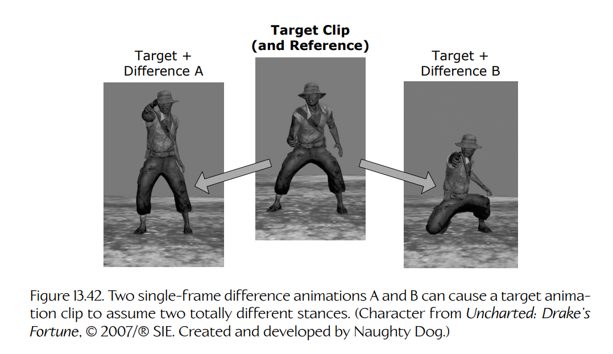

**Figure 13.42.** 两个单帧差异动画 A 和 B 可以让目标动画片段呈现两种完全不同的姿态。（角色来自《Uncharted: Drake’s Fortune》，© 2007/® SIE。由 Naughty Dog 创建并开发。）

#### 13.6.6.2 移动噪声

真实人类每次落脚时的奔跑方式并不完全相同——他们的运动会随时间发生变化。如果这个人分心了（例如正在攻击敌人），这一点尤其明显。叠加混合可以用于在原本完全重复的移动循环之上叠加随机性，或对分心事件的反应。Figure 13.43 展示了这一点。

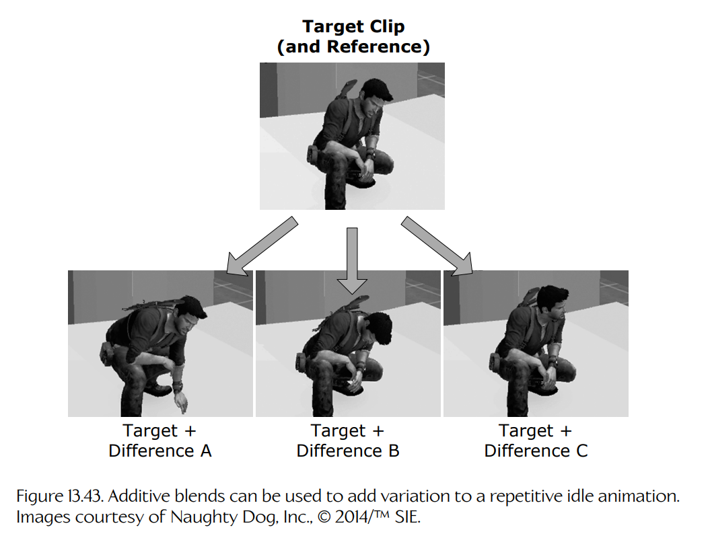

**Figure 13.43.** 叠加混合可用于为重复的待机动画添加变化。图片由 Naughty Dog, Inc. 提供，© 2014/TM SIE。

#### 13.6.6.3 瞄准与看向

叠加混合的另一个常见用途，是允许角色环顾四周或瞄准武器。为了实现这一点，首先让角色制作某个动作，例如奔跑，同时头部或武器正朝前方。然后，动画师将头部方向或武器瞄准方向改为极右，并保存一个单帧或多帧差异动画。这个过程会针对极左、向上和向下方向重复执行。随后，这四个差异动画可以以叠加方式混合到原始正前方动画片段之上，使角色能够向右、向左、向上、向下，或任意中间方向瞄准。

瞄准角度由每个片段的叠加混合因子控制。例如，混入 100% 的向右叠加动画，会让角色尽可能向右瞄准。混入 50% 的向左叠加动画，会让角色以其最左瞄准角度的一半进行瞄准。我们还可以把它与向上或向下叠加动画组合起来，以实现斜向瞄准。Figure 13.44 展示了这一点。

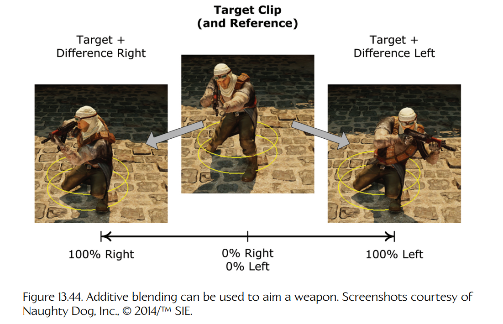

**Figure 13.44.** 叠加混合可以用于瞄准武器。截图由 Naughty Dog, Inc. 提供，© 2014/TM SIE。

#### 13.6.6.4 重载时间轴

有趣的是，动画片段的时间轴并不一定必须用于表示时间。例如，一个三帧动画片段可以用于向引擎提供三种瞄准姿态——第 1 帧是向左瞄准姿态，第 2 帧是向前瞄准姿态，第 3 帧是向右瞄准姿态。为了让角色向右瞄准，我们只需把瞄准动画的局部时钟固定在第 3 帧。为了在向前瞄准和向右瞄准之间进行 50% 混合，可以将局部时钟调到第 2.5 帧。这是一个很好例子，展示了如何把引擎已有功能用于新的目的。
