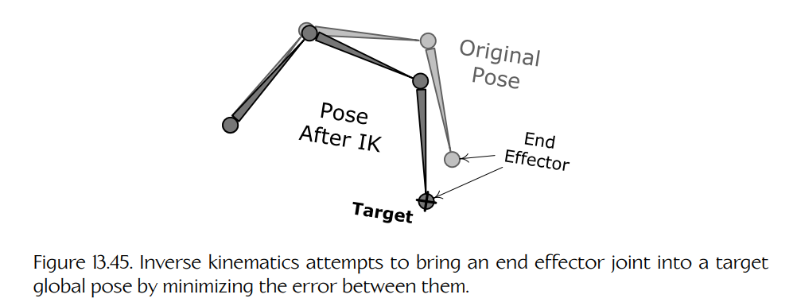
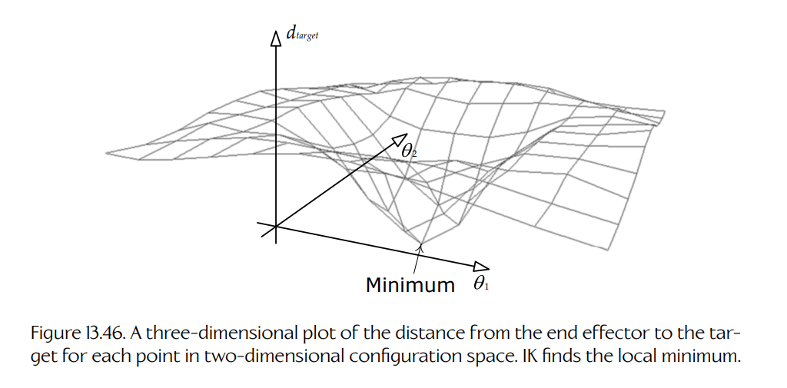

## 13.7 后处理

一旦骨架已经由一个或多个动画片段摆好姿态，并且结果已经通过线性插值或叠加混合组合在一起，在渲染角色之前，通常还需要修改该姿态。这称为**动画后处理**（animation post-processing）。在本节中，我们将了解几种最常见的动画后处理类型。

### 13.7.1 程序化动画

**程序化动画**（procedural animation）是指任何在运行时生成的动画，而不是由 Maya 这类动画工具导出的数据驱动的动画。有时，手工制作的动画片段会先用于给骨架摆出初始姿态，然后作为后处理步骤，通过程序化动画以某种方式修改该姿态。程序化动画也可以直接作为系统输入，用来取代手工制作的动画片段。

例如，设想使用一个常规动画片段，让载具在地形上移动时看起来会上下颠簸。载具行驶方向由玩家控制。我们希望调整前轮和方向盘的旋转，使它们在载具转向时能够令人信服地运动。这可以通过对动画生成的姿态进行后处理来完成。假设原始动画中前轮正朝前方，方向盘处于中立位置。我们可以使用当前转向角，创建一个绕垂直轴旋转的四元数，使前轮偏转到期望角度。这个四元数可以与前轮关节的 Q 通道相乘，以产生轮胎的最终姿态。同样，我们可以生成一个绕转向柱轴线旋转的四元数，并将其乘入方向盘关节的 Q 通道，使方向盘发生偏转。这些调整发生在**局部姿态**（local pose）上，位于全局姿态计算和矩阵调色板生成之前（见 [Section 13.5](./05-skinning-and-matrix-palette-generation.md)）。

再举一个例子，假设我们希望游戏世界中的树木和灌木在风中自然摇曳，并且当角色穿过它们时被拨开。我们可以通过把树木和灌木建模为带有简单骨架的蒙皮网格来实现这一点。程序化动画可以用来代替手工制作的动画片段，或与其一起使用，使关节以自然的方式运动。我们可以把一个或多个正弦函数，或一个 Perlin 噪声函数，应用到不同关节的旋转上，让它们在微风中摇摆；而当角色穿过包含灌木或草丛的区域时，可以将其根关节四元数径向向外偏转，使它看起来像是被角色推倒。

### 13.7.2 反向运动学

假设我们有一个动画片段，其中角色弯腰从地上捡起一个物体。在 Maya 中，这个片段看起来很好；但在实际生产游戏关卡中，地面并不完全平坦，因此角色的手有时会够不到物体，或者看起来穿过物体。在这种情况下，我们希望调整骨架的最终姿态，使手恰好与目标物体对齐。可以使用一种称为**反向运动学**（inverse kinematics, IK）的技术来实现这一点。

常规动画片段是**正向运动学**（forward kinematics, FK）的一个例子。在正向运动学中，输入是一组局部关节姿态，输出则是每个关节的全局姿态和蒙皮矩阵。反向运动学沿相反方向工作：输入是单个关节的期望全局姿态，该关节称为**末端执行器**（end effector）。我们求解骨架中其他关节的**局部姿态**，使末端执行器到达期望位置。

从数学上说，IK 可以归结为一个**误差最小化**（error minimization）问题。与大多数最小化问题一样，解可能只有一个，也可能有多个，甚至可能没有解。这在直觉上也很合理：如果我试图够到房间另一端的门把手，在不走过去的情况下我是不可能够到的。IK 在骨架初始姿态已经与期望目标相当接近时效果最好。这有助于算法聚焦到“最近”的解，并在合理的处理时间内完成。Figure 13.45 展示了 IK 的作用。

**Figure 13.45.** 反向运动学试图通过最小化末端执行器关节与目标全局姿态之间的误差，使末端执行器到达目标姿态。

设想一个双关节骨架，其中每个关节都只能绕单个轴旋转。这两个关节的旋转可以用一个二维角度向量 $\boldsymbol{\theta} = [\theta_1\ \theta_2]$ 描述。两个关节所有可能角度的集合构成一个二维空间，称为**配置空间**（configuration space）。显然，对于更复杂的骨架，若每个关节拥有更多自由度，配置空间会变成多维空间；但无论我们有多少维，这里描述的概念都同样适用。

现在设想绘制一张三维图：对于每一种关节旋转组合（即二维配置空间中的每一个点），都绘制末端执行器到期望目标之间的距离。Figure 13.46 展示了这类图的一个例子。这个三维曲面中的“山谷”表示末端执行器尽可能接近目标的区域。当曲面的高度为零时，末端执行器已经到达目标。因此，反向运动学试图在这个曲面上寻找极小值（低点）。

**Figure 13.46.** 在二维配置空间中，对每个点绘制末端执行器到目标的距离所形成的三维图。IK 会寻找局部极小值。

这里不会深入讨论如何求解 IK 最小化问题。关于 IK 的更多内容，可阅读 [302]，以及 Jason Weber 发表在 *Game Programming Gems 3* 中的文章 “Constrained Inverse Kinematics” [53]。

### 13.7.3 布娃娃

当角色死亡或失去意识时，其身体会变得松弛。在这类情况下，我们希望身体能够以物理上真实的方式与周围环境发生反应。为此，可以使用**布娃娃**（rag doll）。布娃娃是一组经过物理模拟的刚体集合，其中每个刚体表示角色身体中一个半刚性的部位，例如前臂或大腿。这些刚体在角色关节处相互约束，从而产生看起来自然的“无生命”身体运动。刚体的位置和朝向由物理系统决定，随后用于驱动角色骨架中某些关键关节的位置和朝向。物理系统到骨架的数据传递通常作为后处理步骤完成。

要真正理解布娃娃物理，必须首先理解碰撞系统和物理系统的工作方式。布娃娃将在 [Section 14.4.8.7](../14-collision-and-rigid-body-dynamics/04-rigid-body-dynamics.md#14487-rag-dolls) 和 [Section 14.5.3.8](../14-collision-and-rigid-body-dynamics/05-integrating-a-physics-engine-into-your-game.md#14538-rag-dolls) 中更详细地讨论。