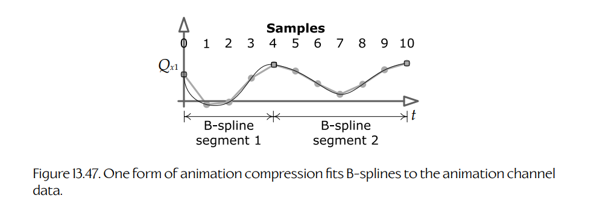

## 13.8 压缩技术

动画数据可能会占用大量内存。一个关节姿态可能由 10 个浮点通道组成（三个用于平移，四个用于旋转，最多还有三个用于缩放）。假设每个通道包含一个 4 字节浮点值，那么一个以每秒 30 个采样采样的 1 秒片段，将占用 $4 \text{ bytes} \times 10 \text{ channels} \times 30 \text{ samples/second} = 1200 \text{ bytes}$，也就是每个关节每秒约 1.17 KiB 的数据率。对于一个 100 关节的骨架（按今天的标准来看已经算小），未压缩动画片段将占用每秒 117 KiB。如果游戏包含 1000 秒动画（对于现代游戏来说这还偏少），整个数据集将占用高达 114.4 MiB。考虑到 PlayStation 3 只有 256 MiB 主内存和 256 MiB 显存，这已经相当多了。没错，PS4 拥有 8 GiB 统一内存，PS5 拥有 16 GiB，但即便如此，我们仍然宁愿拥有更加丰富、变化更多的动画，而不是不必要地浪费内存。因此，游戏工程师会投入大量精力压缩动画数据，以便用最小的内存成本实现最丰富、最多样的运动表现。

### 13.8.1 通道省略

减少动画片段大小的一种简单方式，是省略无关通道。许多角色不需要非均匀缩放，因此三个缩放通道可以减少为单个均匀缩放通道。在某些游戏中，所有关节的缩放通道实际上都可以完全省略（也许面部关节除外）。类人角色的骨骼通常不能伸缩，因此除了根节点、面部关节，有时还有锁骨之外，所有关节的平移通常都可以省略。最后，由于四元数总是归一化的，我们可以只存储每个四元数的三个分量（例如 $x$、$y$ 和 $z$），并在运行时重建第四个分量（例如 $w$）。

作为进一步优化，对于整个动画过程中姿态不会变化的通道，可以只存储 $t = 0$ 处的单个采样，再附加一位表示该通道对于所有其他 $t$ 值都是常量。

通道省略可以显著减少动画片段的大小。一个没有缩放、没有平移的 100 关节角色只需要 303 个通道——每个关节的四元数需要三个通道，再加上根关节平移的三个通道。相比之下，如果所有 100 个关节都包含全部 10 个通道，则需要 1000 个通道。

### 13.8.2 量化

另一种减少动画大小的方法，是减少每个通道本身的大小。浮点值通常以 32 位 IEEE 格式存储。该格式在尾数中提供 23 位精度，并带有 8 位指数。然而，在动画片段中，通常没有必要保留这种精度和范围。当存储四元数时，通道值保证位于 $[-1,1]$ 范围内。在大小为 1 时，32 位 IEEE 浮点数的指数为 0，而 23 位精度可以让精度达到小数点后第七位。经验表明，四元数只用 16 位精度也可以很好地编码，因此如果用 32 位浮点数存储四元数，每个通道实际上浪费了 16 位。

将 32 位 IEEE 浮点数转换为 $n$ 位整数表示，称为**量化**（quantization）。这个操作实际上包含两个组成部分：**编码**（encoding）是将原始浮点值转换为量化整数表示的过程；**解码**（decoding）是从量化整数恢复原始浮点值近似值的过程。（我们只能恢复原始数据的一个**近似值**——量化是一种**有损**压缩方法，因为它实际上减少了用于表示该值的精度位数。）

为了将浮点值编码为整数，我们首先把可能输入值的有效范围划分为 $N$ 个大小相等的**区间**（intervals）。然后判断某个具体浮点值位于哪个区间内，并用该区间的**整数索引**来表示该值。为了解码这个量化值，我们只需将整数索引转换为浮点格式，并将其平移和缩放回原始范围。$N$ 通常会被选为与 $n$ 位整数能够表示的可能整数值范围相对应。例如，如果我们把一个 32 位浮点值编码为 16 位整数，那么区间数量就是 $N = 2^{16} = 65,536$。

Jonathan Blow 曾在 *Game Developer Magazine* 的 *Inner Product* 专栏中写过一篇关于浮点标量量化的优秀文章，可见 [303]。该文章提出了编码过程中将浮点值映射到区间的两种方式：可以将浮点数**截断**到下一个最低区间边界（T encoding），也可以将浮点数**舍入**到包含它的区间中心（R encoding）。同样，它还描述了从整数表示重建浮点值的两种方式：可以返回原始值所映射区间的**左端点**值（L reconstruction），也可以返回该区间的**中心**值（C reconstruction）。这样就产生了四种可能的编码/解码方法：TL、TC、RL 和 RC。其中，TL 和 RC 应当避免使用，因为它们倾向于从数据集中移除或添加能量，这往往会产生灾难性后果。TC 的优点是从带宽角度看最高效，但它有一个严重问题——无法精确表示数值 0。（如果编码 0.0f，解码时会变成一个很小的正数。）因此，RL 通常是最佳选择，也是这里将要演示的方法。

该文章只讨论了正浮点值的量化，并且在示例中，为了简单起见，假设输入范围为 $[0,1]$。不过，我们总是可以把任意浮点范围平移和缩放到 $[0,1]$。例如，四元数通道的范围是 $[-1,1]$，但可以通过先加一再除以二，将其转换到 $[0,1]$ 范围。

下面这一对例程按照 Jonathan Blow 的 RL 方法，将位于 $[0,1]$ 范围内的输入浮点值编码和解码为一个 $n$ 位整数。量化值总是作为 32 位无符号整数（`U32`）返回，但实际上只使用最低有效的 $n$ 位，具体由 `nBits` 参数指定。例如，如果传入 `nBits == 16`，就可以安全地将结果转换为 `U16`。

~~~cpp
U32 CompressUnitFloatRL(F32 unitFloat, U32 nBits)
{
    // 根据要求生成的输出位数，确定区间数量。
    U32 nIntervals = 1u << nBits;

    // 将输入值从 [0, 1] 范围缩放到
    // [0, nIntervals - 1] 范围。我们少用一个区间，
    // 因为希望最大输出值能够放入 nBits 位中。
    F32 scaled = unitFloat * (F32)(nIntervals - 1u);

    // 最后，舍入到最近的区间中心。
    // 做法是加上 0.5f，然后截断到下一个最低
    // 区间索引（通过转换为 U32）。
    U32 rounded = (U32)(scaled + 0.5f);

    // 防止无效输入值。
    if (rounded > nIntervals - 1u)
        rounded = nIntervals - 1u;

    return rounded;
}

F32 DecompressUnitFloatRL(U32 quantized, U32 nBits)
{
    // 根据编码该值时使用的位数，确定区间数量。
    U32 nIntervals = 1u << nBits;

    // 解码时只需将 U32 转换为 F32，
    // 并按区间大小进行缩放。
    F32 intervalSize = 1.0f / (F32)(nIntervals - 1u);
    F32 approxUnitFloat = (F32)quantized * intervalSize;

    return approxUnitFloat;
}
~~~

为了处理 $[min,max]$ 范围内的任意输入值，可以使用以下例程：

~~~cpp
U32 CompressFloatRL(F32 value, F32 min, F32 max,
                    U32 nBits)
{
    F32 unitFloat = (value - min) / (max - min);
    U32 quantized = CompressUnitFloatRL(unitFloat,
                                        nBits);

    return quantized;
}

F32 DecompressFloatRL(U32 quantized, F32 min, F32 max,
                      U32 nBits)
{
    F32 unitFloat = DecompressUnitFloatRL(quantized,
                                          nBits);
    F32 value = min + (unitFloat * (max - min));
    return value;
}
~~~

让我们回到原来的动画通道压缩问题。为了把四元数的四个分量压缩和解压缩到每通道 16 位，我们只需调用 `CompressFloatRL()` 和 `DecompressFloatRL()`，并使用 $min=-1$、$max=1$、$n=16$：

~~~cpp
inline U16 CompressRotationChannel(F32 qx)
{
    return (U16)CompressFloatRL(qx, -1.0f, 1.0f, 16u);
}

inline F32 DecompressRotationChannel(U16 qx)
{
    return DecompressFloatRL((U32)qx, -1.0f, 1.0f, 16u);
}
~~~

平移通道的压缩比旋转通道稍微棘手一些，因为不同于四元数通道，平移通道的范围理论上可能是无界的。幸运的是，在实践中，角色关节不会移动得太远，因此可以确定一个合理的运动范围；如果看到某个动画包含超出有效范围的平移，就标记为错误。游戏内过场动画是这一规则的例外——当 IGC 在世界空间中制作动画时，角色根关节的平移可能会变得非常大。为了解决这一点，可以根据每个动画或每个关节来选择有效平移范围，具体取决于每个片段中实际达到的最大平移量。由于数据范围可能因动画而异，或因关节而异，因此必须将该范围与压缩片段数据一起存储。这会给每个动画片段增加极少量数据，但总体影响通常可以忽略。

~~~cpp
// 这里使用 2 m 范围——具体情况视项目而定。
F32 MAX_TRANSLATION = 2.0f;

inline U16 CompressTranslationChannel(F32 vx)
{
    // 钳制到有效范围……
    if (vx < -MAX_TRANSLATION)
        vx = -MAX_TRANSLATION;
    if (vx > MAX_TRANSLATION)
        vx = MAX_TRANSLATION;

    return (U16)CompressFloatRL(vx,
                                -MAX_TRANSLATION, MAX_TRANSLATION, 16);
}

inline F32 DecompressTranslationChannel(U16 vx)
{
    return DecompressFloatRL((U32)vx,
                             -MAX_TRANSLATION, MAX_TRANSLATION, 16);
}
~~~

### 13.8.3 采样频率与关键帧省略

动画数据往往很大，原因主要有三个：第一，每个关节姿态最多可以包含 10 个浮点数据通道；第二，一个骨架包含大量关节（PS3 或 Xbox 360 上的人形角色可能有 250 个或更多关节，一些 PS4 和 Xbox One 游戏中超过 800 个，在 PS5 和 Xbox Series X/S 游戏中甚至更多）；第三，角色姿态通常以较高频率采样（例如每秒 30 帧）。我们已经看过一些解决第一个问题的方法。我们无法真正减少高分辨率角色的关节数量，因此第二个问题无法避免。为了处理第三个问题，可以采取两种做法：

- **整体降低采样率**。有些动画以每秒 15 个采样导出时看起来也很好，而这样做可以将动画数据大小减半。
- **省略部分采样**。如果某个通道的数据在片段内某段时间区间中以近似线性方式变化，那么可以省略该区间内除端点之外的所有采样。然后在运行时，可以使用线性插值恢复被丢弃的采样。

后一种技术会稍微复杂一些，并且要求我们存储每个采样的**时间**信息。这些额外数据可能会侵蚀我们一开始通过省略采样所获得的节省。不过，一些游戏引擎已经成功使用了这项技术。

### 13.8.4 基于曲线的压缩

我用过的最强大、最易用、设计最完善的动画 API 之一，是 RAD Game Tools 的 Granny。（可惜它已经不再销售。）Granny 存储动画的方式不是规则间隔的姿态采样序列，而是一组 $n$ 阶、非均匀、非有理 B 样条，用来描述某个关节的 S、Q 和 T 通道随时间变化的路径。使用 B 样条可以让具有大量曲率的通道只用少量数据点编码。

Granny 会像传统动画数据那样，先以规则间隔采样关节姿态来导出动画。然后，Granny 会为每个通道将一组 B 样条拟合到采样数据集，并满足用户指定的容差。最终得到的动画片段通常会明显小于其均匀采样、线性插值的对应版本。Figure 13.47 展示了这一过程。

**Figure 13.47.** 一种动画压缩形式会将 B 样条拟合到动画通道数据上。

### 13.8.5 小波压缩

压缩动画数据的另一种方式，是通过一种称为**小波压缩**（wavelet compression）的技术，将**信号处理理论**（signal processing theory）应用到这个问题上。**小波**（wavelet）是一种函数，其振幅像波一样振荡，但持续时间很短，类似池塘中的短暂涟漪。小波函数会被精心构造，使其具备适合信号处理用途的理想性质。

在小波压缩中，动画曲线会被分解为一组正交小波之和，这与任意信号可以表示为一串 delta 函数或一组正弦函数之和的方式非常相似。我们将在 [Section 15.2](../15-audio/02-the-mathematics-of-sound.md#152-the-mathematics-of-sound) 中较深入地讨论信号处理和线性时不变系统；其中介绍的概念构成了理解小波压缩所需的基础。完整讨论基于小波的压缩技术已经超出本书范围，不过你可以在线阅读更多内容。搜索 “wavelet” 可以找到该主题的入门文章，然后可以阅读 [304]，这是一篇很好的文章，介绍了 Eidos Montreal 如何在《Thief》（2014）中实现小波压缩。

### 13.8.6 选择性加载与流式传输

最便宜的动画片段，是根本不在内存中的动画片段。大多数游戏并不需要所有动画片段同时驻留内存。一些片段只适用于特定类别的角色，因此在不会遇到该类角色的关卡中，就不必加载这些片段。另一些片段则只适用于游戏中的一次性时刻。它们可以在即将需要时加载或流式传输到内存中，并在播放完成后从内存中卸载。

大多数游戏会在游戏首次启动时，将一组核心动画片段加载到内存中，并在整个游戏过程中保持驻留。这些片段包括玩家角色的核心移动集合，以及适用于游戏中反复出现对象的动画，例如武器或强化道具。所有其他动画通常按需加载。一些游戏引擎会单独加载动画片段，但很多引擎会把它们打包成逻辑组，使其可以作为一个单元进行加载和卸载。