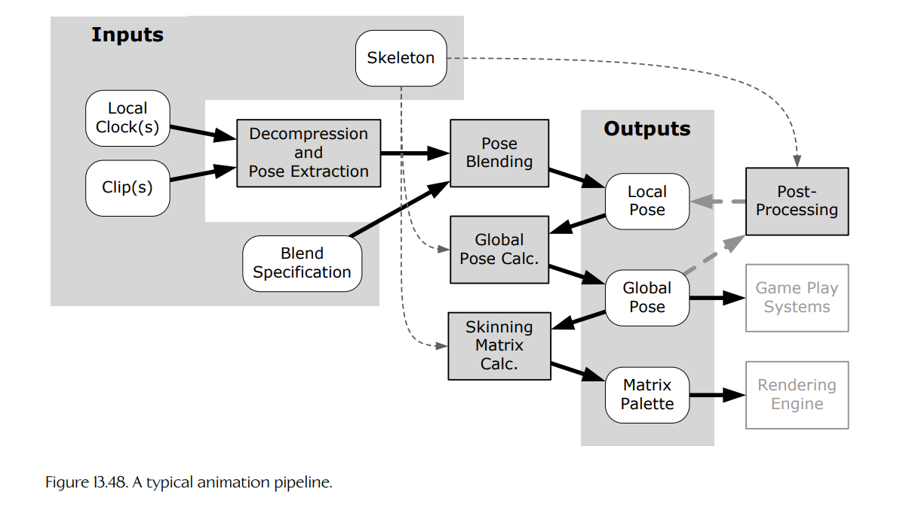

## 13.9 动画管线

低层动画引擎所执行的操作构成了一条**管线**（pipeline），它会把输入（动画片段和混合规格）转换为期望输出（局部姿态和全局姿态，以及用于渲染的矩阵调色板）。

对于游戏中每个正在播放动画的角色和对象，动画管线会将一个或多个动画片段以及对应的混合因子作为输入，将它们混合在一起，并生成单一的局部骨骼姿态作为输出。它还会为骨架计算一个全局姿态，并生成一组供渲染引擎使用的蒙皮矩阵调色板。通常也会提供后处理钩子，使局部姿态能够在最终全局姿态和矩阵调色板生成之前被修改。反向运动学（IK）、布娃娃物理以及其他形式的程序化动画，就是在这里应用到骨架上的。

这条管线的阶段如下：

1. **片段解压缩与姿态提取**（clip decompression and pose extraction）。在这个阶段，每个单独片段的数据会被解压缩，并针对当前时间索引提取出一个静态姿态。该阶段的输出是每个输入片段对应的一个局部骨骼姿态。这个姿态可能包含骨架中每个关节的信息（**全身姿态**，full-body pose），也可能只包含一部分关节的信息（**局部姿态**，partial pose），还可能是用于叠加混合的**差异姿态**（difference pose）。

2. **姿态混合**（pose blending）。在这个阶段，输入姿态会通过全身 lerp 混合、局部骨架 lerp 混合和/或叠加混合组合在一起。该阶段的输出是骨架中所有关节的单一局部姿态。当然，只有当需要将多个动画片段混合在一起时，才会执行这个阶段；否则，第 1 阶段输出的姿态可以直接使用。

3. **全局姿态生成**（global pose generation）。在这个阶段，会遍历骨骼层级结构，并连接局部关节姿态，从而为骨架生成全局姿态。

4. **后处理**（post-processing）。在这个可选阶段中，可以在姿态最终确定之前，修改骨架的局部姿态和/或全局姿态。后处理用于反向运动学、布娃娃物理，以及其他形式的程序化动画调整。

5. **重新计算全局姿态**（recalculation of global poses）。许多类型的后处理需要以全局姿态信息作为输入，但会生成局部姿态作为输出。在这类后处理步骤运行之后，必须根据修改后的局部姿态重新计算全局姿态。显然，如果某个后处理操作不需要全局姿态信息，那么它可以放在第 2 阶段和第 3 阶段之间执行，从而避免重新计算全局姿态。

6. **矩阵调色板生成**（matrix palette generation）。一旦最终全局姿态已经生成，就会将每个关节的全局姿态矩阵乘以对应的逆绑定姿态矩阵。该阶段的输出是一组适合作为输入传递给渲染引擎的蒙皮矩阵调色板。

**Figure 13.48.** 典型动画管线。
