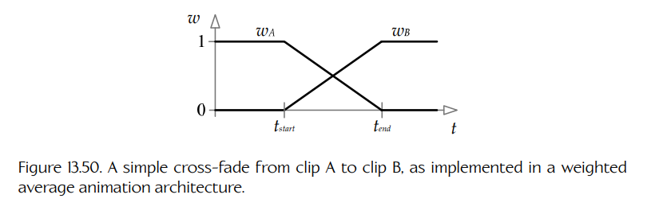
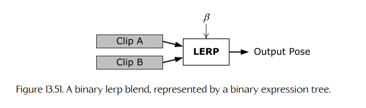
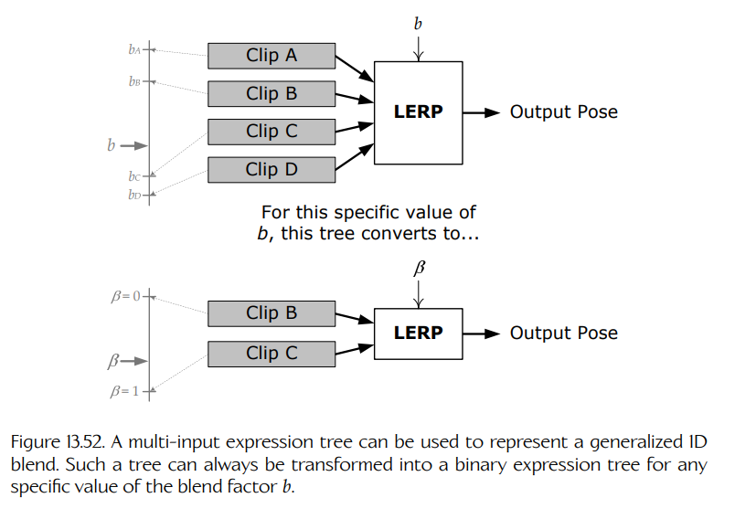
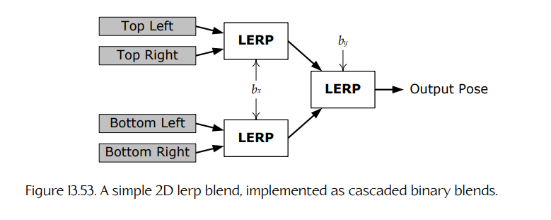
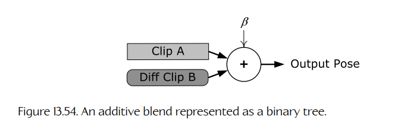
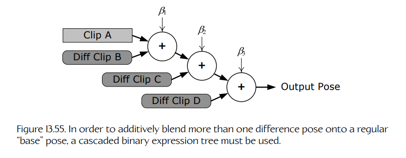
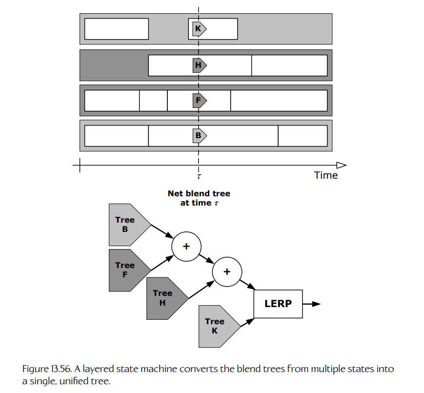
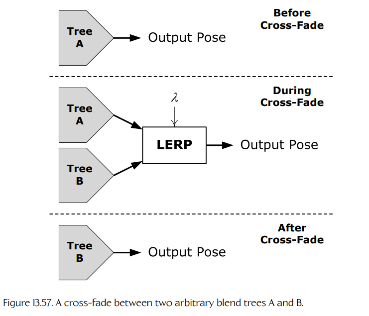
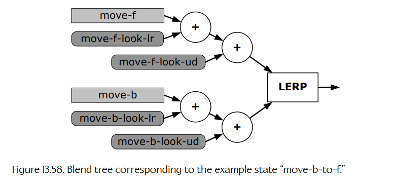
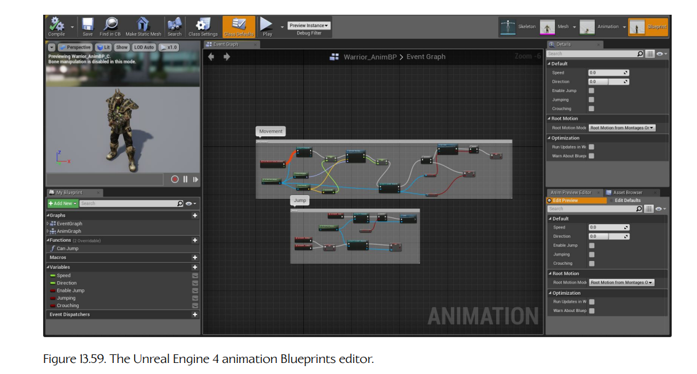

## 13.10 动作状态机

游戏角色的动作（站立、行走、奔跑、跳跃等）通常最适合通过**有限状态机**（finite state machine）建模，通常称为**动作状态机**（action state machine, ASM）。ASM 子系统位于动画管线之上，并为几乎所有更高层游戏代码提供一个状态驱动的动画接口。

ASM 中的每个状态都对应于一个任意复杂的、由多个同时播放的动画片段构成的混合。有些状态可能非常简单——例如，“idle” 状态可能只由一个全身动画组成。其他状态可能更加复杂。“running” 状态可能对应于一个半圆形混合，其中向左横移、向前奔跑和向右横移分别位于 -90 度、0 度和 +90 度点。“running while shooting” 状态可能包含一个半圆形方向混合，再加上叠加混合或局部骨架混合节点，用于让角色的武器向上、向下、向左和向右瞄准；还可能包含额外混合，使角色能够用眼睛、头部和肩膀环顾四周。还可以包含更多叠加动画，用于控制角色的整体姿态、步态和移动时的脚间距，并通过随机运动变化提供一定程度的“人性化”。

角色的 ASM 还会确保角色能够从一个状态**平滑过渡**（transition）到另一个状态。在从状态 A 过渡到状态 B 的过程中，两个状态的最终输出姿态通常会混合在一起，从而在二者之间提供平滑的**交叉淡化**（cross-fade）。

一些动画引擎还允许角色身体的不同部位同时执行不同的、独立或半独立的动作。例如，角色可能正在奔跑，同时用手臂瞄准并开火，并用面部关节说出一句对白。身体不同部位的运动通常也并不会完全同步——身体的某些部位往往会“引导”其他部位的运动（例如，头部先引导一次转身，随后是肩膀、髋部，最后是双腿）。在传统动画中，这种著名技术称为**预备动作**（anticipation）[58]。这种复杂运动可以通过允许多个独立状态机控制单个角色来实现。通常，每个状态机都存在于一个单独的**状态层**（state layer）中，如 Figure 13.49 所示。每一层 ASM 的输出姿态会混合在一起，形成最终的复合姿态。

**Figure 13.49.** 分层动作状态机，展示了每一层的状态过渡在时间上是相互独立的。在这个例子中，基础层描述角色的全身姿态和移动。变化层通过向角色姿态应用叠加片段来提供变化。最后，两个手势层——一个叠加层和一个局部层——允许角色瞄准或指向周围世界中的物体。

这一切意味着，在任意给定时刻，多个动画片段都会共同影响角色骨架的最终姿态。因此，对于每个角色，我们需要一种方式来跟踪所有当前正在播放的片段，并描述它们究竟应该如何混合在一起，以生成角色的最终姿态。一般来说，有两种做法：

1. **扁平加权平均**（flat weighted average）。在这种方法中，引擎维护一个扁平列表，包含所有当前正在影响角色最终姿态的动画片段，每个片段对应一个混合权重。这些动画会作为一个大的加权平均整体混合在一起，以生成最终姿态。

2. **混合树**（blend trees）。在这种方法中，每个参与混合的片段都由树的叶节点表示。树的内部节点表示对这些片段执行的各种混合操作。多个混合操作会组合起来形成动作状态。还会引入额外的混合节点来表示临时交叉淡化。在分层 ASM 中，各层动作状态得到的输出姿态会再次混合在一起。这样，角色最终姿态实际上是在这个潜在复杂混合树的根部产生的。

### 13.10.1 扁平加权平均方法

在扁平加权平均方法中，给定角色上当前正在播放的每个动画片段，都关联一个混合权重，用于表示该片段应当对最终姿态贡献多少。系统会维护一个由所有**活动**动画片段组成的扁平列表（即混合权重非零的片段）。为了计算骨架的最终姿态，我们会在每个 $N$ 个活动片段的合适时间索引处提取一个姿态。然后，对于骨架中的每个关节，我们会对从这 $N$ 个活动动画中提取出的平移向量、旋转四元数和缩放因子计算一个简单的 $N$ 点加权平均。这样就得到骨架的最终姿态。

一组 $N$ 个向量 $\{\mathbf{v}_i\}$ 的加权平均公式如下：

$$
\mathbf{v}_{\text{avg}}
=
\frac{
\sum_{i=0}^{N-1} w_i \mathbf{v}_i
}{
\sum_{i=0}^{N-1} w_i
}.
$$

如果权重已经**归一化**（normalized），即它们相加为 1，那么该公式可以简化为：

$$
\mathbf{v}_{\text{avg}}
=
\sum_{i=0}^{N-1} w_i \mathbf{v}_i,
\qquad
\text{when }
\sum_{i=0}^{N-1} w_i = 1.
$$

当 $N = 2$ 时，如果令 $w_0 = (1-\beta)$ 且 $w_1 = \beta$，则加权平均会退化为我们熟悉的两个向量之间线性插值（lerp）公式：

$$
\mathbf{v}_{\text{avg}}
=
w_0\mathbf{v}_A + w_1\mathbf{v}_B
$$

$$
=
(1-\beta)\mathbf{v}_A + \beta\mathbf{v}_B
$$

$$
=
\operatorname{lerp}[\mathbf{v}_A,\mathbf{v}_B,\beta].
$$

通过简单地把四元数视为四元素向量，也可以将同样的加权平均公式应用到四元数上。

#### 13.10.1.1 示例：OGRE

OGRE 动画系统正是以这种方式工作的。一个 `Ogre::Entity` 表示一个 3D 网格实例（例如，在游戏世界中四处行走的某个具体角色）。`Entity` 聚合了一个名为 `Ogre::AnimationStateSet` 的对象，而这个对象又为每个活动动画维护一个 `Ogre::AnimationState` 对象列表。`Ogre::AnimationState` 类如下方代码片段所示。（为清晰起见，省略了一些无关细节。）

~~~cpp
// 表示一个动画片段的状态，以及
// 它对角色整体姿态的影响权重。
//
class AnimationState
{
protected:
    String          mAnimationName; // 对片段的引用
    Real            mTimePos;       // 局部时钟
    Real            mWeight;        // 混合权重
    bool            mEnabled;       // 该动画是否正在运行？
    bool            mLoop;          // 该动画是否应该循环？

public:
    // API 函数……
};
~~~

每个 `AnimationState` 都会跟踪一个动画片段的局部时钟及其混合权重。计算某个 `Ogre::Entity` 的骨架最终姿态时，OGRE 的动画系统只需遍历其 `AnimationStateSet` 中的每个活动 `AnimationState`。系统会从每个状态对应的动画片段中，在该状态局部时钟指定的时间索引处提取一个骨骼姿态。然后，对于骨架中的每个关节，对平移向量、旋转四元数和缩放执行一个 $N$ 点加权平均，从而得到最终骨骼姿态。

有趣的是，OGRE 没有播放速率（$R$）这一概念。如果有的话，我们可能会期望在 `Ogre::AnimationState` 类中看到类似这样的数据成员：

~~~cpp
Real    mPlaybackRate;
~~~

当然，我们仍然可以通过缩放传给 `addTime()` 函数的时间量，让动画在 OGRE 中播放得更慢或更快；但遗憾的是，OGRE 默认并不支持动画时间缩放。

#### 13.10.1.2 示例：Granny

RAD Game Tools 的 Granny 动画系统已经不再销售，但它仍然是一个很好的例子。Granny 提供了与 OGRE 类似的扁平加权平均动画混合系统。Granny 允许任意数量的动画同时在单个角色上播放。每个活动动画的状态都维护在一个称为 `granny_control` 的数据结构中。Granny 会计算加权平均来确定最终姿态，并自动归一化所有活动片段的权重。在这个意义上，它的架构几乎与 OGRE 动画系统完全相同。

Granny 真正出色的地方在于对时间的处理。Granny 使用了 [Section 13.4.3](./04-clips.md#1343-comparison-of-local-and-global-clocks) 中讨论过的全局时钟方法。它允许每个片段循环任意次数，或无限循环。片段也可以进行时间缩放；负时间缩放允许动画反向播放。

#### 13.10.1.3 使用扁平加权平均进行交叉淡化

在采用扁平加权平均架构的动画引擎中，交叉淡化通过调整片段自身的权重来实现。回忆一下，任何权重 $w_i = 0$ 的片段都不会对角色当前姿态产生贡献，而权重非零的片段会被平均到最终姿态中。如果希望从片段 A 平滑过渡到片段 B，我们只需逐渐提高片段 B 的权重 $w_B$，同时逐渐降低片段 A 的权重 $w_A$。Figure 13.50 展示了这一点。

**Figure 13.50.** 在加权平均动画架构中实现的从片段 A 到片段 B 的简单交叉淡化。

当我们希望从一个复杂混合过渡到另一个复杂混合时，基于加权平均架构的交叉淡化会变得稍微棘手一些。举例来说，假设我们希望让角色从行走过渡到跳跃。假设行走运动由片段 A、B、C 的三向平均产生，而跳跃运动由片段 D、E 的二向平均产生。

我们希望角色看起来像是从行走平滑过渡到跳跃，同时不影响行走或跳跃动画本身各自的表现。因此，在过渡期间，我们希望逐渐降低 ABC 片段的权重，逐渐提高 DE 片段的权重，同时保持 ABC 和 DE 片段组内部的**相对权重**不变。如果交叉淡化的混合因子记作 $\lambda$，那么可以这样满足该要求：先把两个片段组的权重设置为各自期望值，然后将源组的权重乘以 $(1-\lambda)$，将目标组的权重乘以 $\lambda$。

来看一个具体例子，以确信这种做法确实可行。假设在从 ABC 过渡到 DE 之前，非零权重如下：$w_A = 0.2$，$w_B = 0.3$，$w_C = 0.5$。过渡之后，我们希望非零权重为 $w_D = 0.33$，$w_E = 0.66$。因此，我们将权重设置如下：

$$
w_A=(1-\lambda)(0.2),
\qquad
w_D=\lambda(0.33),
$$

$$
w_B=(1-\lambda)(0.3),
\qquad
w_E=\lambda(0.66),
\tag{13.20}
$$

$$
w_C=(1-\lambda)(0.5).
$$

根据 Equations (13.20)，你应该能够说服自己以下结论成立：

1. 当 $\lambda = 0$ 时，输出姿态是片段 A、B、C 的正确混合，片段 D 和 E 的贡献为零。

2. 当 $\lambda = 1$ 时，输出姿态是片段 D 和 E 的正确混合，片段 A、B、C 没有贡献。

3. 当 $0 < \lambda < 1$ 时，ABC 组和 DE 组内部的**相对权重**都保持正确，尽管它们不再各自加和为 1。（事实上，ABC 组的权重和为 $(1-\lambda)$，DE 组的权重和为 $\lambda$。）

为了让这种方法正常工作，实现必须跟踪片段之间的逻辑分组（即使在最低层，所有片段状态都维护在一个大的扁平数组中，例如 OGRE 中的 `Ogre::AnimationStateSet`）。在上面的例子中，系统必须“知道”A、B、C 构成一组，D、E 构成另一组，并且我们希望从 ABC 组过渡到 DE 组。这要求在扁平片段状态数组之外，额外维护一些元数据。

### 13.10.2 混合树

一些动画引擎不会把角色的片段状态表示为扁平加权平均，而是表示为一棵由混合操作组成的树。动画**混合树**（blend tree）是编译器理论中所谓**表达式树**（expression tree）或**语法树**（syntax tree）的一个例子。这类树的内部节点是运算符，叶节点则作为这些运算符的输入。（更准确地说，内部节点表示语法中的**非终结符**，叶节点表示**终结符**。）

在以下小节中，我们会简要回顾在 [Sections 13.6.3](./06-animation-blending.md#1363-complex-lerp-blends) 和 [13.6.5](./06-animation-blending.md#1365-additive-blending) 中学过的各种动画混合，并看看每一种如何表示为表达式树。

#### 13.10.2.1 二元线性插值混合树

正如我们在 [Section 13.6.1](./06-animation-blending.md#1361-lerp-blending) 中看到的，二元线性插值（lerp）混合会接收两个输入姿态，并将它们混合成单一输出姿态。混合权重 $\beta$ 控制第二个输入姿态在输出中应出现的百分比，而 $(1-\beta)$ 指定第一个输入姿态的百分比。这可以表示为 Figure 13.51 所示的二元表达式树。

**Figure 13.51.** 表示为二元表达式树的二元 lerp 混合。

#### 13.10.2.2 广义一维混合树

在 [Section 13.6.3.1](./06-animation-blending.md#13631-generalized-one-dimensional-lerp-blending) 中，我们学到：通过沿一条线性尺度放置任意数量的片段，可以方便地定义广义一维 lerp 混合。混合因子 $b$ 指定沿该尺度的期望混合位置。这种混合可以被看作一个 $n$ 输入运算符，如 Figure 13.52 所示。

给定一个具体的 $b$ 值，这种线性混合总是可以转换成一个二元 lerp 混合。我们只需使用与 $b$ 紧邻的两个片段作为二元混合的输入，并按照 Equation (13.15) 指定的方式计算混合权重 $\beta$。

**Figure 13.52.** 多输入表达式树可用于表示广义 1D 混合。对于任意特定的混合因子 $b$，这样的树总能转换为二元表达式树。

#### 13.10.2.3 二维线性插值混合树

在 [Section 13.6.3.2](./06-animation-blending.md#13632-simple-two-dimensional-lerp-blending) 中，我们看到，二维 lerp 混合可以通过简单地级联两个二元 lerp 混合的结果来实现。给定期望的二维混合点 $\mathbf{b} = [b_x\ b_y]$，Figure 13.53 展示了这种混合如何以树形式表示。

**Figure 13.53.** 一个简单的 2D lerp 混合，以级联二元混合实现。

#### 13.10.2.4 叠加混合树

[Section 13.6.5](./06-animation-blending.md#1365-additive-blending) 描述了叠加混合。这是一个二元操作，因此可以用一个二元树节点表示，如 Figure 13.54 所示。单一混合权重 $\beta$ 控制叠加动画应当在输出中出现的比例——当 $\beta = 0$ 时，叠加片段完全不影响输出；当 $\beta = 1$ 时，叠加片段对输出产生最大影响。

**Figure 13.54.** 表示为二元树的叠加混合。

叠加混合节点必须小心处理，因为它的输入并不是可互换的（不像大多数混合运算符那样）。两个输入之一是常规骨骼姿态，另一个则是一种特殊姿态，称为**差异姿态**（difference pose，也称为**叠加姿态**，additive pose）。差异姿态**只能**应用于常规姿态，而叠加混合的结果是另一个常规姿态。这意味着，混合节点的叠加输入必须始终是叶节点，而常规输入可以是叶节点，也可以是内部节点。如果希望对角色应用多个叠加动画，就必须使用级联二元树，并且叠加片段总是应用到叠加输入上，如 Figure 13.55 所示。

**Figure 13.55.** 为了将多个差异姿态叠加混合到一个常规“基础”姿态上，必须使用级联二元表达式树。

#### 13.10.2.5 分层混合树

我们在 [Section 13.10](./10-action-state-machines.md#1310-action-state-machines) 开头说过，复杂角色运动可以通过把多个独立状态机组织成**状态层**来生成。每一层 ASM 的输出姿态会混合在一起形成最终复合姿态。当用混合树实现这一点时，净效果就是把每个活动状态的混合树组合成一棵“超级树”（über tree），如 Figure 13.56 所示。

**Figure 13.56.** 分层状态机会将多个状态的混合树转换为一棵统一的树。

#### 13.10.2.6 使用混合树进行交叉淡化

当角色在分层 ASM 的每一层中从一个状态过渡到另一个状态时，我们通常希望在状态之间提供平滑的交叉淡化。在基于表达式树的 ASM 中实现交叉淡化，比在加权平均架构中更加直观。无论是从一个片段过渡到另一个片段，还是从一个复杂混合过渡到另一个复杂混合，方法始终相同：我们只需在每个状态混合树根部之间引入一个临时二元 lerp 节点，用它来处理交叉淡化。

我们像之前一样，用符号 $\lambda$ 表示交叉淡化节点的混合因子。它的上方输入是源状态的混合树（可以是单个片段，也可以是复杂混合），下方输入是目标状态的树（同样可以是片段或复杂混合）。过渡期间，$\lambda$ 会从 0 逐渐增长到 1。一旦 $\lambda = 1$，过渡完成，就可以移除交叉淡化 lerp 节点及其上方输入树。这样，下方输入树就会留在该状态层总体混合树的根部，从而完成过渡。Figure 13.57 展示了这个过程。

**Figure 13.57.** 两个任意混合树 A 和 B 之间的交叉淡化。

### 13.10.3 状态与混合树规格

动画师、游戏设计师和程序员通常会合作，为游戏中的核心角色创建动画和控制系统。这些开发者需要一种方式来指定构成角色 ASM 的状态，描述每个混合树的树结构，并选择作为输入的片段。虽然状态和混合树可以硬编码，但大多数现代游戏引擎都会提供一种**数据驱动**（data-driven）方式来定义动画状态。数据驱动方法的目标，是允许用户创建新的动画状态、移除不需要的状态、微调现有状态，并且能比较快速地看到修改效果。换句话说，数据驱动动画引擎的核心目标是支持**快速迭代**（rapid iteration）。

为了构建任意复杂的混合树，我们实际上只需要四种原子混合节点类型：片段、二元 lerp 混合、二元叠加混合，以及可能的三元（三角形）lerp 混合。几乎任何可以想象的混合树，都可以通过组合这些原子节点来创建。

完全由原子节点构建的混合树可能很快变得庞大而笨重。因此，许多游戏引擎允许预先定义自定义复合节点类型，以方便使用。[Sections 13.6.3.4](./06-animation-blending.md#13634-generalized-two-dimensional-lerp-blending) 和 [13.10.2.2](./10-action-state-machines.md#131022-generalized-one-dimensional-blend-trees) 中讨论的 $N$ 维线性混合节点就是一种复合节点。可以想象无数复杂混合节点类型，每一种都用于解决具体游戏中的特定问题。足球游戏可能定义一个允许角色带球的节点。战争游戏可以定义一个处理瞄准和开火的特殊节点。格斗游戏可以为角色可以执行的每一种战斗动作定义自定义节点。一旦具备定义自定义节点类型的能力，天空就是极限。

用户输入动画状态数据的方式差异很大。一些游戏引擎采用简单、朴素的方式，允许用户在文本文件中用简单语法指定动画状态。另一些引擎则提供精美的图形编辑器，允许用户通过把片段和混合节点等原子组件拖到画布上，并以任意方式将它们连接在一起，从而构建动画状态。这类编辑器通常会提供角色的实时预览，使用户可以立即看到角色在最终游戏中会是什么样子。在我看来，选择哪种具体方法对最终游戏质量影响不大——最重要的是用户能够比较快速且轻松地进行修改，并看到这些修改的结果。

#### 13.10.3.1 示例：Naughty Dog 引擎

Naughty Dog 在 *Uncharted* 和 *The Last of Us* 系列中使用的动画引擎，采用一种简单的基于文本的方式指定动画状态。由于 Naughty Dog 与 Lisp 语言有着深厚渊源（见 [Section 17.9.5.1](../17-runtime-gameplay-systems/09-scripting-language.md#17951-lisp)），Naughty Dog 引擎中的状态规格使用定制版本的 Scheme 编程语言编写（Scheme 本身是 Lisp 的一种变体）。可以使用两种基本状态类型：simple 和 complex。

**简单状态。**

一个 **simple** 状态包含一个单独的动画片段。例如：

~~~lisp
(define-state simple
    :name "pirate-b-bump-back"
    :clip "pirate-b-bump-back"
    :flags (anim-state-flag no-adjust-to-ground)
)
~~~

不要被 Lisp 风格语法吓到。整段代码只是定义了一个名为 “pirate-b-bump-back” 的状态，而它的动画片段也恰好名为 “pirate-b-bump-back”。`:flags` 参数允许用户为该状态指定各种布尔选项。

**复杂状态。**

一个 **complex** 状态包含一棵任意的 lerp 或叠加混合树。例如，下面这个状态定义了一棵包含二元 lerp 混合节点的树，并以两个片段（“walk-l-to-r” 和 “run-l-to-r”）作为输入：

~~~lisp
(define-state complex
    :name "move-l-to-r"
    :tree
        (anim-node-lerp
            (anim-node-clip "walk-l-to-r")
            (anim-node-clip "run-l-to-r")
        )
)
~~~

`:tree` 参数允许用户指定一棵任意混合树，由 lerp 或叠加混合节点，以及播放单独动画片段的节点组成。

由此可见，上面展示的 `(define-state simple ...)` 示例在底层实际可能是这样工作的——它很可能定义了一棵复杂混合树，其中只包含一个“clip”节点，如下所示：

~~~lisp
(define-state complex
    :name "pirate-b-unimog-bump-back"
    :tree (anim-node-clip "pirate-b-unimog-bump-back")
    :flags (anim-state-flag no-adjust-to-ground)
)
~~~

下面这个复杂状态展示了混合节点如何级联成任意深度的混合树：

~~~lisp
(define-state complex
    :name "move-b-to-f"
    :tree
        (anim-node-lerp
            (anim-node-additive
                (anim-node-additive
                    (anim-node-clip "move-f")
                    (anim-node-clip "move-f-look-lr")
                )
                (anim-node-clip "move-f-look-ud")
            )
            (anim-node-additive
                (anim-node-additive
                    (anim-node-clip "move-b")
                    (anim-node-clip "move-b-look-lr")
                )
                (anim-node-clip "move-b-look-ud")
            )
        )
)
~~~

这对应于 Figure 13.58 所示的树。

**Figure 13.58.** 对应示例状态 “move-b-to-f” 的混合树。

**快速迭代。**

Naughty Dog 的动画团队借助四个重要工具实现快速迭代：

1. 游戏内动画查看器允许在游戏中生成一个角色，并通过游戏内菜单控制其动画。

2. 一个简单的命令行工具允许动画脚本重新编译，并即时重新加载到正在运行的游戏中。为了调整角色动画，用户可以修改包含动画状态规格的文本文件，快速重新加载动画状态，并立即看到这些修改对游戏中正在播放动画的角色产生的影响。

3. 引擎会持续跟踪每个角色在最近几秒游戏过程中执行的所有状态过渡。这允许我们暂停游戏，然后真正**倒回**动画，以仔细检查并调试游玩过程中发现的问题。

4. Naughty Dog 引擎还提供大量“**实时更新**”（live update）工具。例如，动画师可以在 Maya 中调整动画，并几乎立即在游戏中看到更新。

#### 13.10.3.2 示例：Unreal Engine 5

Unreal Engine 5（UE5）为用户提供了五种用于处理骨骼动画和骨骼网格的工具：Skeleton Editor、Skeletal Mesh Editor、Animation Editor、Animation Blueprint Editor 和 Physics Editor。

- **Skeleton Editor** 本质上是一个绑定工具。它允许用户查看和修改骨架，为关节添加 **socket**，并测试骨架的运动。socket 在其他引擎中有时称为**附着点**（attach point）（见 [Section 13.11.1](./11-other-animation-engine-components.md#13111-attachment-points)）。

- **Skeletal Mesh Editor** 允许用户编辑蒙皮到动画骨架上的网格属性。

- **Animation Editor** 允许用户导入、创建和管理动画资产。在这个编辑器中，可以调整动画片段的压缩和时间设置（UE4 将其称为 Sequences）。片段可以组合成预定义的 Blend Spaces，游戏内过场动画也可以通过创建 Animation Montages 来定义。

- **Animation Blueprint Editor** 允许用户利用 Unreal Engine 的 Blueprints 可视化脚本系统来控制角色的动画状态机。该编辑器如 Figure 13.59 所示。

**Figure 13.59.** Unreal Engine 4 的 Animation Blueprints 编辑器。

- **Physics Editor** 允许用户建模一个刚体层级结构，当布娃娃物理激活时，这些刚体会驱动骨架运动。

这里不会完整讨论 Unreal Engine 的动画工具，不过你可以在线搜索 “Unreal Skeletal Mesh Animation System” 了解更多内容。

### 13.10.4 过渡

为了创建高质量的动画角色，必须仔细管理动作状态机中状态之间的**过渡**（transitions），以确保动画之间的拼接不会显得刺眼或不够精致。大多数现代动画引擎都提供数据驱动机制，用于精确指定应该如何处理过渡。在本节中，我们将了解这种机制如何工作。

#### 13.10.4.1 过渡类型

状态之间的过渡有许多不同管理方式。如果我们知道源状态的最终姿态与目标状态的第一个姿态完全匹配，那么可以简单地从一个状态“跳变”（pop）到另一个状态。否则，我们可以从一个状态交叉淡化到下一个状态。在状态之间进行过渡时，交叉淡化并不总是合适的选择。例如，不可能通过交叉淡化，从躺在地上的姿态真实地过渡到直立站立。对于这种状态过渡，我们需要一个或多个自定义动画。这类过渡通常通过向状态机引入特殊的**过渡状态**（transitional states）来实现。这些状态只用于从一个状态切换到另一个状态——它们永远不会用作稳定状态节点。但由于它们是完整状态，所以可以由任意复杂的混合树构成。这在创作自定义动画过渡时提供了最大灵活性。

#### 13.10.4.2 过渡参数

在描述两个状态之间的某个具体过渡时，通常需要指定各种参数，以精确控制过渡如何发生。这些参数包括但不限于以下内容：

- **源状态与目标状态**（source and destination states）。该过渡适用于哪些状态？
- **过渡类型**（transition type）。该过渡是立即执行、交叉淡化，还是通过过渡状态完成？
- **持续时间**（duration）。对于交叉淡化过渡，需要指定交叉淡化应持续多长时间。
- **缓入/缓出曲线类型**（ease-in/ease-out curve type）。在交叉淡化过渡中，可能希望指定使用哪种缓入/缓出曲线来改变淡化过程中的混合因子。
- **过渡窗口**（transition window）。某些过渡只能在源动画位于其局部时间线的特定窗口内时发生。例如，从出拳动画过渡到受击反应，可能只有在手臂摆动的后半段才合理。如果在摆动的前半段尝试执行该过渡，则不允许执行该过渡（或改为选择另一个不同过渡）。

#### 13.10.4.3 过渡矩阵

指定状态之间的过渡可能很有挑战性，因为可能的过渡数量通常非常庞大。在一个包含 $n$ 个状态的状态机中，最坏情况下可能的过渡数量是 $n^2$。我们可以想象一个二维方形矩阵，它的纵轴和横轴上都列出所有可能状态。这样的表可用于指定从纵轴上任意状态到横轴上任意其他状态的所有可能过渡。

在真实游戏中，这个**过渡矩阵**（transition matrix）通常相当稀疏，因为并非所有状态到状态的过渡都是可能的。例如，通常不允许从死亡状态过渡到任何其他状态。同样，可能也无法从驾驶状态直接进入游泳状态（除非至少经过一个中间状态，让角色从载具中跳出来）。表中的唯一过渡数量甚至可能显著少于状态之间有效过渡的数量。这是因为，我们经常可以在许多不同状态对之间复用同一份过渡规格。

#### 13.10.4.4 实现过渡矩阵

实现过渡矩阵的方法有很多种。我们可以使用电子表格应用程序，以矩阵形式列出所有过渡；也可以允许在创作动作状态的同一个文本文件中编写过渡。如果为状态编辑提供了图形用户界面，那么也可以把过渡添加到该 GUI 中。接下来的小节会简要看看真实游戏引擎中的几种过渡矩阵实现方式。

**示例：*Medal of Honor: Pacific Assault* 中的通配符过渡。**

在 *Medal of Honor: Pacific Assault*（MOHPA）中，我们通过支持通配符过渡规格，利用了过渡矩阵的稀疏性。对于每条过渡规格，源状态和目标状态的名称都可以包含星号（`*`）作为通配符字符。这使我们能够指定一条从任意状态到任意其他状态的全局默认过渡（通过语法 `from="*" to="*"`），然后轻松地针对整个状态类别细化该全局默认规则。必要时，这种细化可以一直深入到特定状态对之间的自定义过渡。MOHPA 的过渡矩阵大致如下：

~~~xml
<transitions>
    <!-- global default -->
    <trans from="*" to="*"
           type=frozen duration=0.2>

    <!-- default for any walk to any run -->
    <trans from="walk*" to="run*"
           type=smooth
           duration=0.15>

    <!-- special handling from any prone to any getting-up
         action (only valid from 2 sec to 7.5 sec on the
         local timeline) -->
    <trans from="*prone" to="*get-up"
           type=smooth
           duration=0.1
           window-start=2.0
           window-end=7.5>

    ...
</transitions>
~~~

**示例：*Uncharted* 中的一等过渡。**

在一些动画引擎中，高层游戏代码会通过显式命名目标状态，来请求从当前状态过渡到新状态。这种方法的问题在于，调用代码必须非常了解状态名称，以及在某个具体状态下哪些过渡是有效的。

在 Naughty Dog 的引擎中，这个问题通过把状态过渡从次要实现细节提升为**一等实体**（first-class entities）来克服。每个状态都会提供一个到其他状态的有效过渡列表，并且每个过渡都有一个唯一名称。过渡名称会被标准化，以便让每个过渡的**效果**可预测。例如，如果某个过渡名为 “walk”，那么无论当前状态是什么，它总会从当前状态切换到某种行走状态。每当高层动画控制代码希望从状态 A 过渡到状态 B 时，它会按名称请求一个过渡（而不是显式请求目标状态）。如果能够找到这样的过渡并且它有效，就执行该过渡；否则，请求失败。

下面这个示例状态定义了四个名为 “reload”、“step-left”、“step-right” 和 “fire” 的过渡。`(transition-group ...)` 行会调用一个先前定义好的过渡组；当同一组过渡需要在多个状态中使用时，这很有用。`(transition-end ...)` 命令指定：如果在状态局部时间线结束之前没有执行其他过渡，那么当到达该状态局部时间线的末尾时执行某个过渡。

~~~lisp
(define-state complex
    :name "s_turret_idle"
    :tree (aim-tree
        (anim-node-clip "turret-aim-all--base")
        "turret-aim-all--left-right"
        "turret-aim-all--up-down"
    )

    :transitions (
        (transition "reload" "s_turret-reload"
            (range - -) :fade-time 0.2)

        (transition "step-left" "s_turret-step-left"
            (range - -) :fade-time 0.2)

        (transition "step-right" "s_turret-step-right"
            (range - -) :fade-time 0.2)

        (transition "fire" "s_turret-fire"
            (range - -) :fade-time 0.1)

        (transition-group "combat-gunout-idle^move")

        (transition-end "s_turret-idle")
    )
)
~~~

这种方法的好处一开始可能不太明显。它的主要目的，是允许以数据驱动方式修改过渡和状态，而在很多情况下不需要修改 C++ 源代码。这种灵活性通过让动画控制代码不必了解状态图结构来实现。例如，假设我们有十种不同的行走状态（正常、害怕、蹲伏、受伤等等）。它们都可以过渡到跳跃状态，但不同类型的行走可能需要不同的跳跃动画（例如，正常跳跃、害怕跳跃、蹲伏跳跃、受伤跳跃等）。对于这十种行走状态中的每一种，我们都定义一个简单名为 “jump” 的过渡。一开始，我们可以把所有这些过渡都指向单一的通用 “jump” 状态，以便先让系统运行起来。之后，我们可以微调其中一些过渡，使它们指向自定义跳跃状态。甚至可以在某些 “walk” 状态与其对应的 “jump” 状态之间引入过渡状态。只要过渡名称不变，就可以对状态图结构和过渡参数做各种修改，而不会影响 C++ 源代码。

### 13.10.5 控制参数

从软件工程角度看，协调一个复杂动画角色的所有混合权重、播放速率以及其他控制参数可能很有挑战性。不同混合权重会以不同方式影响角色动画。例如，一个权重可能控制角色的运动方向，其他权重则控制其移动速度、武器水平和垂直瞄准方向、头部/眼睛看向方向等等。我们需要某种方式，把所有这些混合权重暴露给负责控制它们的代码。

在扁平加权平均架构中，我们有一个扁平列表，其中包含角色可能播放的所有动画片段。每个片段状态都有一个混合权重、一个播放速率，可能还有其他控制参数。控制角色的代码必须按名称查找单独的片段状态，并适当调整每一个片段的混合权重。这形成了一个简单接口，但也把控制混合权重的大部分责任转移到了角色控制系统。例如，为了调整角色奔跑方向，角色控制代码必须知道 “run” 动作由一组动画片段组成，其名称类似于 “StrafeLeft”、“RunForward”、“StrafeRight” 和 “RunBackward”。它必须按名称查找这些片段状态，并手动控制全部四个混合权重，以实现某个特定角度的奔跑动画。不用说，以如此细粒度的方式控制动画参数会很繁琐，并且可能导致难以理解的源代码。

在混合树中，会出现另一组不同的问题。由于树结构，片段会更自然地组织成一些功能单元。自定义树节点可以封装复杂角色运动。相比扁平加权平均方法，这二者都是很有用的优势。然而，控制参数被埋在树内部。希望控制头部和眼睛水平看向方向的代码，必须预先了解混合树的结构，从而能够在树中找到合适的节点并控制它们的参数。

不同动画引擎会用不同方式解决这些问题。下面是一些例子：

- **节点搜索**（node search）。一些引擎为更高层代码提供在树中**查找**混合节点的方法。例如，树中的相关节点可以被赋予特殊名称，如 “HorizAim”，表示控制水平武器瞄准的节点。控制代码可以简单地在树中搜索特定名称；如果找到了，就知道调整其混合权重会产生什么效果。

- **命名变量**（named variables）。一些引擎允许为单独控制参数分配名称。控制代码可以按名称查找控制参数，并调整其值。

- **控制结构**（control structure）。在其他引擎中，一个简单数据结构（例如 C 结构体中的一组浮点值数组）包含整个角色的全部控制参数。混合树中的节点会连接到特定控制参数，连接方式可以是硬编码使用某些结构成员，也可以是按名称或索引查找参数。

当然，也存在许多其他替代方案。每个动画引擎处理这个问题的方式都略有不同，但最终效果大体相同。
