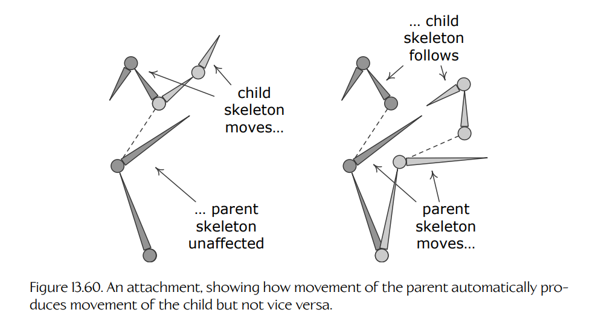
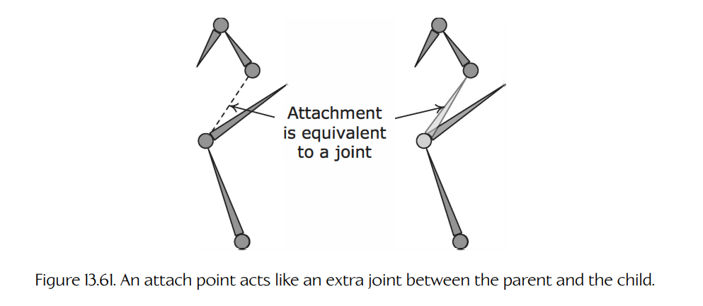
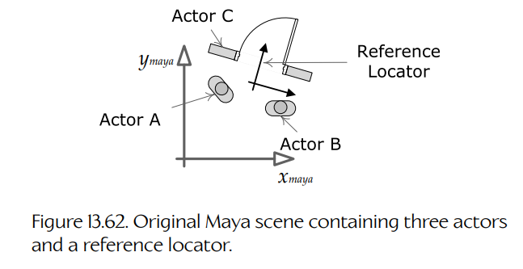
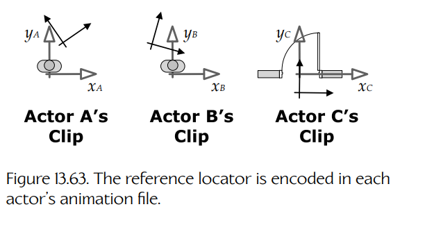
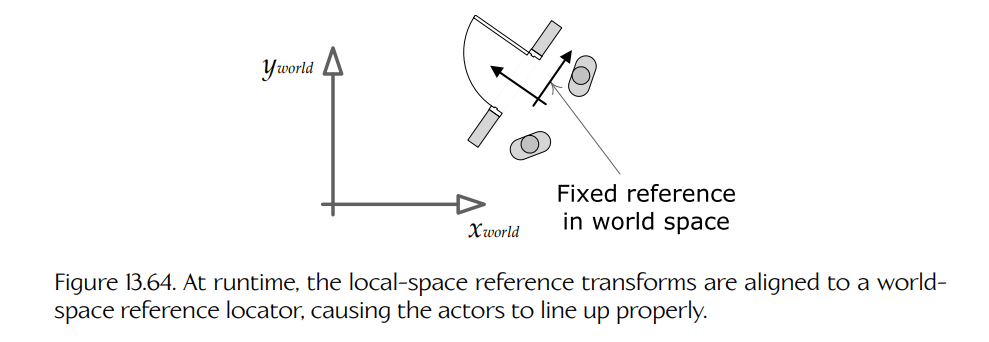
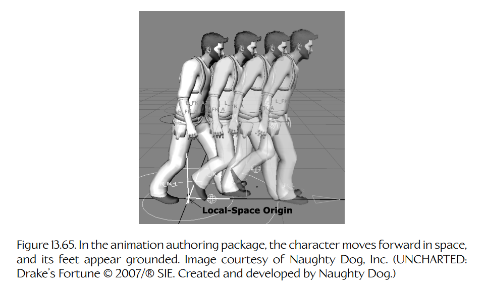
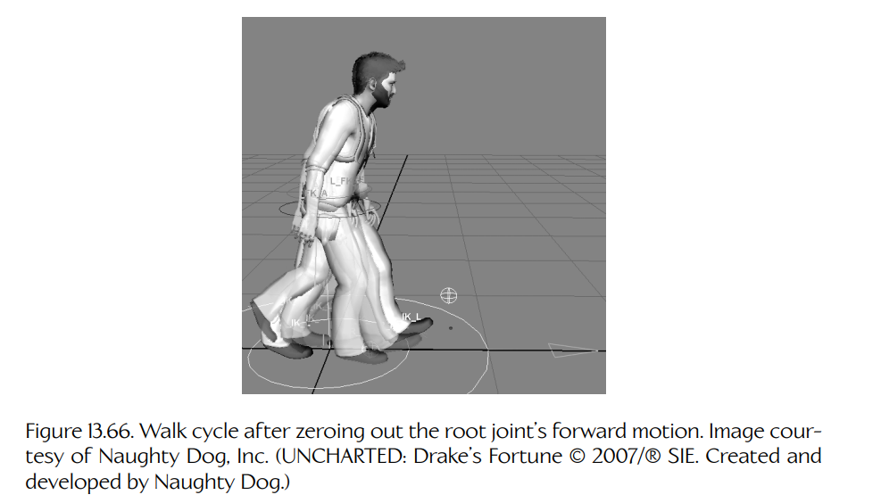
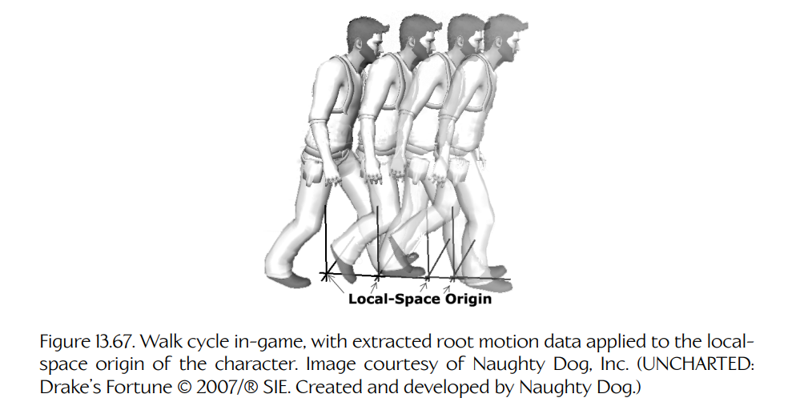

## 13.11 约束

我们已经看到，动作状态机可用于指定复杂的混合树，而过渡矩阵可用于控制状态之间的过渡应该如何工作。角色动画控制的另一个重要方面，是以各种方式**约束**（constrain）场景中角色和/或对象的运动。例如，我们可能希望约束一把武器，使其始终看起来在携带它的角色手中。我们可能希望约束两个角色，使他们在握手时能够正确对齐。角色的脚通常会被约束为与地面齐平，角色的手也可能被约束为与梯子的横档或载具方向盘对齐。在本节中，我们将简要看看典型动画系统如何处理这些约束。

**Figure 13.60.** 一个附着关系，展示了父对象的运动如何自动带动子对象运动，但反过来不会成立。

### 13.11.1 附着

几乎所有现代游戏引擎都允许对象彼此**附着**（attached）。最简单的对象到对象附着，涉及约束对象 A 的骨架中特定关节 $J_A$ 的位置和/或朝向，使其与对象 B 骨架中的关节 $J_B$ 重合。附着通常是一种父子关系。当父对象的骨架运动时，子对象会被调整，以满足该约束。然而，当子对象运动时，父对象的骨架通常不会受到影响。Figure 13.60 展示了这一点。

有时，在父关节和子关节之间引入一个**偏移**（offset）会很方便。例如，当把一把枪放到角色手中时，可以约束枪的 “Grip” 关节，使其与角色的 “RightWrist” 关节重合。然而，这可能无法产生枪与手之间的正确对齐。解决这个问题的一种方法，是向两个骨架之一中引入一个特殊关节。例如，可以在角色骨架中添加一个 “RightGun” 关节，使其成为 “RightWrist” 关节的子关节，并对其进行定位，使得当枪的 “Grip” 关节被约束到它时，枪看起来像是被角色自然地握在手中。然而，这种方法的问题在于，它会增加骨架中的关节数量。每个关节都会带来动画混合和矩阵调色板计算的处理成本，也会带来存储其动画关键帧的内存成本。因此，添加新关节通常不是一个可行选项。

**Figure 13.61.** 附着点的作用类似于父对象和子对象之间的一个额外关节。

我们知道，为附着目的而添加的额外关节不会影响角色的姿态——它只是为附着关系中的父关节和子关节之间引入一个额外变换。因此，我们真正想要的是一种方式，用来标记某些关节，使它们可以被动画混合管线忽略，但仍然能够用于附着目的。这类特殊关节有时称为**附着点**（attach points）。Figure 13.61 展示了附着点。

附着点可以在 Maya 中像普通关节或 locator 一样建模，尽管许多游戏引擎会以更方便的方式定义附着点。例如，它们可能作为动作状态机文本文件的一部分指定，或者通过动画创作工具中的自定义 GUI 指定。这样，动画师就只需要关注那些影响角色外观的关节，而控制附着的能力则被方便地交到真正需要它的人手中——也就是游戏设计师和工程师。

### 13.11.2 对象间配准

随着每一部新作品的推出，游戏角色与其环境之间的交互都变得越来越复杂、越来越细腻。因此，拥有一个能够在动画播放时让角色和对象彼此对齐的系统非常重要。这样的系统既可用于游戏内过场动画，也可用于交互式玩法元素。

设想一名动画师在 Maya 或其他动画工具中设置了一个场景，其中包含两个角色和一个门对象。两个角色先握手，然后其中一个打开门，两人一起穿过门。动画师可以确保场景中的三个演员都完美对齐。然而，当动画被导出后，它们会变成三个独立片段，并在游戏世界中的三个独立对象上播放。在这个动画序列开始之前，两个角色可能一直处于 AI 或玩家控制之下。那么，当这三个片段在游戏中回放时，怎样才能确保这三个对象彼此正确对齐呢？

#### 13.11.2.1 参考定位器

一个很好的解决方案，是在所有三个动画片段中引入一个公共参考点。在 Maya 中，动画师可以把一个 **locator**（它只是一个 3D 变换，非常类似骨骼关节）放入场景中，并将其放在任何看起来方便的位置。正如我们将看到的，它的位置和朝向实际上并不重要。该 locator 会以某种方式打上标记，告诉动画导出工具应对它进行特殊处理。

当这三个动画片段被导出时，工具会把参考 locator 的位置和朝向存储到三个片段的数据文件中，并且这些位置和朝向会被表示为相对于每个演员局部对象空间的坐标。之后，当这三个片段在游戏中播放时，动画引擎可以查找三个片段中参考 locator 的相对位置和朝向。然后，它可以以某种方式变换这三个对象的原点，使三个参考 locator 在世界空间中重合。参考 locator 的作用非常类似于**附着点**（见 [Section 13.11.1](./11-constraints.md#13111-attachments)），事实上也可以按附着点来实现。最终效果是：三个演员现在彼此对齐，正如它们在原始 Maya 场景中对齐时一样。

Figure 13.62 展示了上面例子中的门和两个角色在 Maya 场景中可能如何设置。如 Figure 13.63 所示，参考 locator 会出现在每个导出的动画片段中（表示在该演员的局部空间中）。在游戏中，这些局部空间参考 locator 会对齐到一个固定的世界空间 locator，从而重新对齐这些演员，如 Figure 13.64 所示。

**Figure 13.62.** 包含三个演员和一个参考定位器的原始 Maya 场景。

**Figure 13.63.** 参考定位器会被编码到每个演员的动画文件中。

#### 13.11.2.2 寻找世界空间参考位置

这里我们略过了一个重要细节——由谁决定参考 locator 在世界空间中的位置和朝向应该是什么？每个动画片段都会提供该参考 locator 在**自身演员**坐标空间中的变换。但我们还需要某种方式来定义这个参考 locator 应该位于世界空间中的哪里。

**Figure 13.64.** 运行时，局部空间参考变换会对齐到世界空间参考定位器，使演员能够正确对齐。

在门和两个角色握手的例子中，其中一个演员固定在世界中（门）。因此，一个可行方案是向门请求参考 locator 的位置，然后将两个角色对齐到它。实现这一点的命令可能类似下面的伪代码：

~~~cpp
void playShakingHandsDoorSequence(
    Actor& door,
    Actor& characterA,
    Actor& characterB)
{
    // 查找门动画中指定的参考 locator
    // 在世界空间中的变换。
    Transform refLoc = getReferenceLocatorWs(door,
        "shake-hands-door");

    // 原地播放门的动画。（它已经在正确的位置。）
    playAnimation("shake-hands-door", door);

    // 相对于从门获得的世界空间参考 locator，
    // 播放两个角色的动画。
    playAnimationRelativeToReference(
        "shake-hands-character-a", characterA, refLoc);
    playAnimationRelativeToReference(
        "shake-hands-character-b", characterB, refLoc);
}
~~~

另一种选项，是独立于场景中的三个演员来定义参考 locator 的世界空间变换。例如，可以使用世界构建工具将参考 locator 放入世界中（见 [Section 16.3](../16-tools-and-content-creation/03-world-building-tools.md#163-world-building-tools)）。在这种情况下，上面的伪代码应改为类似下面这样：

~~~cpp
void playShakingHandsDoorSequence(
    Actor& door,
    Actor& characterA,
    Actor& characterB,
    Actor& refLocatorActor)
{
    // 只需查询一个独立 actor 的变换，
    // 即可找到参考 locator 在世界空间中的变换
    // （这个 actor 大概是手动放置到世界中的）。
    Transform refLoc = getActorTransformWs(
        refLocatorActor);

    // 相对于上面获得的世界空间参考 locator，
    // 播放所有动画。
    playAnimationRelativeToReference("shake-hands-door",
        door, refLoc);
    playAnimationRelativeToReference(
        "shake-hands-character-a", characterA, refLoc);
    playAnimationRelativeToReference(
        "shake-hands-character-b", characterB, refLoc);
}
~~~

### 13.11.3 抓取与手部 IK

即使已经使用附着把两个对象连接起来，我们有时仍会发现游戏中的对齐看起来并不完全正确。例如，角色可能右手拿着步枪，左手托着枪托。当角色向不同方向瞄准武器时，我们可能会注意到左手不再在某些瞄准角度上与枪托正确对齐。这类关节错位是由 lerp 混合造成的。即使相关关节在片段 A 和片段 B 中都完美对齐，lerp 混合也不能保证 A 和 B 混合在一起时这些关节仍然对齐。

解决这个问题的一种方法，是使用**反向运动学**（inverse kinematics, IK）来校正左手位置。基本方法是确定相关关节的期望目标位置。IK 会应用到一小段关节链上（通常是两个、三个或四个关节），从目标关节开始，沿层级结构逐步向上推进到它的父关节、祖父关节，依此类推。我们试图校正其位置的关节称为**末端执行器**（end effector）。IK 求解器会调整末端执行器父关节的朝向，使末端执行器尽可能接近目标。

IK 系统的 API 通常表现为一种请求：在特定关节链上启用或禁用 IK，并指定期望目标点。实际 IK 计算通常由低层动画管线在内部完成。这样它就可以在恰当时机进行计算——也就是在中间的局部和全局骨骼姿态已经计算完成之后，但在最终矩阵调色板计算之前。

一些动画引擎允许预先定义 IK 链。例如，可以为左臂定义一条 IK 链，为右臂定义一条 IK 链，并为两条腿各定义一条 IK 链。为了本例说明，假设某条特定 IK 链由其末端执行器关节名称标识。（其他引擎可能使用索引、句柄或其他唯一标识符，但概念是一样的。）启用 IK 计算的函数可能类似如下：

~~~cpp
void enableIkChain(Actor& actor,
                   const char* endEffectorJointName,
                   const Vector3& targetLocationWs);
~~~

禁用 IK 链的函数可能类似如下：

~~~cpp
void disableIkChain(Actor& actor,
                    const char* endEffectorJointName);
~~~

IK 通常启用和禁用得相对不频繁，但世界空间目标位置必须每帧保持最新（如果目标在运动）。因此，低层动画管线总会提供某种机制来更新活动 IK 目标点。例如，管线可以允许我们多次调用 `enableIkChain()`。第一次调用时，IK 链被启用，并设置其目标点。后续所有调用则只更新目标点。另一种保持 IK 目标最新的方式，是把它们链接到游戏中的动态对象。例如，IK 目标可以被指定为某个刚体游戏对象的句柄，或动画对象中的某个关节。

IK 非常适合在关节已经与目标相当接近时，对关节对齐进行小幅校正。当关节期望位置和实际位置之间误差较大时，它的效果就没有那么好。还要注意，大多数 IK 算法只求解关节的**位置**。你可能需要编写额外代码，以确保末端执行器的**朝向**也能与目标正确对齐。IK 并不是万能药，而且可能具有显著的性能成本。因此，一定要审慎使用。

### 13.11.4 运动提取与脚部 IK

在游戏中，我们通常希望角色的移动动画看起来真实且“贴地”（grounded）。使移动动画看起来真实的最大因素之一，就是脚不能在地面上滑动。**脚部滑动**（foot sliding）可以通过多种方式克服，其中最常见的是**运动提取**（motion extraction）和**脚部 IK**（foot IK）。

#### 13.11.4.1 运动提取

让我们设想如何制作一个沿直线向前行走的角色动画。在 Maya（或动画师选择的其他动画软件包）中，动画师会让角色向前迈出完整一步，先迈左脚，然后迈右脚。所得动画片段称为**移动循环**（locomotion cycle），因为它本来就是要无限循环播放的，只要角色在游戏中向前行走。动画师会小心确保角色的脚在移动时显得贴地且不会滑动。角色会从第 0 帧的初始位置移动到循环结束时的新位置。Figure 13.65 展示了这一点。

**Figure 13.65.** 在动画创作软件包中，角色在空间中向前移动，并且脚看起来贴在地面上。图片由 Naughty Dog, Inc. 提供（UNCHARTED: Drake’s Fortune © 2007/® SIE。由 Naughty Dog 创建并开发）。

注意，在整个行走循环期间，角色的局部空间原点保持固定。实际上，角色在向前迈步时把自己的原点“留在了身后”。现在设想把这个动画作为循环播放。我们会看到角色完整向前迈出一步，然后突然跳回动画第一帧时所在的位置。显然，这在游戏中不可行。

为了让它可用，我们需要移除角色的向前运动，使其局部空间原点始终大致位于角色质心下方。可以通过将角色骨架根关节的向前平移清零来做到这一点。得到的动画片段会让角色看起来像是在“太空步”（moonwalking），如 Figure 13.66 所示。

为了让脚看起来像原始 Maya 场景中那样“粘”在地面上，我们需要让角色在每一帧向前移动恰到好处的距离。我们可以查看角色移动的距离，除以它到达该位置所花费的时间，从而得到平均移动速度。但角色行走时的前进速度并不是恒定的。当角色跛行时这一点尤其明显（受伤腿快速向前运动，随后“好腿”较慢运动），但对于所有自然的行走循环来说，这都是成立的。

因此，在将根关节的向前运动清零之前，我们首先把动画数据保存到一个特殊的“**提取运动**”（extracted motion）通道中。这些数据可以在游戏中用于让角色的局部空间原点每帧向前移动，其移动量恰好等于根关节在 Maya 中每帧移动的量。最终结果是，角色会完全按照创作时的样子向前行走，但现在它的局部空间原点会跟着一起移动，从而允许动画正确循环播放。Figure 13.67 展示了这一点。

**Figure 13.66.** 将根关节的向前运动清零之后的行走循环。图片由 Naughty Dog, Inc. 提供（UNCHARTED: Drake’s Fortune © 2007/® SIE。由 Naughty Dog 创建并开发）。

**Figure 13.67.** 游戏中的行走循环，其中提取出的根运动数据被应用到角色的局部空间原点上。图片由 Naughty Dog, Inc. 提供（UNCHARTED: Drake’s Fortune © 2007/® SIE。由 Naughty Dog 创建并开发）。

如果角色在动画中向前移动 4 英尺，且该动画需要 1 秒完成，那么可以知道角色的平均移动速度是 4 英尺/秒。为了让角色以不同速度行走，可以直接缩放行走循环动画的播放速率。例如，为了让角色以 2 英尺/秒行走，只需以半速播放动画（$R = 0.5$）。

#### 13.11.4.2 脚部 IK

当角色沿直线移动时（更准确地说，当它沿着与动画师手工制作的运动路径完全一致的路径移动时），运动提取能够很好地让角色的脚看起来贴地。然而，真实游戏角色必须以各种不与原始手工动画路径重合的方式转向和移动（例如，在不平坦地形上移动时）。这会导致额外的脚部滑动。

解决这一问题的一种方法，是使用 IK 校正脚部的任何滑动。基本思想是分析动画，确定每只脚在哪些时间段与地面完全接触。当脚接触地面的那一刻，记录它的世界空间位置。之后，在该脚保持接触地面的所有帧中，使用 IK 调整腿部姿态，使脚固定在正确位置。这项技术听起来很简单，但要让它看起来和感觉起来都正确，可能非常具有挑战性。它需要大量迭代和微调。而且，某些自然的人类动作——例如通过增加步幅来进入转弯——无法仅靠 IK 产生。

此外，动画的**观感**（look）与角色操控的**手感**（feel）之间存在很大的权衡，尤其是对于由真人玩家控制的角色而言。通常来说，让玩家角色控制系统感觉响应迅速且有趣，比让角色动画看起来完美更重要。结论是：不要轻率地给游戏加入脚部 IK 或运动提取。要为大量试错预留时间，并准备好做出权衡，确保玩家角色不仅看起来好，而且**玩起来感觉也好**。

### 13.11.5 其他类型的约束

还有许多其他类型的约束系统可以添加到游戏动画引擎中。一些例子包括：

- **看向**（look-at）。这是让角色看向环境中感兴趣点的能力。角色可能只用眼睛看向某一点，也可能用眼睛和头部一起看，或者用眼睛、头部以及整个上半身的扭转来看。看向约束有时使用 IK 或程序化关节偏移实现，不过通过叠加混合通常可以获得更加自然的外观。

- **掩体配准**（cover registration）。这是让角色与作为掩体的对象完美对齐的能力。它通常通过上文描述的参考 locator 技术实现。

- **进入和离开掩体**（cover entry and departure）。如果角色可以进入掩体，通常必须使用动画混合以及自定义进入和离开动画，使角色进入和离开掩体。

- **穿越辅助**（traversal aids）。角色越过、钻过、绕过或穿过环境中障碍物的能力，可以为游戏增添大量生命力。这通常通过提供自定义动画，并使用参考 locator 来确保角色与被越过的障碍物正确配准来完成。