## 14.3 碰撞检测系统

游戏引擎中碰撞检测系统的主要目的，是判断游戏世界中的任意对象之间是否发生了**接触**（contact）。为了回答这个问题，每个逻辑对象都会由一个或多个几何**形状**（shapes）来表示。这些形状通常相当简单，例如球体、盒体和胶囊体。不过，也可以使用更复杂的形状。碰撞系统会判断在任意给定时刻，这些形状是否正在**相交**（intersecting，即重叠）。因此，碰撞检测系统本质上就是一个加强版的几何相交测试器。

当然，碰撞系统所做的事情并不只是回答形状是否相交这种“是/否”问题。它还会提供与每次接触性质有关的信息。接触信息可以用于避免屏幕上出现不真实的视觉异常，例如对象彼此**互相穿透**（interpenetrating）。这通常通过在渲染下一帧之前，将所有互相穿透的对象彼此推开来完成。碰撞还可以为对象提供**支撑**（support）——一个或多个接触点共同使对象在重力和/或任何其他作用力下保持静止并达到平衡。碰撞还可以用于其他目的，例如导弹击中目标时触发爆炸，或者玩家角色穿过漂浮的医疗包时获得生命值提升。刚体动力学仿真通常是碰撞系统最苛刻的客户，它会利用碰撞系统来模拟物理上真实的行为，例如弹跳、滚动、滑动和静止。不过，即使没有物理系统的游戏，也仍然可以大量使用碰撞检测引擎。

在本章中，我们将从较高层次简要浏览碰撞检测引擎的工作方式。关于这一主题的深入讨论，可以参考许多关于实时碰撞检测的优秀书籍，包括 [15]、[54] 和 [12]。

### 14.3.1 可碰撞实体

如果希望游戏中的某个逻辑对象能够与其他对象发生碰撞，就需要为它提供一个**碰撞表示**（collision representation），用于描述该对象的形状，以及它在游戏世界中的位置和朝向。这是一种独立的数据结构，它既不同于对象的**玩法表示**（gameplay representation，即定义其游戏角色和行为的代码与数据），也不同于对象的**视觉表示**（visual representation，它可能是一个三角形网格、细分曲面、粒子特效或其他视觉表示）。

从检测相交的角度来看，我们通常偏好那些在几何和数学上都比较简单的形状。例如，一块岩石可以用一个球体来建模以用于碰撞；汽车引擎盖可以用一个长方体盒子表示；人体则可以用一组彼此相连的**胶囊体**（capsules，药丸形体积）来近似。理想情况下，只有当更简单的表示不足以实现游戏中期望的行为时，才应该使用更复杂的形状。Figure 14.1 展示了几个使用简单形状来近似对象体积、以便进行碰撞检测的例子。

<a id="figure-141"></a>
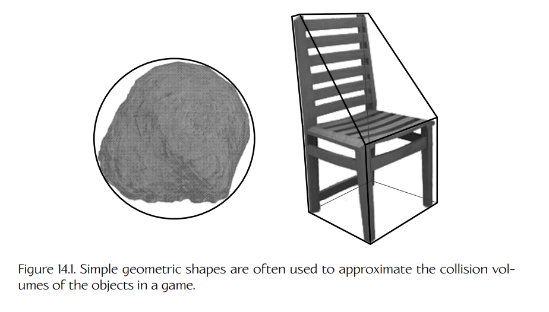

**Figure 14.1.** 简单的几何形状常被用来近似游戏中对象的碰撞体积。

Havok 使用术语 **collidable** 来描述一个可以参与碰撞检测的独立刚性对象。它将每个 collidable 表示为 C++ 类 `hkpCollidable` 的一个实例。PhysX 将其刚性对象称为 **actor**，并将其表示为类 `NxActor` 的实例。在这两个库中，一个可碰撞实体都包含两类基本信息：一个**形状**（shape）和一个**变换**（transform）。形状描述该 collidable 的几何形式，变换描述该形状在游戏世界中的位置和朝向。Collidable 需要变换，主要有三个原因：

1. 从技术上讲，形状只描述对象的形式（即它是球体、盒体、胶囊体还是其他某种体积）。它也可以描述对象的尺寸（例如球体半径或盒体尺寸）。但形状通常被定义为中心位于原点，并且相对于坐标轴处于某种规范朝向。为了让形状真正有用，必须对它进行变换，以便在世界空间中正确定位和定向。

2. 游戏中的许多对象都是动态的。如果必须逐个移动形状的**特征**（features，例如顶点、平面等），那么在空间中移动一个任意复杂形状的成本可能会很高。但有了变换之后，不管形状的特征有多简单或多复杂，任何形状都可以以较低成本在空间中移动。

3. 描述某些复杂形状的信息可能会占用相当多的内存。因此，允许多个 collidable 共享同一个形状描述会很有好处。例如，在赛车游戏中，许多汽车的形状信息可能完全相同。在这种情况下，游戏中所有汽车的 collidable 都可以共享同一个汽车形状。

游戏中的某个特定对象可以完全没有 collidable（如果它不需要碰撞检测服务），也可以有一个 collidable（如果该对象是一个简单刚体），或者有多个 collidable（例如每个 collidable 表示一个铰接机器人手臂中的一个刚性组件）。

### 14.3.2 碰撞/物理世界

碰撞系统通常会通过一个称为**碰撞世界**（collision world）的单例数据结构，跟踪所有可碰撞实体。碰撞世界是对游戏世界的一种完整表示，它专门设计给碰撞检测系统使用。Havok 的碰撞世界是类 `hkpWorld` 的一个实例。类似地，PhysX 的世界是 `NxScene` 的一个实例。ODE 使用类 `dSpace` 的一个实例来表示碰撞世界；它实际上是一个几何体层次结构的根节点，该层次结构表示游戏中所有可碰撞形状。

将所有碰撞信息维护在一个私有数据结构中，相比试图把碰撞信息存储在游戏对象本身上，有若干优点。首先，碰撞世界只需要包含那些可能与其他对象发生碰撞的游戏对象对应的 collidable。这消除了碰撞系统遍历任何无关数据结构的需要。这种设计还允许碰撞数据以尽可能高效的方式组织。例如，碰撞系统可以利用缓存一致性来最大化性能。碰撞世界也是一种有效的封装机制，从可理解性、可维护性、可测试性以及软件复用潜力的角度来看，这通常都是有益的。

#### 14.3.2.1 物理世界

如果游戏具有刚体动力学系统，那么它通常会与碰撞系统紧密集成。它通常与碰撞系统共享其“世界”数据结构，并且仿真中的每个刚体通常都会与碰撞系统中的一个 collidable 相关联。由于物理系统需要频繁且详细地进行碰撞查询，这种设计在物理引擎中非常常见。通常情况下，物理系统实际上会**驱动**碰撞系统的运行，指示它在每个仿真时间步中至少运行一次碰撞测试，有时甚至运行多次。

### 14.3.3 一些重要概念

#### 14.3.3.1 相交

我们对什么是**相交**（intersection）都有一种直观理解。从技术上讲，这个术语来自集合论 [318]。两个集合的交集由同时属于两个集合的成员子集组成。在几何意义上，两个形状之间的相交就是所有同时位于两个形状内部的点所组成的集合（这个集合可能无限大！）。

#### 14.3.3.2 接触

在游戏中，我们通常并不关心以最严格的意义寻找相交，即找出一个点集。相反，我们只是想知道两个对象是否相交。发生碰撞时，碰撞系统通常会提供关于接触性质的额外信息。例如，这些信息允许我们以物理上可信且高效的方式将对象分离。

碰撞系统通常会将接触信息打包进一个方便的数据结构中，并为检测到的每个接触实例化一个这样的结构。例如，Havok 将接触作为类 `hkContactPoint` 的实例返回。接触信息通常包括一个**分离向量**（separating vector）——沿着该向量可以滑动对象，以便高效地将它们移出碰撞状态。它通常还包含关于哪两个 collidable 发生接触的信息，包括哪些具体形状发生了相交，甚至还可能包括这些形状中的哪些具体特征发生了接触。系统还可能返回其他额外信息，例如投影到分离法线上的刚体速度。

#### 14.3.3.3 凸性

碰撞检测领域中最重要的概念之一，是**凸形状**（convex shapes）与**非凸形状**（non-convex，即 concave shapes，凹形状）之间的区别。从技术上讲，凸形状的定义是：从形状内部任意一点出发的任意射线，最多只会穿过其表面一次。判断一个形状是否凸的简单方式，是想象用保鲜膜包裹它——如果它是凸的，那么薄膜下面不会留下任何空气口袋。因此，在二维中，圆、矩形和三角形都是凸的，但吃豆人不是。这个概念同样可以扩展到三维。

**凸性**（convexity）之所以重要，是因为如我们将看到的，检测凸形状之间的相交通常比检测凹形状之间的相交更简单、计算量更小。关于凸形状的更多信息，可参见 [319]。

### 14.3.4 碰撞基本体

碰撞检测系统通常可以处理一组相对有限的形状类型。有些碰撞系统将这些形状称为**碰撞基本体**（collision primitives），因为它们是构造更复杂形状的基本构件。在本节中，我们将简要介绍几种最常见的碰撞基本体。

#### 14.3.4.1 球体

最简单的三维体积是球体。正如你可能预料的那样，球体也是最高效的一种碰撞基本体。球体由一个中心点和一个半径表示。这些信息可以方便地打包到一个四元素浮点向量中——这种格式特别适合 SIMD 数学库。

#### 14.3.4.2 胶囊体

胶囊体是一个药丸形体积，由一个圆柱体和两个半球端盖组成。它可以被看作一个**扫掠球体**（swept sphere）——也就是一个球体从点 A 移动到点 B 时扫过的形状。（不过，静态胶囊体和一个随时间扫出胶囊形体积的球体之间存在一些重要差异，因此二者并不完全相同。）胶囊体通常用两个点和一个半径表示（Figure 14.2）。胶囊体的相交测试通常比圆柱体或盒体更高效，因此常用于建模大致呈圆柱形的对象，例如人体四肢。

<a id="figure-142"></a>
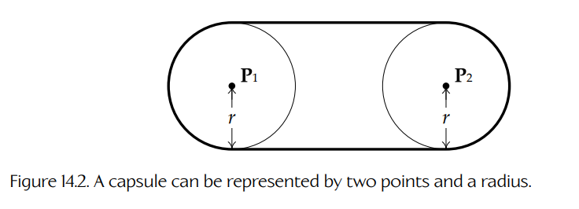

**Figure 14.2.** 胶囊体可以用两个点和一个半径表示。

#### 14.3.4.3 轴对齐包围盒

**轴对齐包围盒**（axis-aligned bounding box, AABB）是一个长方形体积（严格地说称为**长方体** cuboid），其各个面平行于坐标系的坐标轴。当然，一个在某个坐标系中轴对齐的盒体，在另一个坐标系中并不一定仍然轴对齐。因此，我们只能在与某个特定坐标框架对齐的语境中谈论 AABB。

AABB 可以方便地由两个点定义：一个点包含盒体沿三个主轴方向的最小坐标，另一个点包含其最大坐标。Figure 14.3 展示了这一点。

<a id="figure-143"></a>
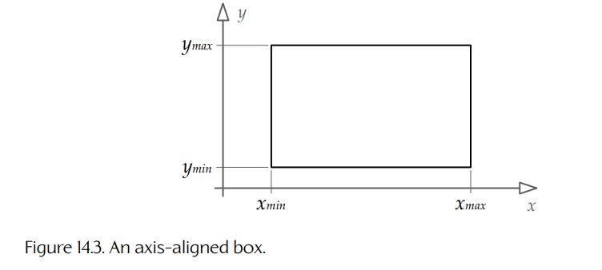

**Figure 14.3.** 一个轴对齐盒体。

轴对齐盒体的主要优点在于，它们可以以非常高效的方式测试是否与其他轴对齐盒体互相穿透。使用 AABB 的最大限制是：如果要保持其计算优势，它们必须始终保持轴对齐。这意味着，如果使用 AABB 来近似游戏中某个对象的形状，那么每当该对象旋转时，都必须重新计算 AABB。即使一个对象大致呈盒状，当它离开坐标轴方向发生旋转时，其 AABB 也可能退化成对实际形状非常糟糕的近似。Figure 14.4 展示了这一点。

<a id="figure-144"></a>
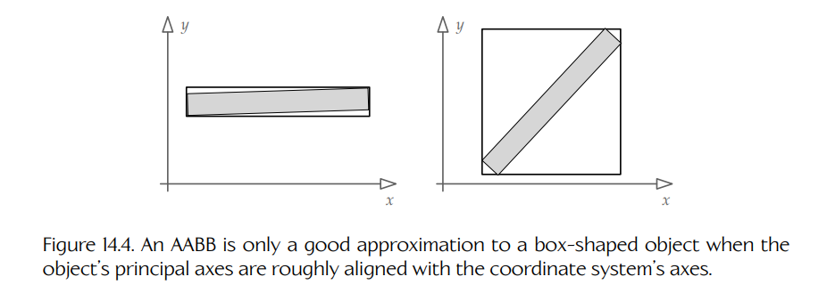

**Figure 14.4.** 只有当盒状对象的主轴大致与坐标系轴对齐时，AABB 才是一个较好的近似。

#### 14.3.4.4 有向包围盒

如果允许一个轴对齐盒体相对于其坐标系发生旋转，我们就得到了所谓的**有向包围盒**（oriented bounding box, OBB）。它通常由三个半尺寸（half-width、half-depth 和 half-height）以及一个变换表示；该变换用于定位盒体中心，并定义盒体相对于坐标轴的朝向。有向盒体是一种常用的碰撞基本体，因为它们能更好地拟合任意朝向的对象，同时其表示仍然相当简单。

#### 14.3.4.5 离散有向多面体（DOP）

**离散有向多面体**（discrete oriented polytope, DOP）是 AABB 和 OBB 的更一般情况。它是一种用于近似对象形状的凸多面体。DOP 可以通过在无穷远处取若干平面，然后沿着这些平面的法向量滑动它们，直到它们与要近似的对象发生接触来构造。

AABB 是一种 6-DOP，其中平面法线平行于坐标轴。OBB 也是一种 6-DOP，其中平面法线平行于对象自身的自然主轴。k-DOP 由任意数量 k 的平面构成。构造 DOP 的一种常见方法是，从目标对象的 OBB 开始，然后用额外平面以 45 度削去边和/或角，以试图获得更紧密的拟合。Figure 14.5 展示了一个 k-DOP 的例子。

<a id="figure-145"></a>
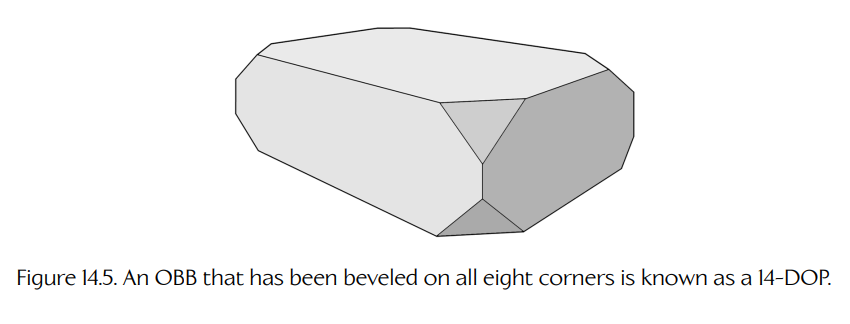

**Figure 14.5.** 一个在八个角上都进行了倒角的 OBB 被称为 14-DOP。

#### 14.3.4.6 任意凸体积

大多数碰撞引擎允许 3D 美术师在 Maya 这类软件包中构建任意凸体积。美术师使用多边形（三角形或四边形）构建形状。离线工具会分析这些三角形，确保它们确实构成一个凸多面体。如果该形状通过凸性测试，这些三角形会被转换为一组平面（本质上就是一个 k-DOP），由 k 个平面方程表示，或者由 k 个点和 k 个法向量表示。（如果发现它是非凸的，它仍然可以表示为 polygon soup，这将在下一节描述。）Figure 14.6 展示了这种方法。

凸体积的相交测试成本高于我们之前讨论的那些更简单几何基本体。不过，如 Section 14.3.5.5 所见，某些非常高效的相交查找算法（例如 GJK）可以应用于这些形状，因为它们是凸的。

<a id="figure-146"></a>
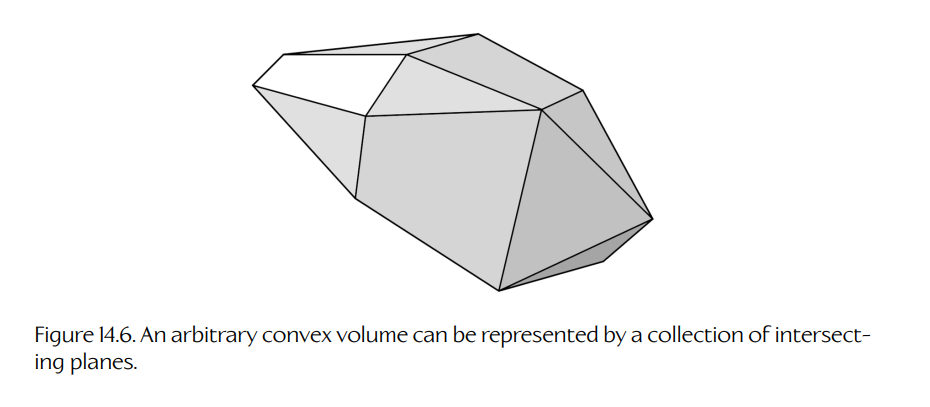

**Figure 14.6.** 任意凸体积可以由一组相交平面表示。

#### 14.3.4.7 多边形汤

有些碰撞系统也支持完全任意的非凸形状。这些形状通常由三角形或其他简单多边形构造而成。因此，这类形状常被称为 **polygon soup**，简称 **poly soup**。Poly soup 常用于建模复杂的静态几何体，例如地形和建筑物（Figure 14.7）。

正如你可能想象的那样，使用 poly soup 进行碰撞检测是最昂贵的一类碰撞测试。实际上，碰撞引擎必须测试每一个单独的三角形，并且还必须正确处理与相邻三角形共享边相关的虚假相交。因此，大多数游戏都会尽量限制 poly soup 形状的使用，将其用于不会参与动力学仿真的对象。

**Poly Soup 是否有内部？。**

不同于凸形状和简单形状，poly soup 不一定表示一个体积——它也可以表示一个开放表面。Poly soup 形状通常不包含足够的信息，使碰撞系统能够区分闭合体积和开放表面。这可能会让系统很难知道应该朝哪个方向推动一个正在穿透 poly soup 的对象，以便让两个对象脱离碰撞。

幸运的是，这绝不是一个无法处理的问题。Poly soup 中的每个三角形都有正面和背面，这是由其顶点的绕序定义的。因此，可以谨慎构建一个 poly soup 形状，使所有多边形的顶点绕序保持一致（也就是说，相邻三角形始终朝向同一个方向）。这会让整个 poly soup 具有“正面”和“背面”的概念。如果我们还存储了某个 poly soup 形状是开放还是闭合的信息（假定离线工具能够确定这一事实），那么对于闭合形状，就可以将“正面”和“背面”解释为“外部”和“内部”（或者反过来，取决于构造 poly soup 时使用的约定）。

<a id="figure-147"></a>
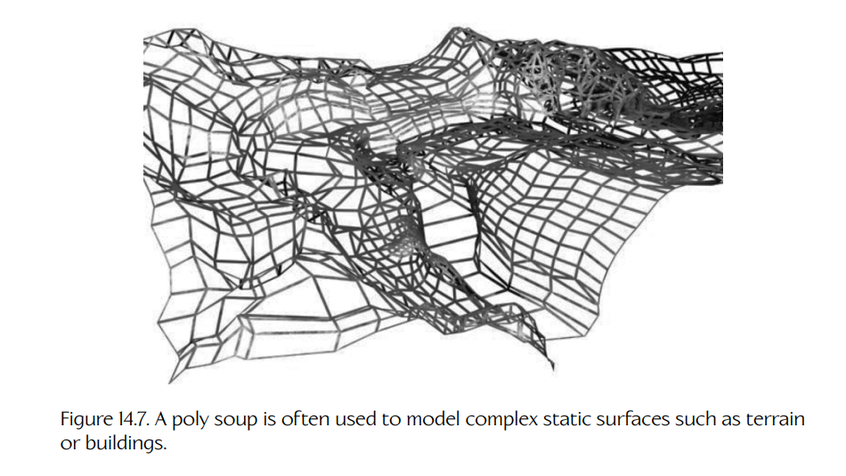

**Figure 14.7.** Poly soup 常用于建模复杂的静态表面，例如地形或建筑。

对于某些开放的 poly soup 形状（即表面），我们也可以“伪造”内部和外部。例如，如果游戏中的地形由一个开放的 poly soup 表示，那么可以任意规定表面的正面始终指向远离地球的方向。这意味着“正面”应始终对应“外部”。从实践角度来看，为了让这套约定生效，我们可能需要以某种方式定制碰撞引擎，使其了解我们特定的约定选择。

#### 14.3.4.8 复合形状

有些对象无法用单个形状充分近似，但可以用一组形状很好地近似。例如，一把椅子可以用两个盒体建模——一个表示椅背，另一个包围座面和四条腿。Figure 14.8 展示了这一点。

复合形状通常可以作为一种比 poly soup 更高效的非凸对象建模替代方案；两个或更多凸体积的性能常常优于一个单独的 poly soup。此外，有些碰撞系统在测试碰撞时可以利用整个复合形状的凸包围体积。在 Havok 中，这称为 **midphase collision detection**。如 Figure 14.9 所示，碰撞系统会首先测试两个复合形状的凸包围体积。如果它们不相交，系统就完全不需要对其子形状进行碰撞测试。

<a id="figure-148"></a>
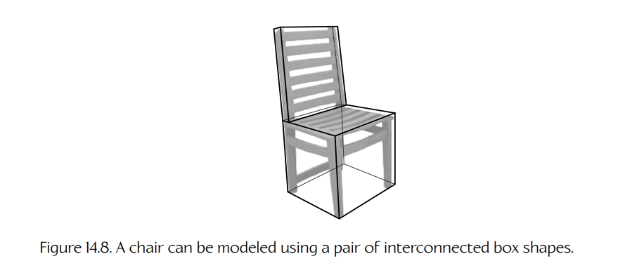

**Figure 14.8.** 一把椅子可以用一对相互连接的盒体形状建模。

<a id="figure-149"></a>
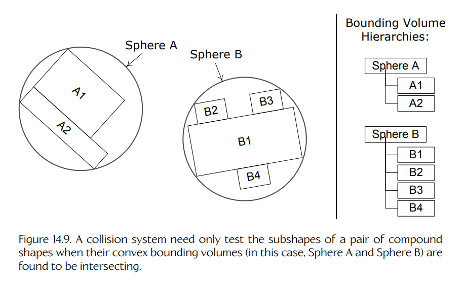

**Figure 14.9.** 只有当一对复合形状的凸包围体积被发现相交时，碰撞系统才需要测试它们的子形状。

### 14.3.5 碰撞测试与解析几何

碰撞系统利用**解析几何**（analytical geometry）——即三维体积和表面的数学描述——以计算方式检测形状之间的相交。关于这一深刻而广阔的研究领域，更多细节可参见 [320]。在本节中，我们将简要介绍解析几何背后的概念，展示几个常见例子，然后讨论用于任意凸多面体的一般化 GJK 相交测试算法。

#### 14.3.5.1 点对球体

我们可以通过一种简单方法判断点 **p** 是否位于球体内部：形成点与球心 **c** 之间的分离向量 **s**，然后检查它的长度。如果该长度大于球体半径 **r**，则该点位于球体外部；否则，它位于球体内部：

~~~text
s = c - p;

if |s| <= r, then p is inside.
~~~

#### 14.3.5.2 球体对球体

判断两个球体是否相交，几乎和点对球体测试一样简单。我们同样形成一个连接两个球心的向量 **s**。取它的长度，并将其与两个球体半径之和进行比较。如果分离向量的长度小于或等于两个半径之和，则两个球体相交；否则不相交：

~~~text
s = c1 - c2;                                      (14.1)

if |s| <= (r1 + r2), then spheres intersect.
~~~

为了避免计算向量 **s** 长度时固有的平方根运算，可以直接将整个方程平方。因此，Equation (14.1) 变为：

~~~text
s = c1 - c2;
|s|^2 = s · s;

if |s|^2 <= (r1 + r2)^2, then spheres intersect.
~~~

#### 14.3.5.3 分离轴定理

大多数碰撞检测系统都会大量使用一个称为**分离轴定理**（separating axis theorem）的定理 [321]。该定理指出：如果能够找到一条轴，使两个凸形状在该轴上的**投影**不重叠，那么可以确定这两个形状完全不相交。如果不存在这样的轴，并且这些形状是凸的，那么就可以确定它们确实相交。（如果这些形状是凹的，那么即使没有分离轴，它们也可能并未互相穿透。这也是我们在碰撞检测中倾向于使用凸形状的原因之一。）

这个定理在二维中最容易可视化。直观地说，它意味着：如果能找到一条直线，使对象 A 完全位于该直线的一侧，而对象 B 完全位于另一侧，那么对象 A 和 B 就不重叠。这样的直线称为**分离线**（separating line），并且它总是垂直于分离轴。因此，一旦找到分离线，就更容易通过观察形状在垂直于分离线的轴上的投影，说服自己该理论确实成立。

二维**凸形状**在某条轴上的投影，就像该对象在一根细线上的影子。它始终是位于该轴上的一个**线段**，表示该对象在该轴方向上的最大范围。我们也可以将投影视为该轴上的最小坐标和最大坐标，并写成完全闭合区间 `[c_min, c_max]`。如 Figure 14.10 所示，当两个形状之间存在分离线时，它们在分离轴上的投影不会重叠。不过，它们在其他非分离轴上的投影可能会重叠。

在三维中，分离线变成了分离平面，但分离轴仍然是一条轴（也就是一条无限长直线）。

<a id="figure-1410"></a>
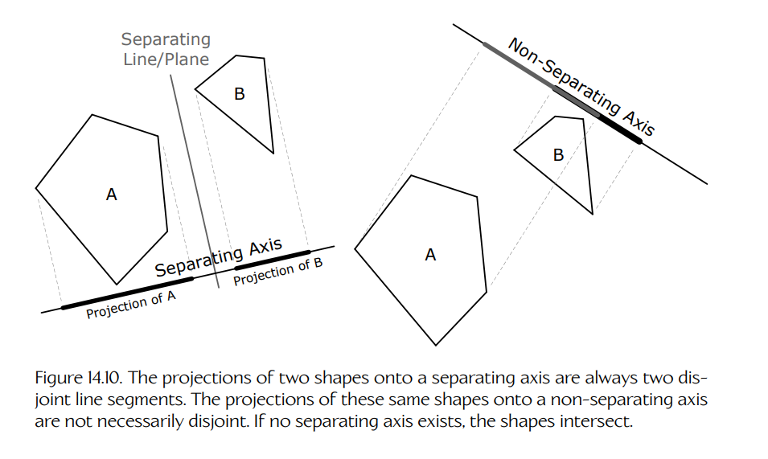

**Figure 14.10.** 两个形状投影到分离轴上时，总是形成两个互不相交的线段。同样的两个形状投影到非分离轴上时，则不一定互不相交。如果不存在分离轴，则这些形状相交。

同样，三维**凸形状**在某条轴上的投影也是一个线段，可以表示为完全闭合区间 `[c_min, c_max]`。

某些类型的形状具有一些属性，使潜在分离轴非常明显。为了检测两个这类形状 A 和 B 是否相交，我们可以依次将这些形状投影到每个潜在分离轴上，然后检查两个投影区间 `[c^A_min, c^A_max]` 和 `[c^B_min, c^B_max]` 是否不相交（即不重叠）。用数学语言来说，如果 `c^A_max < c^B_min` 或 `c^B_max < c^A_min`，那么这些区间不相交。如果沿某个潜在分离轴的投影区间不相交，那么我们就找到了一个分离轴，并且知道这两个形状不相交。

这一原则的一个例子就是球体对球体测试。如果两个球体不相交，那么平行于两个球心连线的轴总会是一个有效的分离轴（不过根据两个球体相距多远，也可能存在其他分离轴）。为了可视化这一点，可以考虑两个球体即将接触但尚未发生接触时的极限情况。在这种情况下，唯一的分离轴就是与中心到中心线段平行的那条轴。随着两个球体彼此远离，我们可以将分离轴向任一方向旋转得越来越多。Figure 14.11 展示了这一点。

<a id="figure-1411"></a>
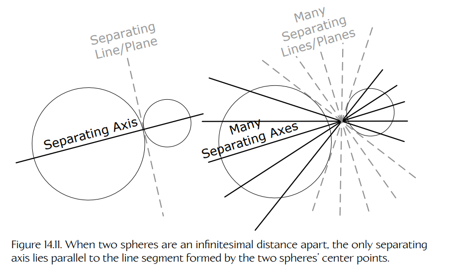

**Figure 14.11.** 当两个球体相距无穷小距离时，唯一的分离轴平行于由两个球心构成的线段。

#### 14.3.5.4 AABB 对 AABB

为了判断两个 AABB 是否相交，我们可以再次应用分离轴定理。由于两个 AABB 的面都保证平行于一组公共坐标轴，因此如果存在分离轴，它一定是这三个坐标轴之一。

因此，为了测试两个 AABB（称为 A 和 B）之间是否相交，只需要分别检查这两个盒体沿每个轴的最小坐标和最大坐标。沿 x 轴，我们有两个区间 `[x^A_min, x^A_max]` 和 `[x^B_min, x^B_max]`，沿 y 轴和 z 轴也有相应区间。如果这些区间在**所有三个轴**上都重叠，那么两个 AABB 相交；在其他所有情况下，它们不相交。Figure 14.12 展示了相交与不相交 AABB 的例子（为了说明而简化为二维）。关于 AABB 碰撞的深入讨论，可参见 [322]。

<a id="figure-1412"></a>
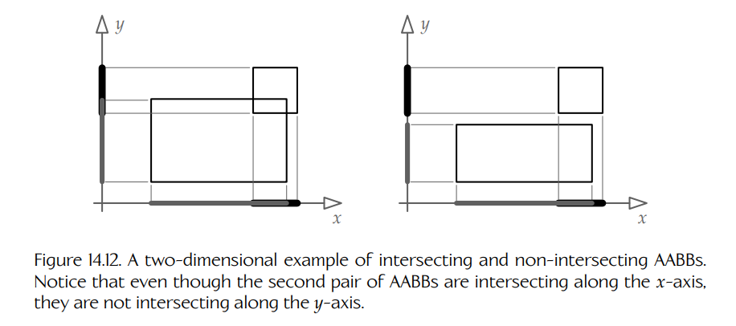

**Figure 14.12.** 二维中的 AABB 相交与不相交示例。注意，虽然第二对 AABB 在 x 轴上相交，但它们在 y 轴上并不相交。

#### 14.3.5.5 检测凸体碰撞：GJK 算法

有一种非常高效的算法，可以检测任意凸多胞形（convex polytopes，即二维中的凸多边形，或三维中的凸多面体）之间是否相交。它称为 **GJK 算法**，以其发明者、密歇根大学的 E. G. Gilbert、D. W. Johnson 和 S. S. Keerthi 命名。关于该算法及其变体，已经有许多论文，包括原始论文 [323]、Christer Ericson 的优秀 SIGGRAPH PowerPoint 演示 [324]，以及 Gino van den Bergen 的另一份精彩 PowerPoint 演示 [325]。不过，对该算法最容易理解（也最具娱乐性）的描述，可能是 Casey Muratori 的教学视频 “Implementing GJK”，可在网上获取 [326]。由于这些描述已经非常出色，这里只给出该算法的核心直觉，并建议你到 Molly Rocket 网站以及上面引用的其他资料中了解更多细节。

GJK 算法依赖一种称为 **Minkowski difference**（闵可夫斯基差）的几何运算。这个听起来很高级的运算其实相当简单：取形状 B 内的每个点，并从形状 A 内的每个点中逐对减去它。得到的点集 `{(Ai - Bj)}` 就是 Minkowski difference。

<a id="figure-1413"></a>
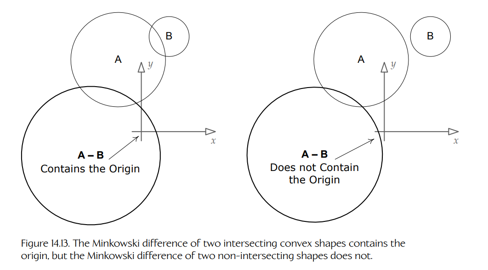

**Figure 14.13.** 两个相交凸形状的 Minkowski difference 包含原点，而两个不相交形状的 Minkowski difference 不包含原点。

Minkowski difference 的有用之处在于：当它应用于两个凸形状时，当且仅当这两个形状相交，它才会**包含原点**。这个命题的证明超出了本书范围，但我们可以通过如下直觉理解它：当我们说两个形状 A 和 B 相交时，实际上是说 A 内存在一些点也位于 B 内。在从 A 中的每个点减去 B 中的每个点的过程中，我们最终应当会遇到某个同时位于两个形状内部的共享点。一个点减去它自身会得到全零，因此如果（且仅当）球体 A 和球体 B 有共同点，Minkowski difference 就会包含原点。Figure 14.13 展示了这一点。

两个凸形状的 Minkowski difference 本身也是一个凸形状。我们关心的只是该 Minkowski difference 的**凸包**（convex hull），而不是它的所有内部点。GJK 的基本过程，是尝试找到一个位于 Minkowski difference 凸包上的**四面体**（tetrahedron，即由三角形构成的四面形状），并且该四面体包围原点。如果能找到这样的四面体，则两个形状相交；如果找不到，则它们不相交。

四面体只是称为 **simplex** 的几何对象的一种情况。不要被这个名称吓到——simplex 只是一组点。单点 simplex 是一个点，双点 simplex 是一条线段，三点 simplex 是一个三角形，四点 simplex 是一个四面体（见 Figure 14.14）。

<a id="figure-1414"></a>
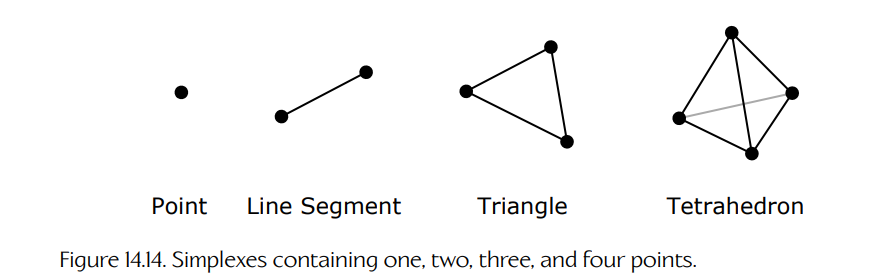

**Figure 14.14.** 分别包含一个、两个、三个和四个点的 simplexes。

GJK 是一种迭代算法，它从一个位于 Minkowski difference 凸包任意位置的单点 simplex 开始。然后，它尝试构建更高阶的 simplexes，使其可能包含原点。在循环的每次迭代中，我们观察当前拥有的 simplex，并确定原点相对于它位于哪个方向。然后，我们在该方向上寻找 Minkowski difference 的一个**支撑顶点**（supporting vertex）——也就是当前前进方向上，凸包中最接近原点的顶点。我们将这个新点加入 simplex，从而创建一个更高阶的 simplex（也就是点变成线段，线段变成三角形，三角形变成四面体）。如果加入这个新点后 simplex 包围了原点，那么算法结束——我们知道两个形状相交。另一方面，如果无法找到一个比当前 simplex 更接近原点的支撑顶点，那么我们知道永远也无法到达原点，这意味着两个形状**不**相交。Figure 14.15 展示了这个思想。

<a id="figure-1415"></a>


**Figure 14.15.** 在 GJK 算法中，如果向当前 simplex 添加一个点后形成了包含原点的形状，就知道这些形状相交；如果不存在能让 simplex 更接近原点的支撑顶点，则这些形状不相交。

如果想真正理解 GJK 算法，你需要查阅前面引用的论文和视频。但希望这里的描述能激发你进一步研究的兴趣。至少，你可以在聚会上随口说出 “GJK” 这个名字来让朋友们印象深刻。（只是除非你真的理解这个算法，否则不要在求职面试中这么做！）

#### 14.3.5.6 其他形状-形状组合

这里不会介绍其他形状-形状相交组合，因为它们在其他文本中已有很好的覆盖，例如 [15]、[54] 和 [12]。不过，需要认识到的关键点是，形状-形状组合的数量非常大。事实上，对于 N 种形状类型，所需的两两测试数量是 `O(N^2)`。碰撞引擎的许多复杂性，都来自它必须处理的相交情况数量之多。这也是碰撞引擎作者通常会尽量限制基本体类型数量的原因——这样做会大幅减少碰撞检测器必须处理的情况数量。（这也是 GJK 受欢迎的原因之一——它可以一次性处理**所有**凸形状类型之间的碰撞检测。不同形状类型之间唯一不同的是算法中使用的**支撑函数**。）

另外还有一个实际问题：如何实现根据两个待测试的任意形状来选择适当碰撞测试函数的代码。许多碰撞引擎使用一种**双分派**（double dispatch）方法 [327]。在单分派中（即虚函数），单个对象的类型用于决定在运行时应调用某个抽象函数的哪个具体实现。双分派将虚函数概念扩展到两个对象类型。它可以通过一个二维函数查找表实现，该表以被测试的两个对象类型作为键。它也可以这样实现：让基于对象 A 类型的虚函数去调用基于对象 B 类型的第二个虚函数。

来看一个真实例子。Havok 使用称为 **collision agent** 的对象（派生自 `hkpCollisionAgent` 的类）来处理具体相交测试情况。具体 agent 类包括 `hkpSphereSphereAgent`、`hkpSphereCapsuleAgent`、`hkpGskConvexConvexAgent` 等等。这些 agent 类型由一个本质上类似二维分发表的结构引用，该结构由类 `hkpCollisionDispatcher` 管理。正如你可能预料的那样，dispatcher 的工作是：给定一对需要进行碰撞测试的 collidable，高效查找合适的 agent，然后调用它，并将这两个 collidable 作为参数传入。

#### 14.3.5.7 检测运动刚体之间的碰撞

到目前为止，我们只考虑了静止对象之间的静态相交测试。当对象移动时，会引入一些额外复杂性。游戏中的运动通常通过离散时间步进行仿真。因此，一种简单方法是，在每个时间步中把每个刚体的位置和朝向视为静止，并对碰撞世界的每个“快照”使用静态相交测试。只要对象相对于自身尺寸而言移动得不太快，这种技术就可以正常工作。事实上，它非常有效，以至于包括 Havok 在内的许多碰撞/物理引擎默认都采用这种方法。

不过，对于小型高速运动对象，这种技术会失效。设想一个对象移动得如此之快，以至于它在两个时间步之间覆盖的距离**大于自身尺寸**（沿运动方向测量）。如果我们将碰撞世界的两个连续快照叠加起来，就会注意到这个高速运动对象在两个快照图像之间出现了一个空隙。如果另一个对象正好位于这个空隙内，我们就会完全错过与它的碰撞。这个问题如 Figure 14.16 所示，称为“**子弹穿纸**”（bullet through paper）问题，也称为“**隧穿**”（tunneling）。以下几节会描述几种克服该问题的常见方式。

<a id="figure-1416"></a>
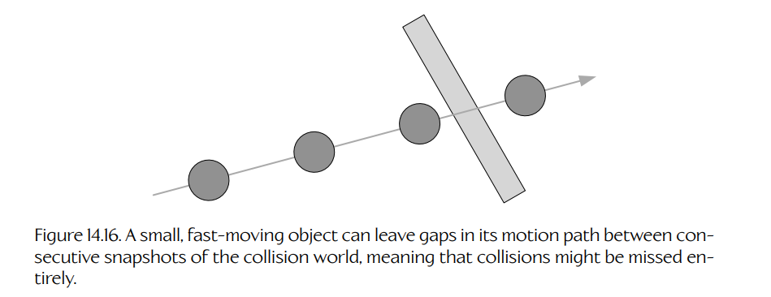

**Figure 14.16.** 小型高速运动对象可能在碰撞世界连续快照之间的运动路径中留下空隙，这意味着碰撞可能被完全漏检。

**扫掠形状。**

避免隧穿的一种方式是使用**扫掠形状**（swept shapes）。扫掠形状是一个形状随时间从一点运动到另一点而形成的新形状。例如，扫掠球体是一个胶囊体，扫掠三角形是一个三棱柱（见 Figure 14.17）。

与其对碰撞世界的静态快照进行相交测试，我们可以测试那些由形状从前一个快照中的位置和朝向移动到当前快照中的位置和朝向而形成的扫掠形状。这种方法相当于在快照之间对 collidable 的运动进行**线性插值**，因为我们通常沿着从一个快照到下一个快照的线段来扫掠形状。

<a id="figure-1417"></a>
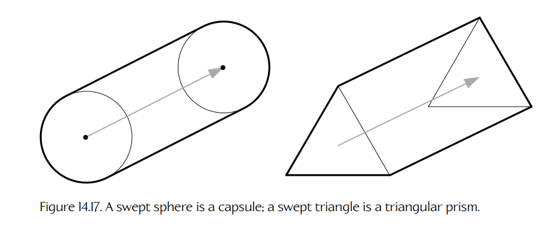

**Figure 14.17.** 扫掠球体是一个胶囊体；扫掠三角形是一个三棱柱。

当然，线性插值未必是对高速运动 collidable 的良好近似。如果该 collidable 沿曲线路径运动，那么从理论上讲，我们应该沿该曲线路径扫掠它的形状。遗憾的是，沿曲线扫掠得到的凸形状本身并不是凸的，因此碰撞测试会复杂且计算密集得多。

此外，如果我们正在扫掠的凸形状本身在旋转，那么得到的扫掠形状并不一定是凸的，即使它是沿一条线段扫掠。如 Figure 14.18 所示，我们**总是可以**通过对前一快照和当前快照中形状的极端特征进行线性外推，形成一个凸形状——但得到的凸形状未必能准确表示该形状在该时间步内真正发生的运动。换句话说，线性插值通常并不适合旋转形状，除非不允许这些形状旋转。扫掠形状测试会比基于静态快照的对应测试复杂且计算量大得多。

扫掠形状可以是一种有用技术，用来确保碰撞不会在碰撞世界状态的静态快照之间被漏检。不过，当对曲线路径或旋转的 collidable 进行线性插值时，结果通常并不准确，因此根据游戏需求，可能需要更详细的技术。

<a id="figure-1418"></a>


**Figure 14.18.** 沿线段扫掠旋转对象并不一定会生成凸形状（左）。对运动进行线性插值确实会形成凸形状（右），但它可能是对该时间步内真实运动相当不准确的近似。

**连续碰撞检测（CCD）。**

处理隧穿问题的另一种方式，是使用称为**连续碰撞检测**（continuous collision detection, CCD）的技术。CCD 的目标是在给定时间区间内，找到两个运动对象之间最早的**撞击时间**（time of impact, TOI）。

CCD 算法通常是迭代式的。对于每个 collidable，我们都维护它在前一时间步和当前时间的位置信息与朝向信息。这些信息可以用于分别对位置和旋转进行线性插值，从而得到该 collidable 在前一个和当前时间步之间任意时刻的变换近似。

然后，算法会沿运动路径搜索最早的 TOI。常用的搜索算法有很多，包括 Brian Mirtich 的**保守推进**（conservative advancement）方法、对 Minkowski sum 执行射线投射，或考虑各个特征对之间的最小 TOI。Sony Interactive Entertainment 的 Erwin Coumans 在 [328] 中描述了其中一些算法，并给出了他自己对保守推进方法的一种新变体。

### 14.3.6 性能优化

碰撞检测是一项 CPU 密集型任务，原因有两个：

1. 判断两个形状是否相交所需的计算本身并不简单。

2. 大多数游戏世界都包含大量对象，并且随着对象数量增加，所需相交测试数量会迅速增长。

为了检测 n 个对象之间的相交，暴力方法会测试每一对可能的对象，从而得到一个 `O(n^2)` 算法。然而，在实践中会使用高效得多的算法。碰撞引擎通常采用某种形式的空间哈希 [329]、空间划分或层次包围体，以减少必须执行的相交测试数量。

#### 14.3.6.1 时间一致性

一种常见的优化技术是利用**时间一致性**（temporal coherency），也称为**帧间一致性**（frame-to-frame coherency）。当 collidable 以合理速度运动时，它们的位置和朝向在一个时间步到下一个时间步之间通常非常相似。通过缓存跨多个时间步的结果，我们常常可以避免每帧重新计算某些信息。例如，在 Havok 中，collision agents（`hkpCollisionAgent`）通常会在帧与帧之间保持持久存在，只要相关 collidable 的运动没有使之前的计算失效，它们就可以复用来自先前时间步的计算。

#### 14.3.6.2 空间划分

**空间划分**（spatial partitioning）的基本思想，是通过将空间划分为若干较小区域，大幅减少需要检查相交的 collidable 数量。如果我们能够以较低成本判断一对 collidable 没有占据同一区域，那么就不需要对它们执行更详细的相交测试。

各种层次划分方案，例如八叉树（octrees）、二叉空间划分树（binary space partitioning trees, BSPs）、kd-tree 或球树（sphere trees），都可以用于细分空间，从而优化碰撞检测。这些树以不同方式划分空间，但它们都以层次化方式进行：从树根处的粗粒度划分开始，然后进一步细分每个区域，直到得到足够细粒度的区域。随后，可以遍历这棵树，找出可能真正发生相交的潜在碰撞对象测试组。由于这些树会对空间进行划分，因此当我们沿树的某个分支向下遍历时，就知道该分支中的对象不可能与其他兄弟分支中的对象发生碰撞。

#### 14.3.6.3 宽阶段、中阶段与窄阶段

Havok 使用一种三层方法，在每个时间步中裁剪需要进行碰撞测试的 collidable 集合。

- 首先，使用粗略的 AABB 测试判断哪些 collidable 可能相交。这称为**宽阶段**（broad phase）碰撞检测。
- 其次，测试复合形状的粗略包围体积。这称为**中阶段**（midphase）碰撞检测。例如，对于由三个球体组成的复合形状，其包围体积可能是第四个更大的球体，用来包围其他球体。复合形状还可以包含其他复合形状，因此一般来说，复合 collidable 会拥有一个包围体积层次结构。中阶段会遍历这个层次结构，寻找可能相交的子形状。
- 最后，测试 collidable 的各个基本体是否相交。这称为**窄阶段**（narrow phase）碰撞检测。

**Sweep and Prune 算法。**

在所有主要的碰撞/物理引擎中（例如 Havok、ODE、PhysX），宽阶段碰撞检测都会使用一种称为 **sweep and prune** 的算法 [330]。其基本思想是：沿三个主轴对 collidable 的 AABB 的最小维度和最大维度进行排序，然后通过遍历这些排序列表来检查重叠的 AABB。Sweep and prune 算法可以利用帧间一致性（见 Section 14.3.6.1），将一个 `O(n log n)` 的排序操作降低为期望 `O(n)` 的运行时间。帧间一致性也有助于在对象旋转时更新 AABB。

### 14.3.7 碰撞查询

碰撞检测系统的另一个职责，是回答关于游戏世界中碰撞体积的假设性问题。例如：

- 如果一颗子弹从玩家武器沿某个给定方向飞出，那么它会首先击中什么目标？
- 一辆车能否从点 A 移动到点 B，而途中不撞到任何东西？
- 找出角色某个给定半径内的所有敌人对象。

一般来说，这类操作称为**碰撞查询**（collision queries）。

最常见的一类查询是**碰撞投射**（collision cast），有时简称为 **cast**。（术语 **trace** 和 **probe** 也是 “cast” 的常见同义词。）Cast 用于确定：如果将某个假想对象放入碰撞世界，并沿一条射线或线段移动，那么它会撞到什么东西。Cast 与常规碰撞检测操作不同，因为被投射的实体并不真正位于碰撞世界中——它不会以任何方式影响世界中的其他对象。因此，我们说碰撞投射回答的是关于世界中 collidable 的**假设性问题**。

#### 14.3.7.1 射线投射

最简单的碰撞投射类型是**射线投射**（ray cast），不过这个名称实际上有些不准确。我们真正投射的是一条**有向线段**（directed line segment）——换句话说，我们的 cast 总是具有一个起点 `p0` 和一个终点 `p1`。这条投射线段会与碰撞世界中的 collidable 对象进行测试。如果它与其中任何对象相交，就返回接触点。

射线投射系统通常用起点 `p0` 和一个增量向量 `d` 来描述这条线段；将 `d` 加到 `p0` 上，就得到终点 `p1`。这条线段上的任意点都可以通过下面的参数方程找到，其中参数 `t` 允许在 0 到 1 之间变化：

```text
p(t) = p0 + td,    t ∈ [0, 1].
```

显然，`p0 = p(0)`，而 `p1 = p(1)`。此外，线段上的任意接触点都可以通过指定与该接触对应的参数 `t` 值来唯一描述。大多数射线投射 API 会将接触点作为 “t 值” 返回，或者允许通过一次额外函数调用，将接触点转换为对应的 `t`。

大多数碰撞检测系统都能够返回**最早接触点**（earliest contact）——也就是距离 `p0` 最近、对应最小 `t` 值的接触点。有些系统也能够返回该射线或线段相交到的所有 collidable 的完整列表。每个接触返回的信息通常包括 `t` 值、被击中的 collidable 实体的某种唯一标识符，以及可能的其他信息，例如接触点处的表面法线，或被击中形状/表面的其他相关属性。下面展示了一种可能的接触点数据结构。

```cpp
struct RayCastContact
{
    F32     m_t;             // the t value for this
                            // contact

    U32     m_collidableId;  // which collidable did we
                            // hit?

    Vector  m_normal;        // surface normal at
                            // contact pt.

    // other information...
};
```

**射线投射的应用。**

射线投射在游戏中被大量使用。例如，我们可能希望询问碰撞系统：角色 A 是否能够直接看见角色 B。为了判断这一点，只需从角色 A 的眼睛向角色 B 的胸口投射一条有向线段。如果射线击中角色 B，就知道 A 能“看见”B。但如果射线在到达角色 B 之前击中了其他对象，就知道视线被该对象阻挡了。射线投射也被武器系统使用（例如判断子弹命中）、被玩家机制使用（例如判断角色脚下是否有坚实地面）、被 AI 系统使用（例如视线检查、目标选择、移动查询等）、被载具系统使用（例如定位车辆轮胎并将其贴合到地形上），等等。

#### 14.3.7.2 形状投射

另一种常见查询是询问碰撞系统：一个假想的凸形状沿某条有向线段移动时，在撞到某个实体之前最多能走多远。如果被投射的体积是球体，这称为**球体投射**（sphere cast）；一般情况下则称为**形状投射**（shape cast）。（Havok 将其称为 **linear casts**。）与射线投射一样，形状投射通常通过指定起点 `p0`、行进距离和方向 `d`，以及我们希望投射的形状的类型、尺寸和朝向来描述。

投射凸形状时，需要考虑两种情况。

1. 被投射形状在起始位置已经与至少一个其他 collidable 互相穿透或接触，从而无法从起始位置移动开来。

2. 被投射形状在起始位置没有与任何其他对象相交，因此它可以沿路径移动一个非零距离。

在第一种情形中，碰撞系统通常会报告被投射形状与所有最初发生互相穿透的 collidable 之间的接触。这些接触可能位于被投射形状的**内部**，也可能位于其**表面**，如 Figure 14.19 所示。

<a id="figure-1419"></a>
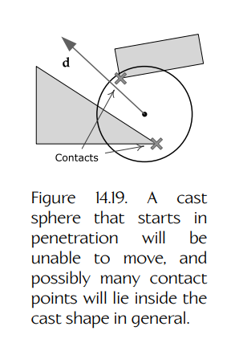

**Figure 14.19.** 如果被投射球体一开始就处于穿透状态，它将无法移动，并且通常可能有许多接触点位于被投射形状内部。

在第二种情形中，形状可以沿线段移动一个非零距离，然后才撞到某个东西。假设它确实发生碰撞，通常它只会撞到一个 collidable。然而，如果其轨迹恰好合适，也可能同时撞到多个 collidable。当然，如果被撞击的 collidable 是一个非凸的 poly soup，那么被投射形状最终可能同时接触 poly soup 的多个部分。我们可以放心地说，无论投射的是哪种凸形状，它都有可能生成多个接触点。在这种情况下，接触点总是位于被投射形状的**表面**，而绝不会位于其内部（因为我们知道该 cast shape 在开始运动时并未与任何东西互相穿透）。Figure 14.20 展示了这种情况。

与射线投射一样，有些形状投射 API 只报告被投射形状经历的最早接触，而另一些则允许形状沿其假想路径继续前进，并返回路径中经历的所有接触。Figure 14.21 展示了这一点。

形状投射返回的接触信息必然比射线投射复杂一些。对于射线投射，我们不能只返回一个或多个 `t` 值，因为 `t` 值只能描述形状中心点沿其路径的位置。它无法告诉我们该形状表面或内部的哪个位置与被撞击的 collidable 发生了接触。因此，大多数形状投射 API 会同时返回 `t` 值和实际接触点，以及其他相关信息（例如被击中的 collidable、接触点处的表面法线等）。

<a id="figure-1420"></a>
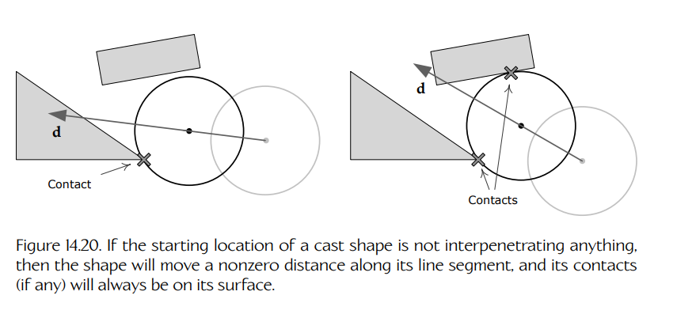

**Figure 14.20.** 如果被投射形状的起始位置没有与任何东西互相穿透，那么该形状会沿其线段移动一个非零距离，并且其接触点（如果有）总是位于其表面。

<a id="figure-1421"></a>
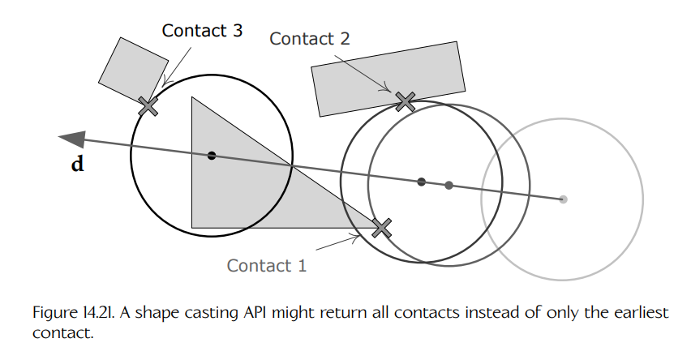

**Figure 14.21.** 形状投射 API 可能返回所有接触，而不仅仅是最早接触。

不同于射线投射 API，形状投射系统必须始终能够报告多个接触。这是因为即使只报告具有最早 `t` 值的接触，该形状也可能已经接触到游戏世界中的多个不同 collidable，或者它可能在多个点上接触同一个非凸 collidable。因此，碰撞系统通常会返回一个接触点数据结构数组或列表，其中每个结构可能类似如下：

```cpp
struct ShapeCastContact
{
    F32     m_t;              // the t value for this
                             // contact

    U32     m_collidableId;   // which collidable did we
                             // hit?

    Point   m_contactPoint;   // location of actual
                             // contact

    Vector  m_normal;         // surface normal at
                             // contact pt.

    // other information...
};
```

给定一组接触点后，我们通常希望区分每个不同 `t` 值对应的接触点组。例如，最早接触实际上由列表中所有共享最小 `t` 的接触点组成。需要意识到，碰撞系统返回的接触点可能按 `t` 排序，也可能没有排序。如果没有排序，几乎总是应该手动按 `t` 对结果进行排序。这样可以确保当查看列表中的第一个接触点时，它一定属于该形状路径上最早的接触点之一。

**形状投射的应用。**

形状投射在游戏中非常有用。球体投射可以用于判断虚拟摄像机是否与游戏世界中的对象发生碰撞。球体或胶囊体投射也常用于实现角色移动。例如，为了让角色在不平坦地形上向前滑动，可以沿运动方向投射一个位于角色双脚之间的球体或胶囊体。再通过第二次投射上下调整它，以确保它与地面保持接触。如果该球体撞到一个非常短的垂直障碍物，例如街道路缘石，它就可以“弹起”并越过路缘石。如果垂直障碍物太高，例如一堵墙，那么该投射球体就可以沿墙面水平滑动。该投射球体最终的静止位置会成为角色下一帧的新位置。

#### 14.3.7.3 幻影体

有时，游戏需要判断哪些 collidable 对象位于游戏世界中的某个特定体积内。例如，我们可能想得到玩家角色某个半径范围内的所有敌人列表。Havok 为此支持一种特殊的 collidable 对象，称为 **phantom**。

Phantom 的行为很像距离向量 `d` 为零的形状投射。在任意时刻，我们都可以向 phantom 查询它与世界中其他 collidable 的接触列表。它返回的数据本质上与零距离形状投射会返回的数据格式相同。

不过，与形状投射不同，phantom 会持久存在于碰撞世界中。这意味着，当碰撞引擎检测“真实”collidable 之间的碰撞时，它可以充分利用所用的时间一致性优化。事实上，phantom 与常规 collidable 之间唯一的区别在于：phantom 对碰撞世界中的所有其他 collidable 都是“不可见的”（并且不参与动力学仿真）。这允许它回答一些假设性问题：如果它是一个“真实”的 collidable，它会与哪些对象发生碰撞；但它保证不会对碰撞世界中的其他 collidable——包括其他 phantom——产生任何影响。

#### 14.3.7.4 其他查询类型

除了 cast 之外，有些碰撞引擎还支持其他类型的查询。例如，Havok 支持**最近点查询**（closest point queries），用于找出碰撞世界中其他 collidable 上距离某个给定 collidable 最近的一组点。

### 14.3.8 碰撞过滤

游戏开发者经常希望启用或禁用某些类型对象之间的碰撞。例如，大多数对象都允许穿过水体表面——我们可能会使用浮力仿真让它们漂浮，或者让它们直接沉到底部；但无论哪种情况，都不希望水面表现得像实体一样。大多数碰撞引擎都允许根据游戏特定标准来接受或拒绝 collidable 之间的接触。这称为**碰撞过滤**（collision filtering）。

#### 14.3.8.1 碰撞遮罩与层

一种常见的过滤方法，是对世界中的对象进行分类，然后使用查找表判断某些类别是否允许彼此碰撞。例如，在 Havok 中，一个 collidable 可以属于一个（且只能属于一个）碰撞层。Havok 的默认碰撞过滤器由类 `hkpGroupFilter` 的一个实例表示，它为每一层维护一个 32 位掩码，其中每一位都会告诉系统该特定层是否可以与其他某一层发生碰撞。

#### 14.3.8.2 碰撞回调

另一种过滤技术，是安排碰撞库在检测到碰撞时调用一个**回调函数**（callback function）。该回调可以检查碰撞的具体情况，并根据合适的标准决定允许还是拒绝该碰撞。Havok 也支持这类过滤。当一个接触点首次被加入世界时，会调用 `contactPointAdded()` 回调。如果随后确定该接触点有效（如果此前发现了更早的 TOI 接触，它可能就无效），则会调用 `contactPointConfirmed()` 回调。应用程序可以在这些回调中拒绝接触点。

#### 14.3.8.3 游戏特定碰撞材质

游戏开发者经常需要对游戏世界中的 collidable 对象进行分类，一方面用于控制它们如何碰撞（与碰撞过滤类似），另一方面用于控制其他次要效果，例如一种对象撞击另一种对象时产生的声音或粒子效果。例如，我们可能希望区分木材、石头、金属、泥土、水和人体肉体。

为实现这一点，许多游戏会实现一种碰撞形状分类机制，它在许多方面类似于渲染引擎中使用的**材质系统**（material system）。事实上，有些游戏团队会使用术语**碰撞材质**（collision material）来描述这种分类。基本思想是：为每个 collidable 表面关联一组属性，用来定义该特定表面从物理和碰撞角度应该如何表现。碰撞属性可以包括声音和粒子效果，也可以包括物理属性，例如恢复系数或摩擦系数、碰撞过滤信息，以及游戏可能需要的任何其他信息。

对于简单凸基本体，碰撞属性通常与整个形状相关联。对于 polygon soup 形状，这些属性可能按每个三角形指定。由于存在后一种用法，我们通常会尽量保持碰撞基本体和其碰撞材质之间的绑定尽可能紧凑。一种典型做法是，通过 8 位、16 位或 32 位整数，或者通过指向材质数据的指针，将碰撞基本体绑定到碰撞材质。这个整数会索引到一个全局数据结构数组中，其中包含详细的碰撞属性本身。
