## 14.4 刚体动力学

在游戏引擎中，我们特别关心对象的**运动学**（kinematics）——也就是它们如何随时间运动。许多游戏引擎都包含一个**物理系统**（physics system），用于以某种物理上较为真实的方式模拟虚拟游戏世界中对象的运动。从技术上讲，游戏物理引擎通常关注物理学中一个称为**动力学**（dynamics）的特定领域。动力学研究的是**力**（forces）如何影响对象的运动。直到不久前，游戏物理系统几乎完全专注于一个特定分支，即**经典刚体动力学**（classical rigid body dynamics）。这个名称意味着在游戏的物理仿真中会做出两个重要的简化假设：

- **经典（牛顿）力学**（Classical / Newtonian mechanics）。仿真中的对象被假定遵守牛顿运动定律。这些对象足够大，因此不存在量子效应；它们的速度也足够低，因此不存在相对论效应。
- **刚体**（Rigid bodies）。仿真中的所有对象都是完全坚固的，不能发生变形。换句话说，它们的形状是恒定的。这个思想与碰撞检测系统所做的假设非常吻合。此外，刚体假设极大地简化了模拟实体对象动力学所需的数学。

游戏物理引擎还能够确保游戏世界中刚体的运动符合各种**约束**（constraints）。最常见的约束是非穿透约束——也就是说，对象不允许互相穿过。因此，每当发现物体互相穿透时，物理系统都会尝试提供真实可信的**碰撞响应**（collision responses）。<sup>1</sup> 这是物理引擎与碰撞检测系统之间紧密相连的主要原因之一。

> **脚注 1**：或者在连续碰撞检测的情况下，碰撞响应实际上会**阻止**穿透发生。

大多数物理系统还允许游戏开发者设置其他类型的约束，以定义物理仿真刚体之间的真实交互。这些约束可能包括铰链（hinges）、棱柱关节（prismatic joints / sliders）、球关节（ball joints）、轮子、“rag dolls” 用于模拟失去意识或死亡的角色，等等。

物理系统通常共享碰撞世界的数据结构，实际上还通常会在其时间步更新例程中驱动碰撞检测算法的执行。动力学仿真中的刚体与碰撞引擎管理的 collidable 之间通常存在一对一映射。例如，在 Havok 中，一个 `hkpRigidBody` 对象会维护对且仅对一个 `hkpCollidable` 的引用（尽管也可以创建一个没有刚体的 collidable）。在 PhysX 中，这两个概念集成得更紧密——`NxActor` 既可以作为 collidable 对象，也可以作为动力学仿真中的刚体。这些刚体及其对应的 collidable 通常被维护在一个单例数据结构中，称为**碰撞/物理世界**（collision/physics world），有时也简称为**物理世界**（physics world）。

从 gameplay 角度看，物理引擎中的刚体通常不同于构成虚拟世界的逻辑对象。游戏对象的位置和朝向可以由物理仿真驱动。为实现这一点，我们每帧向物理引擎查询每个刚体的变换，并以某种方式将它应用到对应游戏对象的变换上。游戏对象的运动也可以由其他某个引擎系统决定（例如动画系统或角色控制系统），然后反过来驱动物理世界中刚体的位置和旋转。如 Section 14.3.1 所述，一个逻辑游戏对象在物理世界中可以由一个刚体表示，也可以由多个刚体表示。像石头、武器或木桶这样的简单对象可能对应一个刚体；但有关节的角色或复杂机器可能由许多互连的刚体部件组成。

本章其余部分将用于研究游戏物理引擎如何工作。我们将简要介绍刚体动力学仿真的基础理论。随后，我们将考察游戏物理系统中最常见的一些功能，并看看物理引擎可能如何集成到游戏中。

### 14.4.1 一些基础知识

关于经典刚体动力学，已经有大量优秀的书籍、文章和幻灯片资料。分析力学理论的扎实基础可以参见 [18]。与我们的讨论更相关的是一些专门讨论游戏物理仿真的文本，例如 [43]、[14] 和 [31]。其他文本，如 [2]、[12] 和 [36]，也包含关于游戏刚体动力学的章节。Chris Hecker 曾在 *Game Developer Magazine* 上撰写了一系列关于游戏物理的有用文章；Chris 已经将这些文章以及其他各种有用资源发布在 [331]。ODE 的主要作者 Russell Smith 制作过一份关于游戏动力学仿真的信息量很大的幻灯片，可在 [332] 找到。

在本节中，我将概述大多数游戏物理引擎背后的基本理论概念。这只会是一次快速浏览，而且不可避免地会省略一些细节。读完本章之后，我强烈建议你至少阅读前面引用的一些补充资源。

#### 14.4.1.1 单位

大多数刚体动力学仿真使用 **MKS 单位制**。在该系统中，距离以米为单位（缩写为 “m”），质量以千克为单位（缩写为 “kg”），时间以秒为单位（缩写为 “s”）。因此得名 MKS。

当然，如果愿意，你可以配置物理系统使用其他单位，但如果这样做，就需要确保仿真中的一切保持一致。例如，重力加速度这样的常量 `g` 在 MKS 系统中以 `m/s²` 度量，如果选择其他单位系统，就必须用所选单位系统重新表达它。大多数游戏团队为了简单起见，会坚持使用 MKS。

#### 14.4.1.2 线性动力学与角动力学的可分离性

一个**不受约束的刚体**（unconstrained rigid body）可以沿所有三个笛卡尔坐标轴自由平移，也可以绕这三个轴自由旋转。我们说这样的物体具有**六个自由度**（six degrees of freedom, 6DOF）。

也许有些令人惊讶的是，不受约束刚体的运动可以分解为两个相互独立的组成部分：

- **线性动力学**（Linear dynamics）。这是在忽略所有旋转效应时对物体运动的描述。（我们可以仅用线性动力学描述一个理想化**质点**（point mass）的运动，即质量无限小且不能旋转的物体。）
- **角动力学**（Angular dynamics）。这是对物体旋转运动的描述。

正如你可以想象的那样，在分析或仿真刚体行为时，能够将刚体运动的线性部分和角部分分离开来是极其有用的。这意味着我们可以不考虑旋转来计算物体的线性运动——就好像它是一个理想化质点一样——然后再将角运动叠加上去，从而得到物体运动的完整描述。

#### 14.4.1.3 质心

就**线性动力学**而言，一个不受约束的刚体表现得仿佛其全部质量都集中在一个点上，这个点称为**质心**（center of mass，缩写为 CM，有时也写作 COM）。质心本质上是所有可能朝向下物体的平衡点。换句话说，刚体的质量在其质心周围向所有方向均匀分布。

对于密度均匀的物体，质心位于物体的**形心**（centroid）处。也就是说，如果将物体划分为 `N` 个非常小的部分，将所有这些部分的位置作为向量求和，再除以部分数量，就能得到质心位置的一个很好的近似。如果物体密度不均匀，那么每个小部分的位置都需要按该部分的质量进行**加权**（weighted），这意味着一般来说，质心实际上是各部分位置的**加权平均**（weighted average）。所以有

$$
\mathbf{r}_{CM}
=
\frac{\sum_{\forall i} m_i \mathbf{r}_i}{\sum_{\forall i} m_i}
=
\frac{\sum_{\forall i} m_i \mathbf{r}_i}{m},
$$

其中符号 `m` 表示物体的总质量，符号 `r` 表示**半径向量**（radius vector）或**位置向量**（position vector）——也就是从世界空间原点延伸到相关点的向量。（当这些小部分的尺寸和质量趋近于零时，这些求和会变成积分。）

质心总是位于凸物体内部，尽管如果物体是凹的，它实际上可能位于物体外部。（例如，字母 “C” 的质心会在哪里？）

### 14.4.2 线性动力学

就线性动力学而言，刚体的位置可以完全由一个位置向量 `rCM` 描述，该向量从世界空间原点延伸到物体质心，如 Figure 14.22 所示。由于我们使用的是 MKS 系统，位置以米（m）度量。在本节余下的讨论中，我们将去掉 CM 下标，因为可以理解为我们描述的是物体质心的运动。

<a id="figure-1422"></a>
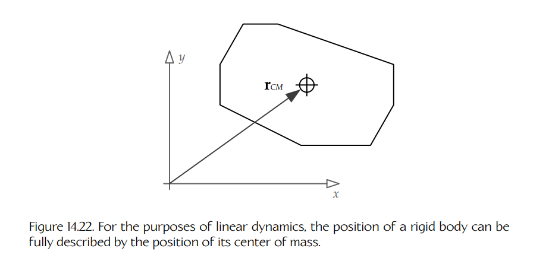

**Figure 14.22.** 就线性动力学而言，刚体的位置可以完全由其质心的位置来描述。

#### 14.4.2.1 线速度与加速度

刚体的**线速度**（linear velocity）定义了物体质心移动的速率和方向。它是一个向量量，通常以米每秒（m/s）度量。速度是位置对时间的一阶导数，因此可以写成

$$
\mathbf{v}(t)=\frac{d\mathbf{r}(t)}{dt}=\dot{\mathbf{r}}(t),
$$

其中向量 `r` 上方的点表示对时间求导。对向量求导等价于对每个分量分别求导，因此

$$
v_x(t)=\frac{dr_x(t)}{dt}=\dot{r}_x(t),
$$

`y` 和 `z` 分量同理。

线性加速度是线速度关于时间的一阶导数，或者说是物体质心位置关于时间的二阶导数。加速度是一个向量量，通常用符号 `a` 表示。因此可以写成

$$
\mathbf{a}(t)=\frac{d\mathbf{v}(t)}{dt}=\dot{\mathbf{v}}(t)
$$

$$
=\frac{d^2\mathbf{r}(t)}{dt^2}=\ddot{\mathbf{r}}(t).
$$

#### 14.4.2.2 力与动量

**力**（force）被定义为任何会使具有质量的对象加速或减速的东西。力在空间中既有大小又有方向，因此所有力都用向量表示。力通常用符号 `F` 表示。当 `N` 个力作用于一个刚体时，它们对物体线性运动的净效应可以通过简单地将这些力向量相加来得到：

$$
\mathbf{F}_{net}=\sum_{i=1}^{N}\mathbf{F}_i.
$$

牛顿著名的第二定律指出，力与加速度和质量成正比：

$$
\mathbf{F}(t)=m\mathbf{a}(t)=m\ddot{\mathbf{r}}(t).
\tag{14.2}
$$

正如牛顿定律所暗示的那样，力以千克·米每秒平方（kg-m/s²）为单位度量。这个单位也称为牛顿（Newton）。

当我们将物体的线速度乘以它的质量时，结果是一个称为**线动量**（linear momentum）的量。通常用符号 `p` 表示线动量：

$$
\mathbf{p}(t)=m\mathbf{v}(t).
$$

当质量保持常量时，Equation (14.2) 成立。但如果质量不是常量，例如火箭燃料逐渐消耗并转化为能量的情况，Equation (14.2) 就不完全正确。正确形式实际上如下：

$$
\mathbf{F}(t)=\frac{d\mathbf{p}(t)}{dt}
=
\frac{d(m(t)\mathbf{v}(t))}{dt}.
$$

当然，当质量为常量并可以移出导数之外时，它会化简为更熟悉的 `F = ma`。线动量对我们而言暂时不是特别重要。不过，当我们讨论角动力学时，动量这个概念会变得相关。

### 14.4.3 求解运动方程

刚体动力学中的核心问题是：给定作用在物体上的一组已知力，求解物体的运动。对于线性动力学而言，这意味着在已知净力 `Fnet(t)` 以及可能的一些其他信息（例如前一时刻的位置和速度）的情况下，求出 `v(t)` 和 `r(t)`。正如下面将看到的，这等价于求解一对常微分方程——一个是在给定 `a(t)` 的情况下求 `v(t)`，另一个是在给定 `v(t)` 的情况下求 `r(t)`。

#### 14.4.3.1 作为函数的力

力可以是常量，也可以如上所示是时间的函数。力还可以是物体位置、速度或任意数量其他量的函数。因此一般来说，力的表达式实际上应该写成：

$$
\mathbf{F}(t,\mathbf{r}(t),\mathbf{v}(t),\ldots)=m\mathbf{a}(t).
\tag{14.3}
$$

这可以用位置向量及其一阶、二阶导数重写为：

$$
\mathbf{F}(t,\mathbf{r}(t),\dot{\mathbf{r}}(t),\ldots)=m\ddot{\mathbf{r}}(t).
$$

例如，弹簧施加的力与它从自然静止位置被拉伸出去的距离成正比。在一维情况下，如果弹簧的静止位置位于 `x = 0`，则可以写成

$$
F(t,x(t))=-kx(t),
$$

其中 `k` 是**弹簧常数**（spring constant），用于度量弹簧的刚度。

再举一个例子，机械黏性阻尼器（所谓 dashpot）施加的阻尼力与阻尼器活塞的速度成正比。因此在一维情况下，可以写成

$$
F(t,v(t))=-bv(t),
$$

其中 `b` 是**黏性阻尼系数**（viscous damping coefficient）。

#### 14.4.3.2 常微分方程

一般来说，**常微分方程**（ordinary differential equation, ODE）是一个包含一个自变量的函数及该函数各种导数的方程。如果自变量是时间，函数是 `x(t)`，那么 ODE 是如下形式的关系：

$$
\frac{d^n x}{dt^n}
=
f\left(
t,x(t),\frac{dx(t)}{dt},\frac{d^2x(t)}{dt^2},\ldots,\frac{d^{n-1}x(t)}{dt^{n-1}}
\right).
$$

换句话说，`x(t)` 的第 `n` 阶导数表示为函数 `f`，其参数可以是时间 `t`、位置 `x(t)`，以及任意数量的 `x(t)` 的导数，只要这些导数的阶数**低于** `n`。

正如 Equation (14.3) 所示，力一般是时间、位置和速度的函数：

$$
\ddot{\mathbf{r}}(t)
=
\frac{1}{m}\mathbf{F}(t,\mathbf{r}(t),\dot{\mathbf{r}}(t)).
$$

这显然符合 ODE 的定义。我们希望求解这个 ODE，以找到 `v(t)` 和 `r(t)`。

#### 14.4.3.3 解析解

在少数情况下，运动微分方程可以被**解析地**（analytically）求解，也就是说，可以找到一个简单的闭式函数，用来描述物体在所有可能时间 `t` 下的位置。一个常见例子是：一个抛射物在恒定重力加速度影响下的垂直运动，其中 `a(t) = [0, g, 0]`，且 `g = -9.8 m/s²`。在这种情况下，运动 ODE 可简化为

$$
\ddot{y}(t)=g.
$$

积分一次得到

$$
\dot{y}(t)=gt+v_0,
$$

其中 `v0` 是 `t = 0` 时的垂直速度。再次积分得到熟悉的解：

$$
y(t)=\frac{1}{2}gt^2+v_0t+y_0,
$$

其中 `y0` 是对象的初始垂直位置。

然而，在游戏物理中，解析解几乎从来不可行。部分原因是，有些微分方程的闭式解根本不存在。而且游戏是交互式仿真，因此通常无法预测游戏中的力会如何随时间变化。这使得我们无法找到简单的闭式表达式，将游戏中对象的位置和速度表示为时间的函数。

当然，这条经验规则也有例外。例如，为了确定抛射物应以什么速度发射才能击中预定义目标，通常会求解一个闭式表达式。

### 14.4.4 数值积分

由于上面提到的原因，游戏物理引擎会转向一种称为**数值积分**（numerical integration）的技术。通过这种技术，我们以**时间步进**（time-stepped）的方式求解微分方程——利用上一个时间步的解来得到下一个时间步的解。时间步长通常被认为大致恒定，并用符号 `Δt` 表示。假设我们知道当前时间 `t1` 下物体的位置和速度，并且力已知为时间、位置和/或速度的函数，我们希望求出下一个时间 `t2 = t1 + Δt` 下的位置和速度。换句话说，给定 `r(t1)`、`v(t1)` 和 `F(t,r,v)`，问题是求 `r(t2)` 和 `v(t2)`。

#### 14.4.4.1 显式欧拉法

求解 ODE 的最简单数值方法之一称为**显式欧拉法**（explicit Euler method）。这是新手游戏程序员经常采用的直观方法。暂且假设我们已经知道当前速度，并希望求解以下 ODE，以得到物体下一帧的位置：

$$
\mathbf{v}(t)=\dot{\mathbf{r}}(t).
\tag{14.4}
$$

使用显式欧拉法时，我们只需将速度从米每秒转换为米每帧：将其乘以时间增量，然后把“一帧的速度量”加到当前位置上，从而预测下一帧的新位置。由此得到 Equation (14.4) 所给 ODE 的如下近似解：

$$
\mathbf{r}(t_2)=\mathbf{r}(t_1)+\mathbf{v}(t_1)\Delta t.
\tag{14.5}
$$

我们可以采用类似方法，在已知这一帧的净作用力时，求出物体下一帧的速度。因此，ODE 的近似显式欧拉解为

$$
\mathbf{a}(t)=\frac{\mathbf{F}_{net}(t)}{m}=\dot{\mathbf{v}}(t)
$$

也就是：

$$
\mathbf{v}(t_2)=\mathbf{v}(t_1)+\frac{\mathbf{F}_{net}(t)}{m}\Delta t.
\tag{14.6}
$$

**对显式欧拉法的解释。**

在 Equation (14.5) 中，我们真正做的是假设物体的速度在整个时间步中保持不变。因此，我们可以使用**当前**速度来预测物体在**下一**帧的位置。时间 `t1` 到 `t2` 之间的位置变化 `Δr` 因此为 `Δr = v(t1)Δt`。从图形上看，如果想象一个物体位置随时间变化的曲线图，我们取的是时间 `t1` 处函数的斜率（即 `v(t1)`），并将其线性外推到下一个时间步 `t2`。如 Figure 14.23 所示，线性外推不一定能特别准确地估计下一个时间步处的真实位置 `r(t2)`，但只要速度大致恒定，它的效果就还算合理。

Figure 14.23 还提供了另一种解释显式欧拉法的方式——将其视为对导数的近似。根据定义，任何导数都是两个无限小差值的商（这里是 `dr/dt`）。显式欧拉法使用两个**有限**差值的商来近似它。换句话说，`dr` 变为 `Δr`，`dt` 变为 `Δt`。于是得到

$$
\frac{d\mathbf{r}}{dt}\approx\frac{\Delta\mathbf{r}}{\Delta t};
$$

$$
\mathbf{v}(t_1)\approx\frac{\mathbf{r}(t_2)-\mathbf{r}(t_1)}{t_2-t_1},
$$

这同样可以化简为 Equation (14.5)。这个近似实际上只有在速度在时间步内保持常量时才成立。当 `Δt` 趋近于零时，它在极限意义上也是成立的（此时它会变得完全正确）。显然，同样的分析也可以应用于 Equation (14.6)。

<a id="figure-1423"></a>
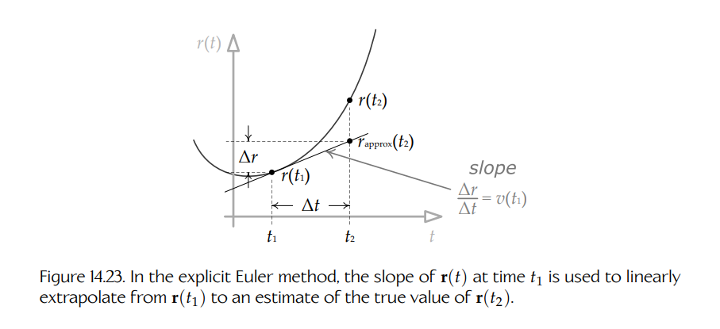

**Figure 14.23.** 在显式欧拉法中，时间 `t1` 处 `r(t)` 的斜率被用于从 `r(t1)` 线性外推，得到对 `r(t2)` 真实值的估计。

#### 14.4.4.2 数值方法的性质

我们已经暗示过显式欧拉法并不是特别精确。现在更具体地指出，ODE 的数值解通常具有三个重要且相互关联的性质：

- **收敛性**（Convergence）。当时间步 `Δt` 趋近于零时，近似解是否越来越接近真实解？
- **阶数**（Order）。给定某个 ODE 解的数值近似，其误差有多“糟糕”？数值 ODE 解的误差通常与时间步长 `Δt` 的某个幂次成正比，因此常用“大 O”记号表示（例如 `O(Δt²)`）。如果某个数值方法的误差项是 `O(Δt^(n+1))`，就说它是 “n 阶” 方法。
- **稳定性**（Stability）。数值解是否会随时间“稳定下来”？如果某个数值方法向系统中加入能量，那么对象速度最终会“爆炸”，系统会变得不稳定。相反，如果某个数值方法倾向于从系统中移除能量，那么它会产生整体阻尼效果，系统会变得稳定。

阶数这个概念值得稍作解释。我们通常通过将数值方法的近似方程与 ODE 精确解的无限泰勒级数展开进行比较来度量其误差。然后通过相减抵消项。剩余的泰勒项就代表该方法固有的误差。例如，显式欧拉方程为

$$
\mathbf{r}(t_2)=\mathbf{r}(t_1)+\dot{\mathbf{r}}(t_1)\Delta t.
$$

精确解的无限泰勒级数展开为

$$
\mathbf{r}(t_2)
=
\mathbf{r}(t_1)
+
\dot{\mathbf{r}}(t_1)\Delta t
+
\frac{1}{2}\ddot{\mathbf{r}}(t_1)\Delta t^2
+
\frac{1}{6}\mathbf{r}^{(3)}(t_1)\Delta t^3
+\ldots,
$$

其中 `r^(3)` 表示关于时间的三阶导数。因此，误差由 `vΔt` 项之后的所有项表示，其阶数为 `O(Δt²)`（因为这个项会压倒其他更高阶项）：

$$
\mathbf{E}
=
\frac{1}{2}\ddot{\mathbf{r}}(t_1)\Delta t^2
+
\frac{1}{6}\mathbf{r}^{(3)}(t_1)\Delta t^3
+\ldots
$$

$$
=
O(\Delta t^2).
$$

为了明确表达某个方法的误差，我们经常会在方程末尾用 “big O” 记号加上误差项。例如，显式欧拉法的方程最准确地写作：

$$
\mathbf{r}(t_2)
=
\mathbf{r}(t_1)
+
\dot{\mathbf{r}}(t_1)\Delta t
+
O(\Delta t^2).
$$

我们说显式欧拉法是“一阶”方法，因为它精确到并包括泰勒级数中含 `Δt` 一次幂的项。一般来说，如果某个方法的误差项为 `O(Δt^(n+1))`，就称它为 “n 阶” 方法。

#### 14.4.4.3 显式欧拉法的替代方法

显式欧拉法在游戏中的简单积分任务里使用相当广泛，当速度近似恒定时可以产生较好的结果。然而，由于误差较大且稳定性较差，它不会用于通用动力学仿真。还有各种其他数值方法可用于求解 ODE，包括后向欧拉法（backward Euler，另一种一阶方法）、中点欧拉法（midpoint Euler，一种二阶方法），以及 Runge-Kutta 方法族。（四阶 Runge-Kutta，常缩写为 “RK4”，尤其流行。）这里不会详细描述这些方法，因为你可以在网络和文献中找到大量资料。Wikipedia 页面 [333] 是学习这些方法的一个很好的起点。

#### 14.4.4.4 Verlet 积分

如今交互式游戏中最常使用的数值 ODE 方法可能是 Verlet 方法，因此我会花一些时间更详细地描述它。这个方法实际上有两个变体：普通 Verlet 和所谓的 **velocity Verlet**。我会在这里同时介绍它们，但会把理论和深入解释留给该主题上大量可用的论文和网页。（可以先查看 [334]。）

普通 Verlet 方法很有吸引力，因为它能达到较高阶数（低误差），计算相对简单、成本低，并且可以在一步中直接根据加速度产生位置解（而不像通常那样需要先从加速度到速度，再从速度到位置）。其公式通过将两个泰勒级数展开相加得到，一个向时间正方向展开，一个向时间负方向展开：

$$
\mathbf{r}(t_1+\Delta t)
=
\mathbf{r}(t_1)
+
\dot{\mathbf{r}}(t_1)\Delta t
+
\frac{1}{2}\ddot{\mathbf{r}}(t_1)\Delta t^2
+
\frac{1}{6}\mathbf{r}^{(3)}(t_1)\Delta t^3
+
O(\Delta t^4);
$$

$$
\mathbf{r}(t_1-\Delta t)
=
\mathbf{r}(t_1)
-
\dot{\mathbf{r}}(t_1)\Delta t
+
\frac{1}{2}\ddot{\mathbf{r}}(t_1)\Delta t^2
-
\frac{1}{6}\mathbf{r}^{(3)}(t_1)\Delta t^3
+
O(\Delta t^4).
$$

将这些表达式相加，会使负项与对应的正项相互抵消。结果给出了下一时间步的位置，形式中只包含加速度以及当前、上一时间步两个已知位置。这就是普通 Verlet 方法：

$$
\mathbf{r}(t_1+\Delta t)
=
2\mathbf{r}(t_1)
-
\mathbf{r}(t_1-\Delta t)
+
\mathbf{a}(t_1)\Delta t^2
+
O(\Delta t^4).
$$

用净力表示时，Verlet 方法变为

$$
\mathbf{r}(t_1+\Delta t)
=
2\mathbf{r}(t_1)
-
\mathbf{r}(t_1-\Delta t)
+
\frac{\mathbf{F}_{net}(t_1)}{m}\Delta t^2
+
O(\Delta t^4).
$$

这个表达式中明显没有速度。不过，可以使用下面这种有些不精确的近似来求速度（也有其他替代方法）：

$$
\mathbf{v}(t_1+\Delta t)
=
\frac{\mathbf{r}(t_1+\Delta t)-\mathbf{r}(t_1)}{\Delta t}
+
O(\Delta t).
$$

#### 14.4.4.5 速度 Verlet

更常用的 **velocity Verlet** 方法是一个四步过程，其中时间步被分为两个部分以便求解。已知

$$
\mathbf{a}(t_1)=\frac{1}{m}\mathbf{F}(t_1,\mathbf{r}(t_1),\mathbf{v}(t_1)),
$$

我们执行以下步骤：

1. 计算

   $$
   \mathbf{r}(t_1+\Delta t)
   =
   \mathbf{r}(t_1)
   +
   \mathbf{v}(t_1)\Delta t
   +
   \frac{1}{2}\mathbf{a}(t_1)\Delta t^2.
   $$

2. 计算

   $$
   \mathbf{v}\left(t_1+\frac{1}{2}\Delta t\right)
   =
   \mathbf{v}(t_1)
   +
   \frac{1}{2}\mathbf{a}(t_1)\Delta t.
   $$

3. 确定

   $$
   \mathbf{a}(t_1+\Delta t)
   =
   \mathbf{a}(t_2)
   =
   \frac{1}{m}\mathbf{F}(t_2,\mathbf{r}(t_2),\mathbf{v}(t_2)).
   $$

4. 计算

   $$
   \mathbf{v}(t_1+\Delta t)
   =
   \mathbf{v}\left(t_1+\frac{1}{2}\Delta t\right)
   +
   \frac{1}{2}\mathbf{a}(t_1+\Delta t)\Delta t.
   $$

注意第三步中，力函数依赖于**下一**时间步的位置和速度，即 `r(t2)` 和 `v(t2)`。我们已经在第一步中计算出了 `r(t2)`，因此只要力不依赖速度，我们就拥有所需的全部信息。如果力依赖速度，那么就必须近似下一帧速度，可能可以使用显式欧拉法。

### 14.4.5 二维中的角动力学

到目前为止，我们一直专注于分析物体质心的线性运动（它表现得仿佛是一个质点）。如前所述，一个不受约束的刚体会绕其质心旋转。这意味着我们可以将物体的角运动叠加在质心的线性运动之上，从而得到物体整体运动的完整描述。研究物体在外加力作用下的旋转运动称为**角动力学**（angular dynamics）。

在二维中，角动力学与线性动力学几乎完全对应。对于每个线性量，都存在一个角向对应量，而且数学关系也相当整齐。因此我们先研究二维角动力学。正如稍后会看到的，当我们把讨论扩展到三维时，事情会变得稍微混乱一些，不过等到那里再处理。

#### 14.4.5.1 朝向与角速度

在二维中，每个刚体都可以看作一张很薄的材料片。（有些物理文本称这样的物体为**平面薄片**（plane lamina）。）所有线性运动都发生在 `xy` 平面内，所有旋转都绕 `z` 轴发生。（可以想象木质拼图块在空气曲棍球桌上滑动。）

二维刚体的**朝向**（orientation）可以完全由一个角度 `θ` 描述，该角度以弧度为单位，相对于某个约定的零旋转测量。例如，可以规定当一辆赛车在世界空间中正对正 `x` 轴方向时，`θ = 0`。当然，这个角度是时间变化函数，因此记作 `θ(t)`。

#### 14.4.5.2 角速率与角加速度

**角速度**（angular velocity）度量的是物体旋转角随时间变化的速率。在二维中，角速度是一个标量，更准确地说应称为**角速率**（angular speed），因为 “velocity” 一词严格来说只适用于向量。它用标量函数 `ω(t)` 表示，并以弧度每秒（rad/s）为单位度量。角速率是朝向角 `θ(t)` 关于时间的导数：

| Angular | Linear |
|---|---|
| $$\omega(t)=\frac{d\theta(t)}{dt}=\dot{\theta}(t)$$ | $$\mathbf{v}(t)=\frac{d\mathbf{r}(t)}{dt}=\dot{\mathbf{r}}(t)$$ |

正如预期的那样，**角加速度**（angular acceleration）用 `α(t)` 表示，以弧度每秒平方（rad/s²）为单位度量，它是角速率变化的速率：

| Angular | Linear |
|---|---|
| $$\alpha(t)=\frac{d\omega(t)}{dt}=\dot{\omega}(t)=\ddot{\theta}(t)$$ | $$\mathbf{a}(t)=\frac{d\mathbf{v}(t)}{dt}=\dot{\mathbf{v}}(t)=\ddot{\mathbf{r}}(t)$$ |

#### 14.4.5.3 转动惯量

质量在旋转意义上的等价量称为**转动惯量**（moment of inertia）。正如质量描述改变质点线速度有多容易或多困难一样，转动惯量度量的是改变刚体绕某个特定轴的角速率有多容易或多困难。如果物体的质量集中在靠近旋转轴的地方，它绕该轴旋转就会相对容易，因此其转动惯量会小于质量远离该轴分布的物体。

由于当前只关注二维角动力学，旋转轴总是 `z`，物体的转动惯量是一个简单的标量值。转动惯量通常用符号 `I` 表示。这里不会深入讨论如何计算转动惯量；完整推导可参见 [18]。

#### 14.4.5.4 力矩

到目前为止，我们一直假设所有力都作用于刚体的质心。然而，一般来说，力可以作用于物体上的任意点。如果一个力的作用线穿过物体质心，那么这个力只会产生线性运动，正如我们已经看到的那样。否则，这个力除了通常导致的线性运动之外，还会引入一种称为**力矩**（torque）的旋转力。Figure 14.24 展示了这一点。

我们可以用叉积来计算力矩。首先，将力的施加位置表示为从物体质心延伸到力的作用点的向量 `r`。（换句话说，向量 `r` 位于**物体空间**（body space）中，而物体空间的原点定义为质心。）Figure 14.25 展示了这一点。由施加在位置 `r` 上的力 `F` 产生的力矩 `N` 为

$$
\mathbf{N}=\mathbf{r}\times\mathbf{F}.
\tag{14.7}
$$

Equation (14.7) 表明，力施加得越远离质心，力矩越大。这解释了为什么杠杆可以帮助我们移动重物。它也解释了为什么一个直接穿过质心的力不会产生力矩，也不会产生旋转——在这种情况下，叉积 `r × F` 的大小为零。

当两个或更多力作用在一个刚体上时，每个力产生的力矩向量可以相加，就像力可以相加一样。因此，一般来说，我们关心的是净力矩 `Nnet`。

<a id="figure-1424"></a>
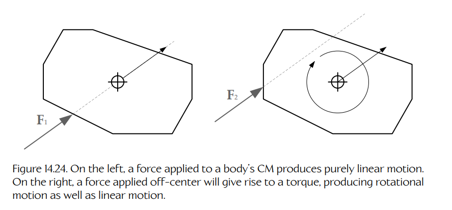

**Figure 14.24.** 左图中，施加到物体质心上的力只产生线性运动。右图中，偏离中心施加的力会产生力矩，从而同时产生旋转运动和线性运动。

<a id="figure-1425"></a>


**Figure 14.25.** 力矩通过对物体空间中的力作用点与力向量取叉积来计算。为便于说明，这里以二维形式显示这些向量；如果能够画出来，力矩向量会指向纸面内。

在二维中，向量 `r` 和 `F` 都必须位于 `xy` 平面内，因此 `N` 总是沿正或负 `z` 轴方向。于是，我们会用标量 `Nz` 表示二维力矩，它只是向量 `N` 的 `z` 分量。

力矩与角加速度和转动惯量之间的关系，和力与线加速度和质量之间的关系非常相似：

| Angular | Linear |
|---|---|
| $$N_z(t)=I\alpha(t)=I\dot{\omega}(t)=I\ddot{\theta}(t)$$ | $$\mathbf{F}(t)=m\mathbf{a}(t)=m\dot{\mathbf{v}}(t)=m\ddot{\mathbf{r}}(t)$$ |

$$
\tag{14.8}
$$

#### 14.4.5.5 求解二维角运动方程

对于二维情况，我们可以使用与线性动力学问题完全相同的数值积分技术来求解角运动方程。我们希望求解的一对 ODE 如下：

| Angular | Linear |
|---|---|
| $$N_{net}(t)=I\dot{\omega}(t)$$ | $$\mathbf{F}_{net}(t)=m\dot{\mathbf{v}}(t)$$ |
| $$\omega(t)=\dot{\theta}(t)$$ | $$\mathbf{v}(t)=\dot{\mathbf{r}}(t)$$ |

其近似显式欧拉解为：

| Angular | Linear |
|---|---|
| $$\omega(t_2)=\omega(t_1)+I^{-1}N_{net}(t_1)\Delta t$$ | $$\mathbf{v}(t_2)=\mathbf{v}(t_1)+m^{-1}\mathbf{F}_{net}(t_1)\Delta t$$ |
| $$\theta(t_2)=\theta(t_1)+\omega(t_1)\Delta t$$ | $$\mathbf{r}(t_2)=\mathbf{r}(t_1)+\mathbf{v}(t_1)\Delta t$$ |

当然，也可以使用其他更精确的数值方法，例如 velocity Verlet 方法（为了简洁，前面没有给出线性情况，但可以与 Section 14.4.4.5 中的步骤进行比较）：

1. 计算

   $$
   \theta(t_1+\Delta t)
   =
   \theta(t_1)
   +
   \omega(t_1)\Delta t
   +
   \frac{1}{2}\alpha(t_1)\Delta t^2.
   $$

2. 计算

   $$
   \omega\left(t_1+\frac{1}{2}\Delta t\right)
   =
   \omega(t_1)
   +
   \frac{1}{2}\alpha(t_1)\Delta t.
   $$

3. 计算

   $$
   \alpha(t_1+\Delta t)
   =
   \alpha(t_2)
   =
   I^{-1}N_{net}(t_2,\theta(t_2),\omega(t_2)).
   $$

4. 计算

   $$
   \omega(t_1+\Delta t)
   =
   \omega\left(t_1+\frac{1}{2}\Delta t\right)
   +
   \frac{1}{2}\alpha(t_1+\Delta t)\Delta t.
   $$

### 14.4.6 三维中的角动力学

三维角动力学比二维角动力学稍微复杂一些，尽管基本概念当然非常相似。在接下来的小节中，我会非常简要地概述 3D 角动力学如何工作，主要关注那些通常会让初学者感到困惑的地方。更多信息可查看 Glenn Fiedler 关于该主题的一系列文章，见 [335]。另一个有用资源是 Carnegie Mellon University 机器人研究所 David Baraff 的论文 “An Introduction to Physically Based Modeling”，见 [336]。

#### 14.4.6.1 惯性张量

刚体围绕三个坐标轴的质量分布可能非常不同。因此，我们应该预期一个物体绕不同轴会有不同的转动惯量。例如，一根细长杆绕其长轴旋转应当相对容易，因为全部质量都非常接近旋转轴。类似地，绕短轴旋转这根杆应当相对更困难，因为其质量分布得更远离该轴。花样滑冰运动员收拢四肢时旋转得更快，原因也是一样的。

在三维中，刚体的旋转质量由一个称为**惯性张量**（inertia tensor）的 `3 × 3` 矩阵表示。它通常用符号 `I` 表示（和之前一样，这里不会描述如何计算惯性张量；详见 [18]）：

$$
\mathbf{I}
=
\begin{bmatrix}
I_{xx} & I_{xy} & I_{xz} \\
I_{yx} & I_{yy} & I_{yz} \\
I_{zx} & I_{zy} & I_{zz}
\end{bmatrix}.
$$

这个矩阵对角线上的元素是物体绕三个主轴的转动惯量，即 `Ixx`、`Iyy` 和 `Izz`。非对角元素称为**惯性积**（products of inertia）。当物体关于三个主轴都对称时，它们为零（例如矩形盒子就是如此）。当它们非零时，通常会产生在物理上相当真实、但普通游戏玩家可能会觉得“错误”的运动。因此，在游戏物理引擎中，惯性张量经常被简化为三元素向量 `[Ixx Iyy Izz]`。

#### 14.4.6.2 三维中的朝向

在二维中，我们知道刚体的朝向可以用单个角度 `θ` 描述，该角度度量绕 `z` 轴的旋转（假设运动发生在 `xy` 平面中）。在三维中，物体的朝向可以用三个欧拉角 `[θx θy θz]` 表示，每个角分别表示物体绕三个笛卡尔坐标轴之一的旋转。然而，正如 Chapter 5 中所见，欧拉角会遭遇万向节锁（gimbal lock）问题，并且在数学上可能难以处理。因此，物体朝向更常用 `3 × 3` 矩阵 `R` 或单位四元数 `q` 表示。本章将只使用四元数形式。

回忆一下，四元数是一个四元素向量，其 `x`、`y` 和 `z` 分量可以解释为沿旋转轴的单位向量 `u`，再按半角的正弦缩放；其 `w` 分量则是半角的余弦：

$$
\mathbf{q}
=
[q_x\quad q_y\quad q_z\quad q_w]
$$

$$
=
[\mathbf{q}\quad q_w]
$$

$$
=
[\mathbf{u}\sin\frac{\theta}{2}\quad \cos\frac{\theta}{2}].
$$

物体的朝向当然是时间的函数，因此应写为 `q(t)`。

同样，我们需要选择一个任意方向作为零旋转。例如，可以规定默认情况下，每个对象的正面都沿世界空间中的正 `z` 轴，`y` 向上，`x` 向左。任何非恒等四元数都会将对象从这个规范世界空间朝向旋转出去。规范朝向的选择是任意的，但当然它在游戏的所有资产之间保持一致非常重要。

#### 14.4.6.3 三维中的角速度与角动量

在三维中，角速度是一个向量量，用 `ω(t)` 表示。角速度向量可以可视化为一个单位长度向量 `u`，它定义旋转轴，并按物体绕 `u` 轴的二维角速度 `ωu = θ̇u` 缩放。因此，

$$
\boldsymbol{\omega}(t)=\omega_u(t)\mathbf{u}=\dot{\theta}_u(t)\mathbf{u}.
$$

在线性动力学中，我们看到如果没有力作用在物体上，那么线性加速度为零，线速度为常量。在二维角动力学中，这一点也成立：如果没有力矩作用在二维物体上，那么角加速度 `α` 为零，绕 `z` 轴的角速率 `ω` 为常量。

<a id="figure-1426"></a>
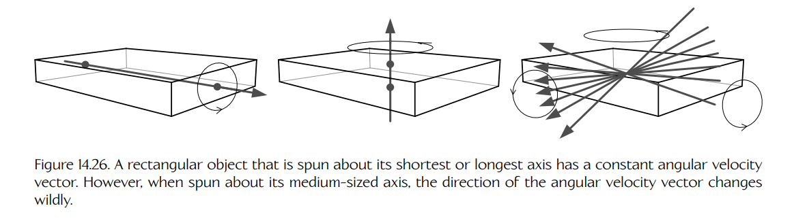

**Figure 14.26.** 当矩形对象绕其最短轴或最长轴旋转时，它具有恒定的角速度向量。然而，当它绕中等长度的轴旋转时，角速度向量的方向会剧烈变化。

遗憾的是，在三维中情况并非如此。事实证明，即使一个刚体在没有任何力作用的情况下旋转，其角速度向量 `ω(t)` 也可能不是常量，因为旋转轴会持续改变方向。你可以在空中旋转一个矩形对象（例如一块木头）时看到这种效果。如果把木块抛出，使其绕最短轴旋转，它会以稳定方式旋转。旋转轴的方向大致保持不变。如果让它绕最长轴旋转，也会发生同样情况。但如果试图让木块绕剩下的那条轴旋转（既不是最短轴也不是最长轴），旋转就会极其不稳定。（可以试试看！去从婴儿那里偷一块木头并用各种方式旋转它。不过转完之后记得还回去。）随着对象旋转，旋转轴本身会剧烈改变方向。Figure 14.26 展示了这一点。

角速度向量可以在没有力矩的情况下改变，这等价于说**角速度不是守恒量**。然而，一个相关量称为**角动量**（angular momentum），在没有力作用时确实保持不变，因此是守恒量。角动量是线动量在旋转意义上的等价物：

| Angular | Linear |
|---|---|
| $$\mathbf{L}(t)=\mathbf{I}\boldsymbol{\omega}(t)$$ | $$\mathbf{p}(t)=m\mathbf{v}(t)$$ |

与线性情况一样，角动量 `L(t)` 是一个三元素向量。然而，与线性情况不同，旋转质量（惯性张量）不是一个标量，而是一个 `3 × 3` 矩阵。因此，表达式 `Iω` 通过矩阵乘法计算：

$$
\begin{bmatrix}
L_x(t) \\
L_y(t) \\
L_z(t)
\end{bmatrix}
=
\begin{bmatrix}
I_{xx} & I_{xy} & I_{xz} \\
I_{yx} & I_{yy} & I_{yz} \\
I_{zx} & I_{zy} & I_{zz}
\end{bmatrix}
\begin{bmatrix}
\omega_x(t) \\
\omega_y(t) \\
\omega_z(t)
\end{bmatrix}.
$$

由于角速度 `ω` 不是守恒量，我们不会像处理线速度 `v` 那样，将它视为动力学仿真中的主要量。相反，我们将角动量 `L` 视为主要量。角速度是一个次要量，只有在每个仿真时间步中确定 `L` 的值之后，才会被求出。

#### 14.4.6.4 三维中的力矩

在三维中，我们仍然将力矩计算为力作用点的径向位置向量与力向量本身之间的叉积（`N = r × F`）。Equation (14.8) 仍然成立，但我们总是将它写成角动量形式，因为角速度不是守恒量：

$$
\mathbf{N}
=
\mathbf{I}\boldsymbol{\alpha}(t)
$$

$$
=
\mathbf{I}\frac{d\boldsymbol{\omega}(t)}{dt}
$$

$$
=
\frac{d}{dt}\left(\mathbf{I}\boldsymbol{\omega}(t)\right)
$$

$$
=
\frac{d\mathbf{L}(t)}{dt}.
$$

#### 14.4.6.5 求解三维角运动方程

在求解三维角运动方程时，我们可能会忍不住采用与线性运动和二维角运动完全相同的方法。我们可能会猜测，运动微分方程应写成

| Angular 3D? | Linear |
|---|---|
| $\mathbf{N}_{net}(t)=\mathbf{I}\dot{\boldsymbol{\omega}}(t)$ | $\mathbf{F}_{net}(t)=m\dot{\mathbf{v}}(t)$ |
| $\boldsymbol{\omega}(t)=\dot{\boldsymbol{\theta}}(t)$ | $\mathbf{v}(t)=\dot{\mathbf{r}}(t)$ |

并且使用显式欧拉法时，也许会猜测这些 ODE 的近似解类似如下：

| Angular 3D? | Linear |
|---|---|
| $\boldsymbol{\omega}(t_2)=\boldsymbol{\omega}(t_1)+\mathbf{I}^{-1}\mathbf{N}_{net}(t_1)\Delta t$ | $\mathbf{v}(t_2)=\mathbf{v}(t_1)+m^{-1}\mathbf{F}_{net}(t_1)\Delta t$ |
| $\boldsymbol{\theta}(t_2)=\boldsymbol{\theta}(t_1)+\boldsymbol{\omega}(t_1)\Delta t$ | $\mathbf{r}(t_2)=\mathbf{r}(t_1)+\mathbf{v}(t_1)\Delta t$ |

然而，这实际上**并不正确**。三维角运动微分方程与线性运动和二维角运动的对应方程有两个重要差异：

1. 我们不直接求解角速度 $\boldsymbol{\omega}$，而是直接求解角动量 $\mathbf{L}$。然后再使用 $\mathbf{I}$ 和 $\mathbf{L}$ 将角速度向量作为次要量计算出来。这样做的原因是角动量守恒，而角速度不守恒。

2. 在给定角速度求解朝向时，会遇到一个问题：角速度是三元素**向量**，而朝向是四元素**四元数**。如何写出一个把四元数和向量联系起来的 ODE？答案是：至少不能直接这样写。但我们可以将角速度向量转换为四元数形式，然后应用一个看起来稍微奇怪的方程，将朝向四元数与角速度四元数联系起来。

事实证明，当我们将刚体的朝向表示为四元数时，这个四元数的导数与物体的角速度向量具有如下关系。首先，我们构造一个**角速度四元数**（angular velocity quaternion）。这个四元数在 $x$、$y$ 和 $z$ 中包含角速度向量的三个分量，而其 $w$ 分量设为零：

$$
\boldsymbol{\omega}
=
[\omega_x\quad \omega_y\quad \omega_z\quad 0].
$$

现在，将朝向四元数与角速度四元数联系起来的微分方程为（这里不深入讨论其原因）：

$$
\frac{d\boldsymbol{\omega}(t)}{dt}
=
\dot{\mathbf{q}}(t)
=
\frac{1}{2}\boldsymbol{\omega}(t)\mathbf{q}(t).
$$

这里必须记住，$\boldsymbol{\omega}(t)$ 是上面描述的**角速度四元数**，并且乘积 $\boldsymbol{\omega}(t)\mathbf{q}(t)$ 是**四元数乘法**（详见 Section 5.4.2.1）。

因此，我们实际上需要将运动 ODE 写成如下形式（注意，我也将线性 ODE 重写为线动量形式，以强调两种情况之间的相似性）：

| Angular 3D | Linear |
|---|---|
| $\mathbf{N}_{net}(t)=\dot{\mathbf{L}}(t)$ | $\mathbf{F}_{net}(t)=\dot{\mathbf{p}}(t)$ |
| $\boldsymbol{\omega}(t)=\mathbf{I}^{-1}\mathbf{L}(t)$ | $\mathbf{v}(t)=m^{-1}\mathbf{p}(t)$ |
| $\boldsymbol{\omega}(t)=[\boldsymbol{\omega}(t)\quad 0]$ | $\mathbf{v}(t)=\dot{\mathbf{r}}(t)$ |
| $\frac{1}{2}\boldsymbol{\omega}(t)\mathbf{q}(t)=\dot{\mathbf{q}}(t)$ |  |

使用显式欧拉法时，三维角 ODE 的最终近似解实际上如下：

$$
\mathbf{L}(t_2)
=
\mathbf{L}(t_1)
+
\mathbf{N}_{net}(t_1)\Delta t
\qquad
\text{(vectors)}
$$

$$
=
\mathbf{L}(t_1)
+
\Delta t\sum_{\forall i}(\mathbf{r}_i\times\mathbf{F}_i(t_1));
\qquad
\text{(vectors)}
$$

$$
\boldsymbol{\omega}(t_2)
=
[\mathbf{I}^{-1}\mathbf{L}(t_2)\quad 0];
\qquad
\text{(quaternions)}
$$

$$
\mathbf{q}(t_2)
=
\mathbf{q}(t_1)
+
\frac{1}{2}\boldsymbol{\omega}(t_1)\mathbf{q}(t_1)\Delta t.
\qquad
\text{(quaternions)}
$$

朝向四元数 $\mathbf{q}(t)$ 应该周期性地重新归一化，以抵消浮点误差不可避免累积所造成的影响。

一如既往，这里使用显式欧拉法只是作为示例。在真正的引擎中，我们通常会使用 velocity Verlet、RK4，或其他更稳定、更精确的数值方法。

### 14.4.7 碰撞响应

到目前为止，我们讨论的一切都假定刚体既没有与任何东西发生碰撞，其运动也没有受到任何其他方式的约束。当物体彼此碰撞时，动力学仿真必须采取措施，确保它们能够对碰撞作出真实可信的响应，并且在仿真步骤完成后，绝不会处于相互穿透的状态。这称为**碰撞响应**（collision response）。

#### 14.4.7.1 能量

在讨论碰撞响应之前，必须先理解**能量**（energy）的概念。当一个力使物体移动一段距离时，我们说这个力做了**功**（work）。功表示能量的变化——也就是说，力要么向刚体系统中加入能量（例如爆炸），要么从系统中移除能量（例如摩擦）。能量有两种形式。物体的**势能**（potential energy）$V$ 是它由于位于某个力场（例如引力场或磁场）中而获得的能量。（例如，物体距离地球表面越高，它具有的重力势能就越多。）物体的**动能**（kinetic energy）$T$ 表示它由于相对于系统中其他物体运动而产生的能量。一个孤立物体系统的总能量 $E=V+T$ 是一个**守恒量**（conserved quantity），这意味着除非能量从系统中流失，或从系统外部加入，否则它保持不变。

由线性运动产生的动能可以写成

$$
T_{linear}
=
\frac{1}{2}mv^2,
$$

或者用线动量向量和速度向量表示为：

$$
T_{linear}
=
\frac{1}{2}\mathbf{p}\cdot\mathbf{v}.
$$

类似地，物体旋转运动产生的动能如下：

$$
T_{angular}
=
\frac{1}{2}\mathbf{L}\cdot\boldsymbol{\omega}.
$$

在求解各种物理问题时，能量及其守恒性是极其有用的概念。我们将在下一节中看到，能量在确定碰撞响应时起到什么作用。

#### 14.4.7.2 冲量式碰撞响应

当两个物体在真实世界中发生碰撞时，会发生一系列复杂事件。物体会稍微压缩，然后反弹，在这个过程中改变速度，并以声音和热量的形式损失能量。大多数实时刚体动力学仿真会用一个简单模型近似所有这些细节，该模型基于对碰撞物体的动量和动能的分析，称为**无摩擦瞬时碰撞的牛顿恢复定律**（Newton’s law of restitution for instantaneous collisions with no friction）。它对碰撞作出以下简化假设：

- 碰撞力作用在一个无限短的时间段内，从而变成我们所谓的理想化**冲量**（impulse）。这会导致物体的速度由于碰撞而**瞬时**发生变化。
- 对象表面的接触点处没有摩擦。这换句话说，就是分离碰撞中物体的冲量沿表面法线方向作用——碰撞冲量没有切向分量。（当然，这只是一种理想化；我们会在 Section 14.4.7.5 中讨论摩擦。）
- 碰撞期间物体之间复杂的亚分子相互作用，可以用一个称为**恢复系数**（coefficient of restitution）的单一量来近似，通常用符号 $\varepsilon$ 表示。这个系数描述碰撞期间损失了多少能量。当 $\varepsilon=1$ 时，碰撞是完全弹性的，没有能量损失。（可以想象两个台球在空中相撞。）当 $\varepsilon=0$ 时，碰撞是完全非弹性的，也称为完全塑性碰撞，两个物体的动能会全部损失。物体在碰撞后会粘在一起，沿着它们共同质心在碰撞前的运动方向继续移动。（可以想象两块油灰被猛地拍在一起。）

所有碰撞分析都建立在线动量守恒这个思想之上。因此，对于物体 1 和物体 2，可以写成

$$
\mathbf{p}_1+\mathbf{p}_2
=
\mathbf{p}'_1+\mathbf{p}'_2,
\qquad
\text{or}
$$

$$
m_1\mathbf{v}_1+m_2\mathbf{v}_2
=
m'_1\mathbf{v}'_1+m'_2\mathbf{v}'_2
$$

其中带撇号的符号表示碰撞后的动量和速度。系统的动能也守恒，但必须通过引入一个额外的能量损失项 $T_{lost}$ 来说明因热量和声音而损失的能量：

$$
\frac{1}{2}m_1v_1^2
+
\frac{1}{2}m_2v_2^2
=
\frac{1}{2}m'_1v_1'^2
+
\frac{1}{2}m'_2v_2'^2
+
T_{lost}.
$$

如果碰撞是完全**弹性**的，则能量损失 $T_{lost}$ 为零。如果碰撞是完全**塑性**的，则能量损失等于系统原始动能，带撇号的动能总和变为零，物体在碰撞后会粘在一起。

为了使用牛顿恢复定律求解碰撞，我们对两个物体施加一个理想化**冲量**。冲量类似于一个作用在无限短时间段内的力，因此会使被施加物体的速度发生瞬时变化。我们可以用符号 $\Delta \mathbf{p}$ 表示冲量，因为它是动量的变化（$\Delta\mathbf{p}=m\Delta\mathbf{v}$）。不过，物理文本通常改用符号 $\hat{\mathbf{p}}$（读作 “p-hat”），所以这里也采用这种写法。

由于假设碰撞中没有摩擦，冲量向量必须垂直于接触点处的两个表面。换句话说，$\hat{\mathbf{p}}=\hat{p}\mathbf{n}$，其中 $\mathbf{n}$ 是两个表面的单位法向量。如 Figure 14.27 所示。如果假设表面法线指向物体 1，那么物体 1 受到冲量 $\hat{\mathbf{p}}$，物体 2 受到大小相等、方向相反的冲量 $-\hat{\mathbf{p}}$。因此，碰撞后两个物体的动量可以用碰撞前的动量和冲量 $\hat{\mathbf{p}}$ 表示如下：

<a id="figure-1427"></a>
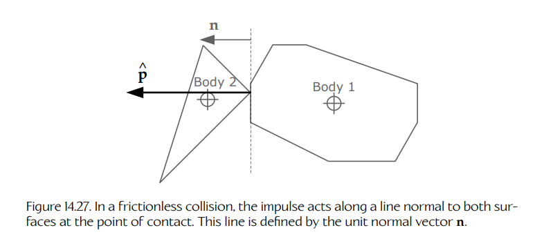

**Figure 14.27.** 在无摩擦碰撞中，冲量沿接触点处同时垂直于两个表面的直线方向作用。该直线由单位法向量 $\mathbf{n}$ 定义。

$$
\mathbf{p}'_1=\mathbf{p}_1+\hat{\mathbf{p}}
\qquad
\mathbf{p}'_2=\mathbf{p}_2-\hat{\mathbf{p}}
$$

$$
m_1\mathbf{v}'_1=m_1\mathbf{v}_1+\hat{\mathbf{p}}
\qquad
m_2\mathbf{v}'_2=m_2\mathbf{v}_2-\hat{\mathbf{p}}
\tag{14.9}
$$

$$
\mathbf{v}'_1=\mathbf{v}_1+\frac{\hat{p}}{m_1}\mathbf{n}
\qquad
\mathbf{v}'_2=\mathbf{v}_2+\frac{\hat{p}}{m_2}\mathbf{n}.
$$

**恢复系数**给出了碰撞前后两个物体相对速度之间的关键关系。假设两个物体的质心在碰撞前后都具有速度，则恢复系数 $\varepsilon$ 定义如下：

$$
(\mathbf{v}'_2-\mathbf{v}'_1)
=
\varepsilon(\mathbf{v}_2-\mathbf{v}_1).
\tag{14.10}
$$

在临时假设两个物体不能旋转的情况下，联立求解 Equations (14.9) 和 (14.10)，得到

$$
\hat{\mathbf{p}}
=
\hat{p}\mathbf{n}
=
\frac{(\varepsilon+1)(\mathbf{v}_2\cdot\mathbf{n}-\mathbf{v}_1\cdot\mathbf{n})}
{\frac{1}{m_1}+\frac{1}{m_2}}
\mathbf{n}.
$$

注意，如果恢复系数为一（完全弹性碰撞），且物体 2 的质量实际上是无限大（例如混凝土车道），那么 $(1/m_2)=0$，$\mathbf{v}_2=0$，该表达式会化简为另一个物体速度向量关于接触法线的反射，正如预期的那样：

$$
\hat{\mathbf{p}}
=
-2m_1(\mathbf{v}_1\cdot\mathbf{n})\mathbf{n};
$$

$$
\mathbf{v}'_1
=
\frac{\mathbf{p}_1+\mathbf{p}_2}{m_1}
$$

$$
=
\frac{m_1\mathbf{v}_1-2m_1(\mathbf{v}_1\cdot\mathbf{n})\mathbf{n}}{m_1}
$$

$$
=
\mathbf{v}_1-2m_1(\mathbf{v}_1\cdot\mathbf{n})\mathbf{n}.
$$

当我们将物体的旋转也考虑进去时，解法会变得更复杂。在这种情况下，我们需要考察两个物体上接触点的速度，而不仅仅是它们质心的速度；并且需要以一种能因碰撞产生真实旋转效果的方式计算冲量。这里不会深入细节，但 Chris Hecker 的文章 [337] 对碰撞响应的线性和旋转两方面都做了非常出色的说明。碰撞响应背后的理论在 [18] 中也有更完整的解释。

#### 14.4.7.3 惩罚力

另一种碰撞响应方法是向仿真中引入称为**惩罚力**（penalty forces）的虚构力。惩罚力的作用类似于一个刚性阻尼弹簧，连接在刚刚发生穿透的两个物体的接触点之间。这样的力会在一个短暂但有限的时间段内引起所需的碰撞响应。使用这种方法时，弹簧常数 $k$ 实际上控制穿透持续时间，而阻尼系数 $b$ 有点类似于恢复系数。当 $b=0$ 时，没有阻尼——没有能量损失，碰撞是完全弹性的。随着 $b$ 增大，碰撞会变得更具有塑性。

我们简要看看惩罚力方法用于解决碰撞问题的优缺点。积极的一面是，惩罚力易于实现和理解。当三个或更多物体相互穿透时，它们也能很好地工作。若一次只处理一对物体，解决这个问题会非常困难。一个很好的例子是 Sony PS3 演示，其中大量橡皮鸭被倒进浴缸——尽管存在非常大量的碰撞，仿真仍然良好且稳定。惩罚力方法是实现这一点的好办法。

遗憾的是，由于惩罚力响应的是穿透（即相对位置），而不是相对速度，这些力可能不会与我们直觉上期望的方向一致，尤其是在高速碰撞中。一个经典例子是一辆汽车正面撞上一辆卡车。汽车较低，而卡车较高。如果只使用惩罚力方法，很容易出现这样一种情况：给定两辆车的速度，惩罚力是竖直方向而非我们预期的水平方向。这可能导致卡车车头弹到空中，而汽车从它下面开过去。

一般来说，惩罚力技术在低速碰撞中效果很好，但当对象快速移动时效果很差。可以将惩罚力方法与其他碰撞解决方法结合起来，以便在存在大量穿透时在稳定性、高速情况下的响应性和更符合直觉的行为之间取得平衡。

#### 14.4.7.4 使用约束解决碰撞

正如我们将在 Section 14.4.8 中看到的，大多数物理系统允许对仿真中物体的运动施加各种约束。如果将碰撞视为不允许对象相互穿透的约束，那么只需运行仿真的通用约束求解器即可解决碰撞。如果约束求解器速度快，并且能够产生高质量视觉结果，这可以成为一种有效的碰撞解决方式。

#### 14.4.7.5 摩擦

**摩擦**（friction）是在两个连续接触的物体之间产生的一种力，它阻碍它们相对于彼此的运动。摩擦有多种类型。**静摩擦**（static friction）是在试图让一个静止物体沿表面滑动时感受到的阻力。**动摩擦**（dynamic friction）是在物体实际相对运动时产生的阻力。**滑动摩擦**（sliding friction）是一种动摩擦，它阻碍物体沿表面滑动时的运动。**滚动摩擦**（rolling friction）是一种静摩擦或动摩擦，发生在轮子或其他圆形物体与其滚动表面的接触点处。当表面非常粗糙时，滚动摩擦恰好足够强，使车轮滚动而不打滑，并且它表现为一种静摩擦。如果表面比较光滑，车轮可能会打滑，此时动态形式的滚动摩擦开始起作用。**碰撞摩擦**（collision friction）是在两个物体运动并发生碰撞时，在接触点处瞬间作用的摩擦力。（这就是我们在 Section 14.4.7.1 讨论牛顿恢复定律时忽略的摩擦力。）各种**约束**也可能具有摩擦。例如，生锈的铰链或轴可能会通过引入力矩来阻碍旋转。

我们来看一个例子，以理解摩擦的本质。线性滑动摩擦与物体重量中垂直作用于其滑动表面的分量成正比。物体的重量就是由重力引起的力，$\mathbf{G}=m\mathbf{g}$，它总是向下。对于一个与水平面成角度 $\theta$ 的倾斜表面，该力的法向分量就是 $G_N=mg\cos\theta$。因此摩擦力 $f$ 为

$$
f=\mu mg\cos\theta,
$$

其中比例常数 $\mu$ 称为**摩擦系数**（coefficient of friction）。这个力沿表面切向作用，方向与物体试图发生或实际发生的运动方向相反。Figure 14.28 展示了这一点。

Figure 14.28 还显示了重力沿表面切向作用的分量，$G_T=mg\sin\theta$。这个力倾向于使物体沿斜面向下加速，但在存在滑动摩擦时，它会被 $f$ 抵消。因此，沿表面切向的净力为

<a id="figure-1428"></a>
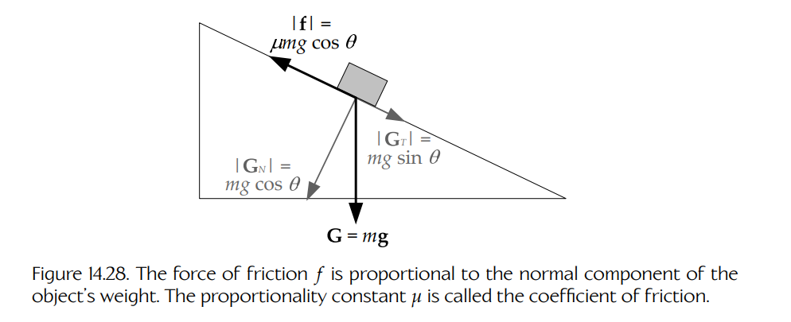

**Figure 14.28.** 摩擦力 $f$ 与物体重量的法向分量成正比。比例常数 $\mu$ 称为摩擦系数。

$$
F_{net}=G_T-f=mg(\sin\theta-\mu\cos\theta).
$$

如果倾角使括号中的表达式为零，那么物体会以恒定速度滑动（如果已经在运动）或保持静止。如果该表达式大于零，物体会沿表面向下加速。如果小于零，物体会减速并最终静止。

#### 14.4.7.6 焊接

当一个对象在 polygon soup 上滑动时，会出现一个额外问题。回忆一下，polygon soup 正如其名——它是一堆本质上彼此无关的多边形（通常是三角形）。当一个对象从这堆多边形中的一个三角形滑向下一个三角形时，碰撞检测系统会产生额外的虚假接触，因为它会认为对象即将撞上新三角形的边缘。Figure 14.29 展示了这一点。

<a id="figure-1429"></a>
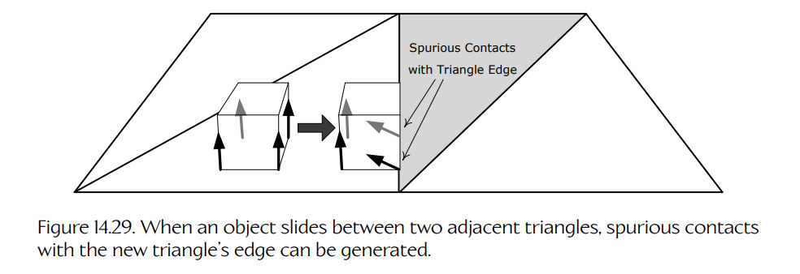

**Figure 14.29.** 当对象在两个相邻三角形之间滑动时，可能会与新三角形的边缘产生虚假接触。

这个问题有许多解决方案。其中一种方法是分析接触集合，并基于各种启发式方法以及对象在前一帧中的接触信息，丢弃那些看似虚假的接触。（例如，如果知道对象正沿表面滑动，而某个接触法线是由于对象靠近当前三角形边缘而产生的，那么就丢弃该接触法线。）Havok 4.5 之前的版本采用了这种方法。

从 Havok 4.5 开始，实现了一项新技术，本质上是为网格标注三角形邻接信息。因此，碰撞检测系统“知道”哪些边是内部边，并可以可靠且快速地丢弃虚假碰撞。Havok 将这种解决方案称为**焊接**（welding），因为从效果上看，polygon soup 中三角形的边被焊接到了一起。

#### 14.4.7.7 静止、岛屿与休眠

当通过摩擦、阻尼或其他方式从仿真系统中移除能量时，运动对象最终会静止下来。这看起来像是仿真的自然结果——似乎会直接从运动微分方程中“自动产生”。遗憾的是，在真实的计算机仿真中，静止并没有那么简单。浮点误差、恢复力计算中的不准确性以及数值不稳定性等因素，可能导致对象永远抖动，而不是在应当静止时真正静止。因此，大多数物理引擎会使用各种启发式方法，检测对象是在振荡而不是按预期静止。可以从系统中移除额外能量，以确保这些对象最终稳定下来；或者当它们的平均速度低于某个阈值时，直接让它们突然停止。

当一个对象确实停止运动（发现自己处于平衡状态）时，就没有理由每帧继续积分它的运动方程。为了优化性能，大多数物理引擎允许仿真中的动态对象**进入休眠**（be put to sleep）。这会将它们暂时排除在仿真之外，不过处于休眠状态的对象从碰撞角度看仍然是活动的。如果某个力或冲量开始作用于休眠对象，或者对象失去了某个维持其平衡的接触，它就会被唤醒，从而恢复其动力学仿真。

**休眠判据。**

可以使用多种判据来判断一个物体是否符合休眠条件。要让这个判断在所有情况下都足够稳健，并不总是容易的。例如，一个长摆可能具有非常低的角动量，但仍然在屏幕上可见地移动。

最常用的平衡检测判据包括：

- 物体是**受支撑的**（supported）。这意味着它具有三个或更多接触点（或一个或多个平面接触），使其能够在重力以及其他可能影响它的力作用下达到平衡。
- 物体的**线动量和角动量**低于预定义阈值。
- 线动量和角动量的**滑动平均值**低于预定义阈值。
- 物体的总**动能**低于预定义阈值：

  $$
  T=\frac{1}{2}\mathbf{p}\cdot\mathbf{v}
  +
  \frac{1}{2}\mathbf{L}\cdot\boldsymbol{\omega}.
  $$

  动能通常会按质量归一化，这样无论物体质量如何，都可以使用单一阈值。

即将进入休眠状态的物体运动可能会被**逐渐阻尼**（progressively damped），使其平滑停止，而不是突然停住。

**仿真岛屿。**

Havok 和 PhysX 还会进一步优化性能：它们会自动将正在交互或近期可能交互的对象分组到称为**仿真岛屿**（simulation islands）的集合中。每个仿真岛屿都可以独立于其他岛屿进行仿真，这种方法非常有利于缓存一致性优化和并行处理。

Havok 和 PhysX 都会让整个岛屿进入休眠，而不是让单个刚体进入休眠。这种方法有利也有弊。当一整组交互对象都可以进入休眠时，性能提升显然会更大。另一方面，如果某个岛屿中有一个对象是醒着的，那么整个岛屿都是醒着的。总体来看，其优点似乎往往大于缺点，因此仿真岛屿设计很可能会继续出现在这些 SDK 的未来版本中。

### 14.4.8 约束

一个不受约束的刚体具有六个自由度（DOF）：它可以在三维中平移，并且可以绕三个笛卡尔坐标轴旋转。**约束**（constraints）会限制对象的运动，从而部分或完全减少其自由度。约束可以用于在游戏中模拟各种有趣的行为。下面是一些例子：

- 摆动的吊灯（点到点约束）；
- 可以被踢开、猛地关上或从铰链上炸飞的门（铰链约束）；
- 车辆的车轮组件（带有阻尼弹簧悬架的轴约束）；
- 拉着拖车的火车或汽车（刚性弹簧/杆约束）；
- 绳索或链条（由刚性弹簧或杆构成的链）；
- rag doll（模拟人体骨骼中各种关节行为的专用约束）。

在接下来的小节中，我们将简要研究物理 SDK 通常提供的这些约束，以及其他一些最常见的约束类型。

#### 14.4.8.1 点到点约束

**点到点约束**（point-to-point constraint）是最简单的约束类型。它的作用类似于球窝关节——只要一个物体上的指定点与另一个物体上的指定点对齐，物体就可以以任意方式运动。Figure 14.30 展示了这一点。

<a id="figure-1430"></a>
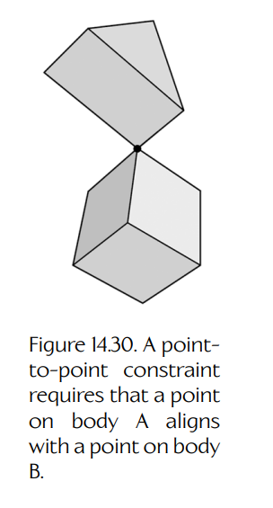

**Figure 14.30.** 点到点约束要求物体 A 上的一个点与物体 B 上的一个点对齐。

#### 14.4.8.2 刚性弹簧

**刚性弹簧约束**（stiff spring constraint）很像点到点约束，只不过它会使两个点保持指定距离。这种约束类似于两个受约束点之间的一根不可见的杆。Figure 14.31 展示了这种约束。

<a id="figure-1431"></a>
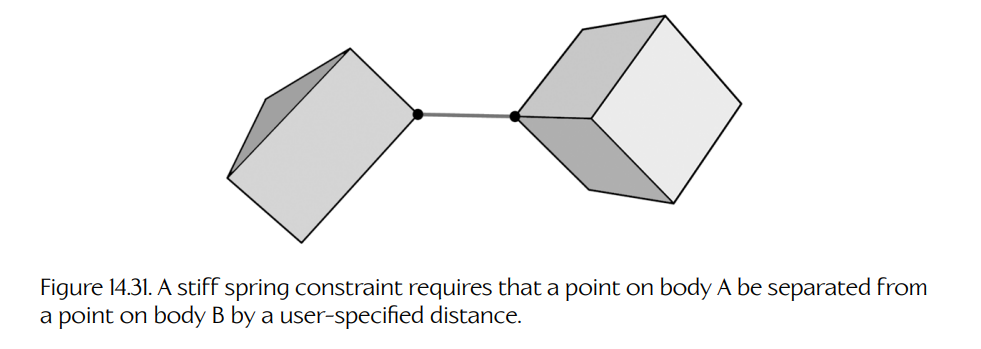

**Figure 14.31.** 刚性弹簧约束要求物体 A 上的一个点与物体 B 上的一个点保持用户指定的距离。

#### 14.4.8.3 铰链约束

**铰链约束**（hinge constraint）将旋转运动限制为只具有一个自由度，即绕铰链轴旋转。**无限制铰链**（unlimited hinge）的作用类似于车轴，允许被约束对象完成无限次数的完整旋转。定义**受限铰链**（limited hinges）也很常见，它们只能绕唯一允许的轴在预定义角度范围内运动。例如，单向门只能通过 180 度弧线，因为否则它会穿过相邻墙壁。类似地，双向门会被约束在 ±180 度弧线内。铰链约束还可以以阻碍绕铰链轴旋转的力矩形式具有一定摩擦。Figure 14.32 展示了一个受限铰链约束。

<a id="figure-1432"></a>
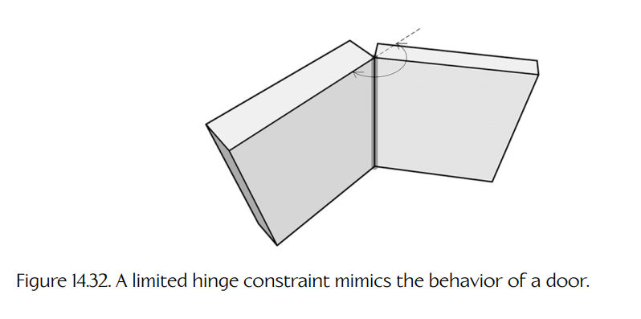

**Figure 14.32.** 受限铰链约束模拟门的行为。

#### 14.4.8.4 棱柱约束

**棱柱约束**（prismatic constraints）的作用类似活塞：受约束物体的运动被限制为单一平移自由度。棱柱约束可以允许也可以不允许绕活塞平移轴旋转。当然，棱柱约束可以是受限的或无限制的，也可以包含摩擦。Figure 14.33 展示了一个棱柱约束。

<a id="figure-1433"></a>
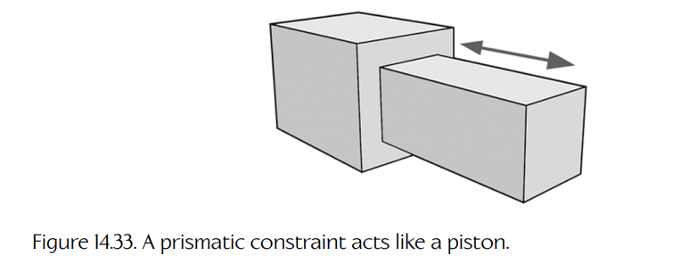

**Figure 14.33.** 棱柱约束的作用类似活塞。

#### 14.4.8.5 其他常见约束类型

当然，还可能存在许多其他类型的约束。这里只列举几个例子：

- **平面约束**（Planar）。对象被约束为在二维平面中运动。
- **车轮约束**（Wheel）。这通常是一个具有无限旋转的铰链约束，并与某种通过弹簧-阻尼器组件模拟的垂直悬架耦合。
- **滑轮约束**（Pulley）。在这种专用约束中，一根虚构的绳索穿过滑轮，并连接到两个物体上。两个物体按照杠杆比沿绳索方向运动。

约束可以是可断裂的，这意味着施加足够大的力之后，它们会自动分开。或者，游戏也可以根据自己的判据随意开启或关闭约束，以决定约束何时应当断裂。

#### 14.4.8.6 约束链

由多个物体连接而成的长链有时很难以稳定方式仿真，这是因为约束求解器具有迭代性质。**约束链**（constraint chain）是一组专用约束，其中包含告诉约束求解器对象如何连接的信息。这使求解器能够以比其他方式更稳定的方式处理该链。

#### 14.4.8.7 布娃娃

**Rag doll** 是一种物理仿真，用于模拟人体在死亡或失去意识、因而完全瘫软时可能产生的运动。Rag doll 通过将一组刚体连接起来创建，每个刚体对应身体中的一个半刚性部位。例如，我们可能会为脚、小腿、大腿、手、上臂和下臂、头部，以及可能用于躯干的几个部位设置胶囊体，以模拟脊柱的柔性。

Rag doll 中的刚体通过约束相互连接。Rag doll 约束是专门设计的，用于模拟真实人体中关节可以执行的运动类型。通常会使用约束链来提升仿真的稳定性。

Rag doll 仿真总是与动画系统紧密集成。当 rag doll 在物理世界中运动时，我们会提取刚体的位置和旋转，并使用这些信息驱动动画骨架中某些关节的位置和朝向。因此，从效果上看，rag doll 实际上只是由物理系统驱动的一种**程序化动画**（procedural animation）形式。（关于骨骼动画的更多细节见 Chapter 13。）

当然，实现 rag doll 并不像我这里说得这么简单。首先，rag doll 中刚体与动画骨架中的关节之间通常并不存在一对一映射——骨架中的关节数量通常多于 rag doll 中的刚体。因此，需要一个系统将刚体映射到关节（也就是“知道”rag doll 中每个刚体对应哪个关节）。在由 rag doll 刚体驱动的关节之间，可能还有额外关节，因此映射系统还必须能够为这些中间关节确定正确的姿态变换。这并不是一门精确科学。为了实现自然外观的 rag doll，必须运用艺术判断，并具备一定的人体生物力学知识。

#### 14.4.8.8 动力约束

约束也可以是“有动力的”（powered），这意味着动画系统等外部引擎系统可以间接控制 rag doll 中刚体的平移和朝向。

以肘关节为例。肘部的作用很像受限铰链，具有略小于 180 度的自由旋转范围。（实际上，肘部也可以轴向旋转，但在本讨论中忽略这一点。）为了给这个约束提供动力，我们将肘部建模为**旋转弹簧**（rotational spring）。这种弹簧会施加一个与弹簧偏离某个预定义静止角的角度成正比的力矩：

$$
N=-k(\theta-\theta_{rest}).
$$

现在设想从外部改变静止角，例如确保它始终匹配动画骨架中肘关节的角度。随着静止角变化，弹簧会发现自己不再处于平衡状态，并会施加一个力矩，使肘部重新转回到与 $\theta_{rest}$ 对齐的位置。在没有其他任何力或力矩的情况下，刚体会精确跟踪动画骨架中肘关节的运动。但如果引入其他力（例如小臂与不可移动对象发生接触），这些力就会参与肘关节的整体运动，使其以某种真实可信的方式偏离动画运动。如 Figure 14.34 所示，这会产生这样一种错觉：一个人正在尽力以某种方式移动（即动画提供的“理想”运动），但由于物理世界的限制而有时无法做到（例如试图向前摆动手臂时，手臂被某物卡住）。

<a id="figure-1434"></a>


**Figure 14.34.** 使用动力 rag doll 约束时，在没有其他额外力或力矩的情况下，表示小臂的刚体可以精确跟踪动画肘关节的运动（左）。如果障碍物阻挡了刚体的运动，它会以真实可信的方式偏离动画肘关节的运动（右）。

### 14.4.9 控制刚体运动

大多数游戏设计都要求在刚体运动方式上具有一定控制能力，而不仅仅让它们在重力影响下以及与场景中其他对象碰撞后的响应中自然运动。例如：

- 通风口会对进入其影响范围的任何对象施加向上的力。
- 汽车连接到拖车后，会在移动时对拖车施加拉力。
- 牵引光束会对一个毫无防备的宇宙飞船施加力。
- 反重力装置会让对象悬浮。
- 河流的水流会产生一个力场，使漂浮在河中的对象向下游移动。

类似情况还有很多。大多数物理引擎通常会为用户提供多种方式，用来控制仿真中的物体。我们将在接下来的小节中概述这些机制中最常见的几种。

#### 14.4.9.1 重力

在大多数发生于地球表面或其他行星表面的游戏中，重力无处不在（也包括带有模拟重力的飞船中的游戏）。从技术上讲，重力不是一个力，而是一个大致恒定的加速度，因此无论质量如何，它都会同等影响所有物体。由于重力普遍存在且性质特殊，在大多数 SDK 中，重力加速度的大小和方向都会通过一个全局设置指定。（如果你正在编写太空游戏，总是可以将重力设为零，以便从仿真中消除它。）

#### 14.4.9.2 施加力

在游戏物理仿真中，可以对物体施加任意数量的力。力总是在一个有限时间间隔内作用。（如果它瞬时作用，就称为**冲量**——详见下面的 Section 14.4.9.4。）游戏中的力通常具有动态性质——它们的方向和/或大小经常每帧变化。因此，大多数物理 SDK 中的力施加函数都被设计为在力影响持续期间每帧调用一次。这类函数的签名通常类似于：

```cpp
applyForce(const Vector& forceInNewtons);
```

其中，力的持续时间被假定为 $\Delta t$。

#### 14.4.9.3 施加力矩

当一个力的作用线穿过物体质心时，不会产生力矩，只有物体的线性加速度受到影响。如果它偏离中心施加，则会同时引起线性加速度和旋转加速度。还可以通过在距离质心相等的两个点上施加两个大小相等、方向相反的力，向物体施加一个**纯力矩**（pure torque）。由这样一对力引起的线性运动会相互抵消（因为在线性动力学中，两个力都作用于质心）。这样只留下它们的旋转效果。这样一对产生力矩的力称为**力偶**（couple）[338]。SDK 可能会提供一个专用函数用于此目的，例如：

```cpp
applyTorque(const Vector& torque);
```

不过，如果你的物理 SDK 没有提供 `applyTorque()` 函数，也总是可以自己写一个，让它生成合适的力偶。

#### 14.4.9.4 施加冲量

正如我们在 Section 14.4.7.2 中所见，**冲量**（impulse）是速度的瞬时变化（或者更准确地说，是动量的变化）。从技术上讲，冲量是在无限短时间内作用的力。然而，在时间步进动力学仿真中，施加力的最短可能持续时间是 $\Delta t$，这仍然不够短，无法充分模拟冲量。因此，大多数物理 SDK 会提供类似如下签名的函数，用于向物体施加冲量：

```cpp
applyImpulse(const Vector& impulse);
```

当然，冲量有两种形式——线性冲量和角冲量——一个好的 SDK 应该提供用于施加这两类冲量的函数。

### 14.4.10 碰撞/物理步骤

既然已经介绍了实现碰撞和物理系统背后的理论以及一些技术细节，现在我们简要看看这些系统实际如何在每一帧执行更新。

每个碰撞/物理引擎都会在更新步骤中执行以下基本任务。不同物理 SDK 可能会以不同顺序执行这些阶段。尽管如此，我最常见到的技术大致如下：

1. 作用于物理世界中物体的力和力矩会被向前积分 $\Delta t$，以确定它们在下一帧的暂定位置和朝向。

2. 调用碰撞检测库，以确定是否由于对象的暂定运动而在任意对象之间生成了新的接触。（物体通常会记录自己的接触，以利用时间相干性。因此，在仿真的每一步中，碰撞引擎只需要判断是否丢失了任何先前接触，以及是否添加了任何新接触。）

3. 通过施加冲量或惩罚力来解决碰撞，或者作为下面的约束求解步骤的一部分解决碰撞。根据 SDK 的不同，这一阶段可能包含也可能不包含连续碰撞检测（CCD），也称为冲击时间检测（time of impact detection, TOI）。

4. 通过约束求解器满足约束。

在第 4 步结束时，一些物体可能已经从第 1 步确定的暂定位置移开。这种移动可能导致对象之间产生额外穿透，或导致其他先前已经满足的约束被破坏。因此，第 1 步到第 4 步（有时只重复第 2 步到第 4 步，取决于碰撞和约束的解决方式）会反复执行，直到满足以下条件之一：（a）所有碰撞都已成功解决，并且所有约束都已满足；或者（b）超过了预定义的最大迭代次数。在后一种情况下，求解器实际上会“放弃”，并希望后续仿真帧中这些问题能够自然解决。这有助于将碰撞和约束求解的成本分摊到多帧，从而避免性能尖峰。然而，如果误差过大，或者时间步太长或不一致，它可能导致看起来不正确的行为。惩罚力可以混合到仿真中，以便随时间逐渐解决这些问题。

#### 14.4.10.1 约束求解器

**约束求解器**（constraint solver）本质上是一种迭代算法，它试图同时满足大量约束，方法是**最小化误差**：即物理世界中物体的实际位置和旋转，与约束所定义的理想位置和旋转之间的误差。因此，约束求解器本质上是迭代式误差最小化算法。

先来看一个简单情况：只有一对物体通过一个铰链约束连接。在物理仿真的每一步中，数值积分器会为两个物体找到新的暂定变换。然后，约束求解器会评估它们的相对位置，并计算它们共享旋转轴的位置和朝向之间的误差。如果检测到任何误差，求解器会移动这些物体，以尽量减小或消除误差。由于系统中没有其他物体，第二次迭代时会发现没有新的接触，而且约束求解器会发现这个铰链约束现在已经满足。因此，循环可以退出，不需要进一步迭代。

当必须同时满足多个约束时，可能需要更多迭代。在每次迭代期间，数值积分会有时倾向于使物体偏离其约束，而约束求解器则倾向于将它们重新放回对齐状态。幸运的话，如果约束求解器采用了精心设计的误差最小化方法，这个反馈循环最终会收敛到一个有效解。然而，该解并不总是精确的。这就是为什么在带有物理引擎的游戏中，有时会看到看似不可能的行为，例如链条被拉长（链环之间出现小间隙）、对象短暂穿透，或铰链瞬间超出允许范围。约束求解器的目标是最小化误差——并不总是能够完全消除误差。

#### 14.4.10.2 引擎之间的差异

上面的描述当然过度简化了物理/碰撞引擎每帧真正发生的事情。各个计算阶段的执行方式，以及它们之间的相对顺序，都可能因物理 SDK 而异。例如，某些类型的约束会被建模为力和力矩，并由数值积分步骤处理，而不是由约束求解器解决。碰撞可能在积分步骤之前运行，而不是之后。碰撞也可能以多种不同方式解决。这里的目标只是让你大致了解这些系统如何工作。若要详细理解某个 SDK 的运行方式，需要阅读其文档，并且最好也查看它的源代码（前提是相关部分可供阅读）。好奇且勤奋的读者可以从下载并试用 Open Dynamics Engine（ODE）和/或 PhysX 开始，因为这两个 SDK 都是免费的。你也可以从 ODE 的 wiki 中学到很多内容，见 [81]。
