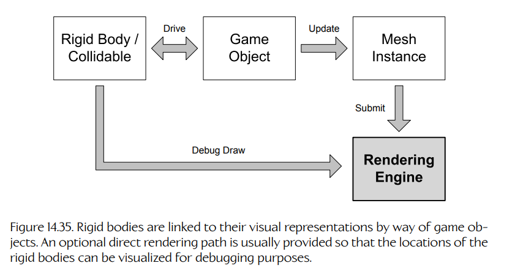
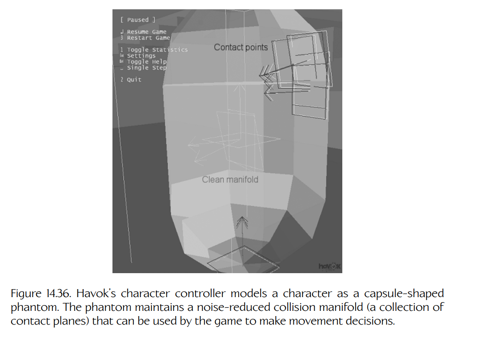

## 14.5 将物理引擎集成到游戏中

显然，碰撞/物理引擎本身几乎没有什么用处——它必须被集成到游戏引擎中。在本节中，我们将讨论碰撞/物理引擎与游戏代码其余部分之间最常见的接口点。

### 14.5.1 连接游戏对象与刚体

碰撞/物理世界中的刚体和可碰撞体，不过是抽象的数学描述而已。为了让它们在游戏语境中真正有用，我们需要以某种方式将它们与屏幕上的视觉表现连接起来。通常情况下，我们并不会直接绘制刚体（调试用途除外）。相反，刚体用于描述构成虚拟游戏世界的逻辑对象的形状、大小和物理行为。我们将在第 17 章深入讨论游戏对象，但眼下可以先依赖我们对游戏对象的直观理解——它是游戏世界中的一个逻辑实体，例如角色、载具、武器、漂浮的能量道具，等等。因此，物理世界中的刚体与其屏幕上的视觉表现之间的连接通常是间接的，其中逻辑游戏对象充当连接二者的枢纽。这一点如图 14.35 所示。

**Figure 14.35.** 刚体通过游戏对象与其视觉表现相连接。通常还会提供一条可选的直接渲染路径，以便为了调试目的将刚体的位置可视化出来。

一般来说，一个游戏对象在碰撞/物理世界中可以由零个或多个刚体表示。下面列出了三种可能的情况：

- **零个刚体。** 在物理世界中没有任何刚体的游戏对象，看起来就像并不是实体，因为它们根本没有碰撞表示。某些装饰性对象，例如飞过头顶的鸟，或者玩家和非玩家角色都无法与之交互、只能看见但永远到达不了的游戏世界部分，可能没有碰撞。这种情况也可以适用于某些对象：由于某种原因，它们的碰撞检测是手动处理的，而不是借助碰撞/物理引擎来完成。

- **一个刚体。** 大多数简单游戏对象只需要由单个刚体表示。在这种情况下，刚体的可碰撞体形状会被选择为尽可能接近游戏对象的视觉表现形状，并且刚体的位置和朝向会与游戏对象本身的位置和朝向完全匹配。

- **多个刚体。** 某些复杂游戏对象在碰撞/物理世界中由多个刚体表示。例如角色、机械装置、载具，或者任何由多个可以彼此相对运动的实体部件组成的对象。这样的游戏对象通常会使用一套骨骼（即一组仿射变换层级）来跟踪各个组成部件的位置，当然也可以采用其他方式。刚体通常会以某种方式连接到骨骼的关节上，使得每个刚体的位置和朝向对应于某个关节的位置和朝向。骨骼中的关节可能由动画驱动，在这种情况下，相关联的刚体只是跟随它们运动。或者，物理系统也可以驱动刚体的位置，从而间接控制关节的位置。关节到刚体之间的映射可能是一一对应的，也可能不是——有些关节可能完全由动画控制，而另一些关节则连接到刚体。

当然，游戏对象与刚体之间的连接必须由引擎进行管理。通常，每个游戏对象会管理自己的刚体：在必要时创建和销毁它们，根据需要将它们加入物理世界或从中移除，并维护每个刚体的位置与游戏对象位置和/或其某个关节位置之间的连接。对于由多个刚体组成的复杂游戏对象，可以使用某种包装类来管理它们。这可以将游戏对象与管理一组刚体的底层细节隔离开来，并允许不同类型的游戏对象以一致的方式管理它们的刚体。

#### 14.5.1.1 由物理驱动的物体

如果我们的游戏拥有刚体动力学系统，那么可以推测，我们希望游戏中至少一部分对象的运动完全由模拟来驱动。这样的游戏对象称为**由物理驱动的物体**（physics-driven bodies）。碎片、爆炸建筑物、从山坡上滚下的石头、空弹匣和弹壳——这些都是由物理驱动的物体的例子。

由物理驱动的刚体会通过以下方式与其游戏对象连接起来：先推进模拟，然后向物理系统查询该刚体的位置和朝向。随后，这个变换会被应用到整个游戏对象，或者应用到游戏对象中的某个关节或其他数据结构上。

*示例：带可拆卸门的保险箱*

当由物理驱动的刚体连接到一套骨骼的关节上时，这些刚体通常会受到约束，从而产生某种期望的运动。举个例子，我们来看一个带有可拆卸门的保险箱可以如何建模。

从视觉上看，假设这个保险箱由一个三角形网格构成，其中包含两个子网格：一个用于箱体，另一个用于门。使用一套包含两个关节的骨骼来控制这两个部件的运动。根关节绑定到保险箱的箱体，而子关节绑定到保险箱门，这样旋转门关节就会使门的子网格以合适的方式打开和关闭。

保险箱的碰撞几何也被拆分为两个独立部分：一个用于箱体，一个用于门。这两个部分用于在碰撞/物理世界中创建两个完全独立的刚体。保险箱箱体的刚体连接到骨骼中的根关节，而门的刚体连接到门关节。随后向物理世界中添加一个铰链约束，以确保在模拟这两个刚体的动力学时，门刚体能够相对于箱体正确摆动。代表箱体和门的两个刚体的运动，会用于更新骨骼中两个关节的变换。一旦动画系统生成了骨骼的矩阵调色板，渲染引擎最终就会在物理世界中这些刚体所在的位置绘制箱体和门的子网格。

如果某个时刻门需要被炸飞，那么这个约束可以被破坏，并且可以向刚体施加冲量，使它们飞出去。从视觉上看，玩家会觉得门和保险箱箱体已经变成了两个独立对象。但实际上，它仍然是一个游戏对象、一张包含两个关节和两个刚体的三角形网格。

#### 14.5.1.2 由游戏驱动的物体

在大多数游戏中，游戏世界中的某些对象需要以非物理的方式运动。这类对象的运动可能由动画决定，也可能通过沿样条路径移动来确定，还可能由人类玩家控制。我们通常希望这些对象参与碰撞检测——例如，能够把由物理驱动的对象从自己路径上推开——但又不希望物理系统以任何方式干扰它们自身的运动。为了容纳这类对象，大多数物理 SDK 都提供一种特殊类型的刚体，称为**由游戏驱动的物体**（game-driven body）。（Havok 将其称为 “key framed” bodies，即“关键帧驱动体”。）

由游戏驱动的物体不会受到重力影响。物理系统也会把它们视为具有无限大的质量（通常用质量为零来表示，因为对于由物理驱动的物体来说，零质量是无效质量）。无限质量这一假设确保模拟中的力和碰撞冲量永远无法改变由游戏驱动的物体的速度。

若要在物理世界中移动一个由游戏驱动的物体，我们不能简单地在每一帧直接把它的位置和朝向设置为与对应游戏对象的位置一致。这样做会引入不连续性，而物理模拟将很难解析这些不连续性。（例如，一个由物理驱动的物体可能会突然发现自己与一个由游戏驱动的物体相互穿透，但它却没有关于该由游戏驱动物体的动量信息，无法用来解析这次碰撞。）因此，由游戏驱动的物体通常通过冲量来移动——冲量是一种瞬时速度变化，向前积分后会使物体在时间步结束时到达期望位置。大多数物理 SDK 都提供便利函数，用于计算为了在下一帧达到期望位置和朝向所需的线性冲量和角冲量。在移动由游戏驱动的物体时，我们确实需要注意：当它应该停止时，必须将其速度清零。否则，该物体会沿着最后一次非零轨迹永远继续运动下去。

*示例：动画驱动的保险箱门*

让我们继续前面带可拆卸门的保险箱示例。设想我们希望一个角色走到保险箱前，拨动密码盘，打开保险箱门，存入一些钱，然后再次关门并上锁。稍后，我们希望另一个角色以一种不太文明的方式拿到这些钱——把保险箱门炸飞。为此，保险箱需要额外建模一个用于密码盘的子网格，并添加一个额外关节，使密码盘能够旋转。不过，密码盘本身不需要刚体，除非我们当然也希望它在门爆炸时飞出去。

在人物打开和关闭保险箱的动画序列期间，保险箱的刚体可以被置于由游戏驱动模式。此时动画驱动关节，而关节又驱动刚体。稍后，当门需要被炸飞时，我们可以将这些刚体切换为由物理驱动模式，破坏铰链约束，施加冲量，然后看着门飞出去。

你可能已经注意到，在这个特定示例中，铰链约束实际上并不是必需的。只有当门在某个时刻需要保持打开，并且我们希望看到门在保险箱被移动或门被撞到时能够自然摆动，才需要该约束。

#### 14.5.1.3 固定物体

大多数游戏世界同时由静态几何体和动态对象组成。为了对游戏世界中的静态组成部分建模，大多数物理 SDK 都提供一种特殊类型的刚体，称为**固定物体**（fixed body）。固定物体有点类似于由游戏驱动的物体，但它们完全不参与动力学模拟。实际上，它们是只用于碰撞的物体。对于大多数游戏来说，这种优化可以带来很大的性能提升，尤其是那些世界中只有少量动态对象在巨大的静态世界内运动的游戏。

#### 14.5.1.4 Havok 的运动类型

在 Havok 中，所有类型的刚体都由 `hkpRigidBody` 类的实例表示。每个实例都包含一个字段，用于指定其**运动类型**（motion type）。运动类型告诉系统该物体是固定的、由游戏驱动的（Havok 称之为 “key framed”），还是由物理驱动的（Havok 称之为 “dynamic”）。如果一个刚体以固定运动类型创建，那么它的类型永远不能再改变。否则，一个物体的运动类型可以在运行时动态改变。这个特性极其有用。例如，角色手中的一个物体可以是由游戏驱动的。但一旦角色丢下或投掷该物体，它就可以被切换为由物理驱动，从而让动力学模拟接管它的运动。在 Havok 中，这很容易实现，只需要在释放物体的瞬间改变它的运动类型即可。

运动类型还可以作为一种方式，向 Havok 提供关于动态物体惯性张量的一些提示。因此，“dynamic” 运动类型会被进一步划分为一些子类别，例如 “dynamic with sphere inertia”（带球形惯性的动态体）、“dynamic with box inertia”（带盒形惯性的动态体）等。通过物体的运动类型，Havok 可以基于对惯性张量内部结构的假设来应用各种优化。

### 14.5.2 更新模拟

物理模拟当然必须周期性更新，通常是每帧更新一次。这不仅仅涉及推进模拟本身（数值积分、解析碰撞和应用约束）。游戏对象与其刚体之间的连接也必须被维护。如果游戏需要对任何刚体施加力或冲量，这也必须每帧完成。要完整更新物理模拟，需要执行以下步骤：

- **更新由游戏驱动的刚体。** 更新物理世界中所有由游戏驱动刚体的变换，使它们与游戏世界中对应对象（游戏对象或关节）的变换匹配。

- **更新幻影体。** 幻影形状的作用类似于一个没有对应刚体的由游戏驱动的可碰撞体。它用于执行某些碰撞查询。所有幻影体的位置都会在物理步之前更新，以确保运行碰撞检测时它们位于正确的位置。

- **更新力、施加冲量并调整约束。** 游戏正在施加的所有力都会被更新。本帧发生的游戏事件所导致的任何冲量都会被施加。必要时还会调整约束。（例如，可以检查一个可破坏铰链是否已经断裂；如果断裂，则指示物理引擎移除该约束。）

- **推进模拟。** 我们在第 14.4.10 节中看到，碰撞引擎和物理引擎都必须周期性更新。这包括对运动方程进行数值积分，以求得下一帧所有物体的物理状态；运行碰撞检测算法，以添加和移除物理世界中所有刚体的接触；解析碰撞并应用约束。根据 SDK 的不同，这些更新阶段可能被隐藏在一个原子式的 `step()` 函数背后，也可能允许单独运行。

- **更新由物理驱动的游戏对象。** 从物理世界中提取所有由物理驱动对象的变换，并更新对应游戏对象或关节的变换，使其与之匹配。

- **查询幻影体。** 在物理步之后读取每个幻影形状的接触信息，并用这些信息进行决策。

- **执行碰撞投射查询。** 射线投射和形状投射可以同步或异步发起。当这些查询结果可用时，它们会被各种引擎系统用于做出决策。

这些任务通常会按照上面列出的顺序执行，但射线投射和形状投射除外：理论上，它们可以在游戏循环中的任何时间执行。显然，在推进模拟之前更新由游戏驱动的物体并施加力和冲量是合理的，因为这样模拟才能“看到”这些影响。同样，由物理驱动的游戏对象应当总是在物理步之后更新，以确保我们使用的是最新的物体变换。渲染通常发生在游戏循环中所有其他工作之后。这可以确保我们在某个特定时刻渲染的是游戏世界的一致视图。

#### 14.5.2.1 碰撞查询的时机

为了向碰撞系统查询最新信息，我们需要在本帧物理步已经运行之后执行碰撞查询（射线投射和形状投射）。然而，物理步通常在帧末尾运行，也就是在游戏逻辑已经做出大部分决策，并且所有新的由游戏驱动的物理物体位置已经确定之后。那么，碰撞查询到底应该在什么时候运行？

这个问题并没有一个简单答案。我们有若干选择，而大多数游戏最终会使用其中的一部分或全部：

- **基于上一帧状态做决策。** 在很多情况下，基于上一帧的碰撞信息也可以正确做出决策。例如，我们可能想知道玩家上一帧是否站在某个东西上，以决定这一帧是否应该开始下落。在这种情况下，我们可以安全地在物理步之前运行碰撞查询。

- **接受一帧延迟。** 即使我们真的想知道这一帧发生了什么，也可能能够容忍碰撞查询结果中存在一帧延迟。通常只有当相关对象运动不太快时，这才成立。例如，我们可能会将一个对象向前移动一段时间，然后想知道该对象现在是否处于玩家视线中。这类查询中的一帧误差可能不会被玩家注意到。如果是这种情况，我们可以在物理步之前运行碰撞查询（返回上一帧的碰撞信息），然后把这些结果当作当前帧结束时碰撞状态的近似值来使用。

- **在物理步之后运行查询。** 另一种做法是在物理步之后运行某些查询。当基于查询结果所做的决策可以延迟到帧的后半段时，这种做法是可行的。例如，某个依赖碰撞查询结果的渲染效果就可以这样实现。

#### 14.5.2.2 单线程更新

一个非常简单的单线程游戏循环可能类似于下面这样：

    F32 dt = 1.0f/30.0f;

    for (;;) // main game loop
    {
        g_hidManager->poll();

        g_gameObjectManager->preAnimationUpdate(dt);
        g_animationEngine->updateAnimations(dt);
        g_gameObjectManager->postAnimationUpdate(dt);

        g_physicsWorld->step(dt);
        g_animationEngine->updateRagDolls(dt);

        g_gameObjectManager->postPhysicsUpdate(dt);
        g_animationEngine->finalize();

        g_effectManager->update(dt);

        g_audioEngine->update(dt);

        // etc.

        g_renderManager->render();

        dt = calcDeltaTime();
    }

在这个例子中，游戏对象会分三个阶段更新：一次在动画运行之前（例如，它们可以在此阶段排队新的动画），一次在动画系统已经计算出最终局部姿势和一个临时全局姿势之后（但在最终全局姿势和矩阵调色板生成之前），还有一次在物理系统推进之后。

- 所有由游戏驱动刚体的位置通常会在 `preAnimationUpdate()` 或 `postAnimationUpdate()` 中更新。每个由游戏驱动物体的变换会被设置为与拥有它的游戏对象的位置匹配，或者与所有者骨骼中的某个关节位置匹配。

- 每个由物理驱动刚体的位置通常会在 `postPhysicsUpdate()` 中读取，并用于更新游戏对象或其骨骼中某个关节的位置。

一个重要问题是物理模拟的推进频率。大多数数值积分器、碰撞检测算法和约束求解器，在步长之间的时间间隔（$\Delta t$）恒定时工作效果最好。通常比较好的做法是使用理想的 1/30 秒或 1/60 秒时间增量来推进物理/碰撞 SDK，然后控制整个游戏循环的帧率。如果游戏低于目标帧率，与其试图调整模拟时间步长来匹配实际帧率，不如让物理表现从视觉上变慢。

### 14.5.3 游戏中碰撞与物理的示例用途

为了让我们对碰撞和物理的讨论更加具体，下面从较高层面看几个常见示例，说明碰撞和/或物理模拟在真实游戏中通常如何使用。

#### 14.5.3.1 简单刚体游戏对象

许多游戏都会包含简单的物理模拟对象，例如武器、可以被拾起并投掷的石块、空弹匣、家具、架子上可以被射击的物体，等等。这些对象可以通过创建一个自定义游戏对象类来实现，并让它引用物理世界中的一个刚体（例如，如果使用 Havok，就是 `hkpRigidBody`）。或者，我们可以创建一个附加组件类，用于处理简单刚体的碰撞和物理，使这一功能几乎可以添加到引擎中的任何类型的游戏对象上。

简单物理对象通常会在运行时改变其运动类型。当它们被握在角色手中时，是由游戏驱动的；而在被丢下后自由下落时，则是由物理驱动的。

#### 14.5.3.2 子弹轨迹

无论你是否赞成游戏暴力，一个事实仍然存在：激光枪和各种形式的投射武器都是大多数游戏的重要组成部分。下面看看这些内容通常如何实现。

有时，投射物会使用射线投射来实现。在武器开火的那一帧，我们发出一次射线投射，确定命中的对象，并立即把冲击效果施加到受影响的对象上。

遗憾的是，射线投射方法并没有考虑投射物的飞行时间。它也没有考虑重力影响导致的轻微向下轨迹。如果这些细节对游戏很重要，我们可以使用真实刚体来建模投射物，让它们随时间穿过碰撞/物理世界。这对于运动较慢的投射物尤其有用，例如投掷物或火箭弹。Naughty Dog 的 *The Last of Us* 中投掷砖块就采用了这种方法。

在实现激光束和投射物时，有许多问题需要考虑和处理。下面讨论其中一些最常见的问题。

*子弹射线投射*

使用射线投射检测子弹命中时，会出现一个问题：射线究竟应该来自摄像机焦点，还是来自玩家角色手中枪口的末端？这在第三人称射击游戏中尤其麻烦，因为从玩家枪口射出的射线通常并不与从摄像机焦点穿过屏幕中心准星的射线对齐。这可能导致这样的情况：准星看起来正好在目标上方，但第三人称角色显然位于障碍物后方，从他的视角实际上无法射击该目标。通常必须采用各种“技巧”，在保持屏幕上视觉可信的同时，确保玩家感觉自己射中了正在瞄准的东西。

*碰撞几何与可见几何之间的不匹配*

碰撞几何与可见几何之间的不匹配，可能导致玩家能够通过一条小缝或某个物体边缘上方看见目标，但碰撞几何是实体的，因此子弹无法击中目标。（这通常只会成为玩家角色的问题。）这一问题的一种解决方案是使用渲染查询，而不是碰撞查询，来判断射线是否真的命中了目标。例如，在某个渲染通道中，我们可以生成一张纹理，其中每个像素存储其对应游戏对象的唯一标识符。随后，我们可以查询这张纹理，以判断武器准星下方的像素中是否存在敌方角色或其他合适目标。

*动态环境中的瞄准*

如果投射物需要有限时间才能到达目标，那么 AI 控制的角色可能需要对射击进行“提前量”计算。

*冲击效果*

当子弹击中目标时，我们可能希望触发声音或粒子效果、放置贴花，或执行其他任务。

在 Unreal 引擎中，这通过一套**物理材质**（physical materials）系统来完成。可见几何不仅可以标记视觉材质，也可以标记物理材质。前者定义表面看起来是什么样子，后者定义表面如何响应物理交互，包括冲击声音、子弹 “squib” 粒子效果、贴花，等等。（更多细节见 [339]。）

在 Naughty Dog，我们使用一种非常相似的系统：碰撞几何可以标记**多边形属性**（polygon attributes，简称 PAT），这些属性定义某些物理行为，例如脚步声。但子弹冲击会被特殊处理，因为我们需要它们直接与可见几何交互，而不是与粗略的碰撞几何交互。因此，可见材质可以被标记一个可选的**子弹效果**（bullet effect），它定义对于可能冲击该表面的每一种投射物类型，应当放置哪种子弹 squib、冲击声音和贴花。

#### 14.5.3.3 手榴弹

游戏中的手榴弹有时会被实现为自由运动的物理对象。然而，这会导致显著的控制损失。我们可以通过对手榴弹施加各种人工力或冲量来重新获得一部分控制。例如，我们可以在手榴弹第一次弹跳之后施加极大的空气阻力，试图限制它从目标处弹开的距离。

一些游戏团队实际上会进一步完全手动管理手榴弹的运动。手榴弹的轨迹弧线可以提前计算出来，通过一系列射线投射判断如果释放它会击中什么目标。轨迹甚至可以通过某种屏幕显示展示给玩家。当手榴弹被投出时，游戏会沿着它的弧线移动它，并可以细致控制其弹跳，使其永远不会离目标太远，同时看起来仍然自然。

#### 14.5.3.4 爆炸

在游戏中，爆炸通常包含几个组成部分：某种视觉效果，例如火球和烟雾；用于模拟爆炸声音以及它与世界中对象碰撞声音的音频效果；以及一个不断扩大的伤害半径，会影响其范围内的任何对象。

当一个对象发现自己位于爆炸半径内时，其生命值通常会降低，而我们通常也希望赋予它一些运动，以模拟冲击波效果。这可以通过动画来完成。（例如，角色对爆炸的反应最好可能采用这种方式。）我们也可能希望让冲击反应完全由动力学模拟驱动。实现方法是让爆炸向其半径内任何合适对象施加冲量。这些冲量的方向很容易计算——它们通常是径向的，通过将从爆炸中心到受影响对象中心的向量归一化，然后按照爆炸强度缩放该向量来得到（并且可能随着到爆心距离增加而衰减）。

爆炸也可能与其他引擎系统交互。例如，我们可能希望向动画植被系统施加一个“力”，使草、植物和树木由于爆炸冲击波而短暂弯曲。

#### 14.5.3.5 可破坏对象

可破坏对象在许多游戏中都很常见。这类对象比较特殊：它们一开始处于未受损状态，必须看起来像一个单一、凝聚的整体，但同时又必须能够破碎成许多独立碎片。我们可能希望这些碎片一个接一个地断裂，使对象逐渐被“削薄”；也可能只需要一次灾难性的爆炸。

像 DMM 这样的可变形体模拟可以自然处理破坏。不过，我们也可以使用刚体动力学来实现可破坏对象。通常的做法是将一个模型划分为若干可破坏碎片，并为每个碎片分配一个独立刚体。例如，Havok Destruction 采用的就是这种方法。

出于性能优化和/或视觉质量方面的原因，我们可能决定使用特殊的“未损坏”版本的视觉几何与碰撞几何，它们各自都构造成单一实体块。当对象需要开始破裂时，可以将这个模型替换成受损版本。在其他情况下，我们可能希望对象始终被建模为独立碎片。例如，如果对象是一堆砖或一堆锅碗瓢盆，这种做法可能比较合适。

要建模一个由多个碎片组成的对象，我们可以简单地堆叠一堆刚体，并让物理模拟负责处理。这可以在质量较好的物理引擎中工作（尽管并不总是容易调好）。然而，我们可能希望实现某些好莱坞式效果，而这些效果无法通过一堆简单刚体来实现。

例如，我们可能希望定义对象的结构。有些碎片可能是**不可破坏的**，例如墙体底部或汽车底盘。其他碎片可能是**非结构性的**——它们在被子弹或其他对象击中时只是脱落。还有一些碎片可能是**结构性的**——如果它们被击中，不仅会掉落，还会向位于其上方的其他碎片施加力。有些碎片可能是**爆炸性的**——当它们被击中时，会产生二次爆炸，或在整个结构中传播伤害。我们可能希望某些碎片可以作为角色的有效**掩体点**，而另一些则不可以。这意味着我们的可破坏对象系统可能与掩体系统存在某种连接。

我们也可能希望可破坏对象具有生命值概念。伤害可能逐渐累积，直到最终整个对象坍塌；或者每个碎片都可以拥有自己的生命值，需要多次射击或冲击后才允许破裂。约束也可以用于让断裂碎片悬挂在对象上，而不是完全脱离。

我们还可能希望结构需要一段时间才能完全坍塌。例如，如果一座长桥的一端被爆炸击中，坍塌应当从一端缓慢传播到另一端，使桥看起来很庞大。这又是一个物理系统不会免费提供给你的功能——它只会同时唤醒模拟岛中的所有刚体。这类效果可以通过谨慎使用由游戏驱动的运动类型来实现。

#### 14.5.3.6 角色机制

对于保龄球、弹球或 *Marble Madness* 这样的游戏来说，“主角”是一个在虚构游戏世界中滚动的球。对于这类游戏，我们完全可以将球建模为物理模拟中的自由运动刚体，并在游戏过程中通过对它施加力和冲量来控制其运动。

然而，在以角色为基础的游戏中，我们通常不会采用这种方法。类人或动物角色的运动通常过于复杂，无法仅用力和冲量充分控制。相反，我们通常将角色建模为一组由游戏驱动的胶囊形刚体，每个刚体都连接到角色动画骨骼中的一个关节。这些刚体主要用于子弹命中检测，或用于生成次级效果，例如角色手臂把桌上的物体碰落。由于这些刚体是由游戏驱动的，它们不会避免与物理世界中的不可移动对象发生相互穿透，所以动画师必须确保角色的运动看起来可信。

为了在游戏世界中移动角色，大多数游戏会使用球体投射或胶囊体投射，沿期望运动方向进行探测。碰撞会被手动解析。这使我们能够做一些很酷的事情，例如：

**Figure 14.36.** Havok 的角色控制器将角色建模为胶囊形幻影体。该幻影体维护一个经过降噪处理的碰撞流形（即一组接触平面），游戏可以用它来做出运动决策。

- 当角色以斜角撞到墙时，让角色沿墙滑动；
- 允许角色“弹起”越过低矮路缘，而不是卡住；
- 防止角色走下低矮路缘时进入“下落”状态；
- 防止角色走上过于陡峭的斜坡（大多数游戏会设定一个截止角，超过该角度后，角色会向后滑下，而不能继续爬坡）；
- 调整动画以适应碰撞。

以上最后一点可以举个例子：如果角色以大约 90 度角直接跑向墙面，我们可以让角色永远“月球漫步”式地顶着墙跑，也可以减慢其动画。我们还可以做得更巧妙，比如播放一段动画：角色伸出手触碰墙面，然后自然地待机，直到移动方向改变。

Havok 提供了一个角色控制器系统，可以处理其中许多事情。在 Havok 的系统中，如图 14.36 所示，角色被建模为一个胶囊形幻影体，并且每帧移动它以寻找潜在的新位置。系统会为角色维护一个碰撞接触流形（即一组接触平面，并经过清理以消除噪声）。这个流形可以每帧被分析，用来决定如何最好地移动角色、调整动画，等等。

#### 14.5.3.7 摄像机碰撞

在许多游戏中，摄像机会在游戏世界中跟随玩家角色或载具，并且通常可以由玩家以有限方式旋转或控制。在这类游戏中，非常重要的一点是绝不能允许摄像机与场景几何相互穿透，因为这会破坏真实感幻觉。因此，在许多游戏中，摄像机系统也是碰撞引擎的另一个重要客户。

大多数摄像机碰撞系统的基本思想，是用一个或多个球形幻影体或球体投射查询包围虚拟摄像机，用来检测摄像机何时接近与某物发生碰撞。系统可以通过某种方式调整摄像机的位置和/或朝向，在摄像机真正穿过该对象之前避免潜在碰撞。

这听起来足够简单，但实际上是一个极其棘手的问题，需要大量试错才能做对。为了让你感受到其中可能涉及多少工作量，许多游戏团队会在整个项目周期内安排一名专门工程师负责摄像机系统。这里不可能深入讨论摄像机碰撞检测和解析，但下面的列表可以让你了解一些最相关、需要注意的问题：

- 通过拉近摄像机来避免碰撞，在很多情况下都很有效。在第三人称游戏中，你可以一路拉近到第一人称视角，而不会造成太大问题（除了需要确保摄像机在此过程中不要穿入角色头部）。

- 通常不建议为了响应碰撞而大幅改变摄像机的水平角度，因为这往往会干扰基于摄像机方向的玩家控制。不过，在某些情况下，一定程度的水平调整可以工作良好，这取决于玩家当时预期要做什么。如果玩家正在瞄准目标，那么你为了让摄像机脱离碰撞而打乱其瞄准，玩家会很生气。但如果玩家只是在世界中移动，那么摄像机朝向的变化可能会感觉完全自然。因此，你可能希望只在主角不处于激烈战斗中时，才允许调整摄像机的水平角度。

- 你可以在一定程度上调整摄像机的垂直角度，但重要的是不要做得太多，否则玩家会失去对地平线的感知，并最终俯视玩家角色的头顶！

- 有些游戏允许摄像机沿位于垂直平面中的弧线运动，这条弧线可能由样条描述。这样，一个 HID 控制（例如左摇杆的垂直偏转）就可以以直观方式同时控制摄像机的缩放和垂直角度。（Naughty Dog 引擎中的摄像机就是这样工作的。）当摄像机与世界中的对象发生碰撞时，它可以自动沿同一条弧线移动以避开碰撞；这条弧线可能会被水平压缩，也可以采用任意数量的其他方案。

- 不仅要考虑摄像机后方和侧方有什么，也要考虑其前方有什么。例如，如果一根柱子或另一个角色进入摄像机与玩家角色之间，该怎么办？在一些游戏中，挡住视线的对象会变成半透明；在另一些游戏中，摄像机会拉近或绕开，以避免碰撞。玩家是否会觉得这样舒服，并不一定。你如何处理这类情况，会决定玩家对游戏质量的感知成败。

即使考虑了这些以及许多其他棘手情况，你的摄像机也可能看起来或感觉不对！在实现摄像机碰撞系统时，一定要为试错预留大量时间。

#### 14.5.3.8 布娃娃集成

在第 14.4.8.7 节中，我们了解到可以使用特殊类型的约束，将一组刚体连接起来，以模拟一个无力的（死亡或昏迷的）人体行为。在本节中，我们将考察在将布娃娃物理集成到游戏中时会出现的一些问题。

正如我们在第 14.5.3.6 节中看到的，有意识角色的整体运动通常通过执行形状投射，或在游戏世界中移动一个幻影形状来决定。角色身体的细节运动通常由动画驱动。由游戏驱动的刚体有时会附加到肢体上，用于武器瞄准，或者让角色能够撞倒世界中的其他对象。

当角色失去意识时，布娃娃系统会接管。角色的肢体被建模为胶囊形刚体，这些刚体通过约束连接，并链接到角色动画骨骼中的关节。物理系统模拟这些物体的运动，我们更新骨骼关节以与之匹配，从而允许物理系统移动角色身体。

用于布娃娃物理的刚体集合，可能并不是角色活着时附着在其肢体上的同一组刚体。这是因为两种碰撞模型有着非常不同的需求。当角色活着时，其刚体由游戏驱动，所以我们并不在乎它们是否相互穿透。事实上，我们通常希望它们彼此重叠，这样才不会出现敌方角色可以从中射击的漏洞。但当角色变成布娃娃时，刚体不能相互穿透就很重要了，因为这会导致碰撞解析系统施加很大的冲量，使肢体倾向于向外爆开！基于这些原因，根据角色是有意识还是无意识，为角色准备完全不同的碰撞/物理表示其实相当常见。

另一个问题是如何从有意识状态过渡到无意识状态。简单地在动画生成姿势和物理生成姿势之间做 lerp 混合，通常效果并不好，因为物理姿势会很快偏离动画姿势。（在两个完全无关的姿势之间做混合通常看起来并不自然。）因此，我们可能希望在过渡期间使用动力约束（见第 14.4.8.8 节）。

角色在有意识时（也就是其刚体由游戏驱动时）经常会与背景几何相互穿透。这意味着当角色切换到布娃娃（由物理驱动）模式时，刚体可能已经位于另一个实体对象内部。这会产生巨大的冲量，在游戏中导致相当狂野的布娃娃行为。为了避免这些问题，最好仔细制作死亡动画，使角色肢体尽可能避开碰撞。同时，在由游戏驱动模式期间，通过幻影体或碰撞回调来检测碰撞也很重要，这样一旦角色身体的任何部分接触到实体对象，就可以立即将角色切换到布娃娃模式。

即使采取了这些步骤，布娃娃也仍然倾向于卡在其他对象内部。单面碰撞在试图让布娃娃看起来合理时可能是一个极其重要的功能。如果一个肢体部分嵌入墙中，它会倾向于被推出墙外，而不是继续卡在里面。然而，即使单面碰撞也不能解决所有问题。例如，当角色移动很快，或者布娃娃过渡执行不当时，布娃娃中的某个刚体可能会落到一堵薄墙的另一侧。这会导致角色悬在半空中，而不是正确地落到地面上。

另一个有用的布娃娃功能，是让无意识角色恢复意识并重新站起来。为此，我们需要一种方式来搜索合适的“站起”动画。我们希望找到一个动画，其第零帧姿势与布娃娃静止后的姿势最为接近（而后者通常完全不可预测）。这可以通过只匹配少数几个关键关节的姿势来完成，例如大腿上部和上臂。另一种方法是在布娃娃静止之前，使用动力约束手动引导布娃娃进入一个适合起身的姿势。

最后还应提到，设置布娃娃约束可能是一件棘手的事情。我们通常希望肢体能够自由运动，但又不做任何生物力学上不可能的动作。这也是构建布娃娃时经常使用专门约束类型的原因之一。尽管如此，也不应假设你的布娃娃无需付出努力就能看起来很好。像 Havok 这样的高质量物理引擎提供了一整套内容创建工具，允许美术人员在 Maya 等 DCC 软件包中设置约束，并实时测试它们在游戏中可能的表现。

总的来说，让布娃娃物理在游戏中**工作**并不特别困难，但要让它看起来**好**，则可能需要大量工作！和游戏编程中的许多事情一样，最好预留充足时间用于试错，尤其是在第一次处理布娃娃系统时。