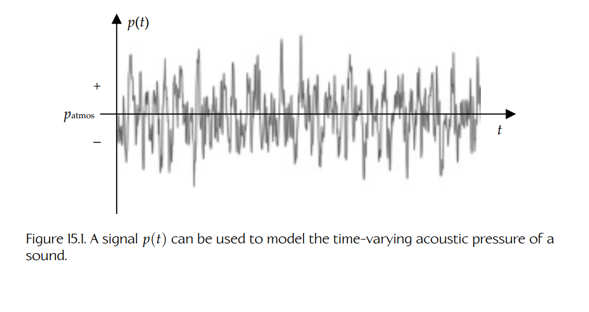
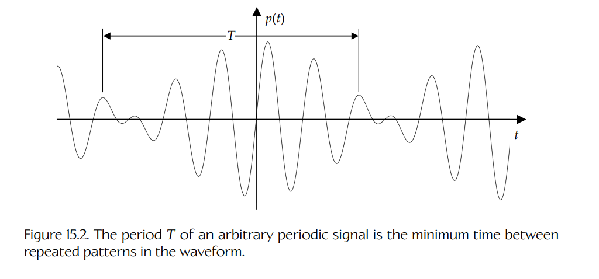
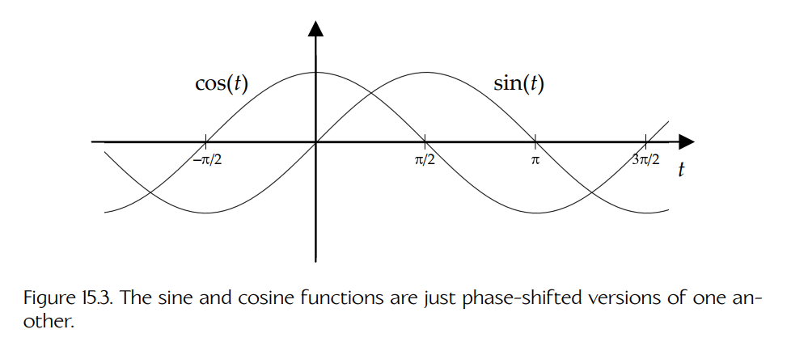
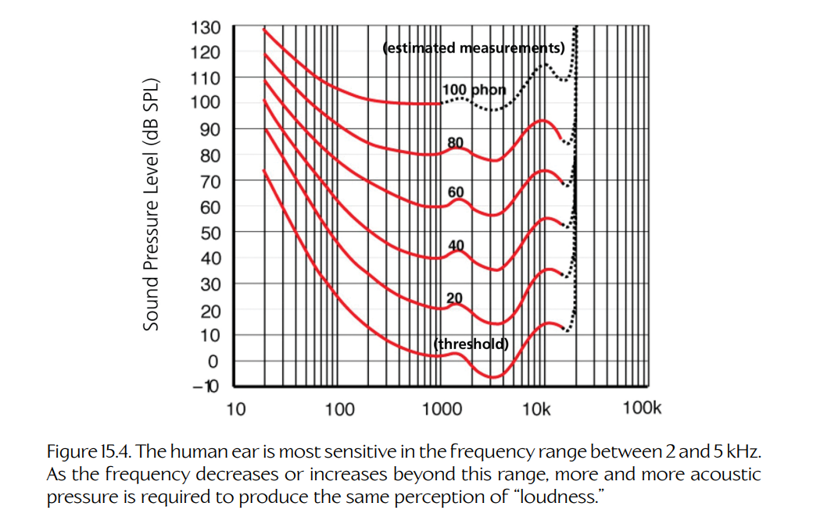
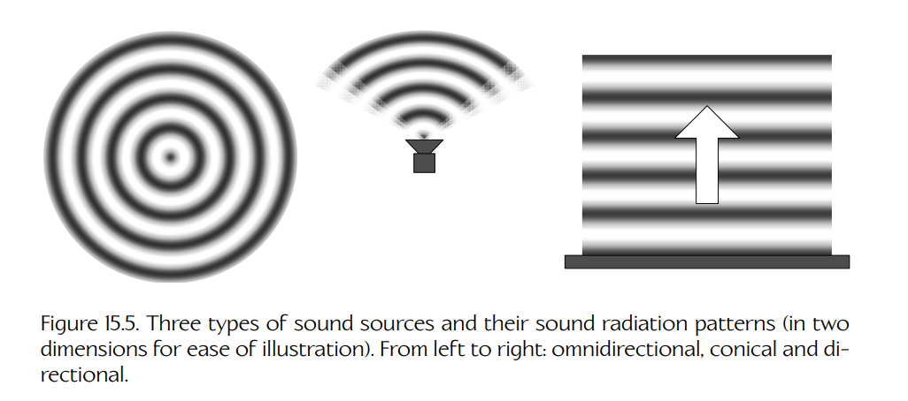
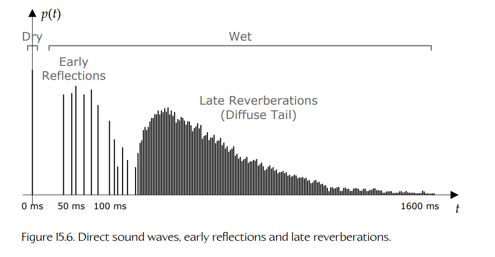

## 15.1 声音的物理学

声音是一种通过空气（或其他可压缩介质）传播的**压缩波**。相对于平均大气压而言，声波会产生交替出现的空气压缩区和解压区（也称为**稀疏区**，rarefaction）。因此，我们用**压力**单位来度量声波的**振幅**。在 SI 单位制中，压力以帕斯卡（Pascal）为单位，缩写为 Pa。1 帕斯卡等于 1 牛顿的力作用在 1 平方米面积上：

$$
1\ \text{Pa}=1\ \text{N}/\text{m}^2=1\ \text{kg}/(\text{m}\cdot \text{s}^2)
$$

**瞬时声压**（instantaneous acoustic pressure）是环境大气压（在本文讨论中可视为常量）加上声波在某一特定时刻造成的扰动：

$$
p_{\text{inst}}=p_{\text{atmos}}+p_{\text{sound}}.
$$

当然，声音是一种动态现象——声压会随时间变化。我们可以将瞬时声压绘制为时间的函数，即 $p_{\text{inst}}(t)$。在**信号处理理论**（signal processing theory）中，像这样随时间变化的函数被称为**信号**（signal）；信号处理理论是支撑数字音频技术几乎所有方面的数学基础。Figure 15.1 展示了一个典型的声波信号 $p(t)$，它围绕平均大气压上下振荡。

**Figure 15.1.** 信号 $p(t)$ 可用于建模声音随时间变化的声压。

### 15.1.1 声波的性质

当一种乐器演奏一个持续而稳定的长音时，得到的声压信号是**周期性的**（periodic），这意味着波形由一种重复模式组成，而这种模式具有该特定乐器的特征。任意重复模式的**周期** $T$ 描述的是连续两次出现该模式之间经过的最小时间量。例如，对于正弦声波而言，周期度量的是连续两个波峰或波谷之间的时间间隔。在 SI 单位制中，周期通常以秒（s）为单位。Figure 15.2 对此进行了说明。

**Figure 15.2.** 任意周期信号的周期 $T$ 是波形中重复模式之间的最小时间间隔。

波的**频率**（frequency）就是其周期的倒数：

$$
f=\frac{1}{T}.
$$

频率以赫兹（Hertz，Hz）为单位，表示“每秒循环次数”（cycles per second）。“循环”（cycle）严格来说是一个无量纲量，因此赫兹就是秒的倒数：

$$
\text{Hz}=1/\text{s}.
$$

许多科学家和数学家还会使用一个称为**角频率**（angular frequency）的量，通常用符号 $\omega$ 表示。角频率就是以**弧度每秒**（radians per second）而不是**循环每秒**（cycles per second）来度量的振荡速率。由于一次完整的圆周旋转是 $2\pi$ 弧度，因此：

$$
\omega = 2\pi f = \frac{2\pi}{T}.
$$

角频率在分析正弦波时非常有用，因为二维圆周运动投影到一维轴上时会产生正弦运动。

周期信号（如正弦波）沿时间轴向左或向右移动的量称为它的**相位**（phase）。相位是一个相对术语。例如，$\sin(t)$ 实际上只是 $\cos(t)$ 沿 $t$ 轴正方向相移 $+\frac{\pi}{2}$ 之后的版本，即：

$$
\sin(t)=\cos\left(t-\frac{\pi}{2}\right).
$$

同样，$\cos(t)$ 也只是 $\sin(t)$ 相移 $-\frac{\pi}{2}$ 之后的版本，即：

$$
\cos(t)=\sin\left(t+\frac{\pi}{2}\right).
$$

Figure 15.3 展示了相位的概念。

**Figure 15.3.** 正弦函数和余弦函数只是彼此相移后的版本。

声波在介质中传播的**速度** $v$ 取决于介质的材料属性和物理属性，包括相态（固体、气体或液体）、温度、压力和密度。在 $20^\circ\text{C}$ 的干燥空气中，声速约为 $343.2\ \text{m/s}$，即 $767.7\ \text{mph}$ 或 $1235.6\ \text{km/h}$。

正弦波的**波长** $\lambda$ 度量的是连续两个波峰或波谷之间的空间距离。它部分取决于波的频率，但由于它是一个**空间**度量，也取决于波速。具体而言：

$$
\lambda=\frac{v}{f},
$$

其中 $v$ 是波速（单位为 m/s），$f$ 是频率（单位为 Hz 或 $1/s$）。分子和分母中的秒相互抵消，最终波长以米为单位。

### 15.1.2 感知响度与分贝

为了判断我们听到的声音的“响度”（loudness），耳朵会在一个较短的滑动时间窗口内，持续对输入声音信号的振幅进行**平均**。这种平均效应可以很好地用一个称为**有效声压**（effective sound pressure）的量来建模。有效声压被定义为在特定时间区间内测得的瞬时声压的**均方根**（root mean square，RMS）。

如果我们采集一系列在时间上等间隔的 $n$ 个离散声压测量值 $p_i$，那么 RMS 声压 $p_{\text{rms}}$ 为：

$$
p_{\text{rms}}=\sqrt{\frac{1}{n}\sum_{i=1}^{n}p_i^2}.
\tag{15.1}
$$

然而，我们的耳朵是连续地进行压力测量的，而不是在离散时间点进行测量。如果设想从时间 $T_1$ 开始、一直持续测量瞬时声压到时间 $T_2$，那么式（15.1）中的求和就会变成如下积分：

$$
p_{\text{rms}}=\sqrt{\frac{1}{T_2-T_1}\int_{T_1}^{T_2}(p(t))^2\,dt}.
\tag{15.2}
$$

不过，事情还没有结束。感知响度实际上与**声强**（acoustic intensity）$I$ 成正比，而声强本身又与 RMS 声压的平方成正比：

$$
I \propto p_{\text{rms}}^2.
$$

人类能够感知的声压变化范围非常宽——从一张纸飘落到地面的轻微声响，到飞机突破一马赫时的轰鸣声。为了管理如此宽广的动态范围，我们通常用**分贝**（decibel，dB）来度量声强。分贝是一种**对数单位**，用于表示两个值之间的**比值**。通过使用对数尺度，分贝可以把很宽范围内的测量值表示在相对较窄的数值范围中。1 分贝实际上是 1 贝尔（bel）的十分之一，而贝尔这一单位是为了纪念亚历山大·格雷厄姆·贝尔（Alexander Graham Bell）而命名的。

当声强以分贝为单位度量时，它被称为**声压级**（sound pressure level，SPL），并用符号 $L_p$ 表示。声压级定义为声音的声强（即压力平方）与一个参考强度 $p_{\text{ref}}$ 的比值，其中 $p_{\text{ref}}$ 表示人类听觉下限对应的参考声压。因此有：

$$
L_p = 10\log_{10}\left(\frac{p_{\text{rms}}^2}{p_{\text{ref}}^2}\right)\ \text{dB}
$$

$$
=20\log_{10}\left(\frac{p_{\text{rms}}}{p_{\text{ref}}}\right)\ \text{dB},
$$

其中系数 20 的出现，是因为我们把平方从对数中提出来时，它变成了乘以 2。空气中常用的参考声压为：

$$
p_{\text{ref}}=20\ \mu\text{Pa}
$$

（RMS）。关于声压、声音物理学以及人类听觉感知的更多信息，可参见 [7]。

顺便说一句，如果你对对数有些生疏，下面这些恒等式可以帮助你恢复记忆。在式（15.3）中，$b$、$x$ 和 $y$ 是正实数，且 $b\neq 1$；$c$ 和 $d$ 是任意实数，$c=\log_b x$，$d=\log_b y$（换句话说，$b^c=x$ 且 $b^d=y$）。

$$
\log_b x=c
\quad \text{when} \quad
b^c=x
\quad \text{（定义）};
$$

$$
\log_b 1=0
\quad \text{because} \quad
b^0=1;
$$

$$
\log_b b=1
\quad \text{because} \quad
b^1=b;
$$

$$
\log_b(x\cdot y)=\log_b x+\log_b y
\quad \text{because} \quad
b^c\cdot b^d=b^{c+d};
$$

$$
\log_b(x/y)=\log_b x-\log_b y
\quad \text{because} \quad
b^c/b^d=b^{c-d};
$$

$$
\log_b x^d=d\log_b x
\quad \text{because} \quad
(b^c)^d=b^{cd}.
\tag{15.3}
$$

#### 15.1.2.1 等响曲线

人耳对不同频率声波的响应并不相同。人耳在 2 到 5 kHz 的频率范围内最为敏感。随着频率降低到该范围以下或升高到该范围以上，需要越来越大的声强（即压力）才能产生相同的“响度”感知。

**Figure 15.4.** 人耳在 2 到 5 kHz 的频率范围内最为敏感。随着频率低于或高于该范围，需要越来越大的声压才能产生相同的“响度”感知。

Figure 15.4 展示了若干条**等响曲线**（equal-loudness contours），每一条都对应不同的感知响度等级。这些曲线表明，相比中频频率，低频和高频需要更大的压力才能达到相同的感知响度。换句话说，如果保持声压波的振幅不变而改变频率，那么人耳实际上会把较低和较高的频率感知为比中频“更不响”。最低的等响曲线表示最安静的可听音，也称为**绝对听阈**（absolute threshold of hearing）。最高的曲线则穿过人类的痛阈，对于可听声音而言，痛阈大致位于 120 dB 水平。

关于等响曲线以及其所基于的 Fletcher-Munson 曲线的更多信息，可参见 [340]。

#### 15.1.2.2 可听频带

典型成年人能够听到低至 20 Hz、高至 20,000 Hz（20 kHz）的声音频率（尽管上限通常会随着年龄增长而下降）。等响曲线有助于解释为什么人耳只能感知这一有限“频带”内的声音。随着频率变得更低或更高，需要越来越大的声压才能产生相同的感知响度。当频率接近人类听觉的下限或上限时，曲线会逐渐趋近于垂直，这意味着我们需要一个实际上无限大的声压，才能产生任何响度感知。换句话说，在可听频带之外，人类音频感知会有效地下降到零。

### 15.1.3 声波传播

与任何波一样，声压波会在空间中传播，并且可以被表面**吸收**（absorbed）或**反射**（reflected），绕过拐角和穿过狭窄“缝隙”时发生**衍射**（diffracted），跨越不同传播介质边界时发生**折射**（refracted）。声波不会表现出**偏振**（polarization）1，因为声压振荡发生在波的传播方向上（这称为**纵波**，longitudinal wave），而不是像光波那样垂直于传播方向（光波是**横波**，transverse wave）。在游戏中，我们通常会建模虚拟声波的吸收、反射，有时也会建模衍射（例如略微绕过拐角），但通常会忽略折射效应，因为人类听者并不容易注意到这些效应。

> **脚注 1**：固体中的声波可以是横波，因此可以表现出偏振。

#### 15.1.3.1 随距离衰减

在一个除此之外完全静止的开放空气空间中，假设声源在所有方向上均匀辐射声音，那么它产生的声压波强度会随距离衰减，声强遵循 $1/r^2$ 定律，而压力遵循 $1/r$ 定律：

$$
p(r)\propto \frac{1}{r};
$$

$$
I(r)\propto \frac{1}{r^2}.
$$

这里，$r$ 度量的是听者或麦克风与声源之间的径向距离，而压力和强度都表示为 $r$ 的函数。

更准确地说，对于开放空间中球面辐射（全向）的声波，听者处的声压级可以写成：

$$
L_p(r)=L_p(0)+10\log_{10}\left(\frac{1}{4\pi r^2}\right)\ \text{dB}
$$

$$
= L_p(0)-10\log_{10}\left(4\pi r^2\right)\ \text{dB},
$$

其中 $L_p(r)$ 是听者处的 SPL，表示为其到声源的径向距离的函数；$L_p(0)$ 表示声源未衰减或“自然”的声强。

声源并不总是全向的。例如，当一面巨大而平坦的墙反射声波时，它就像一个纯粹的**定向**（directional）声源——反射波沿单一方向传播，并且声压波前基本上是平行的。

扩音喇叭会把声音投射到某一特定方向上，但具有**锥形衰减**（conical fall-off）：也就是说，声波强度在投射“锥体”的中心线方向上最大，而随着听者与该中心线之间夹角增大而下降。

Figure 15.5 展示了几种声音辐射模式。

**Figure 15.5.** 三种声源及其声音辐射模式（为便于说明，以二维形式展示）。从左到右依次为：全向、锥形和定向。

#### 15.1.3.2 大气吸收

声压随距离按 $1/r$ 衰减，是因为随着波形在几何空间中扩展，能量会被耗散。这种衰减会以相同方式影响所有频率的声音。声强还会由于大气吸收能量而随距离衰减。大气吸收效应在整个频谱上并不均匀。一般而言，声音频率越高，吸收效应越强。

我想起高中时听过的一个故事：一个女人夜晚走在一条安静的村庄街道上。她听到一连串断断续续的低音，中间夹杂着很长的静默间隔。她很好奇这些奇怪的声音来自哪里，于是朝声音走去。随着她不断接近，这些音变得越来越响，而音与音之间的间隔似乎越来越短。走了几分钟后，那些音终于变成了一段优美的音乐。她来到一扇开着的窗前，发现里面有一位中提琴手正在练习。那位音乐家停下来向她问好，她便问他为什么几分钟前一直在演奏随机的音符。他回答道：“我没有在演奏随机音符——我一直在演奏同一首曲子。”当然，这位女人所听到现象的解释是：由于大气吸收，低频声音能够比高频声音传播得更远。你可以在 [341] 中进一步了解声波传播。

其他因素也会影响声波在介质中传播时的强度。一般而言，衰减取决于距离、频率、温度和湿度。可参见 [342] 中的在线计算器，用它来实验这些因素的影响。

#### 15.1.3.3 相移与干涉

当多个声波在空间中重叠时，它们的振幅会相加——这称为**叠加**（superposition）。考虑两个具有相同频率的周期声波。（最简单的例子是两个正弦波。）如果这些波**同相**（in phase），也就是它们的波峰和波谷彼此对齐，那么这些波会相互**正向增强**（positively reinforce），结果是得到一个振幅大于任一原始波的波。类似地，如果这些波**反相**（out of phase），一个波的波峰可能会抵消另一个波的波谷，反之亦然，结果就是得到一个振幅更低（甚至为零）的波。

当多个波相互作用时，我们称之为**干涉**（interference）。**相长干涉**（constructive interference）描述的是波彼此增强、振幅增大的情况。**相消干涉**（destructive interference）则发生在波彼此抵消、导致振幅降低的情况下。

波的频率会对这种现象产生重要影响：如果两个波的频率非常接近，干涉只会简单地增加或降低总体振幅。如果频率差异较大，我们会得到一种称为**拍频**（beating）的效应，即频率差导致波交替进入同相和反相状态，从而产生振幅忽高忽低的交替周期。

干涉可以发生在两个完全无关的声音信号之间，也可以发生在单个声音信号从声源到达听者时经过多条路径的情况下。后一种情况中，路径长度的差异会引入相移，而相移的大小会决定产生相长干涉还是相消干涉。

**梳状滤波。**

干涉可能导致一种称为**梳状滤波**（comb filtering）的效应。当声波从表面反射时，如果其方式使某些频率几乎完全抵消或完全增强，就会产生这种效应。结果就是一种**频率响应**（frequency response，见 Section 15.2.5.7），其中包含大量狭窄的峰和谷；绘制出来后看起来有些像梳子（因此得名）。这种效应可能对音频重放和录音产生很大影响——有时它是一种不想要的伪影，有时也可作为一种工具使用。梳状滤波的存在也是为什么通常最好把钱花在房间声学处理上，而不是花在高端音频设备上的关键原因之一：如果房间本身表现出梳状效应，那么你试图从设备中获得平坦响应就是在浪费时间。Ethan Winer 对这一主题有一篇很好的介绍，可参见 [343]。

#### 15.1.3.4 混响与回声

在任何包含声音反射表面的环境中，听者通常会从声源接收到三类声波：

- **直达声（干声）**（direct/dry）。通过直接且无遮挡路径从声源抵达听者的声波，统称为直达声或干声。
- **早期反射（回声）**（early reflections/echo）。通过间接路径抵达听者的声波，在到达前会被周围表面反射并部分吸收，因此由于路径更长，需要更长时间才能到达听者。因此，直达声波的到达与反射声波的到达之间会存在**延迟**（delay）。最先到达人耳的一组反射声波通常只与一两个表面发生过相互作用。因此，它们是相对“干净”的信号，我们会把它们感知为声音的不同新“副本”，即**回声**（echoes）。
- **晚期混响（尾音）**（late reverberations/tail）。一旦声波在听音空间中反弹了数次以上，它们就会彼此叠加并相互干涉，以至于大脑不再能检测出清晰独立的回声。这些被称为晚期混响或**扩散尾音**（diffuse tail）。反射表面的属性会导致这些波的振幅以不同程度衰减。并且，由于反射声波存在延迟，相移会使这些波彼此干涉。这会导致某些频率相对于其他频率被衰减。当我们谈论一个空间的**声学特性**（acoustics）时，主要讨论的就是晚期混响对于声音感知“品质”或“音色”（timbre）的影响。

**Figure 15.6.** 直达声波、早期反射和晚期混响。

总体而言，回声和尾音与干声结合在一起，形成所谓的**湿声**（wet sound）。Figure 15.6 展示了一次拍手声的湿声和干声组成部分。

早期反射和晚期混响为大脑提供了大量线索，使我们能够判断自己所处空间的类型。**预延迟**（pre-delay）是直达声波到达与第一批反射声波到达之间的时间间隔。根据预延迟，大脑可以判断我们正在聆听的房间或空间的大致大小。**衰减**（decay）是反射声波消失所需的时间。它告诉大脑周围环境吸收了多少声音，因此也间接告诉我们所在空间由哪些材料构成。例如，一个铺着小瓷砖的小浴室会产生预延迟很短（因为空间小）但衰减很长（因为瓷砖能高效反射声波、吸收很少）的晚期混响。像纽约市 Grand Central Terminal（也称 Grand Central Station）这样由大型花岗岩墙面构成的空间，会产生更长的预延迟和更多回声，但其衰减可能类似于那个瓷砖浴室。

如果我们在那个浴室里挂上窗帘，或者用木质板材覆盖墙面而不是瓷砖，预延迟会保持不变，但衰减以及其他因素（例如**密度**，即单个反射在时间上间隔有多近；以及**扩散**，即反射随时间密集化的速率）会发生变化。这解释了一个人为何即使被蒙住眼睛，也能猜测自己在哪里，或者盲人为何能够只凭一根手杖帮助自己导航。声音为我们提供了大量关于周围环境的信息！

术语 **reverb** 用于从声音的湿声成分角度描述声音的品质。在音频录制的早期，声音工程师对混响几乎没有控制能力，只能完全依赖录音所在房间的形状和构造。后来，人们创造了简单的人造混响设备，从 Bill Putman Sr.（Universal Audio 创始人）在浴室中使用扬声器和麦克风，到使用长金属板或弹簧为声音信号引入延迟，再到现代数字技术。如今，数字信号处理器（DSP）芯片和/或软件不仅用于在录制的声音效果和音乐中重建自然混响效果，还用于为录音增加各种自然界中通常听不到的有趣效果。我们将在 Section 15.2 中进一步学习数字信号处理。关于混响的更多信息，可参见 [344]。

**消声室**（anechoic chamber）是一种专门设计用来完全消除反射声波的房间。其实现方式是在房间的墙壁、地板和天花板上铺设厚而带褶皱的泡沫衬垫，以吸收几乎所有反射声波。结果是，只有直达声（干声）能够到达听者或麦克风。消声室中的声音具有完全“死寂”的音色。消声室对于录制不含混响的“纯净”声音非常有用。这类纯净声音往往非常适合作为数字信号处理流水线的输入，使声音设计师能够最大限度地灵活控制声音的音色。

#### 15.1.3.5 运动中的声音：多普勒效应

如果你曾经站在铁路道口旁听火车驶过，就一定听过**多普勒效应**（Doppler effect）。当火车接近你时，它的声音似乎音高更高；当它快速远去时，声音又会变得更低。声波在空气中以大致恒定的速度传播，但声源（在这个例子中是火车）本身也在运动。与火车运动方向相同的声波会被“压缩在一起”，而与火车运动方向相反的声波会被“拉开”，其变化量与空气中声速和火车在空气中运动速度之间的差值成正比。因此，被压缩的声波频率会升高，因为声波波峰和波谷之间的间距有效变小，结果就是更高音高的声音。类似地，被拉开的声波频率会降低，产生更低音高的声音。多普勒效应以奥地利物理学家 Christian Doppler 的名字命名，他于 1842 年识别了这一现象。

当听者在移动而声源静止时，也会发生多普勒效应。一般而言，多普勒频移取决于听者与声源之间的**相对速度**（作为向量）。在一维情况下，多普勒频移相当于频率变化，可量化如下：

$$
f'=\left(\frac{c+v_l}{c+v_s}\right)f,
$$

其中 $f$ 是原始频率，$f'$ 是听者处多普勒频移后的（观测到的）频率，$c$ 是空气中的声速，$v_l$ 和 $v_s$ 分别是听者和声源的速度。如果声源速度相对于声速非常小，那么可以把这种关系近似为：

$$
f'=\left(\frac{1+(v_l-v_s)}{c}\right)f
$$

$$
=\left(\frac{1+\Delta v}{c}\right)f.
$$

这个表达式让相对速度 $\Delta v$ 变得很明显。多普勒效应可以通过观察下面这个动画 GIF 很容易地可视化：[345]。

### 15.1.4 位置感知

人类听觉系统经过演化，能够相当准确地感知周围空间中声音的位置。有许多因素会影响我们对声音位置的感知：

- **随距离衰减**（fall-off with distance）让我们能够大致判断声源离我们有多远。为了让这种机制起作用，我们必须对该声音在近距离听到时的响度有某种概念，作为“基准线”。
- **大气吸收**（atmospheric absorption）会使声音中的高频成分随着声源远离听者而逐渐消失。例如，这可以作为一个重要线索，帮助我们区分一个人以正常音量说话但距离很远，和一个人近距离低声说话之间的差别。
- **拥有两只耳朵**，一只在左，一只在右，会为我们提供大量位置信息。位于我们右侧的声音，在右耳听起来会比左耳更响。此外，还会产生大约 1 毫秒的**双耳时间差**（interaural time difference，ITD），因为位于头部一侧的声音到达另一侧耳朵需要稍微更长的时间。最后，头部本身会遮挡声音，因此远离声源一侧的耳朵会感知到一个比近耳略微闷一些的声音版本。这称为**双耳强度差**（interaural intensity difference，IID）。
- **耳朵形状**也会产生影响。我们的耳朵略微向前呈杯状，因此从身后传来的声音相对于从前方传来的声音会略微显得更闷。
- **头部相关传递函数**（head-related transfer function，HRTF）是一种数学模型，用于描述耳廓褶皱（pinnae）对来自不同方向的声音所产生的细微影响。
