## 15.2 声音的数学

信号处理与系统理论是几乎所有现代音频技术的核心数学领域。它还被广泛用于其他各类技术和工程工作中，包括图像处理与机器视觉、航空、电子学、流体动力学等等。本节将快速浏览信号与系统理论中的关键概念，因为这些概念有助于我们理解本章后面关于游戏音频的一些更高级主题。（它也是一个对任何游戏程序员都有帮助的重要数学理论领域——所以何乐而不为呢！）关于这一主题的深入讨论可参见 [45]。

### 15.2.1 信号

**信号**（signal）是一个或多个自变量的任意函数，通常用于描述某种物理现象的行为。在 Section 15.1 中，我们使用信号 $p(t)$ 来表示音频压缩波随时间变化的声压。当然，还可能存在许多其他类型的信号。信号 $v(t)$ 可以表示麦克风随时间产生的电压；$w(t)$ 可以建模管道系统中随时间变化的水压；也可以用 $f(t)$ 来表示生态系统中狐狸种群数量的变化。

在研究信号理论时，通常把自变量称为“时间”，并用符号 $t$ 表示——但自变量当然也可以表示其他量，而且自变量可能不止一个。例如，可以把一张二维灰度图像看作一个信号 $i(x,y)$，其中两个自变量 $x$ 和 $y$ 表示相互正交的坐标轴，而信号值 $i$ 表示每个像素处灰度图像的强度。一张彩色图像也可以类似地由三个信号表示：红色通道为 $r(x,y)$，绿色通道为 $g(x,y)$，蓝色通道为 $b(x,y)$。

#### 15.2.1.1 离散而连续

上面的二维图像例子揭示了两类基本信号之间的一个重要区别：**连续信号**（continuous）和**离散信号**（discrete）。

- 如果自变量是一个**实数**（$t\in\mathbb{R}$），则称该信号为**连续时间信号**（continuous-time signal）。在本章中，我们将使用符号 $t$ 表示连续“时间”，并使用圆括号表示函数记号（例如 $x(t)$），以提醒自己正在处理连续时间信号。
- 如果自变量是一个**整数**（$n\in\mathbb{I}$），则称该信号为**离散时间信号**（discrete-time signal）。我们将使用符号 $n$ 表示离散“时间”，并使用方括号表示函数记号（例如 $x[n]$），以提醒自己正在处理离散时间信号。注意，离散时间信号的值仍然可以是实数（$x[n]\in\mathbb{R}$）；“离散时间信号”这一术语所规定的唯一事情，是其**自变量**必须是整数（$n\in\mathbb{I}$）。

在 Figure 15.1 中，我们看到可以将连续时间信号可视化为普通函数图像，其中时间 $t$ 位于水平轴上，信号值 $p(t)$ 位于垂直轴上。我们也可以用类似方式绘制离散时间信号 $x[n]$，只不过函数值只在自变量 $n$ 的整数值处有定义（见 Figure 15.7）。理解离散时间信号的一种常见方式，是把它看作连续时间信号的**采样版本**（sampled version）。采样过程（也称为**数字化**，digitization，或**模数转换**，analog-to-digital conversion）位于数字音频录制与播放的核心。关于采样的更多信息，见 Section 15.3.2.1。

![Figure 15.7. The value of a discrete-time signal x[n] is defined only for integer values of n.](../../assets/images/volume-02/chapter-15/figure-15-7-discrete-time-signal.png)

**Figure 15.7.** 离散时间信号 $x[n]$ 的值只在 $n$ 的整数值处有定义。

### 15.2.2 操作信号

在接下来的讨论中，理解一些通过改变信号自变量来操作信号的基本方式非常重要。例如，为了将某个信号围绕 $t=0$ 进行**反射**（reflect），只需在信号方程中把 $t$ 替换为 $-t$。为了将整个信号沿时间轴向右（即正方向）**平移**距离 $s$，则在信号方程中把 $t$ 替换为 $t-s$。（向左/负方向进行时间平移则通过把 $t$ 替换为 $t+s$ 实现。）我们还可以通过缩放自变量来扩展或压缩信号的定义域。这些简单变换如 Figure 15.8 所示。

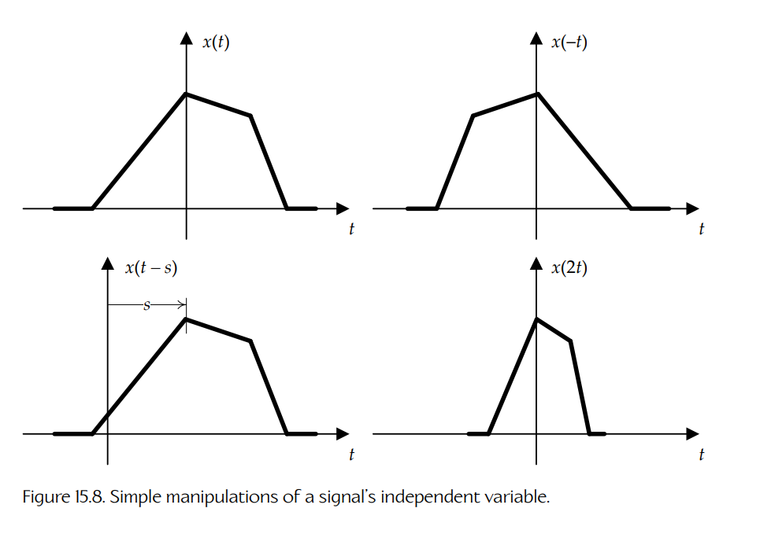

**Figure 15.8.** 对信号自变量进行的简单操作。

### 15.2.3 线性时不变（LTI）系统

在信号处理理论的语境中，**系统**（system）被定义为任何能够把一个**输入**信号转换为一个新的**输出**信号的设备或过程。系统这一数学概念可以用于描述、分析和操作许多真实世界系统，这些系统出现在音频处理中，包括麦克风、扬声器、模数转换器、混响单元、均衡器、滤波器，甚至房间声学。

举一个简单例子，**放大器**（amplifier）是一种系统，它会将输入信号的振幅增大 $A$ 倍，其中 $A$ 称为放大器的**增益**（gain）。给定输入信号 $x(t)$，这样的放大系统会产生输出信号：

$$
y(t)=Ax(t).
$$

**时不变系统**（time-invariant system）是指：输入信号中的时间平移会导致输出信号发生等量的时间平移。换句话说，系统的行为不随时间变化。

**线性系统**（linear system）是指具有**叠加**（superposition）性质的系统。这意味着，如果输入信号由其他信号的**加权和**（weighted sum）组成，那么输出也会是各个输出的加权和；这些输出就是在每个其他信号分别独立输入系统时本应产生的结果。

**线性时不变**（linear time-invariant，LTI）系统之所以极其有用，有两个原因。第一，它们的行为已经被充分理解，并且在数学上相对容易处理。第二，许多真实物理系统，如音频传播理论、电子学、力学、流体流动等领域中的系统，都可以用 LTI 系统相当准确地建模。因此，为了理解音频技术，本文将把讨论范围限制在 LTI 系统上。

我们可以把任何系统可视化为一个具有输入信号和输出信号的黑盒，如 Figure 15.9 所示。

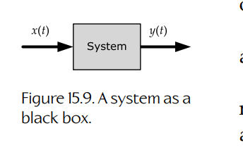

**Figure 15.9.** 作为黑盒的系统。

使用这种黑盒记号，简单系统可以方便地相互连接，从而构造出更复杂的系统。例如：

- 系统 A 的输出可以连接到系统 B 的输入，得到一个先执行操作 A、再执行操作 B 的复合系统。这称为**串联连接**（serial connection）。
- 两个系统的输出可以相加。
- 一个系统的输出可以被**反馈**到更早的输入中，从而得到所谓的**反馈环**（feedback loop）。

Figure 15.10 展示了所有这些连接方式的例子。

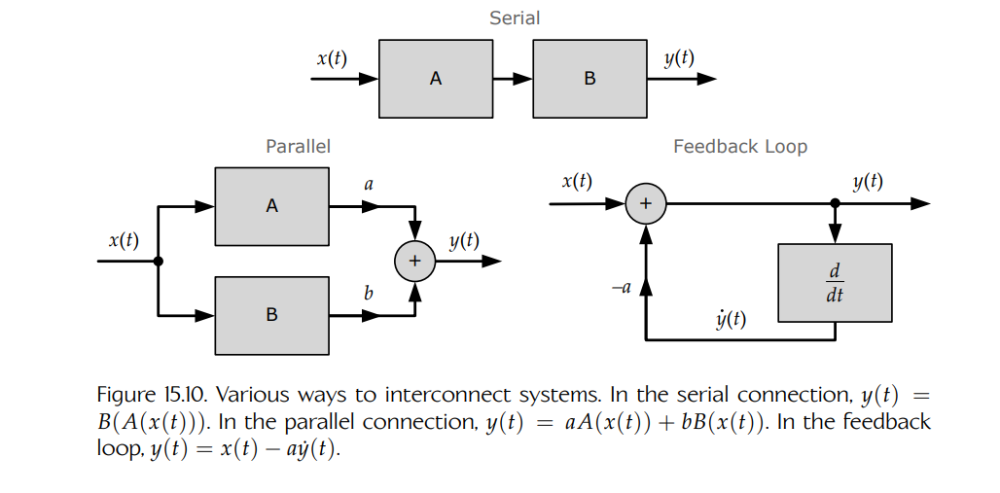

**Figure 15.10.** 系统之间的几种连接方式。在串联连接中，$y(t)=B(A(x(t)))$。在并联连接中，$y(t)=aA(x(t))+bB(x(t))$。在反馈环中，$y(t)=x(t)-a\dot{y}(t)$。

所有 LTI 系统都有一个非常重要的性质：它们的相互连接是**与顺序无关的**（order-independent）。因此，如果我们有一个系统 A 后接系统 B 的串联连接，那么可以反转两个系统的顺序，而输出仍然保持不变。

### 15.2.4 LTI 系统的冲激响应

讨论把输入信号转换为输出信号的系统当然很好，而且绘制系统连接图也相当直观。但是，我们如何用数学方式描述一个系统的运作呢？

回忆 Section 15.2.3，对于**线性系统**而言，如果输入由输入信号的线性组合（加权和）组成，那么输出也会是各个输出的线性组合（加权和），前提是每个输入信号都曾分别独立输入该系统。因此，如果我们能够找到一种方式，把任意输入信号表示为若干非常简单的信号的加权和，那么只需要描述系统对这些非常简单信号的响应，就应该能够描述整个系统的行为。

#### 15.2.4.1 单位冲激

如果要把一个输入信号描述为若干简单信号的线性组合，那么问题来了：应该使用哪种简单信号？出于稍后会变得清楚的原因，我们选择的信号将是**单位冲激**（unit impulse）。这个信号属于一组相关函数，这组函数称为**奇异函数**（singularity functions），因为它们都至少包含一个不连续点或“奇异点”。

在离散时间中，单位冲激 $\delta[n]$ 再简单不过：它是一个除了 $n=0$ 处取值为 1 之外，其他所有位置都取值为 0 的信号：

$$
\delta[n]=
\begin{cases}
1 & \text{if } n=0,\\
0 & \text{otherwise.}
\end{cases}
$$

离散时间单位冲激如 Figure 15.11 所示。

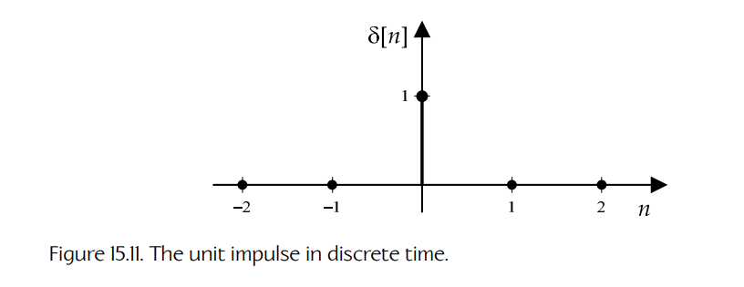

**Figure 15.11.** 离散时间中的单位冲激。

在连续时间中，单位冲激 $\delta(t)$ 的定义稍微棘手一些。它是一个除了 $t=0$ 之外处处为零的函数，在 $t=0$ 处其值为无穷大——但曲线下方的**面积**等于 1。

为了理解这种奇特函数如何形式化定义，可以想象一个“盒子”函数 $b(t)$，它在区间 $[0,T)$ 之外处处为零，而在该区间内取值为 $1/T$。这条曲线下方的面积就是盒子的面积，即宽度乘以高度：

$$
T\times \frac{1}{T}=1.
$$

现在设想取极限 $T\to 0$。当这种情况发生时，盒子的宽度趋近于 0，高度趋近于无穷大，但面积仍然等于 1。这如 Figure 15.12 所示。

单位冲激函数通常用符号 $\delta(t)$ 表示。它可以形式化定义如下：

$$
\delta(t)=\lim_{T\to 0} b(t),
$$

其中：

$$
b(t)=
\begin{cases}
1/T & \text{if } t\ge 0 \text{ and } t<T,\\
0 & \text{otherwise.}
\end{cases}
$$

如 Figure 15.13 所示，我们通常通过绘制一个箭头来表示单位冲激，箭头高度表示曲线下方的面积（因为该函数在 $t=0$ 处的实际“高度”为无穷大）。

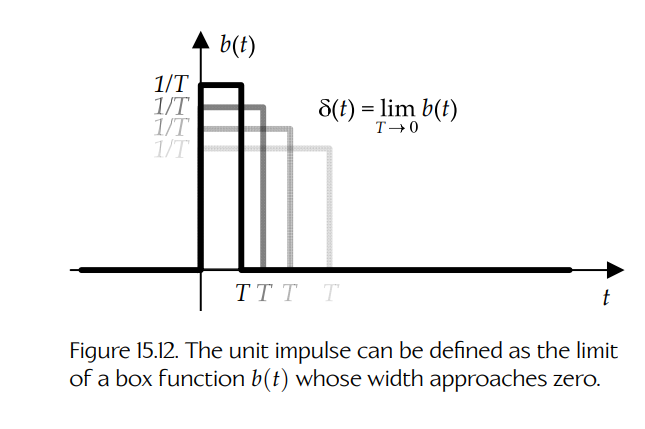

**Figure 15.12.** 单位冲激可以定义为盒子函数 $b(t)$ 在宽度趋近于零时的极限。

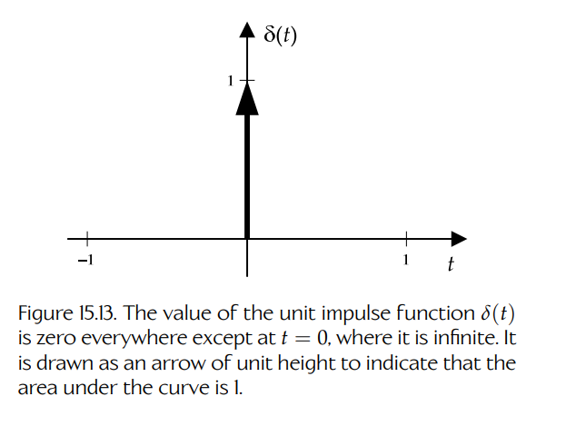

**Figure 15.13.** 单位冲激函数 $\delta(t)$ 除了在 $t=0$ 处为无穷大之外，处处为零。它被画成单位高度的箭头，用于表示曲线下方的面积为 1。

#### 15.2.4.2 使用冲激列表示信号

现在我们已经知道什么是单位冲激信号，接下来看看是否可以把任意信号 $x[n]$ 描述为单位冲激的线性组合。（剧透：结果是可以。）

函数 $\delta[n-k]$ 是经过时间平移的离散单位冲激，它除了在时间 $n=k$ 处取值为 1 之外，其他地方都为零。换句话说，单位冲激 $\delta[n-k]$ 被“放置”在时间 $k$ 处。考虑一个特定的 $x$ 值，比如 $k=3$。我们要确保该冲激的“高度”与原函数在 $k=3$ 处的值匹配，因此将冲激按 $x[3]$ 缩放，得到 $x[3]\delta[n-3]$。如果对所有可能的 $k$ 值重复这一过程，就会得到形式为 $x[k]\delta[n-k]$ 的冲激列。把所有这些经过缩放和时间平移的冲激函数相加，就只是原始信号 $x[n]$ 的另一种写法：

$$
x[n]=\sum_{k=-\infty}^{+\infty}x[k]\delta[n-k].
\tag{15.4}
$$

这里不做严格证明，但在连续时间中，这种方式的工作原理大致相同，这一点并不难相信。唯一的区别是，对于连续时间而言，式（15.4）中的求和会变成积分。设想一个无限序列的时间平移单位冲激 $\delta(t-\tau)$，其中每一个都位于不同的时间 $\tau$。我们可以用类似于离散时间情形的方式构造任意信号 $x(t)$：

$$
x(t)=\int_{\tau=-\infty}^{+\infty}x(\tau)\delta(t-\tau)\,d\tau.
\tag{15.5}
$$

#### 15.2.4.3 卷积

式（15.4）告诉我们如何把信号 $x[n]$ 表示为简单的、经过时间平移的单位冲激信号 $\delta[n-k]$ 的**线性组合**。让我们想象只把这些加权冲激输入中的**一个**（$x[k]\delta[n-k]$）送入系统。选择哪一个都无关紧要，因此我们选择 $k=0$ 的那个。这会得到输入信号 $x[0]\delta[n]$。

我们使用记号 $x[n]\Longrightarrow y[n]$ 来表示输入信号 $x[n]$ 正被一个 LTI 系统转换为输出信号 $y[n]$。因此可以写成：

$$
x[0]\delta[n]\Longrightarrow y[n].
$$

$x[0]$ 的值只是一个常数，所以由于我们处理的是线性系统，输出 $y[n]$ 也只会是同一个常数乘以系统对单位冲激 $\delta[n]$ 的响应。我们使用信号 $h[n]$ 来表示系统对一个“裸”的单位冲激的响应：

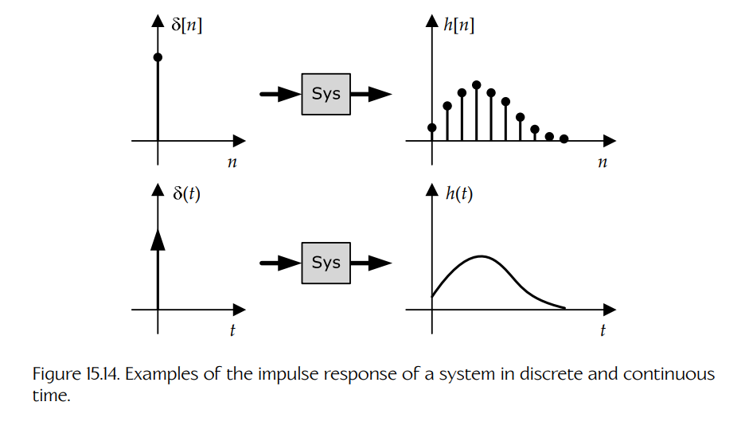

**Figure 15.14.** 系统在离散时间和连续时间中的冲激响应示例。

$$
\delta[n]\Longrightarrow h[n].
$$

信号 $h[n]$ 称为该系统的**冲激响应**（impulse response）。因此，我们可以把系统对这个简单输入信号的响应写成：

$$
x[0]\delta[n]\Longrightarrow x[0]h[n].
$$

冲激响应的概念如 Figure 15.14 所示。

LTI 系统对经过时间平移的单位冲激的响应，只是经过同样时间平移的冲激响应：

$$
\delta[n-k]\Longrightarrow h[n-k].
$$

因此对于非零的 $k$ 值，所有内容都以完全相同的方式成立，只不过此时输入和输出信号都被时间平移了 $k$：

$$
x[k]\delta[n-k]\Longrightarrow x[k]h[n-k].
$$

为了求出系统对整个输入信号 $x[n]$ 的响应，只需把对每一个单独时间平移分量的响应相加，如下所示：

$$
\sum_{k=-\infty}^{+\infty}x[k]\delta[n-k]
\Longrightarrow
\sum_{k=-\infty}^{+\infty}x[k]h[n-k].
$$

换句话说，我们系统的输出可以写成：

$$
y[n]=\sum_{k=-\infty}^{+\infty}x[k]h[n-k].
\tag{15.6}
$$

这个非常重要的方程称为**卷积和**（convolution sum）。为了表示卷积运算，引入一个新的数学运算符 $*$ 会很方便：

$$
x[n]*h[n]=\sum_{k=-\infty}^{+\infty}x[k]h[n-k].
\tag{15.7}
$$

式（15.6）和式（15.7）给出了一种方法：只要知道 LTI 系统的**冲激响应** $h[n]$，就能计算该系统对任意输入信号 $x[n]$ 的响应 $y[n]$。换句话说，对于 LTI 系统而言，冲激响应信号 $h[n]$ **完全描述了该系统**。相当酷。

**连续时间中的卷积。**

在前面的讨论中，为了让事情保持简单，我们一直在离散时间中工作。在连续时间中，一切以大致相同的方式成立。唯一的区别是求和会变成积分，并且需要记得在方程中包含微分项 $d\tau$。

当我们把任意信号 $x(t)$ 施加到连续时间 LTI 系统的输入端时，输出信号可以写成：

$$
y(t)=\int_{\tau=-\infty}^{+\infty}x(\tau)h(t-\tau)\,d\tau.
\tag{15.8}
$$

和之前一样，我们使用运算符 $*$ 作为卷积的简写：

$$
x(t)*h(t)=\int_{\tau=-\infty}^{+\infty}x(\tau)h(t-\tau)\,d\tau.
\tag{15.9}
$$

类似于卷积和，式（15.8）和式（15.9）中的积分称为**卷积积分**（convolution integral）。

#### 15.2.4.4 卷积的可视化

让我们尝试在连续时间情形下可视化卷积运算。为了求某个特定 $t$ 值（例如 $t=4$）处的：

$$
y(t)=x(t)*h(t),
$$

我们需要执行以下步骤，如 Figure 15.15 所示：

1. 绘制 $x(\tau)$，使用 $\tau$ 作为时间变量，因为 $t$ 是固定的（在这个例子中 $t=4$）。
2. 绘制 $h(t-\tau)$。可以把它重写为 $h(-\tau+t)$。由于 $\tau$ 被取负，我们知道冲激响应已经围绕 $\tau=0$ 翻转。并且由于我们给自变量加上了 $t$，因此知道该信号已向**左**平移了 $t=4$ 个单位。
3. 在整个 $\tau$ 轴上把两个信号相乘。
4. 沿 $\tau$ 轴从 $-\infty$ 到 $+\infty$ 积分，以求出所得曲线下方的面积。这就是 $y(t)$ 在这个特定 $t$ 值处的值（本例中为 $t=4$）。

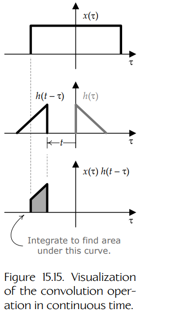

**Figure 15.15.** 连续时间中卷积运算的可视化。

请记住，为了确定完整的输出信号 $y(t)$，必须对每一个可能的 $t$ 值重复这一过程。

#### 15.2.4.5 卷积的一些性质

卷积运算的性质与普通乘法出人意料地相似。卷积满足：

- **交换律**：$x(t)*h(t)=h(t)*x(t)$；
- **结合律**：$x(t)*(h_1(t)*h_2(t))=(x(t)*h_1(t))*h_2(t)$；
- **分配律**：$x(t)*(h_1(t)+h_2(t))=(x(t)*h_1(t))+(x(t)*h_2(t))$。

### 15.2.5 频域与傅里叶变换

为了引出冲激响应和卷积的概念，我们把信号描述为单位冲激的加权和。我们也可以把信号表示为正弦波的加权和。以这种方式表示信号，本质上就是把信号分解为其**频率分量**（frequency components）。这将使我们能够推导出另一个极其强大的数学工具——**傅里叶变换**（Fourier transform）。

#### 15.2.5.1 正弦信号

当二维圆周运动投影到单一轴上时，会产生**正弦信号**（sinusoidal signal）。正弦形式的音频信号会在某个特定频率上产生一个“纯净”的音调。

最基本的正弦信号就是正弦（或余弦）函数。信号 $x(t)=\sin t$ 在 $t=0$、$\pi$ 和 $2\pi$ 处取值为 0，在 $t=\frac{\pi}{2}$ 处取值为 1，在 $t=\frac{3\pi}{2}$ 处取值为 $-1$。

实值正弦信号的最一般形式为：

$$
x(t)=A\cos(\omega_0t+\phi).
\tag{15.10}
$$

这里，$A$ 表示正弦波的**振幅**（amplitude）（即余弦波的波峰和波谷分别达到最大值 $A$ 和最小值 $-A$）。**角频率**为 $\omega_0$，以弧度/秒为单位（关于频率和角频率的讨论见 Section 15.1.1）。$\phi$ 表示**相位偏移**（phase offset，同样以弧度为单位），它会使余弦波沿时间轴向左或向右移动。

当 $A=1$、$\omega_0=1$ 且 $\phi=0$ 时，式（15.10）化简为：

$$
x(t)=\cos t.
$$

当 $\phi=\frac{\pi}{2}$ 时，表达式变为：

$$
x(t)=\sin t.
$$

余弦函数表示圆周运动在水平轴上的投影，而正弦函数表示它在垂直轴上的投影。

#### 15.2.5.2 复指数信号

余弦函数实际上并不是把信号表示为正弦波之和的最佳工具。如果改用**复数**（complex numbers），数学会更简单、更优雅。为了理解其原理，我们需要回顾复数数学，并看看复数乘法的运作方式。请稍微耐心一点——到最后一切都会清楚。

**复数简要回顾。**

你可能还记得高中数学课中讲过，复数是一种二维量，由一个实部和一个虚部组成。任意复数都可以写成：

$$
c=a+jb,
$$

其中 $a$ 和 $b$ 是实数，$j=\sqrt{-1}$ 是**虚数单位**（imaginary unit）。$c$ 的实部是：

$$
a=\Re(c),
$$

虚部是：

$$
b=\Im(c).
$$

可以把复数可视化为复平面中的一种“向量” $[a,b]$，这个二维空间称为 **Argand 平面**。不过需要记住，复数和向量并不能互换——它们的数学行为相当不同。

我们把复数的**模长**（magnitude）定义为它在复平面中二维“向量”表示的长度：

$$
|c|=\sqrt{a^2+b^2}.
$$

该向量与实轴形成的角称为复数的**辐角**（argument）：

$$
\arg c=\tan^{-1}(b/a).
$$

复数的辐角有时也称为它的**相位**（phase）。正如稍后会看到的，“相位”这一术语与式（15.10）中的相位偏移 $\phi$ 密切相关。复数的模长和辐角如 Figure 15.16 所示。

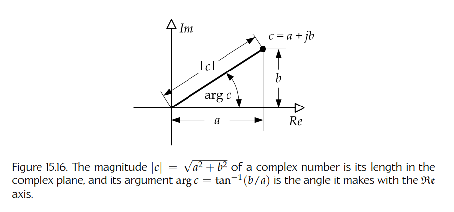

**Figure 15.16.** 复数的模长 $|c|=\sqrt{a^2+b^2}$ 是它在复平面中的长度，而它的辐角 $\arg c=\tan^{-1}(b/a)$ 是它与 $\Re$ 轴形成的角。

**复数乘法与旋转。**

这里不会讨论复数的全部性质。关于复数理论的深入讨论，可参见 [346]。不过，有一种数学运算与本文有关：**复数乘法**（complex multiplication）。

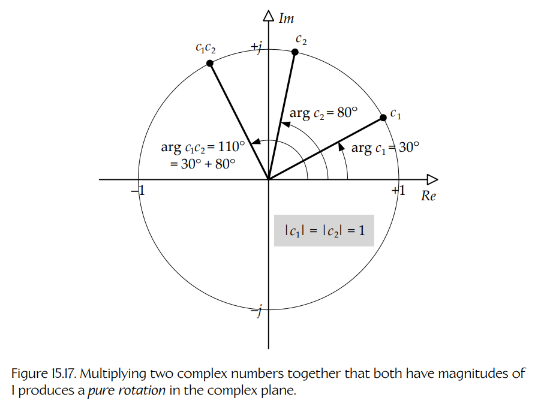

**Figure 15.17.** 将两个模长都为 1 的复数相乘，会在复平面中产生纯旋转。

复数通过代数方式相乘（这里没有点积或叉积）：

$$
c_1c_2=(a_1+jb_1)(a_2+jb_2)
$$

$$
=(a_1a_2)+j(a_1b_2+a_2b_1)+j^2b_1b_2
$$

$$
=(a_1a_2-b_1b_2)+j(a_1b_2+a_2b_1).
\tag{15.11}
$$

如果你计算一下2乘积 $c_1c_2$ 的模长和辐角（角度），就会发现其模长等于两个输入模长的乘积，而辐角等于两个输入辐角的和：

$$
|c_1c_2|=|c_1||c_2|;
$$

$$
\arg(c_1c_2)=\arg c_1+\arg c_2.
\tag{15.12}
$$

> **脚注 2**：哎呀——这听起来太像留给读者的练习了……

复数乘法会使角度（辐角）相加，这一事实意味着复数乘法会在复平面中产生**旋转**。如果 $c_1$ 的模长为单位长度（$|c_1|=1$），那么乘积的模长将等于 $c_2$ 的模长（$|c_1c_2|=|c_2|$）。在这种情况下，该乘积表示将 $c_2$ 纯旋转一个等于 $\arg c_1$ 的角度（见 Figure 15.17）。如果 $|c_1|\neq 1$，那么乘积的模长将被 $|c_1|$ 缩放，结果是 $c_2$ 在复平面中经历一种螺旋运动。

这解释了为什么单位长度四元数能够在 3D 空间中作为旋转来运作！四元数本质上是一种四维复数，拥有一个实部和三个虚部。因此，四元数在三维中遵循的基本规则，与普通复数在二维中遵循的规则相同。

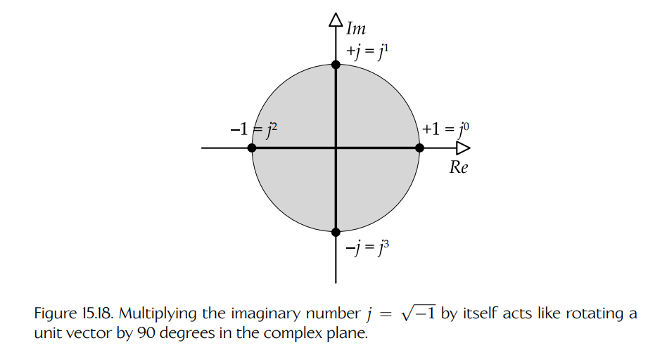

**Figure 15.18.** 将虚数 $j=\sqrt{-1}$ 与自身相乘，其效果类似于在复平面中将单位向量旋转 90 度。

复数乘法会产生旋转，这一点在考虑反复把 $j$ 乘以自身时就很有道理：

$$
1\times j=j,
$$

$$
j\times j=\sqrt{-1}\sqrt{-1}=-1,
$$

$$
-1\times j=-j,
$$

$$
-j\times j=1,
$$

$$
\cdots
$$

因此，将 $j$ 与自身相乘，就像是在复平面中把一个单位向量旋转 90 度。事实上，将**任意**复数乘以 $j$，都会产生将其旋转 90 度的效果。这如 Figure 15.18 所示。

**复指数与欧拉公式。**

对于任意满足 $|c|=1$ 的复数 $c$，函数 $f(n)=c^n$（其中 $n$ 依次取递增的正实数值）会在复平面中描绘出一条**圆形路径**（circular path）。二维中的任何圆形路径，沿垂直轴会描绘出一条正弦曲线，沿水平轴则会描绘出一条相应的余弦曲线。这如 Figure 15.19 所示。

把**复数提升到实数次幂**（$c^n$）会在复平面中产生旋转，因此投影到平面中的任意轴上时都会得到正弦波。事实证明，我们也可以通过把**实数提升到复数次幂**（$n^c$）来得到这种旋转效果。这意味着可以把式（15.10）用复数写成：

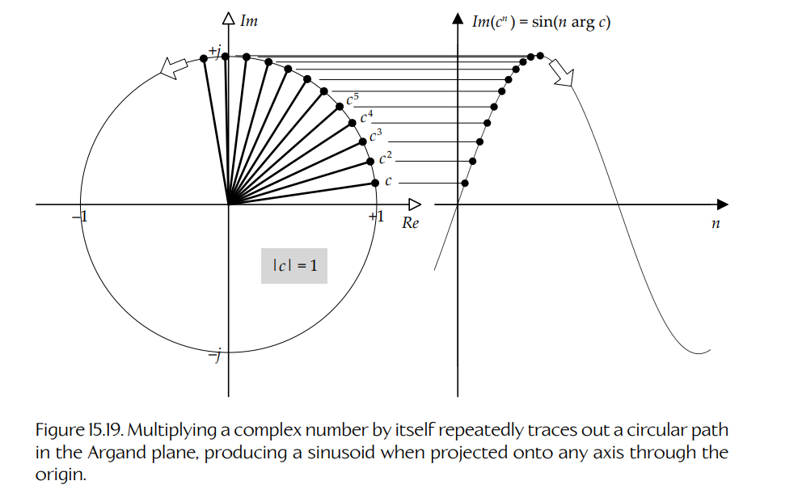

**Figure 15.19.** 反复将一个复数与自身相乘，会在 Argand 平面中描绘一条圆形路径；当投影到任意经过原点的轴上时，会产生正弦波。

$$
e^{j\omega_0t}=\cos\omega_0t+j\sin\omega_0t,\quad t\in\mathbb{R};
\tag{15.13}
$$

$$
\Re\left[e^{j\omega_0t}\right]=\cos\omega_0t;
$$

$$
\Im\left[e^{j\omega_0t}\right]=\sin\omega_0t,
$$

其中 $e\approx 2.71828$ 是定义自然对数函数底数的实超越数。

式（15.13）是整个数学中最重要的方程之一。它被称为**欧拉公式**（Euler’s formula）。为什么它成立有些神秘（甚至对一些经验丰富的数学家来说也是如此）。该定理可以通过观察 $e^{jt}$ 的泰勒级数展开来解释，或者通过考虑 $e^x$ 的导数并允许 $x$ 变成复数来解释。不过对于本文目的来说，依靠我们从复数乘法如何在复平面中产生旋转所得到的直觉，已经足够了。

#### 15.2.5.3 傅里叶级数

现在我们已经拥有了把正弦波表示为复数所需的数学工具，可以重新关注用正弦波之和表示信号这一任务。

当信号是**周期性的**（periodic）时，这样做最容易。在这种情况下，可以把信号写成一组**谐波相关**（harmonically related）的正弦波之和：

$$
x(t)=\sum_{k=-\infty}^{+\infty}a_ke^{j(k\omega_0)t}.
\tag{15.14}
$$

这称为信号的**傅里叶级数**（Fourier series）表示。这里，复指数函数 $e^{j(k\omega_0)t}$ 是构成信号的正弦分量。这些分量是谐波相关的，因为每一个分量的频率都是所谓**基频**（fundamental frequency）$\omega_0$ 的整数倍 $k$。系数 $a_k$ 表示信号 $x(t)$ 中每个谐波所占的“数量”。

#### 15.2.5.4 傅里叶变换

对这一主题的完整解释超出了本书范围，但就本文目的而言，只需说明一点即可（不提供任何证明！）：任何行为足够良好的信号3，甚至包括**非周期**（non-periodic）信号，都可以表示为正弦波的线性组合。一般而言，任意信号可能包含**任意**频率的分量，而不只是谐波相关的频率。因此，式（15.14）中离散的一组谐波系数 $a_k$ 会变成一个连续值集合，用于表示信号中“有多少”每一种频率。

> **脚注 3**：所有满足所谓 Dirichlet 条件的信号都具有傅里叶变换，因此就本文目的而言都是“行为足够良好”的。

我们可以设想一个新函数 $X(\omega)$，它的自变量是频率 $\omega$ 而不是时间 $t$，它的值表示原始信号 $x(t)$ 中每个频率所占的数量。我们称 $x(t)$ 为信号的**时域**（time domain）表示，而 $X(\omega)$ 是它的**频域**（frequency domain）表示。

在数学上，可以使用**傅里叶变换**（Fourier transform）从信号的时域表示找到其频域表示，也可以反过来：

$$
X(\omega)=\int_{-\infty}^{+\infty}x(t)e^{-j\omega t}\,dt;
\tag{15.15}
$$

$$
x(t)=\frac{1}{2\pi}\int_{-\infty}^{+\infty}X(\omega)e^{j\omega t}\,d\omega.
\tag{15.16}
$$

如果把式（15.16）与式（15.14）中的傅里叶级数进行比较，就可以看到它们的相似之处。我们现在不再通过离散的一组系数 $a_k$ 来描述各个频率分量的“数量”，而是用连续函数 $X(\omega)$ 来描述它们。但在两种情况下，我们都在把 $x(t)$ 表示为正弦波的“和”。

#### 15.2.5.5 伯德图

一般而言，实值信号的傅里叶变换是一个**复值信号**（$X(\omega)\in\mathbb{C}$）。在可视化傅里叶变换时，通常使用两张图来绘制。例如，可以绘制其实部和虚部。或者，也可以在两张不同的图上绘制它的模长和辐角（角度）——这种可视化称为 **Bode plot**（发音为“Boh-dee”，伯德图）。Figure 15.20 展示了一个信号及其伯德图示例。

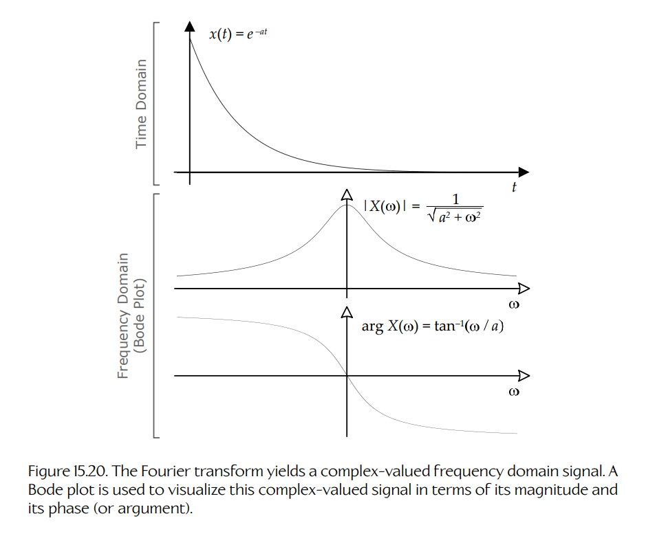

**Figure 15.20.** 傅里叶变换会得到一个复值频域信号。伯德图用于从模长和相位（或辐角）两个方面可视化该复值信号。

#### 15.2.5.6 快速傅里叶变换（FFT）

存在一组快速算法，可用于在离散时间中计算傅里叶变换。这一系列算法被恰当地称为**快速傅里叶变换**（fast Fourier transform，FFT）。关于 FFT 的更多信息，可参见 [347]。

#### 15.2.5.7 傅里叶变换与卷积

有趣的是，时域中的卷积对应于频域中的乘法，反之亦然。给定一个冲激响应为 $h(t)$ 的系统，我们知道可以按如下方式求得该系统对输入 $x(t)$ 的输出 $y(t)$：

$$
y(t)=x(t)*h(t).
$$

在频域中，给定冲激响应的傅里叶变换 $H(\omega)$ 和输入的傅里叶变换 $X(\omega)$，可以按如下方式求得输出的傅里叶变换：

$$
Y(\omega)=X(\omega)H(\omega).
$$

这个结果相当惊人，也非常方便。有时，使用系统的冲激响应 $h(t)$ 在时间轴上执行卷积更方便；而在另一些时候，使用系统的**频率响应**（frequency response）$H(\omega)$ 在频域中执行乘法会更方便。

事实证明，LTI 系统具有一种称为**对偶性**（duality）的性质，它意味着可以反转时间和频率的角色，而几乎同样的数学规则仍然适用。例如，可以通过观察两个信号的傅里叶变换在频率轴上卷积时会发生什么，来理解**信号调制**（signal modulation，即一个信号乘以另一个信号）在时域中是如何工作的。有两种解决问题的方法总比一种好！

#### 15.2.5.8 滤波

傅里叶变换使我们能够可视化几乎任意音频信号所包含的一组频率。**滤波器**（filter）是一种 LTI 系统，它会衰减某一选定范围的输入频率，同时保持其他所有频率不变。**低通滤波器**（low-pass filter）保留低频并衰减高频。**高通滤波器**（high-pass filter）则相反，保留高频并衰减低频。**带通滤波器**（band-pass filter）会同时衰减低频和高频，但保留有限**通带**（passband）内的频率。**陷波滤波器**（notch filter）则相反，它保留低频和高频，但衰减有限**阻带**（stopband）内的频率。

滤波器用于立体声音响系统的**均衡器**（equalizer，EQ）中，通过根据用户输入衰减或增强特定频率来工作。如果噪声信号和期望信号的频谱占据频率轴上的不同区域，滤波器也可用于衰减噪声。例如，如果一个高频噪声信号对较低频率的人声或音乐信号产生不良影响，那么可以使用低通滤波器来消除该噪声。

理想滤波器的频率响应 $H(\omega)$ 看起来像一个矩形盒，在通带中取值为 1，在阻带中取值为 0。当它与输入信号的傅里叶变换 $X(\omega)$ 相乘时，输出 $Y(\omega)=X(\omega)H(\omega)$ 的通带频率会被精确保留，而阻带频率全部被置为 0。理想滤波器的频率响应如 Figure 15.21 所示。

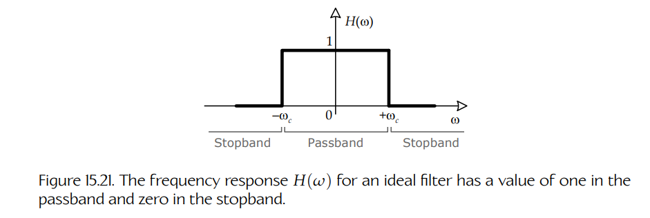

**Figure 15.21.** 理想滤波器的频率响应 $H(\omega)$ 在通带中取值为 1，在阻带中取值为 0。

当然，能够完全通过某些频率并完全抑制其他频率的理想滤波器未必总是理想选择。大多数真实世界滤波器的频率响应在通带和阻带之间都有一个逐渐衰减的过渡区。当期望频率和不需要的频率之间没有单一、清晰的分界线时，这种特性有助于进行滤波。具有渐进衰减的低通滤波器频率响应如 Figure 15.22 所示。

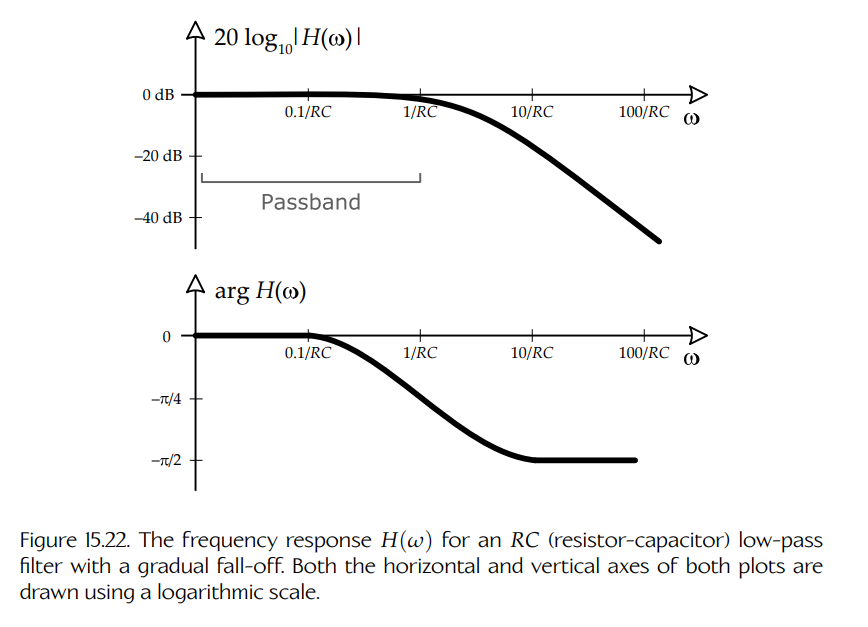

**Figure 15.22.** 具有渐进衰减特性的 RC（电阻-电容）低通滤波器的频率响应 $H(\omega)$。两幅图的水平轴和垂直轴都使用对数刻度绘制。

大多数高保真音频设备上的**均衡器**（EQ）允许用户调整输出中的低音、中频和高音量。EQ 实际上只是一组调谐到不同频率范围并串联应用于音频信号的滤波器。

滤波理论是一个极其庞大的研究领域，因此这里不可能充分展开。更多信息可参见 [45] 的第 6 章。
