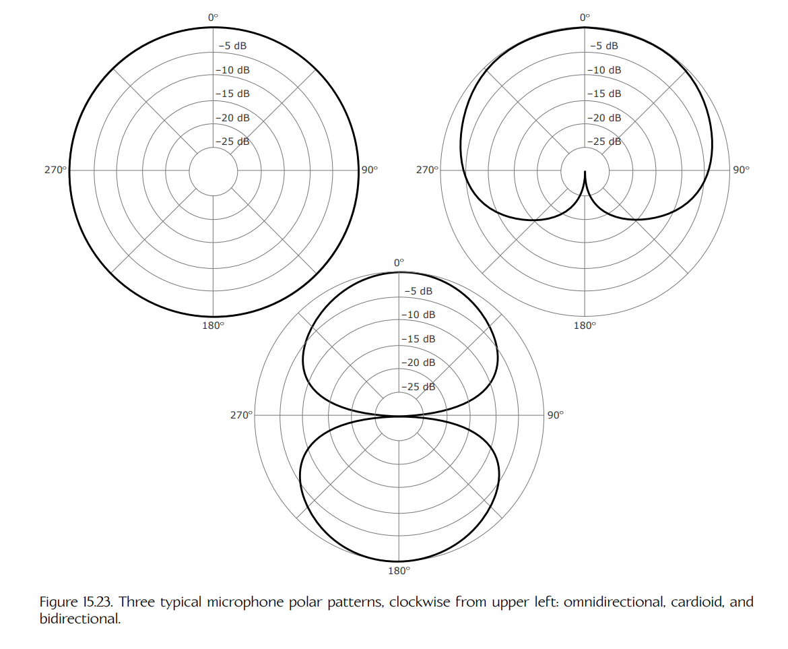
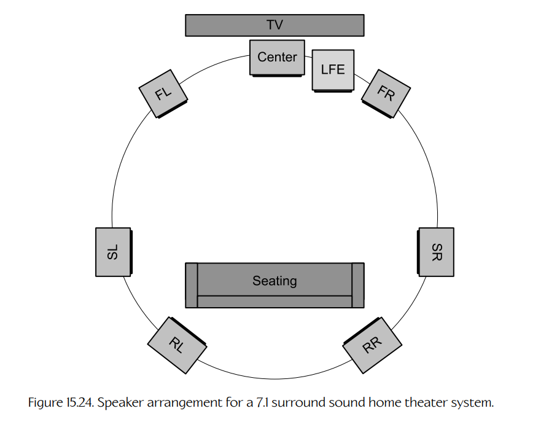
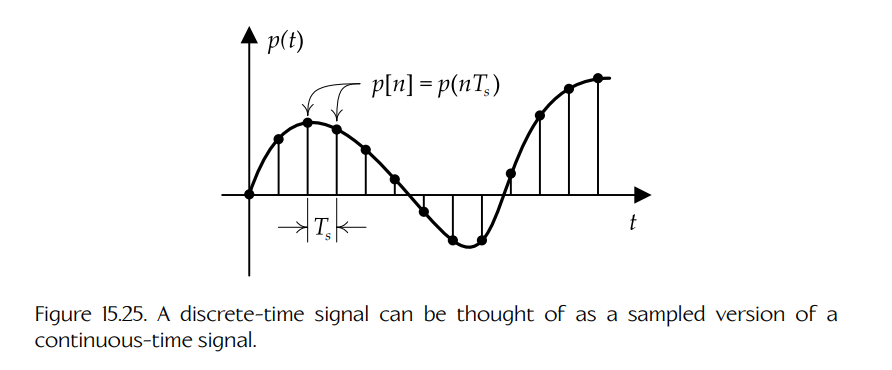
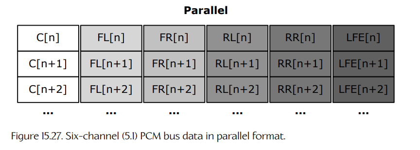
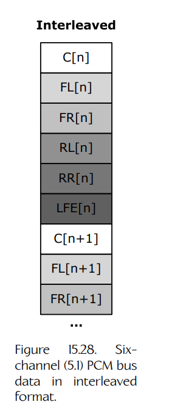

## 15.3 声音技术

在能够充分理解构成游戏音频引擎的软件之前，我们需要牢固掌握音频硬件与技术，以及行业专业人士用于描述它们的术语。

### 15.3.1 模拟音频技术

最早的音频硬件基于模拟电子技术。这是记录、操作和播放音频压缩波最容易的方式，因为声音本身就是一种模拟物理现象。在本节中，我们将简要介绍一些关键的模拟音频技术。

#### 15.3.1.1 麦克风

**麦克风**（microphone，也称为 “mic” 或 “mike”）是一种**换能器**（transducer），它能将音频压缩波转换为电子信号。麦克风使用各种技术，将声波的机械压力变化转换为等效的、基于电压变化的信号。**动圈麦克风**（dynamic microphone）使用电磁感应，而**电容麦克风**（condenser microphone）利用电容变化。其他类型的麦克风则利用压电发电或光调制来产生电压信号。

不同麦克风具有不同的灵敏度模式，称为**指向性图案**（polar patterns）。这些图案描述了麦克风对于其中心轴周围不同角度声音的敏感程度。**全向麦克风**（omnidirectional mic）在所有方向上同样敏感。**双向麦克风**（bidirectional mic）具有两个呈 8 字形的灵敏度“瓣”。**心形麦克风**（cardioid mic）基本上具有单向灵敏度轮廓，因其某种心形图案而得名。几种常见的麦克风指向性图案如 Figure 15.23 所示。

**Figure 15.23.** 三种典型的麦克风指向性图案，从左上角顺时针依次为：全向、心形和双向。

#### 15.3.1.2 扬声器

**扬声器**（speaker）基本上就是反向工作的麦克风——它是一种换能器，可以将变化的输入电压信号转换为膜片中的振动，进而产生空气压力变化，最终形成声压波。

#### 15.3.1.3 扬声器布局：立体声

声音系统通常支持多个扬声器输出通道。诸如 iPod、车载音响或你祖父的便携式 “boom box” 这样的立体声设备，至少支持左右两个立体声通道的扬声器。一些高保真立体声系统还会配备另外两个“高音扬声器”（tweeters）——它们是能够再现左右通道中最高频声音的小型扬声器。这使两个主扬声器可以做得更大，从而更好地覆盖低音。一些立体声系统还支持一个低音炮或 LFE（low-frequency effects，低频效果）扬声器。这类系统有时称为 2.1 系统——“2” 表示左右两个声道，“.1” 表示 LFE 扬声器。

**耳机与扬声器。**

区分开放房间中的立体声扬声器和立体声耳机很重要。房间中的立体声扬声器通常位于听者前方，并分别偏向左右两侧。这意味着来自**左**扬声器的声波实际上也会被**右**耳接收到，反之亦然。来自较远扬声器的声波会以轻微的时间延迟（相位偏移）和轻微衰减到达耳朵。来自较远扬声器的相位偏移声波往往会与来自较近扬声器的声波发生**干涉**。为了产生最高质量的声音，声音系统应将这种干涉纳入考虑。

另一方面，耳机直接接触耳朵，因此左右声道被完全隔离，不会相互干涉。此外，由于耳机几乎直接把声音传入耳道，因此耳朵自身形状所带来的头相关传递效应（HRTF）不会起作用（见 Section 15.1.4），这意味着听者获得的空间信息会相对少一些。

#### 15.3.1.4 扬声器布局：环绕声

家庭影院的**环绕声**（surround sound）系统通常有两种形式：5.1 和 7.1。你无疑已经猜到，这些数字表示五个或七个“主”扬声器，再加上一个低音炮。环绕声系统的目标是通过提供**位置信息**以及高保真声音再现，使听者沉浸在一个真实的声景中（见 Section 15.1.4）。5.1 系统中的主扬声器通道包括：中置、左前、右前、左后和右后。7.1 系统额外增加两个扬声器，即左环绕和右环绕，它们通常被放置在听者两侧。Dolby Digital AC-3 和 DTS 是两种流行的环绕声技术。典型 7.1 家庭影院的扬声器布局如 Figure 15.24 所示。

**Figure 15.24.** 7.1 环绕声家庭影院系统的扬声器布局。

Dolby Surround、Dolby Pro Logic 和 Dolby Pro Logic II 是将立体声源信号扩展为 5.1 环绕声的技术。立体声信号缺少直接驱动 5.1 扬声器配置所需的位置信息。但是，通过使用这些 Dolby 技术，可以利用原始立体声源信号中找到的各种线索，启发式地生成缺失位置信息的近似结果。

#### 15.3.1.5 模拟信号电平

音频电压信号可以以不同电压电平传输。麦克风通常产生低振幅电压信号，这些信号称为**麦克风电平**（mic-level）信号。在组件之间连接时，则使用较高电压的**线路电平**（line-level）信号。在线路电平电压方面，专业音频设备和消费级电子设备之间存在很大差异。专业设备通常设计为使用从标称信号的 2.191 V（伏特）峰峰值到最大 3.472 V 峰峰值的线路电平。消费级设备中“线路电平”信号的峰峰值电压变化很大，但多数消费设备的输出最高为 1.0 V 峰峰值，而输入能够处理最高 2.0 V 的信号。在连接音频设备时，匹配输入和输出信号电平很重要。传入的电压过高会导致设备无法处理，从而造成信号削波；而传入的电压过低，则会导致音频听起来比应有的更安静。

#### 15.3.1.6 放大器

麦克风产生的小电压必须经过**放大**（amplified），才能以足够的力驱动扬声器产生可听声波。**放大器**（amplifier）是一种模拟电子电路，它产生的输出几乎是输入信号的精确副本，但信号的**振幅**显著增加。放大器本质上会增加信号的**功率**内容。它通过从某种电源获取能量，并驱动该电源产生的增强电压，使其随时间模仿输入信号的行为。换句话说，放大器会**调制**其电源输出，使其匹配低得多的输入电压信号。

放大器背后的核心技术是**晶体管**（transistor）——这是一种著名而极其巧妙的装置，位于许多现代电子设备的核心，其巅峰成就就是计算机。晶体管利用半导体材料，在两个原本隔离、独立的电路之间建立电压关联。因此，低电压信号可以用来驱动一个较高电压的电路。这正是放大器所需要的机制。这里不会深入讨论晶体管和放大器在底层的工作方式。不过，如果你好奇，可以通过这个关于最早晶体管如何工作的优秀 YouTube 视频来了解：[348]。你也可以在这里阅读更多关于放大器电路的信息：[349]。

放大系统的增益 $A$ 被定义为输出功率 $P_{\text{out}}$ 与输入功率 $P_{\text{in}}$ 的比值。与声压级类似，增益通常以分贝为单位测量：

$$
A=10\log_{10}\left(\frac{P_{\text{out}}}{P_{\text{in}}}\right)\text{ dB}.
$$

#### 15.3.1.7 音量/增益控制

**音量控制**（volume control）基本上是一种反向放大器，也称为**衰减器**（attenuator）。它不是增加电信号的振幅，而是**降低**振幅，同时保持波形的所有其他方面不变。在家庭影院系统中，D/A 转换器会产生一个振幅非常小的电压信号。功率放大器会将该信号提升到最大“安全”输出功率；超过这个功率后，扬声器产生的声音就会开始削波和失真（甚至损坏硬件）。音量控制随后会衰减这个最大输出功率，以产生听者期望的音量。

音量控制比放大器简单得多。可以通过在放大器输出与扬声器之间的电路中引入一个可变电阻来构造它，该可变电阻也称为**电位器**（potentiometer）。当电阻处于最小值（为零或非常接近零）时，输入信号的振幅不会改变，会产生最大音量的声音。当电阻处于最大设置时，输入信号的振幅会被最大程度衰减，从而产生最小音量的声音。

如果你家里的立体声系统以分贝报告音量，你可能已经注意到这些值总是负数。这是因为音量控制正在衰减功率放大器的输出。音量表仍然像增益一样测量，但这里的“输入”功率是放大器的最大功率，而“输出”功率是用户选择的音量：

$$
A=10\log_{10}\left(\frac{P_{\text{volume}}}{P_{\text{max}}}\right)\text{ dB},
$$

只要 $P_{\text{volume}}<P_{\text{max}}$，该值就会是负数。

#### 15.3.1.8 模拟布线与连接器

模拟单声道音频电压信号可以由一对导线承载；立体声信号需要三根导线（两个通道加一个公共接地）。布线可以位于设备内部，此时通常称为**总线**（bus）。布线也可以位于设备外部，用于将不同设备连接起来。

外部布线通常通过两类方式连接到音频硬件：一种是直接“夹子”或螺丝柱连接器，这类连接器常见于高端扬声器；另一种是各种标准化连接器。例如 RCA 插孔、大型 TRS（tip/ring/sleeve，尖端/环/套筒）插孔（20 世纪初电话接线员使用的那种）、TRS 迷你插孔（见于 iPod、手机和大多数 PC 声卡）、带键插孔（最常见于高质量麦克风和功放）等等。

音频线材具有广泛的质量等级。线径更粗的线材电阻更低，因此可以在更远距离上传输信号，而不会产生不可接受的衰减。可选的屏蔽层有助于降低噪声。当然，在构造线材和连接器时选择哪种金属，也会影响布线质量。

### 15.3.2 数字音频技术

紧凑型光盘（CD）的出现，标志着音频行业转向数字音频存储与处理的一个转折点。数字技术开启了许多新的可能性：从缩小存储介质体积并提高容量，到使用强大的计算机硬件和软件以前所未有的方式合成和操作音频。如今，模拟音频存储设备已经成为过去式，而模拟音频信号通常只在必要时使用——即麦克风和扬声器处。

正如 Section 15.2.1.1 中所看到的，模拟音频技术与数字音频技术之间的区别，恰好对应于信号处理理论中**连续时间信号**与**离散时间信号**之间的区别。

#### 15.3.2.1 模数转换：脉冲编码调制

为了在数字系统（如计算机或游戏主机）中记录音频，模拟音频信号中随时间变化的电压必须首先转换为数字形式。**脉冲编码调制**（pulse-code modulation，PCM）是对采样模拟声音信号进行编码的标准方法，这样该信号就可以存储在计算机内存中、通过数字电话网络传输，或刻录到紧凑型光盘上。

在脉冲编码调制中，会以固定时间间隔进行电压测量。这些电压测量值可以以浮点格式存储，或者也可以被**量化**（quantized），使每个测量值都存储为具有固定比特数的整数（通常为 8、16、24 或 32 位）。随后，这一串测得的电压值会被存储到内存数组中，或写入长期存储介质。测量单个模拟电压并将其转换为量化数值形式的过程，称为**模数转换**（analog-to-digital conversion）或简称 **A/D 转换**。执行 A/D 转换通常需要专门硬件。当我们以固定时间间隔重复这一过程时，它称为**采样**（sampling）。执行 A/D 转换和/或采样的硬件或软件组件称为 **A/D 转换器**或 **ADC**。

用数学术语来说，给定连续时间音频信号 $p(t)$，我们构造其**采样版本** $p[n]$，使得对每个样本都有：

$$
p[n]=p(nT_s),
$$

其中 $n$ 是用于索引样本的非负整数，$T_s$ 是每个样本之间的时间间隔，称为**采样周期**（sampling period）。采样的基本原理如 Figure 15.25 所示。

**Figure 15.25.** 离散时间信号可以看作连续时间信号的采样版本。

PCM 采样得到的数字信号具有两个重要属性：

- **采样率**（sampling rate）。这是电压测量值（样本）被采集的频率。原则上，只要采样频率是原始信号中最高频率分量的**两倍**，模拟信号就可以被数字化记录而不损失任何保真度。这个有些惊人且极其有用的事实称为 **Shannon-Nyquist 采样定理**。正如 Section 15.1.2.2 所述，人类只能听到有限频带内的声音（从 20 Hz 到 20 kHz）。因此，人类感兴趣的所有音频信号都是**带限**（band-limited）的，并且可以使用略高于 40 kHz 的采样率忠实记录。（语音信号占据的频带更窄，从 300 Hz 到 3.4 kHz，因此数字电话系统只需 8 kHz 的采样频率即可。）
- **位深**（bit depth）。它描述用于表示每个量化电压测量值的比特数。**量化误差**（quantization error）是将测得的电压值四舍五入到最近量化值时引入的误差。在其他条件相同的情况下，更大的位深会带来更低的量化误差，因此产生质量更高的音频录制。16 位位深在未压缩音频数据格式中很常见。位深有时也称为**分辨率**（resolution）。

**Shannon-Nyquist 采样定理。**

**Shannon-Nyquist 采样定理**指出：如果一个**带限**连续时间信号（即其傅里叶变换在某个有限频带之外处处为零的信号）被采样并产生其离散时间对应信号，那么只要采样率足够高，原始连续时间信号就可以从离散信号中**精确**恢复出来。使这一关系成立的最小采样频率称为 **Nyquist 频率**（Nyquist frequency）。

$$
\omega_s > 2\omega_{\text{max}},
$$

其中：

$$
\omega_s = \frac{2\pi}{T_s}.
$$

显然，正是这个定理的存在，才使数字技术能够用于音频处理。没有它，数字音频就注定永远无法听起来像模拟音频一样好，计算机也不会在今天的高保真音频制作中扮演如此重要的角色。

这里不会深入讨论采样定理为何成立的所有细节。但我们可以通过意识到一点获得一些直觉：以固定空间间隔对信号进行采样，会导致其频谱（傅里叶变换）在频率轴上一次又一次地复制。采样频率越高，这些信号频谱副本之间的距离就越“分散”。因此，如果原始信号是带限的，并且采样频率足够高，就可以保证频谱副本之间距离足够远而不会相互重叠。发生这种情况时，可以通过一个低通滤波器精确恢复原始频谱，该滤波器会滤除除原始频谱之外的所有副本。然而，如果采样频率过低，频谱副本就会相互重叠。这称为**混叠**（aliasing），它会阻止我们精确恢复原始信号频谱。Figure 15.26 展示了发生混叠和未发生混叠的采样。

**Figure 15.26.** 带限信号的频谱除了有限频带内之外处处为零（上）。如果采样频率超过 Nyquist 频率，频谱副本不会重叠，原始信号可以被精确恢复（中）。如果采样频率过低，频谱副本会发生重叠，并产生混叠（下）。

#### 15.3.2.2 数模转换：解调

当数字声音信号需要播放时，需要执行一个与模数转换相反的过程。我们很合理地称其为**数模转换**（digital-to-analog conversion），简称 **D/A 转换**。它也称为**解调**（demodulation），因为它撤销了脉冲编码调制的效果。数模转换电路称为 **DAC**。

D/A 转换硬件会生成一个模拟电压，该电压对应于数字信号中的每个采样电压值，而数字信号在内存中表示为量化 PCM 值数组。如果我们以新的值周期性地驱动该硬件，其速率与 PCM 过程中样本被测量的速率相同，并且假设采样率按照 Shannon-Nyquist 采样定理足够高，那么所产生的模拟电压信号就应当与原始电压信号精确匹配。

从实践角度看，当用一系列离散电压电平来驱动模拟电压电路时，硬件在试图从一个电压电平快速变化到另一个电压电平时，常常会引入不需要的高频振荡。D/A 硬件通常包含低通或带通滤波器，用于移除这些不需要的振荡，从而确保准确再现原始模拟信号。关于滤波的更多信息，见 Section 15.2.5.8。

#### 15.3.2.3 数字音频格式与编解码器

有许多数据格式可用于在磁盘上存储 PCM 音频数据，或通过互联网传输它。每种格式都有自己的历史、优点和缺点。有些格式（如 AVI）实际上是“容器”格式，可以封装不止一种数据格式的数字音频信号。

一些音频格式以未压缩形式存储 PCM 数据。另一些则使用各种形式的数据压缩，以降低所需文件大小或传输带宽。有些压缩方案是**有损**（lossy）的，这意味着在压缩/解压缩过程中，原始信号的一部分保真度会丢失。另一些压缩方案是**无损**（lossless）的，这意味着原始 PCM 数据可以在一次压缩/解压缩往返之后被精确恢复。

下面来看一些最常见的音频数据格式。

- **无原始头部的 PCM**（raw header-less PCM）数据有时用于这样的场景：关于信号的元信息（如采样率和位深）已先验已知。
- **线性 PCM**（Linear PCM，LPCM）是一种未压缩音频格式，最多可支持 8 个音频通道，采样频率为 48 kHz 或 96 kHz，每个样本为 16、20 或 24 位。LPCM 中的 “linear” 指振幅测量值是在线性尺度上取得的（而不是例如对数尺度）。
- **WAV** 是 Microsoft 和 IBM 创建的一种未压缩文件格式。它在 Windows 操作系统上非常常见。它的正确名称是 “waveform audio file format”，不过它也很少被称为 “audio for windows”。WAV 文件格式实际上属于一组称为 **RIFF**（resource interchange file format，资源交换文件格式）的格式。RIFF 文件的内容被组织为多个**块**（chunks），每个块都带有一个四字符代码（FOURCC），用于定义该块的内容，并带有一个块大小字段。WAV 文件中的比特流符合线性脉冲编码调制（LPCM）格式。WAV 文件也可以包含压缩音频，但它们最常用于存储未压缩音频数据。
- **WMA**（Windows Media Audio）是 Microsoft 设计的一种专有音频压缩技术，用作 MP3 的替代方案。详情见 [350]。
- **AIFF**（audio interchange file format，音频交换文件格式）是 Apple Computer, Inc. 开发并广泛用于 Macintosh 计算机的一种格式。和 WAV/RIFF 文件一样，AIFF 文件通常包含未压缩 PCM 数据，并由多个块组成，每个块前都有一个四字符代码和一个大小字段。AIFF-C 是 AIFF 格式的压缩变体。
- **MP3** 是一种有损压缩音频文件格式，已经成为大多数数字音频播放器上的事实标准，并被游戏和多媒体系统与服务广泛使用。该格式的完整名称其实是 MPEG-1 或 MPEG-2 audio layer III。MP3 压缩可以得到只有原始大小十分之一的文件，同时与原始未压缩音频之间几乎没有可感知差异。这些结果是通过使用**感知编码**（perceptual coding）实现的——这种技术会去除音频信号中大多数人无论如何都无法感知到的部分。
- **ATRAC** 代表 Adaptive Transform Acoustic Coding，是 Sony 开发的一系列专有音频压缩技术。该格式最初是为了让 Sony 的 MiniDisc 介质能够容纳与 CD 相同时长的音频，同时占用显著更少的空间，并产生不可感知的质量下降。更多详情见 [351]。
- **Ogg Vorbis** 是一种开放源代码文件格式，提供有损压缩。Ogg 指一种“容器”格式，通常与 Vorbis 数据格式结合使用。
- **Dolby Digital**（AC-3）是一种有损压缩格式，支持从单声道到 5.1 环绕声的通道格式。
- **DTS** 是 DTS, Inc. 开发的一组影院音频技术。DTS Coherent Acoustics 是一种数字音频格式，可以通过 S/PDIF 接口传输（见 Section 15.3.2.5），并用于 DVD 和激光影碟。
- **VAG** 是一种专有音频文件格式，可供所有 PlayStation 3 开发者使用。它使用**自适应差分 PCM**（adaptive differential PCM，ADPCM），这是一种基于 PCM 的模数转换方案。差分 PCM（DPCM）存储样本之间的差值，而不是样本本身的绝对值，从而使信号能够被更有效地压缩。自适应 DPCM 会动态改变采样率，以进一步提高可实现的压缩比。
- **MPEG-4 SLS、MPEG-4 ALS 和 MPEG-4 DST** 是提供无损压缩的格式。

这个列表绝不是全面的。事实上，音频文件格式数量多得令人眼花缭乱，而压缩/解压缩算法的列表甚至更长。若想了解音频数据格式这一迷人世界，可以看看老朋友 Wikipedia：[352]。“PlayStation 3 Secrets” 网站也提供了一些关于音频格式的优秀信息：[353]。

#### 15.3.2.4 并行与交错音频数据

组织多通道音频数据的一种方式，是把每个单声道通道的样本存入单独的缓冲区。在这种情况下，需要六个并行缓冲区来描述一个 5.1 音频信号。这种排列如 Figure 15.27 所示。

**Figure 15.27.** 并行格式的六通道（5.1）PCM 总线数据。

多通道音频数据也可以在单个缓冲区内**交错**（interleaved）存储。在这种情况下，每个时间索引上的所有样本都会按照预定义顺序组合在一起。Figure 15.28 描绘了一个包含六通道（5.1）音频信号的交错 PCM 缓冲区。

**Figure 15.28.** 交错格式的六通道（5.1）PCM 总线数据。

#### 15.3.2.5 数字布线与连接器

**S/PDIF**（Sony/Philips Digital Interconnect Format）是一种以**数字方式**传输音频信号的互连技术，因此可以消除模拟布线引入噪声的可能性。S/PDIF 标准在物理上可以通过同轴电缆连接（也称为 S/PDIF）实现，也可以通过光纤连接（称为 TOSLINK）实现。

无论物理接口是 S/PDIF 同轴还是 TOSLINK 光纤，S/PDIF 传输协议都限制为 2 通道、24 位 LPCM 未压缩音频，标准采样率范围为 32 kHz 到 192 kHz。然而，并非所有设备都支持所有采样率。同样的物理接口还可用于传输比特流编码音频（例如 Dolby Digital 或 DTS 有损压缩数据），其比特率范围分别为 Dolby Digital 的 32 kbps 到 640 kbps，以及 DTS 的 768 kbps 到 1536 kbps。

未压缩多通道 LPCM（即超过两个立体声通道）只能通过消费级音频设备上的 **HDMI**（high-definition multimedia interface，高清多媒体接口）连接发送。HDMI 连接器既用于传输未压缩数字视频信号，也用于传输压缩或未压缩数字音频信号。HDMI 支持多通道或比特流音频最高 36.86 Mbps 的比特率。不过，HDMI 音频比特率会随视频模式变化——只有 720p/50 Hz 或更高模式能够使用完整音频带宽。更多信息可参见 HDMI 规范中关于 “video dependency” 的章节。Apple 的 DisplayPort 和 Thunderbolt 连接器是其他高带宽替代方案，在许多方面与 HDMI 类似。

USB 连接有时也用于发送音频信号。在大多数游戏主机上，USB 输出通常只用于驱动耳机。

无线音频连接也是可能的。Bluetooth 标准是最常用的无线音频信号传输方法。
