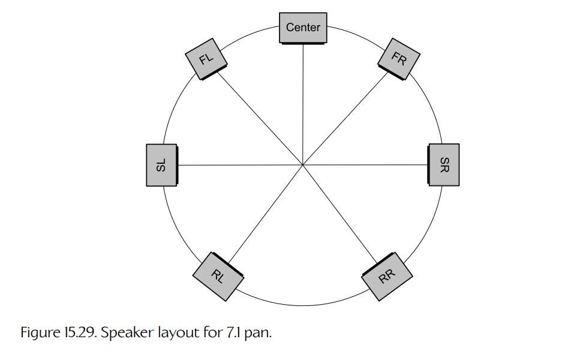
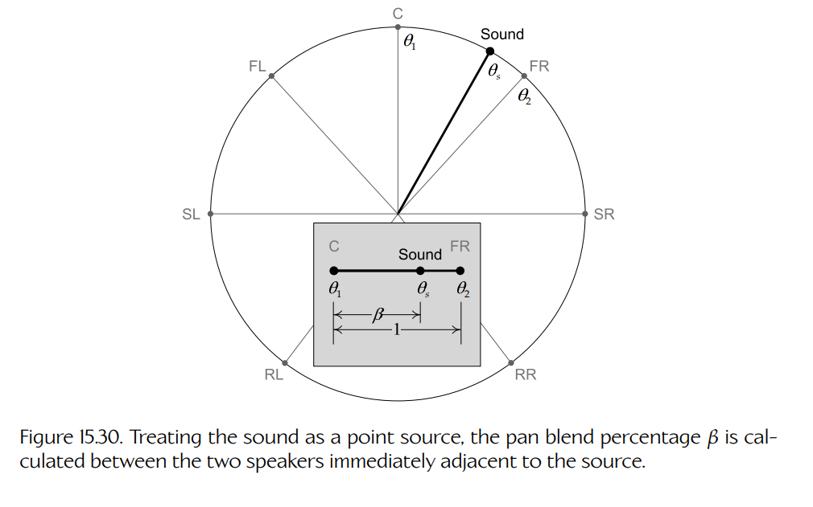
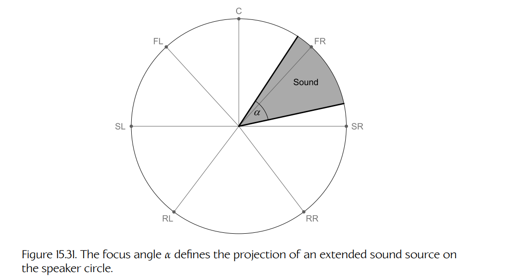
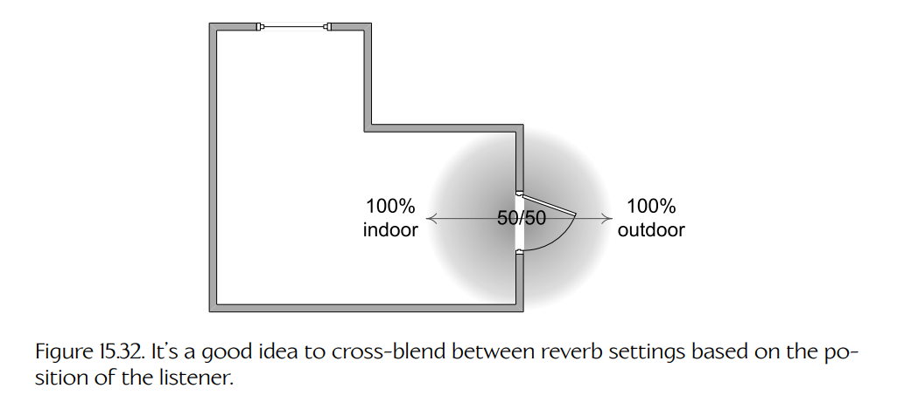
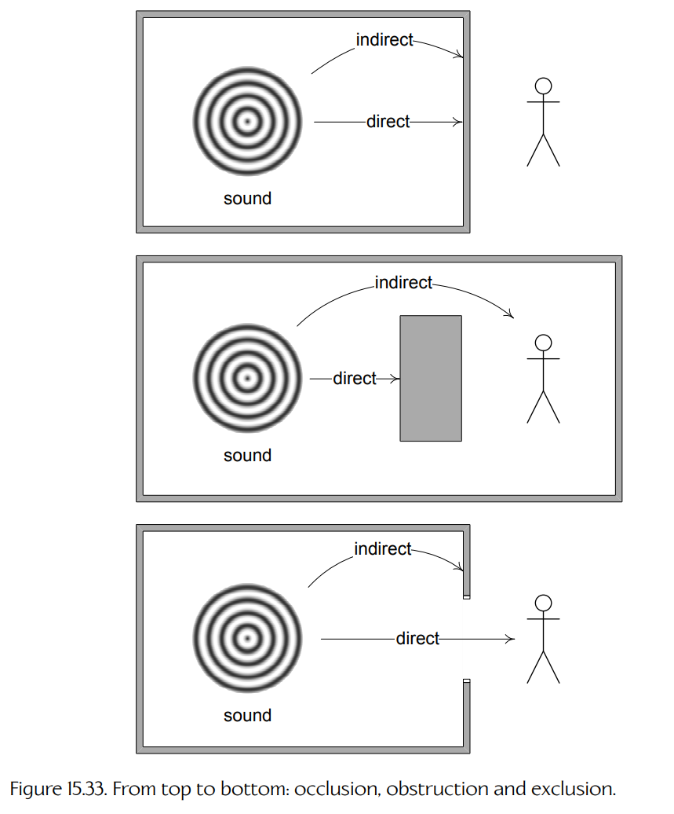
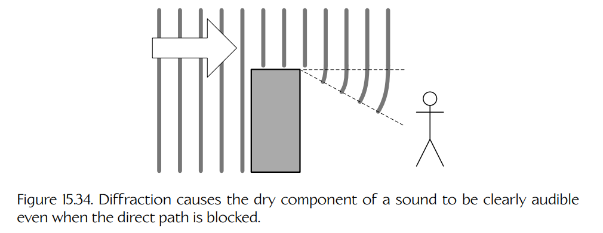
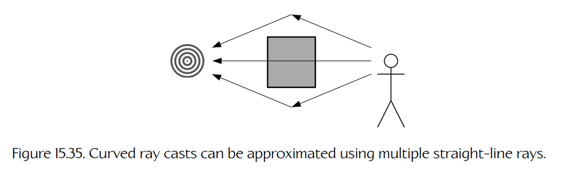

## 15.4 在三维中渲染音频

到目前为止，我们已经学习了声音的物理学、信号处理的数学，以及用于录制和播放声音的各种技术。在本节中，我们将探讨如何把所有这些理论和技术应用到游戏引擎中，从而为游戏生成真实、沉浸式的声景。

任何发生在虚拟 3D 世界中的游戏，都需要某种形式的 **3D 音频渲染引擎**（3D audio rendering engine）。一个高质量的 3D 音频系统应该为玩家提供丰富、沉浸且可信的声景，使其与 3D 世界中发生的事情相匹配，同时支撑故事表达，并保持与游戏整体音调设计一致。

- 该系统的输入，是来自游戏世界各处的大量 **3D 声音**：脚步声、语音、物体相互碰撞的声音、枪声，以及风声或雨声等环境音，等等。
- 它的输出是少量声音通道，这些通道经由扬声器播放时，应尽可能真实地再现玩家如果真的身处虚拟游戏世界中会听到的声音。

理想情况下，我们希望音频引擎能够以完整的 7.1 或 5.1 环绕声产生输出，因为这会为人耳提供最丰富的位置线索。然而，音频引擎也必须支持立体声输出，以便服务那些没有高级家庭影院系统的玩家，或者只是想戴着耳机玩游戏、避免吵醒邻居的玩家。

游戏的音频引擎还负责播放那些并非源自虚拟世界的声音。例如音乐轨道、游戏内菜单系统发出的声音、旁白、玩家角色的声音（尤其是在第一人称射击游戏中），以及某些环境音。我们将这些称为 **2D 声音**。这类声音被设计为在与 3D 空间化引擎的输出混合之后，直接在扬声器中播放。

### 15.4.1 三维声音渲染概述

3D 音频引擎执行的主要任务如下：

- **声音合成**（sound synthesis）是生成与游戏世界中事件相对应的声音信号的过程。这些声音可以通过播放预先录制的**声音片段**（sound clips）产生，也可以在运行时通过**过程化**方式生成。
- **空间化**（spatialization）制造一种错觉：从听者的视角来看，每个 3D 声音都仿佛来自游戏世界中的正确位置。空间化通过控制每个声波的**振幅**（也就是它的增益或音量）来实现，方式有两种：
  - **基于距离的衰减**（distance-based attenuation）控制声音的**总体音量**，从而提示它与听者之间的**径向距离**。
  - **声像定位**（pan）控制声音在各个可用扬声器中的相对音量，从而提示声音到达的**方向**。
- **声学建模**（acoustical modeling）通过模拟听音空间中的早期反射和后期混响，并考虑障碍物部分或完全阻挡声源与听者之间路径的情况，来增强渲染声景的真实感。一些声音引擎还会建模**大气吸收**（见 Section 15.1.3.2）和/或 HRTF 效应（见 Section 15.1.4）所带来的频率相关影响。
- **多普勒频移**（Doppler shifting）也可用于处理声源与听者之间的相对运动。
- **混音**（mixing）是控制游戏中所有 2D 和 3D 声音相对音量的过程。混音部分由物理规律驱动，部分由游戏声音设计师的审美选择驱动。

### 15.4.2 建模音频世界

为了渲染虚拟世界的声景，我们首先必须向引擎描述这个世界。“音频世界模型”（audio world model）由以下元素组成：

- **3D 声源**（3D sound sources）。游戏世界中的每个 3D 声音都由一个单声道音频信号构成，并从某个特定**位置**发出。还必须向引擎提供该声源的**速度**、**辐射模式**（radiation pattern，例如全向、锥形、平面）和**范围**（range，超出该范围后声音不可听）。
- **听者**（listener）。听者是位于游戏世界中的“虚拟麦克风”。它由自身的**位置**、**速度**和**朝向**定义。
- **环境模型**（environmental model）。该模型既可以描述虚拟世界中表面和物体的**几何结构**与**属性**，也可以描述游戏玩法发生的听音空间的**声学属性**，或者两者兼而有之。

声源和听者的位置用于**基于距离的衰减**；声源的**辐射模式**也会参与基于距离的衰减计算。听者的**朝向**定义了一个参考系，声音的**角位置**会在这个参考系中计算。该角度进而决定**声像定位**，也就是该声音在 5.1 或 7.1 环绕声系统中五个或七个主扬声器上的相对音量。声源与听者的**相对速度**用于应用**多普勒频移**。最后，同样重要的是，**环境模型**用于建模听音空间的声学特性，并考虑声音传播路径的部分或完全阻挡。

### 15.4.3 基于距离的衰减

当 3D 声音与听者之间的径向距离增加时，基于距离的衰减会降低该 3D 声音的音量。

#### 15.4.3.1 衰减最小值与最大值

典型游戏世界中的声源数量非常庞大。由于硬件和 CPU 带宽限制，我们不可能渲染所有声源。而且也没有必要这样做，因为由于基于距离的衰减，超过听者一定距离的声音无论如何都听不到。因此，每个声源通常都会带有衰减（fall-off，FO）参数。

**衰减最小值**（fall-off min，简称 “FO min”）是一个最小半径，记作 $r_{\min}$。在该半径范围内，声音完全不会衰减，并以完整音量被听到。**衰减最大值**（fall-off max，简称 “FO max”）是一个最大半径，记作 $r_{\max}$。超过该半径后，声源被认为是静音的，因此可以忽略。在 FO min 与 FO max 之间，我们需要从完整音量平滑混合到零。

#### 15.4.3.2 混合到零

从最大音量混合到零的一种方法，是在 FO min 与 FO max 之间使用线性斜坡。根据声音类型的不同，线性衰减听起来可能也没什么问题。

在 Section 15.1.3.1 中，我们了解到声音强度与“响度”感知密切相关，并且其随径向距离按照 $1/r^2$ 规律衰减。增益与声压振幅成正比，则按照 $1/r$ 衰减。因此，真正合理的做法是使用 $1/r$ 曲线，将声音增益从完整音量混合到零。

函数 $1/r$ 的一个问题是它具有渐近性——无论 $r$ 多大，它都不会真正达到零。我们可以通过将曲线略微下移，使其在 $r_{\max}$ 处穿过 $r$ 轴来修正这个问题。或者，我们也可以简单地将所有 $r>r_{\max}$ 的声音强度钳制为零。

#### 15.4.3.3 弯曲规则

在制作 *The Last of Us* 时，Naughty Dog 的声音部门发现，使用 $1/r^2$ 规则对角色对白进行衰减，会导致距离只是稍远的角色说话就过快变得难以听清。这是一个严重问题，尤其是在潜行玩法段落中，听到敌人的环境对话既是重要的战术工具，也是推进故事线的方式。

为了解决这个问题，Naughty Dog 的声音部门使用了一种复杂的衰减曲线：它使对白在靠近听者时衰减得更慢，在中距离处衰减得更快，而当听者距离进一步变得很远时，又再次衰减得更慢。这使对白能在更远距离上被听到，同时仍然保留听起来比较自然的衰减效果。

对白衰减曲线还会在运行时根据游戏当前的“紧张等级”（tension level）动态调整，也就是根据敌人是否尚未察觉玩家、正在搜寻玩家，还是已经与玩家直接交战来调整。这使得 *The Last of Us* 和 *The Last of Us Part II* 中的声音在潜行玩法中可以传播得更远，而在战斗爆发时又不会上升到压倒性的音量级别。

最后，还可以选择性地启用一种“甜化”（sweetener）混响，让角色声音即使在直接路径 100% 受阻时，也能绕过拐角传过来。在那些相比真实衰减建模，更重要的是确保玩家能清楚听到对话的场景中，这个工具非常有用。

设计 3D 音频模型时，有各种各样可以“作弊”的方式。但无论怎么做，都要记住一个简单原则：不要害怕采取任何必要手段来满足**游戏需求**。不用担心——物理定律不会被冒犯！

#### 15.4.3.4 大气衰减

正如 Section 15.1.3.2 中所看到的，低音调声音受到大气的衰减小于高音调声音。一些游戏，包括 Naughty Dog 的 *The Last of Us* 系列，通过对每个 3D 声音应用低通滤波器来模拟这一现象：随着声源与听者之间的距离增大，该低通滤波器的通带会逐渐滑向越来越低的频率。

### 15.4.4 声像定位

**声像定位**（panning）是一种用于制造 3D 声音来自某一特定方向的错觉的技术。通过控制声音在各个可用扬声器中的音量（也就是增益），可以诱导听者在三维空间中感知到该声音的**幻像声像**（phantom image）。这种声像定位方法称为**振幅声像定位**（amplitude panning），因为我们仅通过调整各个扬声器产生的声波振幅，向听者提供角度信息（而不是使用相位偏移、混响或滤波来提供位置线索）。它有时也被称为 **IID 声像定位**，因为它依赖于**双耳强度差**（interaural intensity difference，IID）的感知效应来产生声音的幻像声像。

**Figure 15.29.** 用于 7.1 声像定位的扬声器布局。

“pan” 这个术语来自早期技术中的 “panoramic potentiometer”（全景电位器，即可变电阻），简称 “pan pot”。它用于控制立体声系统中左右扬声器的相对音量。将 pan pot 旋钮拨到一个极端，只会在左扬声器中产生声音；拨到另一个极端，则只会驱动右扬声器；将 pan pot 旋钮居中，则会将声音平均分配给两个扬声器。

为了理解声像定位的工作方式，可以设想听者位于一个圆的中心。扬声器位于该圆周上的不同点，因此本书将这个圆称为**扬声器圆**（speaker circle）。该圆的半径近似表示听者与任意一个扬声器之间的平均距离。

对于立体声系统，前方左右扬声器大致位于中心左右 $\pm45$ 度的位置。对于立体声耳机，它们位于 $\pm90$ 度的位置（并且半径要小得多）。对于 7.1 环绕声，我们只考虑七个“主”扬声器，因为 LFE 通道不提供位置线索。这些扬声器的大致位置如 Figure 15.29 所示。若定位到 5.1 系统，只需省略左环绕和右环绕扬声器即可。

暂时先将每个 3D 声音视为一个点声源。要对声音进行声像定位，我们首先确定它的**方位角**（azimuthal，即水平角）。该方位角必须在听者的局部空间中测量，使得角度零对应于听者正前方的位置。接下来，我们找出扬声器圆周上与该方位角相邻的两个扬声器。然后，将该角度转换为两个扬声器之间圆弧上的百分比。最后，使用这个百分比来确定该声音在每个扬声器中的增益。

为了用数学形式表示这一过程，我们用符号 $\theta_s$ 表示声音的方位角。将两个相邻扬声器的角度称为 $\theta_1$ 和 $\theta_2$。百分比 $\beta$ 的计算方式如下：

$$
\beta=\frac{\theta_s-\theta_1}{\theta_2-\theta_1}.
$$

该计算如 Figure 15.30 所示。

**Figure 15.30.** 将声音视为点声源时，声像混合百分比 $\beta$ 在与该声源最相邻的两个扬声器之间计算。

#### 15.4.4.1 恒定增益声像定位

第一反应可能是使用百分比 $\beta$，在两个扬声器的增益之间执行简单的线性插值。给定未定位声音的增益 $A$，该声音在每个扬声器中播放时的增益可计算如下：

$$
A_1=(1-\beta)A;
$$

$$
A_2=\beta A.
$$

这称为**恒定增益声像定位**（constant gain panning），因为净增益 $A=A_1+A_2$ 是恒定的，与 $\theta_s$ 和 $\beta$ 的取值无关。

恒定增益声像定位的主要问题是，当声音在声场周围移动时，它**不会**产生恒定响度的感知。增益控制声压波的振幅，因此控制**声压级**（SPL）。然而，正如 Section 15.1.2 所述，人类对响度的感知实际上与声波的**强度**或**功率**成正比，而二者都随 SPL 的平方变化。

为了说明这个问题，假设声音被定位到两个扬声器的正中间。恒定增益声像定位会让我们把增益 $A_1$ 和 $A_2$ 都设置为 $\frac{1}{2}A$。但这样得到的总功率为：

$$
A_1^2 + A_2^2 =
\left(\frac{1}{2}A\right)^2+
\left(\frac{1}{2}A\right)^2
=
\frac{1}{2}A^2.
$$

换句话说，与声音只定位到左扬声器或右扬声器时相比，此时声音的响度只有一半。

#### 15.4.4.2 恒定功率声像定律

显然，为了在声音声像围绕听者移动时保持响度感知恒定，需要保持**功率**恒定。这个规则称为**恒定功率声像定律**（constant power pan law），简称 **pan law**。

实现恒定功率声像定律有一种非常简单的方法。我们不再线性插值增益，而是使用混合百分比 $\beta$ 的正弦和余弦来计算：

$$
A_1=\sin\left(\frac{\pi}{2}\beta\right)A;
$$

$$
A_2=\cos\left(\frac{\pi}{2}\beta\right)A.
$$

再次考虑一个被定位到两个扬声器正中间的声音声像（$\beta=\frac{1}{2}$）。使用恒定功率声像定位时，两个扬声器的增益将设置为：

$$
A_1=A_2=\frac{1}{\sqrt{2}}A.
$$

这会产生总功率：

$$
A_1^2 + A_2^2 =
\left(\frac{1}{\sqrt{2}}A\right)^2+
\left(\frac{1}{\sqrt{2}}A\right)^2
=
A^2.
$$

这对任意 $\beta$ 都成立，因此无论声音声像被放在圆周的哪个位置，功率 $A^2$ 都保持恒定。

声音设计师常常使用“3 dB 规则”来处理声像定律：如果一个声音要平均混合到两个扬声器中，那么每个扬声器中的增益应相对于只在一个扬声器中播放该声音时所使用的增益降低 3 dB。$-3$ dB 来自：

$$
\log_{10}\left(\frac{1}{\sqrt{2}}\right)\approx -0.15.
$$

电压增益（或振幅增益）定义为：

$$
20\log_{10}(A_{\text{out}}/A_{\text{in}}),
$$

而 $20\times -0.15=-3$ dB。（对数前面的 20 来自这样一个事实：分贝是贝尔的十分之一，并且还要乘以 2，以考虑我们处理的是 $A^2$ 而不是 $A$。）

#### 15.4.4.3 余量

在某些情况下，声像定位会使声音完全由一个扬声器渲染；而在另一些情况下，则由两个（或更多，后面会看到）扬声器渲染。假设某个声音被两个相邻扬声器平均播放，并且音量非常大，使每个扬声器都输出其最大功率。当这个声音移动到只由一个扬声器播放时会发生什么？答案是，我们很可能会把扬声器烧坏，因为恒定功率声像定律要求单个扬声器使用比两个扬声器更多的增益。

为了防止这个问题，需要人为地整体降低声音的最大增益，使最坏情况——声音只在一个扬声器中播放——也不会过驱该扬声器。这种人为降低音量最大范围的做法称为“留出一些**余量**”（headroom）。

余量的概念也适用于**混音**。当两个或更多声音混合时，它们的振幅会相加。通过在混音中留出一些余量，可以容纳大量高音量声音同时播放的最坏情况。

#### 15.4.4.4 使用中置，还是不使用中置？

在电影中，中置通道历史上用于语音；只有音效会被定位到房间周围的其他扬声器。这种做法背后的想法是，电影角色说话时通常在画面上，因此观众期望从正前方和中间听到他们的声音。这种方法有一个不错的副作用：它将语音与电影中的其他声音分离开来，这意味着响亮的音效不会耗尽所有可用余量并淹没对白。

在 3D 游戏中，情况则完全不同。玩家通常希望从自己周围“正确”的位置听到对白。如果玩家将摄像机旋转 180 度，对白也应该相应地在声场中旋转 180 度。因此，游戏通常不会将所有对白都分配给中置扬声器；相反，对白和音效一样都会参与声像定位。

当然，这又把我们带回了余量问题——响亮的枪声现在可能完全淹没语音。在 Naughty Dog，我们通过“折中”的方式克服这个问题：始终在中置通道播放**一部分**对白，同时也将另一部分对白与音效一起定位到其余扬声器中。

#### 15.4.4.5 焦点

当声源离听者很远时，可以将其视为点声源。我们只需计算一个方位角，并将其输入恒定功率声像定位系统。然而，当声源接近甚至进入定义扬声器到听者径向距离的圆时，就不能再将其准确地建模为由单一角度表示的点声源了。

考虑向一个声源移动并从它旁边经过的情况。起初，该声源完全出现在前方扬声器中。当它经过听者时，我们需要以某种方式将声音转移到后方扬声器。如果将声音建模为点声源，唯一选择就是把声音从前方“突然跳”到后方。

理想情况下，我们希望随着声音接近，其声像逐渐在扬声器圆周上“展开”。这样，当它靠近听者时，就可以开始在侧面扬声器中播放更多声音。当声源与听者重合时，它可以在所有七个（或五个）扬声器中播放。而一旦它经过听者，就可以平滑地将声音过渡到后方，在它退到听者身后时，将前方增益降为零。

如果不把声源建模为扬声器圆上的一个点，而是建模为一段**圆弧**，就可以做到这类效果，甚至更多。换句话说，可以把每个声源看作在 3D 空间中具有任意形状，并且它在扬声器圆上的**投影**会张成一定角度，从而在圆内定义出一个“扇形”区域。这类似于 3D 图形学中推导渲染方程时使用的**立体角**概念，详见 Section 12.2.5.1。

我们把扩展声源所张成的角称为**焦点角**（focus angle），记作 $\alpha$。点声源可以看作 $\alpha=0$ 的“边界情况”。焦点角如 Figure 15.31 所示。

**Figure 15.31.** 焦点角 $\alpha$ 定义了扩展声源在扬声器圆上的投影。

要渲染具有非零焦点角的声音，必须首先确定这样一组扬声器：它们要么与该声音在扬声器圆上的投影圆弧相交，要么紧邻该圆弧。然后，我们必须在这些扬声器之间分配该声音的强度/功率，以诱导听者感知到一个跨越投影圆弧的幻像声像。

可以用多种方式在相关扬声器之间分配声音。例如，可以让所有位于焦点“扇形区域”内的扬声器接收相同的最大功率，然后将较少的声音分配给紧邻圆弧的两个扬声器，从而形成衰减。但无论怎么做，都必须始终遵守恒定功率声像定律。因此，必须设置这些扬声器的增益，使其平方和（也就是功率和）等于原始未定位声源增益的平方。

#### 15.4.4.6 处理垂直性

在立体声和环绕声设置中，扬声器大致都位于一个水平平面内。这种布置使得把声音定位到听者耳朵所在平面的上方或下方变得很棘手。

理想情况下，当然是通过球形扬声器排列来建模真正的“全周场”（periphonic）声场。一种称为 **Ambisonics** 的技术 [354] 能够同时适应平面和球形扬声器排列。不过，至少目前它还没有得到任何游戏主机的支持。Sony 现在为 PS4 的 Platinum Wireless Headset 提供了 3D 音频技术，游戏也开始支持它。但即便存在 3D 音频技术，游戏仍然需要支持 5.1 和 7.1 声音系统的平面扬声器排列。

事实证明，**焦点**概念可以用来在声像中模拟一定程度的垂直性。我们只需将所有声音投影到水平平面上，然后对那些投影落得过于靠近或进入扬声器圆内部的声音使用非零焦点角。一个远处的高处声音，其渲染方式几乎与非高处声音相同。但当这个高处声音从头顶经过时，我们会将它混合到多个扬声器之间，从而在扬声器圆内部产生一个幻像声像。如果将其与基于距离的衰减和频率相关的大气吸收结合起来，就可以向听者提供足够线索，使声音看起来位于听者上方或下方。

#### 15.4.4.7 关于声像定位的进一步阅读

恒定功率声像定律的基础可以在这里找到：[355]。下面这个网站也是关于该主题的优秀资源：[356]。

Helsinki University of Technology 的 Ville Pulkki 所写论文 “Spatial Sound Generation and Perception by Amplitude Panning Techniques” 可在 [357] 获取。该论文清楚描述了空间化问题，并概述了基于向量的振幅声像定位（vector based amplitude panning，VBAP）方法，同时提供了丰富的扩展阅读文献目录。

David Griesinger 的论文 “Stereo and Surround Panning in Practice” 也非常值得一读，可在 [358] 获取。David 的网站上充满了关于声音感知和音频再现技术的研究资料。

### 15.4.5 传播、混响与声学

即便实现了基于距离的衰减、声像定位和多普勒效应，3D 声音引擎仍然无法生成真实的声景。这是因为人类用来判断自己身处何种空间的大量听觉线索，来自早期反射、后期混响，以及声波通过多条路径到达人耳时产生的头相关传递函数（HRTF）效应。术语**声音传播建模**（sound propagation modeling）可以用于任何旨在考虑声波如何在空间中传播的技术。

在研究以及交互媒体和游戏中，存在许多不同方法。这些技术可以分为三类：

- **几何分析**（geometric analysis）试图建模声波实际经过的路径；
- **基于感知的模型**（perceptually based models）关注使用听音空间声学的 LTI 系统模型来再现人耳所感知到的结果；
- **特设方法**（ad hoc methods）使用各种近似方法，在最少数据和/或处理带宽下产生足够准确的声学效果。

下面这篇论文很好地综述了许多属于前两类的技术：[359]。在本节中，我们将简要讨论 LTI 系统建模，然后把注意力转向一些特设方法，因为它们通常更适合在真实游戏中使用。

#### 15.4.5.1 使用 LTI 系统建模传播效应

想象我站在一个房间里，房间中包含由各种材料制成的物体。房间中发出一个声音。它在房间里发生反射、衍射和弹跳，最终到达我的耳朵。仔细想想，这些声波具体走了哪条路径其实并不重要。唯一会影响我感知的是干燥直接声波与各种时间偏移、可能变得低沉或以其他方式被改变的湿润间接声波之间的具体叠加结果。

事实证明，所有这些效果都可以用一个线性时不变（LTI）系统建模。理论上，如果能够测量房间中某一对点之间的**脉冲响应**——这两个点分别代表声源和听者——就可以精确确定在该声源位置播放的**任何**声音，在听者位置听起来应该是什么样的。我们只需要将干声与脉冲响应做卷积即可：

$$
p_{\text{wet}}(t)=p_{\text{dry}}(t)*h(t).
$$

这种技术乍看之下像一颗银弹。然而，它实际上比第一眼看起来更困难，也更不实用。在现实生活中确定一个空间的脉冲响应相当容易——可以录制一个近似单位脉冲 $\delta(t)$ 的短促“咔哒”声，录得的信号就会近似于 $h(t)$。但在虚拟空间中，为了确定 $h(t)$，需要对每个游玩空间执行复杂且昂贵的模拟。此外，为了准确建模房间声学，还需要对整个游戏世界中大量声源-听者点对执行该计算；一旦计算完成，数据规模也会非常庞大。最后，卷积操作本身并不便宜，而过去的游戏主机和声卡缺乏足够性能，无法为游戏中的每个声音实时执行该操作。

现代游戏硬件一直在变得更强大，基于卷积的传播建模方法也越来越可行。例如，Micah Taylor 等人创建了一个实时卷积混响演示，产生了很有前景的结果——见 [360]。话虽如此，大多数游戏仍然不会使用这种方法，而是依赖各种特设方法和近似来建模环境混响。

#### 15.4.5.2 混响区域

建模游玩空间湿声特征的一种常见方法，是使用手动放置的区域标注游戏世界；每个区域都带有适当的混响设置，如预延迟、衰减、密度和扩散。关于这些参数的讨论见 Section 15.1.3.4。当虚拟听者穿过这些区域时，可以启用相应的混响模式：如果玩家进入一个铺瓷砖的大房间，就可以增加回声；当玩家进入一个小壁橱时，可以几乎消除混响，产生非常干的声音。

当听者穿过游玩空间时，最好在混响设置之间平滑交叉混合。可以使用简单的线性插值来为每个参数执行这种交叉混合。混合百分比最好通过测量听者“进入”该区域的深度来计算。例如，想象从室外空间穿过门口进入室内空间。我们可以在门口周围定义一个发生混合的区域。如果听者完全位于混合区域之外，混合百分比应得到 100% 室外混响设置和 0% 室内设置。如果听者站在混合区域的中点，我们希望得到 50/50 的混响设置。一旦听者穿过建筑物内部的混合区域，我们就会达到 0% 室外 / 100% 室内的混合。这个想法如 Figure 15.32 所示。

**Figure 15.32.** 根据听者的位置在不同混响设置之间交叉混合，是一个不错的做法。

#### 15.4.5.3 阻挡、遮挡与排除

当使用区域来定义游玩空间的声学特性时，通常会为每个区域分配**单个脉冲响应函数**或**单组混响设置**。这可以捕捉每个游玩空间的本质（例如大型瓷砖大厅、挂满外套的小壁橱、平坦的户外平原等）。但它会导致对障碍物引起的声学效果再现得不够完美。例如，想象一个中心有大柱子的方形房间。如果声源位于房间一角，那么听者在房间内移动时，会根据直接路径是否被柱子阻挡，感知到非常不同的音色。如果为该房间使用一组单一的混响参数，就无法捕捉这些细微差异。

为了解决这个问题，可以尝试以某种方式建模环境的几何结构和材质属性，确定声波如何受到路径上障碍物的影响，然后使用该分析结果修改与房间相关联的“基础”混响设置。

Figure 15.33 展示了游戏世界中的物体和表面对声波传输产生影响的三种方式：

- **遮挡**（occlusion）。这描述的是这样一种情况：从声源到听者之间不存在无阻碍路径。如果例如声源与听者之间只有一堵薄墙或一扇门，听者仍然可能听到一个完全遮挡的声音。被遮挡声音的干声和湿声分量要么都会被衰减和/或变得低沉，要么从听者角度来看该声音完全静音。
- **阻挡**（obstruction）。这描述的是声音与听者之间的**直接路径**被阻塞，但存在一条**间接路径**的情况。阻挡可以发生在声源经过汽车、柱子或其他障碍物后方时。被阻挡声音的干声分量要么完全不存在，要么严重变得低沉；湿声分量也可能被修改，以反映声波必须经过更长、更具反射性的路径才能到达听者。
- **排除**（exclusion）。这描述的是声源与听者之间存在自由直接路径，但间接路径以某种方式受损的情况。当一个声音在某个房间中产生，并穿过门或窗等狭窄开口到达听者时，就可能发生这种情况。在排除情形中，声音的干声分量保持不变，但湿声分量会被衰减、变得低沉，或者在非常狭窄的开口下完全消失。

**Figure 15.33.** 从上到下：遮挡、阻挡和排除。

**分析直接路径。**

确定直接路径是否被阻挡并不困难。我们只需从听者到每个声源发射一条射线（见 Section 14.3.7.1）。如果它被阻挡，则直接路径被遮挡；如果没有被阻挡，则路径是自由的。

如果希望建模声音穿过墙壁和其他障碍物的传输，仍然可以使用射线投射。我们从声源向听者发射一条射线，并且对每次接触查询被击中表面的材质属性，以确定它吸收了多少声音能量。如果该表面允许部分能量通过，就可以从障碍物另一侧再次发射一条射线，并继续追踪到听者的路径。一旦所有声音能量都被吸收，就可以断定该声音无法被听到。但如果射线一路到达听者，而没有损失所有声音能量，就可以按照相应量衰减干声分量的增益，以模拟声音传输。

**分析间接路径。**

判断间接路径是否被遮挡是一个困难得多的问题。理想情况下，我们会执行某种搜索（也许是 A*），以确定从声源到听者是否存在路径，以及每条可行路径引入了多少衰减和反射。实践中，这种**路径追踪**方法很少使用，因为它对处理器和内存都很密集。归根结底，游戏程序员其实并不关心创建能让我们赢得诺贝尔物理学奖的物理精确模拟；我们只是想产生一个**沉浸且可信**的声景。

不用担心，并非全无办法。我们可以通过各种方式获得声音间接路径的**近似模型**。例如，如果使用**混响区域**来建模游戏中各个空间的整体声学特性（见 Section 15.4.5.2），就可以利用这些区域来判断是否存在间接路径。比如，可以使用一些简单经验规则：

1. 如果声源和听者位于同一区域，则假定存在间接路径。
2. 如果声源和听者位于不同区域，则假定间接路径被遮挡。

结合这些假设和直接路径射线投射的结果，就可以区分四种情况：自由、遮挡、阻挡或排除。

**考虑衍射。**

当任何波穿过狭窄开口或与拐角发生相互作用时，它都会像 Figure 15.34 所示那样扩散开。我们称这种现象为**衍射**（diffraction）。由于衍射，只要直接路径和弯曲路径之间的角度差不太大，即使直接路径被阻挡，声音也可以像存在直接路径一样绕过拐角被听到。

**Figure 15.34.** 衍射会使声音的干声分量即使在直接路径被阻挡时仍能被清楚听到。

确定声音是否能够发生衍射并到达听者的一种方法，是在中心“直接”射线周围发射几条“弯曲”射线。大多数碰撞引擎不支持弯曲路径追踪，但可以使用多条直线射线投射来模拟弯曲路径。Figure 15.35 展示了一个简单例子：从声源向听者发射五条射线——一条直接射线，加上两条由两段直线射线投射组成的“弯曲”轨迹。从技术上讲，我们是在对每条希望追踪的弯曲路径使用**分段线性近似**。

**Figure 15.35.** 弯曲射线投射可以用多条直线射线近似。

如果直接射线被遮挡，但弯曲轨迹能够“看到”听者，这就说明听者位于附近拐角周围的“衍射区域”中，因此应该像声音没有被遮挡一样听到该声音。

**使用混响与增益应用模型。**

到目前为止，我们已经讨论了如何判断直接路径和间接路径是否被阻挡。这种分析还可以告诉我们遮挡或阻挡带来的声学影响。例如，穿过墙壁的声音可能会变得低沉；而沿着一条很长、很“弹”的路径传播的声音可能会引入大量混响。现在的问题是：渲染声音时如何应用这些知识？

一种简单方法是根据直接路径或间接路径是否完全或部分被阻挡，分别衰减声音的干声和湿声分量。为了微调结果，还可以根据判断声音传播路径时收集到的启发式信息，为声音的每个分量应用更多或更少的混响。每个游戏的需求都不同，所以这正是那种试错是最好且唯一选择的情况！

**混合受阻声音。**

如果真的去实现上面几节讨论的所有内容，你会注意到一个明显问题。当声源在上面描述的四种状态之间移动时——例如从自由状态变成阻挡状态——声音的音色和响度会显得像是“突然跳变”。有许多方式可以平滑这种过渡。可以施加一点**滞后**（hysteresis），也就是延迟声音系统对每个声音受阻状态变化的响应，然后利用这段短暂的延迟窗口，在两组混响设置之间平滑交叉混合。不过这种延迟可能会被察觉，所以并不是理想方案。

对于 *Uncharted* 和 *The Last of Us* 系列，Naughty Dog 的高级声音程序员 Jonathan Lanier 发明了一套专有系统，他称之为**随机传播建模**（stochastic propagation modeling）。在不泄露商业机密的前提下，可以说该系统会对每个声源发射一组射线，其中一些是直接射线，一些是间接射线，并在多帧中累积这些命中/未命中结果。基于这些数据，我们可以生成一个概率模型，表示每个声音源的干声和湿声分量所经历的遮挡程度。这使声音能够在从完全遮挡到完全自由之间平滑过渡，而不会产生明显的“跳变”。
