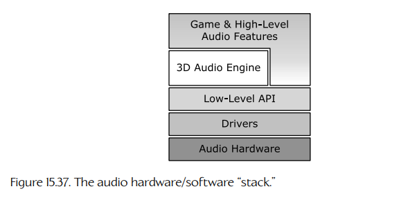
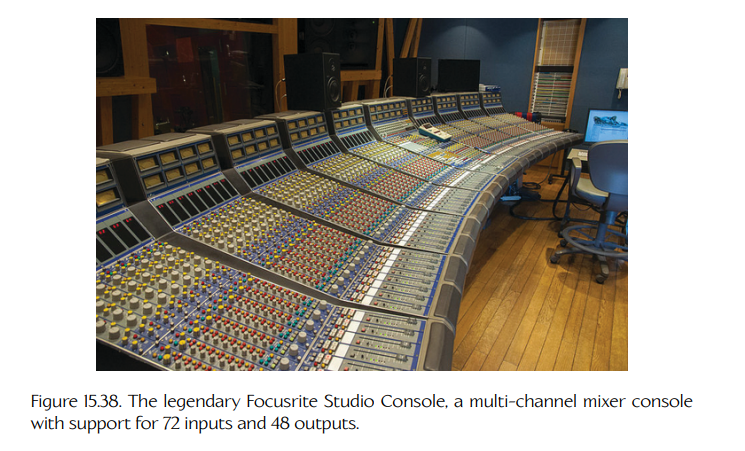
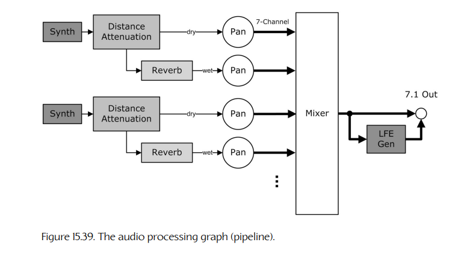
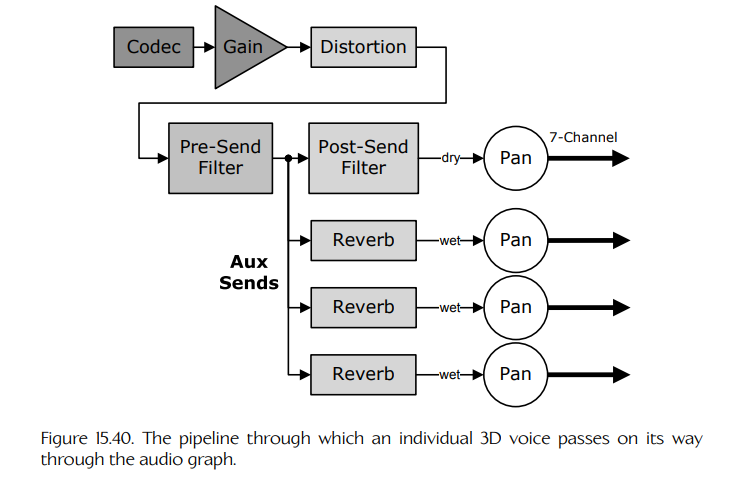
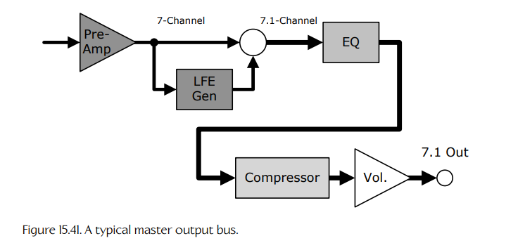

## 15.5 音频引擎架构

到目前为止，我们已经讨论了 3D 声音渲染背后的概念和方法论，以及支撑它们的理论与技术。本节将把注意力转向用于实现 3D 音频渲染引擎的软件和硬件组件架构。

与大多数计算机系统一样，游戏引擎的音频渲染软件通常被组织成一个由硬件和软件组件分层构成的“栈”（stack，见 Figure 15.37）。

- **硬件**（hardware）不可避免地构成这一结构的基础。它至少要提供必要的电路，用于驱动数字或模拟扬声器输出，把 PC 或游戏主机连接到耳机、电视或环绕声家庭影院系统。音频硬件还可以通过在硅芯片中提供编解码器、混音器、混响槽、效果单元、波形合成器和/或 DSP 芯片，为位于栈上层的软件提供“加速”。这种硬件通常被称为**声卡**（sound card），因为 PC 有时会通过一块插入式外设卡来提供音频能力。

**Figure 15.37.** 音频硬件/软件“栈”。

**Figure 15.38.** 传奇的 Focusrite Studio Console，一台支持 72 路输入和 48 路输出的多通道调音台。

- 在个人计算机上，硬件通常被封装在**驱动层**（driver layer）中，使操作系统能够支持来自各种厂商的声卡。
- 在 PC 和游戏主机上，硬件和驱动通常还会被包装在一个低层**应用程序编程接口**（application programming interface，API）中，以免程序员必须直接处理控制硬件和驱动的各种琐碎细节。
- **3D 音频引擎**本身则构建在这些基础之上。

音频硬件/软件栈呈现给程序员的功能集，通常是参照录音棚和现场音乐会中使用的那类**多通道调音台**（multi-channel mixer console）[365] 的功能集建模的（见 Figure 15.38）。调音台可以接收来自麦克风和/或电子乐器的大量音频输入。输入声音可以被滤波和均衡，也可以添加混响或其他效果。随后，调音台用于把所有这些信号混合在一起，并根据声音设计师的需求设置各声音的相对音量。最终的混合输出会被路由到扬声器（用于现场演出），或路由到多轨录音中的各个单独通道。

从同样的意义上说，音频硬件/软件栈必须接收大量输入（2D 和 3D 声音），以各种方式处理它们，将它们混合在一起，使其相对增益设置得当，最后把信号输出到扬声器通道，从而为人类玩家营造出三维声景的幻觉。

### 15.5.1 音频处理流水线

正如 Section 15.4.1 中所学，渲染一个 3D 声音的过程包含多个离散步骤：

- 对于每个 3D 声音，都必须合成一个“干的”（dry）数字（PCM）信号。
- 应用基于距离的衰减，使听者获得距离感；并对信号应用混响，以建模虚拟听音空间的声学特征，并向听者提供空间化线索。这会产生一个新的“湿的”（wet）信号。
- 湿信号和干信号会被分别**声像定位**（panned）到一个或多个扬声器中，以在三维空间中产生每个信号最终的“声像”（image）。
- 所有 3D 声音经过声像定位后的多通道信号会被**混合**（mixed）成一个单一的多通道信号；该信号随后会被送入一组并行的 DAC 和放大器组，用于驱动模拟扬声器输出，或者直接送到 HDMI 或 S/PDIF 等数字输出。

显然，我们可以把 3D 音频渲染过程看作一条**流水线**（pipeline）。而且，由于一个游戏世界通常同时包含大量声源，多条流水线会同时运行。因此，音频处理流水线有时被称为**音频处理图**（audio processing graph）。它本质上是由相互连接的组件组成的图，最终汇聚为少量扬声器通道，构成最终的混合、声像定位输出。Figure 15.39 展示了音频图的高层视图。

**Figure 15.39.** 音频处理图（流水线）。

### 15.5.2 概念与术语

在深入探索音频处理流水线之前，需要先熟悉一些用于描述它们的概念和术语。

#### 15.5.2.1 声部

每个通过音频渲染图的 2D 或 3D 声音都称为一个**声部**（voice）。这个术语来自早期电子音乐：合成器会通过一组称为“voices”的波形发生器来生成音符。

合成器包含的波形发生器电路数量有限，因此电子音乐人会谈论他们的合成器能够同时产生多少个声部。类似地，游戏音频渲染引擎通常也只拥有有限数量的编解码器、混响单元等。某个特定音频硬件/软件栈所支持的最大声部数，取决于能够独立并行通过音频图的路径数量。这个数量通常受到有限内存资源、有限硬件资源和/或处理能力限制的约束。该数量有时也称为系统支持的**复音程度**（degree of polyphony）。

**2D 声部。**

游戏的音频渲染流水线还必须能够处理 2D 声音，例如音乐、菜单音效、旁白配音等等。2D 声音也会由音频渲染流水线处理。2D 声音处理与 3D 声音处理的主要区别如下：

- 2D 声音一开始就是多通道信号，每个可用扬声器对应一个通道；而 3D 声音一开始是干的单声道信号。因此，2D 声音不会通过声像定位器。
- 2D 声音可能包含“烘焙好”的混响或其他效果。如果是这样，该声音可能不会使用渲染引擎的混响功能。

因此，2D 声音通常会在主混音器之前进入流水线，在那里与 3D 声音合并，产生最终的“混音”（mix）。

#### 15.5.2.2 总线

构成音频图的各组件之间的连接称为**总线**（buses）。在电子学中，总线是一种电路，其主要用途是把其他电路相互连接起来。在软件中，总线不过是一种逻辑构造，用于描述组件之间存在互连关系。

**Figure 15.40.** 单个 3D 声部在音频图中经过的流水线。

### 15.5.3 声部总线

Figure 15.40 展示了单个 3D 声部在由音频引擎渲染时所经过的组件流水线的更详细视图。接下来的各小节将逐一探索这些组件，并了解它们为什么以这样的方式相互连接。

#### 15.5.3.1 声音合成：编解码器

音频信号以数字形式通过渲染图。术语**合成**（synthesis）描述的是生成这些数字信号的过程。音频信号可以通过简单“播放”预先录制的音频片段来合成。它们也可以通过过程化方式生成，例如组合一个或多个基本波形（正弦波、方波、锯齿波等），和/或对谐波丰富的噪声信号应用滤波器。由于大多数游戏几乎只使用预先录制的音频片段，因此这里的讨论将限于这部分内容。

预录音频片段可以以当今使用的各种压缩或未压缩音频文件格式之一提供给游戏引擎（见 Section 15.3.2.3）。原始 PCM 数据是音频处理图中组件可接受的“规范”格式。因此，需要一种称为**编解码器**（codec）的设备或软件组件，将每个源音频片段转换成原始 PCM 数据流。编解码器解释源数据格式，在必要时解压数据，然后将其传输到声部总线中，继续其在音频处理图中的旅程。

#### 15.5.3.2 增益控制

3D 世界中每个源声音的响度可以通过多种方式控制：录制音频片段时，可以设置录制电平以产生期望响度的声音；可以在离线工具中处理片段以调整其增益；在运行时，也可以使用音频图中的**增益控制**（gain control）组件动态调整片段的音量。关于增益控制的详细讨论见 Section 15.3.1.7。

#### 15.5.3.3 辅助发送

当录音棚或现场音乐会中的声音工程师希望给某个声音添加效果时，可以把该声音从多通道调音台中路由出来，通过一个效果“踏板”，再送回调音台进行进一步处理。这些输出称为**辅助发送输出**（auxiliary send outputs），简称 **aux sends**。

在音频处理图中，“aux send” 这一术语的使用方式类似：它描述的是流水线中的一个分叉点，在这里信号被拆分成两个并行信号。其中一个信号是声音的干分量，另一个则通过混响/效果组件，被用来创建声音的湿分量。

#### 15.5.3.4 混响

湿信号路径通常会被路由到一个组件中，该组件添加早期反射和后期混响。混响可以使用卷积实现，如 Section 15.4.5.1 所述。如果由于主机或 PC 缺少 DSP 硬件，或者游戏的 CPU 和/或内存预算不足，卷积在实时情况下不够实用，那么混响可以使用**混响槽**（reverb tank）实现。它本质上是一个缓冲系统，用于缓存一个声音经过时间延迟后的副本，然后将其与原始声音混合，以模拟早期反射和/或后期混响，并结合一个滤波器来模拟反射声波中高频成分的干涉效应和一般衰减。

#### 15.5.3.5 发送前滤波器

声部流水线通常包含一个在辅助发送分叉之前应用的滤波器，因此它会同时作用于声音的干分量和湿分量。这称为**发送前滤波器**（pre-send filter）。它通常用于建模发生在声源处的现象。例如，可以使用发送前滤波器来模拟某人戴着防毒面具说话的声音。

#### 15.5.3.6 发送后滤波器

另一个滤波器通常会在辅助发送分叉之后提供。因此，该滤波器只作用于声音的干分量。这个滤波器可用于建模阻挡/遮挡对直接声路径造成的闷塞效果。在 Naughty Dog，我们还使用发送后滤波器来实现由大气吸收导致的频率相关衰减（见 Section 15.1.3.2）。

#### 15.5.3.7 声像电位器

3D 声音的干分量和湿分量在沿声部总线传播的整个过程中都是单声道信号。在流水线末端，这两个单声道信号中的每一个都必须被**声像定位**到两个立体声扬声器/耳机，或五个、七个环绕声扬声器中。因此，每条 3D 声部总线都以两个或更多**声像电位器**（pan pots）结束：一个用于干信号，另一个或多个用于湿信号。

这些分量可以采用不同方式进行声像定位。干信号会根据声源的实际位置进行声像定位。然而，湿信号可能会使用更宽的焦点进行声像定位，以模拟反射声波往往会从多个方向撞击听者头部的方式。如果声音来自狭窄门口，湿信号的焦点可能只有几度；但如果听者站在一个洞穴大厅的中心，湿信号可能应该被赋予 360 度焦点（即它应该在所有扬声器中大致均匀渲染）。

### 15.5.4 主混音器

每个声像电位器的输出都是一条多通道总线，其中包含期望输出通道（立体声或环绕声）的信号。游戏通常会有大量 3D 声音同时播放。**主混音器**（master mixer）接收所有这些多通道输入，并把它们混合成一个单一的多通道信号，输出到扬声器。

根据具体实现，主混音器可能在硬件中实现，也可能完全存在于软件中。如果主混音在硬件中完成，声卡设计者可以选择执行模拟混音或数字混音。（显然，软件只能进行数字混音。）

#### 15.5.4.1 模拟混音

模拟混音器本质上只是一个求和电路：各个输入信号的振幅被相加在一起，然后得到的波形振幅会被衰减，使其重新落回期望的信号电压范围内。

#### 15.5.4.2 数字混音

混音也可以由运行在专用 DSP 芯片或通用 CPU 上的软件以数字方式执行。数字混音器接收多个 PCM 数据流作为输入，并产生一个单一的 PCM 数据流作为输出。

数字混音器的工作比模拟混音器稍微复杂一些，因为它要组合的 PCM 通道集合可能以不同采样率和/或不同位深度录制。两个称为**采样深度转换**（sample depth conversion）和**采样率转换**（sample rate conversion）的过程，必须先在所有混音器输入信号上执行，将它们变成统一格式。完成后，混音就再次变得很简单：在每个时间索引上，所有输入样本的值被简单相加，随后在必要时调整最终输出振幅，使合并后的信号落入期望的音量范围。

#### 15.5.4.3 采样深度转换

如果混音器输入信号的**位深度**（bit depths）不同，则可以使用采样深度转换将它们转换为统一格式。这个操作很简单：先把输入样本值反量化为浮点格式，然后再按照期望输出位深度重新量化。关于量化的全部细节，见 Section 13.8.2。

#### 15.5.4.4 采样率转换

如果输入信号的**采样率**（sample rates）不同，则必须在混音之前使用采样率转换，将它们全部转换为期望的输出采样率。原则上，这需要先把信号转换成模拟形式，然后按期望采样率重新采样（这可以用 D/A 和 A/D 硬件完成）。在实践中，模拟采样率转换往往会引入不必要的噪声，因此转换几乎总是通过直接在 PCM 数据流上运行数字到数字算法来完成。

理解这些算法的功能需要信号处理理论（见 Section 15.2），完整讨论超出了本书范围。不过，在某些简单情况下，这个概念很容易理解。例如，如果要把采样率翻倍，可以对相邻样本进行插值，并插入这些值作为新样本，从而使样本数量翻倍。但它并不像这听起来那么简单——必须注意避免在结果信号中引入混叠等问题。关于采样率转换的详细讨论见 [366]。

**Figure 15.41.** 典型的主输出总线。

### 15.5.5 主输出总线

声部被混合后，会由**主输出总线**（master output bus）处理。这是一组在输出到扬声器之前处理输出信号的组件。Figure 15.41 描绘了一个典型的主输出总线，其组件将在下面简要说明。每个音频引擎的做法都会有所不同，并非所有引擎都支持下面描述的所有组件。有些引擎还可能引入这里没有展示的其他组件。

- **前置放大器**（pre-amp）。前置放大器允许在主信号通过输出总线其余部分之前，对其增益进行微调。
- **LFE 生成器**（LFE generator）。正如 Section 15.4.4 中所提到的，声像电位器只会驱动立体声或环绕声系统中的两个、五个或七个“主”扬声器。LFE（低频效果/低音炮）通道不会参与声音 3D 声像的定位。LFE 生成器是一个组件，它会从最终混合信号中提取极低频率，并用它驱动 LFE 通道。
- **均衡器**（equalizer）。大多数音频引擎都提供某种均衡器（EQ）。如 Section 15.2.5.8 所述，EQ 允许信号中的特定频段被单独增强或衰减。典型 EQ 会把频谱划分成从四个到数十个可单独调节的频段。
- **压缩器**（compressor）。压缩器会对音频信号执行**动态范围压缩**（dynamic range compression，DRC）。压缩器会降低信号中最响部分的音量，和/或提高最安静部分的音量。它通过自动分析输入信号的音量特征并动态调整压缩来完成这一点。关于 DRC 的详细讨论见 [367]。
- **主增益控制**（master gain control）。该组件允许控制整个游戏的总体音量。
- **输出**（outputs）。主总线的输出是一组线电平模拟信号，对应扬声器通道，和/或一个数字 HDMI 或 S/PDIF 多通道信号，适合传输到电视或家庭影院系统。

### 15.5.6 实现总线

#### 15.5.6.1 模拟总线

模拟总线通过若干并行电子连接实现。要传输单声道音频信号，需要电路板上的两根并行导线或“线路”：一根传输电压信号本身，另一根作为接地。

模拟总线几乎是瞬时工作的。来自上游组件的输出信号会立即被下游组件消耗，因为该信号是一种连续的物理现象。这类电路非常简单。唯一真正的复杂之处在于，要确保输入和输出信号的电压电平与阻抗相匹配。

#### 15.5.6.2 数字总线

可以想象，用简单的数字电路在数字组件之间构建瞬时连接。然而，这要求连接的组件完全锁步运行：在发送端产生一个字节数据的同一时刻，接收端就必须消耗它。否则，该字节就会丢失。

为了解决连接两个数字组件时固有的同步问题，通常会在每个组件的输入和/或输出处使用**环形缓冲区**（ring buffers）。环形缓冲区是一块可由两个客户端共享的缓冲区：一个读者和一个写者。为了实现这一点，我们在缓冲区中维护两个指针或索引，称为**读头**（read head）和**写头**（write head）。读者在读头处消费数据，并在消费数据时让读头在缓冲区中向前推进，到达缓冲区末尾时再绕回开头。写者在写头处把数据写入缓冲区，同样推进并回绕。两个头都不允许“越过”对方，这保证两个客户端不会彼此冲突（例如读取尚未写入的数据，或写入覆盖当前正在读取的数据）。

连接例如编解码器的数字输出和 DAC 的数字输入，最简单的方法是使用一个**共享环形缓冲区**（shared ring buffer）。编解码器向与 DAC 完全相同的缓冲区写入，而 DAC 从该缓冲区读取。

虽然简单，共享缓冲区方法只在两个组件能够访问同一块物理内存时才有效。当组件运行在单个 CPU 的线程中时，这很容易做到。若要让两个独立操作系统**进程**之间使用共享内存方法，由于每个进程都拥有自己的私有虚拟内存空间，操作系统就需要提供一种机制，把同一块物理内存映射到每个进程的虚拟地址空间中。这通常只可能发生在两个进程运行于同一个核心，或运行在多核计算机中的不同核心上时。

如果两个组件运行在无法共享内存的不同核心上（例如一个运行在 PC 上，另一个运行在插入式声卡上），那么每个组件都需要自己的输入或输出缓冲区。数据必须从一个组件的输出缓冲区复制到另一个组件的输入缓冲区。这可以通过**直接内存访问控制器**（direct memory access controller，DMAC）完成，例如在 PS3 上在 PPU 与 SPU 之间传输数据时。它也可以通过专用总线完成，例如 PC 上用于连接主 CPU 核心与插入式外设卡的 PCI Express（PCIe）总线。

#### 15.5.6.3 总线延迟

为了播放声音，游戏或应用程序必须定期向最终驱动扬声器输出的编解码器提供音频数据。我们称之为**服务音频**（servicing the audio）。游戏或应用程序服务其音频的速率，对于正确的声音生成至关重要：如果数据包发送得太少，缓冲区就会**欠载**（underflow），这意味着设备在新数据包到达之前已经消耗了所有数据。这会导致音频在软件追赶时短暂中断。如果数据包发送得太频繁，PCM 缓冲区可能会**溢出**（overflow），导致数据包丢失。这会让音频听起来像是在“跳过”。

构成数字总线的输入和输出缓冲区大小决定了声音系统的**延迟**（latency）——换句话说，也就是总线引入了多少延迟。如果缓冲区非常小，延迟会被最小化，但这会给 CPU 带来更大负担，因为它必须更频繁地向缓冲区供给数据。同样，较大的缓冲区意味着 CPU 负载更低，但延迟更高。我们通常以毫秒为单位测量音频硬件的延迟，而不是用字节数测量缓冲区大小。这是因为缓冲区大小取决于数据格式以及编解码器支持的压缩程度，但延迟才是我们在尝试产生高保真声音时真正关心的东西。

多少延迟是可以接受的？这取决于应用。专业音频系统需要非常短的延迟，大约 0.5 ms。这是因为音频信号通常要经过一张音频硬件网络，随后彼此同步，并且经常还要与视频信号同步。硬件每引入一次延迟，准确同步就会变得更加困难。

另一方面，游戏主机可以容忍更长的延迟。在游戏中，我们只关心音频与图形同步。如果游戏以 60 FPS 渲染，这相当于每帧 1/60 = 16.6 ms。只要音频延迟不超过 16 ms，我们就知道它会与同一帧渲染出来的图像同步。（事实上，许多游戏使用双缓冲或三缓冲渲染引擎，这会在游戏请求绘制某一帧与该帧最终出现在电视屏幕之间引入一到两帧延迟。电视信号本身也可能引入延迟。因此，一个三缓冲 60 Hz 游戏实际上可以容忍 3 × 16 = 48 ms 或更多的音频延迟。）PlayStation 3 的 DMA 控制器每 5.5 ms 运行一次，因此 PS3 音频系统通常被配置为使音频缓冲区能够容纳 5.5 ms 的整数倍音频数据。

### 15.5.7 资源管理

#### 15.5.7.1 音频片段

最基本的音频资源是**片段**（clip）——一个拥有自身局部时间线的单个数字声音资源（类似于动画片段）。片段有时称为**声音缓冲区**（sound buffer），因为数字采样数据被存储在缓冲区中。一个片段可以封装单声道音频数据（通常用于 3D 声音资源），也可以包含多通道音频（通常用于 2D 资源或 3D 中的立体声声源）。片段可以存储为引擎支持的任何音频文件格式。

#### 15.5.7.2 声音提示

**声音提示**（sound cue）是一组音频片段，加上描述它们应如何处理和播放的元数据。提示通常是游戏请求播放声音的主要方式。（引擎可能支持也可能不支持播放单独的片段。）提示也提供了一种方便的分工机制：声音设计师可以使用离线工具制作提示，而无需担心它们在游戏中如何或何时播放；游戏程序员则可以在响应游戏中的相关事件时方便地播放提示，而无需担心对播放细节进行微观管理。

一个提示中的片段集合可以用许多方式解释和播放。提示可能包含表示预混 5.1 音频录制中六个通道的片段。提示也可能收集一组原始声音，从中随机选择一个，以实现变化性。提示还可能被设置为按预定义顺序播放其原始声音集合。提示通常会指定它所封装的声音是一次性声音还是循环声音。

某些音频引擎允许一个提示提供一个或多个可选声音片段，只有当主声音在播放中途被**中断**（interrupted）时才播放。例如，一个语音提示可能包含一个“声门塞音”（glottal stop）声音，只有当人物台词被中断时才播放。这个特性也可以用于在循环提示停止时提供一个独特的“尾音”（tail）声音。例如，循环机枪声提示可以使用这个“尾音”片段特性，在射击停止时产生合适的回声衰减声音。

提示的元数据可能包括：它是否打算以 3D 或 2D 方式播放；声源的 FO min、FO max 和衰减曲线；**组成员关系**（group membership，见 Section 15.5.8.1）；以及播放声音时应应用的任何特殊效果、滤波或均衡。在 Sony 的 Scream 引擎中——这是 Naughty Dog 在 *Uncharted* 和 *The Last of Us* 系列中使用的声音引擎——提示可以包含任意脚本代码，使声音设计师能够完全控制该提示播放时所封装声音资源的播放方式。

**播放提示。**

每个支持提示概念的音频引擎都会提供用于播放提示的 API。这个 API 通常是游戏代码请求播放声音的主要方式——有时甚至是唯一方式。

提示播放 API 通常允许程序员指定提示应作为 2D 声音还是 3D 声音播放，提供 3D 位置和速度参数，指定声音是否循环或只播放一次，并指定源缓冲区是在内存中还是流式加载。该 API 通常还允许控制声音音量，并可能控制播放的其他方面。

大多数 API 会向调用者返回一个**声音句柄**（sound handle）。该句柄允许程序在声音播放时跟踪它，从而在声音结束之前对其进行修改或取消。声音句柄通常在底层实现为一个全局句柄表中的索引，而不是指向描述声音实例的数据的原始指针。这样，如果声音自然结束，该句柄可以自动被“置空”（nulled out）。句柄机制也可以用于让系统线程安全：如果一个线程杀死了某个声音，其他持有该声音句柄的线程会自动看到它们的句柄失效。

#### 15.5.7.3 声音库

3D 音频引擎会管理**大量**资源。游戏世界包含大量对象。每个对象都可能产生多种声音。除了 3D 音效之外，还有音乐、语音、菜单音效等等。

所有这些音频数据都会占用巨大的空间，因此无法一次性全部保存在内存中。另一方面，单个音频片段又过于细粒度且数量太多，无法逐个管理。因此，大多数游戏引擎会把声音片段和提示打包成粗粒度的**声音库**（sound banks）。

有些声音库会在游戏启动时加载，并永久保留在内存中。例如，玩家角色发出的声音集合始终需要，因此可以无限期地保存在内存中。其他库则可能随着游戏需求变化而动态加载和卸载。例如，关卡 A 中的声音在关卡 B 中可能不会用到，因此只有在游玩关卡 A 时才加载 “A” 库。再比如，在 Naughty Dog 的 *The Last of Us* 中，雨声、流水声以及波士顿某栋倾斜建筑中濒临倒塌的横梁吱嘎声，只有在玩家位于那栋倾斜建筑中时才会加载。

某些声音引擎允许声音库在内存中**重定位**（relocated）。这一特性可以完全消除否则会在游戏过程中加载和卸载大量不同大小的库时产生的内存碎片问题。关于内存重定位的更多信息，见 Section 6.2.2.2。

#### 15.5.7.4 流式声音

有些声音持续时间太长，无法方便地一次性全部存储在内存中。音乐和语音就是常见例子。对于这类声音，许多游戏引擎支持**流式音频**（streaming audio）。

流式音频之所以可行，是因为在播放一个声音时，实际需要的信息只是当前时间索引及其周围的信号数据。为了实现流式传输，我们会为每个流式声音维护一个相对较小的环形缓冲区。在播放声音之前，我们会预先把一小块数据加载到缓冲区中，然后正常播放声音。音频流水线在播放时从环形缓冲区消费数据，从而为我们加载更多数据腾出空间。只要我们能够在缓冲区被完全消耗之前持续填充数据，声音就会无缝播放。

### 15.5.8 混合你的游戏

如果要播放来自每个游戏对象的每个声音，并使用目前讨论过的所有技术和方法对其进行正确衰减、空间化和声学建模，结果会怎样？我们也许会期望答案是“一个极其沉浸、可信、能够获奖并让我们发财的声景！”但实际得到的可能是刺耳混乱的噪声。

优秀的游戏混音区别于糟糕混音的地方在于：你听到什么、听到多少，以及同样重要的是，你没有听到什么。游戏声音设计师的目标是产生一个最终混音，使其：

- 听起来真实且具有沉浸感；
- 不会过于分散注意力、令人烦躁或难以聆听；
- 能有效传达与玩法和/或剧情相关的所有信息；并且
- 在任何时候都保持与游戏中正在发生的事件和整体设计相匹配的情绪与音色。

各种不同类型的声音都必须在游戏混音中汇聚在一起。这些声音包括音乐、语音、雨声、风声、旧建筑吱嘎作响的昆虫或裂缝声、武器开火、爆炸和载具等音效，以及物理模拟对象产生的碰撞、滑动和滚动声。

为了确保游戏混音满足这些目标，可以采用各种技术。接下来的小节将探讨其中几种。

#### 15.5.8.1 组

改善游戏混音最明显的做法，是适当地设置 3D 世界中所有源声音的音量。这里的重要之处在于，每个声音相对于游戏中其他声音而言都要合适。例如，脚步声应该比枪声更安静。

在某些游戏中，特定声音的响度需要动态变化。我们通常希望一次控制一整个类别的声音。例如，在紧张的战斗序列中，可能希望提高音乐和武器音效的音量，并降低环境音效的音量。或者在角色彼此交谈的安静时刻，可能希望稍微增强语音并降低环境音，以确保对话能够被听清。

因此，许多音频引擎都支持**组**（groups）的概念——这是从我们的老朋友多通道调音台那里“偷来”的概念。在调音台上，一组声音输入可以被路由到一个中间混音电路，将它们合并成一个单一的“组信号”。随后可以用调音台上的一个旋钮控制该信号的增益，从而让声音工程师一次性控制所有输入信号的响度。

在软件世界中，组通常通过对声音提示进行分类来实现，而不是实际把它们的信号物理混合在一起。例如，可以把一个提示分类为音乐、音效、武器、一句语音等等。然后，引擎可以提供一种机制，用单个控制值控制每个类别中所有声音的增益。组通常还允许通过简单 API 调用方便地暂停、重新开始和静音整个声音类别。

某些声音引擎也会提供一种机制，把音频信号组物理混合为单一信号，就像在调音台上处理组一样。在 Sony 的 Scream 引擎中，这称为生成**主混音前子混音**（pre-master submix）。当组中各信号的相对增益被锁定后，得到的信号可以被路由通过额外的滤波器或其他处理阶段。这为声音设计师提供了更多控制游戏混音的能力。

#### 15.5.8.2 闪避

**闪避**（ducking）是一种技术：临时降低某些声音的音量/增益，以便让其他声音更加清晰。例如，当角色说话时，可以自动降低背景噪声的电平，让对白更加可听。

闪避可以通过许多方式触发。某一种特定声音的存在可能被用来闪避另一类声音。某个游戏事件也可能以编程方式触发闪避。任何被认为合适的触发机制，都可以用来启动闪避。

由闪避造成的音量降低通常通过组分类系统完成：当某一类别的声音正在播放时，它可以自动把一个或多个其他类别按不同幅度闪避。或者，游戏代码也可以通过编程方式调用函数来闪避一组声音。

闪避还可以通过把一个声音信号路由到另一条声部总线上的动态范围压缩器（DRC）的**侧链输入**（side-chain input）来完成。回想 Section 15.5.5，DRC 会分析信号的音量特征并自动适当地压缩其响度。当侧链输入连接到 DRC 时，它会在决定如何调整音量时分析**侧链信号**。因此，可以安排一个信号响度的增加导致另一个信号动态范围的降低。

#### 15.5.8.3 总线预设与混音快照

许多声音引擎允许声音设计师设置配置参数，将它们保存下来，并在运行时方便地调用和应用。在 Sony 的 Scream 引擎中，这些配置主要有两种基本形式：**总线预设**（bus presets）和**混音快照**（mix snapshots）。

**总线预设**是一组配置参数，用于控制单条总线（声部总线或主输出总线）上组件的某些方面。例如，一个总线预设可能描述某种特定的混响设置，用于模拟大型开放大厅、汽车内部或小型扫帚柜的声学特征。或者，一个总线预设也可能控制主输出总线上的 DRC 设置。声音设计师可以创建许多这样的预设，并在游戏运行时根据需要激活合适的预设。

**混音快照**则是同一种思想在增益控制上的应用。一个组内各通道的增益可以预先设定，并在运行时根据需要应用。

#### 15.5.8.4 实例限制

**实例限制**（instance limiting）是一种控制允许同时播放的声音数量的方法。例如，即使有 20 个 NPC 同时开火，也可能只播放距离听者最近的三四个枪声。实例限制之所以重要，有两个原因：第一，它是防止刺耳混乱声音的好办法；第二，声音引擎通常只支持固定数量的并发声部，这可能是由于硬件限制（例如声卡只有 *N* 个编解码器），也可能是由于软件中的内存或处理器带宽限制，因此必须明智地使用这些声部。

**按组限制。**

实例限制有时会以不同方式应用于不同的声音组。例如，可以指定同时最多播放四个枪声、最多播放三个人说话的声音、最多播放五个其他音效，以及最多播放两条重叠的音乐轨道。

**优先级与声部窃取。**

在一个包含大量动态元素的 3D 游戏中，任意时刻正在播放的声音数量可能会超过系统拥有的声部数量。有些声音引擎支持大量（甚至无限数量的）**虚拟声部**（virtual voices）。每个虚拟声部代表一个技术上正在播放的声音，但它可以被临时静音或停止，从而不再占用宝贵的硬件或软件资源。

引擎会使用各种标准，动态决定在任意给定时刻哪些虚拟声部应映射到“真实”声部。

限制同时播放声音数量的最简单方法之一，是为每个 3D 声源分配一个最大半径。正如 Section 15.4.3.1 中所见，这就是 FO max 半径。如果听者与该声音之间的距离超过这个半径，该声音就会被视为不可听见，其虚拟声部会被临时静音或停止，从而释放资源供其他声部使用。自动静音虚拟声部的过程称为**声部窃取**（voice stealing）。

另一种常见方法是为每个提示或提示组分配一个**优先级**（priority）。当同时播放的虚拟声部过多时，优先级较低的声部可以被静音（窃取），以让位于优先级更高的声部。

声音引擎还可以提供各种其他机制，用于控制声部窃取算法的细节。例如，可以给某个提示设置一个最小播放时间，只有在经过该时间后，它的声部才允许被窃取。声音的声部被窃取时，也可以淡出而不是突然切断。某些提示还可以被临时标记为“不可窃取”（unstealable），以确保它们即使在优先级设置较低的情况下也能播放。

#### 15.5.8.5 游戏内过场动画混音

在正常玩法条件下，听者或“虚拟麦克风”通常位于摄像机位置或其附近，而声源则按照它们在环境中的真实位置建模。基于距离的衰减、直接与间接声音路径判断、声部限制——所有这些都使用这些真实位置来决定。

然而，在**游戏内过场动画**（in-game cinematic）期间——也就是玩家控制被暂停、剧情时刻得以展开的游戏片段中——摄像机往往会从玩家头部位置平移出去。这类事情往往会给 3D 音频系统带来很大破坏。可以让听者/麦克风始终锁定在摄像机位置，但这并不总是合适的。例如，如果有一个两个角色对话的远景镜头，即使从物理上讲他们已经远到听不见了，我们可能仍然希望进行混音，让这些角色的声音可以被听到。在这种情况下，可能需要让听者脱离摄像机，并人为地把它放到更靠近角色的位置。

游戏内过场动画的混音更接近电影混音。因此，声音引擎需要能够“打破规则”，做一些并不一定符合物理真实的事情。

### 15.5.9 音频引擎概览

到目前为止应该已经很清楚，创建一个 3D 音频引擎是一项庞大的工程。幸运的是，已经有许多人在这项任务上投入了大量努力，结果就是我们可以直接使用一大批音频软件。这些软件覆盖范围很广，从低层声音库一直到功能完整的 3D 音频渲染引擎。

接下来的小节将概览一些最常见的音频库和引擎。其中一些只面向特定目标平台，另一些则是跨平台的。

#### 15.5.9.1 Windows：通用音频架构

在 PC 游戏早期，PC 声卡的功能集和架构在不同平台、不同厂商之间差异极大。Microsoft 试图通过 DirectSound API 来封装所有这些差异，该 API 由 Windows Driver Model（WDM）和 Kernel Audio Mixer（KMixer）驱动支持。然而，由于厂商们无法就一套共同的功能集或一组标准接口达成一致，相同功能常常会在不同声卡上以非常不同的方式实现。这要求操作系统管理大量互不兼容的驱动接口。

从 Windows Vista 及以后版本开始，Microsoft 引入了一个称为 **Universal Audio Architecture**（UAA，通用音频架构）的新标准。标准 UAA 驱动 API 只支持一组有限的硬件功能——所有其余功能都由软件实现（不过，只要硬件厂商提供自定义驱动来暴露这些能力，它们仍然可以提供额外的“硬件加速”功能）。虽然 UAA 的引入削弱了 Creative Labs 等著名声卡厂商的竞争优势，但它确实达到了预期效果：创建了一个可靠、功能丰富的标准，使游戏和 PC 应用程序能够以方便的方式使用它。

UAA 标准还对用户的听觉体验产生了另一个积极影响。在旧的 DirectSound 时代，游戏可以完全控制声卡，这意味着来自操作系统或其他应用程序（例如电子邮件程序）的声音会被“锁定在外”，在游戏运行期间无法播放。新的 UAA 架构允许操作系统对通过 PC 扬声器听到的最终混音拥有最终控制权。多个应用程序终于可以以合理且一致的方式共享声卡。UAA 的文档可见 [368]。

UAA 在 Windows 上由所谓的 **Windows Audio Session API** 实现，简称 **WASAPI**。这个 API 实际上并不是为游戏设计的。它支持大多数高级音频处理功能，但这些功能主要通过软件实现，对硬件加速的支持有限。因此，游戏通常会使用 XAudio2 API，该 API将在下一节介绍。

#### 15.5.9.2 XAudio2

**XAudio2** 是一个高性能低层 API，提供对 Xbox 360、Xbox One 和 Windows 上音频硬件的访问。它取代了 DirectAudio，并提供对大量硬件加速功能的访问，包括可编程 DSP 效果、子混音、对各种压缩和未压缩音频格式的支持，以及用于减轻主 CPU 负担的多速率处理。

在 XAudio2 API 之上，还有一个名为 **X3DAudio** 的 3D 音频渲染库。这些 API 也可在 Windows 平台上供 PC 游戏使用。Microsoft 曾经提供过一个功能强大的音频创作工具，称为 “cross-platform audio creation tool”，简称 **XACT**，原本用于 XNA Game Studio，但如今 XNA 和 XACT 都不再受支持。

#### 15.5.9.3 Scream

在 PS3、PS4 和 PS5 上，Naughty Dog 使用 Sony 的 3D 音频引擎 **Scream**。它的架构模仿功能完整的多通道调音台。在 Scream 之上，Naughty Dog 实现了一个专有的 3D 环境音频系统，用于 *Uncharted* 和 *The Last of Us* 系列。这个系统提供随机阻挡/遮挡建模，以及基于门户的音频渲染系统，使高度真实的声景渲染成为可能。

**Advanced Linux Sound Architecture。**

Linux 中与 UAA 驱动模型相对应的系统称为 **Advanced Linux Sound Architecture**（ALSA）。这个 Linux 内核组件取代了原来的 Open Sound System（OSSv3），成为向应用程序和游戏暴露音频功能的标准方式。关于 ALSA 的更多信息，见 [369]。

**QNX Sound Architecture。**

**QNX Sound Architecture**（QSA）是面向 QNX Neutrino 实时操作系统的驱动级音频 API。作为游戏程序员，你可能永远不会使用 QNX。但它的文档确实很好地展示了音频硬件的相关概念和典型功能集。相关文档见 [370]。

#### 15.5.9.4 多平台三维音频引擎

现在已经有许多功能强大、可直接使用的跨平台 3D 音频引擎。下面将概述其中最知名的一些。

- **OpenAL** 是一个跨平台 3D 音频渲染 API，有意模仿 OpenGL 图形库的设计。该库的早期版本是开源的，但现在是授权软件。许多厂商都提供了 OpenAL API 规范的实现，包括 OpenAL Soft 和 AeonWave-OpenAL。更多信息见 [371]。
- **AeonWave 4D** 是 Adalin B.V. 为 Windows 和 Linux 提供的低成本音频库。
- **FMOD Studio** 是一款音频创作工具，具有“专业音频”的外观和感觉 [372]。一个功能完整的运行时 3D 音频 API 允许在 Windows、Mac、iOS 和 Android 平台上实时渲染用 FMOD Studio 创建的资源。
- **Wwise** 是 Audiokinetic 开发的 3D 音频渲染引擎 [373]。值得注意的是，它并不是围绕多通道调音台的概念和功能构建的，而是向声音设计师和程序员提供了一种基于游戏对象和事件的独特接口。
- **Unreal Engine** 当然也提供自己的 3D 音频引擎和强大的集成工具链 [374]。关于 Unreal 音频功能集和工具的深入介绍，见 [50]。
