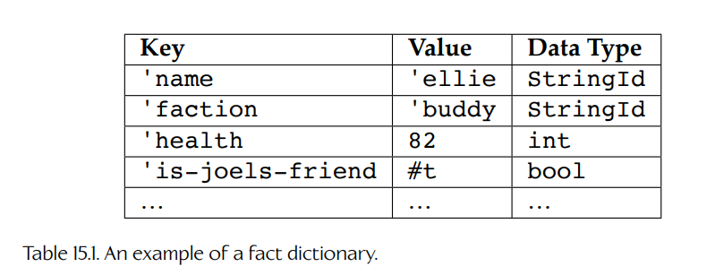
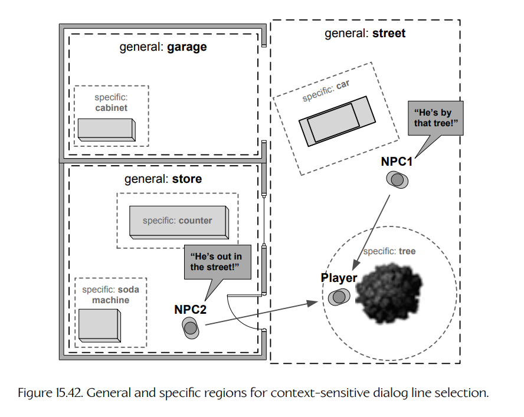

## 15.6 游戏特定音频功能

在 3D 音频渲染管线之上，游戏通常还会实现各种游戏特定的功能和系统。例如：

- **分屏支持**（split-screen support）。支持分屏游玩的多人游戏，必须提供某种机制，让 3D 游戏世界中的多个听者能够共享客厅中的同一组扬声器。
- **物理驱动音频**（physics-driven audio）。支持动态物理模拟对象的游戏，例如碎片、可破坏物体和布娃娃，需要一种方式，在物体发生碰撞、滑动、滚动和破裂时播放合适的音频。
- **动态音乐系统**（dynamic music system）。许多剧情驱动游戏需要音乐能够实时适应游戏事件的情绪和紧张程度。
- **角色对白系统**（character dialog system）。AI 驱动的角色如果能彼此交谈，并且能与玩家角色交谈，会显得真实得多。
- **声音合成**（sound synthesis）。有些引擎仍然提供“从零开始”合成声音的能力，即以不同音量和频率组合各种波形（正弦波、方波、锯齿波等）。高级合成技术也正逐渐适用于实时游戏。例如：
  - **乐器合成器**（musical instrument synthesizers）可以在不使用预录音频的情况下，再现模拟乐器的自然声音。
  - **基于物理的声音合成**（physically-based sound synthesis）涵盖一大类技术，它们试图准确再现物体在虚拟环境中进行物理交互时会产生的声音。这类系统会结合现代物理模拟引擎所提供的接触、动量、力、扭矩和形变信息，以及物体材料属性和几何形状，来合成适合撞击、滑动、滚动、弯曲等情况的声音。这里列出一些关于这一迷人主题的研究链接：[375]、[376]、[377] 和 [378]。
  - **车辆引擎合成器**（vehicle engine synthesizers）旨在根据虚拟引擎的加速度、RPM、负载以及车辆机械运动等输入，再现车辆发出的声音。（Naughty Dog 三部 *Uncharted* 游戏中的车辆追逐段落都使用了各种形式的动态引擎建模，不过严格来说，这些系统并不是合成器，因为它们是通过在各种预录声音之间交叉淡入淡出来生成输出的。）
  - **发音语音合成器**（articulatory speech synthesizers）通过人体声道的 3D 模型“从零开始”生成人类语音。VocalTractLab [379] 是一个免费工具，可供学生学习和实验语音合成。
- **人群建模**（crowd modeling）。包含人群（观众、城市居民等）的游戏，需要某种方式渲染人群的声音。这并不像把大量人声简单叠加在一起那么简单。相反，通常需要把人群建模为多层声音，包括背景环境声和个体发声。

我们不可能在一章中涵盖上面列表中的所有内容。不过，下面几页会继续介绍一些最常见的游戏特定功能。

### 15.6.1 支持分屏

支持分屏多人游戏是一个棘手的问题，因为虚拟游戏世界中有多个听者，但他们必须共享玩家客厅中的同一组扬声器。如果只是把声音进行多次声像定位，每个听者一次，然后把结果均匀混合到扬声器中，结果并不会听起来合理。不存在完美的解决方案。例如，如果玩家 A 正站在爆炸旁边，而玩家 B 站得很远，那么操控玩家 B 的人仍然会听到清晰响亮的爆炸声。游戏能做的最好事情，是拼凑出一种混合方案：有些声音按“物理上正确”的方式处理，另一些声音则进行“调整”或“折中”，以便为玩家提供最合理的听觉体验。

### 15.6.2 角色对白

即使已经为游戏创造了看起来像真人照片一样的角色，即使这些角色的运动也极其真实，在它们开口说话之前，它们仍然不会让玩家觉得真实。语音会传达对玩法至关重要的信息。它是核心叙事工具，也会巩固玩家与游戏角色之间的情感纽带。语音还可能成为玩家判断游戏中 AI 控制角色是否“智能”的决定性因素。

在 2002 年的 Game Developer’s Conference（GDC）上，Bungie 的 Chris Butcher 和 Jaime Griesemer 做了一场题为 “The Illusion of Intelligence: The Integration of AI and Level Design in Halo” 的演讲 [380]。在演讲中，他们分享了一个轶事，说明语音对于向玩家传达 AI 驱动角色动机有多重要。在 *Halo* 中，当一支 Covenant 小队的 Elite 头领被杀时，grunt 会全部惊恐逃跑。在一轮又一轮测试中，似乎没有玩家理解是 Elite 被杀触发了 grunt 的逃跑。最后，grunt 被加入了一些台词，大意是“头领死了——快跑！”直到这时，测试玩家才真正明白发生了什么。

在本节中，将介绍几乎所有以角色为核心的游戏都会具备的角色对白系统中的一些基础子系统。还会讨论 Naughty Dog 在 *The Last of Us* 中用于创建丰富、真实对话的一些具体技术。如果想了解更多信息，并观看 Naughty Dog 角色对白系统实际运行的游戏内视频，可以查看我在 GDC 2014 上所做的演讲 “Context-Aware Character Dialog in The Last of Us”，该演讲以 PDF 和 QuickTime 格式发布于 [59]。

#### 15.6.2.1 赋予角色声音

给游戏角色一个声音本身很容易——只要在角色需要说话时播放合适的预录声音即可。然而，事情从来没有那么简单。游戏引擎中的对白系统通常是一个相当复杂的系统。以下只是其中几个原因：

- 需要一种方式来编目每个角色可能会说的所有对白，并给每一句对白某种唯一 ID，以便游戏在需要时触发它们。
- 需要确保游戏中每个可唯一识别的角色，都拥有可识别且一致的声音。例如，在 *The Last of Us* 的 Pittsburgh 段落中，每一个 hunter 都被分配给八个唯一声音之一，这样同一场战斗中的两个 hunter 就不会听起来一样。
- 可能无法预先知道哪一个角色会被要求说某一句特定台词，因此常常需要用多个不同配音演员录制同一句台词，以便在需要时使用合适的声音来说这句话。
- 通常还希望说出的内容具有大量变化。因此，大多数对白系统都会提供一种机制，从候选池中随机选择具体台词。
- 语音音频资源往往持续时间较长，这意味着它们会占用大量内存。许多对白台词属于过场动画序列，因此在整个游戏中只会说一次。基于这些原因，把语音资源存储在内存中通常是浪费的。相反，语音音频资源通常会按需流式传输（见 Section 15.5.7.4）。

通常，其他发声内容也会由处理对白的同一系统处理，例如角色搬起重物、跳过障碍物或腹部挨打时发出的“用力声”。这主要是因为角色的这些用力声需要与其说话声音相匹配。因此，不妨利用对白系统来生成这些用力声。

#### 15.6.2.2 定义一条对白

大多数对白系统都会在“说话请求”和“具体要播放的音频片段”之间引入一层间接性。游戏程序员或设计师请求的是**逻辑对白行**（logical lines of dialog），每一条逻辑对白都由一个唯一标识符表示，例如字符串，或者更好的是一个哈希字符串 ID（见 Section 6.4.3.1）。声音设计师随后可以为每一条逻辑对白“填入”一个或多个音频片段，以便在声音质量和具体措辞方面提供必要的变化。

例如，假设有一条逻辑对白，角色说出的意思是 “I’m out of ammo.” 我们为这条逻辑对白分配唯一 ID `'line-out-of-ammo`，其中开头的单引号表示这是一个哈希字符串 ID。同时假设可能有十个不同角色会说这句话：玩家角色（称为 “drake”）、玩家的伙伴（称为 “elena”），以及最多八个敌方角色（称为 “pirate-a” 到 “pirate-h”）。我们需要某种数据结构来定义构成这一条逻辑对白的全部物理音频资源。

在 Naughty Dog，声音设计师使用 Scheme 编程语言，并通过自定义语法来定义逻辑对白行。下面的示例也使用类似的语法。不过，具体实现细节在这里并不重要。真正关注的是数据本身的结构：

```scheme
(define-dialog-line 'line-out-of-ammo
    (character 'drake
        (lines
            drk-out-of-ammo-01   ;; "Dammit, I'm out!"
            drk-out-of-ammo-02   ;; "Crap, need more bullets."
            drk-out-of-ammo-03   ;; "Oh, now I'm REALLY mad."
        )
    )
    (character 'elena
        (lines
            eln-out-of-ammo-01   ;; "Help, I'm out!"
            eln-out-of-ammo-02   ;; "Got any more bullets?"
        )
    )
    (character 'pirate-a
        (lines
            pira-out-of-ammo-01  ;; "I'm out!"
            pira-out-of-ammo-02  ;; "Need more ammo!"
            ;; ...
        )
    )
    ;; ...
    (character 'pirate-h
        (lines
            pirh-out-of-ammo-01  ;; "I'm out!"
            pirh-out-of-ammo-02  ;; "Need more ammo!"
            ;; ...
        )
    )
)
```

与其像上面那样把对白行定义在一个庞大的单体数据结构中，通常更好的做法是按角色把这些对白行拆分到不同文件中。例如，Drake 的所有台词可以放在一个文件中，Elena 的放在另一个文件中，而所有 pirates 的台词可以放在第三个文件中。这样有助于防止声音设计师彼此踩到对方的工作内容。同时，这也意味着可以更高效地管理内存。例如，如果游戏某一段中没有 pirates，就没有必要把 pirates 的对白行数据保留在内存里。出于同样原因，按关卡拆分对白数据通常也是个好主意。

#### 15.6.2.3 播放一条对白

有了这些数据后，对白系统就可以很容易地把对某一条逻辑对白（例如 `'line-out-of-ammo`）的请求转换成具体的音频片段。它只需在表中查找角色对应的具体 voice id，然后在该角色各种可能的台词中随机选择一个。

通常最好实现某种机制，确保台词不会过于频繁地重复。一种做法是把各种台词的索引存储在一个数组中，然后随机打乱数组内容。选择台词时，只需要按顺序遍历这个已经打乱的数组。等所有可能的台词都耗尽之后，再重新洗牌，同时注意最近播放过的那句台词不要排在第一个位置。这样既能防止重复，又能让台词选择听起来保持随机。

对白行请求通常由 C++、Java、C# 或游戏所使用的其他语言中的玩法代码发出。游戏设计师也可能通过脚本（Lua、Python 等）请求对白行。对白系统的 API 通常会以易用性为目标进行设计。如果 AI 程序员或游戏设计师为了播放一句对白，需要跳过一大堆繁琐步骤，你可能会发现你的角色诡异地沉默。最好提供一个简单的、发出后即可不用管的接口，把所有困难工作都留给构建对白系统的程序员。

例如，在 *Uncharted 3: Drake’s Deception* 中，C++ 代码可以通过调用 `Npc` 类的一个简单 `PlayDialog()` 成员函数，要求角色播放一条对白。这些调用会散布在 AI 决策代码中，以便在游戏的关键时刻触发合适的对白。例如：

```cpp
void Skill::OnEvent(const Event& evt)
{
    Npc* pNpc = GetSelf(); // grab a pointer to the NPC

    switch (evt.GetMessage())
    {
    case SID("player-seen"):
        // play a line of dialog...
        pNpc->PlayDialog(SID("line-player-seen"));
        // ... and move to closest cover
        pNpc->MoveTo(GetClosestCover());
        break;
    // ...
    }

    // ...
}
```

#### 15.6.2.4 优先级与打断

如果角色被要求说话时，它已经在说话，会发生什么？如果它在同一帧内收到多个语音命令，又会发生什么？在这两种情况下，**优先级系统**（priority system）都是解决歧义的好办法。

要实现这样的系统，只需给每一条对白分配一个优先级等级。当说某条对白的请求进入时，系统会查看当前正在播放的对白（如果有的话）的优先级，以及当前帧内已请求的所有对白行的优先级。然后找出优先级最高的那条。如果当前正在播放的对白“获胜”，则它继续播放，请求的对白会被忽略。如果某条请求的对白优先级高于当前对白，或者角色目前没有在说话，那么就播放新的对白，并在必要时打断当前对白。

真正打断语音本身其实有点棘手。不能简单地进行交叉淡入淡出（即把当前播放声音音量降低，同时把新声音音量升高），因为这会在应用到单个角色语音时听起来奇怪且错误。理想情况下，希望在开始新台词之前至少播放某种声门塞音。甚至可以播放一个短语，表示角色对被打断感到惊讶或恼怒，然后再播放新的对白。*The Last of Us* 中的对白系统并没有做这些复杂的事情。它只是停止当前台词，并立即播放新台词。大多数时候，这听起来效果相当不错。当然，每个游戏都有自己独特的语音模式，在一个游戏中可行的东西，在另一个游戏中未必好用。所以正如俗话所说：“效果因情况而异。”

#### 15.6.2.5 对话

在 *The Last of Us* 中，Naughty Dog 希望敌方 NPC 听起来像是在彼此进行真实交谈。这意味着角色需要能够说出相对较长的台词链，并在两个或更多角色之间来回对话。同样，在 *Uncharted 4: A Thief’s End* 和 *Uncharted: The Lost Legacy* 中，希望角色在驾驶或乘坐 Madagascar 和 India 的 jeep 时能够对话。这些对话甚至可以被打断（例如玩家决定离开 jeep 去探索区域），并在玩家返回车辆时从中断处继续。

*The Last of Us*、*Uncharted 4* 和 *The Lost Legacy* 中的对话由逻辑**片段**（segments）构成。每个片段对应一条逻辑对白，由对话中的某一个特定参与者说出。每个片段都被赋予唯一 ID，这些片段再通过这些 ID 串联成一段对话。作为示例，来看下面这段对话如何定义：

**A：** “Hey, did you find anything?”

**B：** “No, I’ve been looking for an hour and I ain’t found nothin’.”

**A：** “Well then shut up and keep looking!”

这段对话可以在 Naughty Dog 的对话系统中表示如下：

```scheme
(define-conversation-segment 'conv-searching-for-stuff-01
    :rule []
    :line 'line-did-you-find-anything
        ;; "Hey, did you find anything?"
    :next-seg 'conv-searching-for-stuff-02
)
(define-conversation-segment 'conv-searching-for-stuff-02
    :rule []
    :line 'line-nope-not-yet
        ;; "I've been looking for an hour..."
    :next-seg 'conv-searching-for-stuff-03
)
(define-conversation-segment 'conv-searching-for-stuff-03
    :rule []
    :line 'line-shut-up-keep-looking
        ;; "Well then shut up and keep looking!"
)
```

乍一看，这种语法可能显得有些冗长。但正如 Section 15.6.2.8 中将看到的，把对话像这样拆分出来会带来很大的灵活性。例如，它允许以一种自然且相当方便的方式定义分支对话。

#### 15.6.2.6 打断对话

在 Section 15.6.2.4 中已经看到，可以使用一个简单的优先级系统来处理打断，并在同一时间请求多条逻辑对白时解决竞争问题。

当正在播放的是**对话**（conversation）时，仍然可以使用优先级系统。但在这种情况下，实现会稍微复杂一些。例如，假设角色 A 和 B 正在对话。A 说完自己的台词后，B 说她的台词，而 A 正在等待轮到自己。在 B 说话期间，A 被要求播放一条完全不同的对白。从技术上讲，他此时并没有说话，所以如果按照对每个角色单独应用的对白优先级规则，应该没有问题，这条台词会播放。但这可能会听起来非常突兀，具体取决于说了什么内容。

**A：** “Hey, did you find anything?”

**B：** “No, I’ve been looking for an hour and…”

**A：** “Look, a shiny object!”  
*（被无关对白打断）*

**B：** “… I ain’t found nothin’.”

为了解决这个问题，在 *The Last of Us* 中引入了把对话视为“一等实体”（first-class entities）的概念。当一段对话开始时，系统“知道”每个角色都参与了这段对话，即使他们当前没有说话。每段对话都有优先级，优先级规则会应用于整段对话，而不是逐角色应用到单独台词上。因此，在上面的例子中，当角色 A 被要求说 “Look, a shiny object!” 时，系统知道他当前参与在 “Hey, did you find anything?” 这段对话中。可以推测 “Look, a shiny object!” 这句台词的优先级与当前对话相同或更低，因此不允许打断。

如果打断台词的优先级更高，例如 “Holy cow, he’s pointing a gun at us!”，那么该台词就允许打断现有对话。在这种情况下，对话中的所有角色都会被打断。结果是一种听起来自然且智能的打断：

**A：** “Hey, did you find anything?”

**B：** “No, I’ve been looking for an hour and…”

**A：** “Holy cow, he’s pointing a gun at us!”  
*（被更高优先级的对话打断）*

**B：** “Get him!”  
*（原始对话被新对话打断，A 和 B 进入战斗模式。）*

#### 15.6.2.7 独占性

在 *The Last of Us* 中，还引入了**独占性**（exclusivity）的概念。任意对白行或对话都可以被标记为**非独占**（non-exclusive）、**阵营独占**（faction-exclusive）或**全局独占**（globally exclusive）。这种标记控制给定对白行或对话的打断方式。

- **非独占**的对白行或对话允许覆盖在其他对白行或对话之上播放。例如，在搜索玩家期间，如果一个 hunter 自言自语 “Huh, there’s nothing over here.”，同时另一个 hunter 说 “I’m getting tired of this.”，这并不是大问题。这两个 hunter 并没有彼此对话，所以重叠听起来完全自然。
- **阵营独占**的对白行或对话会打断该角色所属阵营内的所有其他对白或对话。例如，如果玩家（Joel）在搜索期间被发现，看到他的 hunter 可能会说 “He’s over here!” 其他 hunter 应该立即停止说话，因为需要让人感觉这些 hunter 能够彼此听见，同时也要向玩家传达他们的集体注意力已经转移。不过，如果 Joel 的伙伴 Ellie 正在向他低声发出警告，我们可能不希望打断她。她不是 hunter 阵营的一员，而且不管 hunter 是否发现了 Joel，她对 Joel 说的内容都是相关的。
- **全局独占**的对白行或对话会跨越阵营边界打断所有其他对白。这适用于任何在听觉范围内的角色都应该对所听到内容做出反应的情况。

#### 15.6.2.8 选择与分支对话

根据玩家行为、AI 角色决策和/或游戏世界状态的其他方面，让对话以不同方式展开，通常是很有价值的。在创作或编辑对话时，编剧和声音设计师希望不仅能控制说出哪些台词，还能控制在玩法过程中任意给定时刻由哪一条逻辑条件决定对话分支。这把创作权交给真正需要它的人，而不是迫使他们通过程序员完成工作。

Naughty Dog 为 *The Last of Us* 实现了这样一个系统。该系统在一定程度上受到 Valve 早期系统的启发，Valve 的系统由 Elan Ruskin 在 2012 年 Game Developer’s Conference 的演讲 “Rule Databased for Contextual Dialog and Game Logic” 中介绍。该演讲可见 [381]。Naughty Dog 的对话系统在许多重要方面不同于 Valve 的系统，但二者背后的核心思想相似。这里将介绍 Naughty Dog 的系统，因为这是作者最熟悉的系统。

在 Naughty Dog 的对话系统中，一个对话片段可以包含一条或多条候选对白。片段中的每个候选项都带有一条**选择规则**（selection rule）。如果规则求值为 true，该候选项就被选中；如果规则求值为 false，该候选项就会被忽略。

一条规则由一个或多个条件组成。每个条件都是一个简单的逻辑表达式，求值结果为布尔值。表达式 `('health > 5)` 和 `('player-death-count == 1)` 就是条件示例。如果一条规则中提供了多个条件，它们会使用布尔 AND 运算符进行逻辑组合。只有当所有条件都求值为 true 时，该规则才求值为 true。

下面是一个对话片段示例，其中的候选项取决于说话角色的生命值：

```scheme
(define-conversation-segment 'conv-player-hit-by-bullet
    (
        :rule [ ('health < 25) ]
        :line 'line-i-need-a-doctor
            ;; "I'm bleeding bad... need a doctor!"
    )
    (
        :rule [ ('health < 75) ]
        :line 'line-im-in-trouble
            ;; "Now I'm in real trouble."
    )
    (
        :rule [ ] ;; no criteria acts as an "else" case
        :line 'line-that-was-close
            ;; "Ah! Can't let that happen again!"
    )
)
```

**分支对白。**

通过把对话拆分成片段，并让每个片段包含一条或多条候选对白，我们就开启了制作分支对话的可能性。例如，考虑一段对话：Ellie（*The Last of Us* 中玩家的伙伴）在 Joel（玩家角色）中枪后问他是否还好。如果玩家实际上没有被子弹击中，对话会这样进行：

**Ellie：** “Are you OK?”

**Joel：** “Yeah, I’m fine.”

**Ellie：** “Geez. Keep your head down!”

如果 Joel 被击中了，对话会以不同方式展开：

**Ellie：** “Are you OK?”

**Joel：** “(panting) Not exactly.”

**Ellie：** “You’re bleeding!”

可以使用前面描述的对话语法表示这段分支对话：

```scheme
(define-conversation-segment 'conv-shot-at--start
    (
        :rule [ ]
        :line 'line-are-you-ok ;; "Are you OK?"
        :next-seg 'conv-shot-at--health-check
        :next-speaker 'listener ;; *** see comments below
    )
)

(define-conversation-segment 'conv-shot-at--health-check
    (
        :rule [ (('speaker 'shot-recently) == false) ]
        :line 'line-yeah-im-fine ;; "Yeah, I'm fine."
        :next-seg 'conv-shot-at--not-hit
        :next-speaker 'listener ;; *** see comments below
    )
    (
        :rule [ (('speaker 'shot-recently) == true) ]
        :line 'line-not-exactly ;; "(panting) Not exactly."
        :next-seg 'conv-shot-at--hit
        :next-speaker 'listener ;; *** see comments below
    )
)

(define-conversation-segment 'conv-shot-at--not-hit
    (
        :rule [ ]
        :line 'line-keep-head-down ;; "Geez. Keep your head down!"
    )
)

(define-conversation-segment 'conv-shot-at--hit
    (
        :rule [ ]
        :line 'line-youre-bleeding ;; "You're bleeding!"
    )
)
```

**说话者与听者。**

上面的分支对话中有一个微妙之处。在两人对话中的任意时刻，一个人是**说话者**（speaker），另一个人是**听者**（listener）。随着对话推进，说话者和听者的角色会来回切换。在对话的第一个片段 `'conv-shot-at--start` 中，Ellie 是说话者，Joel 是听者。当串联到下一个片段 `'conv-shot-at--health-check` 时，我们为字段 `:next-speaker` 指定值 `'listener`。这告诉系统使用当前听者（Joel）作为下一个片段的说话者，从而反转角色。在该片段中，通过条件 `(('speaker 'shot-recently) == false)` 和 `(('speaker 'shot-recently) == true)` 检查说话者最近是否被击中。现在 Joel 是说话者，所以一切都会按预期工作。

对于 Joel 和 Ellie 这样的两个主要角色之间的对话来说，一个抽象的说话者/听者系统似乎并没有那么有用。但只要让对话定义保持抽象，就能获得大量灵活性。一方面，可以使用同一份对话规范定义一段由 Joel 问 Ellie 是否还好的对话。这之所以可行，是因为整段对话的定义方式独立于哪一个角色说哪一句台词。此外，对于敌方角色来说，以通用方式定义对话是绝对必要的，因为无法预先知道究竟哪几个具体角色会说话。对于敌人战斗闲聊，通常会动态选择一对角色，然后启动对话。无论选择的是哪两个角色，它都必须能正常工作。

说话者/听者系统还可以扩展到两人或三人对话。Naughty Dog 的对话系统最多支持三个听者，不过绝大多数对话只发生在两个角色之间。

**事实字典。**

规则中的条件会引用类似 `'health` 和 `'player-death-count` 这样的符号量。这些符号量在底层实现为一个**字典**（dictionary）数据结构中的条目——基本上就是一张包含键值对的表。我们称这些字典为**事实字典**（fact dictionaries）。Table 15.1 展示了一个事实字典示例。



**Table 15.1.** 事实字典示例。

你可能已经注意到，在 Table 15.1 中，字典中的每个值都有一个关联的数据类型。换言之，字典中的值是**变体**（variants）。变体是一种数据对象，能够保存多种类型的值，很像 C 或 C++ 中的 union。不过，与 union 不同的是，变体还会存储它当前包含的数据类型信息。这样可以在使用值之前验证其类型。它还允许把数据从一种类型转换为另一种类型。例如，如果变体保存整数值 `42`，可以要求变体将其作为浮点值 `42.0f` 返回。

在 *The Last of Us* 中，每个角色都有自己的事实字典，包含关于该角色自身的事实，例如生命值、武器类型、警觉程度等。每个角色“阵营”也有一个事实字典。这样就可以表达关于整个阵营的事实，例如当前组中还活着多少角色。最后，还有一个单例“全局”事实字典，包含与阵营无关、关于整个游戏的信息。比如游玩时长、当前关卡名称，或者玩家重试某个任务的次数，都可以放入全局事实字典。

**条件语法。**

编写条件时，语法允许按名称从任意字典中拉取事实。例如，`(('self 'health) > 5)` 会告诉系统抓取角色自身的事实字典，在该字典中查找 `'health` 事实的值，然后检查它是否大于 5。同样，`(('global 'seconds-playing) <= 23.5)` 会指示系统从全局事实字典中查找 `'seconds-playing` 事实，并检查它是否小于等于 23.5 秒。

如果用户没有显式指定字典，如 `('health > 5)`，系统会按照预定义搜索顺序查找命名事实。首先检查角色的事实字典。如果失败，则尝试在与角色阵营匹配的字典中查找。最后，如果都失败，则在全局字典中查找该事实。这个“搜索路径”功能让声音设计师在编写条件时可以尽可能简洁（尽管代价是规则中的某些明确性和清晰性会降低）。

#### 15.6.2.9 上下文敏感对白

在 *The Last of Us* 中，希望敌方角色能够以智能方式喊出玩家的位置。如果玩家躲在商店里，敌人应该喊：“He’s in the store!” 如果玩家躲在车后面，希望坏人说：“He’s behind that car!” 这会让角色听起来非常智能，但事实证明，实现起来相对简单。

为此，声音设计师会给游戏世界标注区域。每个区域都带有两种**位置标签**（location tags）之一。**具体标签**（specific tag）会把区域标记为一个非常具体的位置，例如 “behind the counter” 或 “by the cash register”。**通用标签**（general tag）则把区域标记为一个更一般的位置，例如 “in the store” 或 “in the street”。



**Figure 15.42.** 用于上下文敏感对白行选择的通用区域与具体区域。

为了决定播放哪一句对白，系统会判断玩家位于哪个区域，以及敌方 NPC 位于哪个区域。如果二者都位于同一个通用区域中，就使用玩家的具体标签来选择对白行。当 NPC 和玩家位于不同的通用区域时，则退回使用玩家的通用区域标签来选择对白。因此，如果敌人和玩家都在商店里，可能会选择类似 “He’s by the window!” 的台词。但如果 NPC 在商店里，而玩家在街上，可能会听到 NPC 说：“He’s out in the street! Get him!” Figure 15.42 展示了该系统如何工作。

这个非常简单的系统被证明极其强大。由于需要录制和配置的台词组合数量巨大，它设置起来很困难，但最终的游戏内效果值得付出这些努力。

#### 15.6.2.10 对白动作

没有身体语言的对白通常看起来诡异且不真实。有些对白是作为全身动画的一部分说出的——例如游戏内过场动画。但也有一些台词必须在角色忙于其他事情时说出，例如行走、奔跑或开火。理想情况下，希望用一些手势给这些对白增加生命力。

在 *The Last of Us* 中，使用加性动画技术实现了一个手势系统（见 Section 13.6.5）。这些手势可以由 C++ 代码或脚本显式调用。此外，每条对白都可以关联一个脚本，其时间线与音频同步。这让系统可以在关键台词中的精确时刻触发手势。

### 15.6.3 音乐

音乐是几乎任何优秀游戏中都极其重要的方面。它设定基调，驱动玩家的紧张感，并且可以成就（或毁掉）一个情感场景。游戏引擎的音乐系统通常负责以下任务：

- 提供以流式音频片段形式播放音乐轨道的能力（因为音乐片段几乎总是太大，无法放入内存）。
- 提供音乐变化。
- 让音乐与游戏中发生的事件相匹配。
- 从一段音乐无缝过渡到另一段音乐。
- 以合适且悦耳的方式，将音乐与游戏中的其他声音进行混音。
- 允许音乐被临时压低，以增强游戏中特定声音或对话的可听性。
- 允许被称为 **stingers** 的短音乐片段或音效临时打断当前播放的音乐轨道。
- 允许音乐被暂停和重新开始。（毕竟，不需要在每一秒玩法中都播放宏大的主题曲！）

通常希望音乐能够变化，以匹配游戏事件中不断变化的紧张程度和/或情绪状态。一种实现方式是创建多个**播放列表**（playlists），每个播放列表对应游戏中的某个紧张程度或情绪状态。每个播放列表包含一首或多首音乐，系统可以从中随机或按顺序选择。随着游戏中的紧张程度和情绪变化——战斗开始和结束，感人的过场动画出现和结束，等等——音乐系统会检测这些变化，并在合适时选择新的音乐播放列表。有些游戏会实现一个随紧张程度增加而变化的音乐选择“栈”：没有敌人时播放平静音乐，玩家接近一群未察觉敌人时播放紧张音乐，首次接触敌人时播放启动音乐，战斗时播放快节奏音乐。

**Stingers** 是另一种让音乐与游戏事件相匹配的方式。stinger 是一种短音乐片段或音效，可以临时打断当前播放的音乐轨道，或者在音乐轨道继续播放时覆盖在其上。例如，当玩家第一次与新敌人形成视线接触时，可能希望播放一个不祥的“隆隆”声，以提示玩家危险临近。或者当玩家死亡时，可能希望快速切换到一小段“死亡音乐”。这两种情况都可能使用 stinger。

在不同音乐流之间平滑过渡有一定挑战。不能盲目地在两段完全无关的音乐之间交叉淡入淡出，并期待它总是听起来很好。两段音乐的速度可能不匹配，并且其中一段音乐的“拍点”可能与另一段音乐不对齐。关键是要正确安排每次过渡。如果速度不匹配，快速交叉淡入淡出可能有用；如果速度几乎相同，较长的交叉淡入淡出可能效果不错。要做好这件事，需要进行一些试错。甚至让一段音乐正确循环，也需要声音工程师进行一些调整。

游戏音乐是一个很广泛的话题，这里无法真正充分展开。如果想进一步了解，[50] 是一本很好的入门书。