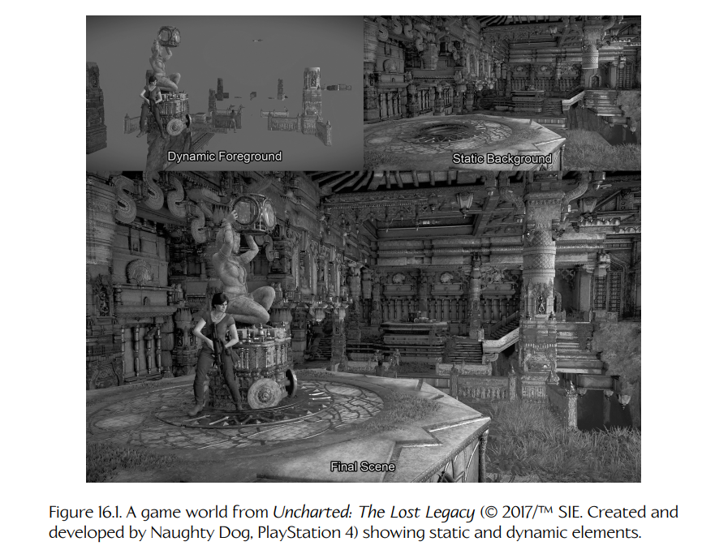
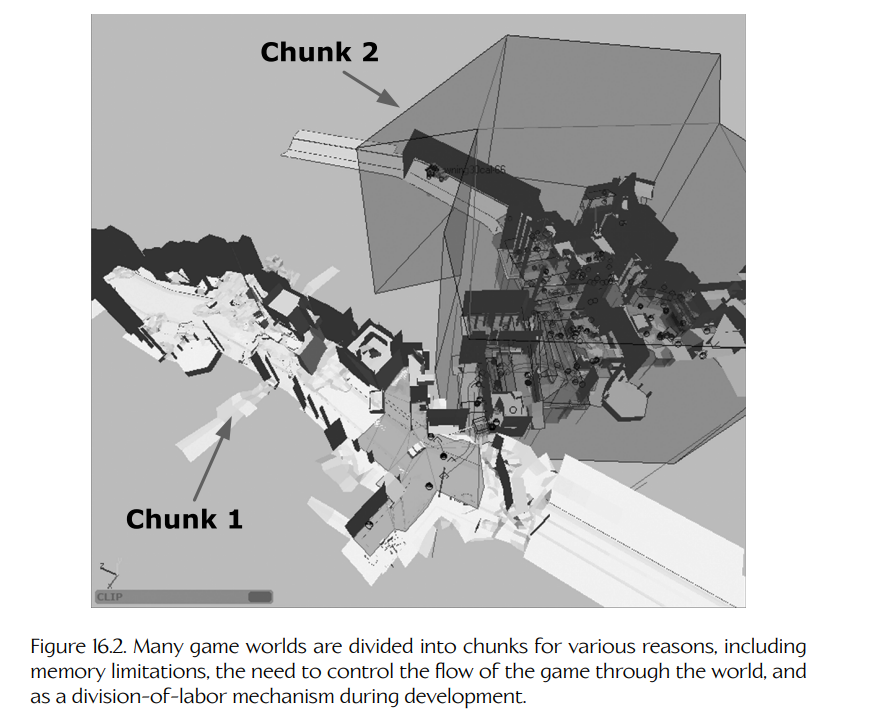

## 16.1 游戏世界的解剖结构

玩法设计在不同类型之间、不同游戏之间差异很大。即便如此，大多数 3D 游戏，以及相当一部分 2D 游戏，或多或少都符合若干基本结构模式。我们将在以下各节讨论这些模式，但请记住，必然也会有一些游戏并不能整齐地归入这种模型。

### 16.1.1 世界元素

大多数电子游戏都发生在一个二维或三维的虚拟**游戏世界**（game world）中。这个世界通常由许多离散元素组成。一般来说，这些元素可分为两类：静态元素和动态元素。静态元素包括地形、建筑、道路、桥梁，以及几乎所有不会移动或不会以主动方式与玩法发生交互的东西。动态元素包括角色、载具、武器、漂浮的强化道具和医疗包、可收集物体、粒子发射器、动态光源、用于检测游戏中重要事件的不可见区域、定义物体路径的样条曲线，等等。Figure 16.1 展示了游戏世界的这种划分方式。

玩法通常集中在游戏的动态元素之中。显然，静态背景的布局对于游戏最终如何展开具有关键作用。例如，如果一款掩体射击游戏发生在一个巨大、空旷、矩形的房间里，它大概不会多么有趣。然而，用于实现玩法的软件系统主要关心的是更新动态元素的位置、朝向和内部状态，因为这些元素会随时间发生变化。**游戏状态**（game state）一词指的是所有动态游戏世界元素作为整体时的当前状态。

动态元素与静态元素的比例也会因游戏而异。大多数 3D 游戏由数量相对较少的动态元素组成，这些动态元素在相对较大的静态背景区域中移动。另一些游戏，如经典街机游戏 *Asteroids* 或 Xbox 360 复古热门作品 *Geometry Wars*，几乎没有值得一提的静态元素（除了一块黑色屏幕）。就 CPU 资源而言，游戏中的动态元素通常比静态元素更加昂贵，因此大多数 3D 游戏都会受限于只能拥有有限数量的动态元素。不过，动态元素与静态元素的比例越高，游戏世界在玩家看来就越“有生命力”。随着游戏硬件变得越来越强大，游戏正在实现越来越高的动态/静态比例。

**Figure 16.1.** 来自 *Uncharted: The Lost Legacy*（© 2017™ SIE，由 Naughty Dog 为 PlayStation 4 创作并开发）的游戏世界，展示了静态元素和动态元素。

需要注意的是，游戏世界中动态元素与静态元素之间的区别往往有些模糊。例如，在街机游戏 *Hydro Thunder* 中，瀑布在某种意义上是动态的：它们的纹理是动画化的，底部有动态雾效，而且游戏设计师可以将它们放入游戏世界中，并相对于地形和水面独立定位。然而，从工程角度来看，瀑布会被当作静态元素处理，因为它们不会以任何方式与比赛中的船只发生交互（除了遮挡玩家对隐藏加速道具和秘密通道的视线）。不同游戏引擎会在静态元素与动态元素之间划定不同界线，有些引擎甚至完全不做这种区分（也就是说，任何东西都潜在地可以是动态元素）。

静态与动态之间的区分主要是一种优化工具——当我们知道某个对象的状态不会发生变化时，就可以少做很多工作。例如，当我们知道某个网格是静态的并且永远不会移动时，它的光照就可以以静态顶点光照、光照贴图、阴影贴图、静态环境光遮蔽信息，或预计算辐射传输（precomputed radiance transfer, PRT）球谐系数的形式进行预计算。几乎任何必须在运行时为动态世界元素执行的计算，在应用于静态元素时，都很适合作为预计算或直接省略的候选项。

拥有可破坏环境的游戏展示了游戏世界中静态元素与动态元素之间的界线如何变得模糊。例如，我们可以为每一个静态元素定义三个版本：未损坏版本、受损版本和完全摧毁版本。这些背景元素大多数时候表现得像静态世界元素，但在爆炸期间可以被动态替换，从而制造出它们正在受损的错觉。实际上，静态世界元素和动态世界元素只是各种可能优化方案连续谱上的两个极端。我们在这两类之间划线的位置（如果确实要划线的话），会随着优化方法的变化以及游戏设计需求的变化而改变。

#### 16.1.1.1 静态几何体

静态世界元素的几何体通常在 Maya 这样的工具中定义。它可以是一个巨大的三角形网格，也可以被拆分成离散的部件。场景中的静态部分有时会由**实例化几何体**（instanced geometry）构成。实例化是一种节省内存的技术：将数量相对较少的唯一三角形网格在游戏世界中的不同位置和朝向上多次渲染，以制造出多样性的错觉。例如，3D 建模师可能会创建五种不同类型的短墙段，然后将它们以随机组合的方式拼接起来，从而构造出数英里看似各不相同的墙体。

静态视觉元素和碰撞数据也可以由**笔刷几何体**（brush geometry）构建。这类几何体起源于 Quake 系列引擎。**笔刷**（brush）将一个形状描述为一组凸体，每个凸体都由一组平面围成。笔刷几何体创建起来快速而容易，并且能很好地集成到基于 BSP 树的渲染引擎中。笔刷对于快速搭建游戏世界内容的草案非常有用。这样可以在成本较低时尽早测试玩法。如果布局证明值得保留，团队就可以为笔刷几何体添加纹理贴图并进行细调，或者用更精细的自定义网格资源替换它。另一方面，如果关卡需要重新设计，笔刷几何体也可以很容易地修改，而不会给美术团队带来大量额外工作。

### 16.1.2 世界分块

当一款游戏发生在一个非常庞大的虚拟世界中时，这个世界通常会被划分为离散的可玩区域，我们将其称为**世界分块**（world chunks）。分块也称为**关卡**（levels）、**地图**（maps）、**阶段**（stages）或**区域**（areas）。玩家在游戏过程中通常在任意时刻只能看到少量分块，并且会随着游戏展开从一个分块推进到另一个分块。

最初，“关卡”这一概念是作为一种机制被发明出来的，用来在早期游戏硬件的内存限制下提供更丰富的玩法变化。同一时刻内存中只能存在一个关卡，但玩家可以从一个关卡推进到另一个关卡，从而获得更加丰富的整体体验。此后，游戏设计已经向许多方向发展，线性关卡式游戏在今天已经不那么常见。有些游戏本质上仍然是线性的，但世界分块之间的边界通常不像过去那样对玩家明显。另一些游戏使用星形拓扑结构，玩家从一个中心枢纽区域开始，并可以从该枢纽随机访问其他区域（也许只有在这些区域被解锁之后才能访问）。还有一些游戏采用类似图结构的拓扑，其中各区域以任意方式彼此连接。还有一些游戏则提供广阔开放世界的幻觉，并使用细节层次（level-of-detail, LOD）技术来减少内存开销并提升性能。

尽管现代游戏设计非常丰富，但除了最小型的游戏世界外，几乎所有游戏世界仍然会被划分为某种形式的分块。这样做有若干原因。首先，内存限制仍然是一个重要约束（而且会一直如此，直到拥有无限内存的游戏机器进入市场为止！）。世界分块也是控制游戏整体流程的一种方便机制。分块还可以作为一种分工机制；每个分块可以由一个相对较小的设计师和美术师团队来构建和管理。Figure 16.2 展示了世界分块。

**Figure 16.2.** 许多游戏世界会出于各种原因被划分为分块，包括内存限制、控制玩家在世界中推进的游戏流程，以及在开发过程中作为一种分工机制。

### 16.1.3 高层游戏流程

一款游戏的**高层流程**（high-level flow）定义了玩家**目标**（objectives）的一个序列、树或图。目标有时也称为**任务**（tasks）、**阶段**（stages）、**关卡**（levels，这个术语也可以用于世界分块）或**波次**（waves，如果游戏主要围绕击败一波又一波攻击敌人展开）。高层流程还会为每个目标给出成功判据（例如，清除所有敌人并拿到钥匙）以及失败惩罚（例如，回到当前区域的起点，并可能在此过程中失去一条“命”）。在叙事驱动型游戏中，这一流程还可能包含各种游戏内影片，用于随着故事展开推进玩家对剧情的理解。这些序列有时称为**过场动画**（cut-scenes）、**游戏内电影**（in-game cinematics, IGC）或**非交互式序列**（noninteractive sequences, NIS）。当它们被离线渲染并像全屏电影一样回放时，这类序列通常称为**全动态影像**（full-motion videos, FMV）。

早期游戏会将玩家目标与特定世界分块进行一对一映射（这也是“level”一词具有双重含义的原因）。例如，在经典街机游戏 *Donkey Kong* 中，每个新关卡都会给 Mario 呈现一个新的目标（也就是，到达结构顶部并推进到下一关）。然而，在现代游戏设计中，世界分块与目标之间的一对一映射已经不那么流行。每个目标会与一个或多个世界分块相关联，但分块与目标之间的耦合会被有意保持得比较松散。这种设计提供了独立修改游戏目标和世界划分的灵活性；从游戏开发的后勤和实践角度看，这一点极为有用。许多游戏会将目标组织成更粗粒度的玩法段落，通常称为**章节**（chapters）或**幕**（acts）。Figure 16.3 展示了一种典型的玩法架构。