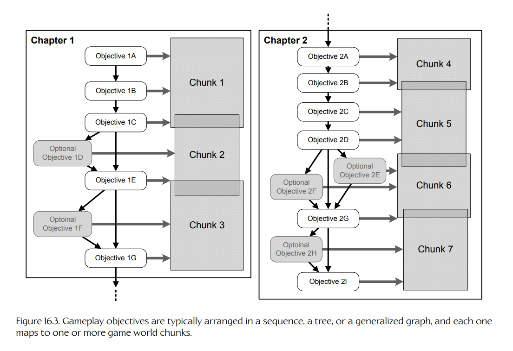

## 16.2 实现动态元素：游戏对象

游戏中的动态元素通常以面向对象的方式来设计。这种方法直观而自然，也能很好地映射到游戏设计师关于世界如何构成的理解之上。设计师可以想象角色、载具、漂浮的医疗包、会爆炸的油桶，以及无数其他动态对象在游戏中四处移动。因此，很自然地，我们会希望能够在游戏世界编辑器中创建并操纵这些元素。同样，程序员通常也会觉得，将动态元素实现为运行时大体上自主行动的代理（autonomous agents）是很自然的。在本书中，我们将使用**游戏对象**（game object, GO）这一术语，指代游戏世界中几乎任何动态元素。然而，这套术语在行业内绝不是标准说法。游戏对象通常也被称为**实体**（entities）、**演员**（actors）或**代理**（agents），类似术语还有很多。

**Figure 16.3.** 玩法目标通常被组织成序列、树或广义图结构，并且每个目标都会映射到一个或多个游戏世界分块。

按照面向对象设计的惯例，一个游戏对象本质上是一组**属性**（attributes，即对象的当前状态）和**行为**（behaviors，即状态如何随时间变化以及如何响应事件）的集合。游戏对象通常按**类型**（type）分类。不同类型的对象具有不同的属性模式和不同的行为。某一特定类型的所有**实例**（instances）共享同一套属性模式和同一组行为，但属性的**取值**（values）会因实例而异。（注意，如果某个游戏对象的行为是数据驱动的，例如通过脚本代码，或通过一组数据驱动规则来控制该对象对事件的响应，那么行为本身也可以逐实例变化。）

区分**类型**（type）和某一类型的**实例**（instance）非常关键。例如，*Pac-Man* 游戏包含四种游戏对象类型：幽灵、豆子、能量豆和 Pac-Man。然而，在任意时刻，游戏中可能最多有四个“幽灵”类型的实例、50 到 100 个“豆子”类型的实例、四个“能量豆”实例，以及一个“Pac-Man”类型的实例。

大多数面向对象系统都会提供某种机制，用于实现属性、行为或二者的**继承**（inheritance）。继承鼓励代码和设计复用。继承具体如何工作，在不同游戏之间差异很大，但大多数游戏引擎都会以某种形式支持它。

### 16.2.1 游戏对象模型

在计算机科学中，**对象模型**（object model）这一术语有两个相关但不同的含义。它可以指某种特定编程语言或形式化设计语言所提供的一组特性。例如，我们可以谈论 C++ 对象模型，或 OMT 对象模型。它也可以指某种具体的面向对象编程接口（也就是为解决某一特定问题而设计的一组类、方法及其相互关系）。后一种用法的一个例子是 Microsoft Excel 对象模型，它允许外部程序以各种方式控制 Excel。（关于 object model 这一术语的进一步讨论，见 [383]。）

在本书中，我们将使用**游戏对象模型**（game object model）这一术语，描述游戏引擎为了对虚拟游戏世界中的动态实体进行建模和模拟而提供的功能。从这个意义上说，game object model 同时具有上述两个定义中的部分特征：

- 一款游戏的对象模型是一种具体的面向对象编程接口，旨在解决模拟构成某一特定游戏的一组具体实体这一问题。
- 此外，一款游戏的对象模型通常会扩展引擎所使用的编程语言。如果游戏是用 C 这样的非面向对象语言实现的，程序员可以自行添加面向对象设施。即便游戏是用 C++ 这样的面向对象语言编写的，也经常会添加反射、持久化和网络复制等高级特性。游戏对象模型有时会融合多种语言的特性。例如，游戏引擎可能会将 C 或 C++ 这样的编译型编程语言与 Python、Lua 或 Pawn 这样的脚本语言结合起来，并提供一个可从任一语言访问的统一对象模型。

### 16.2.2 工具侧设计与运行时设计

通过世界编辑器呈现给设计师的对象模型（将在 [Section 16.4](04-the-game-world-editor.md#164-游戏世界编辑器) 中讨论）不一定与运行时用于实现游戏的对象模型相同。

- 工具侧游戏对象模型在运行时可能使用一种完全没有原生面向对象特性的语言来实现，例如 C。
- 工具侧的单个 GO 类型，在运行时可能会被实现为一组类的集合，而不是人们一开始可能预期的单个类。
- 每个工具侧 GO 在运行时可能只不过是一个唯一 ID，其所有状态数据都存储在表格中，或存储在一组松散耦合对象的集合中。

因此，一款游戏实际上拥有两个彼此不同但又紧密相关的对象模型：

- **工具侧对象模型**（tool-side object model）由设计师在世界编辑器中看到的一组**游戏对象类型**（game object types）定义。
- **运行时对象模型**（runtime object model）由程序员为在运行时实现工具侧对象模型而使用的一组语言构造和软件系统定义。运行时对象模型可能与工具侧模型完全相同，或直接映射到工具侧模型；也可能在底层实现上与工具侧模型完全不同。

在某些游戏引擎中，工具侧设计与运行时设计之间的界线是模糊的，甚至并不存在。在另一些引擎中，这条界线则划分得非常清楚。有些引擎中，工具与运行时实际上共享同一套实现。在另一些引擎中，运行时实现相对于工具侧视角来说几乎完全陌生。实现层面的某些方面几乎总会渗入工具侧设计中，游戏设计师必须意识到他们所构建的游戏世界、设计的玩法规则以及对象行为会对性能和内存消耗产生影响。即便如此，几乎所有游戏引擎都会拥有某种形式的工具侧对象模型，以及与该对象模型相对应的运行时实现。
