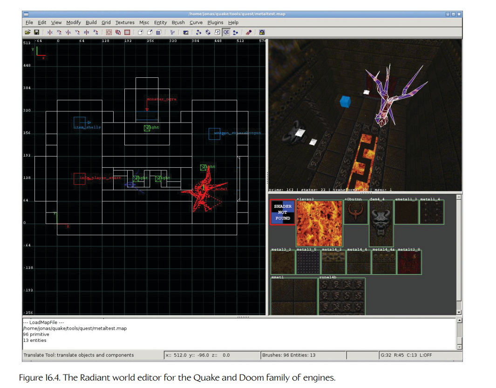
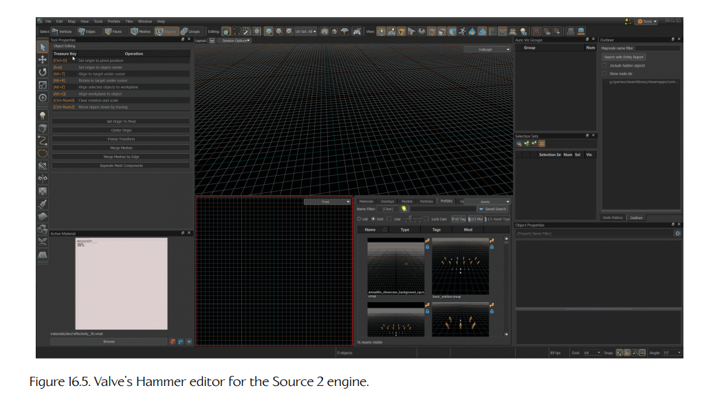
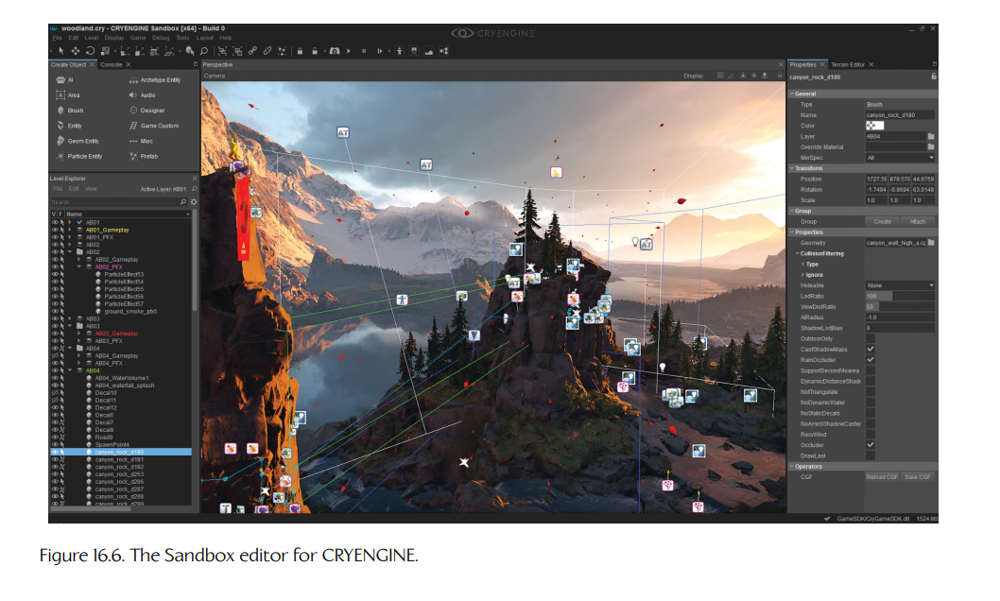
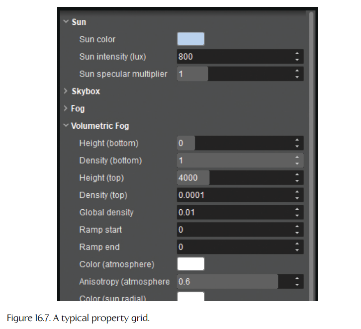
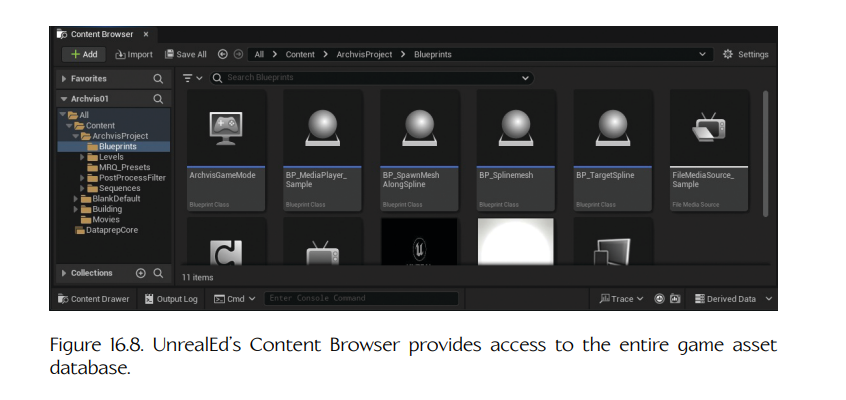
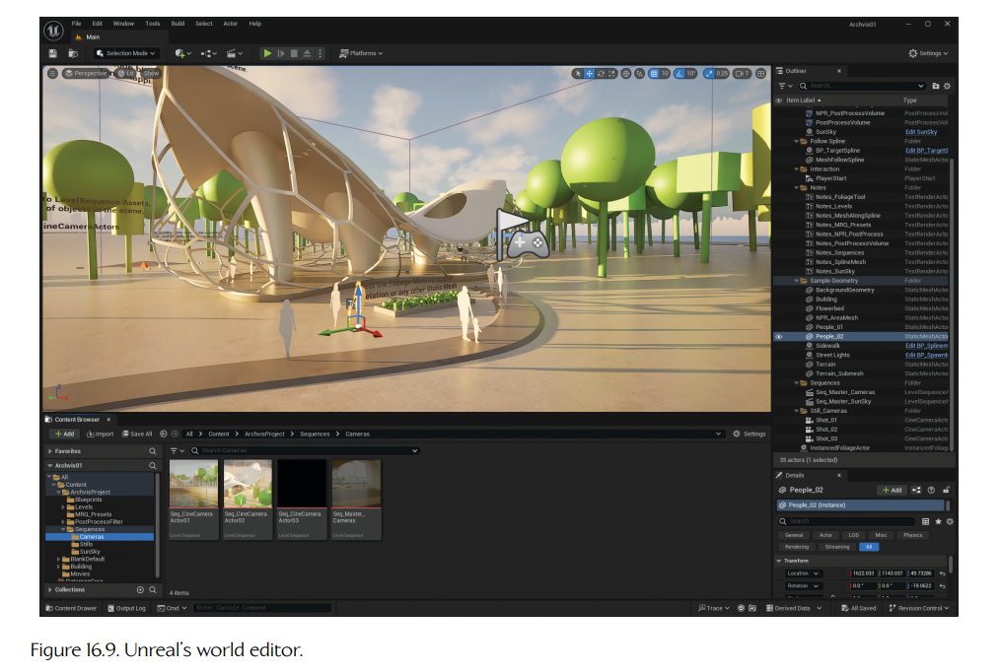

## 16.4 游戏世界编辑器

我们已经讨论过数据驱动的资源创建工具，例如 Maya、Photoshop、Havok 内容工具等。这些工具会生成单独的资源，供渲染引擎、动画系统、音频系统、物理系统等使用。在玩法空间中，与这些工具对应的是**游戏世界编辑器**（game world editor）——一种工具（或一套工具），它允许定义游戏世界分块，并用静态元素和动态元素填充这些分块。

所有商业游戏引擎都会拥有某种世界编辑器工具。

- 一个名为 **Radiant** 的知名工具用于为 Quake 和 Doom 系列引擎创建地图。Figure 16.4 展示了 Radiant 的截图。
- Valve 的 Source 和 Source 2 引擎曾被用于创建 *Half-Life 2*、*The Orange Box*、*Team Fortress 2*、*Portal* 系列、*Left 4 Dead* 系列以及 *Titanfall* 等知名游戏，它们提供了一个名为 **Hammer** 的编辑器（此前曾以 Worldcraft 和 The Forge 的名称发布）。Figure 16.5 展示了 Hammer 的截图。
- Crytek 的 CRYENGINE 提供了一套强大的世界创建和编辑工具。这些工具支持同时以 2D 和真正的立体 3D 方式，对多平台游戏环境进行实时编辑。Figure 16.6 展示了 Crytek 的 Sandbox 编辑器。

游戏世界编辑器通常允许指定游戏对象的初始状态（即其属性值）。大多数游戏世界编辑器还会为用户提供某种能力，用于控制游戏世界中动态对象的行为。这种控制可以通过数据驱动的配置参数实现（例如，对象 A 应该以不可见状态开始，对象 B 在生成后应立即攻击玩家，对象 C 是可燃的，等等），也可以通过脚本语言实现，从而将游戏设计师的任务推向编程领域。有些世界编辑器甚至允许在几乎没有程序员介入的情况下定义全新的游戏对象类型。

**Figure 16.4.** 用于 Quake 和 Doom 系列引擎的 Radiant 世界编辑器。

### 16.4.1 游戏世界编辑器的典型功能

游戏世界编辑器的设计和布局差异很大，但大多数编辑器都会提供一组相当标准的功能。这些功能包括但当然不限于以下内容。

#### 16.4.1.1 世界分块的创建与管理

世界创建的基本单位通常是分块（也称为关卡或地图——见 [Section 16.1.2](01-anatomy-of-a-game-world.md#1612-世界分块)）。游戏世界编辑器通常允许创建新的分块，并允许对已有分块进行重命名、拆分、合并或删除。每个分块都可以关联到一个或多个静态网格，和/或其他静态数据元素，例如 AI 导航网格、玩家可抓取边缘的描述、掩体点定义，等等。在某些引擎中，分块由单个背景网格定义，并且不能脱离该网格而存在。在另一些引擎中，分块可以独立存在，也许由一个包围体定义（例如 AABB、OBB 或任意多边形区域），并且可以填充零个或多个网格。

**Figure 16.5.** Valve 为 Source 2 引擎提供的 Hammer 编辑器。

有些世界编辑器会提供专门工具，用于制作地形、水体以及其他专门的静态元素。在另一些引擎中，这些元素可能使用标准 DCC 应用程序制作，但会以某种方式加上标记，以向资源调理管线和/或运行时引擎表明它们是特殊元素。（例如，在 *Uncharted* 和 *The Last of Us* 系列中，水体被制作为三角形网格，但会映射一种特殊材质，用以表明它应当被当作水处理。）有时，特殊世界元素会在独立的专用工具中创建和编辑。例如，*Medal of Honor: Pacific Assault* 中的高度场地形，是使用从 Electronic Arts 内部另一个团队获得的工具的定制版本制作的，因为这种做法比尝试将地形编辑器集成到 Radiant 中更加方便；Radiant 是该项目当时使用的世界编辑器。

**Figure 16.6.** CRYENGINE 的 Sandbox 编辑器。

#### 16.4.1.2 游戏世界可视化

游戏世界编辑器的用户能够可视化游戏世界的内容，这一点非常重要。因此，几乎所有游戏世界编辑器都会提供世界的三维透视视图，和/或二维正交投影视图。视图面板常见的划分方式是分为四个区域：三个区域分别用于顶视图、侧视图和前视图的正交投影，一个区域用于 3D 透视视图。

有些编辑器通过直接集成到工具中的自定义渲染引擎来提供这些世界视图。另一些编辑器本身则被集成到 Maya 或 3ds Max 这样的 3D 几何编辑器中，因此可以直接利用这些工具的视口。还有一些编辑器被设计为与实际游戏引擎通信，并使用游戏引擎来渲染 3D 透视视图。有些编辑器甚至直接集成在引擎本身之中。

#### 16.4.1.3 导航

显然，如果用户无法在游戏世界中移动，世界编辑器就没有太大用处。在正交视图中，能够滚动以及放大、缩小非常重要。在 3D 视图中，则会使用各种摄像机控制方案。用户可能能够聚焦到单个对象并围绕它旋转。也可能能够切换到“飞行穿越”（fly through）模式，在这种模式下，摄像机会围绕自身焦点旋转，并且可以向前、向后、向上、向下移动，也可以向左、向右平移。

有些编辑器为导航提供了大量便利功能。这些功能包括：选中一个对象并通过单次按键聚焦到它；保存多个相关摄像机位置并在它们之间跳转；提供多种摄像机移动速度模式，以支持粗略导航和精细摄像机控制；提供类似 Web 浏览器的导航历史，用于在游戏世界中来回跳转，等等。

#### 16.4.1.4 选择

游戏世界编辑器的主要设计目的，是让用户能够用静态元素和动态元素填充游戏世界。因此，用户能够选中单个元素进行编辑非常重要。有些编辑器一次只允许选择单个对象，而更高级的编辑器则允许多对象选择。对象可以通过正交视图中的橡皮筋框选中，也可以通过 3D 视图中的射线投射式拾取选中。许多编辑器还会在可滚动列表或树状视图中显示所有世界元素，使对象可以通过名称查找并选中。有些世界编辑器还允许为选择集命名并保存，以便之后重新取回。

游戏世界通常会被相当密集地填充。因此，有时会因为其他对象挡路而难以选中想要的对象。这个问题可以通过多种方式解决。在使用射线投射在 3D 中选择对象时，编辑器可以允许用户在当前射线相交的所有对象之间循环切换，而不是总是选择最近的一个对象。许多编辑器允许将当前选中的对象临时从视图中隐藏。这样，如果第一次没有选中想要的对象，就可以将当前对象隐藏后再试一次。正如下一节将要看到的，图层也可以有效减少混乱，并提升用户成功选择对象的能力。

#### 16.4.1.5 图层

有些编辑器还允许将对象分组到预定义或用户自定义的**图层**（layers）中。这是一项非常有用的功能，可以让游戏世界的内容以合理方式组织起来。整个图层可以被隐藏或显示，以减少屏幕上的混乱。图层可以通过颜色编码，便于识别。图层也可以成为分工策略中的重要组成部分。例如，当灯光团队正在处理某个世界分块时，他们可以隐藏场景中所有与灯光无关的元素。

此外，如果游戏世界编辑器能够单独加载和保存图层，那么在多人同时处理同一个世界分块时，就可以避免冲突。例如，所有光源可以存储在一个图层中，所有背景几何体存储在另一个图层中，所有 AI 角色存储在第三个图层中。由于每个图层都是完全独立的，灯光、背景和 NPC 团队就可以同时处理同一个世界分块。

#### 16.4.1.6 属性网格

填充游戏世界分块的静态和动态元素通常具有各种可由用户编辑的属性（也称为 attributes）。属性可以是简单的键值对，并且可以限制为布尔值、整数、浮点数和字符串等简单原子数据类型。在某些编辑器中，还支持更复杂的属性，包括数据数组和嵌套复合数据结构。也可能支持更复杂的数据类型，例如向量、RGB 颜色，以及对外部资源（音频文件、网格、动画等）的引用。

大多数世界编辑器都会在一个可滚动的属性网格视图中显示当前选中对象的属性。Figure 16.7 展示了一个属性网格示例。该网格允许用户查看每个属性的当前值，并通过键入、使用复选框或下拉组合框、上下拖动微调控件等方式编辑这些值。

**Figure 16.7.** 一个典型的属性网格。

**编辑多对象选择。**

在支持多对象选择的编辑器中，属性网格也可以支持多对象编辑。这项高级功能会显示所选所有对象属性的混合结果。如果某个特定属性在选择集中的所有对象上具有相同值，那么该值会照原样显示；在网格中编辑该值会使所有选中对象上的该属性值都被更新。如果某个属性的值在选择集中的不同对象之间不同，那么属性网格通常不会显示任何值。在这种情况下，如果在网格字段中输入一个新值，它会覆盖所有选中对象中的值，使它们全部保持一致。

当选择集包含一组异质对象（即对象类型不同）时，会出现另一个问题。每种对象类型都有可能拥有不同的一组属性，因此属性网格必须只显示选择集中所有对象类型共有的那些属性。不过，这仍然可能很有用，因为游戏对象类型通常会继承自一个公共基类型。例如，大多数对象都有位置和朝向。在异质选择集中，即使更具体的属性被暂时从视图中隐藏，用户仍然可以编辑这些共享属性。

**自由形式属性。**

通常，与某个对象关联的一组属性以及这些属性的数据类型，都是按对象类型定义的。例如，一个可渲染对象具有位置、朝向和网格，而一个光源具有位置、朝向、颜色、强度和光源类型。有些编辑器还允许用户按实例定义额外的“自由形式”属性。这些属性通常被实现为一个扁平的键值对列表。用户可以自由选择每个自由形式属性的名称（key），以及它的数据类型和值。这对于原型化新的玩法功能或实现一次性场景非常有用。

#### 16.4.1.7 对象放置与对齐辅助

某些对象属性会被世界编辑器以特殊方式处理。通常，对象的位置、朝向和缩放可以通过正交视口和透视视口中的特殊操纵柄来控制，就像在 Maya 或 Max 中一样。此外，资源链接通常也需要以特殊方式处理。例如，如果我们改变了与世界中某个对象关联的网格，编辑器就应该在正交视口和 3D 透视视口中显示这个网格。因此，游戏世界编辑器必须对这些属性具备特殊知识——它不能像处理大多数对象属性那样，以完全通用的方式处理它们。

除了基本的平移、旋转和缩放工具之外，许多世界编辑器还提供大量对象放置与对齐辅助功能。其中许多功能大量借鉴了 Photoshop、Maya、Visio 以及其他商业图形和 3D 建模工具的功能集。示例包括吸附到网格、吸附到地形、对齐到对象，等等。

#### 16.4.1.8 特殊对象类型

正如某些对象属性必须由世界编辑器以特殊方式处理一样，某些对象类型也需要特殊处理。例如：

- **光源**（lights）。世界编辑器通常会使用特殊图标来表示光源，因为它们没有网格。编辑器也可能尝试显示光源对场景几何体的大致影响，使设计师能够实时移动光源，并对场景最终外观形成较好的直观感受。
- **粒子发射器**（particle emitters）。在基于独立渲染引擎构建的编辑器中，粒子效果的可视化也可能存在问题。在这种情况下，粒子发射器可能只用图标显示，或者编辑器可能会尝试在编辑器中模拟粒子效果。当然，如果编辑器在游戏内运行，或者能够与正在运行的游戏通信以进行实时调节，这就不是问题。
- **声音源**（sound sources）。正如 Chapter 15 中所讨论的，3D 渲染引擎会将声音源建模为 3D 点或体积。在世界编辑器中为这些声音源提供专门编辑工具可能会很方便。例如，如果声音设计师能够可视化全向声音发射器的最大半径，或者可视化定向发射器的方向向量和锥体范围，就会很有帮助。
- **区域**（regions）。区域是游戏用来检测相关事件的一段空间体积，例如检测对象进入或离开该体积，或为各种目的划定区域。有些游戏引擎将区域限制为球体或有向盒建模；另一些引擎则可能允许从上方观察时为任意凸多边形形状，但侧面严格保持水平；还有一些引擎可能允许区域由更复杂的几何体构造，例如 k-DOP（见 [Section 14.3.4.5](../14-collision-and-rigid-body-dynamics/03-the-collision-detection-system.md#14345-k-dops)）。如果区域始终是球形的，那么设计师也许只需要在属性网格中使用一个“Radius”属性即可；但如果要定义或修改任意形状区域的范围，几乎必然需要一个特殊情况编辑工具。
- **样条曲线**（splines）。样条曲线是一条三维曲线，由一组控制点定义，并且根据所使用的数学曲线类型，可能还会在这些点上定义切向量。Catmull-Rom 样条曲线很常用，因为它们完全由一组控制点定义（不需要切线），并且曲线总会穿过所有控制点。不过，无论支持哪种样条曲线，世界编辑器通常都需要提供在其视口中显示样条曲线的能力，并且用户必须能够选择和操纵单个控制点。有些世界编辑器实际上支持两种选择模式：一种是用于选择场景中对象的“粗粒度”模式，另一种是用于选择已选对象内部单个组成部分的“细粒度”模式，例如样条曲线的控制点或区域的顶点。
- **AI 导航网格**（nav meshes for AI）。在许多游戏中，NPC 会在游戏世界的可导航区域内运行寻路算法来进行导航。这些可导航区域必须被定义，而世界编辑器通常在允许 AI 设计师创建、可视化和编辑这些区域方面发挥核心作用。例如，导航网格是一个 2D 三角形网格，它为可导航区域的边界提供简单描述，同时也向寻路器提供连通性信息。
- **其他自定义数据**（other custom data）。当然，每款游戏都有其自身特定的数据需求。世界编辑器可能需要为这些数据提供自定义可视化和编辑设施。示例包括：描述游玩空间中“可供性”（affordances）的数据（窗户、门口、可能的攻击点或防御点），供 AI 系统使用；或者描述掩体点、可抓取边缘等内容的几何特征，供玩家角色和/或 NPC 使用。

#### 16.4.1.9 保存与加载世界分块

当然，如果不能加载和保存世界分块，任何世界编辑器都不能算完整。世界分块加载和保存的粒度因引擎而异。有些引擎将每个世界分块存储在单个文件中，而另一些引擎则允许单独加载和保存各个图层。不同引擎的数据格式也不同。有些使用自定义二进制格式，另一些则使用 XML 或 JSON 这样的文本格式。每种设计都有其优点和缺点，但每个编辑器都会以某种形式提供加载和保存世界分块的能力——并且每个游戏引擎都能够加载世界分块，使其可以在运行时游玩。

#### 16.4.1.10 快速迭代

优秀的游戏世界编辑器通常会支持某种程度的动态调节，以实现快速迭代。有些编辑器运行在游戏本身之中，让用户能够立即看到修改效果。另一些编辑器则提供从编辑器到正在运行的游戏之间的实时连接。还有一些世界编辑器完全离线运行，要么作为独立工具，要么作为 Lightwave 或 Maya 这类 DCC 应用程序的插件。这些工具有时允许修改后的数据被动态重新加载到正在运行的游戏中。具体机制并不重要——关键在于，用户拥有一个合理较短的**往返迭代时间**（round-trip iteration time），也就是从对游戏世界做出修改，到在游戏中看到该修改效果之间的时间。需要认识到，迭代并不一定必须是瞬时的。迭代时间应当与所做修改的范围和频率相匹配。例如，调节角色的最大生命值应该是一个非常快速的操作；但如果是对整个世界分块的光照环境进行重大修改，那么更长的迭代时间可能也是可以接受的。

### 16.4.2 集成式资源管理工具

在某些引擎中，游戏世界编辑器会与游戏资源数据库管理的其他方面集成在一起，例如定义网格和材质属性、定义动画、混合树、动画状态机，设置对象的碰撞和物理属性，管理纹理资源，等等。（关于游戏资源数据库的讨论，见 [Section 7.2.1.2](../../volume-01-foundations-and-core-engine-systems/07-resources-and-the-file-system/02-the-resource-manager.md#7212-游戏资源数据库)。）

也许这种设计最著名的实际例子是 UnrealEd，即用于为基于 Unreal Engine 构建的游戏创建内容的编辑器。UnrealEd 直接集成到游戏引擎中，因此在编辑器中所做的任何修改都会直接作用于正在运行的游戏中的动态元素。这使得快速迭代非常容易实现。但 UnrealEd 远不止是一个游戏世界编辑器——它实际上是一个完整的内容创建包。它管理整个游戏资源数据库，从动画、音频片段、三角形网格、纹理，到材质和着色器，以及更多内容。UnrealEd 为用户提供了一个统一的、实时的、所见即所得（WYSIWYG）的完整资源数据库视图，使其成为任何快速高效游戏开发流程的强大支撑。Figures 16.8 和 16.9 展示了 UnrealEd 的若干截图。

**Figure 16.8.** UnrealEd 的内容浏览器（Content Browser）提供了对整个游戏资源数据库的访问。

**Figure 16.9.** Unreal 的世界编辑器。

#### 16.4.2.1 数据处理成本

在 [Section 7.2.1](../../volume-01-foundations-and-core-engine-systems/07-resources-and-the-file-system/02-the-resource-manager.md#721-the-resource-manager) 中，我们了解到，资源调理管线（asset conditioning pipeline, ACP）会将游戏资源从各种源格式转换为游戏引擎所需的格式。这通常是一个两步过程。首先，资源从 DCC 应用程序导出为一种与平台无关的中间格式，该格式只包含与游戏相关的数据。其次，资源被处理为针对某一特定平台优化的格式。在面向多个游戏平台的项目中，单个与平台无关的资源会在第二阶段产生多个平台特定资源。

不同工具管线之间的关键差异之一，在于第二个特定平台优化步骤发生在什么时间点。UnrealEd 会在资源首次导入编辑器时执行该步骤。这种方法在进行关卡设计迭代时，可以带来较快的迭代时间。不过，它也可能使修改网格、动画、音频资源等源资源的成本变得更高。Source 引擎和 Quake 引擎等其他引擎，则会在运行游戏之前烘焙关卡时支付资源优化成本。Halo 允许用户随时修改原始资源；这些资源在首次加载到引擎中时会被转换为优化后的形式，并且结果会被缓存起来，以避免每次运行游戏时都不必要地重复执行优化步骤。