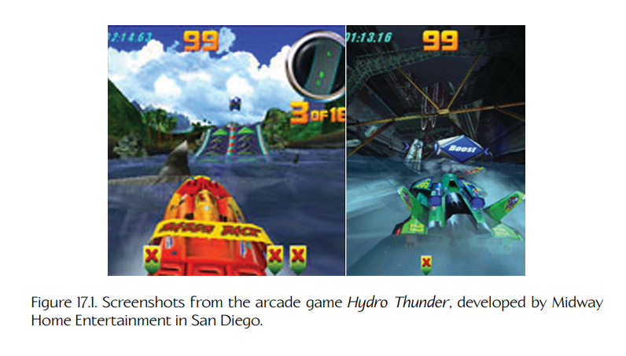
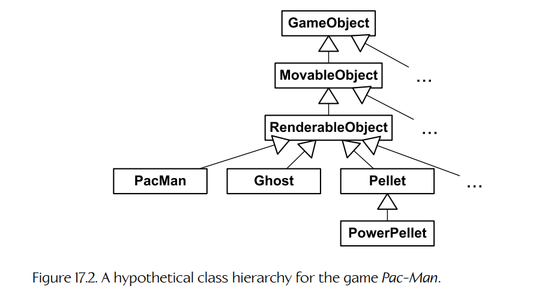
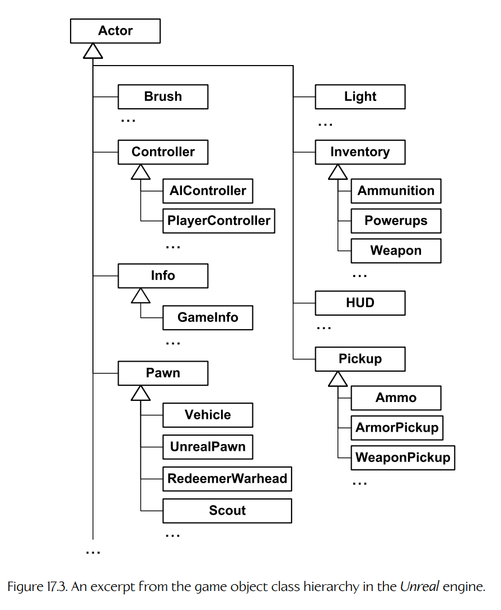
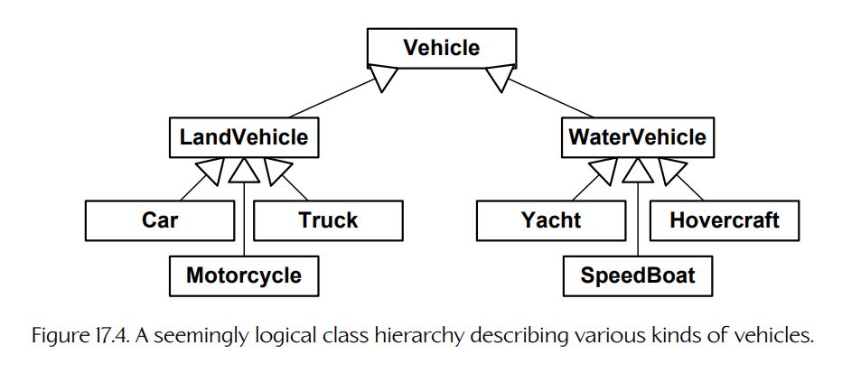
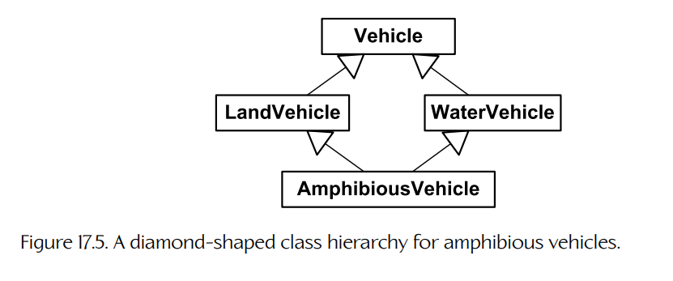
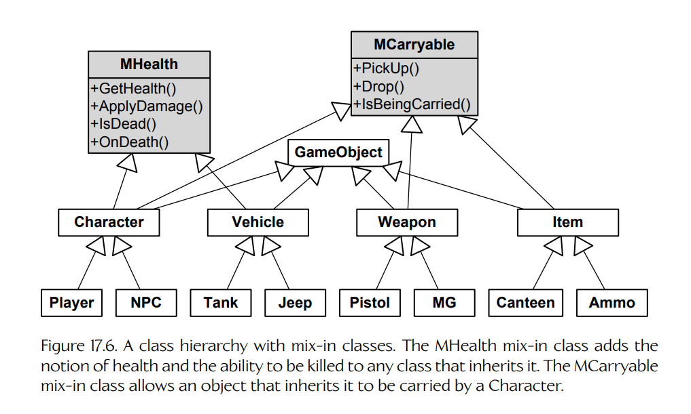
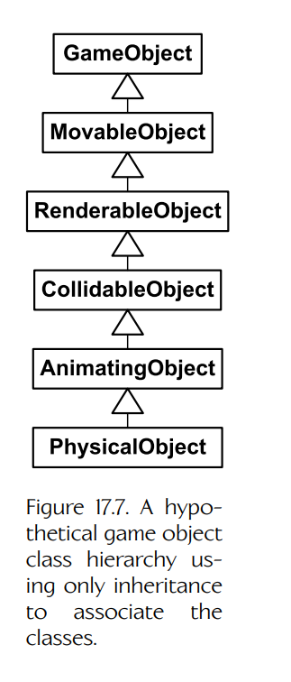
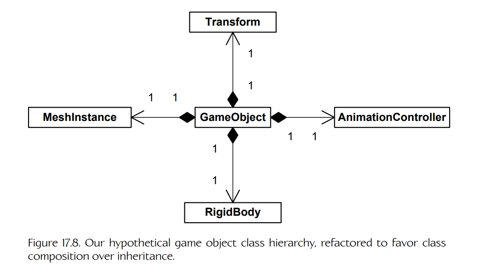
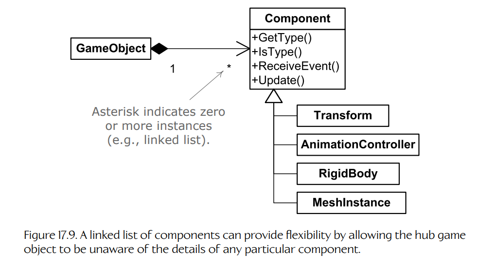
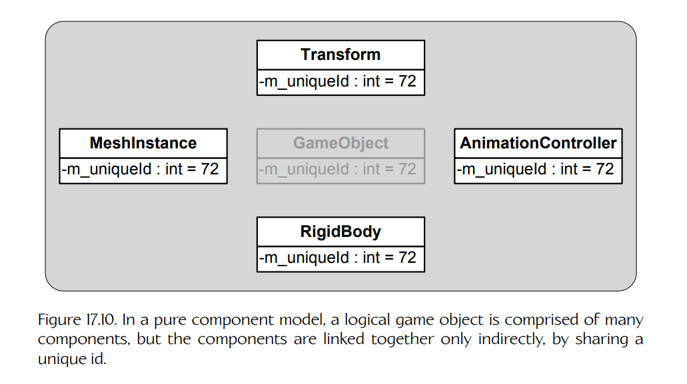

## 17.2 运行时对象模型架构

在世界编辑器中，游戏设计师看到的是一个抽象的游戏对象模型，它定义了游戏中可以存在的各种动态元素类型、这些元素如何行为，以及它们拥有哪些类型的属性。在运行时，玩法基础系统必须为这个对象模型提供一个具体实现。到目前为止，这是任何玩法基础系统中最大的组成部分。

运行时对象模型的实现，可能与工具侧抽象对象模型相似，也可能完全不同。例如，它可能根本不是用面向对象编程语言实现的；也可能使用一组相互连接的类实例来表示单个抽象游戏对象。无论其设计如何，运行时对象模型都必须忠实再现世界编辑器所宣称的对象类型、属性和行为。

运行时对象模型是世界编辑器中呈现给设计师的工具侧抽象对象模型在游戏中的具体体现。设计差异很大，但大多数游戏引擎都会遵循以下两种基本架构风格之一：

- **以对象为中心**（object-centric）。在这种风格中，每个工具侧游戏对象在运行时由单个类实例或一小组相互连接的实例表示。每个对象拥有一组**属性**（attributes）和**行为**（behaviors），它们被封装在该对象所属的类（或多个类）之中。游戏世界只是游戏对象的集合。
- **以属性为中心**（property-centric）。在这种风格中，每个工具侧游戏对象只由一个唯一 ID 表示（可实现为整数、哈希字符串 ID 或字符串）。每个游戏对象的**属性**分布在许多数据表中，每种属性类型对应一张表，并以对象 ID 作为键（而不是集中存储在单个类实例或一组相互连接的实例中）。属性本身通常被实现为硬编码类的实例。一个游戏对象的**行为**由构成该对象的属性集合隐式定义。例如，如果一个对象具有 “Health” 属性，那么它就可以受到伤害、失去生命值，并最终死亡。如果一个对象具有 “MeshInstance” 属性，那么它就可以作为三角形网格的一个实例在 3D 中渲染。

这两种架构风格各有明显的优点和缺点。我们将较详细地考察每一种风格，并在适当位置指出其中一种风格相对于另一种风格可能具有显著潜在收益的地方。

### 17.2.1 以对象为中心的架构

在**以对象为中心**的游戏世界对象架构中，每个逻辑游戏对象都被实现为一个类的实例，或可能被实现为一组相互连接的类实例。在这个宽泛范畴之下，可以有许多不同设计。我们将在以下各节考察几种最常见的设计。

#### 17.2.1.1 C 中的简单对象模型：Hydro Thunder

游戏对象模型并不一定必须用 C++ 这样的面向对象语言来实现。例如，由圣迭戈 Midway Home Entertainment 开发的街机热门游戏 *Hydro Thunder* 就完全用 C 编写。*Hydro* 使用了一个非常简单的游戏对象模型，只包含少数几类对象：

- 船只（由玩家和 AI 控制）；
- 漂浮的蓝色和红色加速图标；
- 环境动画对象（赛道边的动物等）；
- 水面；
- 跳台；
- 瀑布；
- 粒子效果；
- 赛道区段（相互连接的二维多边形区域，它们共同定义了船只可比赛的水域）；
- 静态几何体（地形、植被、赛道两侧的建筑等）；
- 二维抬头显示（heads-up display, HUD）元素。

Figure 17.1 展示了 *Hydro Thunder* 的几张截图。注意两张截图中悬浮的加速图标，以及左图中游过的鲨鱼（环境动画对象的一个例子）。

**Figure 17.1.** 街机游戏 *Hydro Thunder* 的截图，该游戏由圣迭戈 Midway Home Entertainment 开发。

*Hydro* 有一个名为 `World_t` 的 C 结构体，用于存储和管理游戏世界（即单条比赛赛道）的内容。世界包含指向各种游戏对象数组的指针。静态几何体是单个网格实例。水面、瀑布和粒子效果分别由自定义数据结构表示。船只、加速图标以及游戏中的其他动态对象，则由一个通用结构体 `WorldOb_t`（即 world object）实例表示。这就是 *Hydro* 中与本章所定义的 game object 等价的概念。

`WorldOb_t` 数据结构包含一些数据成员，用于编码对象的位置和朝向、用于渲染它的 3D 网格、一组碰撞球、简单动画状态信息（*Hydro* 只支持刚性层级动画）、速度、质量和浮力等物理属性，以及所有游戏动态对象共有的其他数据。此外，每个 `WorldOb_t` 都包含三个指针：一个 `void*` 类型的 “user data” 指针、一个指向自定义 “update” 函数的指针，以及一个指向自定义 “draw” 函数的指针。因此，虽然 *Hydro Thunder* 严格来说并不是面向对象的，但 *Hydro* 引擎确实扩展了其非面向对象语言（C），以支持两个重要 OOP 特性的初步实现：**继承**（inheritance）和**多态**（polymorphism）。用户数据指针允许每种游戏对象类型在继承所有 world object 共有特性的同时，维护特定于自身类型的自定义状态信息。例如，Banshee 船的推进器机制与 Rad Hazard 不同，而每种推进器机制都需要不同的状态信息来管理其展开和收起动画。两个函数指针的作用类似于**虚函数**（virtual functions），允许 world object 通过其 “update” 函数拥有多态行为，并通过其 “draw” 函数拥有多态视觉外观。

    struct WorldOb_s
    {
        Orient_t m_transform;    /* position/rotation */
        Mesh3d*  m_pMesh;        /* 3D mesh */
        /* ... */
        void*    m_pUserData;    /* custom state */

        void     (*m_pUpdate)(); /* polymorphic update */
        void     (*m_pDraw)();   /* polymorphic draw */
    };
    typedef struct WorldOb_s WorldOb_t;

#### 17.2.1.2 单体类层级

人们自然会希望按分类学方式对游戏对象类型进行分类。这往往会引导游戏程序员使用支持继承的面向对象语言。类层级是表示一组相互关联的游戏对象类型时最直观、最直接的方式。因此，大多数商业游戏引擎采用基于类层级的技术也就不足为奇了。

**Figure 17.2.** 一个用于 *Pac-Man* 游戏的假想类层级。

Figure 17.2 展示了一个可用于实现 *Pac-Man* 的简单类层级。这个层级（和许多类层级一样）以一个名为 `GameObject` 的公共类为根，该类可能提供所有对象类型都需要的一些功能，例如 RTTI 或序列化。`MovableObject` 类表示任何具有位置和朝向的对象。`RenderableObject` 赋予对象可被渲染的能力（在传统 *Pac-Man* 中通过 sprite，在现代 3D *Pac-Man* 游戏中也许通过三角形网格）。从 `RenderableObject` 派生出幽灵、Pac-Man、豆子和能量豆等构成游戏的类。这只是一个假想示例，但它说明了大多数游戏对象类层级背后的基本思想：通用、泛化的功能往往位于层级根部，而越接近叶节点的类往往添加越来越具体的功能。

游戏对象类层级通常一开始很小、很简单，在这种形式下，它可以是一种强大且直观的方式，用于描述一组游戏对象类型。然而，随着类层级增长，它们往往会同时变深和变宽，从而形成我称之为**单体类层级**（monolithic class hierarchy）的结构。当游戏对象模型中几乎所有类都继承自单个公共基类时，就会出现这种层级。Unreal Engine 的游戏对象模型就是一个经典例子，如 Figure 17.3 所示。

#### 17.2.1.3 深而宽的层级所带来的问题

单体类层级往往会因为各种原因给游戏开发团队造成问题。类层级越深、越宽，这些问题就可能变得越严重。在以下各节中，我们将探讨由宽而深的类层级所引发的一些最常见问题。

**Figure 17.3.** Unreal 引擎中游戏对象类层级的一段摘录。

**理解、维护和修改类。**

一个类在类层级中所处的位置越深，它就越难理解、维护和修改。这是因为，要理解一个类，实际上也需要理解它的所有父类。例如，在派生类中修改一个看似无害的虚函数行为，可能会违反众多基类中任意一个类所作出的假设，从而导致微妙且难以发现的 bug。

**无法描述多维分类体系。**

层级结构天然会根据某一特定标准体系来对对象进行分类，这一标准体系称为**分类法**（taxonomy）。例如，**生物分类法**（biological taxonomy，也称为 **alpha taxonomy**）根据遗传相似性对所有生物进行分类，使用一棵包含八个层级的树：域、界、门、纲、目、科、属、种。在树的每一层，都会使用不同标准，将地球上无数生命形式划分成越来越精细的组。

任何层级结构最大的一个问题在于：它只能沿着单一“轴”对对象进行分类——即在树的每一层都按照某一特定标准集合分类。一旦某个层级的标准被选定，就很难甚至不可能再沿着一组完全不同的“轴”进行分类。例如，生物分类法根据遗传特征对对象进行分类，但它并不描述生物体的颜色。要按颜色对生物体分类，就需要一棵完全不同的树结构。

在面向对象编程中，这种层级分类的局限性常常表现为宽、深且令人困惑的类层级。在分析真实游戏的类层级时，人们经常会发现，其结构试图将多个不同分类标准融合进单棵类树中。在其他情况下，为了容纳一种在层级最初设计时未被预见的新对象类型，会在类层级中作出妥协。例如，假设 Figure 17.4 中描绘的、用于描述不同载具类型的看似合理的类层级。

**Figure 17.4.** 一个看似合理的类层级，用于描述各种载具。

如果游戏设计师告诉程序员，他们现在希望游戏中加入一种**水陆两栖载具**（amphibious vehicle），会发生什么？这种载具无法融入现有的分类体系。这可能会让程序员惊慌失措，或者更可能的是，促使他们用各种丑陋且容易出错的方式“hack”自己的类层级。

**多重继承：致命菱形。**

解决水陆两栖载具问题的一种方法，是利用 C++ 的多重继承（multiple inheritance, MI）特性，如 Figure 17.5 所示。乍看之下，这似乎是一个不错的解决方案。然而，C++ 中的多重继承会带来许多实践问题。例如，多重继承可能导致一个对象包含其基类成员的多个副本，这种情况被称为 “deadly diamond” 或 “diamond of death”。（更多细节见 Section 3.1.1.3。）

**Figure 17.5.** 用于水陆两栖载具的菱形类层级。

构建一个既能工作、又易于理解和维护的 MI 类层级，其难度通常超过它所能带来的收益。因此，大多数游戏工作室会禁止或严格限制在类层级中使用多重继承。

**混入类。**

有些团队允许使用一种受限形式的 MI：一个类可以有任意数量的父类，但只能有一个祖父类。换句话说，一个类可以从主继承层级中的一个且仅一个类继承，但也可以从任意数量的**混入类**（mix-in classes）继承（混入类是没有基类的独立类）。这允许将公共功能分解到一个混入类中，然后在主层级中任何需要的地方进行“局部修补”。Figure 17.6 展示了这种方式。不过，正如我们将在下文看到的，通常最好**组合**（compose）或**聚合**（aggregate）这类类，而不是从它们继承。

**Figure 17.6.** 带有混入类的类层级。`MHealth` 混入类为任何继承它的类添加生命值概念以及被杀死的能力。`MCarryable` 混入类允许继承它的对象被 `Character` 携带。

**上浮效应。**

当单体类层级最初被设计出来时，根类通常非常简单，每个根类只暴露最小的一组功能。然而，随着越来越多功能被加入游戏，在两个或多个**无关**类之间共享代码的需求，开始导致功能沿着层级“上浮”（bubble up）。

例如，我们一开始可能有这样一种设计：只有木箱能漂浮在水中。然而，一旦游戏设计师看到那些很酷的漂浮木箱，他们就开始要求其他类型的漂浮对象，例如角色、纸片、载具，等等。由于“可漂浮与不可漂浮”并不是该层级最初设计时的分类标准之一，程序员很快就会发现，需要把漂浮功能添加到类层级中完全无关的类上。多重继承并不受欢迎，因此程序员决定将漂浮代码上移到层级中，放入一个所有需要漂浮的对象都共有的基类中。某些从这个公共基类派生出来的类实际上**不能漂浮**，但这被认为比在多个类中重复漂浮代码要小一些问题。（甚至可能添加一个类似 `m_bCanFloat` 的布尔成员变量来明确区分。）最终结果是，漂浮功能最终变成了类层级根对象的一个特性（几乎和游戏中的所有其他功能一样）。

Unreal 中的 `Actor` 类就是这种“上浮效应”的经典例子。它包含用于管理渲染、动画、物理、世界交互、音频效果、多人游戏网络复制、对象创建与销毁、actor 迭代（即遍历所有满足特定条件的 actor 并对它们执行某种操作的能力）以及消息广播的数据成员和代码。当功能被允许“上浮”到单体类层级中最靠近根部的类时，就很难封装各种引擎子系统的功能。

#### 17.2.1.4 使用组合简化层级

单体类层级最常见的成因，或许是面向对象设计中过度使用 “is-a” 关系。例如，在游戏的 GUI 中，程序员可能会认为 GUI 窗口总是矩形的，于是决定让 `Window` 类从名为 `Rectangle` 的类派生。然而，`Window` **不是**一个矩形——它**拥有**一个矩形，该矩形定义了它的边界。因此，对于这个特定设计问题，更可行的解决方案是在 `Window` 类内部嵌入一个 `Rectangle` 类实例，或者让 `Window` 持有指向 `Rectangle` 的指针或引用。

在面向对象设计中，“has-a” 关系称为**组合**（composition）。在组合中，类 A 要么直接包含一个类 B 的**实例**（instance），要么包含指向类 B 实例的**指针或引用**（pointer or reference）。严格来说，要使用“组合”这一术语，类 A 必须**拥有**类 B。这意味着当类 A 的实例被创建时，它也会自动创建一个类 B 的实例；当该类 A 实例被销毁时，它的类 B 实例也会被销毁。我们也可以通过指针或引用将类彼此连接起来，而不让其中一个类管理另一个类的生命周期。在这种情况下，该技术通常称为**聚合**（aggregation）。

**将“是一个”转换为“有一个”。**

将 “is-a” 关系转换为 “has-a” 关系，是一种有用技术，可以降低游戏类层级的宽度、深度和复杂度。为说明这一点，让我们看看 Figure 17.7 中所示的假想单体层级。根 `GameObject` 类提供所有游戏对象都需要的一些基本功能（例如，RTTI、反射、通过序列化实现的持久化、网络复制等）。`MovableObject` 类表示任何具有**变换**（transform，即位置、朝向和可选缩放）的游戏对象。`RenderableObject` 添加了在屏幕上被渲染的能力。（并非所有游戏对象都需要被渲染——例如，一个不可见的 `TriggerRegion` 类可以直接从 `MovableObject` 派生。）`CollidableObject` 类为其实例提供碰撞信息。`AnimatingObject` 类赋予其实例通过骨骼关节层级播放动画的能力。最后，`PhysicalObject` 赋予其实例被物理模拟的能力（例如，刚体在重力作用下下落，并在游戏世界中四处弹跳）。

**Figure 17.7.** 一个假想游戏对象类层级，仅使用继承来关联各个类。

这个类层级的一个大问题是，它限制了我们在创建新游戏对象类型时的设计选择。如果我们想定义一种被物理模拟的对象类型，就不得不让它的类从 `PhysicalObject` 派生，尽管它可能并不需要骨骼动画。如果我们想要一个具有碰撞的游戏对象类，它就必须继承自 `CollidableObject`，尽管它可能不可见，因此并不需要 `RenderableObject` 的服务。

Figure 17.7 所示层级的第二个问题是，扩展现有类功能非常困难。例如，假设我们想支持变形目标动画（morph target animation），于是从 `AnimatingObject` 派生出两个新类，分别称为 `SkeletalObject` 和 `MorphTargetObject`。如果我们希望这两个新类都具有被物理模拟的能力，就不得不将 `PhysicalObject` 重构为两个几乎相同的类，一个从 `SkeletalObject` 派生，另一个从 `MorphTargetObject` 派生；或者转向多重继承。

解决这些问题的一种方式，是将 `GameObject` 的各种功能隔离到独立类中，每个类提供一种单一且定义良好的服务。这类类有时称为**组件**（components）或**服务对象**（service objects）。组件化设计允许我们只为创建的每种游戏对象类型选择所需功能。此外，它允许每项功能在不影响其他功能的情况下被维护、扩展或重构。各个组件也更容易理解、更容易测试，因为它们彼此解耦。有些组件类直接对应某个单独的引擎子系统，例如渲染、动画、碰撞、物理、音频等。当这些子系统被集成起来供某个特定游戏对象使用时，这种方式仍然允许它们保持清晰分离并良好封装。

**Figure 17.8.** 将假想游戏对象类层级重构为偏向类组合而非继承后的结果。

Figure 17.8 展示了当我们将类层级重构为组件后，它可能呈现的样子。在这个修订后的设计中，`GameObject` 类像一个枢纽，包含指向我们所定义的各个可选组件的指针。`MeshInstance` 组件是我们对 `RenderableObject` 类的替代——它表示三角形网格的一个实例，并封装了关于如何渲染它的知识。类似地，`AnimationController` 组件替代了 `AnimatingObject`，向 `GameObject` 暴露骨骼动画服务。`Transform` 类通过维护对象的位置、朝向和缩放来替代 `MovableObject`。`RigidBody` 类表示游戏对象的碰撞几何体，并为其 `GameObject` 提供通往底层碰撞与物理系统的接口，从而替代 `CollidableObject` 和 `PhysicalObject`。

**组件创建与所有权。**

在这种设计中，“枢纽”类通常**拥有**其组件，也就是说，它管理这些组件的**生命周期**。但 `GameObject` 应该如何“知道”该创建哪些组件？解决这个问题的方法有很多，其中一种最简单的方法，是为根 `GameObject` 类提供指向所有可能组件的指针。每种唯一的游戏对象类型都被定义为 `GameObject` 的派生类。在 `GameObject` 构造函数中，所有组件指针初始都被设为 `nullptr`。然后，每个派生类的构造函数可以自由创建它所需的任何组件。为方便起见，默认的 `GameObject` 析构函数可以自动清理所有组件。在这种设计中，从 `GameObject` 派生出来的类层级，作为游戏中所需对象种类的主要分类体系，而组件类则作为可选的附加功能。

下面展示了这种层级中组件创建与销毁逻辑的一种可能实现。不过，需要意识到，这段代码只是一个示例——实现细节差异很大，即使是在采用基本相同类层级设计的引擎之间也是如此。

    class GameObject
    {
    protected:
        // My transform (position, rotation, scale).
        Transform             m_transform;

        // Standard components:
        MeshInstance*         m_pMeshInst;
        AnimationController*  m_pAnimController;
        RigidBody*            m_pRigidBody;

    public:
        GameObject()
        {
            // Assume no components by default.
            // Derived classes will override.
            m_pMeshInst = nullptr;
            m_pAnimController = nullptr;
            m_pRigidBody = nullptr;
        }

        ~GameObject()
        {
            // Automatically delete any components created by
            // derived classes. (Deleting null pointers OK.)
            delete m_pMeshInst;
            delete m_pAnimController;
            delete m_pRigidBody;
        }

        // ...
    };

    class Vehicle : public GameObject
    {
    protected:
        // Add some more components specific to Vehicles...
        Chassis* m_pChassis;
        Engine*  m_pEngine;
        // ...

    public:
        Vehicle()
        {
            // Construct standard GameObject components.
            m_pMeshInst = new MeshInstance;
            m_pRigidBody = new RigidBody;

            // NOTE: We'll assume the animation controller
            // must be provided with a reference to the mesh
            // instance so that it can provide it with a
            // matrix palette.
            m_pAnimController
                = new AnimationController(*m_pMeshInst);

            // Construct vehicle-specific components.
            m_pChassis = new Chassis(*this,
                                     *m_pAnimController);

            m_pEngine = new Engine(*this);
        }

        ~Vehicle()
        {
            // Only need to destroy vehicle-specific
            // components, as GameObject cleans up the
            // standard components for us.
            delete m_pChassis;
            delete m_pEngine;
        }
    };

#### 17.2.1.5 泛型组件

另一种更加灵活（但实现起来也更棘手）的替代方案，是为根游戏对象类提供一个泛型组件链表。在这种设计中，组件通常全部从一个公共基类派生——这允许我们遍历链表并执行多态操作，例如询问每个组件它是什么类型，或依次向每个组件传递一个事件，供其在可能的情况下处理。这种设计允许根游戏对象类基本不必知道可用组件类型的细节，因此在许多情况下，可以在不修改游戏对象类的前提下创建新类型组件。它还允许某个特定游戏对象包含某种组件类型的任意数量实例。（硬编码设计只允许固定数量，该数量由游戏对象类中存在多少个指向每种组件的指针决定。）

**Figure 17.9.** 组件链表可以提供灵活性，使枢纽游戏对象无需了解任何特定组件的细节。

Figure 17.9 展示了这种设计。它比硬编码组件模型更难实现，因为游戏对象代码必须以完全泛型的方式编写。组件类同样不能对某个特定游戏对象上下文中可能存在或不存在的其他组件作出假设。选择硬编码组件指针，还是使用泛型组件链表，并不是一个容易作出的选择。没有哪种设计明显更优——它们各有优缺点，不同游戏团队会采用不同方法。

#### 17.2.1.6 纯组件模型

如果我们将组件化概念推到极致，会发生什么？我们会把几乎**所有**功能都从根 `GameObject` 类中移出，放入各种组件类。到这个时候，游戏对象类实际上就只是一个没有行为的容器，拥有一个唯一 ID 和一组指向其组件的指针，除此之外不包含自己的逻辑。那么，为什么不干脆彻底消除这个类呢？一种做法是让每个组件都持有游戏对象唯一 ID 的一份副本。现在，这些组件通过 ID 被链接为一个逻辑分组。只要有某种方式能够通过 ID 快速查找任意组件，我们就不再需要 `GameObject` 这个“枢纽”类了。我将使用**纯组件模型**（pure component model）这一术语来描述这种架构。Figure 17.10 展示了它。

**Figure 17.10.** 在纯组件模型中，一个逻辑游戏对象由许多组件组成，但这些组件只是通过共享唯一 ID 间接连接在一起。

纯组件模型并不像初看起来那么简单，也并非没有问题。首先，我们仍然需要某种方式来定义游戏所需的各种具体游戏对象类型，然后安排在创建某个类型实例时实例化正确的组件类。原本用于为我们处理组件构造的 `GameObject` 层级已经不存在了。相反，我们可以使用**工厂模式**（factory pattern）：定义工厂类，每种游戏对象类型对应一个工厂类，并提供一个虚构造函数，该函数被重写，以为每种游戏对象类型创建合适的组件。或者，我们也可以转向数据驱动模型：游戏对象类型被定义在一个文本文件中，引擎可以解析该文件，并在某个类型被实例化时查询它。

组件-only 设计的另一个问题是组件间通信。原先的中心 `GameObject` 充当“枢纽”，在各种组件之间组织通信。在纯组件架构中，我们需要一种高效方式，让构成单个游戏对象的各个组件彼此通信。这可以通过让每个组件使用游戏对象的唯一 ID 查找其他组件来完成。不过，我们可能会希望使用一种效率更高的机制——例如，可以将这些组件预先连接成一个循环链表。

同样，在纯组件化模型中，从一个游戏对象向另一个游戏对象发送消息也比较困难。我们不再能够与 `GameObject` 实例通信，因此我们要么需要事先知道希望与哪个组件通信，要么必须向构成目标游戏对象的所有组件进行多播。这两个选项都并不理想。

纯组件模型可以并且已经在真实游戏项目中运行起来。这类模型有其优缺点，但同样，它们并不明显优于任何替代设计。除非你是研究与开发工作的一部分，否则你大概应该选择自己最熟悉、最有信心，并且最适合当前游戏需求的架构。

### 17.2.2 以属性为中心的架构

经常使用面向对象编程语言工作的程序员，往往自然会以包含属性（数据成员）和行为（方法、成员函数）的对象来思考问题。这是**以对象为中心的视角**（object-centric view）：

- Object1
  - Position = (0, 3, 15)
  - Orientation = (0, 43, 0)
- Object2
  - Position = (−12, 0, 8)
  - Health = 15
- Object3
  - Orientation = (0, −87, 10)

然而，也可以主要从属性而不是对象的角度思考。我们定义一个游戏对象可能拥有的所有属性集合。然后，对每种属性构建一张表，其中包含拥有该属性的每个游戏对象所对应的属性值。属性值以对象的唯一 ID 作为键。这就是我们将要称为**以属性为中心的视角**（property-centric view）：

- Position
  - Object1 = (0, 3, 15)
  - Object2 = (−12, 0, 8)
- Orientation
  - Object1 = (0, 43, 0)
  - Object3 = (0, −87, 10)
- Health
  - Object2 = 15

以属性为中心的对象模型已经在许多商业游戏中非常成功地使用过，包括 *Deus Ex 2* 和 *Thief* 系列游戏。关于这些项目究竟如何设计其对象系统，见 [Section 17.2.2.5](02-runtime-object-model-architectures.md#17225-延伸阅读)。

以属性为中心的设计更像关系型数据库，而不是对象模型。每个属性就像关系型数据库中的一张表，以游戏对象的唯一 ID 作为**主键**（primary key）。当然，在面向对象设计中，对象不仅由其**属性**定义，也由其**行为**定义。如果我们拥有的只是属性表，那么行为应该在哪里实现？这个问题的答案会因引擎而异，但最常见的是，行为会在以下一个或两个位置实现：

- 在属性本身之中，和/或
- 通过脚本代码实现。

下面进一步探讨这两个思路。

#### 17.2.2.1 通过属性类实现行为

每种属性类型都可以被实现为一个**属性类**（property class）。属性可以简单到只是一个布尔值或浮点值，也可以复杂到是一个可渲染三角形网格或 AI “大脑”。每个属性类都可以通过其硬编码方法（成员函数）提供行为。某个特定游戏对象的整体行为，由其所有属性行为的聚合来决定。

例如，如果一个游戏对象包含 `Health` 属性的一个实例，那么它就可以受到伤害，并最终被摧毁或杀死。`Health` 对象可以响应对该游戏对象发起的任何攻击，并适当地减少该对象的生命值。一个属性对象也可以与同一游戏对象内部的其他属性对象通信，以产生协同行为。例如，当 `Health` 属性检测并响应一次攻击时，它可能会向 `AnimatedSkeleton` 属性发送一条消息，从而允许该游戏对象播放合适的受击反应动画。类似地，当 `Health` 属性检测到该游戏对象即将死亡或被摧毁时，它可以与 `RigidBodyDynamics` 属性通信，以激活物理驱动的爆炸或“布娃娃”（rag doll）死亡身体模拟。

#### 17.2.2.2 通过脚本实现行为

另一种选择是，将属性值作为原始数据存储在一张或多张类似数据库的表中，并使用脚本代码实现游戏对象的行为。每个游戏对象都可以有一个特殊属性，例如 `ScriptId`，如果该属性存在，它就指定一段脚本代码（脚本函数，或者如果脚本语言本身是面向对象的，则是脚本对象），用于管理该对象的行为。脚本代码也可以用于让游戏对象响应游戏世界中发生的事件。关于事件系统的更多细节，见 [Section 17.8](08-events-and-message-passing.md#178-事件与消息传递)；关于游戏脚本语言的讨论，见 [Section 17.9](09-scripting.md#179-脚本)。

在某些以属性为中心的引擎中，工程师会提供一组核心硬编码属性类，但同时也提供一种设施，允许游戏设计师和程序员完全用脚本实现新的属性类型。例如，这种方法就曾在 *Dungeon Siege* 项目中成功使用。

#### 17.2.2.3 属性与组件

需要注意的是，在 [Section 17.2.2.5](02-runtime-object-model-architectures.md#17225-延伸阅读) 中引用的许多作者，都会使用 “component” 一词来指代我在这里称为 “property object” 的东西。在 [Section 17.2.1.4](02-runtime-object-model-architectures.md#17214-使用组合简化层级) 中，我使用 “component” 一词来指以对象为中心设计中的子对象，这与属性对象并不完全相同。

不过，属性对象在许多方面都与组件非常接近。在两种设计中，单个逻辑游戏对象都由多个子对象组成。主要区别在于这些子对象的角色。在以属性为中心的设计中，每个子对象定义游戏对象本身的一个特定属性（例如，生命值、视觉表示、物品栏、某种特定魔法能力等）；而在基于组件的（以对象为中心的）设计中，这些子对象通常表示到特定底层引擎子系统的链接（渲染器、动画、碰撞与动力学等）。这种区别非常细微，以至于在许多情况下几乎无关紧要。你可以根据自己的需要，将自己的设计称为**纯组件模型**（[Section 17.2.1.6](02-runtime-object-model-architectures.md#17216-纯组件模型)）或**以属性为中心的设计**；但归根结底，你得到的本质上都是同一个结果——一个由一组子对象构成，并从这些子对象中派生出行为的逻辑游戏对象。

#### 17.2.2.4 以属性为中心设计的优缺点

以属性为中心的方法具有若干潜在收益。它往往更节省内存，因为我们只需要存储实际正在使用的属性数据（也就是说，永远不会有带有未使用数据成员的游戏对象）。它也更容易以数据驱动方式构建——设计师可以轻松定义新属性，而无需重新编译游戏，因为不需要修改游戏对象类定义。只有在需要添加全新类型属性时，程序员才需要介入（前提是该属性不能通过脚本添加）。

以属性为中心的设计也可能比以对象为中心的模型更加缓存友好，因为同一类型的数据在内存中是**连续**（contiguously）存储的。在现代游戏硬件上，这是一种常见优化技术，因为访问内存的成本远高于执行指令和进行计算的成本。（例如，在 PlayStation 3 上，单次缓存未命中的成本相当于执行字面意义上数千条 CPU 指令的成本。）通过将数据连续存储在 RAM 中，我们可以减少或消除缓存未命中，因为当我们访问一个数据数组中的某个元素时，它相邻的大量元素会被加载到同一缓存行中。这种数据设计方法有时称为 **struct of arrays** 技术，与更传统的 **array of structs** 方法相对。下面的代码片段展示了这两种内存布局之间的差异。（注意，我们并不会真的以这种精确方式实现游戏对象模型——这个示例只是为了说明以属性为中心的设计如何倾向于生成许多连续的同类型数据数组，而不是单个复杂对象数组。）

    static const U32 MAX_GAME_OBJECTS = 20480;

    // Traditional array-of-structs approach.

    struct GameObject
    {
        U32         m_uniqueId;
        Vector      m_pos;
        Quaternion  m_rot;
        float       m_health;

        // ...
    };

    GameObject g_aAllGameObjects[MAX_GAME_OBJECTS];

    // Cache-friendlier struct-of-arrays approach.

    struct AllGameObjects
    {
        U32         m_aUniqueId[MAX_GAME_OBJECTS];
        Vector      m_aPos[MAX_GAME_OBJECTS];
        Quaternion  m_aRot[MAX_GAME_OBJECTS];
        float       m_aHealth[MAX_GAME_OBJECTS];

        // ...
    };

    AllGameObjects g_allGameObjects;

以属性为中心的模型也有自己的问题。例如，当一个游戏对象只是一袋属性时，要强制这些属性之间的关系就会困难得多。仅仅把一组属性对象的细粒度行为拼凑起来，可能很难实现期望的大规模行为。调试这类系统也更加棘手，因为程序员无法简单地把一个游戏对象丢进调试器的 watch 窗口中，来一次性检查它的所有属性。

#### 17.2.2.5 延伸阅读

关于以属性为中心架构这一主题，游戏行业中一些知名工程师曾在各类游戏开发会议上给出过许多有趣的 PowerPoint 演示。

- Rob Fermier，“Creating a Data Driven Engine,” Game Developer’s Conference, 2002.
- Scott Bilas，“A Data-Driven Game Object System,” Game Developer’s Conference, 2002.
- Alex Duran，“Building Object Systems: Features, Tradeoffs, and Pitfalls,” Game Developer’s Conference, 2003.
- Jeremy Chatelaine，“Enabling Data Driven Tuning via Existing Tools,” Game Developer’s Conference, 2003.
- Doug Church，“Object Systems,” presented at a game development conference in Seoul, Korea, 2003; conference organized by Chris Hecker, Casey Muratori, Jon Blow, and Doug Church. [388].
