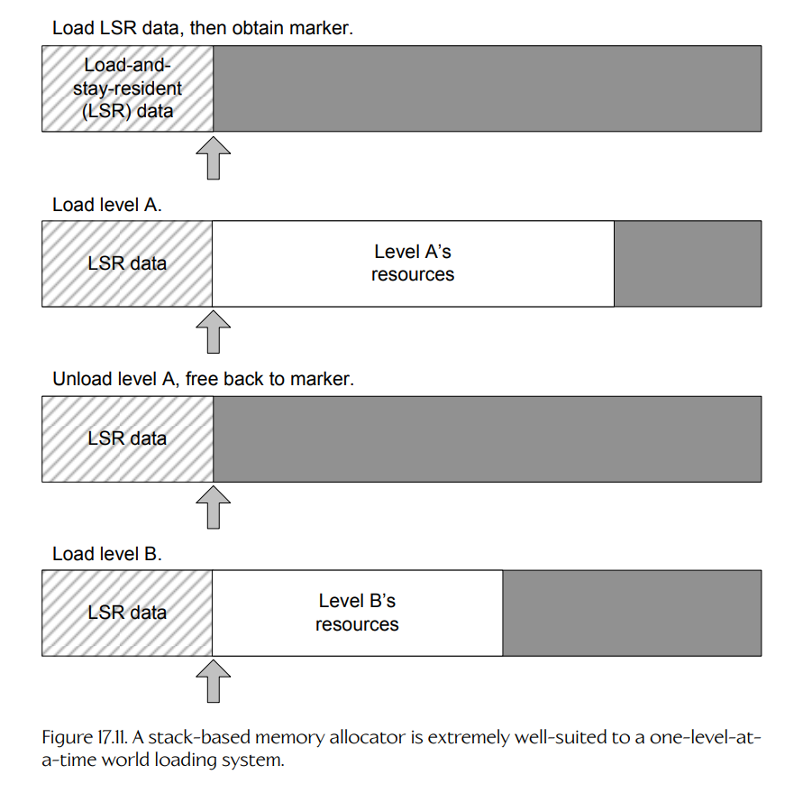
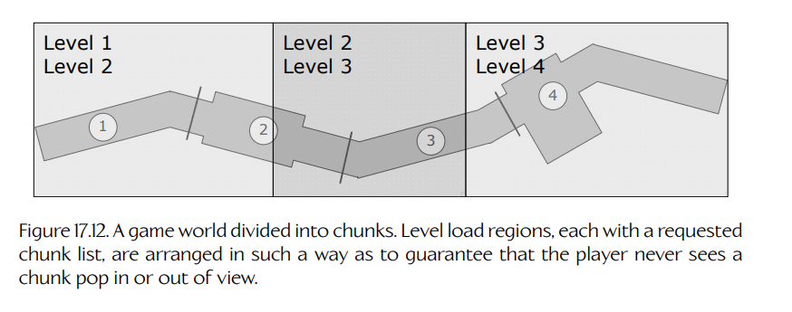

## 17.4 加载与流式加载游戏世界

为了弥合离线世界编辑器与运行时游戏对象模型之间的差距，我们需要一种方法，将世界分块加载到内存中，并在不再需要时卸载它们。游戏世界加载系统有两个主要职责：管理将游戏世界分块及其他所需资源从磁盘加载到内存所必需的文件 I/O；管理这些资源的内存分配与释放。引擎还需要管理游戏对象在游戏中出现和消失时的**生成**（spawning）与**销毁**（destruction），这既包括为对象分配和释放内存，也包括确保为每个游戏对象实例化正确的类。在以下各节中，我们将考察游戏世界是如何加载的，并了解对象生成系统通常如何工作。

### 17.4.1 简单关卡加载

最直接的游戏世界加载方法，也是所有早期游戏所采用的方法，是同一时刻只允许加载一个游戏世界分块（也称为关卡）。当游戏首次启动时，以及在两个关卡之间，玩家会看到一个静态或简单动画的二维加载画面，并等待关卡加载完成。

这种设计中的内存管理相当直接。正如我们在 Section 7.2.2.7 中提到的，基于栈的分配器非常适合一次只加载一个关卡的世界加载设计。当游戏首次运行时，会在栈底加载所有游戏关卡都需要的资源数据。在本次讨论中，我们称这些资源为**加载并常驻资源**（load and stay resident assets, LSR）。当 LSR 资源完全加载后，会记录栈指针的位置。每个游戏世界分块，连同其相关的网格、纹理、音频、动画以及其他资源数据，都会加载到栈中 LSR 资源之上。当玩家完成该关卡后，只需将栈指针重置到 LSR 资源块顶部，就可以释放该关卡的全部内存。此时，就可以在同一位置加载一个新关卡。Figure 17.11 展示了这一过程。

**Figure 17.11.** 基于栈的内存分配器非常适合一次只加载一个关卡的世界加载系统。

虽然这种设计非常简单，但它有许多缺点。首先，玩家只能以离散分块的形式看到游戏世界——这种技术无法实现一个巨大、连续、无缝的世界。另一个问题是，在加载关卡资源数据期间，内存中并不存在游戏世界。因此，玩家不得不观看某种二维加载画面。

### 17.4.2 迈向无缝加载：气闸

避免无聊关卡加载画面的最佳方法，是允许玩家在下一个世界分块及其相关资源数据加载时继续游玩游戏。一种简单方法是，将我们为游戏世界资源预留的内存划分为两个大小相等的块。我们可以将关卡 A 加载到一个内存块中，允许玩家开始游玩关卡 A，然后使用流式文件 I/O 库将关卡 B 加载到另一个内存块中（也就是说，加载代码会在单独线程中运行）。这种技术的主要问题在于，相对于一次只加载一个关卡的方法，它会将每个关卡可用的大小削减一半。

我们也可以通过将游戏世界内存划分为两个大小不等的块来实现类似效果——一个大块能够容纳“完整”的游戏世界分块，另一个小块只需足够容纳一个很小的世界分块。这个小分块有时称为**气闸**（air lock）。

当游戏开始时，会加载一个“完整”分块和一个“气闸”分块。玩家穿过完整分块并进入气闸，此时某种门或其他障碍物会确保玩家既看不到之前的完整世界区域，也无法返回那里。随后可以卸载完整分块，并加载一个新的完整大小的世界分块。在加载期间，玩家会在气闸中忙于执行某项任务。该任务可以简单到只是从走廊一端走到另一端，也可以更有参与感，例如解谜或与敌人战斗。

异步文件 I/O 使得完整世界分块能够在玩家同时位于气闸区域中游玩时被加载。更多细节见 Section 7.1.3。需要注意的是，当新游戏启动时，气闸系统并不能让我们免于显示加载画面，因为在初始加载期间，内存中还没有可供游玩的游戏世界。然而，一旦玩家进入游戏世界，由于气闸和异步数据加载，他们就不需要再次看到加载画面。

Xbox 版 *Halo* 使用了与此类似的技术。大型世界区域总是由更小、更受限制的区域连接起来。当你游玩 *Halo* 时，留意那些阻止你返回的封闭区域——大约每 5 到 10 分钟的游戏过程中就能发现一个。PlayStation 2 版 *Jak 2* 也使用了气闸技术。它的游戏世界被组织成一个枢纽区域（主城市）以及若干分支区域，每个分支区域都通过一个小型、封闭的气闸区域连接到枢纽。

### 17.4.3 游戏世界流式加载

许多游戏设计都要求玩家感觉自己是在一个巨大、连续、无缝的世界中游玩。理想情况下，玩家不应该周期性地被限制在小型气闸区域内——最好是世界能够尽可能自然且可信地在玩家面前展开。

现代游戏引擎通过一种称为**流式加载**（streaming）的技术支持这类无缝世界。世界流式加载可以通过多种方式完成。主要目标始终是：（a）在玩家执行常规玩法任务时加载数据；（b）以一种消除**碎片化**（fragmentation）的方式管理内存，同时允许随着玩家在游戏世界中推进而按需加载和卸载数据。

近期主机和 PC 的内存比其前代多得多，因此现在可以同时将多个世界分块保留在内存中。我们可以设想将内存空间划分为三个大小相等的缓冲区。起初，我们将世界分块 A、B 和 C 加载到这三个缓冲区中，并允许玩家开始穿过分块 A。当玩家进入分块 B，并且已经足够深入，以至于分块 A 不再可见时，我们就可以卸载分块 A，并开始将新的分块 D 加载到第一个缓冲区中。当 B 不再可见时，也可以将其丢弃并加载分块 E。缓冲区的这种循环利用可以一直持续，直到玩家到达连续游戏世界的末尾。

粗粒度世界流式加载方法的问题在于，它会对世界分块的大小施加严格限制。整个游戏中的所有分块都必须大致相同大小——大到足以填满三个内存缓冲区中的大部分，但又绝不能更大。

绕过这个问题的一种方法，是采用粒度更细的内存划分方式。我们不再流式加载相对较大的世界分块，而是将每一个游戏资源——从游戏世界分块、前景网格，到纹理、动画库——都划分为大小相等的数据块。然后，我们可以使用一种分块式、基于池的内存分配系统，例如 Section 7.2.2.7 中描述的系统，按需加载和卸载资源数据，而不必担心内存碎片化。这本质上就是 Naughty Dog 的 *The Last of Us* 引擎所采用的技术。（不过，Naughty Dog 的实现还采用了一些复杂技术，用于利用未填满分块末端原本会被闲置的空间。）

#### 17.4.3.1 确定要加载哪些资源

在使用细粒度分块式内存分配器进行世界流式加载时，会出现一个问题：引擎如何知道在玩法过程中的任意时刻应该加载哪些资源？在 Naughty Dog 引擎中，我们使用一个相对简单的**关卡加载区域**（level load regions）系统来控制资源的加载和卸载。

所有 *Uncharted* 和 *The Last of Us* 游戏都发生在多个地理上彼此分离、内部连续的游戏世界中。例如，*Uncharted 4: A Thief’s End* 发生在巴拿马、新奥尔良、苏格兰、马达加斯加，以及传说中的海盗乌托邦 Libertalia。每个世界都存在于自身一致的世界空间中，但每个世界又被划分为许多地理上相邻的分块。每个分块都由一个称为**区域**（region）的简单凸体包围；这些区域之间会有一定重叠。每个区域都包含一个世界分块列表，表示当玩家位于该区域中时，哪些世界分块应该保留在内存中。

在任意给定时刻，玩家位于这些区域中的一个或多个区域内。为了确定应该保留在内存中的世界分块集合，我们只需取包围 Nathan Drake 角色的各个区域中的分块列表的**并集**（union）。关卡加载系统会周期性检查这个主分块列表，并将其与当前在内存中的世界分块集合进行比较。如果某个分块从主列表中消失，就会卸载该分块，从而释放它所占用的所有分配块。如果列表中出现一个新分块，就会将其加载到能够找到的任意空闲分配块中。关卡加载区域和世界分块的设计方式，需要保证玩家永远不会看到某个分块在卸载时突然从视野中消失，并且从某个分块开始加载，到其内容首次被玩家看到之间，有足够时间让该分块完全流式加载到内存中。Figure 17.12 展示了这种技术。

**Figure 17.12.** 一个被划分为分块的游戏世界。关卡加载区域各自拥有一个请求分块列表，并以某种方式布置，从而保证玩家永远不会看到分块突然弹入或弹出视野。

#### 17.4.3.2 PlayStation 上的 PlayGo

PlayStation 4 和 PlayStation 5 主机都包含一个名为 PlayGo 的功能，它使下载游戏的过程（相对于购买蓝光盘）比传统方式轻松得多。PlayGo 的工作方式是，只下载游玩游戏第一段所需的最小数据子集。PlayStation 会在后台下载游戏剩余内容，而玩家可以继续不间断地体验游戏。为了让这种方式良好工作，游戏当然必须支持上文所述的无缝关卡流式加载。

### 17.4.4 对象生成的内存管理

一旦游戏世界被加载到内存中，我们就需要管理世界中动态游戏对象的**生成**（spawning）过程。大多数游戏引擎都会拥有某种游戏对象生成系统，用于管理构成每个游戏对象的类或多个类的实例化，并在游戏对象不再需要时处理其销毁。任何对象生成系统的核心工作之一，都是管理新生成游戏对象的动态内存分配。动态分配可能很慢，因此必须采取措施，确保分配尽可能高效。并且，由于游戏对象大小差异很大，为它们进行动态分配可能导致内存碎片化，进而过早出现内存不足的情况。游戏对象内存管理有许多不同方法。以下各节将考察几种常见方法。

#### 17.4.4.1 用于对象生成的离线内存分配

有些游戏引擎以一种相当严格的方式解决分配速度和内存碎片化问题：完全不允许在玩法过程中进行动态内存分配。这类引擎允许动态加载和卸载游戏世界分块，但在加载某个分块时，会立即生成其中所有动态游戏对象。此后，不再允许创建或销毁任何游戏对象。你可以把这种技术理解为遵守“游戏对象守恒定律”。世界分块加载完成后，不会再创建或销毁任何游戏对象。

这种技术避免了内存碎片化，因为一个世界分块中所有游戏对象的内存需求（a）事先已知，并且（b）有界。这意味着，游戏对象所需的内存可以由世界编辑器离线分配，并作为世界分块数据本身的一部分包含进去。因此，所有游戏对象都从用于加载游戏世界及其资源的同一块内存中分配出来，并且它们并不比其他已加载资源数据更容易产生碎片化。这种方法还有一个好处：使游戏的内存使用模式高度可预测。绝不会出现一大群游戏对象意外生成到世界中，并导致游戏耗尽内存的情况。

缺点是，这种方法会严重限制游戏设计师。可以通过在世界编辑器中分配一个游戏对象，但指示它在世界首次加载时不可见且处于休眠状态，来模拟动态对象生成。稍后，该对象可以通过激活自身并让自己可见而“生成”。但游戏设计师必须在世界编辑器中首次创建游戏世界时，就预测每种类型游戏对象所需的总数量。如果他们想为玩家提供无限数量的医疗包、武器、敌人或其他某类游戏对象，就必须想办法循环复用这些游戏对象，否则就无能为力。

#### 17.4.4.2 用于对象生成的动态内存管理

游戏设计师大概更愿意使用一种支持真正动态对象生成的游戏引擎。虽然这比静态游戏对象生成方法更难实现，但它可以通过许多不同方式实现。

同样，主要问题是内存碎片化。由于不同类型的游戏对象（有时甚至是同一类型对象的不同实例）会占用不同数量的内存，因此我们无法使用自己最喜欢的无碎片分配器——池分配器。而且，由于游戏对象通常会以不同于其生成顺序的顺序被销毁，我们也不能使用基于栈的分配器。看起来，我们唯一的选择似乎是容易产生碎片化的堆分配器。幸运的是，有许多方式可以处理碎片化问题。以下各节将考察几种常见方法。

**每种对象类型一个内存池。**

如果能够保证每种游戏对象类型的各个实例都占用相同大小的内存，那么可以考虑为每种对象类型使用一个单独的内存池。实际上，我们只需要为每种**唯一游戏对象大小**使用一个池，因此大小相同的对象类型可以共享同一个池。

这样做可以完全避免内存碎片化，但这种方法的一个局限是，我们需要维护大量独立池。我们还需要对每种对象类型将需要多少实例作出有根据的估计。如果某个池元素太多，就会浪费内存；如果元素太少，就无法满足运行时的所有生成请求，游戏对象将无法生成。

**小型内存分配器。**

我们可以通过允许游戏对象从元素大小大于对象本身的池中分配出来，将“每种游戏对象类型一个池”的想法变得更加可行。这样可以显著减少所需唯一内存池的数量，代价是每个池中可能会浪费一些内存。

例如，我们可以创建一组池分配器，其中每个池的元素大小都是前一个池的两倍——也许是 8、16、32、64、128、256 和 512 字节。我们也可以使用符合其他适当模式的一系列元素大小，或者根据从运行中游戏收集到的分配统计信息确定大小列表。

每当尝试分配一个游戏对象时，我们就寻找元素大小大于或等于待分配对象大小的最小池。我们接受某些对象会浪费空间这一事实。作为回报，我们缓解了所有内存碎片化问题——这是一种相当公平的交换。如果遇到大于最大池的内存分配请求，我们总是可以把它交给通用堆分配器，因为大内存块的碎片化远不如小块碎片化问题严重。

这种类型的分配器有时称为**小型内存分配器**（small memory allocator）。对于能放入某个池的分配，它可以消除碎片化。它也可以显著加速小块数据的内存分配，因为池分配只涉及两次指针操作：从空闲元素链表中移除一个元素。这比通用堆分配便宜得多。

**内存重定位。**

另一种消除碎片化的方法，是直接攻击这个问题。这种方法称为**内存重定位**（memory relocation）。它会将已分配内存块向下移动到相邻的空闲孔洞中，以移除碎片化。移动内存本身很容易，但由于我们移动的是“活的”已分配对象，因此必须非常小心地修正任何指向被移动内存块的指针。更多细节见 Section 6.2.2.2。

### 17.4.5 存档

许多游戏允许玩家保存进度、退出游戏，并在稍后以离开时完全相同的状态重新加载游戏。**存档系统**（saved game system）类似于世界分块加载系统，因为它能够从磁盘文件或记忆卡中加载游戏世界状态。但该系统的需求与世界加载系统有所不同，因此二者通常是分离的（或只部分重叠）。

为了理解这两个系统需求之间的差异，让我们简要比较世界分块与存档文件。世界分块指定了世界中所有动态对象的初始条件，但它们也包含所有静态世界元素的完整描述。许多静态信息，例如背景网格和碰撞数据，往往会占用大量磁盘空间。因此，世界分块有时会由多个磁盘文件组成，并且与某个世界分块相关的数据总量通常很大。

存档文件也必须存储世界中游戏对象的当前状态信息。然而，它不需要存储任何可以通过读取世界分块数据来确定的信息的重复副本。例如，存档文件中没有必要保存静态几何体。存档也不需要存储每个对象状态的每个细节。一些对玩法没有影响的对象可以完全省略。对于其他游戏对象，我们可能只需要存储部分状态信息。只要玩家看不出游戏世界在保存并重新加载前后的状态差异（或者这些差异对玩家无关紧要），我们就得到了一个成功的存档系统。因此，存档文件往往比世界分块文件小得多，并且可能更重视数据压缩和省略。当大量存档文件必须放入旧主机使用的小型记忆卡中时，小文件大小尤其重要。但即使在今天，主机配备了大容量硬盘并连接到云存档系统，将存档文件大小保持得尽可能小仍然是一个好主意。

#### 17.4.5.1 检查点

实现存档的一种方法，是将保存限制在游戏中的特定点，这些点称为**检查点**（checkpoints）。这种方法的好处是，大多数关于游戏状态的信息都保存在每个检查点附近的当前世界分块中。无论是哪位玩家在游玩，这些数据始终完全相同，因此不需要存储在存档中。因此，基于检查点的存档文件可以非常小。我们可能只需要存储最后到达的检查点名称，再加上关于玩家角色当前状态的一些信息，例如玩家生命值、剩余生命数、物品栏中的物品、拥有的武器以及每种武器包含的弹药数量。有些基于检查点的游戏甚至不存储这些信息——它们会让玩家在每个检查点以已知状态开始。当然，基于检查点的游戏的缺点是可能引发用户挫败感，尤其是在检查点相隔很远时。

#### 17.4.5.2 随处保存

有些游戏支持一种称为**随处保存**（save anywhere）的功能。顾名思义，这类游戏允许在游玩过程中的任何时刻保存游戏状态。为了实现这一功能，存档数据文件的大小必然会显著增加。所有与玩法相关的游戏对象的当前位置和内部状态都必须保存下来，并在之后重新加载游戏时恢复。

在随处保存设计中，存档数据文件基本上包含与世界分块相同的信息，只是不包含世界的静态组件。可以为两个系统使用同一种数据格式，尽管可能存在一些因素使其不可行。例如，世界分块数据格式可能针对灵活性而设计，而存档格式可能会被压缩，以尽可能减小每个存档的大小。

正如我们提到过的，减少存档文件中需要存储的数据量的一种方式，是省略某些无关的游戏对象，并省略其他对象的一些无关细节。例如，我们不需要记住每个正在播放动画的精确时间索引，也不需要记住每个物理模拟刚体的精确动量和速度。我们可以依赖人类玩家不完美的记忆，只保存对游戏状态足够粗略的近似。
