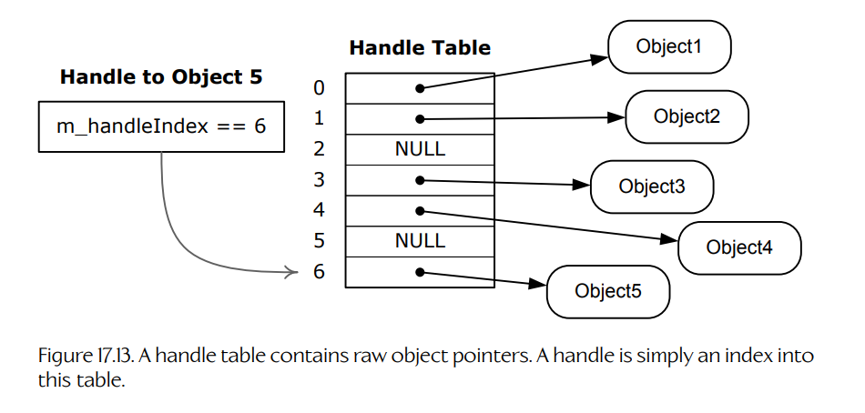

## 17.5 对象引用与世界查询

每个游戏对象通常都需要某种唯一 ID，使其能够与游戏中的其他对象区分开来、在运行时被找到、作为对象间通信的目标，等等。唯一对象 ID 在工具侧同样有用，因为它们可以用于在世界编辑器中识别和查找游戏对象。

在运行时，我们总是需要各种方式来查找游戏对象。我们可能希望根据对象的唯一 ID、对象类型，或一组任意条件来查找对象。我们也经常需要执行基于距离的查询，例如查找玩家角色 10 m 半径范围内的所有敌方外星人。

一旦通过查询找到了某个游戏对象，我们就需要某种方式引用它。在 C 或 C++ 这样的语言中，对象引用可以通过指针实现；也可以使用更复杂的机制，例如句柄或智能指针。对象引用的生命周期可能差异很大，可以短到只存在于单个函数调用的作用域内，也可以长达许多分钟。在以下各节中，我们将首先考察实现对象引用的各种方式。随后，我们将探讨在实现玩法时经常需要哪些类型的查询，以及这些查询可能如何实现。

### 17.5.1 指针

在 C 或 C++ 中，实现对象引用最直接的方式是使用指针（或 C++ 中的引用）。指针功能强大，而且几乎是最简单、最直观的方式。不过，指针也存在若干问题：

- **孤儿对象**（orphaned objects）。理想情况下，每个对象都应该拥有一个**所有者**（owner）——即另一个负责管理其生命周期的对象：创建它，并在不再需要时删除它。但指针本身并不会帮助程序员强制执行这条规则。结果可能产生**孤儿对象**：一个仍然占用内存，但系统中已不再需要它，也没有任何其他对象引用它的对象。
- **陈旧指针**（stale pointers）。如果一个对象被删除，理想情况下，我们应该将所有指向该对象的指针都置空。然而，如果忘记这样做，就会得到一个陈旧指针——指向一块曾经由有效对象占用、但现在已经空闲的内存块。如果有人试图通过陈旧指针读取或写入数据，结果可能是崩溃或错误的程序行为。陈旧指针可能很难追踪，因为在对象被删除之后，它们可能还会继续工作一段时间。只有在很久以后，当一个新对象被分配到那块陈旧内存块之上时，数据才真正发生变化并导致崩溃。
- **无效指针**（invalid pointers）。程序员可以自由地在指针中存储任何地址，包括完全无效的地址。一个常见问题是对空指针进行解引用。这类问题可以通过使用断言宏来防范，即在解引用指针之前检查指针绝不为空。更糟的是，如果某段数据被错误地解释为指针，对它进行解引用可能会导致程序从一个本质上随机的内存地址读取或写入数据。这通常会导致崩溃或其他严重问题，并且可能非常难以调试。

许多游戏引擎大量使用指针，因为它们是实现对象引用时最快、最高效、也最易于使用的方式。然而，有经验的程序员总是会对指针保持警惕；有些游戏团队则出于采用更安全编程实践的愿望，或出于必要性，转向更复杂的对象引用类型。例如，如果游戏引擎会在运行时重定位已分配的数据块，以消除内存碎片化（见 Section 6.2.2），那么简单指针就无法使用。我们要么需要使用一种能够稳健应对内存重定位的对象引用类型，要么就需要在每次移动内存块时，手动修正所有指向被重定位内存块的指针。

### 17.5.2 智能指针

**智能指针**（smart pointer）是一个小型对象，在大多数意图和用途上表现得像指针，但能避免原生 C/C++ 指针固有的大多数问题。最简单形式的智能指针会包含一个原生指针作为数据成员，并提供一组重载运算符，使它在大多数方面都能像指针一样工作。指针可以被解引用，因此 `*` 和 `->` 运算符会被重载，分别返回被引用对象的引用和指针，正如你所期望的那样。指针可以进行算术运算，因此 `+`、`-`、`++` 和 `--` 运算符也可以适当地重载。

由于智能指针是一个对象，因此它可以包含额外元数据，和/或执行普通指针无法执行的额外步骤。例如，智能指针可能包含一些信息，使它能够识别所指向的对象是否已被删除，并在这种情况下开始返回空地址。

智能指针还可以通过相互协作来确定某个特定对象的引用数量，从而帮助管理对象生命周期。这称为**引用计数**（reference counting）。当引用某个特定对象的智能指针数量降为零时，我们就知道该对象不再被需要，因此可以自动删除它。这可以让程序员不必担心对象所有权和孤儿对象问题。引用计数通常也是现代编程语言（如 Java 和 Python）中“垃圾回收”系统的核心。

智能指针也有自己的问题。首先，它们相对容易实现，但很难正确实现。需要处理的情况非常多，原始 C++ 标准库提供的 `std::auto_ptr` 类被广泛认为在许多场景下都不够充分。幸运的是，其中大部分问题在 C++11 中通过引入三个智能指针类得到了解决：`std::shared_ptr`、`std::weak_ptr` 和 `std::unique_ptr`。

C++11 的智能指针类借鉴了 Boost C++ 模板库提供的丰富智能指针设施。Boost 定义了六种不同类型的智能指针：

- `boost::scoped_ptr`。指向单个对象的指针，只有一个所有者。
- `boost::scoped_array`。指向对象数组的指针，只有一个所有者。
- `boost::shared_ptr`。指向某个对象的指针，该对象的生命周期由多个所有者共享。
- `boost::shared_array`。指向对象数组的指针，其生命周期由多个所有者共享。
- `boost::weak_ptr`。一种不拥有也不会自动销毁其引用对象的指针（该对象的生命周期假定由 `shared_ptr` 管理）。
- `boost::intrusive_ptr`。一种通过假定被指向对象会自行维护引用计数来实现引用计数的指针。侵入式指针很有用，因为它们与原生 C++ 指针大小相同（因为不需要引用计数装置），并且可以直接从原生指针构造。

正确实现智能指针类可能是一项艰巨任务。看一眼 Boost 智能指针文档 [390]，就能明白我的意思。各种问题都会出现，包括：

- 智能指针的类型安全；
- 智能指针是否能用于不完整类型；
- 发生异常时智能指针的正确行为；
- 运行时成本，而这可能很高。

我曾参与过一个项目，该项目尝试实现自己的智能指针；直到项目最后，我们仍在修复各种与它们有关的棘手 bug。我的个人建议是远离自己实现的智能指针；如果必须使用它们，就使用成熟实现，例如 C++11 标准库或 Boost，而不是自己从头写。

### 17.5.3 句柄

**句柄**（handle）在许多方面都像智能指针，但实现起来更简单，并且往往不那么容易出问题。句柄本质上是一个指向**全局句柄表**（global handle table）的整数索引。句柄表则包含指向句柄所引用对象的指针。要创建一个句柄，我们只需在句柄表中查找目标对象的地址，并将其索引存储到句柄中。要解引用句柄，调用代码只需索引到句柄表中适当的槽位，并解引用其中找到的指针。Figure 17.13 展示了这一点。

**Figure 17.13.** 句柄表包含原始对象指针。句柄只是这张表中的一个索引。

由于句柄表提供了一层简单间接访问，句柄比原始指针安全得多，也灵活得多。如果某个对象被删除，它只需将自己在句柄表中的条目置空。这会导致所有指向该对象的现有句柄立即并自动变成空引用。句柄也支持内存重定位。当对象在内存中被重定位时，可以在句柄表中找到它的地址并适当更新。同样，所有指向该对象的现有句柄都会因此被自动更新。

句柄可以实现为一个原始整数。不过，句柄表索引通常会被包装在一个简单类中，以便提供一个用于创建和解引用句柄的便利接口。

句柄也可能引用到陈旧对象。例如，假设我们创建了一个指向对象 A 的句柄，对象 A 占据句柄表中的第 17 号槽位。稍后，对象 A 被删除，第 17 号槽位被置空。再后来，创建了一个新对象 B，它恰好占据句柄表中的第 17 号槽位。如果在对象 B 创建时仍然存在任何遗留的对象 A 句柄，它们就会突然开始引用对象 B（而不是空引用）。这显然不是期望的行为。

解决陈旧句柄问题的一种简单方式，是在每个句柄中包含一个唯一对象 ID。这样，当指向对象 A 的句柄被创建时，它不仅包含第 17 号槽位索引，还包含对象 ID “A”。当对象 B 取代 A 在句柄表中的位置时，任何遗留的对象 A 句柄在索引上仍然匹配，但在对象 ID 上不匹配。这使陈旧的对象 A 句柄在被解引用时仍然返回空，而不是意外返回指向对象 B 的指针。

下面的代码片段展示了一个简单句柄类可能如何实现。注意，我们还在 `GameObject` 类本身中包含了句柄索引——这允许我们非常快速地为 `GameObject` 创建新句柄，而不必在句柄表中搜索其地址来确定句柄索引。

    // Within the GameObject class, we store a unique id,
    // and also the object's handle index, for efficient
    // creation of new handles.

    class GameObject
    {
    private:
        // ...

        GameObjectId m_uniqueId;     // object's unique id
        U32          m_handleIndex;  // speedier handle
                                     // creation

        friend class GameObjectHandle; // access to id and
                                       // index

        // ...

    public:
        GameObject() // constructor
        {
            // The unique id might come from the world editor,
            // or it might be assigned dynamically at runtime.
            m_uniqueId = AssignUniqueObjectId();

            // The handle index is assigned by finding the
            // first free slot in the handle table.
            m_handleIndex = FindFreeSlotInHandleTable();

            // ...
        }
        // ...

    };

    // This constant defines the size of the handle table,
    // and hence the maximum number of game objects that can
    // exist at any one time.
    static const U32 MAX_GAME_OBJECTS = 20480;

    // This is the global handle table -- a simple array of
    // pointers to GameObjects.
    static GameObject* g_apGameObject[MAX_GAME_OBJECTS];

    // This is our simple game object handle class.
    class GameObjectHandle
    {
    private:
        U32          m_handleIndex; // index into the handle
                                    // table
        GameObjectId m_uniqueId;   // unique id avoids stale
                                    // handles

    public:
        explicit GameObjectHandle(GameObject& object) :
            m_handleIndex(object.m_handleIndex),
            m_uniqueId(object.m_uniqueId)
        {
        }

        // This function dereferences the handle.
        GameObject* ToObject() const
        {
            GameObject* pObject
                = g_apGameObject[m_handleIndex];

            if (pObject != nullptr
                &&  pObject->m_uniqueId == m_uniqueId)
            {
                return pObject;
            }

            return nullptr;
        }
    };

这个示例可以工作，但并不完整。我们可能还想实现拷贝语义、提供额外的构造函数变体，等等。全局句柄表中的条目也可能包含额外信息，而不仅仅是指向每个游戏对象的原始指针。当然，这种固定大小句柄表实现并不是唯一可能的设计；不同引擎中的句柄系统会有所差异。

还应注意，全局句柄表有一个有利的副作用：它为系统中的所有活跃游戏对象提供了一个现成列表。例如，全局句柄表可以用于快速、高效地遍历世界中的所有游戏对象。在某些情况下，它还可以让其他类型的查询更容易实现。

### 17.5.4 游戏对象查询

每个游戏引擎至少都会提供几种方式，用于在运行时查找游戏对象。我们将这些搜索称为**游戏对象查询**（game object queries）。最简单的查询类型是根据唯一 ID 查找某个特定游戏对象。不过，真实游戏引擎还会执行许多其他类型的游戏对象查询。下面只是游戏开发者可能希望执行的几类查询示例：

- 查找所有对玩家具有视线的敌方角色。
- 遍历某一特定类型的所有游戏对象。
- 查找所有生命值超过 80% 的可破坏游戏对象。
- 将伤害传递给爆炸半径范围内的所有游戏对象。
- 按从近到远的顺序，遍历子弹或其他抛射物路径上的所有对象。

这个列表可以继续列出许多页；当然，其内容高度依赖于正在制作的具体游戏设计。

为了在执行游戏对象查询时获得最大灵活性，我们可以设想一个通用游戏对象数据库，它具有使用任意搜索条件构造任意查询的能力。理想情况下，这个游戏对象数据库能够极其高效、快速地执行所有这些查询，并充分利用所有可用硬件和软件资源。

现实中，这种理想的灵活性与惊人速度的组合通常并不可能实现。相反，游戏团队通常会在游戏开发期间判断哪些查询类型最可能被需要，并实现专门数据结构来加速这些特定类型的查询。当新查询变得必要时，工程师要么利用已有数据结构来实现它们，要么在无法获得足够速度时发明新的数据结构。下面是几种可以加速特定类型游戏对象查询的专门数据结构示例：

- **按唯一 ID 查找游戏对象**。可以将指向游戏对象的指针或句柄存储在哈希表或二叉搜索树中，并以唯一 ID 作为键。
- **遍历所有满足某一特定条件的对象**。可以根据各种条件，将游戏对象预先排序到链表中（前提是这些条件事先已知）。例如，我们可以构建一个包含某一特定类型所有游戏对象的列表，维护一个包含玩家某一特定半径范围内所有对象的列表，等等。
- **查找抛射物路径上或对某个目标点具有视线的所有对象**。碰撞系统通常会被用于执行这类游戏对象查询。大多数碰撞系统都提供快速射线投射；有些还提供将其他形状（例如球体或任意凸体）投射到世界中，以确定它们命中了什么的能力。（见 [Section 14.3.7](../14-collision-and-rigid-body-dynamics/03-the-collision-detection-system.md#1437-advanced-collision-queries)。）
- **查找给定区域或半径范围内的所有对象**。我们可以考虑将游戏对象存储在某种空间哈希数据结构中。这可以简单到在整个游戏世界上放置一个水平网格，也可以更复杂，例如四叉树、八叉树、kd 树，或其他编码空间邻近关系的数据结构。