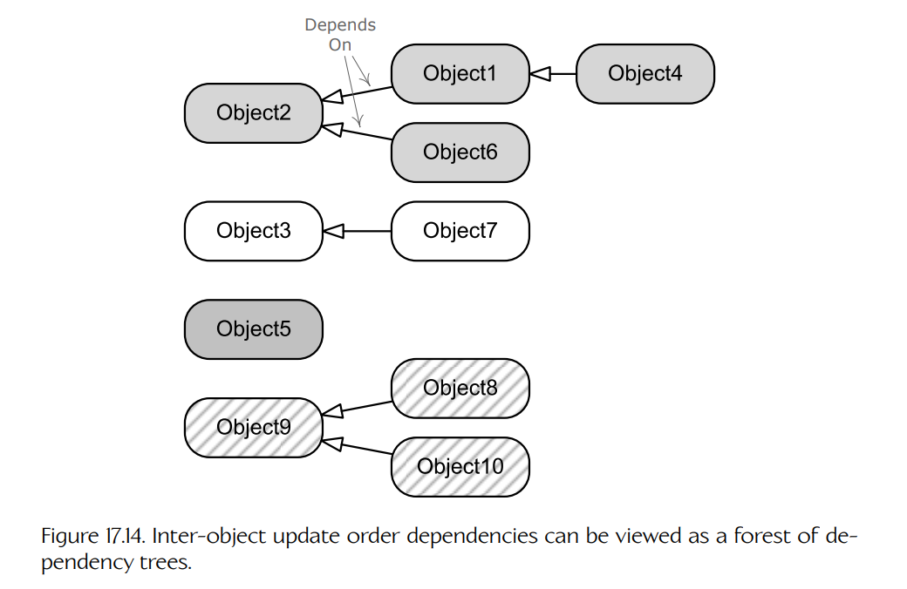
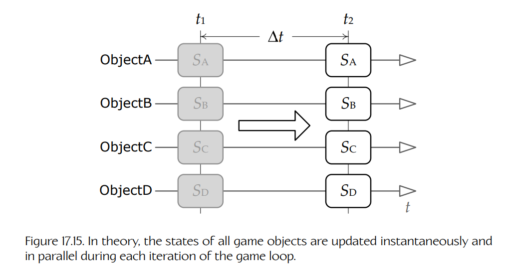

## 17.6 实时更新游戏对象

每个游戏引擎，无论简单还是复杂，都需要某种方式随着时间更新每个游戏对象的内部状态。游戏对象的**状态**（state）可以定义为其所有**属性**（attributes）的取值；这些属性有时也称为 **properties**，在 C++ 语言中则称为**数据成员**（data members）。例如，*Pong* 中球的状态由它在屏幕上的 `(x, y)` 位置以及它的速度（运动速度和方向）描述。由于游戏是动态的、基于时间的模拟，因此游戏对象的状态描述的是它在**某一个特定瞬间**的配置。换句话说，从游戏对象的角度来看，时间是**离散的**（discrete），而不是**连续的**（continuous）。（不过，正如我们将会看到的，把对象状态理解为连续变化、然后由引擎离散采样，会有助于避免一些常见陷阱。）

在以下讨论中，我们将使用符号 `Sᵢ(t)` 表示对象 `i` 在任意时间 `t` 的状态。这里使用向量记法在严格数学意义上并不完全正确，但它提醒我们：游戏对象的状态类似于一个异构的 `n` 维向量，包含各种不同数据类型的信息。需要注意，这里“状态”一词的用法不同于**有限状态机**（finite state machine）中的状态。一个游戏对象完全可以通过一个或多个有限状态机实现；在这种情况下，每个 FSM 当前状态的规格说明，只不过是游戏对象整体状态向量 `S(t)` 的一部分。

大多数底层引擎子系统（渲染、动画、碰撞、物理、音频等）都需要周期性更新，游戏对象系统也不例外。正如第 8 章所见，更新通常通过一个主循环完成，这个主循环称为**游戏循环**（game loop）。几乎所有游戏引擎都会把游戏对象状态更新作为主游戏循环的一部分；换句话说，它们会把游戏对象模型视为另一个需要周期性服务的引擎子系统。

因此，游戏对象更新可以被理解为这样一个过程：根据每个对象在先前时间 `Sᵢ(t − Δt)` 的状态，确定它在当前时间 `Sᵢ(t)` 的状态。当所有对象状态都被更新后，当前时间 `t` 就会成为新的先前时间 `(t − Δt)`，只要游戏继续运行，这个过程就会反复进行。通常，引擎会维护一个或多个**时钟**（clocks）：其中一个精确追踪真实时间，其他时钟则可能对应或不对应真实时间。这些时钟向引擎提供绝对时间 `t`，和/或游戏循环从一次迭代到下一次迭代之间的时间变化量 `Δt`。驱动游戏对象状态更新的时钟通常允许偏离真实时间。这使游戏对象行为可以暂停、减速、加速，甚至反向运行——只要游戏设计需要即可。这些功能对于游戏调试和开发也非常宝贵。

正如第 1 章中所学，游戏对象更新系统是计算机科学中所谓**动态、实时、基于代理的计算机模拟**（dynamic, real-time, agent-based computer simulation）的一个例子。游戏对象更新系统也表现出**离散事件模拟**（discrete event simulations）的某些方面（关于事件的更多细节，见 [Section 17.8](08-events-and-message-passing.md#178-events-and-message-passing)）。这些都是计算机科学中研究充分的领域，并且在交互娱乐之外也有许多应用。游戏是较复杂的一类基于代理的模拟——正如我们将会看到的，在动态、交互式虚拟环境中随时间更新游戏对象状态，可能出人意料地难以做好。游戏程序员可以通过研究更广泛的基于代理模拟和离散事件模拟领域，学到许多关于游戏对象更新的知识。而这些领域的研究者也很可能从游戏引擎设计中学到一两点东西！

和所有高层游戏引擎系统一样，每个引擎都会采取略有不同（有时甚至截然不同）的方法。不过，和之前一样，大多数游戏团队会遇到一组共同问题，而某些设计模式也会在几乎所有引擎中反复出现。在本节中，我们将考察这些常见问题以及一些常见解决方案。请记住，有些游戏引擎可能使用与这里描述非常不同的方案，而有些游戏设计也会面临这里无法覆盖的独特问题。

### 17.6.1 一种简单方法（但行不通）

更新一组游戏对象状态的最简单方法，是遍历该集合，并依次在每个对象上调用一个虚函数，比如命名为 `Update()`。这通常会在主游戏循环的每次迭代中执行一次（即每帧一次）。游戏对象类可以为 `Update()` 函数提供自定义实现，以执行将该类型对象推进到下一个离散时间索引所需的任何任务。可以将上一帧到当前帧之间的时间增量传递给 update 函数，使对象能够正确考虑时间流逝。因此，在最简单形式下，`Update()` 函数签名可能类似于：

    virtual void Update(float dt);

为了便于后续讨论，我们假定引擎采用单体对象层级，其中每个游戏对象由单个类的单个实例表示。不过，这里的思想可以很容易扩展到几乎任何以对象为中心的设计。例如，要更新基于组件的对象模型，我们可以在构成每个游戏对象的所有组件上调用 `Update()`，也可以在“枢纽”对象上调用 `Update()`，让它根据需要更新其关联组件。我们还可以把这些思想扩展到以属性为中心的设计中，即每帧对每个属性实例调用某种 `Update()` 函数。

常言道，魔鬼在细节中。因此，这里需要考察两个重要细节。第一，我们应该如何维护所有游戏对象的集合？第二，`Update()` 函数应该负责做哪些事情？

#### 17.6.1.1 维护活跃游戏对象集合

活跃游戏对象集合通常由一个单例管理器类维护，也许命名为 `GameWorld` 或 `GameObjectManager`。游戏对象集合通常需要是动态的，因为游戏对象会随着游戏进行而被生成和销毁。因此，使用指针、智能指针或游戏对象句柄组成的**链表**（linked list）是一种简单而有效的方法。（有些游戏引擎不允许动态生成和销毁游戏对象；这类引擎可以使用静态大小的游戏对象指针、智能指针或句柄**数组**，而不是链表。）正如后面将看到的，大多数引擎会使用比简单扁平链表更复杂的数据结构来追踪游戏对象。但暂时为了便于理解，我们可以把这个数据结构想象成一个链表。

#### 17.6.1.2 更新函数的职责

游戏对象的 `Update()` 函数主要负责：根据对象先前状态 `Sᵢ(t − Δt)`，确定它在当前离散时间索引 `Sᵢ(t)` 下的状态。这可能涉及对对象应用刚体动力学模拟、采样预制动画、响应当前时间步中发生的事件，等等。

大多数游戏对象会与一个或多个引擎子系统交互。它们可能需要播放动画、被渲染、发射粒子效果、播放音频、与其他对象及静态几何体发生碰撞，等等。每个这类系统都有自己的内部状态，这些状态也必须随时间更新，通常每帧更新一次或数次。看起来，直接从游戏对象的 `Update()` 函数内部更新所有这些子系统似乎既合理又直观。例如，考虑下面这个假想的 Tank 对象 update 函数：

    virtual void Tank::Update(float dt)
    {
        // Update the state of the tank itself.
        MoveTank(dt);
        DeflectTurret(dt);

        FireIfNecessary();

        // Now update low-level engine subsystems on behalf
        // of this tank. (NOT a good idea... see below!)
        m_pAnimationComponent->Update(dt);
        m_pCollisionComponent->Update(dt);
        m_pPhysicsComponent->Update(dt);
        m_pAudioComponent->Update(dt);
        m_pRenderingComponent->draw();
    }

如果我们的 `Update()` 函数都像这样组织，那么游戏循环几乎可以完全由游戏对象更新来驱动，如下所示：

    while (true)
    {
        PollJoypad();

        float dt = g_gameClock.CalculateDeltaTime();

        for (each gameObject)
        {
            // This hypothetical Update() function updates
            // all engine subsystems!
            gameObject.Update(dt);
        }

        g_renderingEngine.SwapBuffers();
    }

上面这种对象更新的简单方法看起来很诱人，但在商业级游戏引擎中通常并不可行。在以下各节中，我们将探讨这种简单方法存在的一些问题，并考察每个问题的常见解决方式。

### 17.6.2 性能约束与批量更新

大多数底层引擎系统都有极其严格的性能约束。它们处理大量数据，并且必须尽可能快速地在每帧完成大量计算。因此，大多数引擎系统都能从**批量更新**（batched updating）中受益。例如，一次批量更新大量动画，通常远比将每个对象的动画更新与其他无关操作交错执行更高效；这些无关操作可能包括碰撞检测、物理模拟和渲染。

在大多数商业游戏引擎中，每个引擎子系统会由主游戏循环直接或间接更新，而不是在每个对象的 `Update()` 函数内部以逐对象方式更新。如果某个游戏对象需要特定引擎子系统的服务，它会请求该子系统代其分配一些该子系统特有的状态信息。例如，一个希望通过三角形网格渲染的游戏对象，可能会请求渲染子系统为它分配一个**网格实例**（mesh instance）。（正如 [Section 11.3.8.2](../11-rendering-engine/03-visual-effects-and-overlays.md#11382-instanced-rendering) 中所述，mesh instance 表示三角形网格的一个实例——它记录该实例在世界空间中的位置、朝向和缩放，是否可见，每实例材质数据，以及任何其他可能相关的每实例信息。）渲染引擎会在内部维护一个网格实例集合。它可以按自己认为合适的方式管理这些网格实例，以最大化自身运行时性能。游戏对象通过操纵 mesh instance 对象的属性来控制自己**如何**被渲染，但游戏对象并不直接控制 mesh instance 的渲染。相反，在所有游戏对象都有机会更新自身之后，渲染引擎会以一次高效的批处理绘制所有可见网格实例。

采用批量更新后，某个特定游戏对象的 `Update()` 函数（例如我们假想的 tank 对象）可能更像下面这样：

    virtual void Tank::Update(float dt)
    {
        // Update the state of the tank itself.
        MoveTank(dt);
        DeflectTurret(dt);
        FireIfNecessary();

        // Control the properties of my various engine
        // subsystem components, but do NOT update
        // them here...

        if (justExploded)
        {
            m_pAnimationComponent->PlayAnimation("explode");
        }

        if (isVisible)
        {
            m_pCollisionComponent->Activate();
            m_pRenderingComponent->Show();
        }
        else
        {
            m_pCollisionComponent->Deactivate();
            m_pRenderingComponent->Hide();
        }

        // etc.
    }

游戏循环随后会更像这样：

    while (true)
    {
        PollJoypad();

        float dt = g_gameClock.CalculateDeltaTime();

        for (each gameObject)
        {
            gameObject.Update(dt);
        }

        g_animationEngine.Update(dt);
        g_physicsEngine.Simulate(dt);
        g_collisionEngine.DetectAndResolveCollisions(dt);
        g_audioEngine.Update(dt);
        g_renderingEngine.RenderFrameAndSwapBuffers();
    }

批量更新带来许多性能收益，包括但不限于：

- **最大化缓存一致性**（maximal cache coherency）。批量更新允许引擎子系统达到最大缓存一致性，因为它的逐对象数据由其内部维护，并且可以被安排在 RAM 中单个连续区域内。
- **最小化重复计算**（minimal duplication of computations）。全局计算可以执行一次，并复用于许多游戏对象，而不是为每个对象重新计算。
- **减少资源重分配**（reduced reallocation of resources）。引擎子系统在更新期间常常需要分配和管理内存和/或其他资源。如果某个特定子系统的更新与其他引擎子系统交错执行，那么对每个被处理游戏对象来说，这些资源都必须被释放并重新分配。但如果更新被批量执行，资源就可以每帧分配一次，并被批次中的所有对象复用。
- **高效流水线化**（efficient pipelining）。许多引擎子系统会对游戏世界中的每一个对象执行几乎相同的一组计算。当更新被批量执行时，可以采用 scatter/gather 方法，将大工作负载分配到多个 CPU 核心上。这种并行性在逐个对象孤立处理时无法实现。

性能收益并不是偏好批量更新方法的唯一原因。有些引擎子系统在逐对象更新时根本无法正常工作。例如，如果要在多个动态刚体组成的系统中求解碰撞，那么通常无法通过孤立考虑每个对象来得到令人满意的解。这些对象之间的相互穿透必须作为一个整体进行求解，要么通过迭代方法，要么通过求解线性系统。

### 17.6.3 对象与子系统之间的相互依赖

即使我们不关心性能，简单的逐对象更新方法也会在游戏对象彼此**依赖**时失效。例如，一个人类角色可能抱着一只猫。为了计算猫骨骼的世界空间姿态，我们首先需要计算人的世界空间姿态。这意味着，对象更新的**顺序**对于游戏正确运行非常重要。

当引擎子系统彼此依赖时，也会出现另一个相关问题。例如，布娃娃物理模拟必须与动画引擎协同更新。通常，动画系统会产生一个中间的局部空间骨骼姿态。这些关节变换会被转换到世界空间，并应用到一组相连刚体上，这些刚体在物理系统中近似表示骨骼。刚体随后由物理系统随时间向前模拟，然后关节的最终静止位置会被应用回骨骼中的相应关节。最后，动画系统计算世界空间姿态和蒙皮矩阵调色板。因此，动画系统和物理系统的更新又一次必须按照特定顺序发生，才能产生正确结果。这类子系统间依赖在游戏引擎设计中非常常见。

#### 17.6.3.1 分阶段更新

为了处理子系统间依赖，我们可以在主游戏循环中显式地按正确顺序编写引擎子系统更新。例如，为了处理动画系统与布娃娃物理之间的相互作用，我们可能会写出类似下面这样的代码：

    while (true) // main game loop
    {
        // ...

        g_animationEngine.CalculateIntermediatePoses(dt);
        g_ragdollSystem.ApplySkeletonsToRagDolls();
        g_physicsEngine.Simulate(dt); // runs ragdolls too
        g_collisionEngine.DetectAndResolveCollisions(dt);
        g_ragdollSystem.ApplyRagDollsToSkeletons();
        g_animationEngine.FinalizePoseAndMatrixPalette();

        // ...
    }

我们必须小心地在游戏循环中的正确时间更新游戏对象状态。这通常并不像每帧为每个游戏对象调用一次 `Update()` 函数那么简单。游戏对象可能依赖由各种引擎子系统执行计算所产生的中间结果。例如，一个游戏对象可能请求在动画系统运行其更新之前播放动画。然而，同一个对象也可能希望在该姿态被布娃娃物理系统使用之前，以程序化方式调整动画系统生成的中间姿态，和/或在最终姿态与矩阵调色板生成之前进行调整。这意味着该对象必须被更新两次：一次在动画计算中间姿态之前，一次在其之后。

许多游戏引擎允许游戏对象在一帧中的多个点运行更新逻辑。例如，Naughty Dog 引擎（驱动 *Uncharted* 和 *The Last of Us* 系列的引擎）会对游戏对象更新三次：一次在动画混合之前，一次在动画混合之后但最终姿态生成之前，一次在最终姿态生成之后。可以通过为每个游戏对象类提供三个作为 “hook” 的虚函数来实现这一点。在这样的系统中，游戏循环最终可能类似于：

    while (true) // main game loop
    {
        // ...

        for (each gameObject)
        {
            gameObject.PreAnimUpdate(dt);
        }

        g_animationEngine.CalculateIntermediatePoses(dt);

        for (each gameObject)
        {
            gameObject.PostAnimUpdate(dt);
        }

        g_ragdollSystem.ApplySkeletonsToRagDolls();
        g_physicsEngine.Simulate(dt); // runs ragdolls too
        g_collisionEngine.DetectAndResolveCollisions(dt);
        g_ragdollSystem.ApplyRagDollsToSkeletons();
        g_animationEngine.FinalizePoseAndMatrixPalette();

        for (each gameObject)
        {
            gameObject.FinalUpdate(dt);
        }

        // ...
    }

我们可以根据需要为游戏对象提供任意多个更新阶段。但必须谨慎，因为遍历所有游戏对象并对每个对象调用虚函数可能很昂贵。此外，并不是所有游戏对象都需要所有更新阶段——遍历那些不需要某个特定阶段的对象，纯粹是在浪费 CPU 带宽。

实际上，上面的例子并不完全现实。直接遍历所有游戏对象并调用它们的 `PreAnimUpdate()`、`PostAnimUpdate()` 和 `FinalUpdate()` hook 函数会非常低效，因为每个 hook 中可能只有很小比例的对象真正需要执行逻辑。这也是一种不灵活的设计，因为它只支持游戏对象——如果我们想在后动画阶段更新粒子系统，就无能为力了。最后，这种设计会导致底层引擎系统与游戏对象系统之间产生不必要的**耦合**（coupling）。

更好的设计选择是使用一种通用回调机制。在这种设计中，动画系统会提供一种设施，允许任何客户端代码（游戏对象或任何其他引擎系统）为三个更新阶段中的每一个注册一个回调函数（动画前、动画后和最终阶段）。动画系统会遍历所有已注册回调，并调用它们，而不需要“知道”游戏对象本身。这能最大化性能，因为只有真正需要更新的客户端才会注册回调并在每帧被调用。它也能最大化灵活性，并消除游戏对象系统与其他引擎子系统之间不必要的耦合，因为任何客户端都可以注册回调，而不仅仅是游戏对象。

#### 17.6.3.2 分桶更新

在存在**对象间依赖**（inter-object dependencies）时，上面描述的分阶段更新技术还需要稍作调整。这是因为对象间依赖可能导致关于更新顺序的规则互相冲突。例如，假设对象 B 正被对象 A 持有。进一步假设，我们只能在 A 被**完全更新**之后更新对象 B，这包括计算 A 的最终世界空间姿态和矩阵调色板。然而，这与将所有游戏对象的动画更新批处理在一起，以便动画系统获得最大吞吐量的需求相冲突。

对象间依赖可以被可视化为一片依赖树森林。没有父节点的游戏对象（不依赖任何其他对象）表示森林中的根。直接依赖其中一个根对象的对象，位于森林中某棵树的第一层子节点。依赖第一层子节点的对象则成为第二层子节点，依此类推。Figure 17.14 展示了这一点。

**Figure 17.14.** 对象间更新顺序依赖可以被看作一片依赖树森林。

解决更新顺序需求冲突的一种方案，是将对象收集到彼此独立的组中。由于缺少更好的名称，我们在这里称这些组为**桶**（buckets）。第一个桶包含森林中的所有根对象。第二个桶由所有第一层子节点组成。第三个桶包含所有第二层子节点，依此类推。对于每个桶，我们对其中的游戏对象和引擎系统执行一次完整更新，并完成所有更新阶段。然后，我们对每个桶重复整个过程，直到没有更多桶为止。

从理论上说，依赖森林中各棵树的深度是无界的。然而在实践中，它们通常很浅。例如，我们可能有角色持有武器，而这些角色又可能站在移动平台或载具上。为了实现这一点，我们只需要依赖森林中的三层，因此只需要三个桶：一个用于平台/载具，一个用于角色，一个用于角色手中的武器。许多游戏引擎会显式限制依赖森林的深度，从而能够使用固定数量的桶（假设它们采用分桶方法——当然，架构游戏循环还有许多其他方式）。

下面展示了一个分桶、分阶段、批量更新循环可能的样子：

    enum Bucket
    {
        kBucketVehiclesPlatforms,
        kBucketCharacters,
        kBucketAttachedObjects,
        kBucketCount
    };

    void UpdateBucket(Bucket bucket)
    {
        // ...

        for (each gameObject in bucket)
        {
            gameObject.PreAnimUpdate(dt);
        }

        g_animationEngine.CalculateIntermediatePoses
            (bucket, dt);

        for (each gameObject in bucket)
        {
            gameObject.PostAnimUpdate(dt);
        }

        g_ragdollSystem.ApplySkeletonsToRagDolls(bucket);
        g_physicsEngine.Simulate(bucket, dt); // ragdolls etc.
        g_collisionEngine.DetectAndResolveCollisions
            (bucket, dt);
        g_ragdollSystem.ApplyRagDollsToSkeletons(bucket);
        g_animationEngine.FinalizePoseAndMatrixPalette
            (bucket);

        for (each gameObject in bucket)
        {
            gameObject.FinalUpdate(dt);
        }

        // ...
    }

    void RunGameLoop()
    {
        while (true)
        {
            // ...

            UpdateBucket(kBucketVehiclesAndPlatforms);
            UpdateBucket(kBucketCharacters);
            UpdateBucket(kBucketAttachedObjects);

            // ...

            g_renderingEngine.RenderSceneAndSwapBuffers();
        }
    }

在实践中，情况可能比这稍微复杂一些。例如，某些引擎子系统（如物理引擎）可能并不支持桶的概念，也许因为它们是第三方 SDK，或者因为它们无法以分桶方式实际更新。不过，这种分桶更新本质上就是 Naughty Dog 用来实现 *Uncharted* 和 *The Last of Us* 系列所有游戏的方法。因此，它已经被证明是一种实用且相当高效的方法。

#### 17.6.3.3 对象状态不一致与一帧延迟

让我们重新审视游戏对象更新，但这一次从每个对象的局部时间概念来思考。我们在 [Section 17.6](#176-实时更新游戏对象) 中说过，游戏对象 `i` 在时间 `t` 的状态可以表示为状态向量 `Sᵢ(t)`。当更新一个游戏对象时，我们会将它先前的状态向量 `Sᵢ(t₁)` 转换为新的当前状态向量 `Sᵢ(t₂)`，其中 `t₂ = t₁ + Δt`。

理论上，所有游戏对象的状态会从时间 `t₁` 瞬时且并行地更新到时间 `t₂`，如 Figure 17.15 所示。然而，如果假定我们的游戏更新循环是单线程的，那么实际情况是：对象会一个接一个地被更新——我们遍历每个游戏对象，并依次调用某种 update 函数。如果我们在这个更新循环中途停止程序，一半游戏对象的状态已经被更新到 `Sᵢ(t₂)`，而剩下一半仍然保持在先前状态 `Sᵢ(t₁)`。这意味着，如果在更新循环中询问两个游戏对象“当前时间是多少”，它们可能会给出不同答案！更进一步，根据我们究竟在更新循环的哪个位置中断，对象也可能全部处于部分更新状态。例如，动画姿态混合可能已经运行，但物理和碰撞解析可能尚未应用。这引出了下面这条规则：

**Figure 17.15.** 理论上，在游戏循环的每次迭代中，所有游戏对象的状态都会瞬时且并行地更新。

**Figure 17.16.** 实践中，游戏对象状态是逐个更新的。这意味着，在更新循环中的某个任意时刻，有些对象会认为当前时间是 `t₂`，而另一些对象仍然认为当前时间是 `t₁`。有些对象可能只被部分更新，因此其状态会在内部不一致。实际上，这类对象的状态位于 `t₁` 与 `t₂` 之间的某个点。

> 游戏对象的状态在更新循环**之前**和**之后**是一致的，但在更新循环**期间**可能是不一致的。

Figure 17.16 展示了这一点。

游戏对象状态在更新循环期间的不一致，是一个重要的困惑和 bug 来源，即使在游戏行业的专业人士中也是如此。这个问题最常在游戏对象于更新循环期间彼此查询状态信息时出现（这意味着它们之间存在依赖）。例如，如果对象 B 查看对象 A 的速度，以便确定它自己在时间 `t` 的速度，那么程序员必须明确：他们想读取的是对象 A 的先前状态 `Sₐ(t₁)`，还是新状态 `Sₐ(t₂)`。如果需要新状态，而对象 A 尚未被更新，那么我们就遇到了一个更新顺序问题，它可能导致一类称为**一帧延迟**（one-frame-off lags）的 bug。在这类 bug 中，某个对象的状态会比其同伴对象落后一帧，在屏幕上表现为游戏对象之间缺乏同步。

#### 17.6.3.4 对象状态缓存

如上所述，解决这个问题的一种方式，是将游戏对象分组到桶中（[Section 17.6.3.2](#17632-分桶更新)）。简单分桶更新方法的一个问题是，它会对游戏对象查询彼此状态信息的方式施加某些相当任意的限制。如果游戏对象 A 想要另一个对象 B 的**更新后**状态向量 `Sᵦ(t₂)`，那么对象 B 必须位于一个**已经更新过**的桶中。类似地，如果对象 A 想要对象 B 的**先前**状态向量 `Sᵦ(t₁)`，那么对象 B 必须位于一个**尚未更新**的桶中。对象 A 永远不应该请求位于自己桶中的某个对象的状态向量，因为正如上面的规则所说，这些状态向量可能只被部分更新。或者至少，我们无法确定访问到的到底是该对象在时间 `t₁` 还是时间 `t₂` 的状态。

改进一致性的一种方式，是安排每个游戏对象在计算自己的新状态向量 `Sᵢ(t₂)` 时，**缓存**其先前状态向量 `Sᵢ(t₁)`，而不是在更新期间原地覆盖它。这有两个直接好处。第一，它允许任何对象安全地查询任意其他对象的先前状态向量，而不必考虑更新顺序。第二，它保证在新状态向量更新期间，始终有一个完全一致的状态向量 `Sᵢ(t₁)` 可用。据我所知，这项技术没有标准术语1，因此我姑且称其为**状态缓存**（state caching）。

> **脚注 1**：一种密切相关的技术称为**多版本并发控制**（multi-version concurrency control, MVCC），用于在并发数据库系统中提供事务级一致性保证。

状态缓存的另一个好处是，我们可以在先前状态和下一状态之间进行线性插值，从而近似对象在这两个时间点之间任意时刻的状态。Havok 物理引擎正是为了这个目的，在模拟中维护每个刚体的先前状态和当前状态。

状态缓存的缺点是，它会消耗原地更新方法两倍的内存。它也只解决了一半问题，因为虽然时间 `t₁` 的先前状态完全一致，但时间 `t₂` 的新状态仍可能存在潜在不一致。尽管如此，如果谨慎使用，这项技术仍然很有用。

这项技术深受**纯函数式编程**（pure functional programming）设计原则的影响（见 [Section 17.9.2](09-scripting.md#1792-脚本语言特性)）。在纯函数式编程语言中，所有操作都由具有明确输入和输出、且无副作用的函数执行。所有数据都被视为常量和不可变对象——不会原地修改输入数据，而是始终产生一个全新的数据。

#### 17.6.3.5 时间戳

改善游戏对象状态一致性的一种简单且低成本的方法，是为状态加上**时间戳**（time-stamping）。随后，判断某个游戏对象的状态向量对应的是先前时间还是当前时间，就变得非常直接。任何在更新循环期间查询另一个游戏对象状态的代码，都可以断言或显式检查时间戳，以确保获取的是正确的状态信息。

时间戳并不能解决某个桶在更新期间的状态不一致问题。不过，我们可以设置一个全局或静态变量，用于表示当前正在更新哪个桶。假设每个游戏对象都“知道”自己位于哪个桶中。那么我们就可以将被查询游戏对象所在的桶与当前正在更新的桶进行比较，并断言二者不相等，从而防止不一致状态查询。
