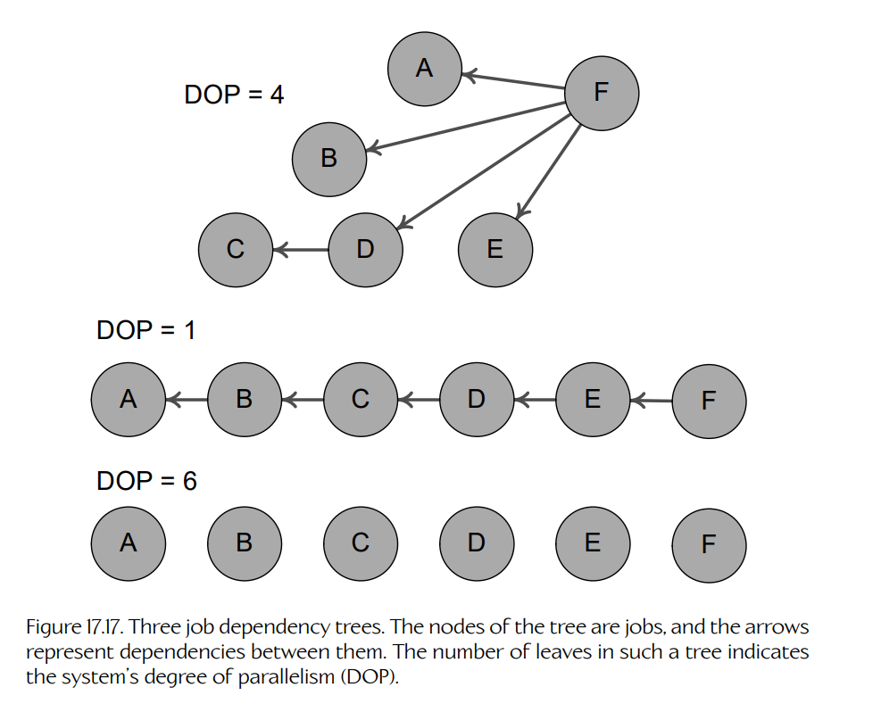
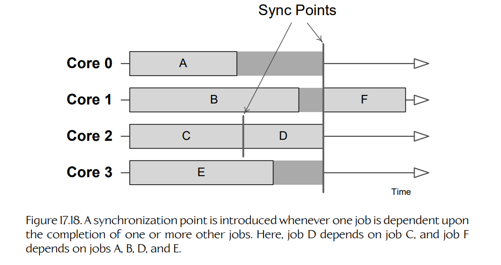
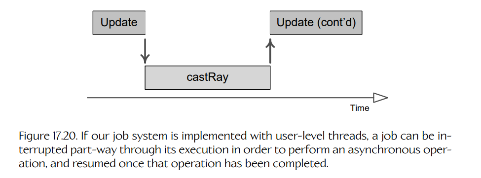

## 17.7 并发游戏对象更新

在第 4 章中，我们探讨了**硬件并行性**（hardware parallelism），以及如何利用最近游戏硬件中已经成为常态的显式并行计算硬件。这是通过**并发编程**（concurrent programming）技术实现的。在 Section 8.6 中，我们介绍了若干方法，使游戏引擎能够利用并行处理资源。在本节中，我们将考察并发与并行性如何应用于更新游戏对象状态这一问题。

### 17.7.1 并发引擎子系统

显然，引擎中性能最关键的部分——例如渲染、动画、音频和物理——最能从并行处理中受益。因此，无论我们的游戏对象模型是在单线程中更新，还是跨多个核心更新，它都需要能够与几乎肯定是多线程的底层引擎系统进行**接口交互**（interface）。

如果我们的引擎支持通用**作业系统**（job system，见 Section 8.6.4），就可以使用这个作业系统让引擎子系统并发执行。在这种场景中，每个子系统的帧更新可以在每帧作为一个作业启动。不过，对每个子系统来说，更好的做法可能是每帧启动多个作业来完成其工作。例如，动画系统可以为游戏世界中每个需要动画混合的对象启动一个作业。在这一帧的后续阶段，当动画系统执行世界矩阵和蒙皮矩阵计算时，它可能会采用 scatter/gather 方法，将这项工作划分到可用核心上。

当让底层引擎系统并发更新时，我们需要确保它们的接口是**线程安全的**（thread-safe）。我们希望确保外部代码不会进入**数据竞争**（data race）状态，无论这种竞争是与其他外部客户端发生，还是与子系统自身的内部工作发生。这通常涉及在每个子系统的所有外部调用上使用锁。

如果我们的作业系统使用**用户级线程**（user-level threads，如协程或纤程），那么就需要使用自旋锁使子系统线程安全。不过，如果子系统由 OS 线程更新，那么互斥量也是一种可行选择。

如果我们可以确定某个特定引擎子系统只会在游戏循环中的某个特定阶段运行，那么也许可以使用**无需锁断言**（lock-not-needed assertions），而不必真正锁住子系统的某些部分。更多相关信息见 Section 4.9.7.5。

当然，另一种选择是尝试使用**无锁数据结构**（lock-free data structures）来实现引擎子系统的关键共享数据。无锁数据结构实现起来很棘手，而且有些数据结构仍然没有已知的无锁实现。因此，如果选择无锁方法，明智做法大概是只把精力限制在性能要求最严格的引擎子系统上。

### 17.7.2 异步程序设计

当与并发引擎子系统交互时（例如从游戏对象更新内部进行交互），我们必须开始以**异步**方式思考。当需要执行耗时操作时，应避免调用**阻塞函数**（blocking function）——也就是直接在调用线程上下文中完成工作的函数，从而阻塞该线程或作业，直到工作完成。相反，只要可能，大型或昂贵作业都应通过调用**非阻塞函数**（non-blocking function）来请求执行——这种函数会将请求发送给另一个线程、核心或处理器执行，然后立即将控制权返回给调用函数。调用线程或作业可以继续处理其他无关工作，例如更新其他游戏对象，同时等待该请求的结果。在同一帧的后续阶段，或在下一帧中，我们可以取得该请求的结果并使用它。

例如，一个游戏可能请求向世界中投射一条射线，以判断玩家是否对某个敌方角色具有视线。在同步设计中，射线投射会在响应请求时立即完成；当射线投射函数返回时，结果就已经可用，如下所示：

    SomeGameObject::Update()
    {
        // ...

        // Cast a ray to see if the player has line of sight
        // to the enemy.
        RayCastResult r = castRay(playerPos, enemyPos);

        // Now process the results...
        if (r.hitSomething() && isEnemy(r.getHitObject()))
        {
            // Player can see the enemy.
            // ...
        }

        // ...
    }

在异步设计中，射线投射请求会通过调用一个函数来发出；该函数只负责设置并排队一个射线投射作业，然后立即返回。调用线程或作业可以在该作业由另一个 CPU 或核心处理时继续执行其他无关工作。稍后，一旦射线投射作业完成，调用线程或作业就可以取得射线投射查询的结果并处理它们：

    SomeGameObject::Update()
    {
        // ...

        // Cast a ray to see if the player has line of sight
        // to the enemy.
        RayCastResult r;
        requestRayCast(playerPos, enemyPos, &r);

        // Do other unrelated work while we wait for the
        // other CPU to perform the ray cast for us.

        // ...

        // OK, we can't do any more useful work. Wait for the
        // results of our ray cast job. If the job is
        // complete, this function will return immediately.
        // Otherwise, the main thread will idle until the
        // results are ready...
        waitForRayCastResults(&r);

        // Process results...
        if (r.hitSomething() && isEnemy(r.getHitObject()))
        {
            // Player can see the enemy.
            // ...
        }

        // ...
    }

在许多情况下，异步代码可以在某一帧发起请求，并在下一帧取得结果。在这种情况下，你可能会看到类似下面的代码：

    RayCastResult r;
    bool rayJobPending = false;

    SomeGameObject::Update()
    {
        // ...

        // Wait for the results of last frame's ray cast job.
        if (rayJobPending)
        {
            waitForRayCastResults(&r);

            // Process results...
            if (r.hitSomething() && isEnemy(r.getHitObject()))
            {
                // Player can see the enemy.
                // ...
            }
        }

        // Cast a new ray for next frame.
        rayJobPending = true;
        requestRayCast(playerPos, enemyPos, &r);

        // Do other work...
        // ...
    }

#### 17.7.2.1 何时发起异步请求

将同步、非批处理代码转换为异步、批处理方法时，一个特别棘手的方面是确定在游戏循环的**哪个时刻**：（a）发起请求；（b）等待并使用结果。做这件事时，通常有助于问自己以下问题：

- **我们最早可以在什么时候发起这个请求？** 请求发起得越早，它就越可能在我们真正需要结果时已经完成——这通过帮助确保主线程永远不会空闲等待异步请求完成，从而最大化 CPU 利用率。因此，对于任何给定请求，我们都应该确定在一帧中最早拥有足够信息来发起它的时刻，并在那里发起它。
- **在需要这个请求的结果之前，我们最多可以等待多久？** 也许可以等到更新循环的后续阶段再完成某个操作的后半部分。也许我们可以容忍一帧延迟，并使用上一帧的结果来更新本帧的对象状态。（某些子系统，例如 AI，甚至可以容忍更长的延迟时间，因为它们只每隔几秒更新一次。）在许多情况下，只要稍加思考、进行一些代码重构，并可能额外缓存一些中间数据，使用请求结果的代码实际上可以被推迟到一帧中的更晚阶段。

### 17.7.3 作业依赖与并行度

为了充分利用并行计算平台，我们希望所有核心始终保持忙碌。假设我们使用作业系统来并行化引擎，那么游戏循环的每次迭代都会由数百甚至数千个并发运行的作业组成。然而，这些作业之间的**依赖**（dependencies）可能导致可用核心的利用率不够理想。如果作业 B 的输入数据由作业 A 产生，那么作业 B 就不能在作业 A 完成之前开始。这就在作业 B 和作业 A 之间产生了依赖关系。

系统的**并行度**（degree of parallelism, DOP），也称为**并发度**（degree of concurrency, DOC），衡量在任意给定时刻理论上可以并行运行的最大作业数量。一组作业的并行度可以通过绘制**依赖图**（dependency graph）来确定。在这种图中，作业构成树的节点，父子关系表示依赖。树中叶节点的数量表示这组作业的并行度。Figure 17.17 展示了几个作业依赖树示例及其对应的并行度。

为了在显式并行计算机中充分利用 CPU 资源，我们希望系统的 DOP 匹配或超过可用核心数。如果软件的 DOP 恰好等于核心数量，就可以获得最大吞吐量。当系统的 DOP 高于核心数量时，吞吐量会降低，因为某些作业必须串行运行，但没有核心处于空闲状态。可是，当系统 DOP 低于核心数量时，某些核心就没有任何工作可做。

**Figure 17.17.** 三个作业依赖树。树中的节点是作业，箭头表示它们之间的依赖关系。树中叶节点的数量表示系统的并行度（DOP）。

每当某个作业被迫等待其依赖的其他作业完成时，系统中就会引入一个**同步点**（synchronization point，简称 sync point）。每个同步点都代表一次宝贵 CPU 资源可能被浪费的机会，因为一个作业会等待其依赖作业完成工作。Figure 17.18 展示了这一点。

**Figure 17.18.** 每当一个作业依赖一个或多个其他作业完成时，就会引入同步点。这里，作业 D 依赖作业 C，作业 F 依赖作业 A、B、D 和 E。

为了最大化硬件利用率，我们可以尝试通过减少作业之间的依赖来提高系统的 DOP。也可以尝试在空闲期间寻找其他无关工作来执行。我们还可以通过**推迟**（deferring）同步点来减少或消除同步点的影响。例如，假设作业 D 必须等到作业 A、B 和 C 都完成后才能开始工作。如果我们试图在 A、B 和 C 全部完成之前调度作业 D，那么它显然必须空闲等待一段时间。但如果我们推迟作业 D，使其在 A、B 和 C 完成很久之后才运行，那么就可以确信 D 永远不必等待。Figure 17.19 展示了这一思想。在题为 “Diving Down the Concurrency Rabbit Hole” [391] 的演讲中，Mike Acton 说：“并发优化设计的秘诀是延迟。”他谈的正是这一点：通过推迟同步点，减少或消除并发系统中的空闲时间。

**Figure 17.19.** 作业 D 依赖作业 A、B 和 C。上图：如果试图在 Core 2 上紧接作业 C 之后调度作业 D，该核心会空闲等待作业 B 完成。下图：如果将作业 D 的调用推迟到作业 A、B 和 C 都完成较久之后，就可以释放 Core 2 去运行其他作业，从而避免同步点造成的空闲时间。

### 17.7.4 并行化游戏对象模型本身

游戏对象模型出了名地难以并行化，原因有很多。游戏对象往往高度相互依赖，并且通常还依赖许多引擎子系统。对象间依赖之所以出现，是因为游戏对象在更新过程中经常彼此通信，并查询彼此状态。这些交互往往会在更新循环中发生多次，而通信模式可能不可预测，并且高度依赖人类玩家的输入以及游戏世界中正在发生的事件。这使得并发处理游戏对象更新（使用多个线程或多个 CPU 核心）变得困难。

尽管如此，并发更新游戏对象模型当然是可能的。例如，当我们把引擎从 PS3 移植到 PS4，用于 *The Last of Us: Remastered* 时，Naughty Dog 实现了一个并发游戏对象模型。在本节中，我们将探讨并发更新游戏对象时会遇到的一些问题，并看看 Naughty Dog 在其引擎中使用的一些解决方案。当然，这些技术只是解决该问题的一种可能方式——其他引擎可能使用不同方法。谁知道呢？也许你会发明一种新颖方式，解决并发游戏对象模型更新中的某些棘手问题！

#### 17.7.4.1 将游戏对象更新作为作业

如果游戏引擎拥有作业系统，它很可能会被用于并行化引擎中的各种底层子系统，例如动画、音频、碰撞/物理、渲染、文件 I/O 等。那么，为什么不也通过把游戏对象更新变成作业，来并行化游戏对象更新呢？这正是 Naughty Dog 引擎所采用的方法。它可以工作，但要正确且高效地运行起来，并非易事。

我们在 [Section 17.6.3.2](#17632-分桶更新) 中讨论过，由于游戏对象之间存在依赖，我们需要控制它们的更新顺序。实现这一点的一种方式，是将游戏中的所有对象划分到 `N` 个桶中，使桶 `B` 中的对象只依赖桶 `0` 到 `B − 1` 中的对象。如果采用这种方法，就可以通过将每个桶中的所有游戏对象启动为作业来更新它们，并让作业系统将这些作业调度到可用核心上（同时与当时正在运行的其他作业交错执行）。这大致就是 Naughty Dog 引擎采用的技术。

    void UpdateBucket(int iBucket)
    {
        job::Declaration aDecl[kMaxObjectsPerBucket];
        const int count = GetNumObjectsInBucket(iBucket);
        for (int jObject = 0; jObject < count; ++jObject)
        {
            job::Declaration& decl = aDecl[jObject];
            decl.m_pEntryPoint = UpdateGameObjectJob;
            decl.m_param = reinterpret_cast<uintptr_t>(
                GetGameObjectInBucket(iBucket, jObject));
        }

        job::KickJobsAndWait(aDecl, count);
    }

处理对象间依赖的另一种方法，是显式声明这些依赖。在这种情况下，我们大概会有某种方式声明游戏对象 A 依赖游戏对象 B、C 和 D 等。这些依赖会形成一个简单的**有向图**（directed graph）。为了更新游戏对象，我们首先会启动所有不依赖任何其他游戏对象的对象的更新作业（也就是依赖图中没有出边的节点）。随着每个作业完成，我们会遍历每个依赖该对象的游戏对象，并等待其所有被依赖对象的更新作业都完成。这个过程会反复进行，直到整个游戏对象依赖图都被更新。

如果游戏对象依赖图中包含任何**环**（cycles），就可能出现问题。涉及两个或多个游戏对象的依赖环表示这些对象无法简单地按照依赖顺序更新。为了处理环，我们要么需要通过改变对象交互方式消除它们（将图变为**有向无环图**，即 DAG），要么需要隔离这些循环依赖游戏对象组成的“团块”，并在单个核心上串行更新每个团块。

#### 17.7.4.2 异步游戏对象更新

我们在 [Section 17.7.1](#1771-并发引擎子系统) 中说过，游戏对象更新通常以异步方式完成。例如，我们不再调用一个阻塞函数来投射射线，而是发起一个异步射线投射请求，碰撞子系统会在这一帧未来的某个时刻处理该请求。在这一帧的后续阶段，或下一帧中，我们会取得射线投射结果并对其采取行动。

当游戏对象本身也在并发更新（跨多个核心）时，这种方法仍然可以很好地工作。不过，如果我们的作业系统基于**用户级线程**（user-level threads，如协程或纤程），那么阻塞调用也会成为一种可行选择。这之所以可行，是因为协程具有一个独特属性：它能够**让出**（yield）执行权给另一个协程，然后在稍后的某个时间点，从上次离开的地方继续执行（当另一个协程又让出执行权回到它时）。在基于纤程的作业系统中（例如 Naughty Dog 引擎使用的系统），作业本身并不是严格意义上的协程，但它们具有同样的属性：一个基于纤程的作业能够在执行中途“睡眠”，随后再被“唤醒”，从暂停处继续执行。

下面是一个在基于协程或纤程的作业系统中使用阻塞调用实现的射线投射示例：

    SomeGameObject::Update()
    {
        // ...

        // Cast a ray to see if the player has line of sight
        // to the enemy.
        RayCastResult r = castRayAndWait(playerPos, enemyPos);

        // zzz...

        // Wake up when ray cast result is ready!

        // Now process the results...
        if (r.hitSomething() && isEnemy(r.getHitObject()))
        {
            // Player can see the enemy.
            // ...
        }

        // ...
    }

请注意，这种实现看起来几乎与我们在 [Section 17.7.2](#1772-异步程序设计) 中展示的“不要这样做”的例子完全相同！得益于用户级线程，我们的作业毕竟可以使用阻塞函数调用。Figure 17.20 展示了正在发生的事情：这个作业实际上被切成了两部分——阻塞射线投射调用之前运行的部分，以及之后运行的部分。

**Figure 17.20.** 如果作业系统使用用户级线程实现，作业可以在执行中途被中断，以执行异步操作，并在该操作完成后恢复执行。

这一机制使我们能够实现诸如 `WaitForCounter()`、`KickJobsAndWait()` 这样的作业系统函数。这些函数会**阻塞**它们所在的作业，使其进入睡眠状态，并允许其他作业在它们等待相关计数器归零期间执行。

#### 17.7.4.3 游戏对象更新期间的锁

分桶更新在很大程度上解决了对象间依赖导致的问题。它们确保游戏对象按正确的全局顺序更新（例如，火车车厢先于车厢上的对象更新）。它们也有助于处理对象间状态查询。桶 `B` 中的对象可以安全查询桶 `B − Δ` 中的对象状态，也可以查询桶 `B + Δ` 中的对象状态（其中 `Δ > 0`），因为在这两种情况下，我们都知道这些对象不会与桶 `B` 中的对象并发更新。不过，仍然存在一帧延迟问题：如果在第 `N` 帧中，桶 `B` 中的对象查询桶 `B − Δ` 中的对象，它会看到该对象在第 `N` 帧的状态；然而，如果它查询桶 `B + Δ` 中的对象，它会看到该对象上一帧（第 `N − 1` 帧）的状态，因为该对象尚未更新。

因此，在分桶更新系统中，我们可以安全访问**其他桶**中的游戏对象，而无需任何形式的锁。然而，如果同一个桶中的游戏对象需要交互或彼此查询，该怎么办？这里我们又一次容易遇到并发竞争条件，因此不能什么都不做，只是寄希望于好运。

我们可能会想在游戏对象系统中引入一个单一的全局锁（互斥量或自旋锁）。某个特定桶中的每个游戏对象都可以获取这个锁，执行自己的更新（过程中可能与其他游戏对象交互），然后在完成后释放锁。这当然能保证对象间通信不会发生数据竞争。然而，它也会产生一个非常不理想的效果：将该桶内所有游戏对象的更新**串行化**（serializing），把我们的“并发”游戏对象更新实际上退化成单线程更新！这是因为这个锁会阻止任何两个游戏对象并发更新，即使这两个对象之间没有任何交互。

还有许多其他方法可以处理这个问题。我们早期在 Naughty Dog 尝试过一种方法：引入一个全局锁系统，但只在游戏对象的句柄于游戏对象更新函数内部被**解引用**（dereferenced）时获取锁。为了支持内存碎片整理，我们引擎中的游戏对象通过句柄引用，而不是通过原始指针引用。因此，要获得指向游戏对象的原始指针，必须先解引用其句柄。这是一个检测某个游戏对象打算与另一个游戏对象交互的绝佳机会。通过只在交互确实可能发生时获取锁，我们能够恢复一定程度的并发性。然而，这个锁系统复杂、难以使用，并且仍然会导致桶更新期间 CPU 核心使用效率低下。

#### 17.7.4.4 对象快照

分析真实游戏引擎中游戏对象之间的相互依赖后，我们可以作出一个观察：游戏对象更新期间，绝大多数游戏对象之间的交互都是**状态查询**。换句话说，游戏对象 A 会访问并查询游戏对象 B、C 等的当前状态。当游戏对象 A 这样做时，它实际上只需要访问这些其他游戏对象状态的**只读副本**。它不需要与对象本身交互（这些对象在这种交互发生时，可能正在并发更新，也可能没有）。

基于这一情况，为每个游戏对象提供其相关状态信息的**快照**（snapshot）是合理的——也就是一个只读副本，系统中的任何其他游戏对象都可以查询它，而无需锁，也不必担心数据竞争。快照实际上只是我们在 [Section 17.6.3.4](#17634-对象状态缓存) 中描述的**状态缓存**技术的一个例子。在 Naughty Dog，我们将这种方法用于 *The Last of Us: Remastered*、*Uncharted 4: A Thief’s End*、*Uncharted: The Lost Legacy* 和 *The Last of Us Part II*。

下面是 Naughty Dog 引擎中快照的工作方式：在每次桶更新开始时，我们要求每个游戏对象更新自己的快照。这些更新绝不会查询其他游戏对象的状态，因此它们可以无锁并发运行。所有快照更新完成后，我们会启动并发作业来更新游戏对象的内部状态。这些作业同样并发运行。当桶 `B` 中的某个游戏对象需要查询另一个对象的状态时，它现在有三个选项：

1. 查询桶 `B − Δ` 中的对象时，它可以直接查询该对象，也可以查询该对象的快照。
2. 查询桶 `B` 中的对象时，它查询快照。
3. 查询桶 `B + Δ` 中的对象时，它同样可以查询对象本身，或查询其快照。

#### 17.7.4.5 处理对象间变更

当游戏对象**读取**彼此的游戏状态时，快照让我们能够避免锁。然而，当一个游戏对象需要**修改**同一桶中另一个对象的状态时，快照并不能解决可能发生的数据竞争。为了处理这些情况，Naughty Dog 采用了以下经验规则和技术的组合：

- 尽可能减少对象间变更。
- 桶与桶之间的对象间变更是安全的，但
- 同一桶内部的对象间变更必须小心处理……
  - 使用锁；
  - 或者通过将变更请求放入一个请求队列来请求变更，而不是立即应用这些变更。请求队列本身由锁保护，队列中请求的处理会被推迟到桶更新完成之后。

处理单个桶内对象间变更的另一个选择，是在**下一个桶**中生成一个作业，其任务是同步这些变更操作。通过把动作推迟到后续桶中，我们可以确定相关对象已经完成更新，并且不会与我们的工作并发更新。Naughty Dog 使用这种方法处理涉及玩家和 NPC 的同步近战动作。

#### 17.7.4.6 未来改进

本节描述的分桶更新系统绝不是完美的。分桶更新并没有达到它可能达到的最高效率，因为桶与桶之间的每次转换都会在游戏循环中引入一个**同步点**（sync point）。在这些同步点上，某些 CPU 核心可能会处于空闲状态，等待该桶中的所有游戏对象完成更新。

快照也不是解决桶内依赖问题的完美方案，因为它只处理只读查询；对象间变更仍然需要锁。快照本身的更新也可能代价高昂（不过这里有一个容易应用的优化：只为需要的对象按需生成快照）。

还有许多其他方法可以处理这些问题。发现如何并发更新游戏对象的最佳方式，就是进行实验。希望本节已经提出了一些有用思想，能在你亲自实验时为你铺平道路！