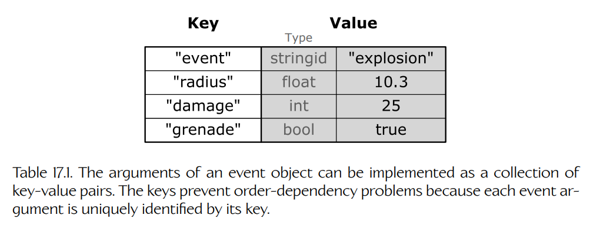
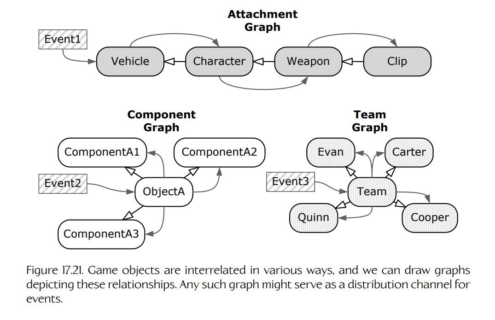
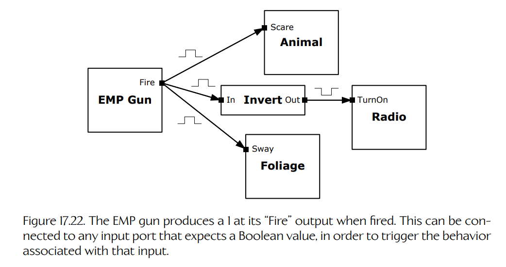
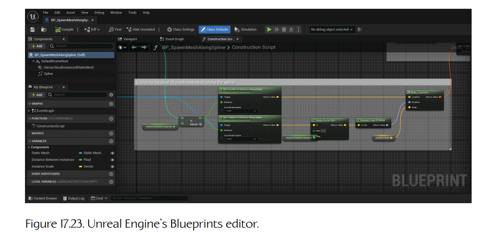

## 17.8 事件与消息传递

游戏本质上是**事件驱动的**（event-driven）。**事件**（event）是游戏过程中发生的任何值得关注的事情。爆炸发生、玩家被敌人发现、医疗包被拾取——这些都是事件。游戏通常需要一种方式来：（a）当事件发生时通知感兴趣的游戏对象；（b）安排这些对象以各种方式对感兴趣的事件作出响应——我们称之为**处理**（handling）事件。不同类型的游戏对象会以不同方式响应同一事件。某一类游戏对象响应事件的方式，是其行为的关键方面，就像对象状态会随时间变化、外部输入也会影响行为一样。例如，*Pong* 中球的行为部分由其速度决定，部分由它撞到墙或挡板并反弹这一事件的反应决定，也部分由球被某一方玩家漏接时发生的事情决定。

### 17.8.1 静态类型函数绑定的问题

通知游戏对象某个事件已经发生的一种简单方式，就是直接调用该对象上的一个方法（成员函数）。例如，当爆炸发生时，我们可以查询游戏世界中所有位于爆炸伤害半径内的对象，然后在每个对象上调用一个名为 `OnExplosion()` 之类的虚函数。下面的伪代码展示了这一点：

    void Explosion::Update()
    {
        // ...

        if (ExplosionJustWentOff())
        {
            GameObjectCollection damagedObjects;
            g_world.QueryObjectsInSphere(GetDamageSphere(),
                                          damagedObjects);

            for (each object in damagedObjects)
            {
                object.OnExplosion(*this);
            }
        }

        // ...
    }

对 `OnExplosion()` 的调用，是**静态类型的后期函数绑定**（statically typed late function binding）的一个例子。**函数绑定**（function binding）是指确定在某个调用位置应该调用哪一个函数实现的过程——实际上，就是把某个实现绑定到该调用上。虚函数，例如这里的 `OnExplosion()` 事件处理函数，被称为**后期绑定**（late-bound）。这意味着编译器在编译时实际上并不知道这个函数的众多可能实现中，哪一个会被调用；只有在运行时，当目标对象的类型已知后，才会调用适当的实现。我们说虚函数调用是**静态类型的**（statically typed），因为编译器确实知道在给定某个特定对象类型时应该调用哪一个实现。例如，当目标对象是 `Tank` 时，它知道应该调用 `Tank::OnExplosion()`；当对象是 `Crate` 时，它知道应该调用 `Crate::OnExplosion()`。

静态类型函数绑定的问题在于，它会给实现引入一定程度的不灵活性。首先，虚拟的 `OnExplosion()` 函数要求所有游戏对象都继承自一个共同基类。此外，它要求该基类声明虚函数 `OnExplosion()`，即使并非所有游戏对象都能响应爆炸。事实上，如果使用静态类型虚函数作为事件处理器，我们的基类 `GameObject` 就必须为游戏中**所有可能的事件**声明虚函数！这会使向系统中添加新事件变得困难。它也排除了以数据驱动方式创建事件的可能性——例如在世界编辑工具中创建事件。此外，它也没有提供一种机制，让某些类型的对象或某些单独对象实例注册对某些事件的兴趣，而不是对其他事件感兴趣。游戏中的每个对象实际上都会“知道”每个可能事件，即使它对该事件的响应是什么都不做（即实现一个空的、什么都不做的事件处理函数）。

因此，我们真正需要的是**动态类型的后期函数绑定**（dynamically typed late function binding）。某些编程语言原生支持这一特性（例如 C# 的委托）。在其他语言中，工程师必须手动实现它。解决这一问题有许多方式，但大多数方式最终都归结为采用一种数据驱动方法。换句话说，我们把函数调用这一概念封装进一个对象，并在运行时传递该对象，从而实现动态类型的后期绑定函数调用。

### 17.8.2 将事件封装在对象中

事件实际上由两个组成部分构成：它的**类型**（type，例如爆炸、友军受伤、玩家被发现、医疗包被拾取等）以及它的**参数**（arguments）。参数提供有关事件的具体信息。（这次爆炸造成了多少伤害？哪位友军受伤了？玩家在哪里被发现？医疗包里有多少生命值？）我们可以把这两个组成部分封装在一个对象中，如下面这个相当简化的代码片段所示：

    struct Event
    {
        const U32 MAX_ARGS = 8;

        EventType   m_type;
        U32         m_numArgs;
        EventArg    m_aArgs[MAX_ARGS];
    };

一些游戏引擎把这些东西称为**消息**（messages）或**命令**（commands），而不是事件。这些名称强调了这样一种思想：通知对象某个事件，本质上等同于向这些对象发送消息或命令。

从实践上讲，事件对象通常并没有这么简单。例如，我们可以通过从一个根事件类派生不同类型的事件来实现事件类型。参数可以实现为链表，或者实现为能够容纳任意数量参数的动态分配数组；而且参数也可能具有各种数据类型。

将事件（或消息）封装在对象中有许多好处：

- **单一事件处理函数。** 由于事件对象在内部编码了自身类型，因此任意数量的不同事件类型都可以由单个类（或继承层次中的根类）的实例来表示。这意味着我们只需要一个虚函数来处理所有类型的事件（例如 `virtual void OnEvent(Event& event);`）。
- **持久性。** 与函数调用不同，函数调用的参数会在函数返回后离开作用域，而事件对象会把自身类型和参数都存储为数据。因此，事件对象具有持久性。它可以存储在队列中，以便稍后处理；也可以被复制并广播给多个接收者，等等。
- **盲目事件转发。** 一个对象可以把它收到的事件转发给另一个对象，而不需要“知道”关于该事件的任何信息。例如，如果一辆载具收到 `Dismount` 事件，它可以把该事件转发给所有乘客，从而让他们下车，即使载具本身完全不知道“下车”这件事。

把事件/消息/命令封装在对象中的思想，在计算机科学的许多领域都很常见。它不仅出现在游戏引擎中，也出现在图形用户界面、分布式通信系统以及许多其他系统中。著名的“四人帮”（Gang of Four）设计模式书 [20] 将其称为**命令设计模式**（Command design pattern）。

### 17.8.3 事件类型

区分不同事件类型有许多方法。在 C 或 C++ 中，一种简单方法是定义一个全局枚举，将每种事件类型映射到一个唯一整数。

    enum EventType
    {
        EVENT_TYPE_LEVEL_STARTED,
        EVENT_TYPE_PLAYER_SPAWNED,
        EVENT_TYPE_ENEMY_SPOTTED,
        EVENT_TYPE_EXPLOSION,
        EVENT_TYPE_BULLET_HIT,
        // ...
    }

这种方法具有简单和高效的优点（因为整数通常读、写和比较都非常快）。不过，它也存在两个问题。首先，整个游戏中所有事件类型的知识都被集中在一个地方，这可以被看作一种破坏封装的形式（好坏见仁见智）。其次，事件类型是硬编码的，这意味着新事件类型不能轻易以数据驱动方式定义。第三，枚举值只是索引，因此它们依赖顺序。如果有人不小心在列表中间添加了一个新事件类型，所有后续事件 id 的索引都会发生变化；如果事件 id 被存储在数据文件中，这可能会造成问题。因此，基于枚举的事件类型系统适合小型 demo 和原型，但并不能很好扩展到真正的游戏中。

另一种编码事件类型的方法是使用字符串。这种方法完全自由形式，只要想出一个名字，就可以向系统中添加一种新事件类型。但它也有许多问题，包括事件名称冲突的强烈可能性、由于简单拼写错误导致事件无法工作的可能性、字符串本身增加的内存需求，以及与整数比较相比字符串比较的相对高成本。可以使用哈希字符串 id 来代替原始字符串，以消除性能问题并降低内存需求，但它们无法解决事件名称冲突或拼写错误的问题。尽管如此，基于字符串或字符串 id 的事件系统所具有的极高灵活性和数据驱动特性，被许多游戏团队认为值得承担这些风险，其中包括 Naughty Dog。

可以实现一些工具来帮助避免使用字符串标识事件时涉及的部分风险。例如，可以维护一个包含所有事件类型名称的中央数据库。可以提供一个用户界面，允许新事件类型被添加到数据库中。添加新事件时，可以自动检测命名冲突，并禁止用户添加重复事件类型。选择已有事件时，工具可以在下拉组合框中提供一个已排序列表，而不是要求用户记住名称并手动输入。事件数据库还可以存储每种事件类型的元数据，包括其用途和正确用法的文档，以及它支持的参数数量和类型信息。这种方法可以很好地工作，但不应忘记，建立和维护这样一个系统的成本并不低。

### 17.8.4 事件参数

事件的参数通常像函数的参数列表一样，为接收者提供关于该事件的有用信息。事件参数可以通过各种方式实现。

我们可以为每一种唯一事件类型派生一个新的 `Event` 类。然后可以将参数硬编码为该类的数据成员。例如：

    class ExplosionEvent : public Event
    {
        Point   m_center;
        float   m_damage;
        float   m_radius;
    };

另一种方法是把事件的参数存储为一组**变体**（variants）。变体是能够保存多于一种类型数据的数据对象。它通常会存储关于当前所保存数据类型的信息，以及数据本身。在事件系统中，我们可能希望参数是整数、浮点数、布尔值或哈希字符串 id。因此，在 C 或 C++ 中，可以定义一个看起来像下面这样的变体类：

    struct Variant
    {
        enum Type
        {
            TYPE_INTEGER,
            TYPE_FLOAT,
            TYPE_BOOL,
            TYPE_STRING_ID,
            TYPE_COUNT // number of unique types
        };

        Type        m_type;

        union
        {
            I32     m_asInteger;
            F32     m_asFloat;
            bool    m_asBool;
            U32     m_asStringId;
        };
    };

`Event` 中的变体集合可以实现为一个具有较小固定最大尺寸的数组（例如 4、8 或 16 个元素）。这会对随事件传递的参数数量施加一个任意限制，但它也绕开了为每个事件参数载荷动态分配内存的问题，这可能是一个很大的好处，尤其是在内存受限的主机游戏中。

变体集合也可以实现为动态大小的数据结构，例如动态大小数组（如 `std::vector`）或链表（如 `std::list`）。与固定大小设计相比，这提供了更大的额外灵活性，但也会带来动态内存分配的成本。假设每个 `Variant` 大小相同，可以在这里很好地使用池分配器。

#### 17.8.4.1 将事件参数作为键值对

使用**带索引的**事件参数集合的一个根本问题是顺序依赖。事件发送者和接收者都必须“知道”参数以特定顺序排列。这可能导致困惑和 bug。例如，某个必需参数可能被意外遗漏，或者额外添加了一个参数。

可以通过将事件参数实现为键值对来避免这个问题。每个参数都由其键唯一标识，因此参数可以以任意顺序出现，并且可选参数也可以完全省略。参数集合可以实现为闭合或开放哈希表，键被用来哈希进表；也可以实现为数组、链表或二叉搜索树形式的键值对。Table 17.1 展示了这些思想。可能性很多；只要游戏的特定需求能够被有效且高效地满足，具体实现选择在很大程度上并不重要。

**Table 17.1.** 事件对象的参数可以实现为键值对集合。键可以避免顺序依赖问题，因为每个事件参数都由其键唯一标识。

### 17.8.5 事件处理器

当游戏对象收到事件、消息或命令时，它需要以某种方式响应该事件。这称为**处理**（handling）该事件，通常由一个函数或脚本代码片段实现，这个函数或脚本代码片段称为**事件处理器**（event handler）。（稍后我们会学习更多关于游戏脚本的内容。）

事件处理器通常是一个原生虚函数或脚本函数，能够处理所有类型的事件（例如 `virtual void OnEvent(Event& event)`）。在这种情况下，函数通常包含某种 switch 语句或层叠的 if/else-if 子句，用于处理可能收到的各种事件类型。一个典型事件处理函数可能看起来像这样：

    virtual void SomeObject::OnEvent(Event& event)
    {
        switch (event.GetType())
        {
        case SID("EVENT_ATTACK"):
            RespondToAttack(event.GetAttackInfo());
            break;

        case SID("EVENT_HEALTH_PACK"):
            AddHealth(event.GetHealthPack().GetHealth());
            break;

        // ...

        default:
            // Unrecognized event.
            break;
        }
    }

另一种做法是实现一组处理函数，每种事件类型一个（例如 `OnThis()`、`OnThat()` 等）。不过，如上文所讨论的，事件处理函数的大量增生可能会带来问题。

一个名为 Microsoft Foundation Classes（MFC）的 Windows GUI 工具包以其**消息映射**（message maps）而闻名——这是一种允许任何 Windows 消息在运行时绑定到任意非虚函数或虚函数的系统。这避免了在单个根类中为所有可能的 Windows 消息声明处理器的需求，同时也避免了非 MFC Windows 消息处理函数中常见的大型 switch 语句。不过，这样的系统大概并不值得折腾——switch 语句工作得很好，而且简单清晰。

### 17.8.6 解包事件参数

上面的例子略过了一个重要细节，即如何以类型安全的方式从事件参数列表中提取数据。例如，`event.GetHealthPack()` 大概会返回一个 `HealthPack` 游戏对象，而我们进一步假设它提供一个名为 `GetHealth()` 的成员函数。这意味着根 `Event` 类“知道”医疗包（以及扩展开来，游戏中所有其他类型的事件参数）。这可能是不切实际的设计。在真实引擎中，可能会派生出一些 `Event` 类，提供便捷的数据访问 API，例如 `GetHealthPack()`。或者，事件处理器可能必须手动解包数据，并将它们转换为适当类型。后一种方法会引发类型安全方面的担忧，不过从实践上说，这通常不是大问题，因为解包参数时事件类型总是已知的。

### 17.8.7 责任链

游戏对象几乎总是以各种方式彼此依赖。例如，游戏对象通常位于一个变换层级中，这允许一个对象依附在另一个对象上，或被角色拿在手中。游戏对象也可能由多个交互组件构成，从而形成星形拓扑，或者形成一个松散连接的组件对象“云”。体育游戏可能会维护每支队伍中所有角色的列表。一般来说，我们可以把游戏对象之间的相互关系想象成一个或多个**关系图**（relationship graphs，记住列表和树只是图的特殊情况）。Figure 17.21 展示了几个关系图示例。

在这些关系图中，把事件从一个对象传递到下一个对象通常很有意义。例如，当载具收到一个事件时，把该事件传递给乘坐该载具的所有乘客可能很方便；而这些乘客也可能希望把该事件转发给其物品栏中的对象。当一个多组件游戏对象收到事件时，可能需要把该事件传递给所有组件，让它们都有机会处理它。或者，当一个体育游戏中的角色收到事件时，我们可能也希望把事件传递给他的所有队友。

**Figure 17.21.** 游戏对象以各种方式相互关联，我们可以绘制图来表示这些关系。任何这样的图都可以作为事件的分发通道。

在对象图中转发事件的技术，是面向对象、事件驱动编程中的一种常见设计模式，有时被称为**责任链**（Chain of Responsibility）[20]。通常，事件在系统中传递的顺序由工程师预先确定。事件会被传递给链中的第一个对象，事件处理器返回一个布尔值或枚举码，表示它是否识别并处理了该事件。如果事件被某个接收者消费，事件转发过程就会停止；否则，事件会继续转发给链中的下一个接收者。支持责任链式事件转发的事件处理器可能看起来像这样：

    virtual bool SomeObject::OnEvent(Event& event)
    {
        // Call the base class' handler first.
        if (BaseClass::OnEvent(event))
        {
            return true;
        }

        // Now try to handle the event myself.
        switch (event.GetType())
        {
        case SID("EVENT_ATTACK"):
            RespondToAttack(event.GetAttackInfo());
            return false; // OK to forward this event to others.

        case SID("EVENT_HEALTH_PACK"):
            AddHealth(event.GetHealthPack().GetHealth());
            return true; // I consumed the event; don't forward.

        // ...

        default:
            return false; // I didn't recognize this event.
        }
    }

当派生类重写事件处理器时，如果该类是在增强而不是替换基类的响应，那么也调用基类实现可能是合适的。在其他情况下，派生类可能完全替换基类的响应，此时就不应调用基类处理器。这是另一种责任链。

事件转发还有其他应用。例如，我们可能希望把某个事件多播给影响半径内的所有对象（例如爆炸）。为了实现这一点，可以利用游戏世界的对象查询机制，找到相关球体内的所有对象，然后把事件转发给返回的所有对象。

### 17.8.8 注册对事件的兴趣

可以比较有把握地说，游戏中大多数对象不需要响应每一种可能的事件。大多数类型的游戏对象只对相对较小的一组事件“感兴趣”。当多播或广播事件时，这可能导致低效，因为我们需要遍历一组对象并调用每个对象的事件处理器，即使该对象对这种特定事件并不感兴趣。

克服这种低效的一种方式，是允许游戏对象**注册对特定类型事件的兴趣**（register interest）。例如，可以为每种不同事件类型维护一个感兴趣游戏对象的链表；或者每个游戏对象可以维护一个位数组，其中每个位的设置表示该对象是否对某种特定事件类型感兴趣。这样，我们就可以避免调用那些并不关心该事件的对象的事件处理器。

更进一步，我们也许可以限制原始游戏对象查询，使其只包含那些对我们希望多播的事件感兴趣的对象。例如，当爆炸发生时，我们可以向碰撞系统请求所有位于伤害半径内**并且**能够响应 `Explosion` 事件的对象。这可以整体节省时间，因为我们避免遍历那些已知对当前多播事件不感兴趣的对象。这样的做法是否会产生净收益，取决于查询机制的实现方式，以及在查询期间过滤对象和在多播迭代期间过滤对象之间的相对成本。

### 17.8.9 是否排队

大多数游戏引擎提供一种机制，用于在事件被发送时立即处理它们。除此之外，一些引擎还允许事件进入队列，以便在未来任意时间处理。事件排队具有一些吸引人的好处，但它也显著增加了事件系统的复杂性，并且带来一些独特问题。我们将在下面几节中考察事件排队的优缺点，并在此过程中了解这类系统是如何实现的。

#### 17.8.9.1 事件排队的一些好处

以下几节概述事件排队的一些好处。

**控制事件何时被处理。**

我们已经看到，必须小心地以特定顺序更新引擎子系统和游戏对象，以确保正确行为并最大化运行时性能。同样，某些类型的事件可能对它们在游戏循环中究竟何时被处理高度敏感。如果所有事件都在发送时立即处理，那么事件处理函数最终可能会在整个游戏循环过程中以不可预测且难以控制的方式被调用。通过经由事件队列推迟事件，工程师可以采取措施，确保事件只在安全且合适的时候被处理。

**将事件投递到未来的能力。**

当事件被发送时，发送者通常可以指定一个递送时间——例如，我们可能希望事件在同一帧稍后、下一帧，或发送后的若干秒后被处理。这一功能相当于把事件投递到未来，并且有各种有趣用途。我们可以通过把一个事件投递到未来来实现一个简单闹钟。周期性任务，例如每两秒闪烁一次灯，可以通过投递一个事件来执行；该事件的处理器执行周期性任务，然后把同类型的新事件再次投递到未来的一个时间段之后。

为了实现将事件投递到未来的能力，每个事件在进入队列之前都会标记一个期望递送时间。只有当当前游戏时钟达到或超过事件的递送时间时，事件才会被处理。使这种机制正常工作的一个简单方法，是按照递送时间递增顺序对队列中的事件排序。每帧可以检查队列中的第一个事件及其递送时间。如果递送时间在未来，我们会立即中止，因为我们知道后续所有事件也都在未来。但如果看到某个事件的递送时间是现在或过去，就从队列中取出该事件并处理它。这个过程会一直继续，直到遇到一个递送时间在未来的事件。下面的伪代码展示了这一过程：

    // This function is called at least once per frame. Its
    // job is to dispatch all events whose delivery time is
    // now or in the past.

    void EventQueue::DispatchEvents(F32 currentTime)
    {
        // Look at, but don't remove, the next event on the
        // queue.
        Event* pEvent = PeekNextEvent();

        while (pEvent
            && pEvent->GetDeliveryTime() <= currentTime)
        {
            // Remove the event from the queue.
            RemoveNextEvent();

            // Dispatch it to its receiver's event handler.
            pEvent->Dispatch();

            // Peek at the next event on the queue (again
            // without removing it).
            pEvent = PeekNextEvent();
        }
    }

**事件优先级。**

即使事件队列中的事件已经按递送时间排序，当两个或多个事件具有完全相同的递送时间时，递送顺序仍然存在歧义。这种情况可能比你想象得更常见，因为事件递送时间通常会被量化为整数帧数。例如，如果两个发送者请求事件在“本帧”“下一帧”或“从现在起七帧后”分发，那么这些事件会具有相同的递送时间。

解决这些歧义的一种方式，是给事件分配**优先级**（priorities）。当两个事件具有相同时间戳时，优先级更高的事件应始终先被服务。实现这一点很容易：先按递送时间递增顺序对事件队列排序，然后对具有相同递送时间的每组事件按优先级递减顺序排序。

我们可以通过把优先级编码为原始无符号 32 位整数，允许多达四十亿个唯一优先级等级；也可以限制自己只使用两三个唯一优先级等级（例如低、中、高）。在每个游戏引擎中，都存在某个最小优先级等级数量，足以解决系统中的所有真实歧义。通常最好尽可能接近这个最小值。若优先级等级数量非常大，在任何给定情境中弄清楚哪个事件应最先处理，都可能变成一个小噩梦。不过，每个游戏的事件系统需求不同，具体情况可能有所不同。

#### 17.8.9.2 事件排队的一些问题

**增加事件系统复杂性。**

为了实现排队事件系统，我们需要比实现立即事件系统更多的代码、额外的数据结构以及更复杂的算法。复杂性增加通常意味着更长的开发时间，以及在游戏开发过程中维护和演化该系统的更高成本。

**深拷贝事件及其参数。**

在立即事件处理方法中，事件参数中的数据只需要在事件处理函数执行期间（以及它可能调用的任何函数执行期间）保持存在。这意味着事件及其参数数据可以实际位于内存中的任何地方，包括调用栈上。例如，我们可以编写一个类似下面这样的函数：

    void SendExplosionEventToObject(GameObject& receiver)
    {
        // Allocate event args on the call stack.
        Point centerPoint(-2.0f, 31.5f, 10.0f);
        F32   damage = 5.0f;
        F32   radius = 2.0f;

        // Allocate the event on the call stack.
        Event event("Explosion");
        event.SetArgFloat("Damage", damage);
        event.SetArgPoint("Center", &centerPoint);
        event.SetArgFloat("Radius", radius);

        // Send the event, which causes the receiver's event
        // handler to be called immediately, as shown below.
        event.Send(receiver);
        //{
        //     receiver.OnEvent(event);
        //}
    }

当事件被排队时，其参数必须在发送函数的作用域之外继续存在。这意味着在把事件存储到队列之前，必须复制整个事件对象。我们必须执行一次**深拷贝**（deep-copy），也就是说，不仅要复制事件对象本身，还要复制它的整个参数载荷，包括它可能指向的任何数据。对事件进行深拷贝可以确保不存在指向发送函数栈上数据的悬空引用，并允许事件被无限期存储。上面展示的事件发送函数在使用排队事件系统时基本仍然长得一样，但正如下面斜体代码所示，`Event::Queue()` 函数的实现比它的 `Send()` 对应函数稍微复杂一些：

    void SendExplosionEventToObject(GameObject& receiver)
    {
        // We can still allocate event args on the call
        // stack.
        Point centerPoint(-2.0f, 31.5f, 10.0f);
        F32   damage = 5.0f;
        F32   radius = 2.0f;

        // Still OK to allocate the event on the call stack
        Event event("Explosion");
        event.SetArgFloat("Damage", damage);
        event.SetArgPoint("Center", &centerPoint);
        event.SetArgFloat("Radius", radius);

        // This stores the event in the receiver's queue for
        // handling at a future time. Note how the event
        // must be deep-copied prior to being enqueued, since
        // the original event resides on the call stack and
        // will go out of scope when this function returns.
        event.Queue(receiver);
        //{
        //     Event* pEventCopy = DeepCopy(event);
        //     receiver.EnqueueEvent(pEventCopy);
        //}
    }

**排队事件的动态内存分配。**

对事件对象执行深拷贝意味着需要进行动态内存分配；正如我们已经多次看到的那样，游戏引擎中的动态分配并不理想，因为它具有潜在成本，并且容易造成内存碎片。尽管如此，如果想要对事件进行排队，就需要为它们动态分配内存。

和游戏引擎中的所有动态分配一样，最好选择快速且无碎片的分配器。我们也许可以使用**池分配器**（pool allocator），但只有当所有事件对象大小相同，并且它们的参数列表由大小也都相同的数据元素组成时，这才可行。上述情况很可能成立——例如，参数可能都是前文描述的 `Variant`。如果事件对象及其参数大小各不相同，可以使用**小内存分配器**（small memory allocator）。（回想一下，小内存分配器会维护多个池，每个池对应若干预定义小分配尺寸之一。）在设计排队事件系统时，始终要小心考虑动态分配需求。

当然，也存在其他设计。例如，在 Naughty Dog，我们把排队事件分配为可重定位内存块。更多关于可重定位内存的信息见 Section 6.2.2.2。

**调试困难。**

对于排队事件，事件处理器并不是由事件发送者直接调用的。因此，与立即事件处理不同，调用栈无法告诉我们事件来自哪里。我们不能沿着调试器中的调用栈向上走，以查看发送事件时发送者的状态或发送事件时的环境。这会使调试延迟事件变得有些棘手；当事件从一个对象转发给另一个对象时，事情会变得更加困难。

一些引擎会存储调试信息，形成一条记录事件在整个系统中流动路径的“纸面轨迹”。但无论如何，事件调试通常在没有排队时要容易得多。

事件排队还会导致一些有趣且难以追踪的**竞态条件**（race condition）bug。我们可能需要在整个游戏循环中穿插多个事件分发点，以确保事件递送不会产生不必要的一帧延迟，同时仍然确保游戏对象在帧内以正确顺序更新。例如，在动画更新期间，我们可能检测到某个动画已经播放完成。这可能导致发送一个事件，其处理器希望播放一个新动画。显然，我们希望避免第一个动画结束和下一个动画开始之间产生一帧延迟。为了让这一点正常工作，我们需要首先更新动画时钟（这样才能检测到动画结束并发送事件）；然后分发事件（这样事件处理器就有机会请求一个新动画）；最后开始动画混合（这样新动画的第一帧就能被处理并显示出来）。下面的代码片段展示了这一点：

    while (true) // main game loop
    {
        // ...

        // Update animation clocks. This may detect the end
        // of a clip, and cause EndOfAnimation events to
        // be sent.
        g_animationEngine.UpdateLocalClocks(dt);

        // Next, dispatch events. This allows an
        // EndOfAnimation event handler to start up a new
        // animation this frame if desired.
        g_eventSystem.DispatchEvents();

        // Finally, start blending all currently playing
        // animations (including any new clips started
        // earlier this frame).
        g_animationEngine.StartAnimationBlending();

        // ...
    }

### 17.8.10 立即事件发送的一些问题

不对事件排队也有其问题。例如，立即事件处理可能导致极深的调用栈。对象 A 可能向对象 B 发送事件，而 B 在其事件处理器中可能发送另一个事件；该事件又可能发送另一个事件，再发送另一个事件，如此类推。在支持立即事件处理的游戏引擎中，看到类似下面这样的调用栈并不罕见：

    ...
    ShoulderAngel::OnEvent()
    Event::Send()
    Character::OnEvent()
    Event::Send()
    Car::OnEvent()
    Event::Send()
    HandleSoundEffect()
    AnimationEngine::PlayAnimation()
    Event::Send()
    Character::OnEvent()
    Event::Send()
    Character::OnEvent()
    Event::Send()
    Character::OnEvent()
    Event::Send()
    Car::OnEvent()
    Event::Send()
    Car::OnEvent()
    Event::Send()
    Cart::Update()
    GameWorld::UpdateObjectsInBucket()
    Engine::GameLoop()
    main()

像这样很深的调用栈在极端情况下可能耗尽可用栈空间（尤其是如果事件发送出现无限循环），但这里真正的关键问题是：每个事件处理函数都必须被编写成完全**可重入**（re-entrant）。这意味着事件处理器可以被递归调用，而不会产生任何不良副作用。举一个刻意构造的例子，想象有一个函数会递增某个全局变量的值。如果这个全局变量本应每帧只递增一次，那么这个函数就不是可重入的，因为对该函数的多次递归调用会把变量递增多次。

### 17.8.11 数据驱动的事件/消息传递系统

事件系统赋予游戏程序员很大的灵活性，超过了 C 和 C++ 等语言提供的静态类型函数调用机制所能实现的程度。不过，我们还能做得更好。在目前为止的讨论中，发送和接收事件的逻辑仍然是硬编码的，因此完全由工程师控制。如果能让事件系统变成数据驱动，就可以把它的能力交到游戏设计师手中。

有许多方法可以让事件系统数据驱动。从完全硬编码（非数据驱动）的事件系统这一极端出发，我们可以想象提供一些简单的数据驱动可配置性。例如，可以允许设计师配置单个对象或整个对象类如何响应某些事件。在世界编辑器中，我们可以想象选中一个对象，然后弹出一个滚动列表，显示它可能接收的所有事件。对于每个事件，设计师都可以使用下拉组合框和复选框来控制该对象是否响应以及如何响应，从一组硬编码的预定义选项中进行选择。例如，给定事件 `PlayerSpotted`，AI 控制角色可以被配置为执行以下动作之一：逃跑、攻击，或完全忽略该事件。一些真实商业游戏引擎本质上就是这样实现事件系统的。

在范围的另一端，我们的引擎可以为游戏设计师提供一种简单脚本语言（这个话题会在 Section 17.9 中详细探讨）。在这种情况下，设计师可以直接编写代码，定义特定类型的游戏对象如何响应特定类型的事件。在脚本化模型中，设计师实际上就是程序员（使用一种比工程师所用语言功能稍弱，但也更易用、并且希望更不易出错的语言），因此任何事情都是可能的。设计师可以定义新事件类型、发送事件，并以任意方式接收和处理事件。这正是 Naughty Dog 的做法。

简单可配置事件系统的问题在于，它会严重限制游戏设计师在没有程序员帮助的情况下能够独立完成的事情。另一方面，完全脚本化解决方案也有自己的问题：许多游戏设计师并不是受过专业训练的软件工程师，因此一些设计师会觉得学习和使用脚本语言是一项令人畏惧的任务。设计师也可能比工程师更容易把 bug 引入游戏，除非他们已经练习脚本或编程有一段时间。这可能导致 alpha 阶段出现一些令人头疼的意外。

因此，一些游戏引擎会寻求折中方案。它们使用复杂的图形用户界面，在不提供完整自由形式脚本语言的情况下，提供大量灵活性。一种方法是提供类似流程图的图形化编程语言。这类系统背后的思想是向用户提供一组有限且受控的原子操作供其选择，同时允许他们以任意方式将这些操作连接起来。例如，响应 `PlayerSpotted` 这样的事件，设计师可以连接一个流程图，使角色撤退到最近的掩体点、播放动画、等待 5 秒，然后发起攻击。GUI 还可以提供错误检查和验证，以帮助确保 bug 不会被无意引入。Unreal 的 Blueprints 就是这种系统的一个例子——更多细节见下一节。

#### 17.8.11.1 数据通路通信系统

把类似函数调用的事件系统转换成数据驱动系统时，一个问题是不同类型的事件往往彼此不兼容。例如，假设某个游戏中玩家拥有一把电磁脉冲枪。这次脉冲会导致灯光和电子设备关闭、吓跑小动物，并产生冲击波，使附近植物摇摆。这些游戏对象类型中的每一种，可能已经有一个事件响应，可以执行期望的行为。小动物可能响应 `Scare` 事件而逃跑。电子设备可能响应 `TurnOff` 事件而关闭自身。植物可能有一个 `Wind` 事件处理器，使它们摇摆。问题在于，EMP 枪并不兼容这些对象的任何事件处理器。因此，我们最终不得不实现一种新的事件类型，也许称为 `EMP`，然后为每种游戏对象类型编写自定义事件处理器来响应它。

解决这个问题的一种方法，是把事件类型从等式中移除，转而思考从一个游戏对象向另一个游戏对象发送**数据流**（streams of data）。在这样的系统中，每个游戏对象都有一个或多个**输入端口**（input ports），数据流可以连接到这些端口；也有一个或多个**输出端口**（output ports），数据可以通过这些端口发送给其他对象。只要我们有某种方法把这些端口连接在一起，例如通过图形用户界面，用橡皮筋线条把端口彼此连接起来，那么就可以构造任意复杂的行为。继续上面的例子，EMP 枪会有一个输出端口，可能命名为 `Fire`，它会发送一个布尔信号。大多数时候，该端口产生值 0（false）；但当枪开火时，它会发送一个简短的（一帧）值 1（true）脉冲。世界中的其他游戏对象拥有二进制输入端口，可以触发各种响应。动物可能有一个 `Scare` 输入，电子设备有一个 `TurnOn` 输入，植物对象有一个 `Sway` 输入。如果把 EMP 枪的 `Fire` 输出端口连接到这些游戏对象的输入端口，就可以让这把枪触发期望行为。（注意，在把枪的 `Fire` 输出连接到电子设备的 `TurnOn` 输入之前，需要先通过一个会**反转**输入的节点来传递它。这是因为我们希望电子设备在枪开火时关闭。）这个例子的连接图如 Figure 17.22 所示。

**Figure 17.22.** EMP 枪在开火时会在其 `Fire` 输出端产生 1。这个输出可以连接到任何期望布尔值的输入端口，以触发与该输入相关联的行为。

程序员决定每种游戏对象类型具有哪些端口。然后，设计师可以使用 GUI，以任意方式将这些端口连接起来，从而在游戏中构造任意行为。程序员还会提供图中可用的各种其他节点，例如反转输入的节点、产生正弦波的节点，或输出当前游戏时间（秒）的节点。

各种类型的数据都可能沿数据通路发送。一些端口可能产生或期望布尔数据，另一些可能被编码为产生或期望单位浮点数形式的数据。还有一些可能操作 3D 向量、颜色、整数等。在这样的系统中，必须确保连接只在数据类型兼容的端口之间建立；否则，就必须提供某种机制，在两个不同类型端口连接时自动转换数据类型。例如，将单位浮点输出连接到布尔输入时，可能会自动使所有小于 0.5 的值转换为 false，而所有大于或等于 0.5 的值转换为 true。这正是 Unreal Engine 的 Blueprints 等基于 GUI 的事件系统的本质。Blueprints 的截图见 Figure 17.23。

**Figure 17.23.** Unreal Engine 的 Blueprints 编辑器。

#### 17.8.11.2 基于 GUI 编程的一些优缺点

与直接的、基于文本文件的脚本语言相比，图形用户界面的好处可能相当明显：易于使用，学习曲线平缓，并且有可能提供工具内帮助和工具提示来引导用户，同时还有大量错误检查。流程图式 GUI 的缺点包括：开发、调试和维护这类系统的成本较高；额外复杂性可能导致烦人的、甚至有时会毁掉进度计划的 bug；以及设计师在工具中能做的事情有时会受到限制。基于文本文件的编程语言相较于基于 GUI 的编程系统也有一些明显优势，包括其相对简单性（意味着它更不容易出 bug）、能够在源代码中轻松搜索和替换，以及每位用户都可以自由选择自己最习惯的文本编辑器。
