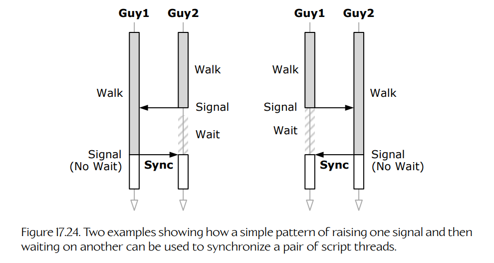

## 17.9 脚本

**脚本语言**（scripting language）可以定义为一种编程语言，其主要目的是允许用户控制并定制某个软件应用程序的行为。例如，Visual Basic 语言可用于定制 Microsoft Excel 的行为；MEL 语言和 Python 语言都可用于定制 Maya 的行为。在游戏引擎语境中，**脚本语言**是一种高级、相对易用的编程语言，它为用户提供了对引擎中大多数常用功能的便捷访问。因此，脚本语言既可以供程序员使用，也可以供非程序员使用，用于开发新游戏，或者定制——也就是“mod”——已有游戏。

### 17.9.1 运行时与数据定义

这里需要谨慎地区分一个重要概念。游戏脚本语言通常有两种类型：

- **数据定义语言。** 数据定义语言的主要目的，是允许用户创建并填充之后由引擎消费的数据结构。这类语言通常是声明式的（见下文），并且会在离线阶段执行或解析，也可能在运行时数据被加载进内存时执行或解析。
- **运行时脚本语言。** 运行时脚本语言旨在运行时于引擎上下文中执行。这类语言通常用于扩展或定制引擎的游戏对象模型和/或其他引擎系统中硬编码的功能。

本节将主要关注使用运行时脚本语言，通过扩展和定制游戏对象模型来实现游戏玩法功能。

### 17.9.2 编程语言特征

在讨论脚本语言时，如果大家先对编程语言术语达成共识，会很有帮助。现有编程语言种类繁多，但大致可以根据相对少数几个标准进行分类。下面简要介绍这些标准：

- **解释型语言与编译型语言。** **编译型语言**的源代码会由一个称为编译器的程序翻译成机器码，然后可以由 CPU 直接执行。相比之下，**解释型语言**的源代码要么在运行时被直接解析，要么被预编译成平台无关的**字节码**（byte code），然后在运行时由**虚拟机**（virtual machine，VM）执行。虚拟机的行为类似于对一台想象中的 CPU 的模拟，而字节码则类似于一组机器语言指令，供这台虚拟 CPU 消费。虚拟机的好处是，它可以相当容易地移植到几乎任何硬件平台，并嵌入到游戏引擎这样的宿主应用程序中。为这种灵活性付出的最大代价是执行速度——虚拟机执行其字节码指令的速度通常比原生 CPU 执行机器语言指令慢得多。
- **命令式语言。** 在命令式语言中，程序由一系列指令描述，每条指令执行一个操作，并且/或者改变内存中数据的状态。C 和 C++ 都是命令式语言。
- **声明式语言。** 声明式语言描述要做**什么**，但并不精确指定结果应该**如何**获得。如何获得结果的决定留给实现该语言的人。Prolog 是声明式语言的一个例子。HTML 和 TeX 这样的标记语言也可以归类为声明式语言。
- **函数式语言。** 函数式语言在技术上是声明式语言的一个子集，其目标是完全避免状态。在函数式语言中，程序由一组函数定义。每个函数产生结果时没有副作用（即除了产生输出数据之外，不会对系统造成可观察的改变）。程序通过将输入数据从一个函数传递到下一个函数来构造，直到生成最终期望的结果。这类语言往往非常适合实现数据处理流水线。由于没有可变状态，函数式语言不需要互斥锁，因此在实现多线程应用程序时也具有明显优势。OCaml、Haskell 和 F# 都是函数式语言的例子。
- **过程式语言与面向对象语言。** 在过程式语言中，程序构造的主要原子是**过程**（procedure，或函数）。这些过程和函数执行操作、计算结果，并且/或者改变内存中各种数据结构的状态。相比之下，面向对象语言的主要程序构造单元是**类**（class），即一种数据结构，它与一组“知道”如何管理和操作该数据结构内部数据的过程/函数紧密耦合。
- **反射式语言。** 在反射式语言中，系统中关于数据类型、数据成员布局、函数以及层级类关系的信息可以在运行时被检查。在非反射式语言中，这类元信息大多只在编译时可知；运行时代码只能看到非常有限的一部分。C# 是反射式语言的一个例子，而 C 和 C++ 则是非反射式语言的例子。

#### 17.9.2.1 游戏脚本语言的典型特征

使游戏**脚本语言**区别于其**原生**编程语言同类的特征包括：

- **解释型。** 大多数游戏脚本语言由虚拟机解释执行，而不是被编译。这种选择是出于灵活性、可移植性和快速迭代的考虑（见下文）。当代码被表示为平台无关的字节码时，引擎可以轻松地把它当作数据来处理。它可以像加载任何其他资源一样被加载进内存，而不需要操作系统的帮助（例如在 PC 平台上使用 DLL，或在 PlayStation 3 上使用 PRX 时通常需要操作系统参与）。因为代码是由虚拟机执行，而不是由 CPU 直接执行，所以游戏引擎在如何以及何时运行脚本代码方面拥有很大的灵活性。
- **轻量。** 大多数游戏脚本语言都是为嵌入式系统中的使用而设计的。因此，它们的虚拟机往往很简单，内存占用也往往很小。
- **支持快速迭代。** 每当原生代码发生变化时，程序必须重新编译并重新链接，而且游戏必须关闭并重新运行，才能看到改动效果（除非你的开发环境支持某种形式的编辑并继续运行）。另一方面，当脚本代码发生变化时，通常可以很快看到改动效果。一些游戏引擎允许脚本代码在游戏运行时动态重新加载，而无需关闭游戏。另一些引擎则要求关闭并重新运行游戏。但无论哪种方式，在游戏中从做出改动到看到效果之间的周转时间，通常都比修改原生语言源代码要快得多。
- **便利且易用。** 脚本语言通常会根据特定游戏的需求进行定制。可以提供一些功能，使常见任务变得简单、直观且更不容易出错。例如，游戏脚本语言可能提供函数或自定义语法，用于按名称查找游戏对象、发送和处理事件、暂停或操纵时间流逝、等待指定时间过去、实现有限状态机、把可调参数暴露给世界编辑器以供游戏设计师使用，甚至处理多人游戏的网络复制。

### 17.9.3 一些常见的游戏脚本语言

在实现运行时游戏脚本系统时，我们需要做出一个基本选择：是选择一种第三方商业或开源语言，并对其进行定制以适应我们的需求，还是从零开始设计并实现一种自定义语言？

从零创建自定义语言通常不值得为此付出麻烦和贯穿整个项目的维护成本。此外，招聘已经熟悉自定义内部语言的游戏设计师和程序员也可能很困难，甚至不可能，因此通常还会有培训成本。不过，这显然是最灵活、最可定制的方法，而这种灵活性有时值得投入。

对于许多工作室而言，更方便的做法是选择一种比较知名且成熟的脚本语言，并用特定于游戏引擎的功能来扩展它。可供选择的第三方脚本语言非常多，其中许多都很成熟和健壮，并且已经在游戏行业内外的大量项目中使用过。

在下面几节中，我们会探讨若干自定义游戏脚本语言，以及一些常被改造后用于游戏引擎的、与游戏无关的语言。

#### 17.9.3.1 QuakeC

Id Software 的 John Carmack 为 *Quake* 实现了一种自定义脚本语言，称为 QuakeC（QC）。这种语言本质上是 C 编程语言的简化变体，并直接挂接到 *Quake* 引擎中。它不支持指针，也不支持定义任意结构体，但它能够以便捷方式操纵 **entities**（*Quake* 对游戏对象的称呼），并且可以用于发送、接收和处理游戏事件。QuakeC 是一种解释型、命令式、过程式编程语言。

QuakeC 交到玩家手中的能力，是催生如今所谓 **mod 社区**的重要因素之一。脚本语言和其他形式的数据驱动定制能力，让玩家能够把许多商业游戏变成各种新的游戏体验——从对原始主题的轻微修改，到完全全新的游戏。

#### 17.9.3.2 UnrealScript

完全自定义脚本语言中最著名的例子，大概是 Unreal Engine 的 UnrealScript。这种语言基于类似 C++ 的语法风格，并支持 C 和 C++ 程序员已经习惯的大多数概念，包括类、局部变量、循环、数组、用于组织数据的结构体、字符串、哈希字符串 id（在 Unreal 中称为 `FName`），以及对象引用（但不支持自由形式指针）。UnrealScript 是一种解释型、命令式、面向对象语言。

Epic 已不再支持 UnrealScript 语言。开发者现在要么通过 Blueprints 图形化“脚本”系统定制游戏行为，要么编写 C++ 代码。

#### 17.9.3.3 Lua

Lua 是一种知名且流行的脚本语言，很容易集成到游戏引擎这样的应用程序中。Lua 网站 [392] 称该语言为“游戏中领先的脚本语言”。

根据 Lua 网站的说法，Lua 的主要优点包括：

- **健壮且成熟。** Lua 已被用于大量商业产品，包括 Adobe 的 *Photoshop Lightroom*，以及许多游戏，包括 *World of Warcraft*。
- **文档良好。** Lua 的参考手册 [26] 完整且易懂，并且可在线获得，也有书籍形式。已有多本关于 Lua 的书籍，包括 [27] 和 [56]。
- **优秀的运行时性能。** Lua 执行字节码的速度和效率高于许多其他脚本语言。
- **可移植。** Lua 开箱即可运行在各种 Windows 和 UNIX、移动设备以及嵌入式微处理器上。Lua 以可移植方式编写，因此很容易适配新的硬件平台。
- **为嵌入式系统设计。** Lua 的内存占用很小（解释器和所有库约为 350 KiB）。
- **简单、强大且可扩展。** Lua 核心语言非常小且简单，但它被设计为支持元机制，使其核心功能可以几乎无限地扩展。例如，Lua 本身并不是面向对象语言，但 OOP 支持可以通过元机制添加，而且已经被添加过。
- **免费。** Lua 是开源的，并根据非常宽松的 MIT 许可证发布。

Lua 是一种动态类型语言，这意味着变量没有类型——只有值有类型。（每个值都携带其类型信息。）Lua 的主要数据结构是 **table**，也称为关联数组。table 本质上是一组键值对，并具有通过键索引数组的优化能力。

Lua 为 C 语言提供了一个便捷接口——Lua 虚拟机可以像调用和操作 Lua 自身编写的函数一样，调用和操作用 C 编写的函数。

Lua 将代码块（称为 **chunks**）视为一等对象，可以由 Lua 程序本身操作。代码可以以源代码格式执行，也可以以预编译字节码格式执行。这允许虚拟机执行一个包含 Lua 代码的字符串，就好像这些代码被编译进原始程序一样。Lua 还支持一些强大的高级编程结构，包括**协程**（coroutines）。这是协作式多任务的一种简单形式，其中每个线程必须显式把 CPU 让出给其他线程，而不是像抢占式多线程系统那样被时间片切分。

Lua 也确实有一些陷阱。例如，它灵活的函数绑定机制使重新定义一个重要全局函数（如 `sin()`）以执行完全不同的任务成为可能，而且相当容易做到（这通常并不是人们想要的）。但总体而言，Lua 已证明自己是作为游戏脚本语言的优秀选择。

#### 17.9.3.4 Python

Python 是一种过程式、面向对象、动态类型脚本语言，其设计目标是易用性、易于与其他编程语言集成以及灵活性。和 Lua 一样，Python 也是游戏脚本语言的常见选择。根据 Python 官方网站 [393]，Python 的一些最佳特性包括：

- **清晰且可读的语法。** Python 代码易于阅读，部分原因在于其语法强制采用特定缩进风格。（它实际上会解析用于缩进的空白，以确定每行代码的作用域。）
- **反射式语言。** Python 包含强大的运行时内省机制。Python 中的类是一等对象，这意味着它们可以在运行时像任何其他对象一样被操作和查询。
- **面向对象。** Python 相比 Lua 的一个优势是，OOP 被内建在核心语言中。这使 Python 与游戏对象模型的集成稍微容易一些。
- **模块化。** Python 支持层级包，鼓励清晰的系统设计和良好的封装。
- **基于异常的错误处理。** 与非异常式语言中的类似代码相比，异常使 Python 中的错误处理代码更简单、更优雅，也更局部化。
- **广泛的标准库和第三方模块。** Python 库几乎覆盖了能想象到的所有任务。（真的！）
- **可嵌入。** Python 可以很容易地嵌入到游戏引擎这样的应用程序中。
- **丰富的文档。** Python 有大量文档和教程，包括在线资源和书籍形式。

Python 语法在许多方面让人联想到 C（例如，它使用 `=` 操作符进行赋值，使用 `==` 进行相等性测试）。不过，在 Python 中，**代码缩进**是定义**作用域**的唯一方式（与 C 使用开闭花括号相对）。Python 的主要数据结构是 **list**——一种线性索引的原子值或其他嵌套列表序列——以及 **dictionary**——一种键值对表。这两种数据结构都可以持有彼此的实例，从而很容易构造任意复杂的数据结构。此外，**class**——数据元素和函数的统一集合——直接内建在语言中。

Python 支持**鸭子类型**（duck typing）。这是一种动态类型风格，其中对象的函数接口决定其类型，而不是由静态继承层级定义。换句话说，任何支持某个特定接口的类（即一组具有特定签名的函数）都可以与任何其他支持相同接口的类互换使用。这是一个强大的范式：实际上，Python 支持不需要继承的多态。鸭子类型在某些方面类似于 C++ 模板元编程，不过可以说它更灵活，因为调用方和被调用方之间的绑定是在运行时动态形成的。鸭子类型这个名称来自一句广为人知的话（归因于 James Whitcomb Riley）：“如果它走起来像鸭子，叫起来像鸭子，我就叫它鸭子。”关于鸭子类型的更多信息见 [394]。

总之，Python 易用易学，容易嵌入游戏引擎，与游戏对象模型集成良好，并且可以成为一种优秀而强大的游戏脚本语言。

#### 17.9.3.5 Pawn（Small-C）

*Pawn* 是一种轻量级、动态类型、类 C 的脚本语言，由 Marc Peter 创建。该语言以前称为 *Small*，而 *Small* 本身则是 Ron Cain 和 James Hendrix 编写的早期 C 语言子集 *Small-C* 的演化版本。它是一种解释型语言——源代码被编译成字节码（也称为 P-code），然后在运行时由虚拟机解释执行。

Pawn 被设计为具有较小内存占用，并能够非常快速地执行其字节码。与 C 不同，Pawn 的变量是动态类型的。Pawn 还支持有限状态机，包括状态局部变量。这一独特特性使其非常适合许多游戏应用。Pawn 有良好的在线文档 [395]。Pawn 是开源的，并且可以在 Zlib/libpng 许可证 [396] 下免费使用。

Pawn 的类 C 语法使任何 C/C++ 程序员都容易学习，并且易于与用 C 编写的游戏引擎集成。它的有限状态机支持对游戏编程非常有用。它已被成功用于若干游戏项目，包括 Midway 的 *Freaky Flyers*。Pawn 已证明自己是一种可行的游戏脚本语言。

### 17.9.4 脚本架构

脚本代码可以在游戏引擎中扮演各种角色。可能的架构范围很广：从代表某个对象或引擎系统执行简单函数的小段脚本代码，到管理整个游戏运行的高级脚本。下面列出一些可能的架构：

- **脚本化回调。** 在这种方法中，引擎功能大部分用原生编程语言硬编码，但某些关键功能片段被设计为可定制。这通常通过**钩子函数**（hook function）或**回调**（callback）实现——即由用户提供的函数，引擎调用它是为了允许用户进行定制。钩子函数当然可以用原生语言编写，但也可以用脚本语言编写。例如，在游戏循环中更新游戏对象时，引擎可能会调用一个可选的回调函数，该函数可以用脚本编写。这给了用户一个机会，可以定制游戏对象随时间更新自身的方式。
- **脚本化事件处理器。** 事件处理器实际上只是一种特殊类型的钩子函数，其目的是允许游戏对象响应游戏世界中的某些相关事件（例如响应一次爆炸发生），或响应引擎自身内部的事件（例如响应内存耗尽条件）。许多游戏引擎允许用户用脚本编写事件处理器钩子，也允许用原生语言编写。
- **用脚本扩展游戏对象类型，或定义新的游戏对象类型。** 一些脚本语言允许通过脚本扩展已经用原生语言实现的游戏对象类型。实际上，回调和事件处理器就是这种思想的小规模例子，但这个思想可以进一步扩展，甚至允许完全新的游戏对象类型在脚本中定义。这可以通过**继承**完成（即从原生语言编写的类派生出脚本编写的类），也可以通过**组合**完成（即把一个脚本类实例附加到原生游戏对象上）。
- **脚本化组件或属性。** 在基于组件或属性的游戏对象模型中，允许新的组件或属性对象部分或完全用脚本构造，是很合理的。Gas Powered Games 在 *Dungeon Siege* 中使用了这种方法。其游戏对象模型是基于属性的，并且可以用 C++ 或 Gas Powered Games 的自定义脚本语言 Skrit [397] 来实现属性。到项目结束时，它们大约有 148 种脚本化属性类型和 21 种原生 C++ 属性类型。
- **脚本驱动的引擎。** 脚本可能被用来驱动整个引擎系统。例如，游戏对象模型理论上可以完全用脚本编写，只有在需要底层引擎组件服务时才调用原生引擎代码。
- **脚本驱动的游戏。** 一些游戏引擎实际上会把原生语言和脚本语言之间的关系颠倒过来。在这些引擎中，脚本代码负责掌控整个流程，而原生引擎代码仅仅作为一个库存在，供脚本调用以访问引擎的某些高速功能。Panda3D 引擎 [398] 就是这种架构的一个例子。Panda3D 游戏可以完全用 Python 语言编写，而原生引擎（用 C++ 实现）则像一个由脚本代码调用的库。（Panda3D 游戏也可以完全用 C++ 编写。）

### 17.9.5 运行时游戏脚本语言的功能

许多游戏脚本语言的主要目的是实现游戏玩法功能，而这通常通过增强和定制游戏对象模型来完成。在本节中，我们将探讨这类脚本系统最常见的一些需求和功能。

#### 17.9.5.1 与原生编程语言接口

为了让脚本语言有用，它不能在真空中运行。游戏引擎必须能够执行脚本代码，而且通常同样重要的是，脚本代码也必须能够在引擎中发起操作。

运行时脚本语言的虚拟机（VM）通常嵌入在游戏引擎中。引擎初始化虚拟机，在需要时运行脚本代码，并管理这些脚本的执行。执行单元会根据语言细节和游戏实现而变化。

- 在函数式脚本语言中，**函数**通常是主要执行单元。为了让引擎调用脚本函数，它必须查找与期望函数名称对应的字节码，并生成一个虚拟机来执行它（或指示现有 VM 执行它）。
- 在面向对象脚本语言中，**类**通常是主要执行单元。在这样的系统中，对象可以被生成和销毁，并且可以在各个类实例上调用方法（成员函数）。

通常让脚本和原生代码之间支持双向通信是有益的。因此，大多数脚本语言也允许从脚本调用原生代码。具体细节因语言和实现而异，但基本方法通常是允许某些脚本函数用原生语言实现，而不是用脚本语言实现。为了调用引擎函数，脚本代码只需发起一个普通函数调用。虚拟机检测到该函数具有原生实现，查找对应原生函数的地址（可能通过名称，也可能通过某种其他唯一函数标识符），然后调用它。例如，Python 类或模块中的部分或全部成员函数可以使用 C 函数实现。Python 维护一个称为**方法表**（method table）的数据结构，它把每个 Python 函数的名称（表示为字符串）映射到实现该函数的 C 函数地址。

**案例研究：Naughty Dog 的 DCScript 语言。**

作为例子，我们简要看看 Naughty Dog 的运行时脚本语言 DCScript 是如何集成到引擎中的。DC 代表 “data compiler”。它是 Naughty Dog 用来构建供引擎消费的各种数据的工具。编译后的 DCScript 程序只是 DC 输出的众多数据类型之一。

DC 本身和 DCScript 都是 Scheme 语言的变体（Scheme 本身又是 Lisp 语言的一个变体）。DCScript 中的可执行代码块称为 **script lambdas**，它们大致等价于 Lisp 语言家族中的函数或代码块。DCScript 程序员会编写 script lambdas，并通过给它们赋予全局唯一名称来标识它们。DC 编译器会把这些 script lambdas 转换成字节码块；游戏运行时，这些字节码会被加载进内存，并且可以通过 C++ 中一个简单的函数式接口按名称查找。

一旦引擎获得了指向某个 script lambda 字节码块的指针，它就可以通过调用引擎中的“虚拟机执行”函数并把字节码指针传入其中来执行该代码。这个函数本身出人意料地简单。它在循环中运行，逐条读取字节码指令，并执行每条指令。当所有指令都执行完毕后，函数返回。

虚拟机包含一组寄存器，这些寄存器可以保存脚本想要处理的任何类型的数据。这是通过一种 **variant** 数据类型实现的——也就是所有数据类型的联合体（关于 variant 的讨论见 Section 17.8.4）。有些指令会使数据被加载到寄存器中；其他指令会使寄存器中保存的数据被查找并使用。语言中所有数学运算都有相应指令，也有执行条件检查的指令——即 DCScript 的 `(if ...)`、`(when ...)` 和 `(cond ...)` 指令的实现，等等。

虚拟机还支持**函数调用栈**（function call stack）。DCScript 中的 script lambdas 可以调用其他由脚本程序员通过 DC 的 `(defun ...)` 语法定义的 script lambdas（即函数）。就像任何过程式编程语言一样，当一个函数调用另一个函数时，需要一个栈来跟踪寄存器状态和返回地址。在 DCScript 虚拟机中，调用栈字面上就是一个寄存器组栈——每个新函数都会获得自己的私有寄存器组。这样就不必先保存寄存器状态、调用函数、再在被调用函数返回后恢复寄存器。当虚拟机遇到一条字节码指令，指示它调用另一个 script lambda 时，会按名称查找该 script lambda 的字节码，压入一个新的栈帧，然后从该 script lambda 的第一条指令继续执行。当虚拟机遇到返回指令时，栈帧会从栈中弹出，同时弹出返回“地址”（实际上只是调用该函数的 script lambda 中，在调用指令之后那条字节码指令的索引）。

下面的伪代码可以让你感受 DCScript 虚拟机的核心指令处理循环大概是什么样子：

    void DcExecuteScript(DCByteCode* pCode)
    {
        DCStackFrame* pCurStackFrame
            = DcPushStackFrame(pCode);

        // Keep going until we run out of stack frames (i.e.,
        // the top-level script lambda "function" returns).
        while (pCurStackFrame != nullptr)
        {
            // Get the next instruction. We will never run
            // out, because the return instruction is always
            // last, and it will pop the current stack frame
            // below.
            DCInstruction& instr
                = pCurStackFrame->GetNextInstruction();

            // Perform the operation of the instruction.
            switch (instr.GetOperation())
            {
            case DC_LOAD_REGISTER_IMMEDIATE:
                {
                    // Grab the immediate value to be loaded
                    // from the instruction.
                    Variant& data = instr.GetImmediateValue();

                    // Also determine into which register to
                    // put it.
                    U32 iReg = instr.GetDestRegisterIndex();

                    // Grab the register from the stack frame.
                    Variant& reg
                        = pCurStackFrame->GetRegister(iReg);

                    // Store the immediate data into the
                    // register.
                    reg = data;
                }
                break;

            // Other load and store register operations...

            case DC_ADD_REGISTERS:
                {
                    // Determine the two registers to add. The
                    // result will be stored in register A.
                    U32 iRegA = instr.GetDestRegisterIndex();
                    U32 iRegB = instr.GetSrcRegisterIndex();

                    // Grab the 2 register variants from the
                    // stack.
                    Variant& dataA
                        = pCurStackFrame->GetRegister(iRegA);

                    Variant& dataB
                        = pCurStackFrame->GetRegister(iRegB);

                    // Add the registers and store in
                    // register A.
                    dataA = dataA + dataB;
                }
                break;

            // Other math operations...

            case DC_CALL_SCRIPT_LAMBDA:
                {
                    // Determine in which register the name of
                    // the script lambda to call is stored.
                    // (Presumably it was loaded by a previous
                    // load instr.)
                    U32 iReg = instr.GetSrcRegisterIndex();

                    // Grab the appropriate register, which
                    // contains the name of the lambda to call.
                    Variant& lambda
                        = pCurStackFrame->GetRegister(iReg);

                    // Look up the byte code of the lambda by
                    // name.
                    DCByteCode* pCalledCode
                        = DcLookUpByteCode(lambda.AsStringId());

                    // Now "call" the lambda by pushing a new
                    // stack frame.
                    if (pCalledCode)
                    {
                        pCurStackFrame
                            = DcPushStackFrame(pCalledCode);
                    }
                }
                break;

            case DC_RETURN:
                {
                    // Just pop the stack frame. If we're in
                    // the top lambda on the stack, this
                    // function will return nullptr, and the
                    // loop will terminate.
                    pCurStackFrame = DcPopStackFrame();
                }
                break;

            // Other instructions...

                // ...

            } // end switch
        } // end while
    }

在上面的例子中，我们假设全局函数 `DcPushStackFrame()` 和 `DcPopStackFrame()` 会以某种合适方式为我们管理寄存器组栈，并且全局函数 `DcLookUpByteCode()` 能够按名称查找任意 script lambda。这里不会展示这些函数的实现，因为这个例子的目的只是展示脚本虚拟机的内层循环可能如何工作，而不是提供一个完整可用的实现。

DCScript 的 script lambdas 也可以调用原生函数——即用 C++ 编写的全局函数，它们作为挂接到引擎本身的钩子。当虚拟机遇到一条调用原生函数的指令时，会使用一个由引擎程序员硬编码的全局表，按名称查找该 C++ 函数的地址。如果找到了合适的 C++ 函数，就从当前栈帧中的寄存器取出函数参数，然后调用该函数。这意味着 C++ 函数的参数总是 `Variant` 类型。如果 C++ 函数返回一个值，它也必须是 `Variant`，并且该值会被存储到当前栈帧中的一个寄存器里，以供后续指令可能使用。

全局函数表可能看起来像这样：

    typedef Variant DcNativeFunction(U32 argCount,
                                     Variant* aArgs);

    struct DcNativeFunctionEntry
    {
        StringId              m_name;
        DcNativeFunction*     m_pFunc;
    };

    DcNativeFunctionEntry g_aNativeFunctionLookupTable[] =
    {
        { SID("get-object-pos"), DcGetObjectPos },
        { SID("animate-object"), DcAnimateObject },
        // etc.
    };

原生 DCScript 函数的实现可能类似如下。注意，`Variant` 参数作为数组传递给函数。该函数必须验证传给它的参数数量是否等于它所期望的参数数量。它还必须验证参数类型是否符合预期，并准备好处理 DCScript 程序员调用该函数时可能犯下的错误。在 Naughty Dog，我们编写了一个参数迭代器，它允许我们以便捷方式逐个提取并验证参数。

    Variant DcGetObjectPos(U32 argCount, Variant* aArgs)
    {
        // Argument iterator expecting at most 2 args.
        DcArgIterator args(argCount, aArgs, 2);

        // Set up a default return value.
        Variant result;
        result.SetAsVector(Vector(0.0f, 0.0f, 0.0f));

        // Use iterator to extract the args. It flags missing
        // or invalid arguments as errors automatically.
        StringId objectName = args.NextStringId();
        Point* pDefaultPos = args.NextPoint(kDcOptional);

        GameObject* pObject
            = GameObject::LookUpByName(objectName);
        if (pObject)
        {
            result.SetAsVector(pObject->GetPosition());
        }
        else
        {
            if (pDefaultPos)
            {
                result.SetAsVector(*pDefaultPos);
            }
            else
            {
                DcErrorMessage("get-object-pos: "
                               "Object '%s' not found.\n",
                               objectName.ToDebugString());
            }
        }

        return result;
    }

注意，函数 `StringId::ToDebugString()` 会执行反向查找，把字符串 id 转回其原始字符串。这要求游戏引擎维护某种数据库，将每个字符串 id 映射到其原始字符串。在开发过程中，这样的数据库可以让生活轻松很多；但由于它会消耗大量内存，因此在最终发布产品中应该省略该数据库。（函数名 `ToDebugString()` 提醒我们，从字符串 id 反向转换回字符串只应出于调试目的执行——游戏本身绝不能依赖这一功能！）

#### 17.9.5.2 游戏对象引用

脚本函数经常需要与游戏对象交互，而这些游戏对象本身可能部分或完全由引擎的原生语言实现。原生语言引用对象的机制（例如 C++ 中的指针或引用）在脚本语言中未必有效。（例如，脚本语言可能根本不支持指针。）因此，我们需要想出某种可靠方式，让脚本代码引用游戏对象。

有许多方式可以做到这一点。一种方法是在脚本中通过不透明的数字**句柄**（handles）引用对象。脚本代码可以通过多种方式获得对象句柄。句柄可能由引擎传递给它，也可能通过某种查询获得，例如请求玩家半径内所有游戏对象的句柄，或查找与某个特定对象名称对应的句柄。然后，脚本可以通过调用原生函数并把对象句柄作为参数传入，来对该游戏对象执行操作。在原生语言一侧，句柄会被转换回指向原生对象的指针，然后即可适当地操作该对象。

数字句柄的优点是简单，并且在任何支持整数数据的脚本语言中都应该容易支持。不过，它们可能不直观，也难以使用。另一种替代方法是使用对象名称作为句柄，以字符串表示。与数字句柄技术相比，这有一些有趣的好处。首先，字符串是人类可读的，并且使用起来很直观。它与游戏世界编辑器中的对象名称存在直接对应关系。此外，我们还可以选择保留某些特殊对象名称，并赋予它们“魔法”含义。例如，在 Naughty Dog 的脚本语言中，保留名称 `"self"` 总是指代当前正在运行的脚本所附加到的对象。这允许游戏设计师编写一个脚本，把它附加到游戏中的某个对象上，然后仅仅通过编写 `(animate 'self name-of-animation)`，就可以让该脚本在该对象上播放动画。

当然，使用字符串作为对象句柄也有其陷阱。字符串通常比整数 id 占用更多内存。并且由于字符串长度各不相同，复制它们时需要动态内存分配。字符串比较也很慢。脚本程序员在输入游戏对象名称时容易犯错，这可能导致 bug。此外，如果有人在游戏世界编辑器中修改了某个对象的名称，却忘记更新脚本中该对象的名称，脚本代码也可能被破坏。

哈希字符串 id 通过把任意字符串（无论长度如何）转换成整数，克服了这些问题中的大部分。理论上，哈希字符串 id 同时拥有两者的优点——用户可以像读字符串一样读取它们，但它们具有整数的运行时性能特征。不过，要让这种方法生效，脚本语言需要以某种方式支持哈希字符串 id。理想情况下，我们希望脚本编译器替我们把字符串转换成哈希 id。这样，运行时代码完全不必处理字符串，只处理哈希 id（除了可能出于调试目的——在调试器中能够看到哈希 id 对应的字符串是很方便的）。不过，并非所有脚本语言都总是能做到这一点。另一种方法是允许用户在脚本中使用字符串，并且每当调用原生函数时，在运行时把它们转换成哈希 id。

Naughty Dog 的 DCScript 脚本语言利用 Scheme 编程语言原生支持的 **symbols** 概念来编码其字符串 id。在 DC/Scheme 中写 `'foo`——或者更冗长地写 `(quote foo)`——对应于 C++ 中的字符串 id `SID("foo")`。

#### 17.9.5.3 在脚本中接收并处理事件

事件是大多数游戏引擎中无处不在的通信机制。通过允许事件处理函数用脚本编写，我们开启了一条强大的途径，用于定制游戏中硬编码的行为。

事件通常被发送给单个对象，并在该对象的上下文中处理。因此，脚本化事件处理器需要以某种方式与对象关联。一些引擎使用游戏对象类型系统来实现这一点——脚本化事件处理器可以按对象类型注册。这允许不同类型的游戏对象以不同方式响应同一事件，同时确保同一类型的所有实例以一致且统一的方式响应。事件处理函数本身可以是简单脚本函数；如果脚本语言是面向对象的，它们也可以是类成员。无论哪种情况，事件处理器通常会被传入一个指向事件所发送到的特定对象的句柄，这很像 C++ 成员函数会被传入 `this` 指针。

在其他引擎中，脚本化事件处理器与单独对象实例关联，而不是与对象类型关联。在这种方法中，同一类型的不同实例可能会对同一事件作出不同响应。

当然，还有各种其他可能性。例如，在 Naughty Dog 的引擎中（用于创建 *Uncharted* 和 *The Last of Us* 系列），脚本本身就是对象。它们可以与单独游戏对象关联，也可以附加到区域体（用于触发游戏事件的凸体积）上，或者作为独立对象存在于游戏世界中。每个脚本可以有多个状态（也就是说，在 Naughty Dog 引擎中，脚本是有限状态机）。反过来，每个状态可以有一个或多个事件处理代码块。当游戏对象接收到事件时，它可以选择用原生 C++ 处理该事件。它还会检查是否存在附加的脚本对象；如果找到，事件会被发送给该脚本的当前状态。如果该状态有针对该事件的事件处理器，就会调用它。否则，脚本会简单地忽略该事件。

#### 17.9.5.4 发送事件

允许脚本处理由引擎生成的游戏事件，当然是一项强大功能。更强大的是，允许从脚本代码生成并发送事件，无论是发送回引擎，还是发送给其他脚本。

理想情况下，我们希望不仅能够从脚本发送预定义类型的事件，还能够在脚本中定义全新的事件类型。如果事件类型是字符串或字符串 id，那么实现这一点非常简单。为了定义新事件类型，脚本程序员只需要想出一个新的事件类型名称，并把它输入到脚本代码中。这可以成为一种高度灵活的方式，让脚本彼此通信。脚本 A 可以定义一种新事件类型并将其发送给脚本 B。如果脚本 B 为该类型事件定义了事件处理器，我们就实现了一种让脚本 A 与脚本 B “交谈”的简单方式。在一些游戏引擎中，事件或消息传递是脚本中唯一支持的对象间通信方式。这可以是一种优雅而强大、灵活的解决方案。

#### 17.9.5.5 面向对象脚本语言

一些脚本语言天生是面向对象的。另一些并不直接支持对象，但提供了一些机制，可用于实现类和对象。在许多引擎中，游戏玩法通过某种面向对象的游戏对象模型实现。因此，在脚本中允许某种形式的面向对象编程也是合理的。

**在脚本中定义类。**

类实际上只是一堆数据和一些相关函数。因此，任何允许定义新数据结构，并提供某种存储和操作函数方式的脚本语言，都可以用于实现类。例如，在 Lua 中，可以用一个 table 构建类，其中存储数据成员和成员函数。

**脚本中的继承。**

面向对象语言并不一定支持继承。不过，如果这一特性可用，它会非常有用，就像它在 C++ 这样的原生编程语言中一样。

在游戏脚本语言语境中，有两种继承：从其他脚本类派生脚本类，以及从原生类派生脚本类。如果脚本语言是面向对象的，前者很可能开箱即用。然而，即使脚本语言支持继承，后者也很难实现。问题在于要弥合两种语言和两种底层对象模型之间的鸿沟。这里不会深入讨论它可能如何实现，因为实现必然取决于正在集成的那一对语言。UnrealScript 是我遇到过的唯一一种能够以无缝方式允许脚本类从原生类派生的脚本语言。

**脚本中的组合/聚合。**

我们并不需要依赖继承来扩展类层级——也可以使用组合或聚合来达到类似效果。因此，在脚本中，我们真正需要的是一种方式，用于定义类，并把这些类的实例与原生编程语言中定义的对象关联起来。例如，游戏对象可以保存一个指针或引用，指向一个完全用脚本编写的可选组件。我们可以把某些关键功能委托给该脚本组件（如果它存在的话）。该脚本组件可能拥有一个 `Update()` 函数，每当游戏对象被更新时都会调用该函数；该脚本组件也可以被允许把其部分成员函数/方法注册为事件处理器。当事件被发送给游戏对象时，它会在脚本组件上调用适当的事件处理器，从而给脚本程序员一个机会，修改或扩展这个原生实现的游戏对象的行为。

#### 17.9.5.6 脚本化有限状态机

游戏编程中的许多问题都可以很自然地使用**有限状态机**（finite state machines，FSMs）解决。因此，一些引擎会把 FSM 概念直接构建到核心游戏对象模型中。在这样的引擎中，每个游戏对象可以拥有一个或多个状态，而且是这些状态——而不是游戏对象本身——包含更新函数、事件处理函数等。简单游戏对象可以通过定义单个状态来创建，而更复杂的游戏对象则可以自由定义多个状态，每个状态具有不同的更新和事件处理行为。

如果你的引擎支持状态驱动的游戏对象模型，那么在脚本语言中提供有限状态机支持也是非常合理的。当然，即使核心游戏对象模型并不原生支持有限状态机，也仍然可以通过脚本侧的状态机来提供状态驱动行为。FSM 可以通过使用类实例表示状态，在任何编程语言中实现；但某些脚本语言专门为此目的提供了工具。面向对象脚本语言可能提供自定义语法，允许一个类包含多个状态；也可能提供工具，帮助脚本程序员轻松地把状态对象聚合到一个中央 hub 对象中，然后以直接方式把更新和事件处理函数委托给它。但即使你的脚本语言没有提供这类功能，也总可以采用一种实现 FSM 的方法论，并在编写的每个脚本中遵循这些约定。

#### 17.9.5.7 多线程脚本

能够并行执行多个脚本通常很有用。在当今高度并行化的硬件架构上尤其如此。如果多个脚本可以同时运行，那么实际上我们就在脚本代码中提供了**并行执行线程**，很像大多数多任务操作系统提供的线程。当然，脚本未必真的并行运行——如果它们都运行在单个 CPU 上，CPU 就必须轮流执行每个脚本。不过，从脚本程序员的视角看，这一范式就是并行编程。

大多数提供并行性的脚本系统，都是通过**协作式多任务**（cooperative multitasking）来实现的。这意味着脚本会一直执行，直到它显式让出执行权给另一个脚本。这不同于**抢占式多任务**（preemptive multitasking），后者中任何脚本的执行都可以在任意时刻被中断，以允许另一个脚本执行。

脚本中实现协作式多任务的一种简单方法，是允许脚本显式进入睡眠状态，等待某个相关事件发生。脚本可能等待指定秒数过去，也可能等待直到接收到某个特定事件。它还可能等待直到另一个执行线程到达预定义的同步点。无论原因是什么，每当脚本进入睡眠状态时，它都会把自己放入睡眠脚本线程列表，并告诉虚拟机可以开始执行另一个符合条件的脚本。系统会跟踪能够唤醒每个睡眠脚本的条件——当其中某个条件变为真时，等待该条件的一个或多个脚本会被唤醒，并允许继续执行。

为了了解它在实践中如何工作，我们来看一个多线程脚本示例。这个脚本管理两个角色和一扇门的动画。两个角色被指示走到门前——每个人到达门前所需的时间可能不同且不可预测。当它们等待角色到达门前时，我们会让脚本线程进入睡眠状态。一旦两人都到达门前，其中一个角色会打开门，方式是播放一个“open door”动画。注意，我们不希望把动画持续时间硬编码到脚本本身中。这样，如果动画师修改了该动画，我们就不必回头修改脚本。因此，我们会再次让线程进入睡眠状态，等待动画完成。下面展示了一个完成这一任务的脚本，它使用一种简单的类 C 伪代码语法。

    procedure DoorCinematic()
    {
        thread Guy1()
        {
            // Ask guy1 to walk to the door.
            CharacterWalkToPoint(guy1, doorPosition);

            // Go to sleep until he gets there.
            WaitUntil(CHARACTER_ARRIVAL);

            // OK, we're there. Tell the other threads
            // via a signal.
            RaiseSignal("Guy1Arrived");

            // Wait for the other guy to arrive as well.
            WaitUntil(SIGNAL, "Guy2Arrived");

            // Now tell guy1 to play the "open door"
            // animation.
            CharacterAnimate(guy1, "OpenDoor");
            WaitUntil(ANIMATION_DONE);

            // OK, the door is open. Tell the other threads.
            RaiseSignal("DoorOpen");

            // Now walk thru the door.
            CharacterWalkToPoint(guy1, beyondDoorPosition);
        }

        thread Guy2()
        {
            // Ask guy2 to walk to the door.
            CharacterWalkToPoint(guy2, doorPosition);

            // Go to sleep until he gets there.
            WaitUntil(CHARACTER_ARRIVAL);

            // OK, we're there. Tell the other threads
            // via a signal.
            RaiseSignal("Guy2Arrived");

            // Wait for the other guy to arrive as well.
            WaitUntil(SIGNAL, "Guy1Arrived");

            // Now wait until guy1 opens the door for me.
            WaitUntil(SIGNAL, "DoorOpen");

            // OK, the door is open. Now walk thru the door.
            CharacterWalkToPoint(guy2, beyondDoorPosition);
        }
    }

在上面的例子中，我们假设这个假想脚本语言提供了一种简单语法，用于在单个函数内部定义执行线程。我们定义了两个线程，一个用于 Guy1，一个用于 Guy2。

Guy1 的线程会让该角色走到门前，然后进入睡眠状态等待他的到达。这里我们稍微做了一些简化，但可以想象，这种脚本语言神奇地允许线程进入睡眠状态，直到游戏中的某个角色抵达此前被要求前往的目标点。现实中，这可能通过让角色向脚本发送一个事件来实现，然后在线程收到该事件时唤醒线程。

一旦 Guy1 到达门前，他的线程会做两件值得进一步说明的事情。第一，它触发一个名为 `"Guy1Arrived"` 的信号。第二，它进入睡眠状态，等待另一个名为 `"Guy2Arrived"` 的信号。如果观察 Guy2 的线程，可以看到类似模式，只是方向相反。这种先触发一个信号、再等待另一个信号的模式，用于同步两个线程。

在这个假想脚本语言中，**信号**（signal）只是一个带名称的布尔标志。该标志初始为 false，但当线程调用 `RaiseSignal(name)` 时，具有该名称的标志值会变为 true。其他线程可以进入睡眠状态，等待某个特定命名信号变为 true。当它变为 true 时，睡眠线程就会被唤醒并继续执行。在这个例子中，两个线程使用 `"Guy1Arrived"` 和 `"Guy2Arrived"` 信号彼此同步。

**Figure 17.24.** 两个示例展示了一种简单模式：先触发一个信号，再等待另一个信号，可以用来同步一对脚本线程。

每个线程都会触发自己的信号，然后等待另一个线程的信号。哪个信号先被触发并不重要——只有当两个信号都已被触发后，这两个线程才会被唤醒。并且当它们被唤醒时，它们会处于完美同步状态。Figure 17.24 展示了两种可能情况：一种是 Guy1 先到达，另一种是 Guy2 先到达。可以看到，信号被触发的顺序无关紧要；在线程最终被唤醒时，它们总是在两个信号都已被触发之后同步起来。
